# Google Cloud Professional Cloud Network Engineer 試験対策ガイド
## Section 1: Designing and planning a Google Cloud VPC network(VPCネットワークの設計と計画)

> 対象読者:中級者〜上級者(Associate Cloud Engineer相当の実務経験、または他クラウドでのネットワーク設計経験がある方)
> 出題比率:Section 1は試験全体の**約21**%を占め、6セクション中最大の配点を持つ最重要領域です。

---

## この章について

Google Cloud Professional Cloud Network Engineer(PCNE)認定試験は、VPCの構築・運用だけでなく、**要件に対して適切なネットワークアーキテクチャを設計できるか**を問う試験です。Section 1はその中でも「実装する前に何を決めるべきか」という設計判断力を測るセクションであり、以下の4つのタスクに分かれています。

| タスク | 内容 | 主なキーワード |
|---|---|---|
| 1.1 | 全体的なネットワークアーキテクチャの設計 | ネットワーク階層、HA/DR、DNSトポロジ、ロードバランサ選定、GKE計画、IAM、マネージドサービス接続、上限 |
| 1.2 | VPCネットワークの設計 | Standalone/Shared VPC、VPC Peering、NCC、IPAM、MTU、サードパーティアプライアンス |
| 1.3 | 耐障害性・高性能なハイブリッド/マルチクラウドネットワークの設計 | Interconnect、Cloud VPN、Cross-Cloud Interconnect、Peering各種、ハイブリッドDNS、MACsec |
| 1.4 | GKE向けの設計 | パブリック/プライベートクラスタ、コントロールプレーンアクセス、IPアドレス計画、GKE LB |

本ガイドはこの4タスクを公式Exam Guideの記載順に沿って、それぞれの設計判断のポイントとベストプラクティスをステップバイステップで解説します。ASCII図は使用せず、すべての図解はMermaidダイアグラム、比較情報はMarkdownテーブルで表現しています。

---

## 目次

1. [試験全体における本セクションの位置づけ](#試験全体における本セクションの位置づけ)
2. [1.1 全体的なネットワークアーキテクチャの設計](#11-全体的なネットワークアーキテクチャの設計)
   - [1.1.1 ネットワークサービス階層(Premium Tier / Standard Tier)](#111-ネットワークサービス階層premium-tier--standard-tier)
   - [1.1.2 高可用性・フェイルオーバー・DR・スケールの設計](#112-高可用性フェイルオーバーdrスケールの設計)
   - [1.1.3 DNSトポロジの設計](#113-dnsトポロジの設計)
   - [1.1.4 ロードバランサの選定](#114-ロードバランサの選定)
   - [1.1.5 GKEネットワーキングの計画](#115-gkeネットワーキングの計画)
   - [1.1.6 IAMロールの設計](#116-iamロールの設計)
   - [1.1.7 マネージドサービスへの接続計画](#117-マネージドサービスへの接続計画)
   - [1.1.8 割り当て(Quota)と上限の計画](#118-割り当てquotaと上限の計画)
3. [1.2 VPCネットワークの設計](#12-vpcネットワークの設計)
   - [1.2.1 VPCの種類と数の選択](#121-vpcの種類と数の選択)
   - [1.2.2 ネットワーク間接続方式の決定](#122-ネットワーク間接続方式の決定)
   - [1.2.3 IPアドレス管理(IPAM)戦略](#123-ipアドレス管理ipam戦略)
   - [1.2.4 グローバル/リージョナルネットワーク環境の計画](#124-グローバルリージョナルネットワーク環境の計画)
   - [1.2.5 MTUサイジング](#125-mtuサイジング)
   - [1.2.6 サードパーティアプライアンスの挿入](#126-サードパーティアプライアンスの挿入)
4. [1.3 耐障害性・高性能なハイブリッド/マルチクラウドネットワークの設計](#13-耐障害性高性能なハイブリッドマルチクラウドネットワークの設計)
   - [1.3.1 ハイブリッド接続の設計](#131-ハイブリッド接続の設計)
   - [1.3.2 マルチクラウド接続の設計](#132-マルチクラウド接続の設計)
   - [1.3.3 Direct PeeringとVerified Peering Providerの使い分け](#133-direct-peeringとverified-peering-providerの使い分け)
   - [1.3.4 複数リージョンにおけるHA/DR接続戦略](#134-複数リージョンにおけるhadr接続戦略)
   - [1.3.5 オンプレミスから複数VPCへのアクセス](#135-オンプレミスから複数vpcへのアクセス)
   - [1.3.6 オンプレミスからのGoogleサービスへのプライベートアクセス](#136-オンプレミスからのgoogleサービスへのプライベートアクセス)
   - [1.3.7 PSC/VPC Peering経由のマネージドサービスアクセス](#137-pscvpc-peering経由のマネージドサービスアクセス)
   - [1.3.8 オンプレミスとクラウド間のIPアドレス空間設計](#138-オンプレミスとクラウド間のipアドレス空間設計)
   - [1.3.9 ハイブリッドDNSトポロジの設計](#139-ハイブリッドdnsトポロジの設計)
   - [1.3.10 ハイブリッド接続のMTUサイジング](#1310-ハイブリッド接続のmtuサイジング)
   - [1.3.11 Interconnect暗号化オプション(MACsec / HA VPN over Interconnect)](#1311-interconnect暗号化オプションmacsec--ha-vpn-over-interconnect)
5. [1.4 GKE向けの設計](#14-gke向けの設計)
   - [1.4.1 パブリック/プライベートノードとノードプール](#141-パブリックプライベートノードとノードプール)
   - [1.4.2 パブリック/プライベートコントロールプレーンエンドポイント](#142-パブリックプライベートコントロールプレーンエンドポイント)
   - [1.4.3 サブネット計画:プライマリレンジとセカンダリレンジ](#143-サブネット計画プライマリレンジとセカンダリレンジ)
   - [1.4.4 GKEのIPアドレス計画](#144-gkeのipアドレス計画)
   - [1.4.5 IPv6の計画](#145-ipv6の計画)
   - [1.4.6 GKE向けロードバランシングの設計](#146-gke向けロードバランシングの設計)
   - [1.4.7 ノードプール構成の追加と管理](#147-ノードプール構成の追加と管理)
6. [設計チェックリスト](#設計チェックリスト)
7. [まとめ](#まとめ)
8. [参考文献・出典](#参考文献出典)

---

## 試験全体における本セクションの位置づけ

PCNE試験は6つのセクションで構成されており、それぞれの出題比率は公式Exam Guideに明記されています。Section 1(設計・計画)は単独で最大の配点を持ち、Section 2(実装)と合わせると試験全体の約41%を占めます。つまり「設計思想を理解しているか」が合否を大きく左右します。

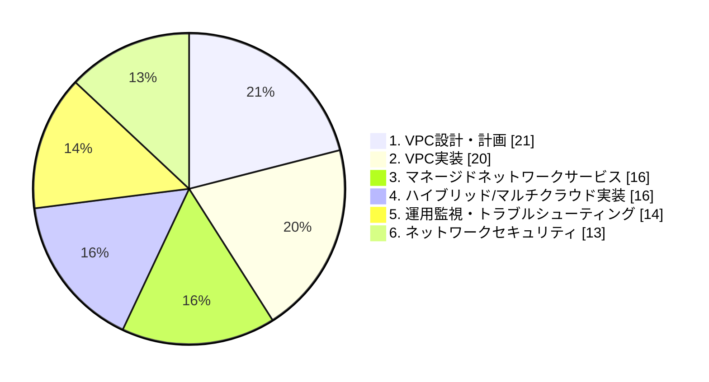
```mermaid
pie showData
    "1. VPC設計・計画" : 21
    "2. VPC実装" : 20
    "3. マネージドネットワークサービス" : 16
    "4. ハイブリッド/マルチクラウド実装" : 16
    "5. 運用監視・トラブルシューティング" : 14
    "6. ネットワークセキュリティ" : 13
```

**出題比率の内訳(公式Exam Guideより)**

| Section | 名称 | 比率 |
|---|---|---|
| 1 | Designing and planning a Google Cloud VPC network | ~21% |
| 2 | Implementing a VPC network | ~20% |
| 3 | Configuring managed network services | ~16% |
| 4 | Configuring and implementing hybrid and multicloud network interconnectivity | ~16% |
| 5 | Managing, monitoring, and troubleshooting network operations | ~14% |
| 6 | Configuring, implementing and managing a cloud network security solution | ~13% |

Section 1の学習が疎かだと、Section 2〜4の実装問題でも「なぜこの構成にするのか」の判断基準を欠いたまま暗記に頼ることになります。逆に言えば、Section 1を深く理解すれば他セクションの学習効率も大きく上がります。

---

## 1.1 全体的なネットワークアーキテクチャの設計

タスク1.1は「個々の機能の使い方」ではなく、**要件からアーキテクチャ全体を組み立てる力**を問う領域です。試験では「コスト重視ならどちらのTierか」「99.99%の可用性を実現するにはどのトポロジか」といった、トレードオフを踏まえた選択問題が多く出題されます。

### 1.1.1 ネットワークサービス階層(Premium Tier / Standard Tier)

Google CloudのNetwork Service Tiersは、**外部IPアドレスを使った通信がGoogleのバックボーンにどこまで乗るか**を選択できる仕組みです。設計初期段階でこの選択を誤ると、後からリソース単位で細かく作り直す必要が出るため、最初に決めるべき項目の一つです。

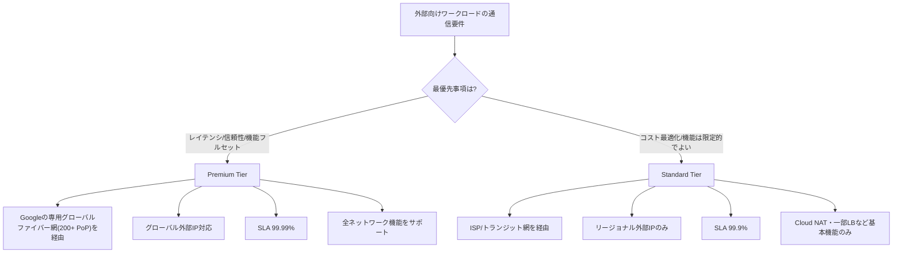
```mermaid
flowchart TB
    A[外部向けワークロードの通信要件] --> B{最優先事項は?}
    B -->|レイテンシ/信頼性/機能フルセット| C[Premium Tier]
    B -->|コスト最適化/機能は限定的でよい| D[Standard Tier]
    C --> C1["Googleの専用グローバル\nファイバー網(200+ PoP)を経由"]
    C --> C2["グローバル外部IP対応"]
    C --> C3["SLA 99.99%"]
    C --> C4["全ネットワーク機能をサポート"]
    D --> D1["ISP/トランジット網を経由"]
    D --> D2["リージョナル外部IPのみ"]
    D --> D3["SLA 99.9%"]
    D --> D4["Cloud NAT・一部LBなど基本機能のみ"]
```

**設計上のポイント**

| 観点 | Premium Tier | Standard Tier |
|---|---|---|
| ルーティング | 可能な限りGoogleネットワーク内を経由し、出口(PoP)は宛先に最も近い場所 | ピアリング/ISP/トランジット網経由でユーザーに到達 |
| 外部IPの種類 | リージョナル・グローバルの両方 | リージョナル外部IPのみ(全リージョンで利用可) |
| セキュリティ | 最終区間までGoogleバックボーン上で保護 | 他社パブリッククラウドと同等 |
| SLA | 99.99% | 99.9% |
| 料金 | 標準(他社プレミアム帯域と同等) | 相対的に安価 |

ネットワーク階層はプロジェクト単位のデフォルト値を設定でき、さらにリソース単位(外部IPアドレス・転送規則)でも上書きできます。一つのロードバランサに2つの転送規則を作り、片方をPremium・もう片方をStandardにするという構成も可能です。判断に迷う場合はGoogle公式の推奨通り、まずPremium Tierを既定にし、コスト影響を見てからStandard Tierへの切り替えを検討するのが安全です。

> **出典**: [Network Service Tiers overview](https://cloud.google.com/network-tiers/docs/overview)

### 1.1.2 高可用性・フェイルオーバー・DR・スケールの設計

「高可用性」「フェイルオーバー」「災害復旧(DR)」「スケール」はそれぞれ異なるレイヤーの設計課題であり、試験でも明確に区別して出題されます。

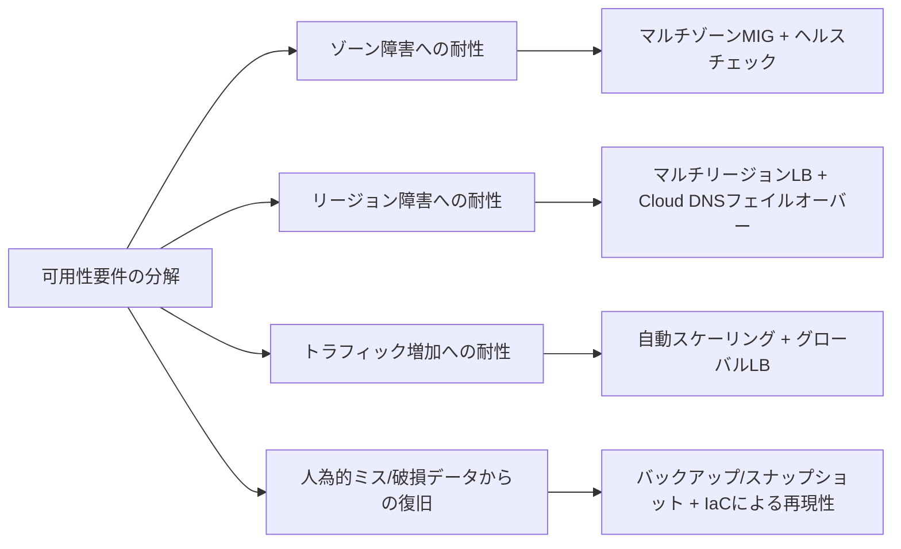
```mermaid
flowchart LR
    A[可用性要件の分解] --> B[ゾーン障害への耐性]
    A --> C[リージョン障害への耐性]
    A --> D[トラフィック増加への耐性]
    A --> E[人為的ミス/破損データからの復旧]
    B --> B1["マルチゾーンMIG + ヘルスチェック"]
    C --> C1["マルチリージョンLB + Cloud DNSフェイルオーバー"]
    D --> D1["自動スケーリング + グローバルLB"]
    E --> E1["バックアップ/スナップショット + IaCによる再現性"]
```

設計原則としては、単一障害点(SPOF)をレイヤーごとに洗い出すアプローチが有効です。

| レイヤー | SPOFになりやすい要素 | Google Cloudでの緩和策 |
|---|---|---|
| コンピューティング | 単一VM、単一ゾーン | マネージドインスタンスグループ(MIG)をマルチゾーンに展開 |
| ネットワーク経路 | 単一のInterconnect接続/単一VPNトンネル | 複数のVLANアタッチメント、HA VPNの2インターフェース構成 |
| ロードバランサ | リージョナルLBのみ | グローバル外部Application Load Balancer + 複数リージョンのバックエンド |
| DNS | 単一リージョンのエンドポイントのみ登録 | Cloud DNSのジオロケーション/フェイルオーバーポリシー |
| ルーティング制御 | 単一のCloud Router | リージョンごとに冗長なCloud Router、BGPの複数セッション |

DR設計では、RTO(目標復旧時間)とRPO(目標復旧時点)の要件に応じて、**Active-Active**(複数リージョンで常時稼働・トラフィック分散)と**Active-Passive**(平常時は1リージョンのみ稼働し、障害時にフェイルオーバー)のどちらを取るかを判断します。Active-Activeを取る場合はグローバル動的ルーティングモードとグローバル外部LBの組み合わせが前提になり、Active-Passiveの場合はCloud DNSのフェイルオーバーポリシーやトラフィックマネジメント機能で切り替えを自動化します。

スケール設計では、後述するIPアドレス計画(1.2.3)がボトルネックになりがちです。特にGKEのPodレンジは一度確保すると縮小できないため、初期段階で将来の水平スケールを見込んだサブネットサイズを設計しておく必要があります。

### 1.1.3 DNSトポロジの設計

DNSトポロジの設計は、「どこが権威(authoritative)か」「どの方向にクエリを転送するか」という2つの軸で整理すると理解しやすくなります。

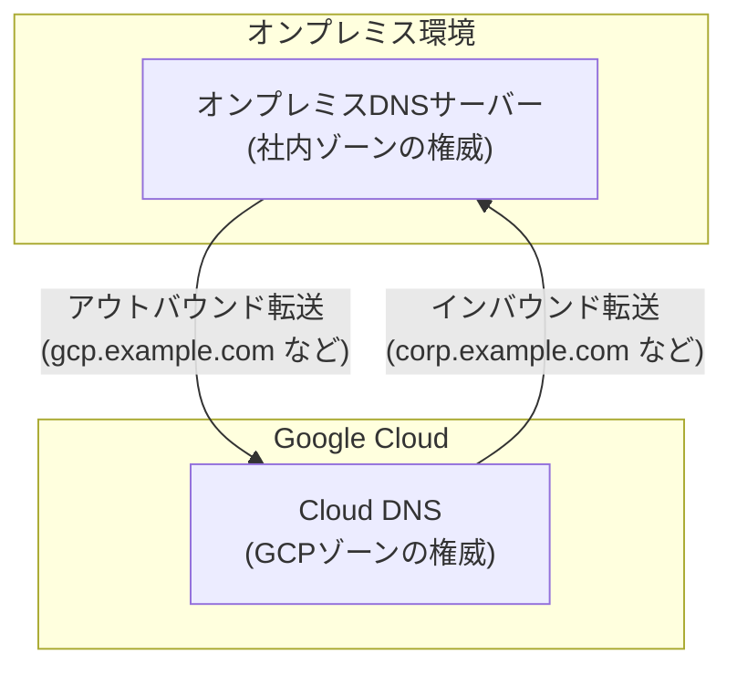
```mermaid
flowchart TB
    subgraph OnPrem["オンプレミス環境"]
        OD["オンプレミスDNSサーバー\n(社内ゾーンの権威)"]
    end
    subgraph GCP["Google Cloud"]
        CD["Cloud DNS\n(GCPゾーンの権威)"]
    end
    OD -->|"アウトバウンド転送\n(gcp.example.com など)"| CD
    CD -->|"インバウンド転送\n(corp.example.com など)"| OD
```

Cloud DNSはグローバルなマネージドDNSサービスで、パブリックゾーン・プライベートゾーンの両方をホストできます。オンプレミスとのハイブリッド環境では、以下のパターンを組み合わせて設計します(詳細は1.3.9で深掘りします)。

- **パブリックゾーン**: インターネット向けに権威DNSとして公開する。Cloud DNSは転送をサポートせず、常に権威応答のみを返す。
- **プライベートゾーン**: 指定したVPCネットワーク(またはShared VPCで許可されたネットワーク)からのみ解決可能。
- **転送ゾーン(Forwarding zone)**: 特定のドメインへの問い合わせを、指定したネームサーバー(オンプレミスDNSなど)に転送する。
- **ピアリングゾーン(DNS peering)**: あるVPC(コンシューマ)から別のVPC(プロデューサ)のプライベートゾーンの名前解決を委譲する、片方向の関係。
- **サーバーポリシー(インバウンド/アウトバウンド)**: インバウンドサーバーポリシーを有効にすると、オンプレミス側からCloud DNSの内部IPアドレスへ問い合わせができるようになる。

**設計の要点**: DNSトポロジは「誰が」「どのゾーンについて」権威を持つかを最初に決め、命名規則(例:オンプレミスは`corp.example.com`、GCPは`gcp.example.com`)を分離しておくと、転送ルールがシンプルになります。同一ドメインを両方で管理するsplit-brain構成は複雑さが増すため、特別な理由がない限り避けるべきベストプラクティスとされています。

> **出典**: [DNS zones overview](https://cloud.google.com/dns/docs/zones/zones-overview) / [Best practices for Cloud DNS](https://cloud.google.com/dns/docs/best-practices)

### 1.1.4 ロードバランサの選定

Google Cloudのロードバランサは「トラフィック種別」「内部/外部」「グローバル/リージョナル」「プロキシ/パススルー」の4軸で分類されます。試験では要件文からこの4軸を特定し、正しいロードバランサ種別を選ぶ問題が頻出します。

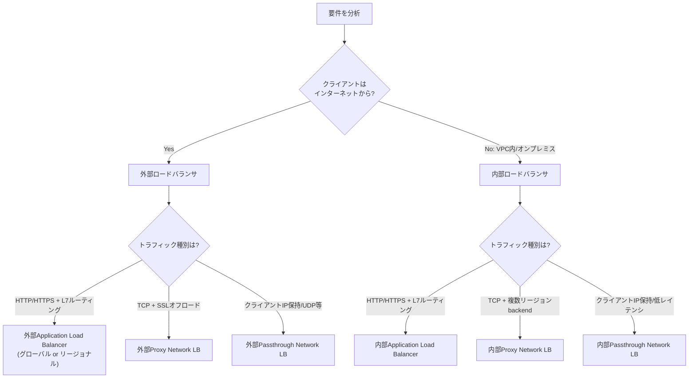
```mermaid
flowchart TB
    Start[要件を分析] --> Q1{クライアントは\nインターネットから?}
    Q1 -->|Yes| Ext[外部ロードバランサ]
    Q1 -->|No: VPC内/オンプレミス| Int[内部ロードバランサ]
    Ext --> Q2{トラフィック種別は?}
    Int --> Q3{トラフィック種別は?}
    Q2 -->|HTTP/HTTPS + L7ルーティング| ExtALB["外部Application Load Balancer\n(グローバル or リージョナル)"]
    Q2 -->|TCP + SSLオフロード| ExtProxy["外部Proxy Network LB"]
    Q2 -->|クライアントIP保持/UDP等| ExtPass["外部Passthrough Network LB"]
    Q3 -->|HTTP/HTTPS + L7ルーティング| IntALB["内部Application Load Balancer"]
    Q3 -->|TCP + 複数リージョンbackend| IntProxy["内部Proxy Network LB"]
    Q3 -->|クライアントIP保持/低レイテンシ| IntPass["内部Passthrough Network LB"]
```

**選定の基本テーブル**

| 判断軸 | 選択肢 | 主な用途 |
|---|---|---|
| トラフィックタイプ | Application Load Balancer(L7) | HTTP/HTTPS、URLベースのルーティング、Cloud CDN連携 |
| トラフィックタイプ | Proxy Network Load Balancer(L4プロキシ) | TCP、SSLオフロードが必要な非HTTPアプリ |
| トラフィックタイプ | Passthrough Network Load Balancer(L4パススルー) | クライアント送信元IPの保持、UDP/ESP/ICMPなど幅広いプロトコル |
| 公開範囲 | 外部 | インターネットからのトラフィック |
| 公開範囲 | 内部 | 同一VPC、Peering、Cloud VPN/Interconnectで接続されたクライアントからのトラフィック |
| スコープ | グローバル | バックエンドが複数リージョンにまたがる、または将来またがる可能性がある |
| スコープ | リージョナル | バックエンドが単一リージョン、かつ管轄要件でトラフィックをリージョン内に留めたい |

パススルー型は送信元IPを変更せずバックエンドに届けるため、送信元IPベースのアクセス制御を行うレガシーアプリや、UDP/GRE/ESPなどHTTP以外のプロトコルが必要な場合に適しています。一方プロキシ型(Application LBやProxy Network LB)はGoogle Front End(GFE)やEnvoyでTLS終端やL7ルーティングを行うため、URLパスによるルーティング、Cloud Armor・Cloud CDNとの統合、証明書管理の一元化といった付加機能が必要な場面に向いています。

> **出典**: [Choose a load balancer](https://cloud.google.com/load-balancing/docs/choosing-load-balancer) / [Cloud Load Balancing overview](https://cloud.google.com/load-balancing/docs/load-balancing-overview)

### 1.1.5 GKEネットワーキングの計画

GKEをネットワーク設計に組み込む際は、コンテナ基盤特有のIP消費量の多さを踏まえた計画が必要です。詳細な設計判断は1.4章で扱いますが、1.1では「アーキテクチャ全体の中でGKEをどう位置づけるか」という初期計画に触れます。

- **セカンダリレンジの確保**: VPCネイティブクラスタはPod用・Service用にそれぞれセカンダリIPレンジを消費します。ノード数×Pod数の将来見積もりに対して十分な広さのレンジを最初に確保する必要があります(後から拡張は可能だが、無計画だと枯渇や断片化を招く)。
- **IPアドレス空間に基づくスケール上限の把握**: クラスタの最大ノード数は、割り当てたPodセカンダリレンジのサイズと、ノードあたりの最大Pod数の設定によって事実上決まります。
- **コントロールプレーンへのアクセス**: 誰が(オンプレミス、他プロジェクト、CI/CDパイプラインなど)どの経路でkube-apiserverにアクセスするかを、VPC設計と合わせて決定します。

これらはVPC設計(1.2)・IPAM戦略(1.2.3)・ハイブリッド接続設計(1.3)と密接に関わるため、GKEをホストする予定がある場合は、VPC全体の設計と同時並行でGKE要件を確定させることが推奨されます。

### 1.1.6 IAMロールの設計

ネットワークアーキテクチャの設計では、「誰が何を変更できるか」という権限設計も同時に行う必要があります。特にShared VPCを採用する場合、ホストプロジェクトとサービスプロジェクトの間でどの粒度の権限を付与するかが設計の柱になります。

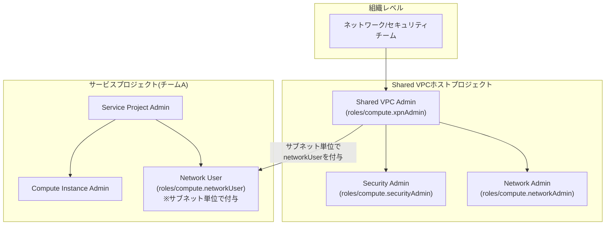
```mermaid
flowchart TB
    subgraph Org["組織レベル"]
        NetTeam["ネットワーク/セキュリティチーム"]
    end
    subgraph Host["Shared VPCホストプロジェクト"]
        Admin["Shared VPC Admin\n(roles/compute.xpnAdmin)"]
        NetAdmin["Network Admin\n(roles/compute.networkAdmin)"]
        SecAdmin["Security Admin\n(roles/compute.securityAdmin)"]
    end
    subgraph Svc["サービスプロジェクト(チームA)"]
        SvcAdmin["Service Project Admin"]
        NetUser["Network User\n(roles/compute.networkUser)\n※サブネット単位で付与"]
        InstAdmin["Compute Instance Admin"]
    end
    NetTeam --> Admin
    Admin --> NetAdmin
    Admin --> SecAdmin
    Admin -->|"サブネット単位でnetworkUserを付与"| NetUser
    SvcAdmin --> NetUser
    SvcAdmin --> InstAdmin
```

**代表的な事前定義ロール**

| ロール | 付与先 | 役割 |
|---|---|---|
| `roles/compute.xpnAdmin` | ネットワークチーム(組織/フォルダレベル) | Shared VPCの有効化、サービスプロジェクトのアタッチ |
| `roles/compute.networkAdmin` | ネットワークチーム | VPC、サブネット、ルート、VPN、Cloud Routerなどネットワークリソースの管理 |
| `roles/compute.securityAdmin` | セキュリティチーム | ファイアウォールルール、SSLポリシーの管理 |
| `roles/compute.networkUser` | サービスプロジェクトの利用者 | 指定されたホストプロジェクトのサブネットを使ってリソースを作成する権限(プロジェクト単位 or サブネット単位) |
| `roles/compute.instanceAdmin` | サービスプロジェクトの利用者 | サービスプロジェクト内のインスタンス管理 |
| `roles/compute.loadBalancerAdmin` | ロードバランサ運用チーム | LBコンポーネント(バックエンド、URLマップ、転送規則など)の管理 |

設計上のベストプラクティスは「最小権限の原則」をShared VPCの粒度設計に反映させることです。具体的には、`compute.networkUser`をホストプロジェクト全体ではなく**サブネット単位**で付与することで、サービスプロジェクトのチームが誤って他チーム用のサブネットにリソースを作成することを防げます。またGKEやロードバランサをサービスプロジェクトから作成する場合は、Google管理のサービスエージェント(例:GKEのサービスエージェント、Google APIsサービスエージェント)にも該当サブネットの`networkUser`権限を付与し忘れないよう設計時にチェックリスト化しておくことが重要です。

> **出典**: [IAM roles for Networking-related job functions](https://cloud.google.com/iam/docs/job-functions/networking) / [Shared VPC overview](https://cloud.google.com/vpc/docs/shared-vpc) / [Roles and permissions for Cloud Load Balancing](https://cloud.google.com/load-balancing/docs/access-control)

### 1.1.7 マネージドサービスへの接続計画

VMやGKE以外にも、Cloud SQLやBigQueryなどのマネージドサービス(プロデューササービス)へのプライベート接続方式を初期段階で決めておく必要があります。代表的な選択肢は3つあり、それぞれ接続モデルが異なります。

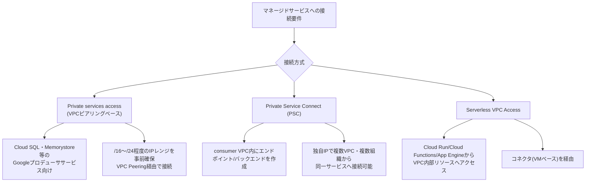
```mermaid
flowchart TB
    A[マネージドサービスへの接続要件] --> B{接続方式}
    B --> C["Private services access\n(VPCピアリングベース)"]
    B --> D["Private Service Connect (PSC)"]
    B --> E["Serverless VPC Access"]
    C --> C1["Cloud SQL・Memorystore等の\nGoogleプロデューササービス向け"]
    C --> C2["/16〜/24程度のIPレンジを事前確保\nVPC Peering経由で接続"]
    D --> D1["consumer VPC内にエンドポイント/バックエンドを作成"]
    D --> D2["独自IPで複数VPC・複数組織から\n同一サービスへ接続可能"]
    E --> E1["Cloud Run/Cloud Functions/App Engineから\nVPC内部リソースへアクセス"]
    E --> E2["コネクタ(VMベース)を経由"]
```

| 方式 | 接続モデル | 主な用途 | 設計上の注意点 |
|---|---|---|---|
| Private services access | サービスコンシューマVPCとプロデューサVPC間のVPCピアリング | Cloud SQL、Memorystore、Filestoreなど | ピアリングは非推移的。1つのコンシューマVPCに対し、同一プロデューササービスへの接続は1本のみ。事前にリージョン/サービス種別ごとに最低/24を確保 |
| Private Service Connect | Consumer VPC内にエンドポイント(内部IP)またはLBバックエンドを作成し、サービスアタッチメントに接続 | Google API、SaaS、社内マイクロサービスの公開 | 複数の消費者VPC・複数組織から同一サービスに接続可能。IPアドレスの制御をコンシューマ側が持てる |
| Serverless VPC Access | サーバーレス環境とVPCの間にコネクタ(スケール可能なVM群)を配置 | Cloud Run、Cloud Functions、App Engine standardからVPC内部リソースへのアクセス | コネクタは/28程度の専用サブネットが必要。スループットはマシンタイプとインスタンス数に依存 |

設計判断のポイントは「**誰が誰にサービスを公開するか**」です。単一VPCからGoogleのマネージドサービスに接続するだけならPrivate services accessで十分ですが、複数の消費者VPC(異なる組織を含む)から同じサービスにアクセスさせたい場合や、VPCピアリングの非推移性を回避したい場合はPrivate Service Connectがより柔軟です。サーバーレスワークロードがVPC内部のリソース(内部LB、Compute Engine VM、Memorystoreなど)にアクセスする必要がある場合は、Serverless VPC Accessコネクタが前提になります。

> **出典**: [Private services access](https://cloud.google.com/vpc/docs/private-services-access) / [Private Service Connect overview](https://cloud.google.com/vpc/docs/private-service-connect) / [Serverless VPC Access overview](https://cloud.google.com/vpc/docs/serverless-vpc-access)

### 1.1.8 割り当て(Quota)と上限の計画

Google Cloudのネットワークリソースには、プロジェクト単位・VPCネットワーク単位・ピアリンググループ単位などさまざまな粒度でQuota(割り当て)とLimit(上限)が存在します。設計段階でこれらを確認しておかないと、実装フェーズやスケール時に予期せぬ`QUOTA_EXCEEDED`エラーに直面します。

**代表的なQuota/Limitの例**

| 項目 | 既定の目安 | 補足 |
|---|---|---|
| VPCネットワークあたりのサブネット数 | プロジェクト/ネットワークごとに上限あり | Auto modeネットワークはリージョンごとに自動生成 |
| VPCネットワークあたりの静的ルート数 | 上限あり(引き上げ申請可能な項目とそうでない項目がある) | ハイブリッド接続の学習ルートも消費する |
| VPC Peeringの接続数 | 1ネットワークあたり既定で上限あり | ピアリンググループ単位でサブネット数・ルート数のQuotaも別途存在 |
| Cloud Routerのリージョンあたり数、BGPピア数 | VPCネットワーク+リージョンの組み合わせごとに上限 | NCCのRouter applianceスポークにも同じ上限が適用 |
| Shared VPCのサービスプロジェクト数 | ホストプロジェクトごとに設定可能なQuota | プロジェクトレベルの設定値 |

設計段階での実務上の推奨は次の3点です。

1. **将来の成長率を見込んでQuotaを事前申請する**:特にCloud Router BGPピア数やVPC Peering数は、マルチリージョン展開や新規事業部門の追加を見越して早めに引き上げ申請を行う。
2. **ルートの集約(サマライズ)を設計に組み込む**:例えば`10.10.0.0/24`〜`10.10.3.0/24`の4つのサブネットは`10.10.0.0/22`として広告することで、学習ルート数のQuota消費を抑えられる。
3. **ピアリンググループの「実効上限(effective limit)」を理解する**:VPC Peeringの各種Quotaは、自ネットワークだけでなく直接ピアリングしている全ネットワークの設定値に依存して実効上限が変動する。ピア追加/削除のたびにこの実効上限が変わることを設計時に把握しておく。

> **出典**: [Quotas and limits (VPC)](https://cloud.google.com/vpc/docs/quota) / [Quotas and limits (Network Connectivity)](https://cloud.google.com/network-connectivity/quotas)

---

## 1.2 VPCネットワークの設計

タスク1.2は「VPCそのものの構造」を決める領域です。VPCの数・種類、ネットワーク同士のつなぎ方、IPアドレス計画、MTU、そしてサードパーティアプライアンスの挿入方法を扱います。

### 1.2.1 VPCの種類と数の選択

Google CloudのVPCはグローバルリソースであり、AWSのようにリージョンごとに分割されていません。この特性を踏まえたうえで、まず「Standalone(単独)VPC」か「Shared VPC」かを選び、次に「VPCをいくつ作るか」を決めます。

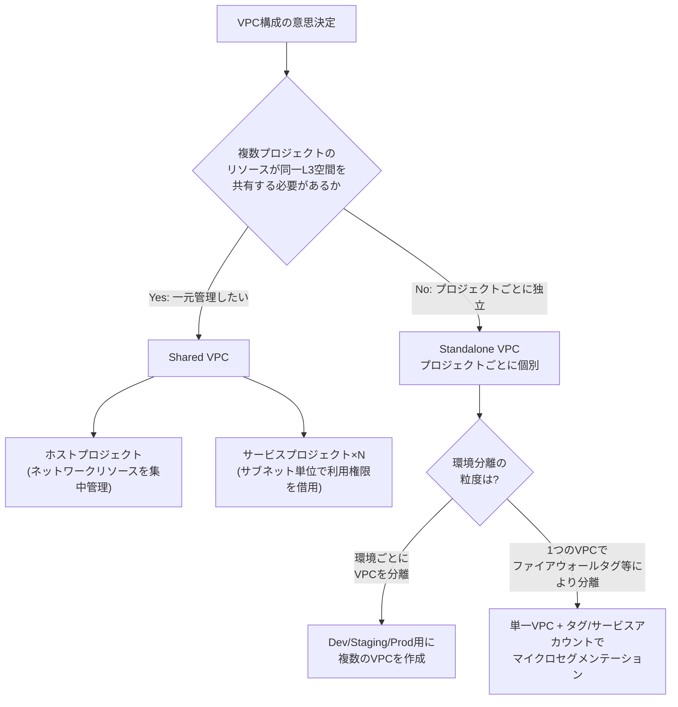
```mermaid
flowchart TB
    A[VPC構成の意思決定] --> B{複数プロジェクトの\nリソースが同一L3空間を\n共有する必要があるか}
    B -->|No: プロジェクトごとに独立| C[Standalone VPC\nプロジェクトごとに個別]
    B -->|Yes: 一元管理したい| D[Shared VPC]
    D --> D1["ホストプロジェクト\n(ネットワークリソースを集中管理)"]
    D --> D2["サービスプロジェクト×N\n(サブネット単位で利用権限を借用)"]
    C --> E{"環境分離の\n粒度は?"}
    E -->|"環境ごとに\nVPCを分離"| E1["Dev/Staging/Prod用に\n複数のVPCを作成"]
    E -->|"1つのVPCで\nファイアウォールタグ等により分離"| E2["単一VPC + タグ/サービスアカウントで\nマイクロセグメンテーション"]
```

**判断の目安**

| 観点 | Standalone VPC | Shared VPC |
|---|---|---|
| 適した組織形態 | 少人数チーム、プロジェクトごとに完全独立した環境が必要な場合 | 複数チーム/複数プロジェクトが共通のネットワーク・IPアドレス空間を使う中〜大規模組織 |
| 権限管理 | プロジェクトオーナーがネットワークも管理 | ネットワークチームが集中管理し、アプリチームはインスタンス管理のみに専念できる(責任分界) |
| IPアドレス設計 | プロジェクトごとに個別設計、重複しやすい | 一元設計のため重複を防ぎやすい |
| Peering/Interconnectの管理コスト | プロジェクト数分の接続を個別に管理 | 1つのホストプロジェクトに接続を集約できる |

VPCの「数」については、環境分離(Dev/Staging/Prod)やコンプライアンス境界(PCI DSSスコープなど)の要件に応じて複数VPCに分割するケースが一般的です。ただし、VPCを分割しすぎると1.2.2で説明する接続トポロジが複雑化するため、**「本当に独立したネットワーク境界が必要か」「ファイアウォールルールやタグによる論理分離で十分ではないか**」を都度検討することが推奨されます。

> **出典**: [VPC networks](https://cloud.google.com/vpc/docs/vpc) / [Shared VPC overview](https://cloud.google.com/vpc/docs/shared-vpc)

### 1.2.2 ネットワーク間接続方式の決定

複数のVPCを接続する方式には、主に**VPC Network Peering**、**Network Connectivity Center(NCC)**、**Private Service Connect(PSC**)の3つがあります。試験ではネットワーク数やトポロジ要件から適切な方式を選ぶ問題が出題されます。

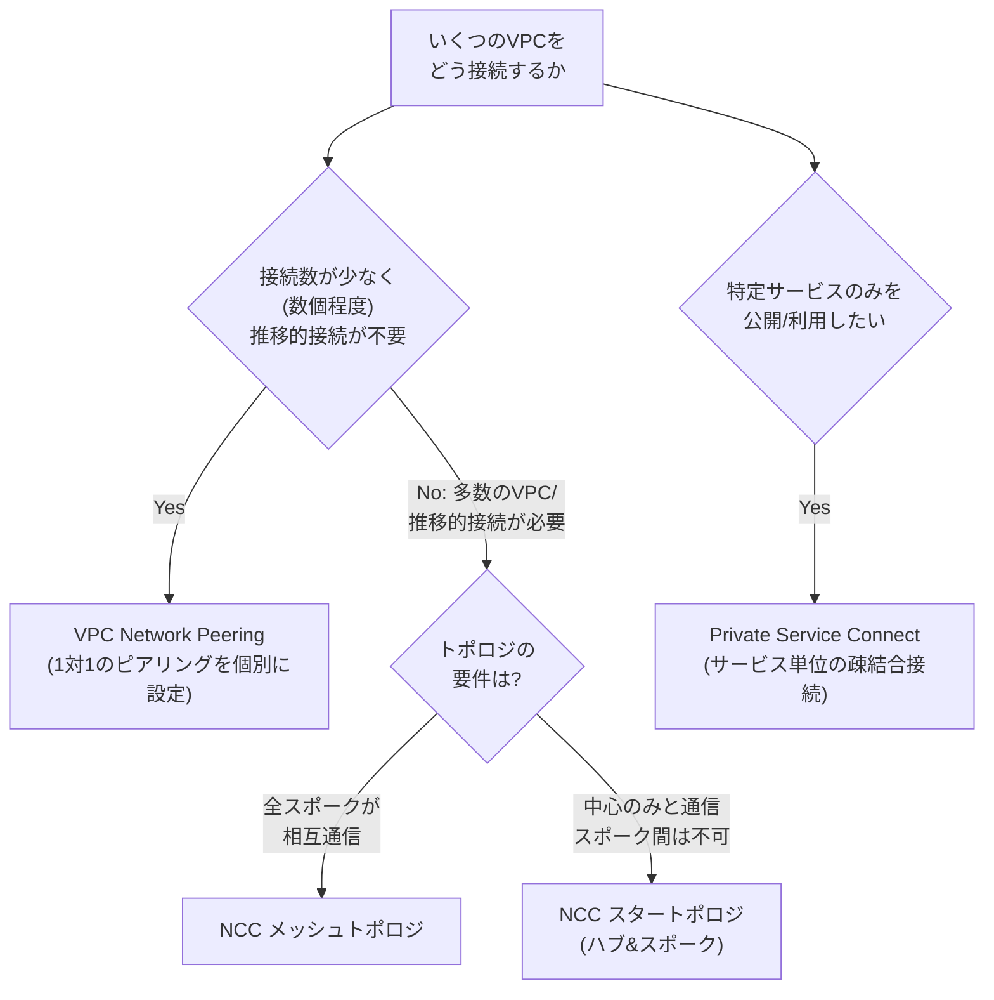
```mermaid
flowchart TB
    A["いくつのVPCを\nどう接続するか"] --> B{"接続数が少なく\n(数個程度)\n推移的接続が不要"}
    B -->|Yes| C["VPC Network Peering\n(1対1のピアリングを個別に設定)"]
    B -->|No: 多数のVPC/\n推移的接続が必要| D{"トポロジの\n要件は?"}
    D -->|"全スポークが\n相互通信"| E["NCC メッシュトポロジ"]
    D -->|"中心のみと通信\nスポーク間は不可"| F["NCC スタートポロジ\n(ハブ&スポーク)"]
    A --> G{"特定サービスのみを\n公開/利用したい"}
    G -->|Yes| H["Private Service Connect\n(サービス単位の疎結合接続)"]
```

**3方式の比較**

| 方式 | 接続の性質 | 推移性 | スケール | 典型ユースケース |
|---|---|---|---|---|
| VPC Network Peering | 1対1のフルメッシュ的接続、内部IPで直接到達 | 非推移的(AとBが繋がりBとCが繋がっていてもAとCは繋がらない) | ピアリング数が増えると管理がO(n²)的に複雑化 | 少数VPC間の高帯域・低レイテンシ通信、SaaS提供 |
| Network Connectivity Center | ハブ&スポークの集中管理モデル | ハブが経路をスポーク間で中継(トポロジ次第で推移的) | 数十〜数百のVPC/オンプレサイトを一元管理できる | 大規模なマルチVPC/ハイブリッド環境、Cloud WAN型アーキテクチャ |
| Private Service Connect | サービス単位のPublisher-Consumerモデル | スポーク/VPC全体ではなく個々のサービス単位 | 多数の消費者から少数の公開サービスへの接続に強い | マネージドサービス公開、SaaS、社内プラットフォームサービス |

NCCのプリセットトポロジには主に**メッシュ**と**スター**があります。メッシュはデフォルトのトポロジで、ハブに参加した全スポークが単一のスポークグループに属し、相互に経路をやり取りします。スタートポロジは「センター」グループと「エッジ」グループに分かれ、エッジ同士は直接通信できず必ずセンターを経由する設計です。この性質は、ハブ&スポーク型の中央集権的なセキュリティ検査(すべてのスポーク間トラフィックを中央のファイアウォールVPCに強制的に通す)を実現したい場合に有効です。

**Hub-and-Spokeを自前で構築する3つのアプローチ**

Google Cloudのアーキテクチャセンターでは、ハブ&スポーク型トポロジを実現する3つの選択肢が比較されています。

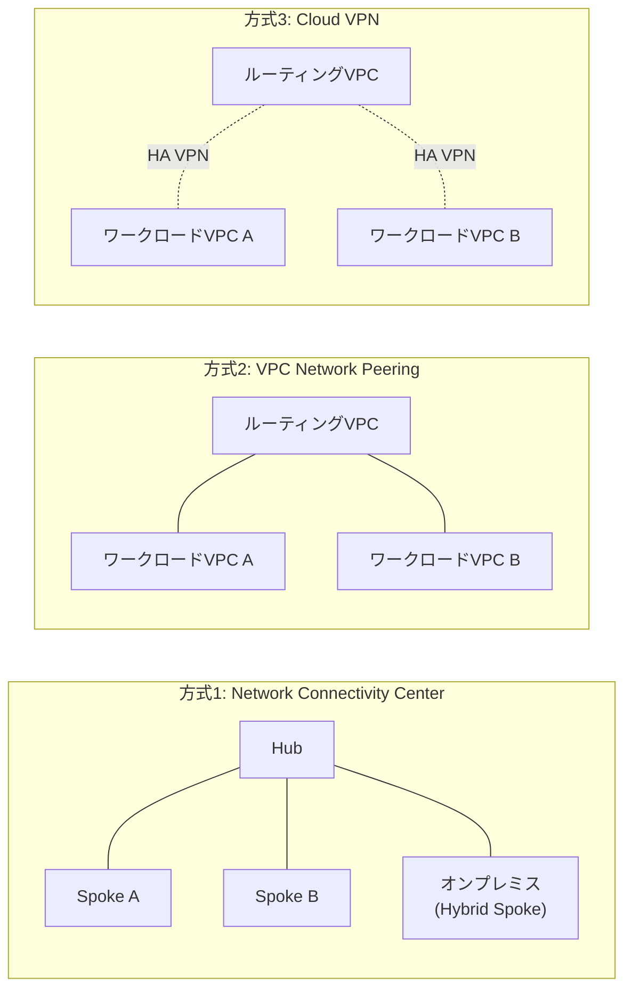
```mermaid
flowchart LR
    subgraph Opt1["方式1: Network Connectivity Center"]
        H1[Hub] --- S1a[Spoke A]
        H1 --- S1b[Spoke B]
        H1 --- S1c["オンプレミス\n(Hybrid Spoke)"]
    end
    subgraph Opt2["方式2: VPC Network Peering"]
        H2["ルーティングVPC"] --- S2a["ワークロードVPC A"]
        H2 --- S2b["ワークロードVPC B"]
    end
    subgraph Opt3["方式3: Cloud VPN"]
        H3["ルーティングVPC"] -.HA VPN.- S3a["ワークロードVPC A"]
        H3 -.HA VPN.- S3b["ワークロードVPC B"]
    end
```

| 方式 | スポーク間到達性 | 推移的ルート共有 | 適した規模 |
|---|---|---|---|
| NCC(VPCスポーク) | スタート/メッシュで選択可 | Private Service Connect/一部のPrivate services accessルートが推移的 | 大規模・将来の拡張を見込む環境 |
| VPC Network Peering | ハブVPC経由で構成すればスポーク間通信が可能(帯域はVMのフル帯域) | ピアリングは非推移的だが、ハブVPCを中継点にする設計で疑似的に実現 | 中規模、シンプルな構成を好む場合 |
| Cloud VPN(スポーク間HA VPN) | HA VPNトンネル経由 | VPN区間はゲートウェイ間のスループット上限あり | ルート非推移な制約を回避したいが帯域要件がそこまで高くない場合 |

> **出典**: [Hub-and-spoke network architecture](https://cloud.google.com/architecture/deploy-hub-spoke-vpc-network-topology) / [VPC spokes overview](https://cloud.google.com/network-connectivity/docs/network-connectivity-center/concepts/vpc-spokes-overview) / [VPC Network Peering](https://cloud.google.com/vpc/docs/vpc-peering)

### 1.2.3 IPアドレス管理(IPAM)戦略

IPAM戦略はVPC設計の中でも特に試験で重視される領域です。以下の要素を組み合わせて全体設計を行います。

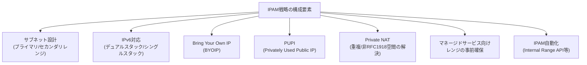
```mermaid
flowchart TB
    A[IPAM戦略の構成要素] --> B["サブネット設計\n(プライマリ/セカンダリレンジ)"]
    A --> C["IPv6対応\n(デュアルスタック/シングルスタック)"]
    A --> D["Bring Your Own IP\n(BYOIP)"]
    A --> E["PUPI\n(Privately Used Public IP)"]
    A --> F["Private NAT\n(重複/非RFC1918空間の解決)"]
    A --> G["マネージドサービス向け\nレンジの事前確保"]
    A --> H["IPAM自動化\n(Internal Range API等)"]
```

**サブネットとセカンダリレンジ**

VPCネイティブなIPアドレス設計の基本単位はサブネットです。1つのサブネットは1つのプライマリIPv4レンジ(VMの主IP用)と、最大170個までのセカンダリレンジ(GKEのPod/Serviceやエイリアスセカンダリレンジ用)を持てます。VPCネットワーク内では、プライマリ・セカンダリを問わずすべてのIPv4レンジが一意である必要があります(ピアリングやInterconnect/VPNで接続された範囲でも同様)。

| レンジ種別 | 用途 | 設計上の注意 |
|---|---|---|
| プライマリレンジ | VMのプライマリ内部IP、内部LBの転送規則など | サブネットごとに1つのみ、後から拡張(縮小は不可)は可能 |
| セカンダリレンジ | GKEのPod/Serviceレンジ、VMのエイリアスIPレンジ | サブネットあたり最大170個、事前に十分な広さを確保(特にPodレンジは拡張しにくい) |

**IPv6対応**

VPCネットワークはIPv4のみ・デュアルスタック(IPv4+IPv6)・IPv6シングルスタックのサブネットを混在させられます。IPv6を計画する際は、外部向け(パブリックにルーティング可能なアドレス)か内部向け(ULA相当)かを選び、既存のIPv4ベースのファイアウォール/ルーティング設計をどう拡張するかを事前に決める必要があります。

**BYOIP(Bring Your Own IP)**

自社が保有するパブリックIPv4/IPv6アドレスブロックをGoogle Cloudに持ち込み、外部IPとして利用する仕組みです。既存のオンプレミス資産のIPレピュテーションを維持したい場合や、大規模な移行でIPアドレスを変更したくない場合に選択します。

**PUPI(Privately Used Public IP)**

パブリックには到達可能だが、Google Cloudが所有していないIPv4アドレス空間を、VPC内部で「プライベートアドレス」として利用する仕組みです。RFC 1918空間(10.0.0.0/8等)が枯渇しやすい大規模なGKE環境などで、Podレンジに広大なアドレス空間を確保する目的で使われます。

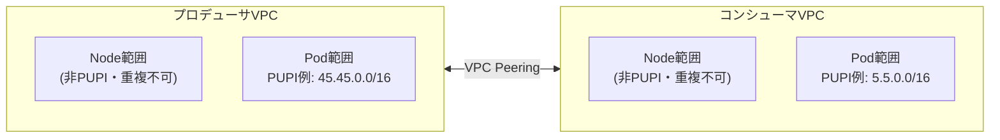
```mermaid
flowchart LR
    subgraph Producer["プロデューサVPC"]
        PN["Node範囲\n(非PUPI・重複不可)"]
        PP["Pod範囲\nPUPI例: 45.45.0.0/16"]
    end
    subgraph Consumer["コンシューマVPC"]
        CN["Node範囲\n(非PUPI・重複不可)"]
        CP["Pod範囲\nPUPI例: 5.5.0.0/16"]
    end
    Producer <-->|VPC Peering| Consumer
```

PUPIを使う場合の注意点は、選んだレンジがインターネット上で実際に到達可能であってはならず、かつGoogleが所有するアドレスとも重複してはならないという点です。また、Pod間の直接通信が必要な場合、プロデューサ側のPod IPをノードIPの背後にSNATする設定が必要になります。

**Private NAT**

重複したIPアドレス空間を持つ複数のネットワーク同士を接続する必要がある場合(買収・合併時など)や、非RFC1918のレンジ(GKEのPodがClass Eなどを使う場合)をそのまま外部/オンプレミスに流せない場合に、Private NATでプライベートto プライベートの変換を行います。NCCのハブに接続されたスポーク同士や、Shared VPCとハイブリッドスポークの間でも利用できます。

| ユースケース | 説明 |
|---|---|
| VPCスポーク間の重複IP解決 | NCCで接続された複数VPCが重複するIPレンジを持つ場合、Private NATで変換して通信を成立させる |
| 非RFC1918レンジのオンプレミス接続 | GKE/Cloud RunがClass E等の非標準レンジを使う場合、オンプレミスのファイアウォールが受け入れ可能なレンジに変換する |
| M&A後のネットワーク統合 | 合併した2社が同じ10.0.0.0/8を使っていた場合など、恒久的なIP再設計をせずに接続を成立させる |

**IPAM自動化**

大規模組織では手作業でのIPアドレス管理台帳がボトルネックになります。Google CloudのInternal Range API(Network Connectivity製品群の一部)を使うと、組織全体のIP空間を階層的に予約・払い出しでき、サブネット作成時の重複チェックを自動化できます。IaC(TerraformなどのInfrastructure as Code)と組み合わせることで、レンジ枯渇や重複を防ぐパイプラインを構築するのがベストプラクティスです。

> **出典**: [Subnets](https://cloud.google.com/vpc/docs/subnets) / [Alias IP ranges](https://cloud.google.com/vpc/docs/alias-ip) / [Configuring privately used public IPs for GKE](https://cloud.google.com/kubernetes-engine/docs/how-to/configuring-privately-used-public-ips-for-gke) / [Private NAT](https://cloud.google.com/nat/docs/private-nat) / [Private NAT for Network Connectivity Center spokes](https://cloud.google.com/nat/docs/about-private-nat-for-ncc)

### 1.2.4 グローバル/リージョナルネットワーク環境の計画

Cloud RouterのBGPセッションが学習したルートを、VPCネットワーク内のどの範囲まで有効にするかを決める設定が「動的ルーティングモード」です。VPCネットワークごとに**グローバル**または**リージョナル**のいずれかを選びます。

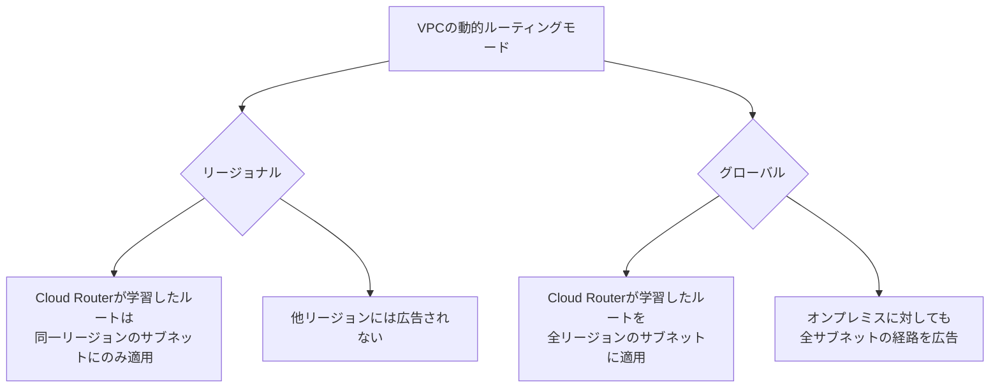
```mermaid
flowchart TB
    A[VPCの動的ルーティングモード] --> B{リージョナル}
    A --> C{グローバル}
    B --> B1["Cloud Routerが学習したルートは\n同一リージョンのサブネットにのみ適用"]
    B --> B2["他リージョンには広告されない"]
    C --> C1["Cloud Routerが学習したルートを\n全リージョンのサブネットに適用"]
    C --> C2["オンプレミスに対しても\n全サブネットの経路を広告"]
```

| モード | 挙動 | 適した要件 |
|---|---|---|
| リージョナル | オンプレミスとの経路交換が、Cloud Routerが存在するリージョンに限定される | リージョンごとに独立したハイブリッド接続を管理したい、意図しないリージョン越えトラフィックを避けたい |
| グローバル | 1つのCloud Router(1リージョンに存在)が学習した経路を全リージョンのVPCサブネットに適用し、逆にすべてのサブネットの経路をオンプレミスに広告 | マルチリージョンでの高可用性接続、単一のInterconnect/VPNを複数リージョンのバックアップ経路として使いたい場合 |

グローバル動的ルーティングモードは、例えばCross-Cloud Interconnectで99.99%の単一リージョンSLAを構成する場合や、あるリージョンのInterconnectが停止した際に別リージョン経由でオンプレミスへの到達性を維持したい場合の前提条件になります。一方で、意図せずグローバルモードにしてしまうと、あるリージョンのCloud Routerで学習した経路が全リージョンに伝播し、想定外の経路でトラフィックが流れる(コストやレイテンシに影響する)リスクもあるため、要件に応じて明示的に選択することが重要です。

> **出典**: [Cloud Router overview](https://cloud.google.com/network-connectivity/docs/router) / [Dedicated Interconnect vs Partner Interconnect解説記事](https://jayendrapatil.com/tag/dedicated-interconnect-vs-partner-interconnect/)

### 1.2.5 MTUサイジング

MTU(Maximum Transmission Unit)は、VPCネットワークを流れる1パケットの最大サイズです。デフォルトは1460バイトで、1300〜8896バイトの範囲で変更できます。

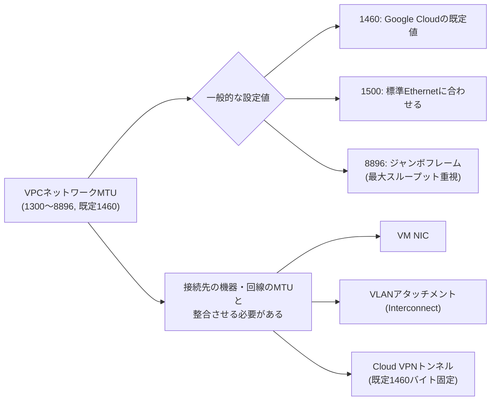
```mermaid
flowchart LR
    A["VPCネットワークMTU\n(1300〜8896, 既定1460)"] --> B{一般的な設定値}
    B --> B1["1460: Google Cloudの既定値"]
    B --> B2["1500: 標準Ethernetに合わせる"]
    B --> B3["8896: ジャンボフレーム\n(最大スループット重視)"]
    A --> C["接続先の機器・回線のMTUと\n整合させる必要がある"]
    C --> C1["VM NIC"]
    C --> C2["VLANアタッチメント(Interconnect)"]
    C --> C3["Cloud VPNトンネル\n(既定1460バイト固定)"]
```

**設計上の重要ポイント**

| 項目 | 内容 |
|---|---|
| VPCネットワークのMTU | 1300〜8896バイトの間で自由に設定可能(既定1460) |
| VLANアタッチメント(Cloud Interconnect) | 1440・1460・1500・8896バイトから選択。8896(ジャンボフレーム)は暗号化なしのIPv4/IPv6アタッチメントのみ対応 |
| Cloud VPN(HA VPN/Classic VPN) | ペイロードMTUは既定で1460バイト。IPsec/ESPのオーバーヘッドがあるため、VPC側のMTUをそのまま使うとフラグメンテーションが発生し得る |
| 推奨設定 | 同一VPCに接続するすべてのVLANアタッチメントで同じMTU値を使う。VPCネットワーク自体のMTUもそれに合わせる |
| TCPとの関係 | TCPはMSS(Maximum Segment Size)をハンドシェイク時に自動調整するため、多少のMTU差異は吸収されるが、非TCPプロトコル(UDPやICMPなど)はPMTUD(Path MTU Discovery)に依存するため注意が必要 |

MTUを変更する際は稼働中のVMがあると通信断を招くため、変更前にVMを停止してから実施することが推奨されます。ジャンボフレーム(8896バイト)は大容量データ転送(HPC、機械学習の分散トレーニング、バックアップ等)でスループットを最大化したい場合に有効ですが、経路上のすべての区間(VM、VPCネットワーク、Interconnect VLANアタッチメント、オンプレミスルーター)が同じMTUをサポートしていないとパケットロスやパフォーマンス低下を招くため、エンドツーエンドでの整合性確認が設計の要になります。

> **出典**: [Maximum transmission unit](https://cloud.google.com/vpc/docs/mtu) / [MTU considerations (Cloud VPN)](https://cloud.google.com/network-connectivity/docs/vpn/concepts/mtu-considerations) / [Dedicated Interconnect overview](https://cloud.google.com/network-connectivity/docs/interconnect/concepts/dedicated-overview)

### 1.2.6 サードパーティアプライアンスの挿入

次世代ファイアウォールIDS/IPSなど、サードパーティのネットワーク仮想アプライアンス(NVA)をトラフィック経路に挿入したい場合、Google Cloudでは**カスタムルート**と**内部パススルーNetwork Load Balancerのネクストホップ機能**を組み合わせて実現します。

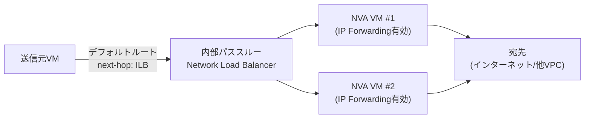
```mermaid
flowchart LR
    VM["送信元VM"] -->|"デフォルトルート\nnext-hop: ILB"| ILB["内部パススルー\nNetwork Load Balancer"]
    ILB --> NVA1["NVA VM #1\n(IP Forwarding有効)"]
    ILB --> NVA2["NVA VM #2\n(IP Forwarding有効)"]
    NVA1 --> Dest["宛先\n(インターネット/他VPC)"]
    NVA2 --> Dest
```

**2つのルーティング手法**

| 手法 | 判定基準 | 主な用途 |
|---|---|---|
| 静的ルート(スタティックルート) + ILBネクストホップ | 宛先IPアドレスのみで経路を決定 | シンプルなゲートウェイ挿入(全トラフィックをNVA経由でインターネットに出す等) |
| ポリシーベースルート(Policy-based routes) | 宛先IPに加え、プロトコル・送信元IPアドレス・ネットワークタグでも経路を決定。サブネットルートより先に評価される | 特定のプロトコル/送信元のみをNVAで検査したい、細粒度なトラフィックステアリングが必要な場合 |

いずれの手法でも、ネクストホップに指定できるのは**内部パススルーNetwork Load Balancer**のみで、そのバックエンドVMはIP Forwardingを有効化しておく必要があります。これにより、NVA自体をスケールアウト可能な形で冗長化しつつ、既存のVMからは単一の内部IPアドレス(転送規則のIP)に向けてトラフィックを送るだけで、実際にはロードバランスされた複数のアプライアンスVMのいずれかで処理される、というアーキテクチャが実現できます。

**HA構成のポイント**

- NVAをマルチNIC(複数ネットワークインターフェース)構成にし、インスペクション対象VPCとアップリンクVPCを分離する設計が一般的です(詳細はSection 6のセキュリティ設計でも扱われます)。
- 内部LBのヘルスチェックにより、障害を起こしたNVAインスタンスは自動的にトラフィックの割り当てから除外されます。
- ポリシーベースルートはサブネットルート・静的ルート・動的ルートより先に評価されるため、意図せず全トラフィックがNVA検査対象になっていないか設計レビュー時に確認する必要があります。

> **出典**: [Policy-based routes](https://cloud.google.com/vpc/docs/policy-based-routes) / [Internal passthrough Network Load Balancers as next hops](https://cloud.google.com/load-balancing/docs/internal/ilb-next-hop-overview)

---

## 1.3 耐障害性・高性能なハイブリッド/マルチクラウドネットワークの設計

タスク1.3はオンプレミス・他クラウドとの接続設計を扱う、Section 1の中で最もボリュームのある領域です。接続手段の選択、可用性設計、IPアドレス/DNS設計、暗号化オプションまで幅広くカバーします。

### 1.3.1 ハイブリッド接続の設計

オンプレミスとGoogle Cloudを接続する手段は、帯域・レイテンシ・コスト・セキュリティ要件に応じて複数用意されています。

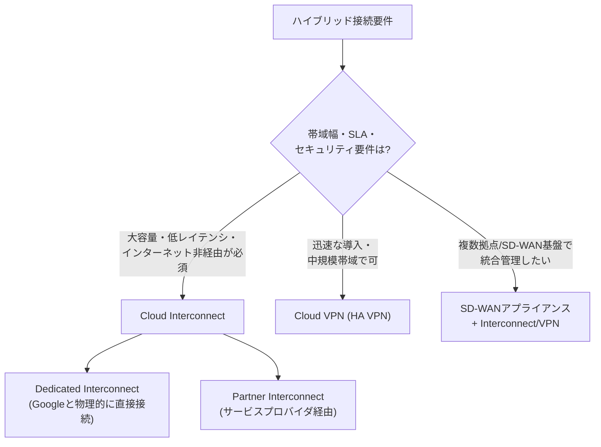
```mermaid
flowchart TB
    A[ハイブリッド接続要件] --> B{"帯域幅・SLA・\nセキュリティ要件は?"}
    B -->|"大容量・低レイテンシ・\nインターネット非経由が必須"| C["Cloud Interconnect"]
    B -->|"迅速な導入・\n中規模帯域で可"| D["Cloud VPN (HA VPN)"]
    B -->|"複数拠点/SD-WAN基盤で\n統合管理したい"| E["SD-WANアプライアンス\n+ Interconnect/VPN"]
    C --> C1["Dedicated Interconnect\n(Googleと物理的に直接接続)"]
    C --> C2["Partner Interconnect\n(サービスプロバイダ経由)"]
```

**主要接続方式の比較**

| 方式 | 帯域幅の目安 | SLA(冗長構成時) | 特徴 |
|---|---|---|---|
| Dedicated Interconnect | 10Gbpsまたは100Gbpsのポート単位、複数接続で最大200Gbps | 99.99%(2メトロ×各2接続の4接続構成) | Googleとの物理的な直接接続。コロケーション施設への設置が必要 |
| Partner Interconnect | 50Mbps〜50Gbps(サービスプロバイダのプランに依存) | 99.99%(要件を満たす冗長構成時) | コロケーション施設への物理アクセスがない拠点向け。レイヤー2/レイヤー3タイプがある |
| Cloud VPN(HA VPN) | トンネルあたり最大3Gbps程度(複数トンネルでスケール) | 99.99%(2インターフェースの標準構成) | インターネット経由のIPsec、迅速に構築可能、動的ルーティング(BGP)必須 |
| Classic VPN | トンネルあたり同程度 | 99.9% | 単一インターフェース、静的ルーティング(ポリシーベース)も選択可、レガシー用途 |
| SD-WANアプライアンス | アプライアンス次第 | アプライアンスの冗長構成に依存 | 複数拠点のトラフィック管理をオーバーレイで統合、InterconnectやVPNの上位レイヤーとして機能 |

ブランチオフィスなど多数の拠点を持つ組織では、各拠点にSD-WANアプライアンスを配置し、それらがCloud VPNまたはPartner Interconnect経由でGoogle Cloudに接続する構成が一般的です。この場合、NCCのRouter Applianceスポーク機能を使うと、SD-WANアプライアンスをスポークとしてハブに登録し、経路管理を一元化できます。

> **出典**: [Cloud Interconnect overview](https://cloud.google.com/network-connectivity/docs/interconnect/concepts/overview) / [Partner Interconnect overview](https://cloud.google.com/network-connectivity/docs/interconnect/concepts/partner-overview) / [Cloud VPN overview](https://cloud.google.com/network-connectivity/docs/vpn/concepts/overview)

### 1.3.2 マルチクラウド接続の設計

複数のパブリッククラウドを併用するマルチクラウド構成では、**Cloud VPN**または**Cross-Cloud Interconnect**を使います。

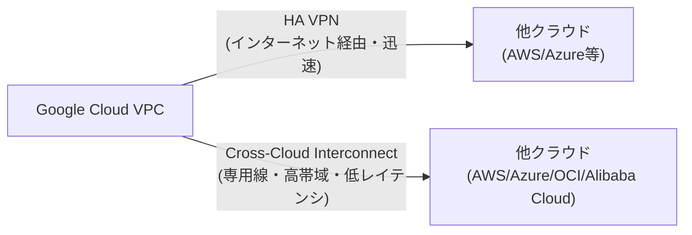
```mermaid
flowchart LR
    GCP["Google Cloud VPC"] -->|"HA VPN\n(インターネット経由・迅速)"| Other1["他クラウド\n(AWS/Azure等)"]
    GCP -->|"Cross-Cloud Interconnect\n(専用線・高帯域・低レイテンシ)"| Other2["他クラウド\n(AWS/Azure/OCI/Alibaba Cloud)"]
```

| 方式 | 接続の性質 | 適した要件 |
|---|---|---|
| Cloud VPN(クラウド間HA VPN) | インターネット経由のIPsecトンネル。双方のクラウドでVPNゲートウェイを構成 | 迅速な立ち上げ、中規模の帯域要件、PoCや小規模ワークロード連携 |
| Cross-Cloud Interconnect | Googleが他クラウドプロバイダとの間に専用の物理接続を用意する高帯域サービス | 大規模なデータ連携、低レイテンシが必須の分散処理、恒常的なマルチクラウドワークロード |

Cross-Cloud Interconnectは10Gbpsまたは100Gbpsの接続を選択でき、AWS・Azure・OCI・Alibaba Cloudなど主要クラウドプロバイダに対応しています。単一リージョン内で99.99%のSLAを実現する「Single-region topology」も提供されており、これは2つのCloud Routerを同一リージョン内の異なるエッジ可用性ドメインに接続するVLANアタッチメントで構成します。マルチクラウドを前提としたアーキテクチャでは、Cross-Cloud Interconnectを使うことで、インターネットを経由せずクラウド間トラフィックを完結させられる点が大きな利点です。

> **出典**: [Cross-Cloud Interconnect overview](https://cloud.google.com/network-connectivity/docs/interconnect/concepts/cci-overview) / [Create HA VPN connections between Google Cloud and AWS](https://cloud.google.com/network-connectivity/docs/vpn/tutorials/create-ha-vpn-connections-google-cloud-aws)

### 1.3.3 Direct PeeringとVerified Peering Providerの使い分け

Direct PeeringとVerified/Carrier Peeringは、Google WorkspaceやパブリックのGoogle Cloudサービス(パブリックIPで公開されたリソース)に到達するための接続方式であり、Cloud Interconnectとは目的が異なります。

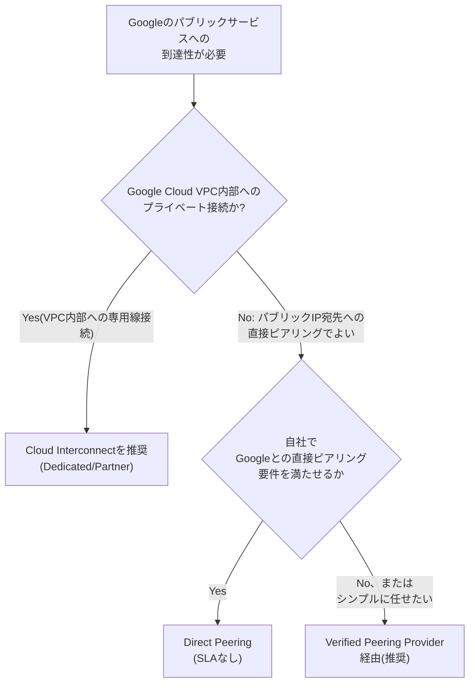
```mermaid
flowchart TB
    A["Googleのパブリックサービスへの\n到達性が必要"] --> B{"Google Cloud VPC内部への\nプライベート接続か?"}
    B -->|"Yes(VPC内部への専用線接続)"| C["Cloud Interconnectを推奨\n(Dedicated/Partner)"]
    B -->|"No: パブリックIP宛先への\n直接ピアリングでよい"| D{"自社で\nGoogleとの直接ピアリング\n要件を満たせるか"}
    D -->|Yes| E["Direct Peering\n(SLAなし)"]
    D -->|"No、または\nシンプルに任せたい"| F["Verified Peering Provider\n経由(推奨)"]
```

| 方式 | 接続の主体 | SLA | Googleの推奨度 |
|---|---|---|---|
| Direct Peering | 自社ネットワークとGoogleのエッジで直接ピアリング(PNI) | なし | Verified Peering Providerが利用可能な場合はそちらを推奨 |
| Carrier Peering | サービスプロバイダ経由でGoogleとピアリング。主にGoogle Workspace向け | プロバイダ次第 | Cloud Interconnect(Dedicated/Partner)の方が推奨されるケースが多い |
| Verified Peering Provider | 認定ISP経由でGoogleの全パブリックリソースに到達 | プロバイダのSLAに準拠 | Direct Peeringのシンプルな代替として推奨 |

いずれの方式もVPCネットワーク内にカスタムルートを生成しません。つまりDirect Peering/Carrier Peering経由のトラフィックは、VPC側のデフォルトルート(インターネットゲートウェイ向け)を経由して届く形になります。**VPC内部への専用線接続**(プライベートIPでのアクセス)が必要な場合は、Direct PeeringではなくCloud Interconnect(Dedicated/Partner)を選択するのが正しい設計判断です。

> **出典**: [Choosing a Network Connectivity product](https://cloud.google.com/network-connectivity/docs/how-to/choose-product) / [Direct Peering overview](https://cloud.google.com/network-connectivity/docs/direct-peering) / [Verified Peering Provider overview](https://cloud.google.com/network-connectivity/docs/verified-peering-provider) / [Carrier Peering overview](https://cloud.google.com/network-connectivity/docs/carrier-peering)

### 1.3.4 複数リージョンにおけるHA/DR接続戦略

マルチリージョンでのハイブリッド接続の可用性設計は、**動的ルーティングモード(グローバル/リージョナル**)と**接続の冗長構成**の組み合わせで決まります。

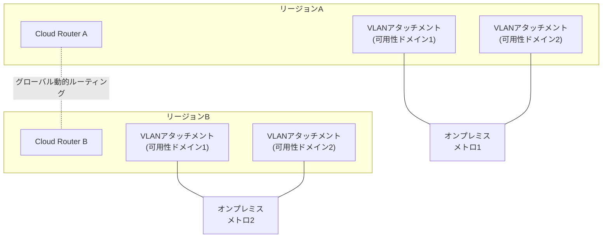
```mermaid
flowchart TB
    subgraph Region1["リージョンA"]
        R1["Cloud Router A"]
        VLAN1a["VLANアタッチメント\n(可用性ドメイン1)"]
        VLAN1b["VLANアタッチメント\n(可用性ドメイン2)"]
    end
    subgraph Region2["リージョンB"]
        R2["Cloud Router B"]
        VLAN2a["VLANアタッチメント\n(可用性ドメイン1)"]
        VLAN2b["VLANアタッチメント\n(可用性ドメイン2)"]
    end
    VLAN1a --- OnPrem1["オンプレミス\nメトロ1"]
    VLAN1b --- OnPrem1
    VLAN2a --- OnPrem2["オンプレミス\nメトロ2"]
    VLAN2b --- OnPrem2
    R1 -.グローバル動的ルーティング.- R2
```

99.99%の可用性を実現するための代表的な構成要件は次の通りです。

- **Dedicated/Partner Interconnectの99.99%構成**: 2つの異なるメトロエリアに、それぞれ2つの異なるエッジ可用性ドメインへの接続を作成する(合計4接続)。近年は単一メトロ内でも2つの異なるエッジ可用性ドメインに接続することで99.99%を実現する「Single-region」トポロジも利用可能になっています。
- **HA VPNの標準構成**: 2つのインターフェース(2つの外部IP)を持つゲートウェイを、オンプレミス側も2つのピアVPNゲートウェイで受けることで99.99%のSLAを達成します。
- **グローバル動的ルーティングモード**: あるリージョンのInterconnect/VPN接続が全断した場合に、別リージョンの接続を経由してオンプレミスへの到達性を維持するには、VPCのルーティングモードをグローバルにしておく必要があります。

**リージョン障害を跨いだDR戦略**では、オンプレミスとの接続点を意図的に複数リージョンに分散させ、Cloud Routerの経路優先度(MED値)を使って通常時は最寄りのリージョンを優先させつつ、障害時に自動的に別リージョンへフェイルオーバーする設計が定石です。

> **出典**: [Establish 99.99% availability for Dedicated Interconnect](https://cloud.google.com/network-connectivity/docs/interconnect/tutorials/dedicated-creating-9999-availability) / [Cross-Cloud Interconnect overview](https://cloud.google.com/network-connectivity/docs/interconnect/concepts/cci-overview) / [HA VPN topologies](https://cloud.google.com/network-connectivity/docs/vpn/concepts/topologies)

### 1.3.5 オンプレミスから複数VPCへのアクセス

オンプレミスから複数のGoogle Cloud VPCにアクセスする必要がある場合、以下の3パターンから選択します。

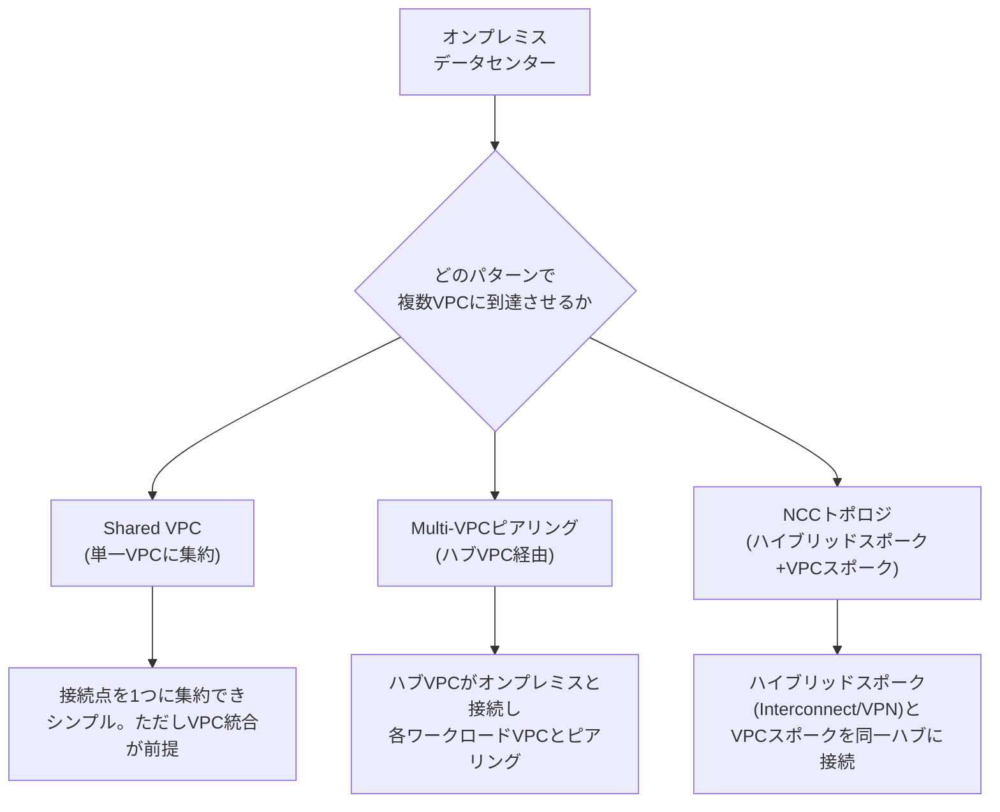
```mermaid
flowchart TB
    OnPrem["オンプレミス\nデータセンター"] --> Choice{どのパターンで\n複数VPCに到達させるか}
    Choice --> P1["Shared VPC\n(単一VPCに集約)"]
    Choice --> P2["Multi-VPCピアリング\n(ハブVPC経由)"]
    Choice --> P3["NCCトポロジ\n(ハイブリッドスポーク+VPCスポーク)"]
    P1 --> P1a["接続点を1つに集約でき\nシンプル。ただしVPC統合が前提"]
    P2 --> P2a["ハブVPCがオンプレミスと接続し\n各ワークロードVPCとピアリング"]
    P3 --> P3a["ハイブリッドスポーク(Interconnect/VPN)と\nVPCスポークを同一ハブに接続"]
```

| パターン | 概要 | 適した状況 |
|---|---|---|
| Shared VPC | 複数チームのリソースを最初から単一VPC(ホストプロジェクト)に集約し、オンプレミス接続もそのVPCに対して1本構成する | 組織全体でネットワークを統合管理する方針が既に取れている場合 |
| Multi-VPCピアリング(ハブ&スポーク) | オンプレミス接続を持つ「ルーティングVPC」を中心に、各ワークロードVPCをピアリングで接続する | 既存の複数VPCを維持しつつ、オンプレミス接続だけを一元化したい場合 |
| NCCトポロジ(ハイブリッドスポーク+VPCスポーク) | オンプレミス接続(Interconnect/VPN)をハイブリッドスポークとしてハブに登録し、各ワークロードVPCもVPCスポークとして同じハブに登録する | 将来的な拡張(スポーク数の増加、複数オンプレサイト)を見込む大規模環境 |

ハブ&スポーク型でVPC Peeringを使う場合の注意点は、VPC Peeringが非推移的であるため、素朴に「オンプレ→ルーティングVPC→ワークロードVPC A」という経路を作っても、ワークロードVPC Aからワークロードルーティング設定を明示的に行わない限りVPC B宛のトラフィックは通らないという点です。NCCはこの非推移性の制約をハブが仲介することで解消し、より少ない運用負荷でスケールできる点が優位性です。

> **出典**: [Hub-and-spoke network architecture](https://cloud.google.com/architecture/deploy-hub-spoke-vpc-network-topology) / [GCP Network Connectivity Center解説](https://medium.com/@adarshpandey022/gcp-network-connectivity-center-embracing-the-hub-and-spoke-topology-b096d9bd775d)

### 1.3.6 オンプレミスからのGoogleサービスへのプライベートアクセス

オンプレミスから、Vertex AIやCloud Storage、BigQueryといったGoogleの公開APIに**インターネットを経由せず**アクセスしたい場合、以下のいずれかの方式を組み合わせます。

```mermaid
flowchart LR
    OnPrem["オンプレミス"] -->|"Interconnect/VPN"| VPC["VPCネットワーク"]
    VPC -->|"Private Google Access\n(サブネット単位で有効化)"| GAPI["Google API\n(restricted.googleapis.com等)"]
    VPC -->|"Private Service Connect\nエンドポイント経由"| GAPI2["Google API\n(独自の内部IPで到達)"]
```

| 方式 | 概要 | 適したケース |
|---|---|---|
| Private Google Access + 限定公開のGoogle アクセス(restricted.googleapis.com) | サブネット単位でPrivate Google Accessを有効化し、オンプレミスからの経路をrestricted VIP(199.36.153.4/30)向けにCloud Router/静的ルートで広告する | VPC Service Controls配下のAPIアクセスを含め、既存のGoogle APIエンドポイント設計を流用したい場合 |
| Private Service Connectエンドポイント | VPC内にGoogle API向けのPSCエンドポイント(内部IP)を作成し、オンプレミスからその内部IPへ到達させる | 独自の内部IPアドレスでルーティング・ファイアウォールをより細かく制御したい場合 |

いずれの方式でも、オンプレミス側のDNS解決を正しく構成することが重要です(`*.googleapis.com`などのドメインを、restricted VIPやPSCエンドポイントのIPに解決させるオーバーライドが必要)。この設計はハイブリッドDNS設計(1.3.9)と密接に関連します。

> **出典**: [Private Service Connect overview](https://cloud.google.com/vpc/docs/private-service-connect) / [Overview of VPC Service Controls](https://cloud.google.com/vpc-service-controls/docs/overview)

### 1.3.7 PSC/VPC Peering経由のマネージドサービスアクセス

1.1.7で扱った「マネージドサービスへの接続計画」をハイブリッド/マルチクラウドの文脈で捉え直すと、オンプレミスや他クラウドからマネージドサービス(Cloud SQL等)へアクセスする経路設計が課題になります。

```mermaid
flowchart TB
    OnPrem["オンプレミス/他クラウド"] -->|"Interconnect/VPN"| ConsumerVPC["コンシューマVPC"]
    ConsumerVPC -->|"Private services access\n(VPC Peering、非推移的)"| ManagedSvc1["Cloud SQL等\n(サービスプロデューサVPC)"]
    ConsumerVPC -->|"Private Service Connect\nエンドポイント"| ManagedSvc2["Cloud SQL等\n(サービスアタッチメント経由)"]
```

Private services access(VPC Peering方式)は非推移的であるため、オンプレミスからハイブリッド接続でコンシューマVPCに到達しても、そのままではPeering先のサービスプロデューサVPCまでは到達**できます**(サービスプロデューサとの接続自体はVPC Peeringのカスタムルート交換設定次第で、オンプレミス発の経路をエクスポートすることが可能)が、複数VPCを跨ぐ複雑な経路になりがちです。一方、PSCエンドポイントは単なる内部IPとして振る舞うため、オンプレミスからのルーティング設計がシンプルになり、複数の消費者VPCや複数リージョンから同一サービスへ接続する場合に扱いやすくなります。

設計判断の目安としては、「単一VPCからの利用が中心で構成をシンプルに保ちたい」場合はPrivate services access、「複数VPC・複数オンプレサイト・将来的な拡張を見込む」場合はPSCを優先する、という整理が実務上のベストプラクティスです。

> **出典**: [Private services access](https://cloud.google.com/vpc/docs/private-services-access) / [Configure connectivity using VPC peering (Database Migration Service)](https://cloud.google.com/database-migration/docs/postgres/configure-connectivity-vpc-peering)

### 1.3.8 オンプレミスとクラウド間のIPアドレス空間設計

ハイブリッド環境全体のIPアドレス設計では、オンプレミスとクラウド双方の既存アドレス空間を俯瞰し、重複を避けることが最優先事項です。

```mermaid
flowchart TB
    A[IPアドレス空間設計の手順] --> B["1. オンプレミスの\n既存アドレス台帳を棚卸し"]
    B --> C["2. Google Cloud側で\n新規に確保する範囲を決定\n(RFC1918内で重複しない範囲)"]
    C --> D["3. マネージドサービス用に\nPrivate services accessの\nレンジを別途確保"]
    D --> E["4. GKE Pod/Serviceレンジなど\n将来拡張分を加味して確保"]
    E --> F["5. 重複が避けられない場合は\nPrivate NATの利用を計画"]
```

| 検討項目 | 設計上の注意 |
|---|---|
| 内部レンジ(internal ranges) | オンプレミスのRFC 1918アドレスとGoogle Cloud側のRFC 1918アドレスが重複しないよう、事前に台帳で調整する |
| 重複の回避 | 買収・合併などで重複が事後的に発覚した場合はPrivate NATで解決可能だが、恒久対応ではなく移行期間の緩和策として位置づけるのが望ましい |
| Private NAT | 非重複の宛先へのみ変換可能。重複したサブネット同士を直接ピアリングすることはできない点に注意 |
| 将来の成長余地 | クラウド側は水平スケールが容易なため、オンプレミスよりも広めのレンジを確保しておくと、後々の再設計コストを削減できる |

この設計はIaCによる一元管理(1.2.3のIPAM自動化)と組み合わせることで、オンプレミス・クラウドを横断したアドレス管理台帳として運用するのがベストプラクティスです。

> **出典**: [Private NAT](https://cloud.google.com/nat/docs/private-nat) / [Using private NAT for networks with overlapping IP spaces](https://cloud.google.com/blog/products/networking/using-private-nat-for-networks-with-overlapping-ip-spaces)

### 1.3.9 ハイブリッドDNSトポロジの設計

ハイブリッドDNS設計は、1.1.3で紹介した基本パターンを、複数のVPC・複数のオンプレミスサイトが存在する現実的な組織構造に適用する応用編です。

```mermaid
flowchart TB
    subgraph OnPrem["オンプレミス"]
        OD["オンプレミスDNSサーバー"]
    end
    subgraph ProdHost["Prod Shared VPCホスト"]
        ProdDNS["Prod DNSプライベートゾーン"]
        InPolicy["インバウンドサーバーポリシー"]
        OutFwd["アウトバウンド転送ゾーン\n(オンプレミスドメイン向け)"]
    end
    subgraph NonProdHost["Non-Prod Shared VPCホスト"]
        NonProdDNS["Non-Prod DNSプライベートゾーン"]
        PeerZone["DNSピアリングゾーン\n(オンプレミスドメイン向け、\nProd VPCをターゲットに設定)"]
    end
    OD <-->|"アウトバウンド/インバウンド転送\n(35.199.192.0/19発信)"| InPolicy
    InPolicy --> ProdDNS
    OutFwd --> OD
    NonProdHost -->|"Prod DNS名前解決を委譲"| ProdHost
    PeerZone -.DNS peering.-> ProdDNS
```

複数のShared VPCが存在する組織では、**オンプレミスとの間でDNSクエリを送受信できるVPCを1つに限定する**のがベストプラクティスです。上図の例では、Prod Shared VPCがオンプレミスとの唯一のDNS窓口となり、Non-Prod環境はDNSピアリングを使ってProd VPC経由でオンプレミスドメインを解決します。

**主要コンポーネントの整理**

| コンポーネント | 役割 | 方向性 |
|---|---|---|
| プライベートゾーン | Cloud DNSが権威を持つゾーン。関連付けたVPCネットワークからのみ解決可能 | - |
| 転送ゾーン(Forwarding zone) | 特定ドメインの問い合わせを外部のネームサーバー(オンプレミス等)に転送 | クラウド→オンプレミス(アウトバウンド) |
| インバウンドサーバーポリシー | オンプレミスのDNSクライアント/サーバーがCloud DNSに問い合わせできるようにする | オンプレミス→クラウド(インバウンド) |
| DNSピアリングゾーン | あるVPC(コンシューマ)が別VPC(プロデューサ)のプライベートゾーンを解決できるようにする、片方向の関係 | VPC→VPC |
| クロスプロジェクトバインディング | Shared VPCのサービスプロジェクト側で直接DNSゾーンを作成・管理できるようにする仕組み。ホストプロジェクトにプレースホルダVPCを作る必要がなく、any-to-anyの名前解決が可能 | Shared VPC内 |

**設計チェックポイント**

1. **ドメイン名前空間の分離**: オンプレミスとGoogle Cloudで異なるサブドメイン(`corp.example.com` / `gcp.example.com`)を使うsplit-domain設計が転送ルールをシンプルにする。
2. **ファイアウォールの許可**: オンプレミス側のファイアウォールでCloud DNSからの送信元(`35.199.192.0/19`)からのクエリを許可する。DNSはUDP/TCPポート53を使用。
3. **自動生成される`.internal`ゾーンの扱い**: VMの内部DNS名(`projectname.internal`など)は自動生成されるが、これをオンプレミスや他プロジェクトから解決させたい場合、DNSピアリングでハブプロジェクトに集約する設計が有効。
4. **Cloud DNSはフォワーディングをサポートしないパブリックゾーン**: パブリックゾーンは常に権威応答のみを返すため、外部ネームサーバーへの委譲が必要な場合は別途NSレコードでの委譲を設計する。

> **出典**: [Best practices for Cloud DNS](https://cloud.google.com/dns/docs/best-practices) / [DNS zones overview](https://cloud.google.com/dns/docs/zones/zones-overview) / [Cloud DNS overview](https://cloud.google.com/dns/docs/overview) / [Create a zone with cross-project binding](https://cloud.google.com/dns/docs/zones/cross-project-binding)

### 1.3.10 ハイブリッド接続のMTUサイジング

1.2.5で解説したMTUの考え方を、ハイブリッド接続(Cloud Interconnect / HA VPN)に適用する際の要点を整理します。

| 接続方式 | サポートされるMTU | 設計上の注意 |
|---|---|---|
| Dedicated/Partner Interconnect(VLANアタッチメント) | 1440・1460・1500・8896バイト | 同一VPCに接続する全アタッチメントで統一したMTUを使うことを推奨。ジャンボフレーム(8896)は非暗号化のIPv4/IPv6アタッチメントのみ |
| Cross-Site Interconnect | 最大9000バイト | サイト間接続の高スループットユースケース向け |
| HA VPN / Classic VPN | ペイロードMTUは既定1460バイト(暗号方式やIPv4/IPv6で若干変動) | IPsec/ESPカプセル化のオーバーヘッド分、VPCのMTUをそのまま使うとフラグメンテーションが発生し得る |
| Google API Client Libraries | 常に1440バイトのMTUパケットを使用 | VLANアタッチメントがより大きなMTUに設定されていてもAPIクライアント通信はこの値が使われる点に注意 |

HA VPNをCloud Interconnectの上に重ねる「HA VPN over Cloud Interconnect」構成(1.3.11で詳述)では、Interconnect区間のMTUとVPNのペイロードMTUの両方を考慮した設計が必要になり、特にIPsecのオーバーヘッド分(概ね60〜100バイト程度)を差し引いた実効MTUを事前に計算しておくことがベストプラクティスです。

> **出典**: [Maximum transmission unit](https://cloud.google.com/vpc/docs/mtu) / [MTU considerations (Cloud VPN)](https://cloud.google.com/network-connectivity/docs/vpn/concepts/mtu-considerations) / [Modify VLAN attachments](https://cloud.google.com/network-connectivity/docs/interconnect/how-to/partner/modifying-vlans)

### 1.3.11 Interconnect暗号化オプション(MACsec / HA VPN over Interconnect)

Cloud Interconnectは既定では暗号化されていません(Googleネットワーク内は物理的に保護されていますが、コロケーション施設からGoogleエッジまでの区間は平文です)。規制要件などで暗号化が必須の場合、以下の2つの選択肢があります。

```mermaid
flowchart TB
    A[Interconnect暗号化要件] --> B{"レイヤー2で\n暗号化するか\nレイヤー3で暗号化するか"}
    B -->|"レイヤー2\n(オンプレミスルーター〜\nGoogleエッジ間)"| C["MACsec for Cloud Interconnect"]
    B -->|"レイヤー3\n(VPC〜オンプレミス\nエンドツーエンド)"| D["HA VPN over Cloud Interconnect"]
    C --> C1["IEEE 802.1AE準拠\nGCM-AES-256"]
    C --> C2["Googleネットワーク内部の\n暗号化は対象外"]
    D --> D1["IPsecでVPC〜オンプレミス間を\nエンドツーエンドに暗号化"]
    D --> D2["Interconnectの帯域を使いつつ\nVPNのセキュリティを確保"]
```

| 方式 | 暗号化区間 | 特徴 |
|---|---|---|
| MACsec for Cloud Interconnect | オンプレミスルーターとGoogleのピアリングエッジルーター間(レイヤー2) | 追加コストなし。10/100/400Gbps回線で利用可(10GbpsはアカウントマネージャーへのContactが必要)。Googleネットワーク内部の暗号化は対象外のため、多層防御としてIPsec/TLSとの併用が推奨される |
| HA VPN over Cloud Interconnect | VPCネットワークとオンプレミス間(レイヤー3、エンドツーエンド) | Interconnectの帯域幅とプライベート経路を使いながら、IPsecによる暗号化を実現。MACsecがカバーしないGoogleネットワーク内部の区間もIPsecでは論理的に暗号化された通信として扱える |

Googleが推奨する多層防御のアプローチは、**レイヤー2でMACsec、レイヤー3でIPsec(HA VPN over Interconnect)、さらにアプリケーション層でTLS**という3層の暗号化を組み合わせる設計です。規制要件がレイヤー3以上の暗号化を求める場合は、MACsec単体では要件を満たさないため、HA VPN over Cloud Interconnectを組み合わせる必要がある点に注意してください。

> **出典**: [MACsec for Cloud Interconnect overview](https://cloud.google.com/network-connectivity/docs/interconnect/concepts/macsec-overview) / [Set up MACsec](https://cloud.google.com/network-connectivity/docs/interconnect/how-to/macsec/set-up-macsec)

---

## 1.4 GKE向けの設計

タスク1.4は、1.1.5で触れたGKE計画をさらに深掘りし、ノード・コントロールプレーン・IPアドレス・ロードバランシングの設計判断を扱います。

### 1.4.1 パブリック/プライベートノードとノードプール

GKEクラスタのノードに外部IPアドレスを持たせるかどうかは、セキュリティ境界設計の第一歩です。

```mermaid
flowchart TB
    A[ノードの公開範囲] --> B{ノードに外部IPが必要か}
    B -->|"必要\n(パブリックノード)"| C["各ノードに外部IPが付与される\n(インターネットから直接到達可能)"]
    B -->|"不要\n(プライベートノード)"| D["ノードは内部IPのみ\n(--enable-private-nodes)"]
    D --> D1["インターネットへのアウトバウンドは\nCloud NAT経由で提供可能"]
    D --> D2["インバウンドはロードバランサ経由のみ"]
```

**設計原則**: 特別な理由がない限り**プライベートノード**を既定とすべきです。プライベートノードでもServiceをLoadBalancerタイプで公開すれば外部からアクセス可能なため、ノード自体を外部公開する必要性は限定的です。プライベートノードがインターネットへの発信(コンテナイメージのpullなど)を必要とする場合は、Cloud NATを組み合わせて設計します。

ノードプールは、マシンタイプ・スポット/オンデマンドの別・ゾーン配置・ネットワークタグなどをグループ化する単位であり、後述の1.4.7でネットワーク観点の構成を扱います。

> **出典**: [Creating a private cluster](https://cloud.google.com/kubernetes-engine/docs/how-to/legacy/network-isolation) / [Private GKE Clusters解説](https://cloudwebschool.com/docs/gcp/containers-and-kubernetes/private-gke-clusters/)

### 1.4.2 パブリック/プライベートコントロールプレーンエンドポイント

コントロールプレーン(kube-apiserver)へのアクセス経路は、ノードの公開範囲とは独立して設計できます。GKEバージョン1.29以降では、より柔軟な「ネットワーク分離のカスタマイズ」機能が使えます。

```mermaid
flowchart TB
    A[コントロールプレーンアクセス設計] --> B{"外部エンドポイントを\n無効化するか"}
    B -->|"有効のまま\n(パブリックエンドポイント)"| C["認可済みネットワーク\n(Authorized Networks)で\nアクセス元を制限"]
    B -->|"無効化\n(プライベートエンドポイントのみ)"| D["VPC内部、またはVPNや\nInterconnectで接続された\nネットワークからのみアクセス可"]
    D --> D1["DNSベースエンドポイント\n(推奨)"]
    D --> D2["IPベースの内部エンドポイント"]
```

| アクセスパターン | 説明 | 適したケース |
|---|---|---|
| パブリックエンドポイント + 認可済みネットワーク | 外部到達可能だが、許可したCIDRからのみkube-apiserverへの接続を受け付ける | 運用担当者が様々な場所から`kubectl`を実行する必要があり、IP制限で十分と判断できる場合 |
| プライベートエンドポイントのみ(`--enable-private-endpoint`) | コントロールプレーンの外部公開を完全に無効化 | 金融・医療など、コントロールプレーンへの到達経路を完全にプライベートネットワーク内に限定したい場合 |
| DNSベースのエンドポイントアクセス(推奨) | IPアドレスではなくDNS名でコントロールプレーンにアクセスし、IAMで認可を制御 | 複数VPC/複数プロジェクトからの接続や、IPベースの認可済みネットワーク管理の複雑さを避けたい場合 |

**接続経路の設計パターン**(プライベートエンドポイントのみの場合、以下のいずれかで到達させる):

- Cloud Build private pools(GCPネイティブCI/CD向け、同一VPC内から到達)
- 踏み台(bastion)ホスト経由のSSHトンネル
- Cloud VPN / Cloud InterconnectでオンプレミスからVPCに接続し、そこからアクセス

GKE 1.29以降で導入された「ネットワーク分離のカスタマイズ」機能では、コントロールプレーンの内部エンドポイント用サブネットをデフォルト(プライマリレンジ)から独立して指定できるようになり、Shared VPC環境でのIPアドレス設計がより柔軟になっています。

> **出典**: [Customize your network isolation in GKE](https://cloud.google.com/kubernetes-engine/docs/how-to/advanced-private-cluster-config) / [Create a VPC-native cluster](https://cloud.google.com/kubernetes-engine/docs/how-to/alias-ips) / [About Private Service Connect (GKE networking)](https://cloud.google.com/kubernetes-engine/docs/concepts/private-service-connect)

### 1.4.3 サブネット計画:プライマリレンジとセカンダリレンジ

GKEのVPCネイティブクラスタは、1つのサブネットに対して**プライマリレンジ(ノード用**)と**2つのセカンダリレンジ(Pod用・Service用**)を組み合わせて使用します。

```mermaid
flowchart TB
    subgraph Subnet["GKE専用サブネット"]
        Primary["プライマリレンジ\n(ノードの内部IP)"]
        Sec1["セカンダリレンジ1\n(Pod IP)"]
        Sec2["セカンダリレンジ2\n(Service IP、ClusterIP)"]
    end
    Node["ノードVM"] -->|割り当て| Primary
    Pod["Pod群"] -->|割り当て| Sec1
    Svc["Kubernetes Service"] -->|割り当て| Sec2
```

| レンジ | サイズ設計の考え方 |
|---|---|
| プライマリ(ノード) | 最大ノード数 + オートスケール余裕分を見込んだサイズ。ノードプールの拡張やアップグレード時のサージ(一時的な追加ノード)分も加味する |
| セカンダリ(Pod) | 「最大ノード数 × ノードあたりの最大Pod数」を上回るサイズが必要。既定では1ノードあたり最大110 Pod程度を想定できるため、大規模クラスタでは/24未満のような狭いレンジは避ける(UI上、ノードプールレベルのPodセカンダリレンジは/24以上が必須) |
| セカンダリ(Service) | クラスタが公開するServiceの総数を見込んで確保。Podレンジほど急速に消費されないことが多いが、マイクロサービス数が非常に多い環境では余裕を持たせる |

**設計上の重要な制約**: Podセカンダリレンジは、後から**拡張**は可能な場合がありますが、実質的にクラスタ作成時の見積もりが不十分だと大規模な再設計(クラスタの再作成)が必要になるケースが多いため、初期設計で「将来のノード数上限」を保守的すぎない範囲で余裕を持って見積もることが最重要ポイントです。

> **出典**: [Create a VPC-native cluster](https://cloud.google.com/kubernetes-engine/docs/how-to/alias-ips) / [Creating a private cluster](https://cloud.google.com/kubernetes-engine/docs/how-to/legacy/network-isolation)

### 1.4.4 GKEのIPアドレス計画

GKEで利用できるIPアドレスの選択肢は多岐にわたり、IPv4アドレス枯渇への対応策として複数の手法が用意されています。

```mermaid
flowchart TB
    A[GKE IPアドレス計画] --> B["RFC 1918\n(標準プライベートアドレス)"]
    A --> C["非RFC1918\n(Class E等)"]
    A --> D["Googleマネージドサービスレンジ\n(コントロールプレーン用等)"]
    A --> E["Private Service Connect\n(コントロールプレーン到達用)"]
    A --> F["共有IPレンジ\n(複数クラスタで同一Podレンジを共有)"]
    A --> G["PUPI\n(1.2.3参照)"]
```

| 選択肢 | 用途 | 設計上の注意 |
|---|---|---|
| RFC 1918 | ノード・Pod・Serviceの標準的な選択 | 組織内での重複回避が最優先事項 |
| 非RFC1918(Class E等) | RFC1918空間が枯渇した大規模組織でのPodレンジ拡張 | オンプレミスやNCCで非RFC1918を受け入れられるかを事前確認。受け入れ不可の場合はPrivate NATで変換 |
| Googleマネージドサービスレンジ | コントロールプレーンの内部エンドポイントなど、Google管理下のコンポーネントに割り当てられる | ユーザーが直接設計する範囲ではないが、重複しないよう他のレンジ設計時に考慮 |
| Private Service Connect(PSCベースのクラスタ) | コントロールプレーンとノード間の通信をPSC経由にすることで、VPC Peeringを使わずに疎結合な接続を実現 | 1ゾーン/リージョンあたり最大75クラスタ(VPC Peering方式)という上限を回避し、最大1000クラスタまでスケール可能 |
| 共有IPレンジ(Shared Pod/Serviceレンジ) | 複数のGKEクラスタで同一のセカンダリレンジを共有し、IPアドレス消費を抑制 | クラスタごとに専用レンジを割り当てる場合に比べてIP効率が向上するが、クラスタ間のIP管理を慎重に行う必要がある |
| PUPI | 1.2.3で解説したプライベート用途のパブリックIP。GKEのPodレンジで特に有効 | Pod間の直接通信要件があればSNAT設定が必要 |

**IP枯渇対策の優先順位の目安**は、①既存のRFC1918空間内でサブネット設計を見直す、②PSCベースのクラスタでVPC Peering起因のクラスタ数上限を回避する、③どうしても不足する場合にPUPIや非RFC1918を検討する、という順序で考えるのが一般的です。

> **出典**: [Configuring privately used public IPs for GKE](https://cloud.google.com/kubernetes-engine/docs/how-to/configuring-privately-used-public-ips-for-gke) / [About Private Service Connect (GKE networking)](https://cloud.google.com/kubernetes-engine/docs/concepts/private-service-connect)

### 1.4.5 IPv6の計画

GKEはIPv4シングルスタックに加え、デュアルスタック(IPv4+IPv6)クラスタをサポートしています。IPv6を計画する際は、サブネットのIPv6対応(1.2.3参照)と合わせて、Pod・ServiceそれぞれにIPv6アドレスを割り当てるかどうかを設計します。将来的なIPv4アドレス枯渇に備え、新規に大規模なGKE基盤を構築する場合はデュアルスタック対応を初期設計に組み込んでおくことで、後からの移行コストを避けられます。IPv6を採用する場合も、外部公開が必要なService(LoadBalancerタイプ)については、Application Load BalancerやNetwork Load BalancerのIPv6termination対応状況を確認したうえでロードバランサ設計(1.4.6)を行う必要があります。

### 1.4.6 GKE向けロードバランシングの設計

GKEでは、Kubernetesの標準的なIngress/Service/Gateway APIリソースが、Google Cloudのロードバランサにマッピングされます。

```mermaid
flowchart TB
    A[GKEトラフィック公開方法] --> B["GKE Gateway コントローラ\n(Gateway API準拠、推奨)"]
    A --> C["GKE Ingress コントローラ\n(レガシーIngressリソース)"]
    A --> D["Service (type: LoadBalancer)"]
    B --> B1["外部/内部Application LB\nマルチクラスタゲートウェイにも対応"]
    C --> C1["外部Application LBに\nマッピング"]
    D --> D1["Network Load Balancer\n(パススルー)にマッピング"]
    A --> E["Network Endpoint Group (NEG)"]
    E --> E1["Pod IPを直接バックエンドとして\nロードバランサに登録\n(コンテナネイティブ ロードバランシング)"]
```

| 手法 | マッピング先 | 特徴 |
|---|---|---|
| GKE Gatewayコントローラ | Application Load Balancer(内部/外部、リージョナル/グローバル) | Kubernetes Gateway APIの標準に準拠し、マルチクラスタ・マルチテナントのトラフィック管理に強い。新規構築では第一候補 |
| GKE Ingressコントローラ | 外部Application Load Balancer | 従来からのIngressリソースを使う場合の選択肢。Gatewayへの移行が長期的には推奨される |
| Service(`type: LoadBalancer`) | パススルーNetwork Load Balancer | L4レベルでのシンプルな公開、クライアントIP保持が必要な場合 |
| Network Endpoint Group(NEG) | 各種ロードバランサのバックエンド | Pod IPを直接バックエンドとして登録する「コンテナネイティブ ロードバランシング」を実現し、kube-proxy経由のホップを省略してレイテンシを改善 |

コンテナネイティブロードバランシング(NEGベース)は、GKEでロードバランサを構成する際の事実上の標準です。従来のインスタンスグループベースの構成に比べ、ヘルスチェックがPodレベルで行われるためより正確なトラフィック分散が可能になり、Pod単位のスケールイベントへの追従性も向上します。

> **出典**: [Choose a load balancer](https://cloud.google.com/load-balancing/docs/choosing-load-balancer) / [Network Service Tiers for GKE](https://cloud.google.com/kubernetes-engine/docs/how-to/network-tiers)

### 1.4.7 ノードプール構成の追加と管理

ノードプールはネットワーク設計の観点からも複数の考慮点があります。

| 観点 | 設計ポイント |
|---|---|
| ネットワークタグ | ノードプール単位でネットワークタグを付与し、ファイアウォールルールの適用範囲を制御する(例:特定のノードプールのみ外部との通信を許可する) |
| ゾーン配置 | マルチゾーンのノードプールにすることで、単一ゾーン障害時の可用性を確保する |
| サービスアカウント | ノードプールごとに異なるサービスアカウントを割り当て、ワークロードごとのAPIアクセス権限を最小化する(ネットワークリソースへのアクセス権限を含む) |
| Dataplane V2の有効化 | eBPFベースのデータプレーン(GKE Dataplane V2)を有効にすることで、Ciliumベースのネットワークポリシー実装やより高精度なフローログ・オブザーバビリティが利用可能になる |
| SNAT/IP Masqueradeポリシー | Pod発信トラフィックのSNAT対象範囲を制御し、意図しないIPマスカレードによる送信元IP消失を防ぐ |
| DNS構成 | ノードローカルDNSキャッシュ、Cloud DNSベースのクラスタスコープDNS、kube-dnsのいずれを使うかを選択し、大規模クラスタでのDNSクエリ負荷を軽減する |

ノードプールの追加は、既存クラスタに異なるマシンタイプ/ネットワークタグ/サービスアカウントを持つワーカー群を段階的に追加していく運用を可能にし、例えば「一般ワークロード用ノードプール」と「GPU/機械学習ワークロード専用ノードプール(専用サブネットレンジ・専用ファイアウォールルール)」を分離するといった設計に活用されます。

> **出典**: [Customize your network isolation in GKE](https://cloud.google.com/kubernetes-engine/docs/how-to/advanced-private-cluster-config) / [Configuring privately used public IPs for GKE](https://cloud.google.com/kubernetes-engine/docs/how-to/configuring-privately-used-public-ips-for-gke)

---

## 設計チェックリスト

Section 1の内容を、実際の設計レビューで使えるチェックリスト形式にまとめました。試験直前の総復習にも活用できます。

- [ ] 外部向けワークロードのネットワークサービス階層(Premium/Standard)を要件に応じて明示的に選択したか
- [ ] 可用性要件をゾーン/リージョン/人為的ミスの3レイヤーに分解し、それぞれの緩和策を設計したか
- [ ] DNSトポロジで「どちらが権威か」「転送方向」を明確にし、split-domain設計を検討したか
- [ ] ロードバランサ選定を「トラフィック種別」「内部/外部」「グローバル/リージョナル」の3軸で判断したか
- [ ] Shared VPCを使う場合、IAMロールをサブネット単位まで最小権限化したか
- [ ] マネージドサービスへの接続方式(Private services access / PSC / Serverless VPC Access)を用途ごとに整理したか
- [ ] VPC Peering数、Cloud RouterのBGPピア数などのQuotaを将来の成長を見込んで確認・申請したか
- [ ] VPC種別(Standalone/Shared)とVPCの数を、環境分離要件と運用コストのバランスで決定したか
- [ ] マルチVPC接続方式(Peering/NCC/PSC)をスケールと推移性の要件から選定したか
- [ ] IPAM戦略(サブネット、IPv6、PUPI、Private NAT、BYOIP)をオンプレミスとの重複を避けて設計したか
- [ ] 動的ルーティングモード(グローバル/リージョナル)をマルチリージョン要件に応じて選択したか
- [ ] MTUをVM・VPC・VLANアタッチメント・VPNの各区間で整合させたか
- [ ] サードパーティアプライアンス挿入時、ポリシーベースルートと内部LBネクストホップの組み合わせを検討したか
- [ ] ハイブリッド接続方式(Interconnect/VPN/SD-WAN)を帯域・SLA・セキュリティ要件で選定したか
- [ ] マルチクラウド接続でCloud VPNとCross-Cloud Interconnectの使い分けを検討したか
- [ ] Direct PeeringよりVerified Peering Providerを優先する原則を理解しているか
- [ ] 99.99%可用性のための冗長構成(4接続構成、2インターフェースHA VPN)を把握しているか
- [ ] オンプレミスから複数VPCへのアクセスパターン(Shared VPC/Multi-VPC Peering/NCC)を比較検討したか
- [ ] オンプレミスからGoogle APIへのプライベートアクセス(Private Google Access/PSC)を設計したか
- [ ] オンプレミス・クラウド間のIPアドレス空間の重複有無を事前に棚卸ししたか
- [ ] ハイブリッドDNS設計で、オンプレミス接続窓口となるVPCを1つに限定したか
- [ ] Interconnect暗号化要件がある場合、MACsecとHA VPN over Interconnectの適用範囲の違いを理解しているか
- [ ] GKEのノード・コントロールプレーンの公開範囲(パブリック/プライベート)を最小公開の原則で決定したか
- [ ] GKEのPod/Serviceセカンダリレンジを将来のノード数上限まで見込んで確保したか
- [ ] GKEのIPアドレス枯渇対策(PSCベースクラスタ、共有レンジ、PUPI)の優先順位を理解しているか
- [ ] GKEのロードバランシングをコンテナネイティブ(NEGベース)で設計したか

---

## まとめ

Section 1「Designing and planning a Google Cloud VPC network」は、試験全体の約21%を占める最重要領域であり、その本質は**個別機能の暗記ではなく、要件からアーキテクチャを導き出すトレードオフ判断力**です。本ガイドで扱った4つのタスクは、以下のように相互に関連しています。

```mermaid
flowchart LR
    T11["1.1 全体アーキテクチャ\n(階層/HA/DNS/LB/GKE概要/IAM/\nマネージドサービス/Quota)"] --> T12["1.2 VPC設計\n(種類/接続方式/IPAM/\nルーティングモード/MTU/NVA)"]
    T12 --> T13["1.3 ハイブリッド/マルチクラウド\n(Interconnect/VPN/Peering各種/\nDNS/暗号化)"]
    T12 --> T14["1.4 GKE設計\n(ノード/コントロールプレーン/\nIP計画/LB)"]
    T13 --> T14
```

学習の進め方としては、まず1.1で「何を決める必要があるか」の全体像を掴み、1.2でVPC内部の設計原則(特にIPAM)を固め、1.3でその設計をハイブリッド/マルチクラウドに拡張し、最後に1.4でGKEという最もIPアドレス消費の激しいワークロードに適用する、という順序で理解を積み上げると効果的です。

試験対策としては、単に「この機能は何をするか」を覚えるのではなく、本ガイドの各セクションにある比較テーブルや意思決定フローチャートを使って、**「この要件ならどちらを選ぶか」を即座に判断できる状態**を目指してください。特にSection 2(実装)以降は、ここで学んだ設計判断がそのまま実装コマンド・設定項目の選択に直結するため、Section 1の理解度がその後の学習効率を左右します。

---

## 参考文献・出典

本ガイドの内容は、以下のGoogle Cloud公式ドキュメントを主な出典としています。

### 試験情報

- [Professional Cloud Network Engineer 認定試験ページ](https://cloud.google.com/learn/certification/cloud-network-engineer)
- [Professional Cloud Network Engineer Exam Guide (PDF)](https://services.google.com/fh/files/misc/professional_cloud_network_engineer_exam_guide_english.pdf)

### 1.1 全体的なネットワークアーキテクチャ

- [Network Service Tiers overview](https://cloud.google.com/network-tiers/docs/overview)
- [Choose a load balancer](https://cloud.google.com/load-balancing/docs/choosing-load-balancer)
- [Cloud Load Balancing overview](https://cloud.google.com/load-balancing/docs/load-balancing-overview)
- [IAM roles for Networking-related job functions](https://cloud.google.com/iam/docs/job-functions/networking)
- [Shared VPC overview](https://cloud.google.com/vpc/docs/shared-vpc)
- [Roles and permissions for Cloud Load Balancing](https://cloud.google.com/load-balancing/docs/access-control)
- [Private services access](https://cloud.google.com/vpc/docs/private-services-access)
- [Private Service Connect overview](https://cloud.google.com/vpc/docs/private-service-connect)
- [Serverless VPC Access overview](https://cloud.google.com/vpc/docs/serverless-vpc-access)
- [Quotas and limits (VPC)](https://cloud.google.com/vpc/docs/quota)
- [Quotas and limits (Network Connectivity)](https://cloud.google.com/network-connectivity/quotas)
- [Best practices for Cloud DNS](https://cloud.google.com/dns/docs/best-practices)

### 1.2 VPCネットワークの設計

- [VPC networks](https://cloud.google.com/vpc/docs/vpc)
- [Virtual Private Cloud (VPC) overview](https://cloud.google.com/vpc/docs/overview)
- [VPC Network Peering](https://cloud.google.com/vpc/docs/vpc-peering)
- [Hub-and-spoke network architecture](https://cloud.google.com/architecture/deploy-hub-spoke-vpc-network-topology)
- [VPC spokes overview (Network Connectivity Center)](https://cloud.google.com/network-connectivity/docs/network-connectivity-center/concepts/vpc-spokes-overview)
- [Subnets](https://cloud.google.com/vpc/docs/subnets)
- [Alias IP ranges](https://cloud.google.com/vpc/docs/alias-ip)
- [Configure alias IP ranges](https://cloud.google.com/vpc/docs/configure-alias-ip-ranges)
- [Configuring privately used public IPs for GKE](https://cloud.google.com/kubernetes-engine/docs/how-to/configuring-privately-used-public-ips-for-gke)
- [Private NAT](https://cloud.google.com/nat/docs/private-nat)
- [Private NAT for Network Connectivity Center spokes](https://cloud.google.com/nat/docs/about-private-nat-for-ncc)
- [Cloud NAT overview](https://cloud.google.com/nat/docs/overview)
- [Maximum transmission unit](https://cloud.google.com/vpc/docs/mtu)
- [Change the MTU setting of a VPC network](https://cloud.google.com/vpc/docs/change-mtu-vpc-network)
- [Policy-based routes](https://cloud.google.com/vpc/docs/policy-based-routes)
- [Internal passthrough Network Load Balancers as next hops](https://cloud.google.com/load-balancing/docs/internal/ilb-next-hop-overview)

### 1.3 ハイブリッド/マルチクラウドネットワーク

- [Cloud Interconnect overview](https://cloud.google.com/network-connectivity/docs/interconnect/concepts/overview)
- [Dedicated Interconnect overview](https://cloud.google.com/network-connectivity/docs/interconnect/concepts/dedicated-overview)
- [Partner Interconnect overview](https://cloud.google.com/network-connectivity/docs/interconnect/concepts/partner-overview)
- [Cross-Cloud Interconnect overview](https://cloud.google.com/network-connectivity/docs/interconnect/concepts/cci-overview)
- [Cloud Interconnect Service Level Agreement (SLA)](https://cloud.google.com/network-connectivity/docs/interconnect/sla)
- [Establish 99.99% availability for Dedicated Interconnect](https://cloud.google.com/network-connectivity/docs/interconnect/tutorials/dedicated-creating-9999-availability)
- [Establish 99.99% availability for Partner Interconnect](https://cloud.google.com/network-connectivity/docs/interconnect/tutorials/partner-creating-9999-availability)
- [Cloud VPN overview](https://cloud.google.com/network-connectivity/docs/vpn/concepts/overview)
- [HA VPN topologies](https://cloud.google.com/network-connectivity/docs/vpn/concepts/topologies)
- [Create HA VPN connections between Google Cloud and AWS](https://cloud.google.com/network-connectivity/docs/vpn/tutorials/create-ha-vpn-connections-google-cloud-aws)
- [Establish BGP sessions (Cloud Router)](https://cloud.google.com/network-connectivity/docs/router/how-to/configuring-bgp)
- [Choosing a Network Connectivity product](https://cloud.google.com/network-connectivity/docs/how-to/choose-product)
- [Direct Peering overview](https://cloud.google.com/network-connectivity/docs/direct-peering)
- [Verified Peering Provider overview](https://cloud.google.com/network-connectivity/docs/verified-peering-provider)
- [Carrier Peering overview](https://cloud.google.com/network-connectivity/docs/carrier-peering)
- [DNS zones overview](https://cloud.google.com/dns/docs/zones/zones-overview)
- [Cloud DNS overview](https://cloud.google.com/dns/docs/overview)
- [Create a zone with cross-project binding](https://cloud.google.com/dns/docs/zones/cross-project-binding)
- [MTU considerations (Cloud VPN)](https://cloud.google.com/network-connectivity/docs/vpn/concepts/mtu-considerations)
- [Modify VLAN attachments](https://cloud.google.com/network-connectivity/docs/interconnect/how-to/partner/modifying-vlans)
- [MACsec for Cloud Interconnect overview](https://cloud.google.com/network-connectivity/docs/interconnect/concepts/macsec-overview)
- [Set up MACsec](https://cloud.google.com/network-connectivity/docs/interconnect/how-to/macsec/set-up-macsec)
- [Overview of VPC Service Controls](https://cloud.google.com/vpc-service-controls/docs/overview)

### 1.4 GKE向けの設計

- [Creating a private cluster](https://cloud.google.com/kubernetes-engine/docs/how-to/legacy/network-isolation)
- [Customize your network isolation in GKE](https://cloud.google.com/kubernetes-engine/docs/how-to/advanced-private-cluster-config)
- [Create a VPC-native cluster](https://cloud.google.com/kubernetes-engine/docs/how-to/alias-ips)
- [About Private Service Connect (GKE networking)](https://cloud.google.com/kubernetes-engine/docs/concepts/private-service-connect)
- [Configure external traffic with Network Service Tiers (GKE)](https://cloud.google.com/kubernetes-engine/docs/how-to/network-tiers)

---

*本ガイドはGoogle Cloud公式ドキュメントおよび公式Exam Guideに基づいて作成されていますが、試験内容は予告なく変更される場合があります。最新の出題範囲は必ず[公式認定ページ](https://cloud.google.com/learn/certification/cloud-network-engineer)でご確認ください。*
