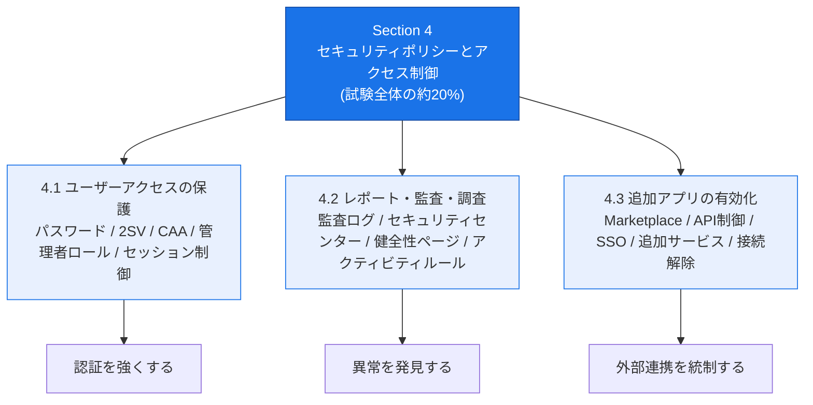
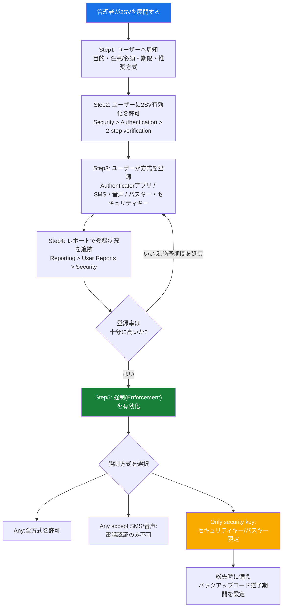
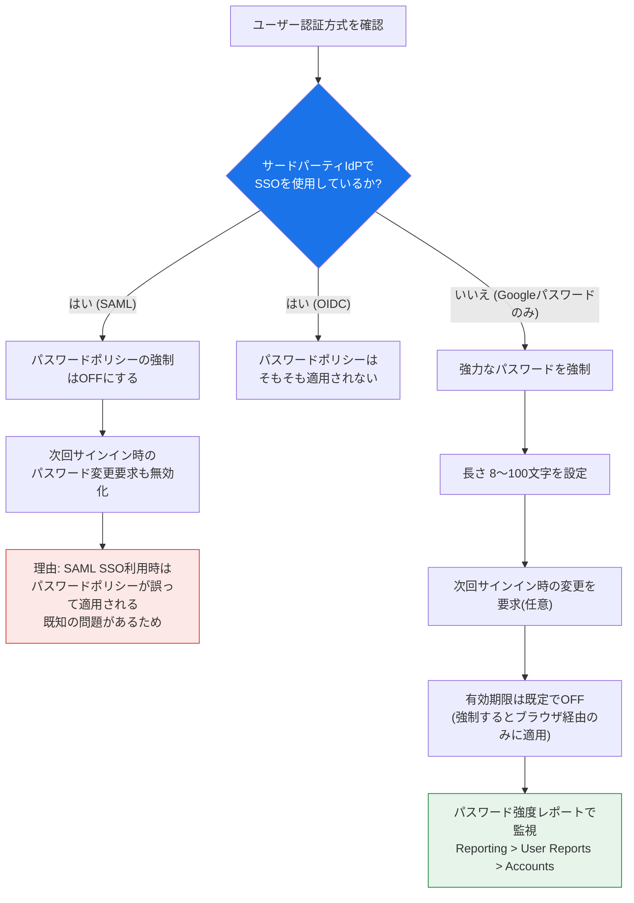
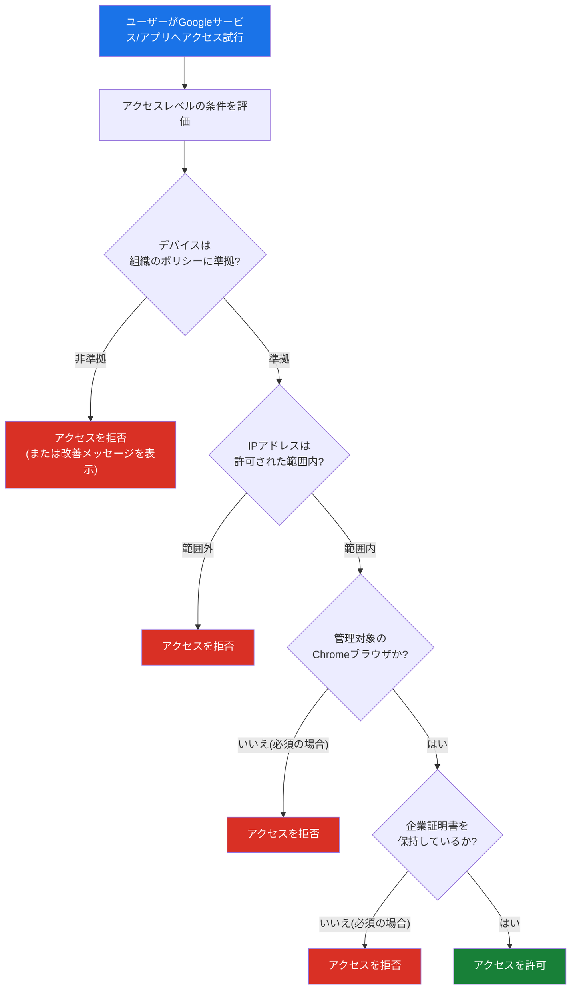
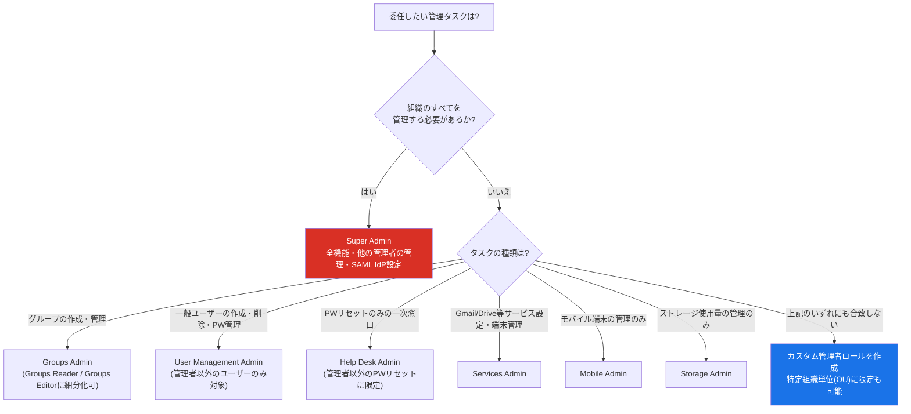
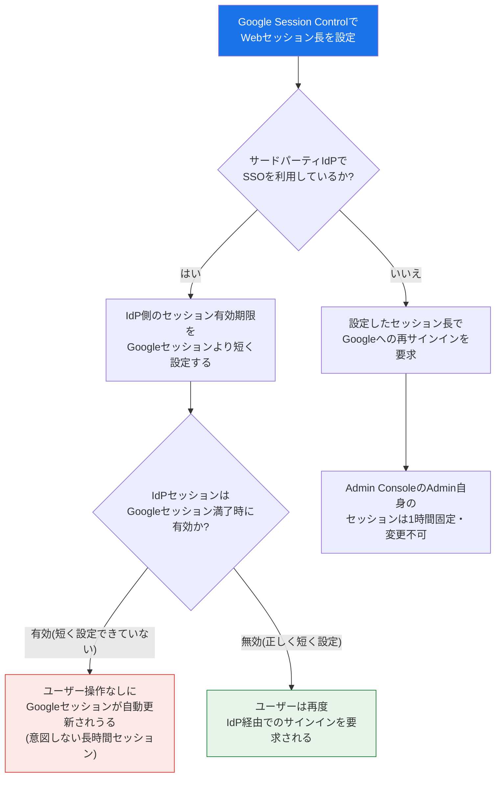
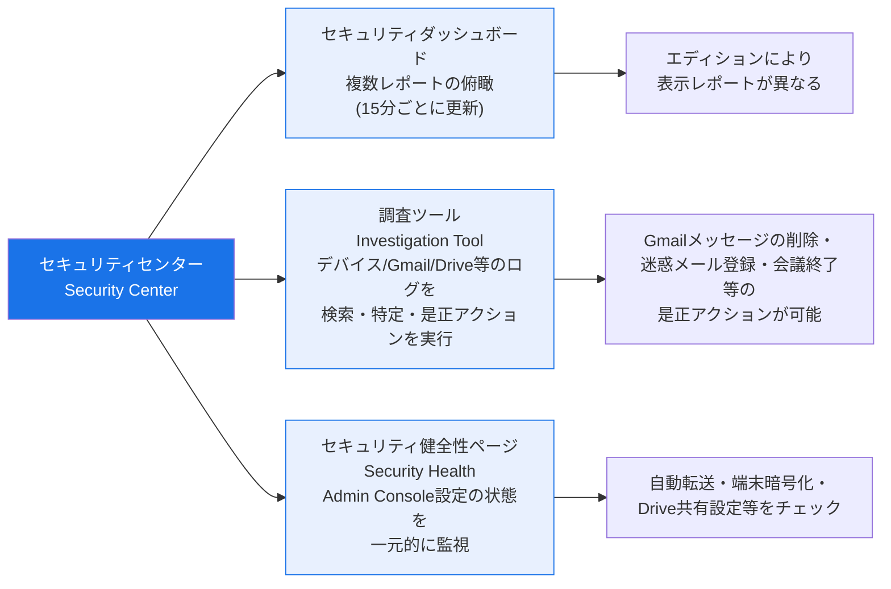
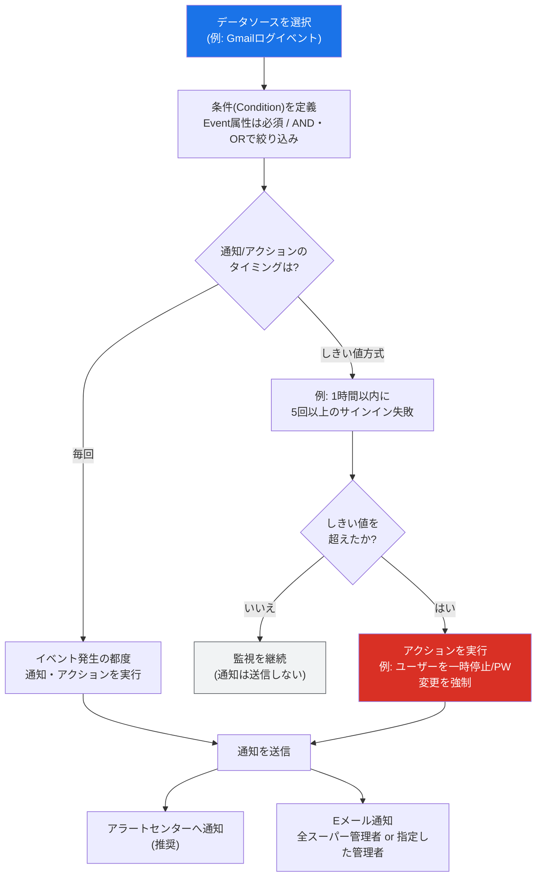
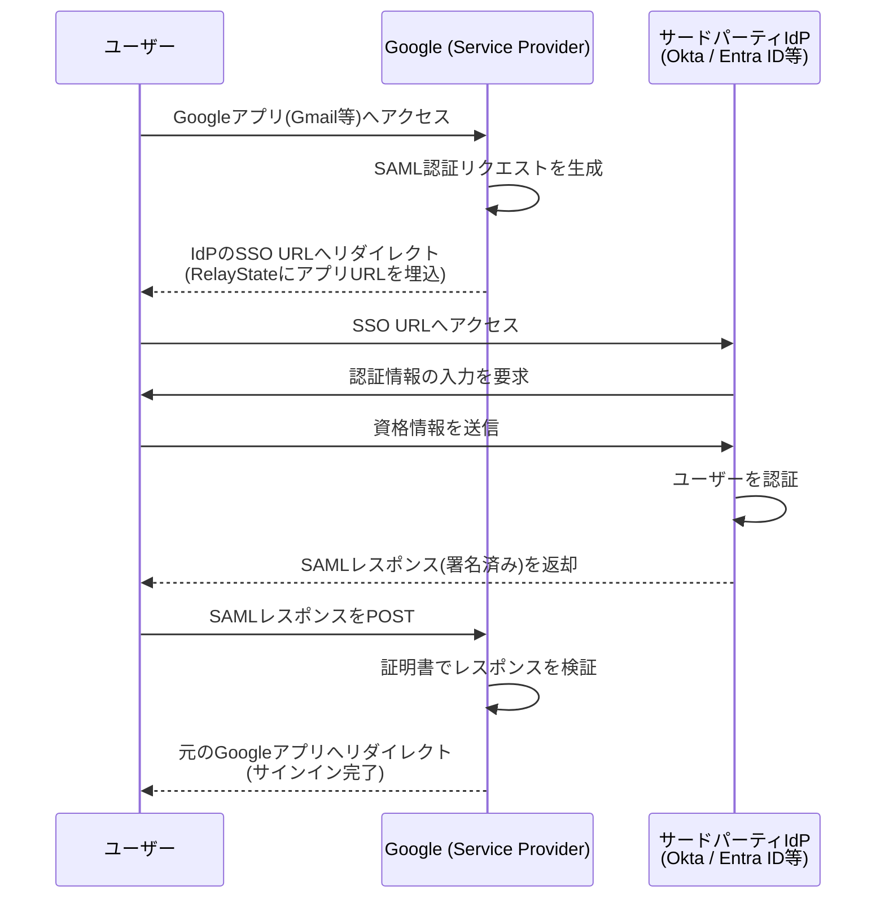
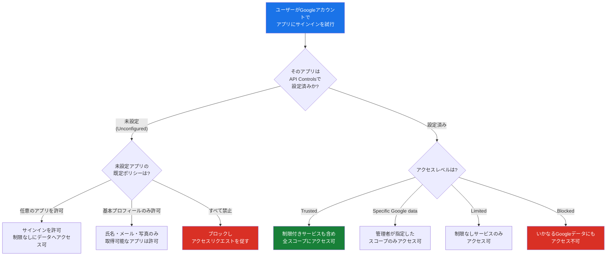

# Associate Google Workspace Administrator 試験対策ガイド

## Section 4: セキュリティポリシーとアクセス制御の管理

*Managing security policies and access controls(出題比率 約20%)*

---

## この章について

Section 4 は Associate Google Workspace Administrator 試験の中でも Section 1(ユーザー・ドメイン・ディレクトリ管理、約20%)と並んで最大の出題比率を占める分野です。公式Exam Guideでは、以下の3つのタスク(4.1〜4.3)で構成されています。

| タスク | 内容 | 主なAdmin Console配置場所 |
|---|---|---|
| 4.1 | ユーザーアクセスの保護(Securing user access) | Security > Authentication / Access and data control |
| 4.2 | セキュリティリスクとイベントのレポート・監査・調査 | Security > Security center / Reporting |
| 4.3 | 追加のGoogle・サードパーティアプリケーションの有効化 | Apps > Google Workspace Marketplace apps / Security > Access and data control |

本ガイドは、各タスクの出題項目(considerations)に一対一で対応する構成で、中級〜上級の管理者・エンジニアを対象に、設定手順・仕様上の注意点・Google推奨のベストプラクティスを解説します。

> **出典**: [Associate Google Workspace Administrator Certification exam guide](https://services.google.com/fh/files/misc/associate_google_workspace_administrator_exam_guide_english.pdf) / [認定ページ](https://cloud.google.com/learn/certification/associate-google-workspace-administrator?hl=en)

---

## 目次

- [4.1 ユーザーアクセスの保護](#41-ユーザーアクセスの保護)
  - [4.1.1 強力なパスワードポリシーと2SVルールの適用](#411-強力なパスワードポリシーと2svルールの適用)
  - [4.1.2 パスワードポリシーと復旧オプションの設定](#412-パスワードポリシーと復旧オプションの設定)
  - [4.1.3 2SV方式の設定](#413-2sv方式の設定)
  - [4.1.4 コンテキストアウェアアクセスの使用場面](#414-コンテキストアウェアアクセスの使用場面)
  - [4.1.5 ユーザーとグループへのセキュリティポリシー適用](#415-ユーザーとグループへのセキュリティポリシー適用)
  - [4.1.6 管理者ロールの割り当てとタスクの委任](#416-管理者ロールの割り当てとタスクの委任)
  - [4.1.7 Google Session Controlによるユーザーサインアウト設定](#417-google-session-controlによるユーザーサインアウト設定)
- [4.2 セキュリティリスクとイベントのレポート・監査・調査](#42-セキュリティリスクとイベントのレポート監査調査)
  - [4.2.1 監査と調査ツールによるログの調査分析](#421-監査と調査ツールによるログの調査分析)
  - [4.2.2 セキュリティセンターによるリスク・脅威の特定](#422-セキュリティセンターによるリスク脅威の特定)
  - [4.2.3 セキュリティ健全性ページによる設定ギャップの特定](#423-セキュリティ健全性ページによる設定ギャップの特定)
  - [4.2.4 アクティビティルールとアラートの作成](#424-アクティビティルールとアラートの作成)
- [4.3 追加のGoogleおよびサードパーティアプリケーションの有効化](#43-追加のgoogleおよびサードパーティアプリケーションの有効化)
  - [4.3.1 Marketplace許可リストの管理](#431-marketplace許可リストの管理)
  - [4.3.2 MarketplaceとPlayストアアプリのデプロイと制限](#432-marketplaceとplayストアアプリのデプロイと制限)
  - [4.3.3 サードパーティアプリケーションでのSSO設定](#433-サードパーティアプリケーションでのsso設定)
  - [4.3.4 特定ユーザーへの追加Googleサービスのアクセス管理](#434-特定ユーザーへの追加googleサービスのアクセス管理)
  - [4.3.5 接続済みアプリケーションとサイトの削除](#435-接続済みアプリケーションとサイトの削除)
- [試験対策チェックリスト](#試験対策チェックリスト)
- [参考文献](#参考文献)

---

## 4.1 ユーザーアクセスの保護

### 4.1.1 強力なパスワードポリシーと2SVルールの適用

「ユーザーアクセスの保護」タスクの中核は、**認証情報の強度**と**多要素化**の2軸です。まずパスワードと2SV(2-Step Verification、Googleは「MFA」ではなくこの用語を用います)を、組織のリスク許容度に応じて強制するかどうかを判断します。

Google公式のガイダンスでは、2SVを有効にすることでアカウント乗っ取りのリスクを大幅に低減できるとされており、特に管理者アカウントは組織で最も強力な権限を持つため、真っ先に2SVを強制すべき対象とされています。実際、2025年以降Googleは管理者アカウントに対する2SVの強制を段階的に既定化しており、Education・Nonprofits・Cloud Identity・Android Enterpriseなどのエディションから順次適用が進んでいます。

**2SV展開の標準的な5ステップ**(Google推奨)は以下の通りです。

#### 強制(Enforcement)オプションの詳細

| 設定 | 内容 | 主な用途 |
|---|---|---|
| Off | 2SVを強制しない | 段階的ロールアウトの初期段階 |
| On | 即時に強制を開始 | 強制開始日時を厳密に管理したい場合 |
| Turn on enforcement from date | 指定日から24〜48時間以内に強制開始 | 事前告知を伴う計画的な展開 |
| New user enrollment period | 新規ユーザーに1日〜6か月の猶予を付与 | オンボーディング中のユーザー保護 |
| Allow user to trust the device | 信頼済み端末では再確認を省略 | 利便性重視(頻繁な端末切替がない場合のみ推奨) |

**注意点**: 強制方式を「Any except verification codes via text, phone call」に変更すると、SMS・音声通話のみで2SVを利用しているユーザーはロックアウトされる可能性があります。事前に `login_verification` のログイベント(`login_challenge_method` = `idv_preregistered_phone`)で対象ユーザーを洗い出し、別方式への移行を促す必要があります。同様に「Only security key」を選ぶ場合は、事前にセキュリティキー/パスキーを登録済みのユーザーを把握し(レポートには最大48時間の遅延があるため注意)、未登録者への周知を徹底します。

#### ベストプラクティス

- 少なくとも2名以上のSuper Adminを配置し、うち1名がロックアウトしてももう1名が復旧できる体制にする。
- 2SVの強制はまず一部の組織単位(OU)や設定グループ(Configuration Group)でパイロット運用し、問題がないことを確認してから全社展開する。
- ユーザーが強制開始日までに対応しない場合は、「2SVが強制されないグループ」に一時的に追加して猶予を与える運用も可能だが、これは恒常的な回避策として使うべきではない。

> **出典**: [Deploy 2-Step Verification](https://knowledge.workspace.google.com/admin/security/deploy-2-step-verification) / [About 2SV enforcement for admins](https://knowledge.workspace.google.com/admin/security/about-2sv-enforcement-for-admins) / [Protect your business with 2-Step Verification](https://knowledge.workspace.google.com/admin/security/protect-your-business-with-2-step-verification)

---

### 4.1.2 パスワードポリシーと復旧オプションの設定

パスワードポリシーは **Security > Authentication > Password management** から、組織単位ごとに設定します。設定できる主な項目は次の通りです。

| 項目 | 内容 |
|---|---|
| Enforce strong password | パスワードエントロピー(ランダム性)・既知の漏えいDBとの照合・辞書的単語やユーザー名との類似性を評価 |
| Length | 最小・最大文字数を8〜100文字の範囲で指定 |
| Enforce password policy at next sign-in | 弱いパスワードのユーザーに次回サインイン時の変更を強制 |
| Allow password reuse | 過去のパスワードの再利用を許可するかどうか(履歴世代数は管理者側で制御不可) |
| Expiration | 90日・180日などの有効期限。既定はOFF |

**重要な仕様上の制約**として、以下の点は試験でも問われやすいポイントです。

- パスワード強度・長さの要件は、**ハッシュ値で登録されたパスワード**(CSV一括登録・Directory API・Password Sync・GCDSなど)には適用できません。
- 管理者が手動でリセットしたパスワードにも強度・長さ要件は適用されません。この場合は「Ask user to change their password when they sign in」を必ずチェックする必要があります。
- **サードパーティIdPでOIDC認証**を使っている場合、パスワードポリシーはそもそも適用されません。
- **サードパーティIdPでSAML SSO**を使っている場合はパスワードポリシーが誤って適用されてしまう既知の問題があるため、SSO利用時はパスワード強制をOFFにし、次回サインイン時のパスワード変更要求も無効化することが推奨されています。
- パスワード有効期限は**ブラウザベースのサインインにのみ**適用され、モバイルアプリのみを使うユーザーやOAuth認証されたアプリのユーザーには適用されません。有効期限設定を有効にすると、期限の30日前からポップアップ(メール通知ではない)でユーザーに警告が表示されます。

#### 復旧オプション(Recovery options)

パスワード忘れ・アカウントロックアウトに備え、管理者・ユーザーの双方で復旧用の連絡先(電話番号・別のメールアドレス)を事前登録しておくことが推奨されます。特にSuper Adminについては、少なくとも2名体制にした上で「Super Adminが自分自身でパスワードを復旧できる」設定を有効にしておくことで、単一障害点を避けられます。ユーザー側では、Security challenges(本人確認の追加質問)や、管理者が発行するバックアップ確認コードを利用した復旧経路も用意されています。

#### ベストプラクティス

- パスワード有効期限は「一定期間ごとの強制変更はセキュリティ向上にほとんど寄与しない」というGoogleの調査結果を踏まえ、既定でOFFのままにし、代わりに2SVと侵害検出(パスワードアラート機能等)に投資する。
- コンプライアンス上どうしても有効期限が必要な場合のみ、90〜180日程度で設定する。
- SSO移行時は必ずパスワード強制設定を見直す。既存のパスワードポリシーが残っていると、意図せずユーザーがロックアウトされる原因になる。

> **出典**: [Enforce and monitor password requirements for users](https://knowledge.workspace.google.com/admin/users/enforce-and-monitor-password-requirements-for-users)

---

### 4.1.3 2SV方式の設定

2SVで選択できる主な認証方式は次の通りです。それぞれの仕組みとセキュリティレベルの違いを理解しておくことが重要です。

| 方式 | 仕組み | フィッシング耐性 | 備考 |
|---|---|---|---|
| Googleプロンプト | 登録済みモバイル端末に確認通知を送信しタップで承認 | 中 | 最も手軽、ネット接続が必要 |
| Google Authenticatorアプリ(TOTP) | 端末上で時間ベースのワンタイムコードを生成 | 中 | オフラインでも利用可能 |
| SMS・音声通話 | 電話番号宛にコードを送信 | 低(SIMスワップ等のリスク) | 強制方式で除外対象になり得る |
| セキュリティキー(FIDO2/WebAuthn) | 物理USB/NFC/Bluetoothキーによる暗号学的認証 | 高 | Titanキー・YubiKey等 |
| パスキー(Passkey) | 端末の画面ロックや生体認証と連携した暗号鍵ベースの認証 | 高 | セキュリティキーと同等の耐フィッシング性、追加ハードウェア不要 |
| バックアップコード | 事前生成した使い捨てコード一覧 | — | 端末紛失時の緊急避難用 |

**パスキーとセキュリティキーの関係**について、Googleの仕様では「Only security key」という強制オプションは、パスキーの登場以降、セキュリティキーとパスキーの両方をカバーするようになっています。両者は同等レベルのフィッシング耐性を持つとされています。また「skip password」設定を有効にしたユーザーは、パスワード入力そのものをスキップし、パスキー単独で第1・第2要素を兼ねたサインインが可能になります。

#### 管理者による代理操作

管理者は、ユーザーのために以下の操作を代行できます。

- **バックアップ確認コードの発行**: ユーザーが端末を紛失した場合など。ただし他の管理者・Super Admin用のバックアップコードを発行できるのはSuper Adminのみです。
- **セキュリティキーの削除**: 紛失時のみ実施すべきで、安易な削除は推奨されません。
- **強制方式が「Only security key」の場合の一時的な緩和**: バックアップコードでのサインインを許可する猶予期間(suspension grace period)を設定できます。

#### ベストプラクティス

- 経営層・IT管理者・財務担当など高権限アカウントには、フィッシング耐性の高いセキュリティキーまたはパスキーを優先して割り当てる。
- SMS・音声認証は利便性は高いが、SIMスワップ攻撃のリスクがあるため、可能な限り「Any except verification codes via text, phone call」への移行を計画する。
- Advanced Protection Program(APP)への登録も、特に狙われやすい高リスクユーザー(経営層・人事・法務・IT管理者)には検討する。

> **出典**: [Manage a user's security settings](https://knowledge.workspace.google.com/admin/security/manage-a-users-security-settings) / [Deploy 2-Step Verification](https://knowledge.workspace.google.com/admin/security/deploy-2-step-verification)

---

### 4.1.4 コンテキストアウェアアクセスの使用場面

Context-Aware Access(CAA)は、**ユーザーIDだけでなく「文脈(コンテキスト)」に基づいてアプリへのアクセスを制御する**機能です。パスワードや2SVが「誰であるか」を検証するのに対し、CAAは「どこから・どの端末で・どのような状態でアクセスしているか」を検証する点が本質的に異なります。

#### CAAが有効な典型的なユースケース

| ユースケース | 説明 |
|---|---|
| デバイスポリシーの強制 | 会社の端末管理ポリシーに準拠していない端末からのアクセスを拒否 |
| 管理対象Chromeブラウザの強制 | 特定のアプリへのアクセスを管理対象Chromeブラウザ経由に限定 |
| 社内IPアドレスの強制 | 特定アプリを社内ネットワーク(許可されたIP範囲)からのみアクセス可能にする |
| 企業証明書の要求 | 発行済みの企業証明書を保持する端末のみアクセスを許可 |
| 信頼できるサードパーティアプリの例外化 | 特定のSAMLアプリのみCAAポリシーから除外する |

CAAは「**特定のアプリごと**」「**特定のユーザー・グループごと**」にアクセスレベル(access level)を割り当てる方式であり、まず基本(Basic)モードで単純な条件(デバイスOS・地域・IP範囲など)を組み合わせ、より複雑な条件が必要な場合はCommon Expression Language(CEL)を使った高度(Advanced)モードでカスタム条件を記述します。

#### CAA vs 2SV vs パスワードポリシー: どれを使うべきか

| 課題 | 適した機能 |
|---|---|
| 「誰が」サインインしたかを検証したい | パスワード + 2SV |
| 「どこから・どの端末から」のアクセスかを制御したい | Context-Aware Access |
| 「一定時間ごとに」再認証を求めたい | Google Session Control |
| CAA条件と組み合わせて機密データの操作を制限したい | Chromeではアップロード・貼り付け・ダウンロード・印刷、Google Driveでは「Disable download, print, and copy」を制御 |

CAAは、設定グループ(Configuration Groups)と組み合わせることで、組織単位の階層構造とは独立してユーザー横断的にアクセスレベルを適用することも可能です。また、Admin Console自体へのアクセスにもCAAレベルを割り当てられますが、これは管理者自身がロックアウトされるリスクがあるため、明確な必要がある場合以外は推奨されません。

#### ベストプラクティス

- リモートワークが多い組織では、まず「社外からのアクセス時のみ追加のデバイス確認を要求する」といった緩やかなポリシーから開始し、段階的に厳格化する。
- CAAポリシーの適用前に必ずBasicモードの「推奨アクセスレベル(Apply recommended access levels)」機能でシミュレーションし、意図しないロックアウトがないか確認する。
- 高リスクなDLP検出結果と組み合わせる場合は、CAA単体ではなく「DLPルール + CAA条件」の組み合わせ機能を利用する。

> **出典**: [About Context-Aware Access](https://knowledge.workspace.google.com/admin/security/about-context-aware-access) / [Protect your business with Context-Aware Access](https://knowledge.workspace.google.com/admin/security/protect-your-business-with-context-aware-access)

---

### 4.1.5 ユーザーとグループへのセキュリティポリシー適用

Google Workspaceのセキュリティ設定は、基本的に**組織単位**(OU)と**設定グループ**(Configuration Group)の2つの仕組みで、対象ユーザーを柔軟に絞り込んで適用します。

| 適用単位 | 特徴 | 主な用途 |
|---|---|---|
| 組織単位(OU) | 階層構造を持ち、子OUは親OUの設定を継承 | 部署・役職などの恒久的な組織構造に基づく設定 |
| 設定グループ(Configuration Group) | OUの階層をまたいで任意のユーザーをグループ化 | 「一部の部署の一部の人だけ」といった横断的な例外設定 |

**優先順位のルール**として、設定グループに対応する設定では、グループの設定がOUの設定より優先されます(Group settings override organizational units)。この原則は2SV・CAAなどに適用されますが、パスワードポリシーは設定グループに対応せず、OU単位で管理します。

#### 典型的な適用パターン

- OUで「全社員は2SV強制」という基本方針を設定しつつ、経理部門だけを含む設定グループで「Only security key」というより厳格な方式を上書き適用する。
- パスワードポリシーはOUごとに継承構造で管理し(例: 契約社員OUのみ有効期限90日)、CAAは横断的な設定グループ(例: リモートワーカーグループ)で管理する、といった役割分担を行う。

#### ベストプラクティス

- OU構造は「サービスの有効/無効やライセンス配布」など恒久的な区分に使い、頻繁に変わるアクセス制御の例外は設定グループで管理することで、OU階層を複雑化させずに済む。
- ポリシーを上書き(Override)した場合、親のポリシーが変更されても自動追従しない点に注意し、「継承(Inherit)」に戻すべきタイミングを運用ルールとして明文化しておく。

> **出典**: [Deploy 2-Step Verification](https://knowledge.workspace.google.com/admin/security/deploy-2-step-verification)(Group settings override organizational units の記載箇所) / [About Context-Aware Access](https://knowledge.workspace.google.com/admin/security/about-context-aware-access)

---

### 4.1.6 管理者ロールの割り当てとタスクの委任

Google Workspaceでは、Super Adminがすべての権限を持つ一方、日々の運用は**事前定義(Prebuilt)ロール**または**カスタムロール**を用いて最小権限の原則(Principle of Least Privilege)に基づき委任するのがベストプラクティスです。

#### 主要な事前定義管理者ロール

| ロール | 主な権限 |
|---|---|
| **Super Admin** | Admin Console・Admin APIの全機能。管理者ロールの作成・割り当て、他の管理者の管理(パスワード変更含む)、ユーザー削除時のファイル所有権移転、SAML IdPとしてのGoogle設定、Marketplaceアプリのインストール、2SV有効化の許可、Multi-party approvalのON/OFFなど、**Super Adminにしかできない操作**が多数存在する |
| **Groups Admin** | グループの作成・メンバー管理・アクセス設定・削除。Groups ReaderとGroups Editorに細分化可能で、セキュリティグループ/非セキュリティグループ、ロック済み/未ロックのグループ単位でも権限を絞れる |
| **User Management Admin** | **管理者以外**のユーザーアカウントの作成・削除・改名・パスワード変更・個々のセキュリティ設定管理。管理者アカウントには一切操作できない |
| **Help Desk Admin** | **管理者以外**のユーザーのパスワードリセットのみ(一次窓口向け) |
| **Services Admin** | Calendar・Drive・Docsなどのサービス設定、Chrome/モバイル端末管理、Takeout設定、AppSheet統治ポリシー、分類ラベル管理など |
| **Mobile Admin** | エンドポイント管理(端末の承認・アプリ管理・ブロック/ワイプ・ポリシー設定) |
| **Storage Admin** | ストレージ使用状況の確認・上限設定・Reports/Driveの設定への完全アクセス |
| **Google Voice Admin** | Google Voiceの場所・番号割り当て・ライセンス管理 |
| **Multi-party approval Admin** | 他の管理者が行う機密操作(2SVのON/OFF等)の承認・却下 |
| **Reseller Admin / Indirect Reseller Admin** | 正規代理店・販売パートナー向け(顧客管理・注文・請求管理) |

#### カスタム管理者ロール

事前定義ロールで要件を満たせない場合、Super Adminは**カスタムロール**を作成できます(組織全体で最大750個まで作成可能)。作成の流れは次の通りです。

1. Admin roles ページで「Create new role」をクリック
2. ロール名・説明を入力
3. 付与する権限(Privilege)を個別にチェック
4. 権限を確認し「Create Role」で作成
5. 作成したロールをユーザー・グループに割り当て

カスタムロールでも、**他の管理者アカウントへの操作は一切できません**。これはセキュリティ上の重要な制約で、権限をどれだけ広く付与しても、管理者アカウント同士の相互操作は防止される設計になっています。

また、User Management AdminやHelp Desk Adminのように「ユーザー」に関する権限を1つ以上含むロールは、**特定の組織単位に限定**して割り当てることが可能です(最大1,000件の割り当て/OUごと)。これにより、「営業部門のHelp Desk担当者は営業部門のユーザーのみパスワードをリセットできる」といった部門別の権限委任が実現できます。

#### ベストプラクティス

- Super Adminは可能な限り少人数(2〜4名程度)に絞り、日常運用は委任されたロールで対応する。
- 「Reports」「Security center」「Meet quality tool」など、機微な情報にアクセスできる権限は、プライバシー保護の観点から必要最小限の管理者にのみ付与する。
- カスタムロールを作成する前に、必ず事前定義ロールで要件を満たせないか確認する(車輪の再発明を避け、Googleが用意した権限セットの一貫性を活用する)。
- 定期的に「View role assignments and privileges」でロール割り当てを棚卸しし、離任者や異動者に不要な権限が残っていないか確認する。

> **出典**: [Prebuilt administrator roles](https://knowledge.workspace.google.com/admin/users/prebuilt-administrator-roles) / [Administrator privilege definitions](https://knowledge.workspace.google.com/admin/users/administrator-privilege-definitions) / [Create, edit, and delete custom admin roles](https://knowledge.workspace.google.com/admin/users/create-edit-and-delete-custom-admin-roles) / [Assign specific admin roles](https://knowledge.workspace.google.com/admin/users/assign-specific-admin-roles) / [Set admin privileges to protect user privacy](https://knowledge.workspace.google.com/admin/users/set-admin-privileges-to-protect-user-privacy)

---

### 4.1.7 Google Session Controlによるユーザーサインアウト設定

Google Session Controlは、ユーザーがGoogleサービス(Gmail on the webなど)に再サインインなしでアクセスできる**最大時間**(Webセッション長)を管理者が制御する機能です。設定場所は **Security > Access and data control > Google Session control** です。

#### 主な仕様

| 項目 | 内容 |
|---|---|
| 既定値 | 14日間 |
| 設定可能範囲 | 短時間〜「無期限(never expire)」まで |
| Admin Console自体のセッション | 常に1時間固定、変更不可 |
| 反映タイミング | ユーザーが一度サインアウト・再サインインするまで旧設定が有効 |
| モバイルネイティブアプリ | セッション長の設定は適用不可(パスワードリセット等のイベントがない限り無期限) |
| OAuth認証アプリ・ChromeOS | セッション長は強制されない |

#### サードパーティIdP利用時の注意

サードパーティIdP(Okta、Entra IDなど)経由でSSOを行っている場合、**IdP側のセッション有効期限をGoogle側より短く設定**する必要があります。これを怠ると、Googleセッションが満了しても有効なIdPセッションによって自動的にGoogleセッションが更新されてしまい、管理者が意図した頻度での再認証が実現できません。

#### 即時サインアウトが必要な場合

セッション長の変更は「次回サインアウト時」から反映されるため、侵害が疑われるアカウントなど**即時にサインアウトさせたい**場合は、個別に「Sign a user out of a managed Google Account」機能でサインイン用Cookieをリセットする必要があります(一括操作は不可、ユーザーごとに実施)。

#### ベストプラクティス

- リスクの高いOU(経理・法務・IT管理者など)には短めのセッション長を、一般ユーザーには利便性を考慮した長めのセッション長を、OU/設定グループで使い分ける。
- Google Meetの会議開始が2時間以内に迫っている場合、セッション満了前でも自動的に再サインインが求められる仕様があるため、会議直前の急な再認証要求についてユーザーへ周知しておく。
- サードパーティIdPを導入する際は、IdP側のセッションタイムアウト設定を必ずGoogle Session Controlの値とセットで見直すプロセスを移行手順に組み込む。

> **出典**: [Set session length for Google services](https://knowledge.workspace.google.com/admin/security/set-session-length-for-google-services)

---

## 4.2 セキュリティリスクとイベントのレポート・監査・調査

### 4.2.1 監査と調査ツールによるログの調査分析

**セキュリティ調査ツール**(Security Investigation Tool)は、ドメイン内のセキュリティ・プライバシー上の問題を特定・トリアージ・是正するための中心的なツールです。単なる閲覧用のログビューアではなく、**検索結果に対して直接アクションを実行できる**点が最大の特徴です。

#### 調査ツールでできること

| 領域 | 具体例 |
|---|---|
| デバイス | 登録済みデバイスとそのログデータの確認、データアクセスに使われたアプリ・端末の把握 |
| Gmailメッセージ | メール本文を含むデータへのアクセス、悪意あるメールの発見・削除、迷惑メール/フィッシング登録、受信トレイへの再配信 |
| ユーザー | 停止済みユーザーの一覧表示 |
| Drive | ファイル共有状況の調査、ドキュメントの作成・削除の追跡、アクセス者の特定 |

管理者による調査ツール上の検索・アクションは、それ自体が**Admin監査ログ**(Admin log event data)に記録されます。つまり「誰が・いつ・どのユーザーのどのデータを調べたか」自体が監査可能であり、プライバシー保護の観点からも重要な仕組みです。

#### データソースの考え方

調査ツールで扱えるデータソースは大きく2種類に分類されます。

- **ライブステートデータソース**(Devices、Users、Gmail messagesなど): 現在の状態をそのまま検索する。
- **ログイベントデータソース**(Gmail log events、Admin log events、Device log eventsなど): 過去に発生したイベントの履歴を検索する。

この区分は次節のアクティビティルールの仕様にも直結する重要な概念です(ルールはログイベントデータソースのみを基に作成可能)。

#### ベストプラクティス

- 調査ツールへのアクセス権(Audit and investigation privilege)は、Reports権限を持つ管理者に自動的に付与されるため、権限設計時にはReports権限の付与範囲を慎重に検討する。
- 「保存済み調査(Saved investigation)」機能を活用し、定型的な調査クエリ(例: 外部共有されたDriveファイルの週次チェック)をテンプレート化しておく。
- Gmail・Driveのログデータには機微な内容(メール本文・文書タイトル等)が含まれるため、閲覧権限は必要最小限の管理者に絞る。

> **出典**: [About the security investigation tool](https://knowledge.workspace.google.com/admin/security/about-the-security-investigation-tool) / [About the security center](https://knowledge.workspace.google.com/admin/security/about-the-security-center)

---

### 4.2.2 セキュリティセンターによるリスク・脅威の特定

**セキュリティセンター**(Security Center)は、Admin Consoleの高度なセキュリティ設定を拡張し、ドメインに影響するセキュリティ問題への可視性とコントロールを提供する統合機能です。3つの主要コンポーネントから構成されます。

#### セキュリティダッシュボード(Security Dashboard)

複数のセキュリティセンターレポートの概要を一画面で俯瞰できる機能です。表示されるレポート・グラフの種類は、契約しているGoogle Workspaceのエディション(アカウント種別)によって異なります。データは**15分ごと**に更新され、ログ記録から最大15分以内に反映されます。この更新頻度は「ほぼリアルタイムだが即時ではない」という点で試験に出やすい仕様です。

#### アクセスに必要な権限

セキュリティセンター全体を利用するには「Admin privileges for the security center」で定義された適切な権限が必要です。前述の通り、調査ツール利用にはさらに個別の閲覧権限(Gmailメッセージ・Driveログなど、データソースごと)が必要になる場合があります。

#### 脅威の特定における位置付け

セキュリティセンターは「何が起きたか(過去)」を調査するだけでなく、「今どのようなリスクにさらされているか(現在)」を可視化するダッシュボードとしての役割も担います。次節のセキュリティ健全性ページと組み合わせることで、**リアクティブな調査(4.2.1)** と **プロアクティブな設定監視(4.2.3)** の両輪でセキュリティ運用を行うのがGoogle Workspaceの設計思想です。

#### ベストプラクティス

- セキュリティダッシュボードのレポートは、経営層向けの月次セキュリティレポートのベースとして活用し、共有可能な形でエクスポートする運用を確立する。
- エディションによって利用可能なレポートが異なるため、契約エディションのアップグレード検討時にはセキュリティセンターの機能差分も評価基準に含める。

> **出典**: [About the security center](https://knowledge.workspace.google.com/admin/security/about-the-security-center)

---

### 4.2.3 セキュリティ健全性ページによる設定ギャップの特定

**セキュリティ健全性ページ**(Security Health)は、Admin Console全体に散らばる各種セキュリティ関連設定の**現在の状態を一元的に可視化**するための機能です。「自動メール転送」「端末の暗号化状態」「Driveの共有設定」「2SVの登録・強制状況」など、多岐にわたる設定項目を一覧でチェックでき、Googleが推奨するベースラインとの差分(=ギャップ)を発見しやすくする点が最大の価値です。

#### 主なチェック対象カテゴリ

| カテゴリ | 確認できる内容の例 |
|---|---|
| アカウントセキュリティ | 管理者・ユーザーの2SV登録状況、強制状況 |
| Gmail | 自動転送設定、メールルーティングの健全性 |
| Drive | Drive sharing settings。対応エディション: Frontline Plus、Enterprise Plus、Education Standard / Plus、Enterprise Essentials Plus |
| Groups | Groups creation and membership。対応エディション: Frontline Plus、Enterprise Plus、Education Standard / Plus、Enterprise Essentials Plus |
| デバイス管理 | 端末の暗号化・パスコード要求状況 |
| Marketplace | Google Workspace Marketplace applications usage。対応エディション: Frontline Plus、Enterprise Plus、Education Standard / Plus、Enterprise Essentials Plus |
| Sites | 公開設定の状態 |

セキュリティ健全性ページで確認できる項目は**契約エディションによって異なります**。また、あくまで「一般的なセキュリティガイドラインに基づく推奨状態との比較」であるため、実際に設定を変更するかどうかは、組織のビジネス要件やリスク管理ポリシーとのバランスを取って判断する必要があります(すべての推奨をそのまま適用すればよいわけではありません)。

#### 4.2.1〜4.2.3の使い分け

| 目的 | 使うべき機能 |
|---|---|
| 「何が起きたか」を過去ログから調査したい | セキュリティ調査ツール(4.2.1) |
| 「今どのようなリスク傾向があるか」を俯瞰したい | セキュリティダッシュボード(4.2.2) |
| 「設定が推奨状態からズレていないか」を点検したい | セキュリティ健全性ページ(4.2.3) |

#### ベストプラクティス

- 新規に管理者になった際、まずセキュリティ健全性ページを確認し、既存環境のセキュリティ設定のベースラインを把握することから始めるとよい。
- 四半期ごとなど定期的にセキュリティ健全性ページをレビューし、設定ドリフト(意図せぬ設定変更の蓄積)を早期発見する運用を確立する。

> **出典**: [Get started with the security health page](https://knowledge.workspace.google.com/admin/security/get-started-with-the-security-health-page) / [Monitor the health of your Drive settings](https://knowledge.workspace.google.com/admin/security/monitor-the-health-of-your-drive-settings) / [Monitor the health of your Groups settings](https://knowledge.workspace.google.com/admin/security/monitor-the-health-of-your-groups-settings) / [Monitor the health of your Marketplace apps settings](https://knowledge.workspace.google.com/admin/security/monitor-the-health-of-your-marketplace-apps-settings)

---

### 4.2.4 アクティビティルールとアラートの作成

**アクティビティルール**(Activity Rules)は、「条件(Condition)」と「通知/アクション(Action)」を組み合わせ、「もしXが起きたら自動的にYを行う」という自動化を実現する機能です。2025年9月にかけて、従来の「Reporting rules」から「Activity rules」へと名称・機能が統合されました(移行済みルールは自動的に引き継がれ、追加対応は不要です)。

Googleは指定された検索条件を継続的に実行し、しきい値を超える結果が発生した場合に、設定された通知・アクションを実行します。

#### 重要な仕様上の制約

- アクティビティルールは**ログイベントデータソース**(Gmail log eventsなど)のみを基に作成可能で、Chrome browsers・Devices・Gmail messages・Usersのような**ライブステートデータソース**は使用できません。
- ルールには最低1つの**Event条件**を含める必要があります。
- 基本機能ではAND条件のみ最大5つまで、上位エディションではOR条件・ネストした条件・5つを超える条件・アクション設定などの高度な機能が利用可能です。
- **日付フィルタは使用できません**(ルールは常に継続的に評価されるため)。
- アクティビティルールは**イベント発生後**にトリガーされる性質上、「ドキュメント共有そのものをブロックする」「メール送信自体を止める」といったリアルタイム制御には向きません(それらはDLPルールやCAAの役割です)。

#### しきい値(Threshold)としきい値ウィンドウ

しきい値は**ユーザー単位ではなく累積**(cumulative)で評価される点に注意が必要です。例えば「1時間以内に5回のサインイン失敗でユーザーを一時停止」というルールを設定した場合、複数ユーザー合計で5回失敗が発生した時点でしきい値に到達し、その時点で失敗履歴のあるすべてのユーザーが一時停止対象になります。「特定の1ユーザーが5回失敗した場合のみ」という動作にはならない点は、試験・実務双方で誤解しやすいポイントです。

#### ルールのステータス

| ステータス | 動作 |
|---|---|
| Active(既定) | ログを収集し、ルールを強制執行する |
| Monitor | ログを収集するが、ルールは強制執行しない(事前検証用) |
| Inactive | ログを収集せず、ルールも執行しない |

#### ベストプラクティス

- 新規ルールはまず「Monitor」ステータスで一定期間運用し、誤検知(false positive)の頻度を確認してから「Active」に切り替える。
- 通知過多を避けるため、しきい値と通知頻度(1時間あたり最大2/5/10件、または毎回)を組み合わせて調整する。
- ルールから実行される自動アクション(ユーザー一時停止・強制パスワード変更など)は、業務影響が大きいため、まずアラートのみのルールから始め、十分な信頼性が確認できたアクションのみ自動化する。

> **出典**: [Create and manage activity rules](https://knowledge.workspace.google.com/admin/security/create-and-manage-activity-rules)

---

## 4.3 追加のGoogleおよびサードパーティアプリケーションの有効化

### 4.3.1 Marketplace許可リストの管理

Google Workspace Marketplaceの許可リスト(allowlist)は、ユーザーが自身でインストールできるアプリの範囲を管理者が事前承認する仕組みです。許可リストは「Manage access to apps」設定が **Allow users to install and run allowlisted apps from the Marketplace** になっているユーザーにのみ影響します。

#### アプリアクセスの3つのモード

| モード | 内容 |
|---|---|
| 任意のアプリを許可 | ユーザーは任意のMarketplaceアプリをインストール・実行可能 |
| 許可リストのみ許可 | 管理者が承認したアプリのみインストール・実行可能 |
| インストール不可 | ユーザー自身はいかなるアプリもインストールできない(管理者による代理インストールは可能) |

**除外リスト**(Excludelist)の挙動にも注意が必要です。組織全体でアプリを除外することは「許可リストに追加しない」ことと同義ですが、特定のOUのみで除外指定した場合、親OUでそのアプリが許可されていなければ実質的に効果を持ちません(親の許可が前提条件になる)。また、除外リストはMarketplace以外の経路からのアプリインストールを妨げるものではなく、より強力なデータアクセス制御が必要な場合は次節のAPI Controlsを併用します。

#### ベストプラクティス

- アプリを一部のユーザーのみに提供したい場合は、事前にそのユーザーを専用のOUまたはアクセスグループに配置してから、そのOU/グループに対してのみアプリを許可する。
- 許可リストに追加されたアプリは自動的に「信頼済み(Trusted)」として扱われるため、許可リスト登録前に十分なレビュー(要求スコープの確認等)を行う。
- 未成年ユーザー(18歳未満)が在籍する組織(教育機関など)では、Marketplaceアプリは既定でGoogleデータへのアクセスがブロックされ、許可リスト登録・管理者インストール・個別設定のいずれかを行わない限り利用できない点を踏まえ、保護者の同意取得プロセスも運用に組み込む。

> **出典**: [Manage the Marketplace app allowlist for your organization](https://knowledge.workspace.google.com/admin/apps/manage-the-marketplace-app-allowlist-for-your-organization) / [Set whether users can install Marketplace apps](https://knowledge.workspace.google.com/admin/apps/set-whether-users-can-install-marketplace-apps)

---

### 4.3.2 MarketplaceとPlayストアアプリのデプロイと制限

Googleは、アプリガバナンスを2つの補完的なレイヤーで捉えることを推奨しています。

| レイヤー | 制御対象 | 主なツール |
|---|---|---|
| App access(アプリアクセス) | ユーザーがインストール・実行できるアプリそのものの範囲 | Marketplace許可リスト・インストール設定 |
| API controls(API制御) | インストールされたアプリがどのGoogleデータ(スコープ)にアクセスできるか | API Controls(App Access Control) |

App accessを「任意のアプリを許可」に設定している組織ほど、API controlsによるデータアクセス制御の重要性が高まります。両者を組み合わせることで、「インストールは自由だが、機密性の高いデータへのアクセスは個別審査する」という柔軟な運用が可能になります。

#### デプロイ方法の選択

| 方法 | 説明 | 適したケース |
|---|---|---|
| ユーザー自身によるインストール(許可リスト経由) | ユーザーがMarketplaceからセルフサービスでインストール | 全社共通ツールで、部門ごとの裁量を残したい場合 |
| 管理者による代理インストール(Admin install) | 管理者がユーザーに代わって組織全体・特定OUへ一括インストール | 必須ツールを全員に確実に配布したい場合、Marketplace承認画面をスキップしたい場合 |

管理者によるドメインインストール(Domain installation)を使うと、承認済みアプリに限り、エンドユーザーが個別に同意画面を確認する手間を省略できます。

#### Google Play ストアアプリの制限(モバイル/Chrome OS)

Google Playストアアプリの制御は、モバイルデバイス管理(4.1章とは別領域である第5章 Managing browsers and endpointsの範囲と重なりますが)、基本的にはGoogle基本モバイル管理・高度なモバイル管理・サードパーティMDMのいずれかを通じて、組織単位・グループ単位でアプリの許可/ブロック/強制インストールを行います。Marketplaceと同様に「アプリそのものへのアクセス」と「アプリが要求するAPIスコープ」を分けて考える設計思想は共通しています。

#### ベストプラクティス

- 必須アプリ(勤怠管理・経費精算など)は管理者インストールで確実に配布し、任意ツールは許可リスト経由のセルフサービスに留めることで、ガバナンスと利便性のバランスを取る。
- アプリのインストール設定を「より制限的な設定」に変更すると、既にインストール済みのユーザーがアクセスできなくなる場合があるため、変更前に影響範囲(利用者数・利用中のワークフロー)を確認する。
- Drive・Calendar・Chatなど、サービスごとに個別のサードパーティアプリ許可設定(アドオン等)が存在し、これらはMarketplace全体設定より優先される。サービス単位の設定も忘れずに確認する。

> **出典**: [Get started as a Marketplace app admin](https://knowledge.workspace.google.com/admin/apps/get-started-as-a-marketplace-app-admin) / [Set whether users can install Marketplace apps](https://knowledge.workspace.google.com/admin/apps/set-whether-users-can-install-marketplace-apps)

---

### 4.3.3 サードパーティアプリケーションでのSSO設定

Google WorkspaceにおけるSSOは、大きく2つの「向き」で理解する必要があります。試験でもこの2方向の違いを問う設問が出やすいポイントです。

| 方向 | 説明 | Googleの役割 |
|---|---|---|
| **Google as IdP**(GoogleがIdentity Providerになる) | ユーザーはGoogleアカウントでサインインし、SAML対応の外部サービス(200以上の事前統合アプリ、またはカスタムSAMLアプリ)へアクセスする | Identity Provider(IdP) |
| **サードパーティIdPを利用**(Okta、Microsoft Entra IDなど) | ユーザーは外部IdPでサインインし、その認証結果を使ってGoogle Workspaceへアクセスする | Service Provider(SP) |

#### Google as IdP: 事前統合アプリとカスタムSAMLアプリ

Googleは200以上の主要なクラウドアプリ(Salesforce、Slack、Zoom、AWS、Boxなど)に対して、SAML 2.0ベースの事前統合SSOを提供しています。カタログにないアプリについては「カスタムSAMLアプリ」として手動で設定でき、以下の情報をサービスプロバイダー側に受け渡します。

- SSO URL(Entity IDと合わせてIdPのメタデータを構成)
- 署名用証明書(またはSHA-256フィンガープリント)
- 属性マッピング(氏名・メールアドレス等、大文字小文字を区別)

#### サードパーティIdPを利用する場合(GoogleがService Provider)

Google Workspaceは、SAMLとOIDCの両プロトコルをサポートします。OIDCではMicrosoft Entra ID向けの事前設定プロファイルに加え、その他のIdP向けにカスタムOIDCプロファイルを作成できます。設定は「**SSOプロファイル**」という単位で行い、プロファイルをユーザーグループ・組織単位に割り当てることで、**複数のIdPを併用**したり、本番導入前にテスト用プロファイルを試したりすることが可能です。これはGoogleが推奨する現行方式です。

旧方式として「レガシーSSOプロファイル」も存在しますが、これは単一のIdPしかサポートせず、既にSSOプロファイル方式へ移行済みのユーザー向けの互換性維持機能という位置付けです。新規構築では原則SSOプロファイル方式を選択します。

サードパーティIdPを設定する際は、以下の情報をGoogle側(Service Provider Details)から取得し、IdP側のSSO設定へ入力します。

- ACS URL(Assertion Consumer Service URL)
- Entity ID

いずれもSSOプロファイルごとに一意の値が発行されます。

#### 混在環境の注意点(4.1.2との関連)

前述の通り、サードパーティIdPでSAML SSOを利用する場合、Google側のパスワードポリシー強制には既知の不具合があるため無効化が推奨されます。また、OIDCで認証している場合はパスワードポリシー自体が適用されません。SSO導入プロジェクトでは、認証プロトコルの選定と合わせて、パスワードポリシー・2SV強制設定の見直しを必ずセットで計画してください。

#### ベストプラクティス

- SSO導入時は必ず「スーパー管理者アカウントの復旧経路」を確保する。IdP障害時にAdmin Consoleへアクセスできなくなる事態を避けるため、Super Adminは(少なくとも一部)Googleパスワード+2SVでのフォールバックサインインを維持することが強く推奨される。
- カスタムSAMLアプリ設定後は、必ず「Test SAML login」機能でIdP-initiated・SP-initiated双方のフローを検証してから本番展開する。
- ユーザーのGoogleドメインのメールアドレスと、SAMLアプリ側のサインインメールアドレスが一致していることを事前に確認する(不一致はSSOエラーの典型的な原因)。

> **出典**: [Overview: Integrate 3rd-party apps with Google Workspace](https://support.google.com/a/answer/10010706?hl=en) / [About SSO](https://support.google.com/a/answer/60224?hl=en) / [Setting up SSO](https://support.google.com/a/answer/12032922?hl=en) / [Set up your own custom SAML app](https://support.google.com/a/answer/6087519?hl=en)

---

### 4.3.4 特定ユーザーへの追加Googleサービスのアクセス管理

Google Workspace管理者は、YouTube・AdSenseなど、コアのWorkspaceサービスではない「追加のGoogleサービス」についても、組織単位でのON/OFF制御が可能です。設定場所は **Apps > Additional Google services** です。

#### 制御の基本パターン

| 方法 | 適したケース |
|---|---|
| 組織単位(OU)でON/OFF | 部署・役職などの恒久的な構造に基づき制御したい場合(例: マーケティング部門のみYouTubeを許可) |
| アクセスグループ(Access group)でON/OFFを上書き | OU構造を変えずに、特定ユーザーだけ例外的にサービスを許可したい場合 |

アクセスグループは、OUの設定を**「オンに上書き」する方向にのみ**作用します。つまり、あるサービスがOU全体でOFFになっている状態で、一部のユーザーだけそのサービスを使わせたい場合にアクセスグループへ追加してONにする、という使い方はできますが、逆に「OUでONになっているサービスを、アクセスグループでOFFにする」ことはできません。サービスの詳細な挙動設定(共有範囲など)を上書きしたい場合は、アクセスグループではなく「設定グループ(Configuration group)」を使用します。

#### 個別サービスのオン/オフ管理の例(YouTube)

YouTubeについては、単なるON/OFFだけでなく、コンテンツ設定(制限付きモードの適用、動画承認者の指定など)も組織単位・設定グループ単位で細かく制御できます。教育エディションでは2021年9月以降、年齢ベースのアクセス設定も導入されており、教職員は必ず「18歳以上」として識別しておかないと、自身が作成した教材コンテンツへのアクセスを失う可能性がある点も注意が必要です。

#### 個別のON/OFFコントロールがないサービス

一部の追加サービスには専用のON/OFFトグルがなく、「Manage access to services that aren't controlled individually」という共通の管理画面から一括制御します。この場合、サービスをOFFにしてもユーザーのデータは削除されないため、データを保持させたい場合は事前にGoogle Takeoutでのエクスポートをユーザーに案内することが推奨されます。

#### ベストプラクティス

- 追加サービスは「Are subject to change without notice」「May not be available in all areas」「Are currently not covered by any support or service level agreement」という位置付けである点を理解し、業務クリティカルな用途への依存は避ける。
- サービスを無効化する前に、一部のOUだけで試験的に無効化し、数日間様子を見てから全社展開する。
- YouTube・AdSenseなど組織のブランドイメージや外部公開に関わるサービスは、既定で無効化し、必要な部門にのみアクセスグループで許可する「デフォルト拒否」方式を検討する。

> **出典**: [Turn on or off additional Google services](https://knowledge.workspace.google.com/admin/users/advanced/turn-on-or-off-additional-google-services) / [Turn a service on or off for Google Workspace users](https://support.google.com/a/answer/182442?hl=en) / [Customize service access using access groups](https://support.google.com/a/answer/9050643?hl=en) / [Manage your organization's YouTube settings](https://support.google.com/a/answer/6212415?hl=en) / [Manage access to services that aren't controlled individually](https://support.google.com/a/answer/7646040?hl=en)

---

### 4.3.5 接続済みアプリケーションとサイトの削除

ユーザーがGoogleアカウントで様々なサードパーティアプリ・サイトにサインインすると、そのアプリはOAuth 2.0トークンを通じてGoogleデータへのアクセス権を持ち続けます。**このトークンは明示的に取り消されない限り、パスワード変更後も有効であり続ける場合がある**(自動失効の条件については後述)ため、組織的な棚卸しと削除の運用が重要になります。

#### 管理者向け: API Controls(App Access Control)

管理者は **Security > Access and data control > API controls** から、組織全体でどのアプリがGoogleデータへアクセスしているかを一元的にレビュー・制御できます。

| 表示区分 | 内容 |
|---|---|
| Configured apps | Trusted・Limited・Specific Google data・Blockedのいずれかが設定済みのアプリ |
| Accessed apps | 実際にGoogleデータへアクセスしたことがあるアプリ(ユーザー数・要求スコープも表示) |
| Apps pending review | ユーザーからアクセスをリクエストされ、レビュー待ちのアプリ |

Googleサービスを「Restricted(制限付き)」へ変更すると、そのサービスへアクセスする未信頼アプリは即座に停止し、**関連するOAuthトークンも取り消され**ます。この変更が「Accessed apps」一覧に反映されるまでには最大48時間のタイムラグがある点に留意してください。

一方、API Controlsで個別アプリを「Blocked」に設定すると、対象アプリはGoogleサービスへアクセスできなくなります。これはサービスをRestrictedへ変更する操作とは別の設定です。

また、Gmail・Drive・Docs・Chatについては、送信・削除など特に影響の大きい「高リスクOAuthスコープ」をあらかじめ定義しており、これらを個別に制限対象へ含めることも可能です。

#### 未設定(Unconfigured)アプリへの既定ポリシー

管理者が個別に設定していない(未設定)アプリに対しては、組織全体としての既定方針を選べます。

| 既定ポリシー | 動作 |
|---|---|
| 任意のアプリへのアクセスを許可(既定) | ユーザーは未設定アプリにもGoogleでサインイン可能。取得できるデータは無制限 |
| 基本プロフィール情報のみ要求するアプリを許可 | 氏名・メールアドレス・プロフィール写真のみ要求するアプリに限定して許可 |
| いかなる未設定アプリへのアクセスも禁止 | 管理者が個別に設定するまでサインイン不可(ユーザーからのアクセスリクエストは可能) |

#### ユーザー自身による削除(エンドユーザー操作)

エンドユーザー自身も、`myaccount.google.com` の「セキュリティ」>「サードパーティによるアプリアクセス」から、個々のアプリの接続を削除できます。ここで「接続を削除(Delete connection)」を選択すると、そのアプリに付与したアクセス権(OAuthトークン)が取り消され、アプリはそれ以降新しいデータへアクセスできなくなります。ただし、パスワード変更だけでは既存のOAuthトークン(特にリフレッシュトークン)は自動的には失効しない場合があるため、不審なアプリが疑われる場合は個別の「接続の削除」操作が確実です。

#### ベストプラクティス

- 定期的な棚卸し(四半期に一度など)を運用ルールとして定め、「Accessed apps」一覧から利用実態のない・低評価のアプリを洗い出して削除する。
- 離職者・異動者が発生した際は、アカウント停止・削除の手順の一環として、その人物が過去に許可した接続アプリの棚卸しも行う(削除だけでは自動的にすべてのアプリ許可が取り消されるとは限らないため)。
- 「未設定アプリへの既定ポリシー」を「いかなる未設定アプリへのアクセスも禁止」に変更する場合は、業務で使われている正当なアプリが多数ブロックされる可能性があるため、事前に「Accessed apps」で利用実態を十分に調査してから切り替える。

> **出典**: [Control which apps access Google Workspace data](https://knowledge.workspace.google.com/admin/apps/control-which-apps-access-google-workspace-data)

---

## 試験対策チェックリスト

- [ ] 2SV展開の5ステップ(周知→許可→登録→追跡→強制)と、3つの強制方式(Any / Any except SMS・音声 / Only security key)の違いを説明できる
- [ ] パスワードポリシーがハッシュ登録・管理者手動リセット・SSO(SAML/OIDC)利用時にどう扱われるかを説明できる
- [ ] Context-Aware Accessが「誰か」ではなく「どこから・どの端末で」を制御する機能である点を、パスワード/2SVとの違いとして説明できる
- [ ] Super Admin・Groups Admin・User Management Admin・Help Desk Adminの権限範囲の違いと、「他の管理者アカウントは誰も操作できない」というカスタムロールの制約を説明できる
- [ ] 組織単位(OU)と設定グループ(Configuration group)の優先順位(グループがOUを上書き)を説明できる
- [ ] Google Session Controlの既定値(14日)、Admin Console自体のセッション(1時間固定)、サードパーティIdP利用時の注意点を説明できる
- [ ] セキュリティ調査ツール・セキュリティダッシュボード・セキュリティ健全性ページの役割の違いを説明できる
- [ ] アクティビティルールがログイベントデータソースのみで作成可能であり、しきい値が累積(ユーザー横断)で評価される点を説明できる
- [ ] Marketplace許可リストと除外リストの挙動(親OUの許可が前提条件になる点)を説明できる
- [ ] App access(インストール可否)とAPI controls(データアクセス範囲)という2層構造でアプリガバナンスを捉えられる
- [ ] Google as IdPとサードパーティIdP利用という2方向のSSO構成の違いを説明できる
- [ ] アクセスグループがOUの設定を「オンに上書き」する方向にのみ作用する点を説明できる
- [ ] Trusted / Specific Google data / Limited / Blockedという4つのAPIアクセスレベルの違いを説明できる

---

## 参考文献

**公式試験情報**

- [Associate Google Workspace Administrator 認定ページ](https://cloud.google.com/learn/certification/associate-google-workspace-administrator?hl=en)
- [Associate Google Workspace Administrator Certification exam guide (PDF)](https://services.google.com/fh/files/misc/associate_google_workspace_administrator_exam_guide_english.pdf)

**4.1 ユーザーアクセスの保護**

- [Deploy 2-Step Verification](https://knowledge.workspace.google.com/admin/security/deploy-2-step-verification)
- [About 2SV enforcement for admins](https://knowledge.workspace.google.com/admin/security/about-2sv-enforcement-for-admins)
- [Protect your business with 2-Step Verification](https://knowledge.workspace.google.com/admin/security/protect-your-business-with-2-step-verification)
- [Manage a user's security settings](https://knowledge.workspace.google.com/admin/security/manage-a-users-security-settings)
- [Enforce and monitor password requirements for users](https://knowledge.workspace.google.com/admin/users/enforce-and-monitor-password-requirements-for-users)
- [About Context-Aware Access](https://knowledge.workspace.google.com/admin/security/about-context-aware-access)
- [Protect your business with Context-Aware Access](https://knowledge.workspace.google.com/admin/security/protect-your-business-with-context-aware-access)
- [Prebuilt administrator roles](https://knowledge.workspace.google.com/admin/users/prebuilt-administrator-roles)
- [Administrator privilege definitions](https://knowledge.workspace.google.com/admin/users/administrator-privilege-definitions)
- [Create, edit, and delete custom admin roles](https://knowledge.workspace.google.com/admin/users/create-edit-and-delete-custom-admin-roles)
- [Assign specific admin roles](https://knowledge.workspace.google.com/admin/users/assign-specific-admin-roles)
- [Set admin privileges to protect user privacy](https://knowledge.workspace.google.com/admin/users/set-admin-privileges-to-protect-user-privacy)
- [Set session length for Google services](https://knowledge.workspace.google.com/admin/security/set-session-length-for-google-services)

**4.2 レポート・監査・調査**

- [About the security investigation tool](https://knowledge.workspace.google.com/admin/security/about-the-security-investigation-tool)
- [About the security center](https://knowledge.workspace.google.com/admin/security/about-the-security-center)
- [Create and manage activity rules](https://knowledge.workspace.google.com/admin/security/create-and-manage-activity-rules)

**4.3 追加アプリケーションの有効化**

- [Manage the Marketplace app allowlist for your organization](https://knowledge.workspace.google.com/admin/apps/manage-the-marketplace-app-allowlist-for-your-organization)
- [Set whether users can install Marketplace apps](https://knowledge.workspace.google.com/admin/apps/set-whether-users-can-install-marketplace-apps)
- [Get started as a Marketplace app admin](https://knowledge.workspace.google.com/admin/apps/get-started-as-a-marketplace-app-admin)
- [Control which apps access Google Workspace data](https://knowledge.workspace.google.com/admin/apps/control-which-apps-access-google-workspace-data)
- [Overview: Integrate 3rd-party apps with Google Workspace](https://support.google.com/a/answer/10010706?hl=en)
- [About SSO](https://support.google.com/a/answer/60224?hl=en)
- [Setting up SSO](https://support.google.com/a/answer/12032922?hl=en)
- [Set up your own custom SAML app](https://support.google.com/a/answer/6087519?hl=en)
- [Turn on or off additional Google services](https://knowledge.workspace.google.com/admin/users/advanced/turn-on-or-off-additional-google-services)
- [Turn a service on or off for Google Workspace users](https://support.google.com/a/answer/182442?hl=en)
- [Customize service access using access groups](https://support.google.com/a/answer/9050643?hl=en)
- [Manage your organization's YouTube settings](https://support.google.com/a/answer/6212415?hl=en)
- [Manage access to services that aren't controlled individually](https://support.google.com/a/answer/7646040?hl=en)
