# PCNE試験対策ガイド S6: ネットワーク操作と監視

**Google Cloud Professional Cloud Network Engineer(PCNE)認定試験 — Section 5: Managing, monitoring, and troubleshooting network operations（出題比率 約14%）**

---

## この記事について(スコープ対応表)

本ガイドは、本シリーズで先行して公開したS1(Section 1 設計・計画)、S2(Section 4 ハイブリッド接続)、S3(Section 2 VPC実装 / Section 3 Task 3.1 ロードバランシング)、S4(Section 3 Task 3.2-3.3 CDN・DNS・IPAM)、S5(Section 6 ネットワークセキュリティ)の続編として、公式Exam Guide(PDF)の**Section 5「Managing, monitoring, and troubleshooting network operations」**(出題比率約14%)に厳密に対応する範囲を扱います。ユーザー呼称の「S6」は公式セクション番号とは一致しませんが、これまでのシリーズと同じ命名慣行を踏襲しています。

| 本ガイドの構成 | 公式Exam GuideのTask | 主な内容 |
|---|---|---|
| Part 1 | Task 5.1 Logging and monitoring with Google Cloud Observability | ネットワークコンポーネント別のCloud Loggingログ、Cloud Monitoringメトリクス |
| Part 2 | Task 5.2 Maintaining and troubleshooting connectivity issues | ALBのトラフィックドレイン、VPN/Interconnect/Cloud Router BGPのトラブルシューティング、Flow Logs・Firewall Logs・Packet Mirroringの活用 |
| Part 3 | Task 5.3 Using Network Intelligence Center to monitor and troubleshoot common networking issues | Network Topology、Connectivity Tests、Performance Dashboard、Firewall Insights、Network Analyzer、Flow Analyzer |

> **出典**
> - https://cloud.google.com/learn/certification/cloud-network-engineer
> - https://services.google.com/fh/files/misc/professional_cloud_network_engineer_exam_guide_english.pdf

---

## 目次

- [全体像](#全体像)
- [Part 1: Google Cloud Observabilityによるロギングとモニタリング(Task 5.1)](#part-1-google-cloud-observabilityによるロギングとモニタリングtask-51)
  - [1.1 Google Cloud Observabilityの基本構造](#11-google-cloud-observabilityの基本構造)
  - [1.2 ネットワークコンポーネント別ロギング](#12-ネットワークコンポーネント別ロギング)
  - [1.3 ネットワークメトリクスのモニタリング](#13-ネットワークメトリクスのモニタリング)
  - [1.4 Task 5.1 設計・運用チェックリスト](#14-task-51-設計運用チェックリスト)
- [Part 2: 接続性の維持とトラブルシューティング(Task 5.2)](#part-2-接続性の維持とトラブルシューティングtask-52)
  - [2.1 Application Load Balancerでのトラフィックドレイン・リダイレクト](#21-application-load-balancerでのトラフィックドレインリダイレクト)
  - [2.2 Cloud VPNの管理とトラブルシューティング](#22-cloud-vpnの管理とトラブルシューティング)
  - [2.3 Cloud Interconnectの管理とトラブルシューティング](#23-cloud-interconnectの管理とトラブルシューティング)
  - [2.4 Cloud RouterのBGPピアリングのトラブルシューティング](#24-cloud-routerのbgpピアリングのトラブルシューティング)
  - [2.5 VPC Flow Logs・ファイアウォールログ・Packet Mirroringを使ったトラブルシューティング](#25-vpc-flow-logsファイアウォールログpacket-mirroringを使ったトラブルシューティング)
  - [2.6 Task 5.2 トラブルシューティングチェックリスト](#26-task-52-トラブルシューティングチェックリスト)
- [Part 3: Network Intelligence Centerによる監視とトラブルシューティング(Task 5.3)](#part-3-network-intelligence-centerによる監視とトラブルシューティングtask-53)
  - [3.1 Network Intelligence Centerの全体像](#31-network-intelligence-centerの全体像)
  - [3.2 Network Topology](#32-network-topology)
  - [3.3 Connectivity Tests](#33-connectivity-tests)
  - [3.4 Performance Dashboard](#34-performance-dashboard)
  - [3.5 Firewall Insights](#35-firewall-insights)
  - [3.6 Network Analyzer](#36-network-analyzer)
  - [3.7 Flow Analyzer](#37-flow-analyzer)
  - [3.8 Task 5.3 活用チェックリスト](#38-task-53-活用チェックリスト)
- [総合トラブルシューティングワークフロー](#総合トラブルシューティングワークフロー)
- [参考文献](#参考文献)

---

## 全体像

Section 5は「作る」フェーズ(Section 1〜4)を終えたネットワークを、日々どう**観測し**、**維持し**、**壊れたときに直す**かを問う領域です。試験ガイドは3つのTaskに分かれていますが、実務的には次の1本の流れとして理解すると整理しやすくなります。

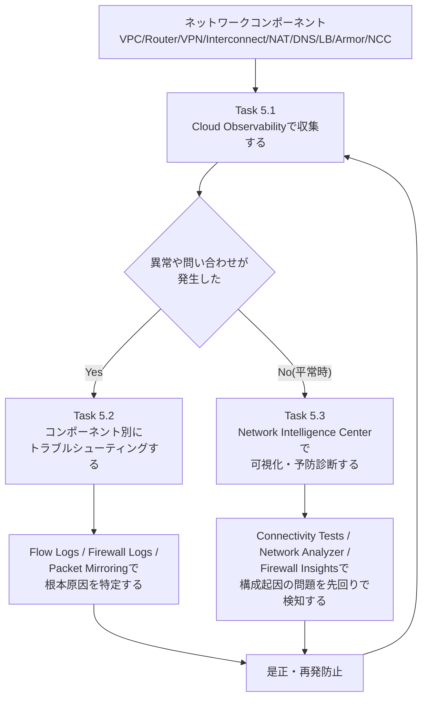

この循環の中で、**Task 5.1(収集)** が土台であり、Flow Logs・Firewall Rules Logging・各種メトリクスが有効化されていなければ、Task 5.2の切り分けもTask 5.3のNetwork Analyzer/Firewall Insightsのログベースインサイトも機能しません。試験でも「まずロギングとモニタリングが有効化されているか」を問う設問が土台になっている点を意識してください。

---

## Part 1: Google Cloud Observabilityによるロギングとモニタリング(Task 5.1)

### 1.1 Google Cloud Observabilityの基本構造

Google Cloud Observability(旧Stackdriver)は、**Cloud Logging**(ログ)と**Cloud Monitoring**(メトリクス)を中核としたスイートです。ネットワークコンポーネントの大半は、追加のエージェント導入なしにログとメトリクスを自動的に送信します。

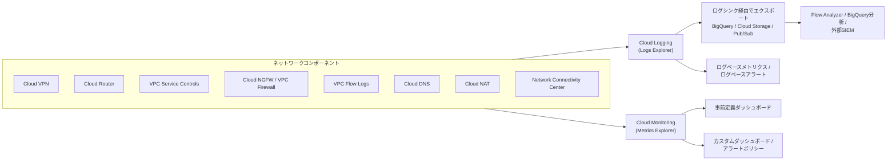

試験ガイドが明示的に列挙しているロギング対象コンポーネントは、**Cloud VPN、Cloud Router、VPC Service Controls、Cloud NGFW、Firewall Insights、VPC Flow Logs、Cloud DNS、Cloud NAT、Network Connectivity Center**の9つです。Cloud DNSは自動的にCloud Loggingへ書き込まれる対象ではなく、プライベートゾーンのクエリロギングはDNSポリシー単位、パブリックゾーンは管理対象ゾーン単位で有効化する必要があります。また、VPC Flow LogsとFirewall Rules Loggingにも明示的な設定が必要です。

> **注意**
> Cloud LoggingとCloud Monitoringは無料枠を超えると、取り込み量(ログ)やサンプル数(メトリクス)に応じた課金が発生します。特にVPC Flow Logsはトラフィック量に比例して急増しやすいため、サンプリングレートやメタデータ注釈の絞り込みが設計上の重要な検討事項になります。

### 1.2 ネットワークコンポーネント別ロギング

#### 1.2.1 VPC Flow Logs

VPC Flow Logsは、VPCネットワーク内を流れるパケットをサンプリングし、5-tuple(送信元/宛先IP、ポート、プロトコル)単位で集約したフローログを生成します。対象となるトラフィックは次のとおりです。

- VMインスタンス(GKEノードを含む)が送受信するパケット
- Direct VPC Egressを構成したCloud Runリソースが送受信するパケット
- Cloud InterconnectのVLANアタッチメントやCloud VPNトンネルを通過するパケット

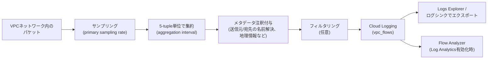

VPC Flow Logsは組織レベル・プロジェクトレベル・サブネット/VLANアタッチメント/VPNトンネル単位で個別に構成でき、組織レベルの構成を持つ場合はShared VPC・VPC Network Peering・Network Connectivity Center経由のフローに「クロスプロジェクト注釈」が付与されます。GKEのPodからインターネット向けの通信は、IP masqueradeによって送信元IPがノードIPに変換されるため、既定ではPodの注釈が付きません(Podの注釈を取得したい場合はCloud NATと組み合わせる必要があります)。

用途としては、ネットワークフォレンジック(侵害されたIPの特定)、キャパシティプランニング、コスト最適化(トップトーカーの特定)が代表的です。

> **出典**
> - https://cloud.google.com/vpc/docs/flow-logs
> - https://cloud.google.com/vpc/docs/using-flow-logs
> - https://cloud.google.com/vpc/docs/about-flow-logs-records
> - https://cloud.google.com/vpc/docs/access-flow-logs

#### 1.2.2 ファイアウォールルールロギング(VPC Firewall Rules / 階層型ポリシー / Cloud NGFW)

VPC Firewall Rules LoggingはCompute Engine VM(GKEノードを含む)への/からのトラフィックを対象とし、ルールが許可または拒否した通信のたびに「接続レコード」というログエントリを生成します。**Allow系ルール**と**Deny系ルール**でログの挙動が大きく異なる点は頻出ポイントです。

| 項目 | Allow + ロギング | Deny + ロギング |
|---|---|---|
| ログの発生単位 | 接続(コネクション)ごとに1回 | 一意な5-tupleごとに、パケットが観測されるたびに再発生 |
| 継続時間中の追加ログ | 生成されない(ステートフルなため応答トラフィックは記録されない) | パケットが観測される限り約5秒ごとに繰り返し記録される |
| 既存アクティブ接続へのロギング有効化 | 新規ログは即時生成されない。アイドル10分後、新しいパケットが来た時点で記録される | 該当なし(そもそも許可されていない接続) |
| 長時間接続の可視性 | 低い(1エントリのみ) | 高い(継続的に記録される) |

> **ベストプラクティス**
> アイドル期間のない長時間ストリームを継続的に可視化したい場合はVPC Firewall Rules LoggingではなくVPC Flow Logsを使用してください。ファイアウォールログは「許可/拒否の判断根拠」を追うのに適し、Flow Logsは「トラフィックの実体」を追うのに適しています。両者は補完関係にあり、片方だけでは不十分なケースが多くあります。

階層型ファイアウォールポリシーおよびグローバル/リージョナルのネットワークファイアウォールポリシー(Cloud NGFW)でも同様にロギングを有効化でき、ログはCloud Loggingの同じ基盤に書き込まれます。Firewall Insightsが生成するインサイトは、このロギングデータを土台にしています(詳細は[3.5節](#35-firewall-insights))。

> **出典**: https://docs.cloud.google.com/firewall/docs/vpc-firewall-rules-logging-overview

#### 1.2.3 Cloud Routerのログ

Cloud RouterはBGPセッションの状態変化を3種類のイベントとしてCloud Loggingに記録します。

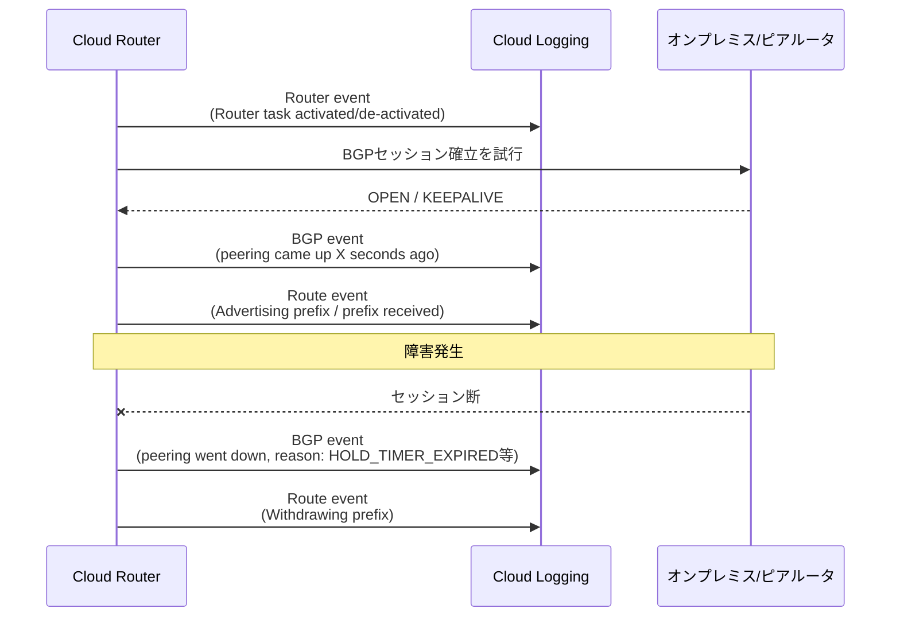

ログには「Router event」(タスクの起動/非活性化)、「BGP event」(ピアリングの確立・切断とその理由)、「Route event」(経路の広告・撤回、学習した経路のネクストホップ)の3系統があり、それぞれ`[Event Type]: [Log Text]`という定型フォーマットで出力されます。障害調査では、まず「BGP event」でセッション断の理由(`HOLD_TIMER_EXPIRED`、`LINK_DOWN`など)を確認し、次に「Route event」で経路の広告状況を突き合わせるのが定石です。

> **出典**
> - https://cloud.google.com/network-connectivity/docs/router/how-to/viewing-logs-metrics
> - https://docs.cloud.google.com/network-connectivity/docs/router/support/troubleshoot-log-messages

#### 1.2.4 Cloud VPNのログ

Cloud VPNのログは自動的に有効化されており、追加設定は不要です。IKEネゴシエーション、鍵の再交換(rekeying)、SA(セキュリティアソシエーション)の削除といったイベントが記録されます。トンネルが確立後すぐに切断を繰り返す場合、`Received SA_DELETE`ログの直後に再接続している形跡があれば、オンプレミス側のゲートウェイがrekeyingではなく既存SAの削除後に新規SAをネゴシエートする実装になっている可能性を疑います。

> **出典**: https://docs.cloud.google.com/network-connectivity/docs/vpn/how-to/viewing-logs-metrics

#### 1.2.5 Cloud NATのログ

Cloud NATのログエントリには、重大度・プロジェクトIDなど一般的なフィールドに加え、NAT固有の情報(変換前後のIPアドレス・ポート、NAT64の場合は宛先IPv4埋め込みIPv6アドレスなど)が含まれます。ログベースメトリクスへのエクスポートも構成可能です。加えて、Cloud NATは`compute.googleapis.com`を対象とした監査ログ(Admin Activity / Data Access)も生成します。

> **出典**
> - https://cloud.google.com/nat/docs/monitoring
> - https://cloud.google.com/nat/docs/audit-logging

#### 1.2.6 Cloud DNSのログ

Cloud DNSロギングは、VPCネットワーク内のVM、GKEコンテナ、ピアリング先のゾーン、オンプレミスからのインバウンドフォワーディングなど、さまざまな経路からのDNSクエリを記録します。パブリックゾーンに対する外部からの直接クエリも対象です。既定では無効で、ゾーン単位・ポリシー単位で有効化します。ログには重複するフィールドがあり、一部はモニタリングメトリクスとも共有されています。目安として1万クエリあたり約5MBのログが生成されます。

> **注意**
> `SERVFAIL`を含むログで`destinationIP`・`egressIP`・`egressError`などのフィールドが欠落している場合は、Cloud DNSのトラブルシューティングドキュメントの該当セクションを参照してください。

> **出典**: https://docs.cloud.google.com/dns/docs/monitoring

#### 1.2.7 VPC Service Controlsの監査ログ

VPC Service Controlsは、セキュリティポリシー違反によって拒否されたすべてのアクセスを既定でCloud Loggingに記録します。監査ログは「Audited Resource」というログストリームに書き込まれ、`protoPayload.metadata.@type`が`type.googleapis.com/google.cloud.audit.VpcServiceControlAuditMetadata`のログとして特定できます。

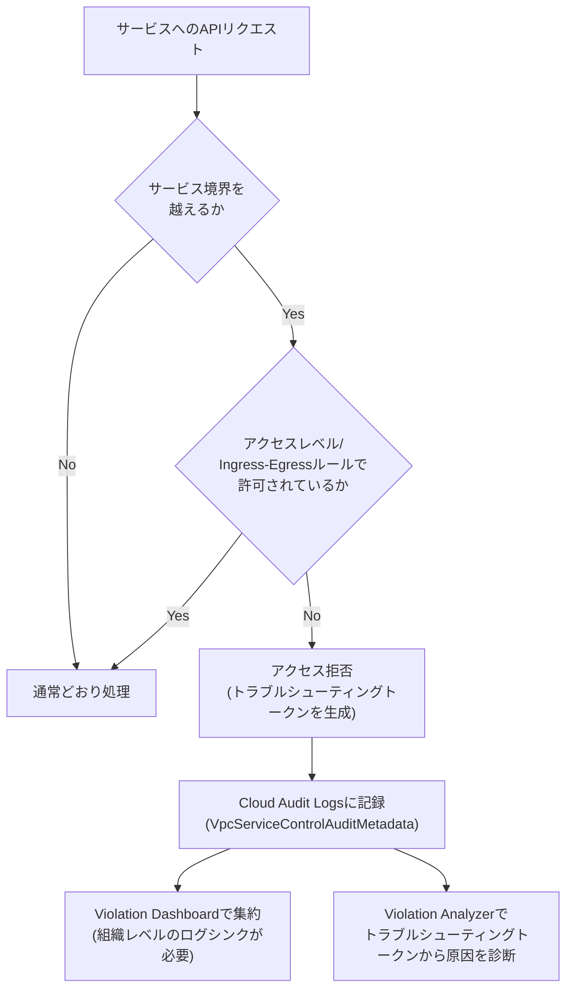

組織全体の違反を俯瞰するには**Violation Dashboard**の設定(組織レベルのログシンクとログバケットの構成)が必要で、設定前に発生した違反はバックフィルされません。個別の拒否イベントは、エラーメッセージ中の一意なID(トラブルシューティングトークン)を使い、**Violation Analyzer**または`gcloud logging read`での直接検索によって原因を特定できます。

> **出典**
> - https://docs.cloud.google.com/vpc-service-controls/docs/audit-logging
> - https://docs.cloud.google.com/vpc-service-controls/docs/violation-dashboard
> - https://docs.cloud.google.com/vpc-service-controls/docs/retrieve-troubleshoot-errors
> - https://cloud.google.com/vpc-service-controls/docs/violation-analyzer

#### 1.2.8 Network Connectivity Centerのログ

NCC(ハブ・スポーク・NCC Gatewayスポーク)およびRouter applianceに関するログも、Cloud Loggingに一般的なフィールド(重大度・プロジェクトID・タイムスタンプ)とログ種別ごとの詳細情報を伴って記録されます。なお、Router applianceの**ログ**自体はCloud Routerのロギング機構に委譲されており、NCC固有のログとCloud Routerのログを併読する必要がある点に注意してください。

> **出典**: https://docs.cloud.google.com/network-connectivity/docs/network-connectivity-center/how-to/viewing-logs-metrics

### 1.3 ネットワークメトリクスのモニタリング

試験ガイドが明示するモニタリング対象は、**Cloud VPN、Cloud InterconnectとVLANアタッチメント、Cloud Router、ロードバランサ、Google Cloud Armor、Cloud NAT**の6分野です。いずれも自動的にCloud Monitoringへメトリクスが送信されるため、エージェントのインストールは不要です。

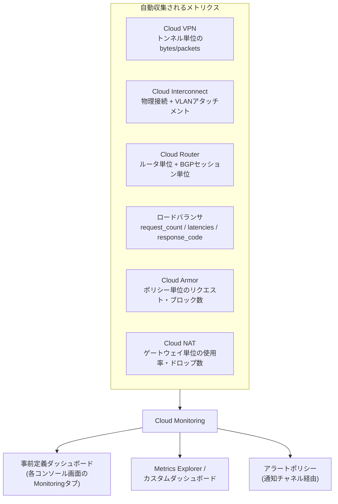

#### 1.3.1 Cloud VPNのメトリクス

各トンネルの詳細ページの「Monitoring」タブで、bytes/packetsなどの主要メトリクスをリージョン・ゲートウェイ・トンネル単位でフィルタして確認できます。パケットがドロップされた場合、ゲートウェイはドロップ理由を提供します。

#### 1.3.2 Cloud InterconnectとVLANアタッチメントのメトリクス

Google側でポートを割り当てた時点(接続がまだ使用可能になる前)からメトリクス収集が始まるため、開通前の物理接続の監視やテストにも活用できます。VLANアタッチメント・ワイヤグループについては作成直後からメトリクス収集が始まり、パケット数・バイト数が1分間隔でMonitoringに送信され、6週間保持されます。

監視の実務では、次の3層を意識すると原因の切り分けがしやすくなります。

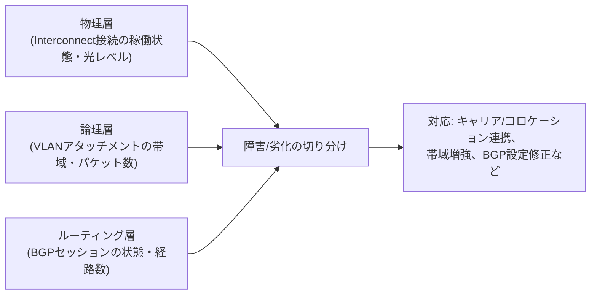

> **注意**
> VLANアタッチメントのメトリクスは60秒間隔でサンプリングされるため、瞬間的なトラフィックバーストが`BANDWIDTH_THROTTLE`によるドロップの原因であっても、Ingress/Egressの使用率グラフ上にはスパイクとして現れないことがあります。帯域超過が疑われる場合は、アタッチメントの利用率を下げる、容量を増やす、追加のVLANアタッチメントを使用するといった対応を検討してください。

> **出典**
> - https://cloud.google.com/network-connectivity/docs/interconnect/how-to/monitoring
> - https://docs.cloud.google.com/network-connectivity/docs/interconnect/support/troubleshooting

#### 1.3.3 Cloud Routerのメトリクス

Cloud Routerのメトリクスは、ルータ単位のもの(`router-name`)とBGPセッション単位のもの(`router-name(bgp-name)`)の2種類に分かれます。受信経路数・学習経路数を示すメトリクスは動的に学習された経路に関するものであり、Custom learned routes機能とは無関係である点に注意してください。

#### 1.3.4 ロードバランサのメトリクス

代表的なメトリクスは`loadbalancing.googleapis.com/https/request_count`、`.../total_latencies`、`.../backend_latencies`、`.../response_code_count`などです。**Total latency**はクライアント〜ロードバランサ〜バックエンドを含む全体のレイテンシ、**Backend latency**はバックエンドの応答時間のみを表すため、両者を切り分けて監視することでアプリケーション側の問題かネットワーク側の問題かを判断できます。SLOを設計する場合、`DistributionCut`を使ったリクエストベースのSLI(例:「1時間のローリングウィンドウで99%のリクエストが100ms以内」)として表現するのが一般的です。

> **出典**
> - https://docs.cloud.google.com/load-balancing/docs/https/https-logging-monitoring
> - https://docs.cloud.google.com/stackdriver/docs/solutions/slo-monitoring/sli-metrics/lb-metrics

#### 1.3.5 Google Cloud Armorのメトリクスと運用監視

Cloud Armorのセキュリティポリシーのメトリクスは、ロードバランサのバックエンドサービスに紐づく形でCloud Monitoringに送信され、ポリシー単位でリクエスト数・ブロック数・レート制限のヒット数などを確認できます。詳細なポリシー種別・WAFルール・DDoS防御・レート制限・bot管理の設計論点は、既刊のS5(Section 6ネットワークセキュリティ)ガイドで扱っているため、本ガイドでは監視・運用の観点に絞って要点のみ再掲します。

#### 1.3.6 Cloud NATのメトリクス

Cloud NATはゲートウェイのフリート全体の使用状況をCloud Monitoringに自動送信します。コンソール上のNATゲートウェイ詳細ページの「Monitoring」タブから事前定義ダッシュボードを確認できるほか、`Cloud NAT gateway`や`VM Instance`をフィルタしてアラートポリシーを作成できます。Shared VPCでVMとNATゲートウェイが異なるプロジェクトにある場合、VMレベルのメトリクスへのアクセスにはVMが属するプロジェクトの`roles/monitoring.viewer`、ゲートウェイリソースのメトリクスへのアクセスにはゲートウェイが属するプロジェクトの`roles/monitoring.viewer`が、それぞれ個別に必要です。

> **ベストプラクティス**
> Cloud NATでは「割り当てポートの枯渇」がサイレント障害になりやすい落とし穴です。動的ポート割り当てを使用している場合でも、`nat_allocation_failed`系のメトリクスやログをアラート対象に含め、ポート使用率が閾値を超えたら通知されるようにしておくことを推奨します。

> **出典**: https://docs.cloud.google.com/nat/docs/monitoring

### 1.4 Task 5.1 設計・運用チェックリスト

- [ ] VPC Flow Logsを、少なくとも本番トラフィックが通過するサブネット・VLANアタッチメント・VPNトンネルで有効化しているか(組織レベル/プロジェクトレベルの設定範囲を意図通りに設計しているか)
- [ ] VPC Firewall Rules Loggingを、Allow/Denyそれぞれの目的(可視性 vs. セキュリティ監査)に応じて必要なルールにのみ有効化しているか(全ルールでの一律有効化はログ量爆発のリスクがある)
- [ ] Cloud Router・Cloud VPN・Cloud Interconnectのログとメトリクスを組み合わせ、BGPセッション断・トンネル断・帯域劣化を横断的に追跡できるダッシュボードを用意しているか
- [ ] Cloud DNSロギングを、少なくとも障害調査が必要になり得るゾーン・ポリシーで有効化しているか
- [ ] VPC Service Controlsを利用している場合、組織レベルのViolation Dashboardを事前に設定し、拒否イベントの発生時に遡って調査できる状態にしているか
- [ ] ロードバランサのTotal latency/Backend latencyを分離して監視し、SLOのアラート閾値を設定しているか
- [ ] Cloud NATのポート割り当て失敗・使用率メトリクスにアラートを設定しているか
- [ ] ログの保持期間・エクスポート先(BigQuery/Cloud Storage/Pub/Sub)をコンプライアンス要件・コスト要件に照らして設計しているか

---

## Part 2: 接続性の維持とトラブルシューティング(Task 5.2)

### 2.1 Application Load Balancerでのトラフィックドレイン・リダイレクト

バックエンドVMやNEGエンドポイントをローリングアップデート・スケールイン・メンテナンスのために安全に取り除くには、**コネクションドレイニング**(connection draining)を使用します。ドレイニングタイムアウトを設定した状態でインスタンスグループからVMを削除、またはゾーンスコープのNEGからエンドポイントを削除すると、ロードバランサは新規接続を即座に停止しつつ、既存のリクエスト/接続には完了までの猶予を与えます。

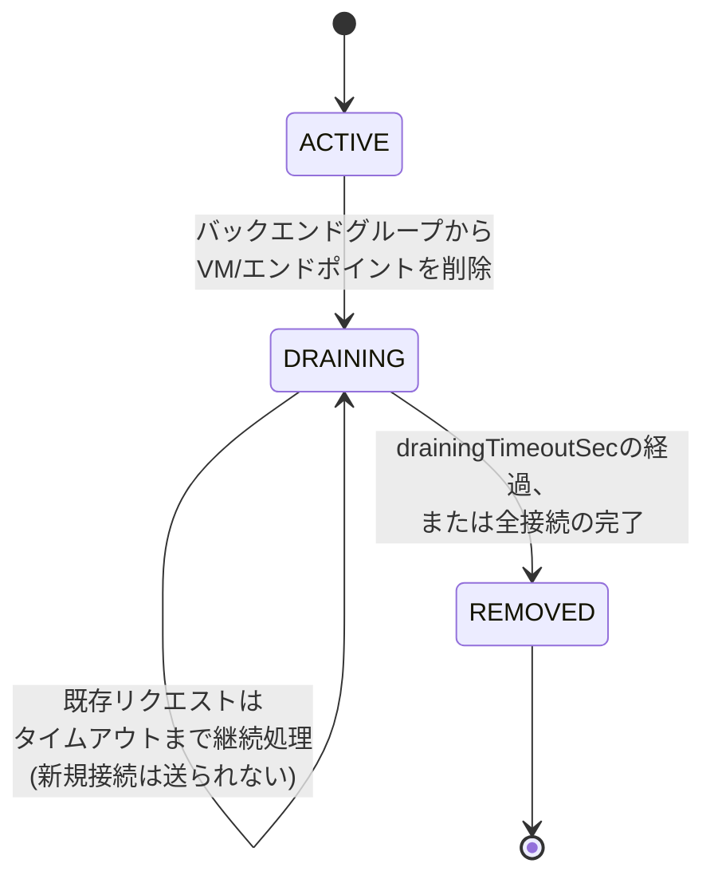

ロードバランサの種類によって挙動に差異があります。

| ロードバランサ種別 | ドレイニング中の挙動 |
|---|---|
| Application Load Balancer(L7) | 指定したタイムアウトの間、既存リクエストの完了を待つ。新規リクエストは送られない |
| Proxy Network Load Balancer | 既存のTCPコネクションはタイムアウト期間中も動作を継続する |
| 内部パススルーNetwork Load Balancer(フェイルオーバー時) | `disableConnectionDrainOnFailover`と`dropTrafficIfUnhealthy`で挙動を制御。既定のドレイニングタイムアウトは固定10分 |

トラフィックの計画的な移動には、バックエンドサービスの**capacity scaler**も併用します。`0`(完全ドレイン、単一バックエンドの場合は設定不可)から`1.0`(100%)まで手動で目標キャパシティを調整でき、メンテナンス前にトラフィックを段階的に他のバックエンドへ寄せる、といった運用が可能です。GKE環境では、Podの`preStop`フックの実行時間を「Backend Service Drain Timeout + ドレインレイテンシ(目安1分)」以上に設定し、`terminationGracePeriodSeconds`を十分に長く取ることで、NEGからのエンドポイント除去とPodの終了を同期させます。

> **ベストプラクティス**
> リージョナル外部パススルーNetwork Load Balancerでは、フォワーディングルールの**トラフィックステアリング**を使い、特定の送信元IPレンジだけを別のバックエンドサービス(異なるヘルスチェックやドレイニング設定を持つ)へ振り向けることができます。これはカナリアリリースやトラブルシューティング目的のトラフィック分離に有効です。

> **出典**
> - https://docs.cloud.google.com/load-balancing/docs/enabling-connection-draining
> - https://docs.cloud.google.com/kubernetes-engine/docs/troubleshooting/load-balancing
> - https://cloud.google.com/load-balancing/docs/backend-service
> - https://docs.cloud.google.com/load-balancing/docs/network/networklb-backend-service
> - https://docs.cloud.google.com/load-balancing/docs/internal/failover-overview

### 2.2 Cloud VPNの管理とトラブルシューティング

Cloud VPNのトラブルシューティングは、コンソールの「VPN」ページでトンネルステータスとBGPセッションステータスの両方を確認するところから始めます。HA VPNではさらに、99.99% SLAを満たすための**高可用性ステータス**(両インターフェースのトンネルが正しくオンプレミス側の冗長構成と対になっているか)も確認が必要です。

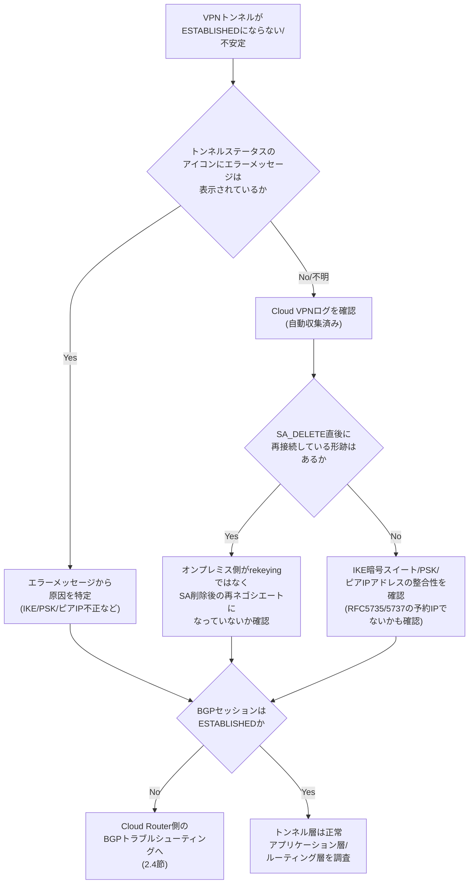

代表的な作成失敗パターンとして、ピアIPアドレスがRFC 5735/5737の予約アドレス範囲に該当しているケースが挙げられます。この場合、構成時のIPレンジを見直す必要があります。また、Cloud VPNは既定でSAの有効期限が切れる前に自動的に再ネゴシエート(rekeying)しますが、オンプレミス側のゲートウェイがこれに対応しておらず、既存SAの削除後にのみ新規SAをネゴシエートする実装だと、接続が周期的に瞬断します。

> **出典**
> - https://docs.cloud.google.com/network-connectivity/docs/vpn/support/troubleshooting
> - https://docs.cloud.google.com/network-connectivity/docs/vpn/how-to/checking-vpn-status
> - https://docs.cloud.google.com/network-connectivity/docs/vpn/how-to/viewing-logs-metrics

### 2.3 Cloud Interconnectの管理とトラブルシューティング

Cloud Interconnectのトラブルシューティングは、[1.3.2節](#132-cloud-interconnectとvlanアタッチメントのメトリクス)で紹介した「物理層・論理層・ルーティング層」の3層モデルに沿って切り分けるのが基本です。

| 症状 | 疑うべき層 | 確認方法 |
|---|---|---|
| 接続自体が確立しない/光レベル異常 | 物理層 | `gcloud compute interconnects get-diagnostics`でTx/Rx光レベルと稼働状態を確認 |
| 特定のVLANアタッチメントだけ帯域が頭打ち | 論理層 | VLANアタッチメントのMonitoringタブでingress/egress利用率、`BANDWIDTH_THROTTLE`ドロップの有無を確認(60秒サンプリングのためバーストは見えにくい点に注意) |
| 経路が広告されない/学習されない | ルーティング層 | Cloud RouterのBGPセッション状態、`advertisedRoutes`フィールドを確認 |
| 暗号化VLANアタッチメントの削除に失敗する | 論理層(MACsec) | MACsec構成済みのDedicated/Partner Interconnectでは、削除前にMACsec設定の解除が必要な場合がある |

HA VPN over Cloud Interconnectのような複合構成では、「Cloud Interconnect層(VLANアタッチメント間のBGP)」と「HA VPN層(オンプレミスとVPCの間のBGP)」という2階層のBGPが存在するため、どちらの層で問題が起きているかを切り分けることが重要です。具体的には、まずCloud Interconnect層のCloud Routerで`gcloud compute routers get-status`を実行し、`advertisedRoutes`にHA VPNゲートウェイのアドレスが含まれているかを確認し、次にHA VPN層のBGPセッションを確認するという順序になります。

> **出典**: https://docs.cloud.google.com/network-connectivity/docs/interconnect/support/troubleshooting

### 2.4 Cloud RouterのBGPピアリングのトラブルシューティング

BGPセッションは、確立までに複数の状態を遷移します。試験では状態遷移の理解に加え、「どのログ/メトリクスでどの状態を確認するか」が問われます。

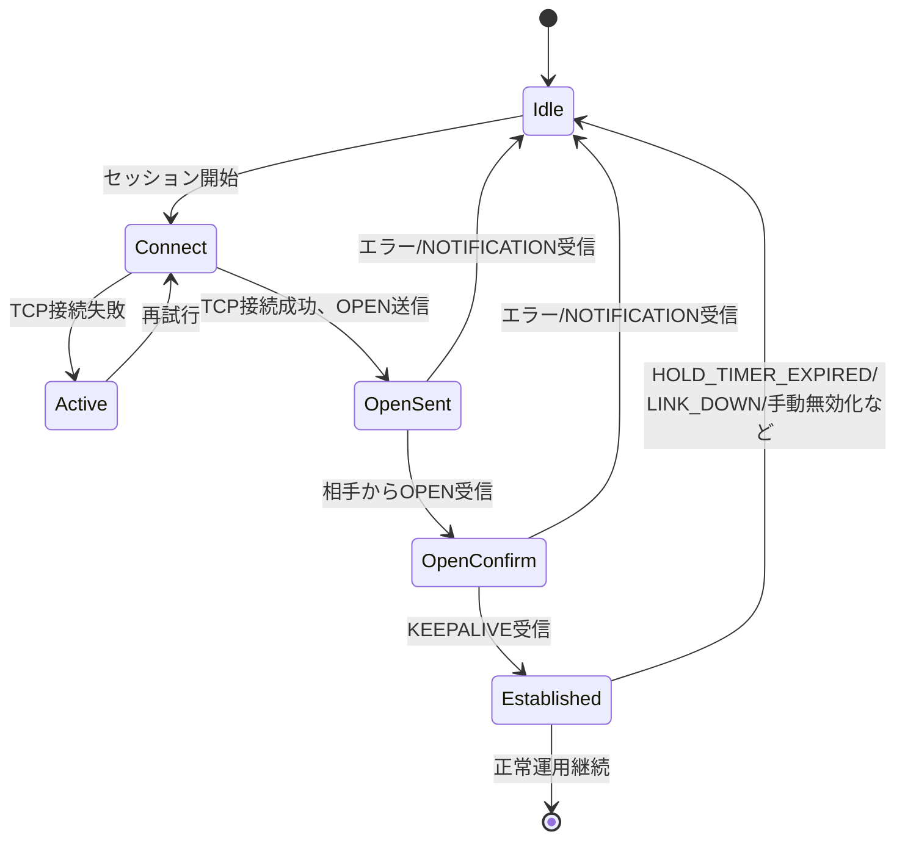

代表的な障害パターンと対処の要点は次のとおりです。

| 障害パターン | 原因 | 対処 |
|---|---|---|
| ローカルASNとピアASNの重複 | 同一リージョン・同一ネットワーク内で同じASNを持つオンプレミスデバイスとセッションを試みている | Cloud RouterまたはオンプレミスルータのASN設計を見直す |
| MD5認証エラー(`MD5_AUTH_INTERNAL_PROBLEM`) | Cloud Router内部でMD5認証設定に失敗(内部エラー) | 通常は自動復旧を待つ(1時間以上続く場合はサポートに連絡) |
| MD5認証エラー(鍵不一致) | Cloud Routerとピアの事前共有鍵(認証キー)が一致していない | 認証キーを更新して再同期 |
| 最大経路数超過によるセッション遮断 | オンプレミスルータが5,000プレフィックスを超えて広告 | `CEASE/MAX_PREFIXES_REACHED`ログを確認し、広告プレフィックス数を削減するか、手動でBGPピアリングをリセット |
| BGPフラップ(定期的な切断) | Cloud Routerのソフトウェアメンテナンスイベント | オンプレミスルータでGraceful Restartに対応し、ホールドタイマーを60秒以上に設定していれば通常は問題ない |
| BFDの検知タイムアウト | 制御パケットが検知タイマー(既定5,000ms)以内に届かない | BFDのMinRx/MinTx間隔・マルチプライヤの双方一致を確認 |

BFDを併用している場合は、BGPとは独立した状態機械としてBFDの状態を確認します。

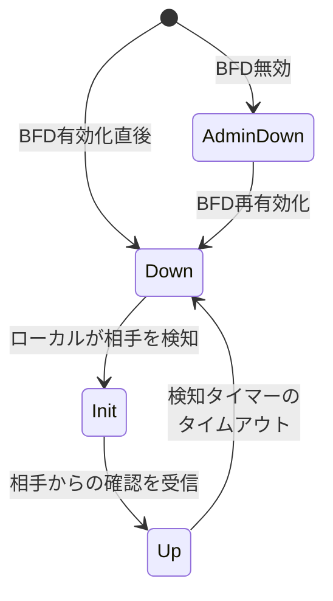

BFDの診断コード(`NO_DIAGNOSTIC`、`CONTROL_DETECTION_TIME_EXPIRED`、`NEIGHBOR_SIGNALED_SESSION_DOWN`、`ADMINISTRATIVELY_DOWN`など)は、`gcloud compute routers get-status`の`bfdStatus`フィールドで確認できます。BFDとBGP Graceful Restartを併用している場合、Cloud Routerの再起動時にはBFDへ`AdminDown`を送信して意図的に停止し、その間BGPセッション自体はオンプレミス側でGraceful Restartモードとして維持される、という設計になっている点も理解しておく必要があります。

> **注意**
> ICMPv6 pingはCloud RouterのBGPアドレスに対してサポートされていません。レイヤー3疎通確認にはICMPv4 pingを使用してください。

> **出典**
> - https://cloud.google.com/network-connectivity/docs/router/support/troubleshoot-bgp-sessions
> - https://docs.cloud.google.com/network-connectivity/docs/router/support/troubleshoot-bgp-peering
> - https://docs.cloud.google.com/network-connectivity/docs/router/concepts/bgp-states
> - https://docs.cloud.google.com/network-connectivity/docs/router/support/troubleshoot-log-messages
> - https://docs.cloud.google.com/network-connectivity/docs/router/concepts/bfd
> - https://docs.cloud.google.com/network-connectivity/docs/router/concepts/bfd-states
> - https://docs.cloud.google.com/network-connectivity/docs/router/support/troubleshoot-bgp-routes

### 2.5 VPC Flow Logs・ファイアウォールログ・Packet Mirroringを使ったトラブルシューティング

3つのツールはそれぞれ異なる「見え方」を提供するため、組み合わせて使うことで根本原因への到達が早まります。

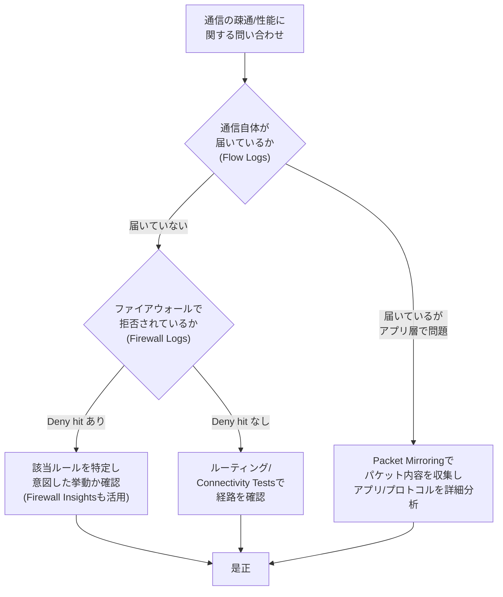

VPC Flow Logsは「通信があったかどうか、どれだけの量か」を5-tuple単位で示しますが、パケットのペイロード自体は含みません。ペイロードレベルでの分析(アプリケーションプロトコルの異常、侵入検知システムとの連携など)が必要な場合は**Packet Mirroring**を使用します。

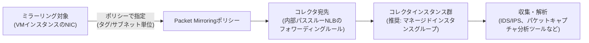

Packet Mirroringの主な制約・特性は次のとおりです。

- ミラー対象とコレクタ宛先は同一プロジェクト・同一リージョンである必要がある(コレクタは同一VPCまたはVPC Network Peeringで接続されたVPCに配置可能)
- 1つのミラーリングポリシーが参照できるコレクタ宛先は1つだが、1つのコレクタ宛先を複数のポリシーから参照することは可能
- ミラーリングとコレクションを同一VMの同一NICで行うと、ミラーリングループが発生するため不可
- GKEの同一ノード上のPod間通信をミラーリングするには、クラスタでIntranode visibilityを有効化する必要がある
- VPC Flow Logsはミラーされたパケット自体をログしない。ただしコレクタインスタンスが属するサブネットでFlow Logsが有効な場合、コレクタ宛の直接トラフィック(元の宛先IPがコレクタのIPと一致する場合)は通常どおり記録される
- ミラーリングは元パケットとミラーパケットの両方を処理するため、処理レート(スループット)が低下する。低下幅はマシンタイプ・CPU使用率・パケットサイズに依存する

Packet Mirroringのモニタリングでは、ミラー対象VM側で「ミラーされたネットワークバイト数/パケット数」(成功・ドロップ両方)を確認できますが、コレクタ側のドロップパケット数は個別には提供されません(コレクタ側の監視は内部パススルーNLBのロギング・モニタリングに準じます)。

> **出典**
> - https://cloud.google.com/vpc/docs/packet-mirroring
> - https://cloud.google.com/vpc/docs/using-packet-mirroring
> - https://cloud.google.com/vpc/docs/monitoring-packet-mirroring

### 2.6 Task 5.2 トラブルシューティングチェックリスト

- [ ] ロードバランサのバックエンド入れ替え手順に、コネクションドレイニングのタイムアウトとGKEの`preStop`/`terminationGracePeriodSeconds`の整合を組み込んでいるか
- [ ] Cloud VPNトラブル時に、まずトンネルステータス→BGPセッションステータス→高可用性ステータスの順で確認する手順が周知されているか
- [ ] Cloud Interconnect障害時に、物理層・論理層・ルーティング層のどこで問題が起きているかを`get-diagnostics`やVLANアタッチメントのメトリクスで切り分けられるか
- [ ] HA VPN over Cloud Interconnectのような複合構成で、どちらの層のBGPセッションが問題かを区別する手順があるか
- [ ] BGPフラップの許容範囲(ホールドタイマー、Graceful Restart対応)をオンプレミス側と合意しているか
- [ ] BFDのMinRx/MinTx/マルチプライヤの設定値がCloud Router側とオンプレミス側で一致しているか
- [ ] 「疎通しない」問い合わせに対し、Flow Logs→Firewall Logs→Connectivity Tests→Packet Mirroringの順で切り分ける標準手順があるか
- [ ] Packet Mirroringのコレクタにマネージドインスタンスグループ(オートスケーリング/オートヒーリング)を使用しているか

---

## Part 3: Network Intelligence Centerによる監視とトラブルシューティング(Task 5.3)

### 3.1 Network Intelligence Centerの全体像

Network Intelligence Center(NIC)は、Google Cloudネットワークの可視化・監視・トラブルシューティングを1つのコンソールに統合したプラットフォームです。2019年の提供開始時点ではConnectivity TestsとNetwork Topologyがベータ、Performance DashboardとFirewall Metrics & Insightsがアルファでしたが、現在は6つのモジュールが揃っています。

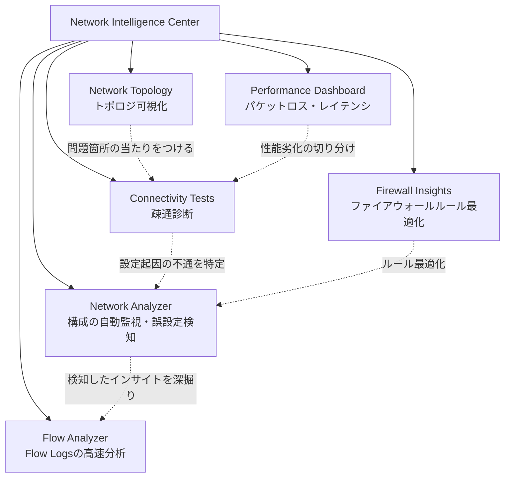

各モジュールの役割を一言でまとめると次のようになります。

| モジュール | 主な問い | 分析の性質 |
|---|---|---|
| Network Topology | 「今、どこにどれだけのトラフィックが流れているか」 | リアルタイムのテレメトリ + 構成情報の可視化 |
| Connectivity Tests | 「AからBへ到達できるか、できないなら何が阻んでいるか」 | 構成分析(+一部でデータプレーン検証) |
| Performance Dashboard | 「ゾーン/リージョン間のパケットロス・レイテンシはどの程度か」 | 実トラフィックに基づく能動的プロービング |
| Firewall Insights | 「このファイアウォールルールは安全に削除・厳格化できるか」 | ロギングデータ + 機械学習予測 |
| Network Analyzer | 「構成に誤りや非効率はないか」 | 構成の自動巡回監視(プッシュ型) |
| Flow Analyzer | 「Flow Logsから見える実際の通信パターンは何か」 | SQLレスなFlow Logs分析(BigQuery基盤) |

> **出典**
> - https://cloud.google.com/blog/products/networking/announcing-network-intelligence-center
> - https://docs.cloud.google.com/network-intelligence-center/docs/overview
> - https://docs.cloud.google.com/network-intelligence-center/docs

### 3.2 Network Topology

Network Topologyは、構成情報とリアルタイムの運用データを1つのグラフに統合して可視化するツールです。**Infrastructure view**ではVPCネットワーク、オンプレミスとのハイブリッド接続、Google管理サービスへの接続とそれらのメトリクスを表示し、**GKE Enterprise view**ではクラスタ・ネームスペース・ワークロード・Podとそのメトリクスを表示します。

活用の典型例は、特定のCloud VPNトンネルやVLANアタッチメントを流れるトラフィック量をエンティティ単位で確認し、Shared VPCの他プロジェクトやリージョン間トラフィックへの影響を把握することです。エンティティをクリックすると、そのエンティティを通過するすべてのトラフィックパスがハイライトされます。

> **出典**: https://cloud.google.com/network-intelligence-center/docs/network-topology/reference/metrics-reference

### 3.3 Connectivity Tests

Connectivity Testsは、送信元と宛先(VM、GKEクラスタ、ロードバランサのフォワーディングルール、インターネット上のIPアドレスなど)を指定し、その間のパケットが実際にどう転送されるかを**シミュレーション**するツールです。分析は2種類に分かれます。

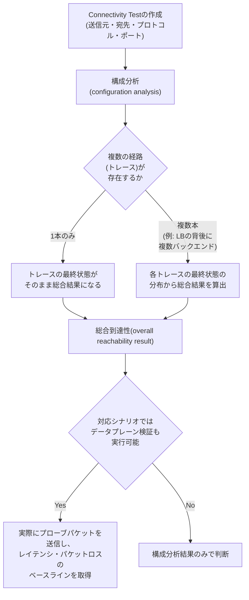

総合到達性の結果は4値のいずれかです。

| 結果 | 意味 |
|---|---|
| Reachable | 現在の構成でトラフィックが送信元から宛先へ到達できる |
| Unreachable | 経路上のどこかでトラフィックが遮断されている(トレースにドロップ箇所が示される) |
| Ambiguous | 複数トレースの最終状態が混在している(例: 一部バックエンドは到達可能、一部は不可) |
| Undetermined | エラー、非対応の入力、権限不足などにより判定不能 |

> **注意**
> Ambiguousの典型的な原因の1つは、閲覧権限のない階層型ファイアウォールポリシーをトレースが参照している場合です。ポリシー自体の閲覧権限がなくても、自分のVPCネットワークに適用される実効ルールは「Effective firewall rules」で確認できます。また、構成分析でReachableと判定されても、実際にはデータプレーンで100%パケットロスが発生している場合があります。これは構成分析とデータプレーン分析が別物であるためで、対応シナリオではデータプレーン検証も併用して裏取りすることが推奨されます。

Google管理サービス(Cloud SQL、GKEなど)を宛先とするテストも作成できますが、Google所有プロジェクト内のリソースについては閲覧権限がないため、トレースの詳細(具体的にどのルール・ルートが適用されたか)は表示されず、総合到達性の結果のみが返されます。

> **出典**
> - https://cloud.google.com/network-intelligence-center/docs/connectivity-tests/concepts/state-tables
> - https://cloud.google.com/network-intelligence-center/docs/connectivity-tests/concepts/reachability
> - https://docs.cloud.google.com/network-intelligence-center/docs/connectivity-tests/support/troubleshooting
> - https://docs.cloud.google.com/network-intelligence-center/docs/connectivity-tests/concepts/test-google-managed-services
> - https://docs.cloud.google.com/network-intelligence-center/docs/connectivity-tests/concepts/overview

### 3.4 Performance Dashboard

Performance Dashboardは、Google Cloudネットワーク全体、および自分のプロジェクトのリソースに関するパケットロスとレイテンシ(RTT)を可視化します。セットアップは不要で、十分な数のVMがあればパケットロスメトリクスが、十分なトラフィック量があればレイテンシメトリクスが自動的に得られます。

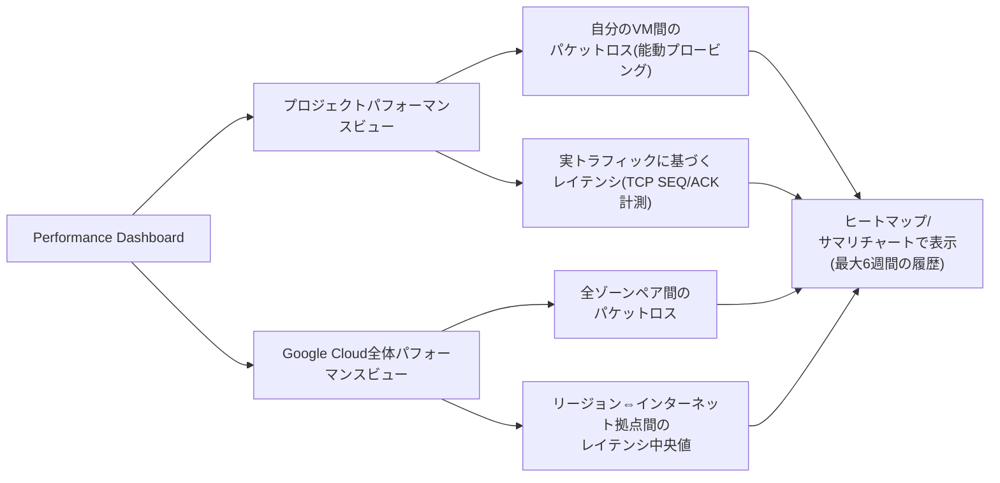

代表的な活用パターンは、アプリケーションで性能問題が疑われたときに「まずPerformance Dashboardでネットワーク側に異常がないかを確認し、異常がなければアプリケーション側を疑う」という切り分けです。自分のプロジェクトの値と、Google Cloud全体の同一ゾーン/リージョンペアの平均値を並べて比較することで、自分の環境固有の問題か、Google Cloud全体で起きている事象かを判断できます。パケットロスメトリクスは常に利用可能ですが、1分あたり400プローブ未満の場合はアスタリスク(*)が付き、データの信頼性が低いことを示します。

> **出典**
> - https://docs.cloud.google.com/network-intelligence-center/docs/performance-dashboard/concepts/overview
> - https://docs.cloud.google.com/network-intelligence-center/docs/performance-dashboard/concepts/metrics-views
> - https://docs.cloud.google.com/network-intelligence-center/docs/performance-dashboard/concepts/use-cases-project
> - https://docs.cloud.google.com/network-intelligence-center/docs/performance-dashboard/concepts/use-cases-google-cloud
> - https://docs.cloud.google.com/network-intelligence-center/docs/performance-dashboard/how-to/viewing-perf-dash-metrics

### 3.5 Firewall Insights

Firewall Insightsは、ファイアウォールルール(VPC firewall rules、ファイアウォールポリシーに属するルールの両方)の構成と使用実態を分析し、最適化のためのインサイトを提供します。インサイトは大きく3種類です。

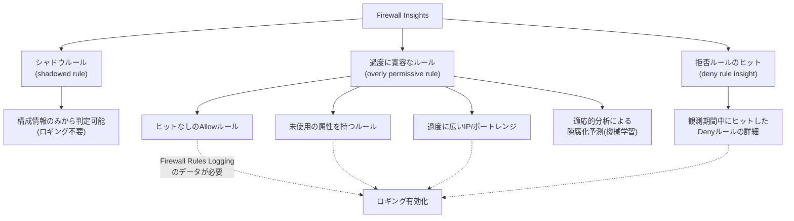

**シャドウルール**は、自分より優先度が高い(または同等の)ルールと属性(IPレンジなど)が重複しており、実質的に一度もマッチし得ないルールです。構成情報だけから機械的に判定できるため、Firewall Rules Loggingを有効化していなくても検知されます。一方、**過度に寛容なルール**と**拒否ルールインサイト**はログベースであり、Firewall Rules Loggingを有効化した状態でのトラフィック実績が必要です。シャドウルール・過度に寛容なルールのインサイトは、Firewall Insightsのページで機能を有効化してから最大48時間で生成され始め、機械学習による陳腐化予測は新規/更新されたルールに対して最大10日ほどかかります。

> **注意**
> ロードバランサのヘルスチェック用IPレンジ(`35.191.0.0/16`など)を許可するルールは、ヒット数が少なくても「過度に寛容」や「未使用」と誤判定されて削除対象に挙げられることがあります。これらはGoogle Cloudの機能上必要なルールであるため、インサイトを鵜呑みにせず、削除前に用途を確認してください。

Firewall Insightsが検出したインサイトは、Recommenderが提供する**Active Assist**ダッシュボードからも確認できます(カード名がFirewall Insights側とは異なる点に注意)。

> **出典**
> - https://docs.cloud.google.com/network-intelligence-center/docs/firewall-insights/concepts/overview
> - https://docs.cloud.google.com/network-intelligence-center/docs/firewall-insights/how-to/view-understand-insights
> - https://cloud.google.com/network-intelligence-center/docs/firewall-insights/concepts/insights-categories-states
> - https://docs.cloud.google.com/network-intelligence-center/docs/firewall-insights/how-to/enable-api-features
> - https://docs.cloud.google.com/network-intelligence-center/docs/firewall-insights/how-to/view-insights-recommendation-hub

### 3.6 Network Analyzer

Network Analyzerは、VPCネットワークの構成を自動的に巡回監視し、誤設定や非効率な構成を検出するプッシュ型のツールです。設定変更後は約10分でその変更に関連する分析が実行され、それとは別に少なくとも1日1回の定期分析も行われます。インサイトは5つのグループに分類されます。

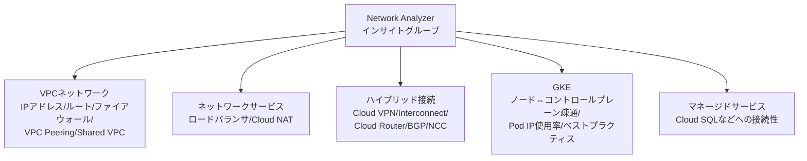

たとえばVPCネットワークグループでは「無効なネクストホップを持つルート」、ネットワークサービスグループでは「ヘルスチェックをブロックしているファイアウォールルール」「トラフィックとヘルスチェックで異なるポートを使っているバックエンドサービス」、GKEグループでは「ノードからコントロールプレーンへの双方向疎通の設定起因の問題」「PodのIPアドレス使用率」といった具体的なインサイトが提供されます。

Shared VPCでは、ホストプロジェクト側でIPアドレス使用率などVPCネットワーク全体に関わるインサイトが提供され(サービスプロジェクトの情報も自動集約)、サービスプロジェクト側ではロードバランサやGKEなどそのプロジェクト固有のサービスに関するインサイトが提供されます。複数プロジェクトを横断して監視したい場合は、Cloud Monitoringの**メトリクススコープ**を構成し、対象プロジェクトを監視対象として追加します。

Network Analyzerが公開したインサイトはCloud Loggingにも格納され、ログ名は`projects/{project-id}/logs/networkanalyzer.googleapis.com/analyzer_reports`の形式です。Network Analyzer自体はCloud Monitoringへメトリクスを送信しないため、リアルタイムアラートが必要な場合はこのログに対してログベースアラートを設定します。

> **出典**
> - https://cloud.google.com/network-intelligence-center/docs/network-analyzer/insight-groups-types
> - https://docs.cloud.google.com/network-intelligence-center/docs/network-analyzer/overview
> - https://www.doit.com/blog/proactively-detect-network-misconfigurations-in-google-cloud-with-network-analyzer
> - https://cloud.google.com/network-intelligence-center/docs/network-analyzer/insights/kubernetes-engine/gke-node-to-control-plane

### 3.7 Flow Analyzer

Flow Analyzerは、VPC Flow Logsに対して複雑なSQLクエリを書かずにトラフィックパターンを分析できるツールです。Observability Analytics(旧Log Analytics)が有効化されたログバケットに格納されたFlow Logsのレコードを対象とし、BigQueryを基盤に5-tuple粒度でのオピニオンベース分析(意見の分かれない、定型化された分析軸)を提供します。

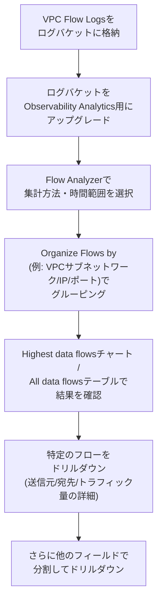

活用例として、「誰が接続を開始したか」を知りたい場合は送信元ペインで「VPCサブネットワーク」「IP」「ポート」を選択してグルーピングします。Cross-Cloud Network環境では、VLANアタッチメントやVPNトンネルに対してもVPC Flow Logsを有効化でき、`reporter`(トラフィックの方向)や`gateway`オブジェクト(ゲートウェイの名前・タイプ・プロジェクトID・ロケーション)といった新しい注釈がFlow Analyzerに統合されており、オンプレミス⇔クラウド間の「エレファントフロー」(高帯域フロー)の特定やShared VPC環境でのサービスプロジェクト別のハイブリッド帯域使用量の監査に活用できます。

> **出典**
> - https://cloud.google.com/network-intelligence-center/docs/flow-analyzer/overview
> - https://docs.cloud.google.com/network-intelligence-center/docs/flow-analyzer/monitor-traffic-flows
> - https://cloud.google.com/network-intelligence-center/docs/flow-analyzer/enable-log-analytics
> - https://cloud.google.com/blog/products/networking/vpc-flow-logs-for-cross-cloud-network
> - https://cloud.google.com/blog/products/networking/using-vpc-flow-logs-to-de-risk-network-migration

### 3.8 Task 5.3 活用チェックリスト

- [ ] 障害調査の初手として、Network Topologyでトラフィックの全体像を把握する運用が定着しているか
- [ ] 「AからBへ到達できるか」という問い合わせに対し、Connectivity Testsを標準ツールとして使っているか(構成分析とデータプレーン検証の違いを理解した上で)
- [ ] アプリケーション性能問題の切り分けにPerformance Dashboardを使い、ネットワーク起因かアプリケーション起因かを最初に判断しているか
- [ ] Firewall Insightsのシャドウルール・過度に寛容なルールを定期的にレビューし、ヘルスチェック用ルールなど誤判定されやすいものを除外するプロセスがあるか
- [ ] Network Analyzerの5つのインサイトグループ(VPCネットワーク/ネットワークサービス/ハイブリッド接続/GKE/マネージドサービス)を横断して定期確認しているか、複数プロジェクトの場合はメトリクススコープを構成しているか
- [ ] Flow AnalyzerでVPC Flow Logsを分析するために、対象ログバケットのObservability Analyticsを有効化しているか
- [ ] Cross-Cloud Network構成の場合、VLANアタッチメント・VPNトンネルでもVPC Flow Logsを有効化し、Flow Analyzerでハイブリッド帯域を可視化しているか

---

## 総合トラブルシューティングワークフロー

最後に、Task 5.1〜5.3で紹介したツールを、実際のインシデント対応の流れに沿って統合したワークフローを示します。試験では個々のツールの仕様だけでなく、「この状況ではどのツールをどの順序で使うべきか」という統合的な判断力も問われます。

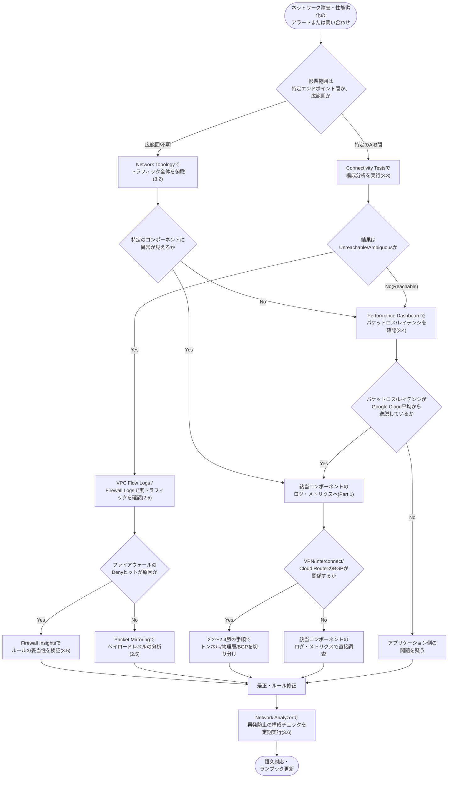

> **ベストプラクティス**
> このワークフローが機能する前提は、Part 1で解説したロギング・モニタリングが**平時から有効化されていること**です。障害発生後にVPC Flow LogsやFirewall Rules Loggingを有効化しても、発生時点までのデータは遡って取得できません。試験対策としても実務としても、「まず何を有効化しておくべきか」という設計判断(Task 5.1)が、トラブルシューティング(Task 5.2)とNetwork Intelligence Centerの活用(Task 5.3)の土台になっている、という関係を押さえておいてください。

---

## 参考文献

### 公式認定・試験ガイド

- https://cloud.google.com/learn/certification/cloud-network-engineer
- https://services.google.com/fh/files/misc/professional_cloud_network_engineer_exam_guide_english.pdf

### Cloud Logging / Cloud Monitoring基盤・コンポーネント別ロギング

- https://docs.cloud.google.com/firewall/docs/vpc-firewall-rules-logging-overview
- https://cloud.google.com/vpc/docs/flow-logs
- https://cloud.google.com/vpc/docs/using-flow-logs
- https://cloud.google.com/vpc/docs/about-flow-logs-records
- https://cloud.google.com/vpc/docs/access-flow-logs
- https://cloud.google.com/nat/docs/monitoring
- https://cloud.google.com/nat/docs/audit-logging
- https://docs.cloud.google.com/dns/docs/monitoring
- https://docs.cloud.google.com/vpc-service-controls/docs/audit-logging
- https://docs.cloud.google.com/vpc-service-controls/docs/violation-dashboard
- https://docs.cloud.google.com/vpc-service-controls/docs/retrieve-troubleshoot-errors
- https://cloud.google.com/vpc-service-controls/docs/violation-analyzer
- https://docs.cloud.google.com/network-connectivity/docs/network-connectivity-center/how-to/viewing-logs-metrics

### ハイブリッド接続(Cloud VPN / Cloud Interconnect / Cloud Router)のモニタリングとトラブルシューティング

- https://docs.cloud.google.com/network-connectivity/docs/vpn/support/troubleshooting
- https://docs.cloud.google.com/network-connectivity/docs/vpn/how-to/checking-vpn-status
- https://docs.cloud.google.com/network-connectivity/docs/vpn/how-to/viewing-logs-metrics
- https://cloud.google.com/network-connectivity/docs/interconnect/how-to/monitoring
- https://docs.cloud.google.com/network-connectivity/docs/interconnect/support/troubleshooting
- https://cloud.google.com/network-connectivity/docs/router/how-to/viewing-logs-metrics
- https://cloud.google.com/network-connectivity/docs/router/support/troubleshoot-bgp-sessions
- https://docs.cloud.google.com/network-connectivity/docs/router/support/troubleshoot-bgp-peering
- https://docs.cloud.google.com/network-connectivity/docs/router/support/troubleshoot-bgp-routes
- https://docs.cloud.google.com/network-connectivity/docs/router/support/troubleshoot-log-messages
- https://docs.cloud.google.com/network-connectivity/docs/router/concepts/bgp-states
- https://docs.cloud.google.com/network-connectivity/docs/router/concepts/bfd
- https://docs.cloud.google.com/network-connectivity/docs/router/concepts/bfd-states

### ロードバランシング・トラフィック管理

- https://docs.cloud.google.com/load-balancing/docs/enabling-connection-draining
- https://docs.cloud.google.com/kubernetes-engine/docs/troubleshooting/load-balancing
- https://cloud.google.com/load-balancing/docs/backend-service
- https://docs.cloud.google.com/load-balancing/docs/network/networklb-backend-service
- https://docs.cloud.google.com/load-balancing/docs/internal/failover-overview
- https://docs.cloud.google.com/load-balancing/docs/https/https-logging-monitoring
- https://docs.cloud.google.com/stackdriver/docs/solutions/slo-monitoring/sli-metrics/lb-metrics

### VPC Flow Logs・Packet Mirroringによるトラブルシューティング

- https://cloud.google.com/vpc/docs/packet-mirroring
- https://cloud.google.com/vpc/docs/using-packet-mirroring
- https://cloud.google.com/vpc/docs/monitoring-packet-mirroring

### Network Intelligence Center

- https://cloud.google.com/blog/products/networking/announcing-network-intelligence-center
- https://docs.cloud.google.com/network-intelligence-center/docs/overview
- https://docs.cloud.google.com/network-intelligence-center/docs
- https://cloud.google.com/network-intelligence-center/docs/network-topology/reference/metrics-reference
- https://cloud.google.com/network-intelligence-center/docs/connectivity-tests/concepts/state-tables
- https://cloud.google.com/network-intelligence-center/docs/connectivity-tests/concepts/reachability
- https://docs.cloud.google.com/network-intelligence-center/docs/connectivity-tests/support/troubleshooting
- https://docs.cloud.google.com/network-intelligence-center/docs/connectivity-tests/concepts/test-google-managed-services
- https://docs.cloud.google.com/network-intelligence-center/docs/connectivity-tests/concepts/overview
- https://docs.cloud.google.com/network-intelligence-center/docs/performance-dashboard/concepts/overview
- https://docs.cloud.google.com/network-intelligence-center/docs/performance-dashboard/concepts/metrics-views
- https://docs.cloud.google.com/network-intelligence-center/docs/performance-dashboard/concepts/use-cases-project
- https://docs.cloud.google.com/network-intelligence-center/docs/performance-dashboard/concepts/use-cases-google-cloud
- https://docs.cloud.google.com/network-intelligence-center/docs/performance-dashboard/how-to/viewing-perf-dash-metrics
- https://docs.cloud.google.com/network-intelligence-center/docs/firewall-insights/concepts/overview
- https://docs.cloud.google.com/network-intelligence-center/docs/firewall-insights/how-to/view-understand-insights
- https://cloud.google.com/network-intelligence-center/docs/firewall-insights/concepts/insights-categories-states
- https://docs.cloud.google.com/network-intelligence-center/docs/firewall-insights/how-to/enable-api-features
- https://docs.cloud.google.com/network-intelligence-center/docs/firewall-insights/how-to/view-insights-recommendation-hub
- https://cloud.google.com/network-intelligence-center/docs/network-analyzer/insight-groups-types
- https://docs.cloud.google.com/network-intelligence-center/docs/network-analyzer/overview
- https://cloud.google.com/network-intelligence-center/docs/network-analyzer/insights/kubernetes-engine/gke-node-to-control-plane
- https://www.doit.com/blog/proactively-detect-network-misconfigurations-in-google-cloud-with-network-analyzer
- https://cloud.google.com/network-intelligence-center/docs/flow-analyzer/overview
- https://docs.cloud.google.com/network-intelligence-center/docs/flow-analyzer/monitor-traffic-flows
- https://cloud.google.com/network-intelligence-center/docs/flow-analyzer/enable-log-analytics
- https://cloud.google.com/blog/products/networking/vpc-flow-logs-for-cross-cloud-network
- https://cloud.google.com/blog/products/networking/using-vpc-flow-logs-to-de-risk-network-migration
