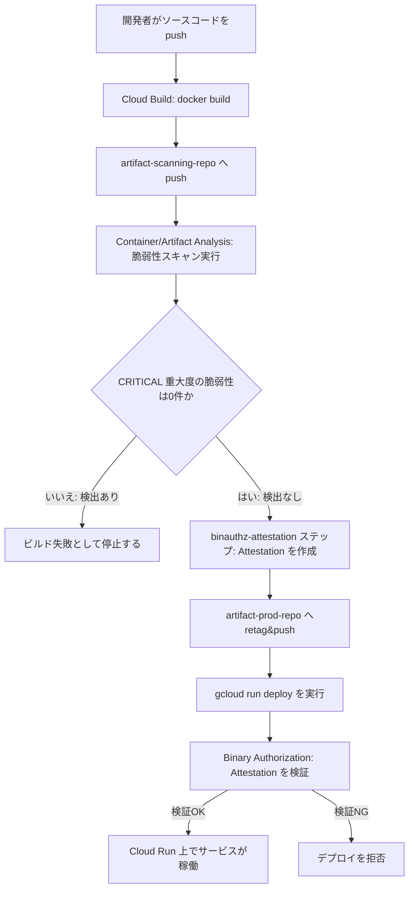
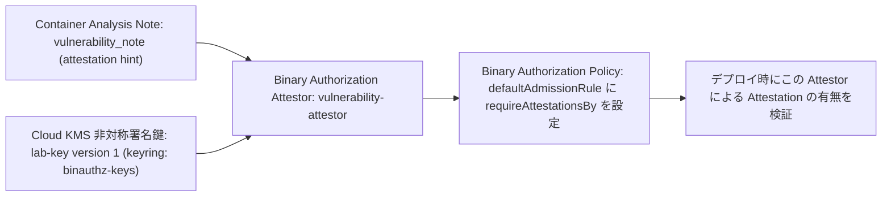
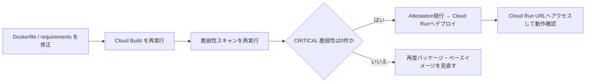
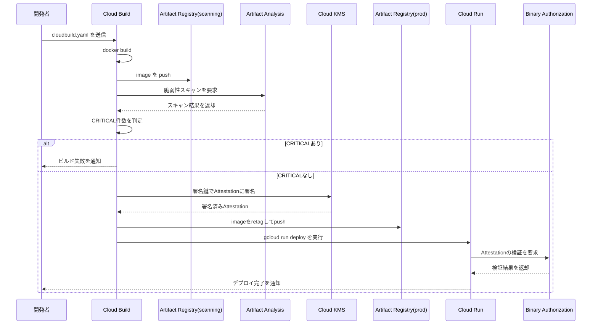

# セキュアなコンテナ CI/CD パイプライン構築ガイド

## Artifact Registry × Binary Authorization × Cloud Build によるソフトウェアサプライチェーンセキュリティ実践

> 本ガイドは、Google Cloud Skills Boost の Challenge Lab「Secure Software Delivery」（[https://www.skills.google/course_templates/1164/labs/610922](https://www.skills.google/course_templates/1164/labs/610922)）で扱われる、Cymbal Bank のコンテナアプリケーションをセキュアにデプロイするシナリオを題材に、初学者でも一つずつ理解しながら進められるよう、各タスクの背景にあるベストプラクティスとその根拠を解説したものです。

---

## 1. このガイドについて

### 1.1 対象読者

- Google Cloud のコンテナデプロイに初めて触れるソフトウェアエンジニア / QA エンジニア
- Artifact Registry・Cloud Build・Binary Authorization を「使ったことはあるが、なぜそう設定するのか」を理解したい方
- ソフトウェアサプライチェーンセキュリティ（SLSA、脆弱性スキャン、イメージ署名）の実践的な考え方を学びたい方

### 1.2 学習目標

1. コンテナイメージを「検証前」と「検証後」で分離管理する設計思想を理解する
2. Cloud Build を使ったビルド → スキャン → 署名 → デプロイの自動化パイプラインを構築できる
3. Binary Authorization の Attestor・Note・Attestation・Policy の関係を説明できる
4. 脆弱性スキャン結果を CI/CD のゲート（品質関門）として使う理由と実装方法を理解する
5. 実際にビルドが失敗した際、どう調査し、修正し、再実行するかのフローを体得する

---

## 2. 全体アーキテクチャ

このパイプラインは「信頼されていないイメージ」と「信頼されたイメージ」を **物理的に別のリポジトリへ分離する**ことが最大の設計ポイントです。スキャンや署名が完了する前のイメージが誤って本番相当の場所から参照されることを防ぎます。



**このアーキテクチャが優れている理由**

| 設計判断 | 理由 |
|---|---|
| スキャン用と本番用でリポジトリを分ける | スキャン未完了・未署名のイメージが誤って参照・デプロイされるリスクを構造的に排除できる |
| CRITICAL 脆弱性でビルドを止める | 「気づいたら直す」ではなく「検出したら先に進めない」ことで、脆弱性のあるイメージが本番用リポジトリへ昇格・デプロイされるのを防ぐ |
| Cloud Run 側でも Binary Authorization を強制する | パイプラインを経由しない `docker push` や手動デプロイからも本番環境を守る、多層防御（Defense in Depth）になる |

*出典: [Artifact analysis and vulnerability scanning \| Artifact Registry](https://docs.cloud.google.com/artifact-registry/docs/analysis)、[Binary Authorization overview](https://docs.cloud.google.com/binary-authorization/docs/overview)*

---

## 3. 主要概念の整理

事前にこれらの用語の関係を理解しておくと、後続の作業がスムーズになります。

| 用語 | 役割 |
|---|---|
| **Artifact Registry** | Docker イメージなどの成果物を保管するリポジトリサービス。リポジトリ単位でアクセス制御・スキャン設定ができる |
| **Artifact Analysis（旧 Container Analysis）** | イメージ内のパッケージを解析し、既知の脆弱性（CVE）情報をメタデータとして付与するサービス |
| **Note** | 「このような検証・属性を表す」というメタデータの型を定義するリソース。例：脆弱性の分類、Attestation の型 |
| **Occurrence** | 特定のイメージに対して、ある Note が実際に発生した記録（例：このイメージにこの脆弱性が見つかった、というインスタンス） |
| **Binary Authorization** | デプロイ時に「このイメージは信頼できるプロセスを経たか」を強制検証するポリシーエンジン |
| **Attestor（検証者）** | 誰が・どの鍵で署名したかを表すエンティティ。Note と紐づく |
| **Attestation（証明書）** | Attestor が特定のイメージに対して発行する「デジタル署名付きの合格証」 |
| **Cloud KMS** | Attestation に使う非対称署名鍵を安全に生成・保管・利用するための鍵管理サービス |
| **Cloud Build** | ソースコードからイメージのビルド・テスト・デプロイまでを自動化する CI/CD サービス |

*出典: [Binary Authorization concepts](https://docs.cloud.google.com/binary-authorization/docs/key-concepts)、[Attestations overview](https://docs.cloud.google.com/binary-authorization/docs/attestations)*

---

## 4. Task 1: 環境準備と Artifact Registry リポジトリの設計

### 4.1 やること

- 必要な API（Cloud KMS、Cloud Run、Cloud Build、GKE、Container Registry、Artifact Registry、Container Scanning、On-Demand Scanning、Binary Authorization）を有効化する
- サンプルアプリのソース一式を取得する
- `artifact-scanning-repo`（スキャン用）、`artifact-prod-repo`（本番用）、`attestation-builders`（Custom Build Step 用）の 3 つの Docker リポジトリを作成する

### 4.2 ベストプラクティスと根拠

**API は必要最小限を「事前に」まとめて有効化する**
パイプライン実行中に権限不足で失敗すると、どのステップで何が足りないのか切り分けに時間がかかります。使用するサービス群を最初にまとめて有効化しておくことで、後続タスクでの手戻りを防げます。
出典: [gcloud services enable リファレンス](https://docs.cloud.google.com/sdk/gcloud/reference/services/enable)

**リポジトリを「用途」で分離する**
Artifact Registry のリポジトリは、CMEK 暗号化やクリーンアップポリシー、Immutable Tags（イメージタグの上書き防止）などをリポジトリ単位で設定できます。スキャン専用リポジトリと本番用リポジトリを分けることで、たとえば本番用リポジトリだけに Immutable Tags を有効化し、「一度検証したイメージは書き換えられない」という不変性を保証する、といった段階ごとに異なるガバナンスを適用できます。
出典: [Create standard repositories \| Artifact Registry](https://docs.cloud.google.com/artifact-registry/docs/repositories/create-repos)、[Quickstart: Store Docker container images in Artifact Registry](https://docs.cloud.google.com/artifact-registry/docs/docker/store-docker-container-images)

**実行コマンド例**

```bash
gcloud artifacts repositories create artifact-scanning-repo \
  --repository-format=docker \
  --location=REGION \
  --description="Scanning repository for pre-verified images"

gcloud artifacts repositories create artifact-prod-repo \
  --repository-format=docker \
  --location=REGION \
  --description="Production repository for signed images"

gcloud artifacts repositories create attestation-builders \
  --repository-format=docker \
  --location=REGION \
  --description="Repository for reviewed custom build steps"
```

---

## 5. Task 2: 基本的な Cloud Build パイプラインの構築

### 5.1 やること

- Cloud Build のサービスアカウントに `roles/iam.serviceAccountUser` と `roles/ondemandscanning.admin` を付与する
- `cloudbuild.yaml` のイメージ名プレースホルダーを埋める（`artifact-scanning-repo` / `sample-image`）
- ビルドを実行し、スキャン結果に CRITICAL 脆弱性があることを確認する

### 5.2 ベストプラクティスと根拠

**最小権限の原則（Principle of Least Privilege）を Cloud Build のサービスアカウントにも適用する**
Cloud Build のデフォルトサービスアカウントは強い権限を持ちがちですが、パイプラインが実際に必要とする操作単位でロールを追加する方が安全です。`roles/ondemandscanning.admin` はスキャンの実行だけに必要な権限であり、汎用的な Editor ロールなどを付与しない方が事故を防げます。
出典: [IAM roles and permissions \| Cloud Build](https://docs.cloud.google.com/build/docs/iam-roles-permissions)、[Configure access for the default Cloud Build service account](https://docs.cloud.google.com/build/docs/securing-builds/set-service-account-permissions)

**イメージ名は完全修飾パスとビルド固有タグで固定する**
`<region>-docker.pkg.dev/<project-id>/artifact-scanning-repo/sample-image:<build-id>` の形式でイメージ URL を明示することで、ビルド・プッシュ・スキャンの各ステップが必ず同じビルド成果物を指すようになり、可変タグの上書きや参照ミスを防げます。

```yaml
steps:
  - id: "build"
    name: 'gcr.io/cloud-builders/docker'
    args: ['build', '-t', 'REGION-docker.pkg.dev/$PROJECT_ID/artifact-scanning-repo/sample-image:$BUILD_ID', '.']
  - id: "push"
    name: 'gcr.io/cloud-builders/docker'
    args: ['push', 'REGION-docker.pkg.dev/$PROJECT_ID/artifact-scanning-repo/sample-image:$BUILD_ID']
  - id: "record-digest"
    name: 'gcr.io/cloud-builders/gcloud'
    entrypoint: 'bash'
    args:
      - '-c'
      - |
        gcloud artifacts docker images describe \
          "REGION-docker.pkg.dev/$PROJECT_ID/artifact-scanning-repo/sample-image:$BUILD_ID" \
          --format='value(image_summary.digest)' > /workspace/image_digest.txt
```

**この段階でわざと脆弱性のあるイメージを確認する意味**
実務では「動くから安全」ではありません。この時点でスキャン結果に CRITICAL 脆弱性が出ることを確認しておくことで、Task 4 で組み込む自動ゲートが正しく機能していることを後で検証できます。
出典: [Container scanning overview \| Artifact Analysis](https://docs.cloud.google.com/artifact-analysis/docs/container-scanning-overview)

---

## 6. Task 3: Binary Authorization のセットアップ

ここが本ラボの中核です。Attestor・Note・Cloud KMS 鍵・Policy の 4 つがどう連携するかを図で整理します。



### 6.1 Attestor の作成: なぜ Note と Attestor を分けて設計するのか

Binary Authorization では、**Note が「何を証明するか」の定義**であり、**Attestor が「誰がその証明を行う権限を持つか」の実体**です。この分離により、同じ Note（例：脆弱性検証済み）に対して、将来的に複数の Attestor（複数チームの署名鍵）を関連付けるといった拡張が可能になります。

```bash
cat > ./vulnerability_note.json << EOM
{
  "attestation": {
    "hint": {
      "human_readable_name": "Container Vulnerabilities attestation authority"
    }
  }
}
EOM

curl -X POST \
  -H "Content-Type: application/json" \
  -H "Authorization: Bearer $(gcloud auth print-access-token)" \
  --data-binary @./vulnerability_note.json \
  "https://containeranalysis.googleapis.com/v1/projects/$PROJECT_ID/notes/?noteId=vulnerability_note"
```

出典: [Attestations overview \| Binary Authorization](https://docs.cloud.google.com/binary-authorization/docs/attestations)、[Binary Authorization concepts](https://docs.cloud.google.com/binary-authorization/docs/key-concepts)

### 6.2 Attestor を gcloud で作成・確認する

```bash
gcloud container binauthz attestors create vulnerability-attestor \
  --attestation-authority-note=vulnerability_note \
  --attestation-authority-note-project=$PROJECT_ID

gcloud container binauthz attestors list
```

**IAM ポリシーで Note へのアクセスを絞る理由**
Binary Authorization のサービスエージェントが Note の Occurrence（脆弱性やAttestationの実データ）を参照できる必要がありますが、`roles/containeranalysis.notes.occurrences.viewer` という限定的な閲覧権限のみを Note リソース単位で付与することで、プロジェクト全体ではなくこの Note に対してのみアクセスを許可する、最小権限のスコーピングが実現できます。

出典: [Create a Binary Authorization attestation in a Cloud Build pipeline](https://docs.cloud.google.com/binary-authorization/docs/cloud-build)

### 6.3 Cloud KMS 鍵ペアの生成: なぜ非対称署名鍵を使うのか

Attestation は「誰かが確かにこのプロセスを実行した」ことを暗号学的に証明するものです。対称鍵と異なり、非対称署名鍵（秘密鍵で署名し、公開鍵で検証）は Cloud KMS 内に秘密鍵を保持したまま外部に出さずに署名処理を実行でき、検証は公開鍵だけで完結します。これにより署名鍵の漏えいリスクを大きく下げられます。

```bash
gcloud kms keyrings create binauthz-keys --location=global

gcloud kms keys create lab-key \
  --keyring=binauthz-keys \
  --location=global \
  --purpose=asymmetric-signing \
  --default-algorithm=ec-sign-p256-sha256
```

出典: [Create a key \| Cloud Key Management Service](https://docs.cloud.google.com/kms/docs/create-key)、[Creating and validating digital signatures](https://docs.cloud.google.com/kms/docs/create-validate-signatures)

**鍵を Attestor に紐づける**

```bash
gcloud container binauthz attestors public-keys add \
  --attestor=vulnerability-attestor \
  --keyversion-project=$PROJECT_ID \
  --keyversion-location=global \
  --keyversion-keyring=binauthz-keys \
  --keyversion-key=lab-key \
  --keyversion=1
```

### 6.4 Binary Authorization ポリシーの更新

デフォルトポリシーはすべてのイメージのデプロイを許可する設定になっています。これを「`vulnerability-attestor` による Attestation がなければデプロイを拒否する」という **ホワイトリスト方式（拒否がデフォルト）** に変更します。ポリシーは XML のような「例外リスト」ではなく「原則拒否 + 明示的な許可条件」で構成するのが、supply chain 攻撃対策の定石です。

```bash
cat > binauthz-policy.yaml <<EOF
name: projects/$PROJECT_ID/policy
defaultAdmissionRule:
  evaluationMode: REQUIRE_ATTESTATION
  enforcementMode: ENFORCED_BLOCK_AND_AUDIT_LOG
  requireAttestationsBy:
  - projects/$PROJECT_ID/attestors/vulnerability-attestor
EOF

gcloud container binauthz policy import binauthz-policy.yaml
```

このポリシーは未認証イメージをブロックし、`vulnerability-attestor` のattestationを必須にします。後述のCloud Runデプロイで`--binary-authorization=default`を指定すると、このデフォルトポリシーが評価されます。

出典: [Binary Authorization concepts](https://docs.cloud.google.com/binary-authorization/docs/key-concepts)、[Quickstart: Configure a Binary Authorization policy with Cloud Run](https://docs.cloud.google.com/binary-authorization/docs/run/configure-policy-cloud-run)

---

## 7. Task 4: 脆弱性スキャン・重大度チェック・署名を組み込んだセキュアパイプライン

### 7.1 Cloud Build サービスアカウントへの追加権限

Task 4 では、スキャン結果の判定と署名処理という新しい操作が加わるため、権限も追加します。

| ロール | 付与対象 | 目的 |
|---|---|---|
| `roles/binaryauthorization.attestorsViewer` | Cloud Build SA | Attestor の情報を参照するため |
| `roles/cloudkms.signerVerifier` | Cloud Build SA / Compute Engine デフォルト SA | KMS 鍵で署名・検証を行うため |
| `roles/containeranalysis.notes.attacher` | Cloud Build SA | Note に Occurrence（Attestation）を付与するため |
| `roles/iam.serviceAccountUser` | Cloud Build SA | 他のサービスアカウントとして振る舞うため |
| `roles/ondemandscanning.admin` | Cloud Build SA | On-Demand Scanning を実行するため |

*役割を機能単位で細かく分けて付与することで、後から「このパイプラインが実際に何をしているか」を IAM ポリシーだけから読み取れるようになります。*
出典: [IAM roles and permissions \| Cloud Build](https://docs.cloud.google.com/build/docs/iam-roles-permissions)

### 7.2 Custom Build Step（binauthz-attestation）を使う理由

Attestation の作成は、ペイロード生成・署名・Attestation の登録という複数手順から成ります。Google 提供の Custom Build Step（`binauthz-attestation`）はこれをラップしており、`cloudbuild.yaml` からは 1 ステップの宣言で済みます。生の API 呼び出しを毎回手書きするより、実装ミスによる誤った Attestation 発行のリスクを下げられます。

```bash
git clone https://github.com/GoogleCloudPlatform/cloud-builders-community.git
cd cloud-builders-community/binauthz-attestation
# チームでレビュー済みの不変コミットを指定する
REVIEWED_COMMIT_SHA="<REVIEWED_COMMIT_SHA>"
git checkout --detach "$REVIEWED_COMMIT_SHA"
REVIEWED_COMMIT_SHA=$(git rev-parse HEAD)
BUILDER_IMAGE="REGION-docker.pkg.dev/$PROJECT_ID/attestation-builders/binauthz-attestation:$REVIEWED_COMMIT_SHA"
gcloud builds submit . --tag "$BUILDER_IMAGE"

# ビルド結果を不変digestで記録し、cloudbuild.yamlの
# ATTESTATION_BUILDER_DIGESTへ完全なsha256:...形式のまま設定する
gcloud artifacts docker images describe "$BUILDER_IMAGE" \
  --format='value(image_summary.digest)'
cd ../..
rm -rf cloud-builders-community
```

以後は`REGION-docker.pkg.dev/$PROJECT_ID/attestation-builders/binauthz-attestation@ATTESTATION_BUILDER_DIGEST`の形式で参照し、レビュー済みコミット固有タグから取得した完全な`sha256:...`形式の不変digestだけを実行時に使用します。

出典: [cloud-builders-community/binauthz-attestation (GitHub)](https://github.com/GoogleCloudPlatform/cloud-builders-community/tree/master/binauthz-attestation)、[Create a Binary Authorization attestation in a Cloud Build pipeline](https://docs.cloud.google.com/binary-authorization/docs/cloud-build)

### 7.3 完成させた cloudbuild.yaml（各ステップの設計意図つき）

```yaml
steps:

# 1. ビルド: BUILD_ID 固有タグを付ける
- id: "build"
  name: 'gcr.io/cloud-builders/docker'
  args: ['build', '-t', 'REGION-docker.pkg.dev/$PROJECT_ID/artifact-scanning-repo/sample-image:$BUILD_ID', '.']
  waitFor: ['-']

# 2. 検証前リポジトリへpush
- id: "push"
  name: 'gcr.io/cloud-builders/docker'
  args: ['push', 'REGION-docker.pkg.dev/$PROJECT_ID/artifact-scanning-repo/sample-image:$BUILD_ID']

# 3. BUILD_ID 固有タグから不変digest参照を記録
- id: "record-source-digest"
  name: 'gcr.io/cloud-builders/gcloud'
  entrypoint: 'bash'
  args:
  - '-c'
  - |
    set -euo pipefail
    IMAGE_REPOSITORY="REGION-docker.pkg.dev/$PROJECT_ID/artifact-scanning-repo/sample-image"
    IMAGE_TAG="$IMAGE_REPOSITORY:$BUILD_ID"
    IMAGE_DIGEST="$(gcloud artifacts docker images describe "$IMAGE_TAG" --format='value(image_summary.digest)')"
    printf '%s@%s\n' "$IMAGE_REPOSITORY" "$IMAGE_DIGEST" > /workspace/image_ref.txt

# 4. On-Demand Scanning でスキャンを実行し、scan_id を後続ステップに渡す
- id: scan
  name: 'gcr.io/cloud-builders/gcloud'
  entrypoint: 'bash'
  args:
  - '-c'
  - |
    set -euo pipefail
    gcloud artifacts docker images scan \
      "$(cat /workspace/image_ref.txt)" \
      --remote \
      --location us \
      --format="value(response.scan)" > /workspace/scan_id.txt

# 5. CRITICAL が1件でもあればビルドを止める（品質ゲート）
- id: severity check
  name: 'gcr.io/cloud-builders/gcloud'
  entrypoint: 'bash'
  args:
  - '-c'
  - |
    set -uo pipefail
    if ! gcloud artifacts docker images list-vulnerabilities \
      "$(cat /workspace/scan_id.txt)" \
      --format="value(vulnerability.effectiveSeverity)" \
      > /workspace/vulnerabilities.txt; then
      echo "Failed to fetch vulnerability results; refusing to sign or deploy" >&2
      exit 1
    fi
    if grep -Fxq CRITICAL /workspace/vulnerabilities.txt; then
      echo "Failed vulnerability check for CRITICAL level" >&2
      exit 1
    fi
    echo "No CRITICAL vulnerability found"

# 6. 検査を通過したイメージにのみ Attestation を発行
- id: 'create-attestation'
  name: 'REGION-docker.pkg.dev/$PROJECT_ID/attestation-builders/binauthz-attestation@ATTESTATION_BUILDER_DIGEST'
  args:
  - '--artifact-url'
  - 'REGION-docker.pkg.dev/$PROJECT_ID/artifact-scanning-repo/sample-image:$BUILD_ID'
  - '--attestor'
  - 'projects/$PROJECT_ID/attestors/vulnerability-attestor'
  - '--keyversion'
  - 'projects/$PROJECT_ID/locations/global/keyRings/binauthz-keys/cryptoKeys/lab-key/cryptoKeyVersions/1'

# 7. 署名済みイメージだけを本番リポジトリへ昇格させる
- id: "push-to-prod"
  name: 'gcr.io/cloud-builders/docker'
  entrypoint: 'bash'
  args:
  - '-c'
  - |
    set -euo pipefail
    SOURCE_REF="$(cat /workspace/image_ref.txt)"
    PROD_TAG="REGION-docker.pkg.dev/$PROJECT_ID/artifact-prod-repo/sample-image:$BUILD_ID"
    docker pull "$SOURCE_REF"
    docker tag "$SOURCE_REF" "$PROD_TAG"
    docker push "$PROD_TAG"

# 8. BUILD_ID 固有タグから本番イメージの不変digest参照を記録
- id: "record-prod-digest"
  name: 'gcr.io/cloud-builders/gcloud'
  entrypoint: 'bash'
  args:
  - '-c'
  - |
    set -euo pipefail
    IMAGE_REPOSITORY="REGION-docker.pkg.dev/$PROJECT_ID/artifact-prod-repo/sample-image"
    IMAGE_TAG="$IMAGE_REPOSITORY:$BUILD_ID"
    IMAGE_DIGEST="$(gcloud artifacts docker images describe "$IMAGE_TAG" --format='value(image_summary.digest)')"
    printf '%s@%s\n' "$IMAGE_REPOSITORY" "$IMAGE_DIGEST" > /workspace/prod_image_ref.txt

# 9. Cloud Run にBinary Authorization強制ありでデプロイ
- id: 'deploy-to-cloud-run'
  name: 'gcr.io/cloud-builders/gcloud'
  entrypoint: 'bash'
  args:
  - '-c'
  - |
    set -euo pipefail
    gcloud run deploy auth-service \
      --image="$(cat /workspace/prod_image_ref.txt)" \
      --binary-authorization=default \
      --region=REGION \
      --no-allow-unauthenticated

images:
  - REGION-docker.pkg.dev/$PROJECT_ID/artifact-scanning-repo/sample-image:$BUILD_ID
```

**ステップ設計で意識すべきポイント**

| ポイント | なぜ重要か |
|---|---|
| イメージ参照とスキャン結果を`/workspace`で受け渡し | Cloud Build の各ステップはコンテナが独立しているため、ビルド固有タグから得たdigest参照とscan IDを共有領域で引き継ぐ |
| `grep -Fxq` で完全一致検索 | 部分一致だと `CRITICAL_ISH` のような別文字列も誤検出しうるため、行全体一致（`-x`）で厳密に判定する |
| 署名ステップを severity check の**後**に配置 | `waitFor` を明示しなくても Cloud Build はデフォルトで前ステップの成功を条件に直列実行するため、脆弱性ありのイメージには絶対に署名されない |
| `images:` に`$BUILD_ID`付き成果物を明記 | Cloud Build のビルド履歴・Build Provenanceへ成果物を登録しつつ、可変な`latest`を再登録しないため |
| `--binary-authorization=default` を Cloud Run 側にも指定 | パイプライン外から未署名イメージが直接デプロイされることをサービス自体がブロックする、多層防御の要 |

出典: [gcloud run deploy リファレンス](https://docs.cloud.google.com/sdk/gcloud/reference/run/deploy)、[Enable Binary Authorization for Cloud Run](https://docs.cloud.google.com/binary-authorization/docs/run/enabling-binauthz-cloud-run)、[Use On-Demand Scanning in your Cloud Build pipeline](https://docs.cloud.google.com/artifact-analysis/docs/ods-cloudbuild)

### 7.4 ビルドが失敗することを確認する意味

ここでビルドが CRITICAL 脆弱性により失敗するのは想定どおりの挙動です。これは「セキュリティゲートが機能していることの動作確認」であり、次のタスクで初めて根本原因（依存パッケージの脆弱性）を修正します。障害対応の基本と同じく、**まず失敗を正しく検知できているかを確認してから、原因を修正する**という順序を踏むことが重要です。

---

## 8. Task 5: 脆弱性の修正と再デプロイ

### 8.1 やること

- Dockerfile のベースイメージを、サポート中の`python:3.12-alpine`などへ更新
- Flask 3.0.3 / Gunicorn 23.0.0 / Werkzeug 3.0.4 へ依存パッケージを更新
- 新しいPythonベースイメージと本番向け依存関係の互換性テストを実行
- パイプラインを再実行し、成功を確認
- ID トークンを使った認証済みリクエストで動作確認

### 8.2 ベストプラクティスと根拠

**Alpine ベースイメージを選ぶ理由**
Alpine は必要最小限のパッケージのみで構成された軽量な Linux ディストリビューションです。含まれるパッケージ数が少ないほど、攻撃対象領域（Attack Surface）と既知脆弱性の混入経路が減ります。イメージサイズが小さくなることで、pull・デプロイの速度向上という副次効果も得られます。
出典: [Best practices for containers](https://docs.cloud.google.com/container-registry/docs/container-best-practices)、[Base images \| Software supply chain security](https://cloud.google.com/software-supply-chain-security/docs/base-images)

**依存パッケージのバージョンをピン留めして更新する理由**
`Flask`、`Gunicorn`、`Werkzeug` はいずれも Web サーバーの根幹に関わるパッケージです。バージョンを明示的に固定することで「ビルドのたびに異なるバージョンが解決され、再現性がなくなる」問題を防ぎつつ、既知の CVE が修正されたバージョンへ確実にアップグレードできます。

**認証必須のまま動作確認する**

```bash
SERVICE_URL=$(gcloud run services describe auth-service \
  --region=REGION \
  --format='value(status.url)')

curl -H "Authorization: Bearer $(gcloud auth print-identity-token)" \
  "$SERVICE_URL"
```

呼び出し元には必要な範囲で `roles/run.invoker` を付与し、公開プリンシパルには付与しません。これにより、デプロイから検証まで認証必須の設定を維持できます。
出典: [gcloud run deploy リファレンス](https://docs.cloud.google.com/sdk/gcloud/reference/run/deploy)

### 8.3 再実行後の確認フロー



---

## 9. パイプライン全体のシーケンス

各コンポーネントがどのタイミングでやり取りするかを俯瞰しておくと、障害発生時にどこを調査すべきか判断しやすくなります。



---

## 10. ベストプラクティス総まとめ

| 領域 | ベストプラクティス | 出典 |
|---|---|---|
| リポジトリ設計 | スキャン用と本番用のリポジトリを分離する | [Artifact Registry: Create standard repositories](https://docs.cloud.google.com/artifact-registry/docs/repositories/create-repos) |
| 権限管理 | Cloud Build SA には機能単位の最小権限ロールのみ付与する | [IAM roles and permissions \| Cloud Build](https://docs.cloud.google.com/build/docs/iam-roles-permissions) |
| 脆弱性スキャン | On-Demand Scanning をビルドパイプラインに組み込み、重大度でゲートする | [Use On-Demand Scanning in your Cloud Build pipeline](https://docs.cloud.google.com/artifact-analysis/docs/ods-cloudbuild) |
| 署名 / Attestation | 非対称鍵（Cloud KMS）でビルドプロセス自体を証明する | [Create a Binary Authorization attestation in a Cloud Build pipeline](https://docs.cloud.google.com/binary-authorization/docs/cloud-build) |
| デプロイ強制 | Cloud Run 側にも `--binary-authorization=default` を設定し多層防御にする | [Enable Binary Authorization for Cloud Run](https://docs.cloud.google.com/binary-authorization/docs/run/enabling-binauthz-cloud-run) |
| ポリシー設計 | 原則拒否＋明示的な許可条件でポリシーを構成する | [Binary Authorization concepts](https://docs.cloud.google.com/binary-authorization/docs/key-concepts) |
| ベースイメージ | Alpine など最小構成のベースイメージを選ぶ | [Base images \| Software supply chain security](https://cloud.google.com/software-supply-chain-security/docs/base-images) |
| 依存関係管理 | 脆弱性修正済みバージョンへ明示的にピン留めする | [Best practices for containers](https://docs.cloud.google.com/container-registry/docs/container-best-practices) |
| 一時的な公開設定 | 検証用の緩和設定は本番投入前に必ず取り除く運用ルールを持つ | [gcloud run deploy リファレンス](https://docs.cloud.google.com/sdk/gcloud/reference/run/deploy) |

---

## 11. よくあるつまずきポイント

| 症状 | 想定される原因 | 対処 |
|---|---|---|
| `severity check` ステップが常に成功してしまう | `grep -Fxq` の対象文字列や大文字小文字が一致していない（大文字小文字を区別する） | `--format="value(vulnerability.effectiveSeverity)"` の出力値と `CRITICAL` の表記を完全一致させる |
| `create-attestation` ステップが権限エラーで失敗する | Cloud Build SA / Compute Engine デフォルト SA に `roles/cloudkms.signerVerifier` が付与されていない | Task 4 のロール一覧を再確認し、両方の SA に付与する |
| Cloud Run へのデプロイが Binary Authorization に拒否される | Policy に Attestor が正しく登録されていない、または Attestation が異なる Note に紐づいている | `gcloud container binauthz policy export` でポリシーの内容を確認する |
| `binauthz-attestation` イメージが見つからない | Custom Build Step が Artifact Registry の専用リポジトリにビルド・pushされていない、またはdigest参照が誤っている | Task 4 の `git clone` 〜 `gcloud builds submit --tag` と `gcloud artifacts docker images describe` の手順を再実行する |
| KMS の鍵バージョンパスを間違える | `keyVersion` は必ず `projects/.../cryptoKeyVersions/1` までのフルパスが必要 | 鍵リング名・鍵名・バージョン番号をすべて含むフルパスを使用する |

---

## 12. 参考文献（出典一覧）

| # | タイトル | URL |
|---|---|---|
| 1 | Binary Authorization overview | https://docs.cloud.google.com/binary-authorization/docs/overview |
| 2 | Binary Authorization concepts | https://docs.cloud.google.com/binary-authorization/docs/key-concepts |
| 3 | Attestations overview \| Binary Authorization | https://docs.cloud.google.com/binary-authorization/docs/attestations |
| 4 | Create attestations \| Binary Authorization | https://docs.cloud.google.com/binary-authorization/docs/making-attestations |
| 5 | Create a Binary Authorization attestation in a Cloud Build pipeline | https://docs.cloud.google.com/binary-authorization/docs/cloud-build |
| 6 | cloud-builders-community: binauthz-attestation (GitHub) | https://github.com/GoogleCloudPlatform/cloud-builders-community/tree/master/binauthz-attestation |
| 7 | Set up overview for Cloud Run \| Binary Authorization | https://docs.cloud.google.com/binary-authorization/docs/run/overview |
| 8 | Enable Binary Authorization for Cloud Run | https://docs.cloud.google.com/binary-authorization/docs/run/enabling-binauthz-cloud-run |
| 9 | Quickstart: Configure a Binary Authorization policy with Cloud Run | https://docs.cloud.google.com/binary-authorization/docs/run/configure-policy-cloud-run |
| 10 | Artifact analysis and vulnerability scanning \| Artifact Registry | https://docs.cloud.google.com/artifact-registry/docs/analysis |
| 11 | Container scanning overview \| Artifact Analysis | https://docs.cloud.google.com/artifact-analysis/docs/container-scanning-overview |
| 12 | Use On-Demand Scanning in your Cloud Build pipeline | https://docs.cloud.google.com/artifact-analysis/docs/ods-cloudbuild |
| 13 | gcloud artifacts docker images scan リファレンス | https://cloud.google.com/sdk/gcloud/reference/artifacts/docker/images/scan |
| 14 | Create standard repositories \| Artifact Registry | https://docs.cloud.google.com/artifact-registry/docs/repositories/create-repos |
| 15 | Quickstart: Store Docker container images in Artifact Registry | https://docs.cloud.google.com/artifact-registry/docs/docker/store-docker-container-images |
| 16 | Create a key \| Cloud Key Management Service | https://docs.cloud.google.com/kms/docs/create-key |
| 17 | Creating and validating digital signatures \| Cloud KMS | https://docs.cloud.google.com/kms/docs/create-validate-signatures |
| 18 | IAM roles and permissions \| Cloud Build | https://docs.cloud.google.com/build/docs/iam-roles-permissions |
| 19 | Configure access for the default Cloud Build service account | https://docs.cloud.google.com/build/docs/securing-builds/set-service-account-permissions |
| 20 | gcloud run deploy リファレンス | https://docs.cloud.google.com/sdk/gcloud/reference/run/deploy |
| 21 | Best practices for containers | https://docs.cloud.google.com/container-registry/docs/container-best-practices |
| 22 | Base images \| Software supply chain security | https://cloud.google.com/software-supply-chain-security/docs/base-images |
| 23 | 元となる Challenge Lab: Secure Software Delivery | https://www.skills.google/course_templates/1164/labs/610922 |

---

*本ガイドは公式ドキュメントの内容を要約・再構成したものであり、実際の設定値（リージョン名やプロジェクトIDなど）は各自の環境に合わせて置き換えてください。*
