# Site Reliability Engineering 入門ガイド

## ―― Googleはどのようにプロダクションシステムを運用しているのか ――

> 原著：*Site Reliability Engineering: How Google Runs Production Systems*
> 編者：Betsy Beyer, Chris Jones, Jennifer Petoff, Niall Richard Murphy（O'Reilly Media, 2016年刊）
> 全文は [https://sre.google/sre-book/table-of-contents/](https://sre.google/sre-book/table-of-contents/) で無償公開されており、本ガイドもこの一次情報源を主軸に構成しています。

---

## この記事について

本ガイドは、Googleが2003年から社内で実践し、2016年に一冊の書籍として一般公開した「Site Reliability Engineering（SRE）」の考え方を、**初めてSREという言葉に触れる方**でも迷わず全体像をつかめるように、原著の章立てを踏襲しながら再構成した日本語の解説記事です。

SREは単なる「運用チームの新しい呼び名」ではありません。**「ソフトウェアエンジニアリングの手法を使って運用上の問題を解決する」という職能そのもの**を指します。Googleの元VP、Ben Treynor Sloss（SREという言葉の生みの親）は、SREを一言で「ソフトウェアエンジニアにOpsの仕事をやらせたときに何が起きるか、という壮大な実験」と表現しました。本ガイドでは、その実験から生まれた原則（Principles）・実践（Practices）・マネジメント（Management）の3層構造を、順を追って学べるようにしています。

**対象読者**：SRE・DevOps・インフラエンジニアを目指す方、オンコール運用やSLO設計にこれから取り組むエンジニア、Google流の信頼性エンジニアリングを体系的に理解したいソフトウェアエンジニア。

**読み方**：第1部から順に読むと、Googleの思考の流れ（なぜ100%の信頼性を目指さないのか → どう測るのか → どう運用するのか → どう組織化するのか）がそのまま体験できます。すでに実務経験がある方は、目次から気になる章に直接ジャンプしても構いません。

---

## 目次

1. [第1部：SREとは何か](#part1)
2. [第2部：原則（Principles）](#part2)
   - [2.1 リスクを受け入れる ―― エラーバジェット](#risk)
   - [2.2 サービスレベル目標（SLI / SLO / SLA）](#slo)
   - [2.3 トイルの撲滅](#toil)
   - [2.4 分散システムの監視 ―― 4大シグナル](#monitoring)
   - [2.5 自動化の進化](#automation)
   - [2.6 リリースエンジニアリング](#release)
   - [2.7 シンプルさという美徳](#simplicity)
3. [第3部：実践（Practices）](#part3)
   - [3.1 実践的なアラート設計](#alerting)
   - [3.2 オンコール対応](#oncall)
   - [3.3 効果的なトラブルシューティング](#troubleshooting)
   - [3.4 緊急対応](#emergency)
   - [3.5 インシデント管理](#incident)
   - [3.6 ポストモーテム文化](#postmortem)
   - [3.7 その他の実践トピック（概観）](#other-practices)
4. [第4部：マネジメント（Management）](#part4)
   - [4.1 オンコールへの導入とその先](#accelerating)
   - [4.2 割り込みへの対処](#interrupts)
   - [4.3 コミュニケーションと協業](#communication)
   - [4.4 SREエンゲージメントモデルの進化](#engagement)
5. [第5部：初学者向け導入ロードマップ](#roadmap)
6. [第6部：2026年、AI時代のSRE](#ai-era)
7. [まとめ：ベストプラクティスチェックリスト](#checklist)
8. [参考文献](#references)

---

## 第1部：SREとは何か

### 1.1 SREはなぜ生まれたのか

2003年、Googleは検索エンジンの急成長を支えるために、7人のソフトウェアエンジニアからなる小さなチームを組織しました。このチームに与えられたミッションは、「本番システムを動かし続けること」でした。しかし彼らは伝統的な運用（Ops）チームのように手順書に従って手を動かすのではなく、**ソフトウェアエンジニアとして問題を解決する**ことを選びました。繰り返し発生する障害対応を自動化し、手作業のオペレーションをコードに置き換えていったのです。これが「Site Reliability Engineering」という職能の始まりです。

原著の序文でBen Treynor Slossは、SREを次のように位置づけています。従来型のIT運用では、開発チーム（新機能を素早く届けたい）と運用チーム（システムを安定させたい）の間に構造的な対立が生まれがちです。SREはこの対立を、**エンジニアリングによって解消しようとする組織的な回答**です。つまり「運用タスクの多くはソフトウェアで解決できる」という前提に立ち、運用担当者にもソフトウェアエンジニアと同じスキルセットと採用基準を課すことで、運用そのものをスケールする仕組みに変えていきます。

### 1.2 SREとDevOpsの関係

「SREとDevOpsは何が違うのか」は初学者が必ず抱く疑問です。両者は同じ課題意識（開発と運用の壁をなくす）から生まれていますが、アプローチのレイヤーが異なります。DevOpsが「文化的なムーブメント・原則の集合」であるのに対し、SREは「その原則を具体的な役割・指標・組織構造に落とし込んだ、一つの実装形態」と捉えると理解しやすくなります。SREの分野でよく使われる表現に「class SRE implements DevOps」というものがあり、DevOpsという抽象的なインターフェースをSREという具体的なクラスが実装している、という関係性を示しています。

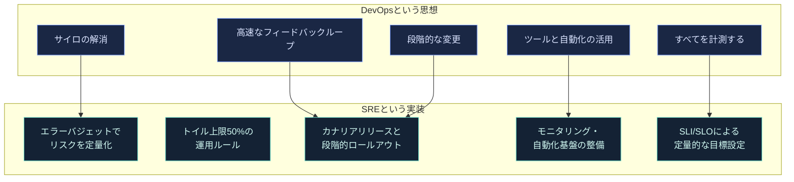

このように、SREはDevOpsが掲げる理想を「具体的な数値目標」「具体的な役割分担（SRE組織）」「具体的な運用プロセス（オンコール・ポストモーテム）」に翻訳したものだと考えると、両者は対立概念ではなく補完関係にあることが分かります。

### 1.3 本書の構成

原著は次の34章＋6つの付録で構成されています。本ガイドはこの構成をベースに、初学者がつまずきやすい概念を重点的に掘り下げます。

| パート | 主題 | 本ガイドでの扱い |
|---|---|---|
| Part I：Introduction | SREとは何か、Googleの本番環境の全体像 | 第1部で要約 |
| Part II：Principles | エラーバジェット、SLO、トイル、監視、自動化、リリース、シンプルさ | 第2部で詳解 |
| Part III：Practices | アラート、オンコール、トラブルシューティング、インシデント管理、ポストモーテム、テスト、負荷分散など | 第3部で詳解 |
| Part IV：Management | オンコール教育、割り込み対応、コミュニケーション、エンゲージメントモデル | 第4部で詳解 |
| Part V：Conclusions | 他業界からの教訓、結論 | 第6部・まとめで要約 |
| Appendix A〜F | 可用性早見表、テンプレート集（インシデント文書、ポストモーテム、ローンチチェックリスト等） | 第5部のロードマップに反映 |

---

## 第2部：原則（Principles）

### 2.1 リスクを受け入れる ―― エラーバジェット

#### なぜ「100%の信頼性」を目指してはいけないのか

初学者が最初に驚くのが、この原則です。Googleは「サービスを絶対に落とさない」ことを目標にしていません。むしろ、**過剰な信頼性はコストであり、ユーザー体験にとってもマイナスになりうる**と考えます。

理由は明快です。ユーザーが利用する経路には、スマートフォンのモバイル回線や自宅のWi-Fiなど、Googleが制御できない不安定な要素が必ず含まれます。仮にモバイル回線の信頼性が99%程度だとすれば、バックエンドの可用性を99.99%から99.999%に引き上げても、ユーザーはその差を体感できません。それどころか、信頼性を1桁引き上げるためのコストは、その前段階の改善よりも指数関数的に高くなる傾向があり、redundantな機材や検証工数といった「直接コスト」に加え、その工数を新機能開発に振り向けられない「機会コスト」も発生します。

そこでSREは、可用性目標を「最低ライン」であると同時に「上限」としても扱います。目標を超過して達成し続けることは、実は新機能開発やリファクタリングに使えたはずのリソースの浪費だと捉えるのです。

#### エラーバジェットという発想

この考え方を運用に落とし込む仕組みが**エラーバジェット（error budget）**です。仕組みは次の3ステップです。

1. プロダクトオーナーが四半期のSLO（例：99.9%の可用性）を定める
2. 中立な監視システムが実際の可用性を計測する
3. SLOと実測値の差分が「使ってよい不信頼性の残高」＝エラーバジェットになる

エラーバジェットが残っている限り、開発チームはリリースを続けてよい。使い切ってしまったら、新機能のリリースを一時的に止め、安定化に工数を振り向ける ―― これが基本ループです。Googleのワークブックによれば、**本番障害のおよそ70%は変更（コードや設定のリリース）に起因する**というデータがあり、エラーバジェットはまさにこの「変更に伴うリスク」をチーム間の共通言語として管理するための仕組みです。

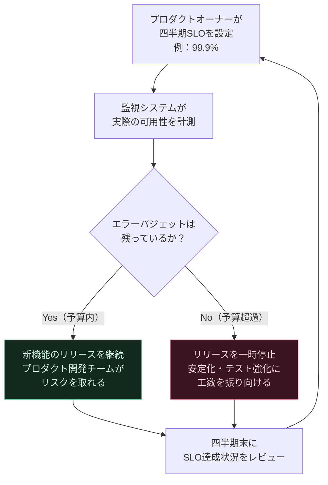

エラーバジェットの最大の価値は、「リリースするかどうか」という政治的・感情的になりがちな議論を、客観的な数字ベースの合意形成に変える点にあります。開発チームは自らエラーバジェットの残量を把握しているため、リスクを取りすぎないよう自律的に振る舞うようになり、SREチームは「感情論ではなくデータに基づいて」リリースを止める権限を持てるようになります。

#### ベストプラクティス：可用性目標の3つの決め手

- **ユーザーが何を期待しているか**：有償サービスか無償か、競合はどの水準を提供しているか
- **障害の性質**：全断と部分断のどちらがビジネスへの影響が大きいか（例：機密情報の誤表示は即座に全断すべき、対する画像の一部読み込み失敗は許容範囲）
- **コストと収益への影響**：可用性を1桁改善するコストと、それによって守れる収益を比較する

### 2.2 サービスレベル目標（SLI / SLO / SLA）

「信頼性」という曖昧な言葉を、実務で使える指標に分解する枠組みがSLI・SLO・SLAの3層構造です。この3つの用語は現場でもしばしば混同されるため、丁寧に区別します。

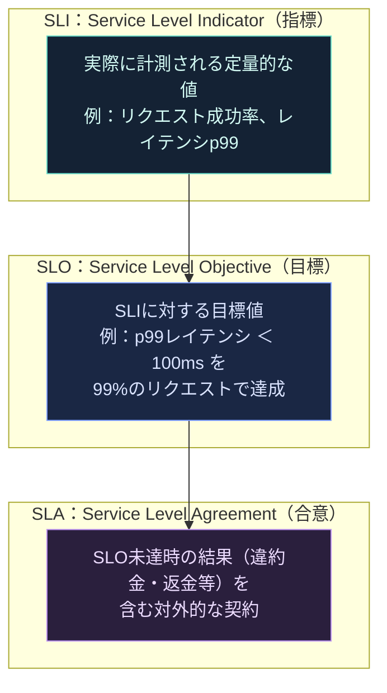

- **SLI（指標）**：実際に測るもの。代表的なSLIはレイテンシ・エラー率・スループット・可用性（＝正常に処理できたリクエストの割合）・データ耐久性。生の値を使うのではなく、一定の集計ウィンドウ（例：1分間平均）で扱うのが基本です。
- **SLO（目標）**：SLIに対する目標範囲。「99%のGetリクエストが100ms未満で完了する」のように、測定方法と有効条件を明記して定義します。
- **SLA（合意）**：SLO未達時に生じる結果（多くの場合は金銭的なペナルティ）を含む、ユーザーとの契約。「SLA違反」と言う場合、実際にはSLOの未達を指していることがほとんどで、真のSLA違反は契約不履行として法的措置に発展しうる、という違いを理解しておくと現場での会話がスムーズになります。

#### SLIを選ぶときの視点

原著は、サービスの種類によって重視すべきSLIが変わると説明しています。

| サービスの種類 | 重視するSLI | 具体例 |
|---|---|---|
| ユーザー向けサービング系（検索、Web UIなど） | 可用性・レイテンシ・スループット | リクエストに応答できたか／どれだけ速いか／何件さばけたか |
| ストレージ系 | レイテンシ・可用性・耐久性 | 読み書きの速さ／いつでもアクセスできるか／データが消えないか |
| ビッグデータ系（パイプライン等） | スループット・end-to-endレイテンシ | 処理量／取り込みから完了までの時間 |
| すべてのシステム共通 | 正しさ（correctness） | 正しいデータ・正しい答えが返ってきたか |

また、レイテンシのような指標は**平均値ではなくパーセンタイル（p50, p95, p99など）で見る**ことが強く推奨されています。平均値はロングテール（一部の極端に遅いリクエスト）を隠してしまうためです。ユーザー体験は「典型的な速さ」よりも「ばらつきの少なさ」に敏感であることが研究で示されており、多くのSREチームは高パーセンタイル値の改善を優先します。

#### ベストプラクティス：SLOを決める5つの心得

- 現状のパフォーマンスをそのまま目標にしない（改善の余地を残す）
- 集計をシンプルに保つ（複雑な合成指標は変化を見えにくくする）
- 「常に」「無限に」といった絶対値表現を避ける
- SLOの数はできるだけ絞る（説明できないSLOは持たない）
- 最初から完璧を目指さず、運用しながら調整する

### 2.3 トイルの撲滅

#### トイルとは何か

SREにおける「トイル（toil）」は、単に「やりたくない仕事」ではありません。原著は、次の特徴を多く満たす作業をトイルと定義しています。

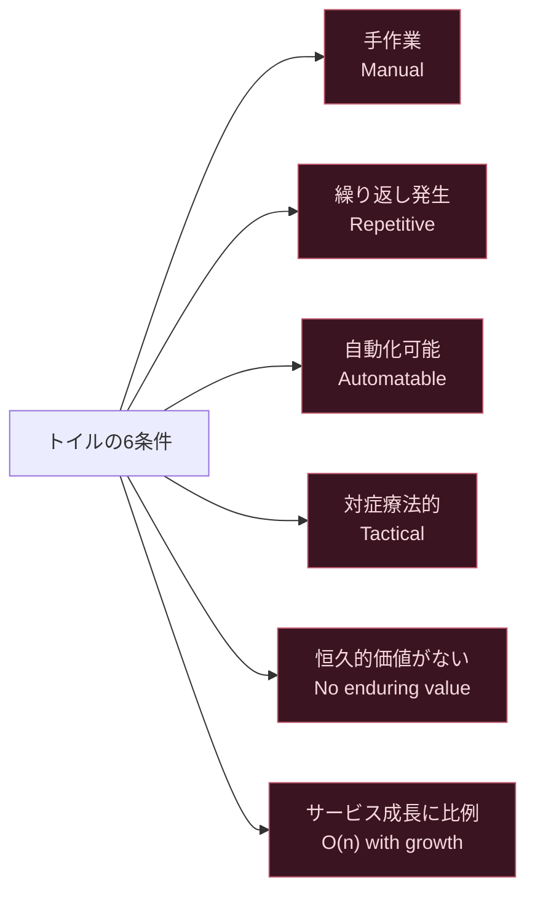

一方で、たとえ地味で泥臭い作業であっても、恒久的な改善につながるものはトイルではなく「オーバーヘッド」または「エンジニアリング」に分類されます。例えば、アラート設定を整理してノイズを減らす作業は地味ですが、システムを恒久的に良くするためトイルではありません。

#### 「50%ルール」の意味

GoogleのSRE組織は、**各SREのトイルを業務時間の50%未満に抑える**ことを目標として掲げています。逆に言えば、最低でも50%はエンジニアリングプロジェクト（将来のトイルを減らす、または機能を追加する仕事）に充てられるべきだ、という約束です。この数字には根拠があり、8人ローテーションのオンコール体制だけでも最低25%は運用に取られる計算になるため、それ以外の運用作業（割り込み対応、リリース作業など）を合わせても50%以内に収めることが現実的な上限とされています。

原著によれば、Google社内の四半期調査でSREの平均トイル比率は約33%と、目標の50%を下回る良好な水準にありますが、個人差が大きく（0%〜80%まで分布）、過度にトイルが偏っている場合はマネージャーが負荷分散に介入すべきだとされています。

#### ベストプラクティス：トイルが多すぎることの弊害

- **キャリアの停滞**：プロジェクト経験が積めず評価につながらない
- **士気の低下**：燃え尽き・退屈・不満の温床になる
- **チームの機能不全**：「SREはエンジニアリング組織である」というメッセージが崩れる
- **前例の固定化**：安易にトイルを引き受けると、開発チームから運用作業を押し付けられる前例を作ってしまう

### 2.4 分散システムの監視 ―― 4大シグナル

#### モニタリングの目的を整理する

監視は「何かがおかしい」を検知するだけの仕組みではありません。原著は監視の目的を、長期トレンド分析・比較実験・アラート・ダッシュボード構築・アドホックなデバッグの5つに整理しています。特に重要な区別が「症状（symptom）」と「原因（cause）」です。

| 症状（What's broken） | 原因（Why） |
|---|---|
| HTTP 500 や 404 を返している | データベースが接続を拒否している |
| レスポンスが遅い | CPUが過負荷、あるいはネットワークのパケットロス |
| 特定地域のユーザーに配信できていない | CDNが特定のIPをブロックしている |
| 非公開のはずのコンテンツが誰でも見える | 新しいリリースでACL設定が失われた |

ページ（緊急呼び出し）は基本的に「症状」に対して発報し、「原因」はデバッグの手がかりとして別途参照するのが良い設計とされます。原因ベースでアラートを組み立てると、依存関係が複雑化しやすく壊れやすいアラートになりがちだからです。

#### 4大シグナル（The Four Golden Signals）

もし4つしか指標を測れないとしたら何を測るべきか、という問いに対するGoogleの回答が「4大シグナル」です。

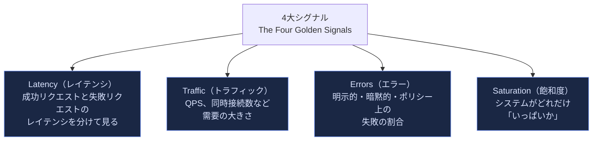

- **レイテンシ**：失敗したリクエストのレイテンシを成功リクエストと混ぜて集計すると誤った結論を導きます。「速く失敗するエラー」は「遅く失敗するエラー」より問題が軽い場合もあれば、逆に見落としを招く場合もあるため、必ず分離して計測します。
- **トラフィック**：Webサービスなら秒間リクエスト数、ストリーミングならI/Oレートや同時セッション数など、サービスの性質に応じた指標を選びます。
- **エラー**：HTTP 500のような明示的な失敗だけでなく、「200は返ってきたが中身が間違っている」ような暗黙的な失敗も対象になります。
- **飽和度**：メモリ制約のあるシステムならメモリ使用率、I/O制約のあるシステムならI/O使用率など、最も制約になりやすいリソースに注目します。多くのシステムは100%使用率に達する前に性能劣化を始めるため、しきい値の設定が重要です。

#### 平均値の罠

レイテンシを平均値だけで監視すると、全体の傾向を見誤ります。例えば平均レイテンシが50msのシステムでも、上位5%のリクエストがその20倍遅い、というケースは珍しくありません。この「ロングテール」を捉えるには、リクエストをレイテンシ帯ごとにバケット化したヒストグラムで可視化し、p50・p95・p99といった高パーセンタイル値を追跡することが有効です。

#### ベストプラクティス：良いアラートの5つの問い

- 見逃されている・緊急・実際に（あるいはまもなく）ユーザーに影響する状態を検知しているか
- 「無視してよい」と分かっているアラートを放置していないか
- ユーザーへの実害があると確実に言えるか（ドレイン中のトラフィックなどの除外条件はあるか）
- そのアラートに対して取れるアクションがあるか。それは緊急か、自動化できないか
- 同じ問題で他の人にも重複してページが飛んでいないか

### 2.5 自動化の進化

Googleは自動化を「あるかないか」の二択ではなく、成熟度の異なる段階として捉えています。手作業から始まり、外部で管理されるシステムによる自動実行、さらにシステム自身がその機構を保守できる段階へと進化していく、というモデルです。

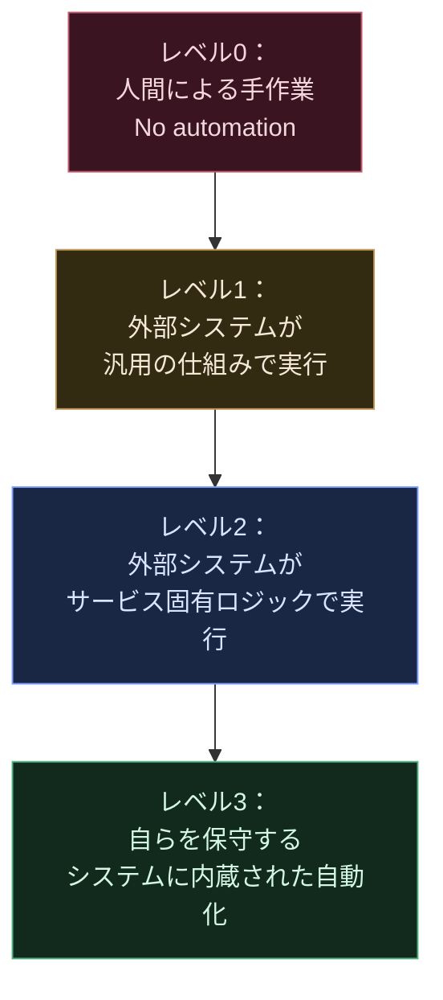

自動化を進める価値は「人手を減らすこと」だけではありません。原著が強調するのは次の点です。

- **一貫性**：人間の手作業は個人差や気分によってばらつくが、自動化された処理は再現性が高い
- **プラットフォーム化**：一度自動化した処理は、他のチームにも展開できる汎用的な基盤になりうる
- **迅速な修復**：自動化された復旧アクションは、人間がページを見て対応するより圧倒的に速い
- **時間の節約そのもの**：自動化への投資は最初はコストに見えても、長期的にはトイル削減として返ってくる

一方で、「人間の判断が本質的に必要なタスクか」を見極める慎重さも求められます。複雑な判断を要するアラートが日に何度も発生するようなサービスは、そもそも設計が過剰に複雑である可能性が高く、自動化する前にシステムそのものを簡素化すべきだ、という指摘は示唆に富みます。

### 2.6 リリースエンジニアリング

信頼性の高いサービスを支えるには、信頼性の高いリリースプロセスが欠かせません。原著は、Googleのリリースエンジニアリングを支える4つの哲学を紹介しています。

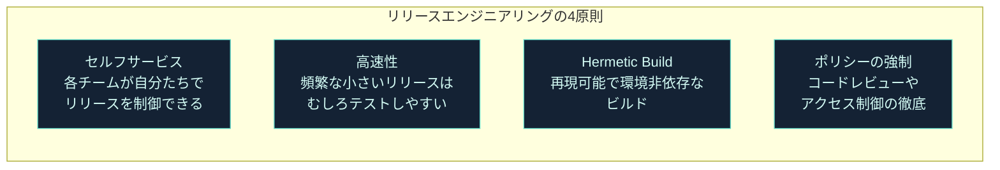

- **セルフサービスモデル**：リリースプロセスを自動化し、各プロダクトチームが自律的にリリース頻度を決められるようにする。エンジニアの関与は問題発生時のみに絞る。
- **高速なリリース**：頻繁にリリースするほど、1回あたりの変更差分は小さくなり、結果としてテストとトラブルシューティングが容易になる、という一見逆説的な発想。
- **Hermetic Build（再現可能なビルド）**：ビルド結果はビルドマシンにインストールされているライブラリの状態に依存してはならず、既知のバージョンのツールとライブラリのみに依存させる。同じリビジョンからは常に同じ成果物が得られることを保証する。
- **ポリシーとプロセスの強制**：コードレビュー必須化、承認フロー、変更履歴の自動記録などをツールに組み込み、属人的な運用に頼らない。

上図はGoogle内部の自動リリースシステム「Rapid」の流れを簡略化したものです。バグ修正が必要になった際は、mainlineの変更をリリースブランチへ個別に取り込む「チェリーピック」という手法を用い、意図しない変更が紛れ込むのを防ぎます。

### 2.7 シンプルさという美徳

原著9章のテーマは「シンプルさ」です。ソフトウェアシステムは放置すると自然に複雑化していく傾向があり、SREはその複雑化に抗う立場を担います。複雑さが増すほど、変更のリスク・保守コスト・障害発生時の調査コストはすべて増大します。

SREが標榜する姿勢は「退屈であること（boring）」への積極的な評価です。予測可能で、驚きの少ないシステムは、優れたシステムの証だと捉えます。新しい技術や複雑な最適化を導入する際は、それによって得られる価値が、増える複雑さに見合うかどうかを常に問い直すべきだとされています。

#### ベストプラクティス：シンプルさを保つための姿勢

- 「枯れた（boring）」技術を選ぶことを恥じない
- 使われなくなったコードパス・設定・アラートは積極的に削除する
- モジュール間の境界を明確にし、変更の影響範囲を小さく保つ
- パフォーマンス最適化のための複雑さの追加は、実測データに基づいてのみ判断する

---

## 第3部：実践（Practices）

### 3.1 実践的なアラート設計

監視システムが人間に知らせる方法は、大きく3種類に分類されます。

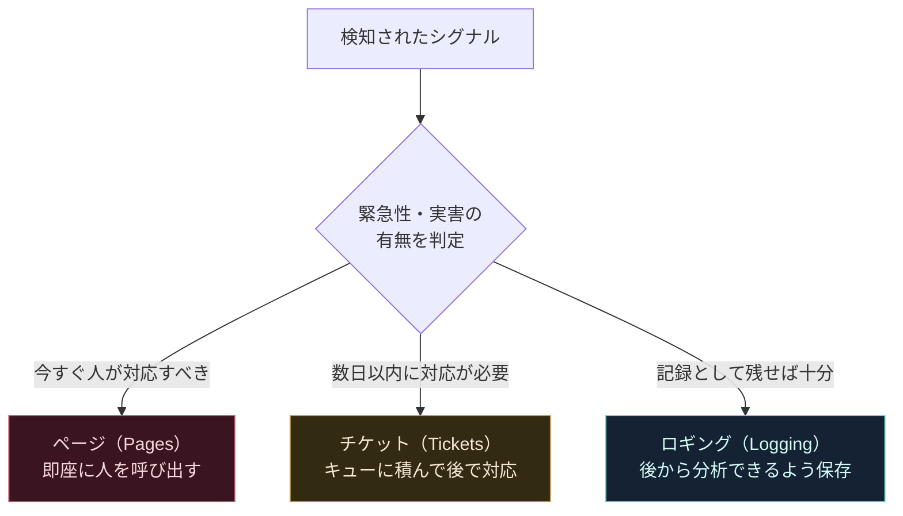

ページは最もコストの高い通知手段です。業務時間中であれば集中を妨げ、業務時間外であれば私生活や睡眠を妨げます。ページが多すぎると、エンジニアはアラートを読み飛ばしたり無視したりするようになり、本当に重要なページさえノイズに埋もれてしまう「アラート疲れ（alert fatigue）」を引き起こします。したがって、ページに値するのは「SLOを脅かす、緊急性のある、実行可能なアクションが取れる」シグナルに限定すべきです。

### 3.2 オンコール対応

#### バランスの取れたオンコール体制

Googleのオンコール設計は、「量」と「質」の2軸でバランスを管理します。

- **量の管理**：エンジニアリング時間50%を確保する原則から逆算すると、オンコールに割ける時間は最大でも25%です。24時間365日のプライマリ＋セカンダリ体制を1週間交代で維持するには、単一拠点のチームで最低8人が必要になるという試算が示されています。
- **質の管理**：1回のインシデント対応（原因調査・修復・ポストモーテム作成を含む）には平均6時間かかるとされ、12時間シフトあたり最大2件までがサステナブルな上限とされます。特定のコンポーネントが毎日のようにページを発生させている場合は、根本的な設計変更が必要なサインです。

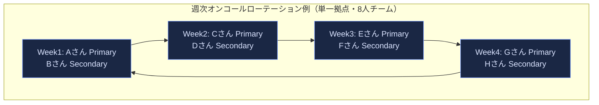

#### 「安心して」オンコールにつくために

原著が特に強調するのは、オンコール担当者の心理的な安全性です。人間は強いストレス下では「直感的・反射的な思考」に偏りやすく、これは複雑な分散システムの障害対応には不向きです。冷静で分析的な思考を維持するために、次の3つのリソースが用意されているべきだとされます。

- 明確なエスカレーションパス
- 定義済みのインシデント管理手順
- ブレームレス（非難のない）なポストモーテム文化

また、オンコールが「静かすぎる」ことにも注意が必要です。長期間本番環境から離れていると、いざという時に対応力が鈍る「オペレーショナル・アンダーロード」という逆のリスクがあります。定期的な障害対応演習（Wheel of Misfortune、DiRTと呼ばれる全社的な災害復旧訓練）は、この鈍化を防ぐ役割も果たしています。

### 3.3 効果的なトラブルシューティング

トラブルシューティングは属人的な「勘」の産物と思われがちですが、原著はこれを体系的なプロセスとして分解しています。

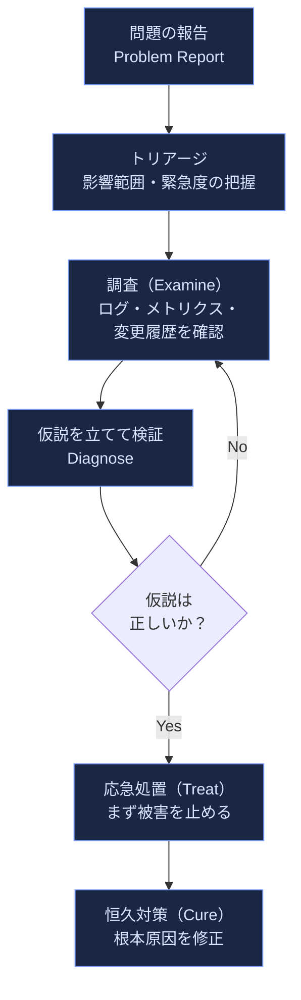

ここで強調されるのが「**まず被害を止める（Treat）ことを、根本原因の特定（Cure）より優先する**」という順序です。デバッグに没頭するあまりユーザーへの影響拡大を放置してしまうのは典型的なアンチパターンとされ、ロールバックのような即効性のある対処を先に打ってから、腰を据えて根本原因を追うべきだとされています。また、システムを深く理解していないと効果的にデバッグできないため、平時から自分の担当システムの構成図・依存関係を把握しておくことが推奨されます。

### 3.4 緊急対応

緊急対応の章では、実際の障害事例をもとに「何が功を奏し、何が裏目に出たか」を学ぶことの価値が語られます。原著が挙げる教訓は次のように要約できます。

- **テスト済みの手順書（Playbook）がある方が、その場の即興対応より平均復旧時間（MTTR）が短くなる傾向がある**
- 変更を加える前に「ロールバックできるか」を必ず自問する
- 一人で抱え込まず、早めに助けを呼ぶことをためらわない
- 対応の最中に取った行動は、後のポストモーテムのために逐一記録する

### 3.5 インシデント管理

#### 「管理されていない」インシデントはなぜ悪化するのか

原著14章は、架空のオンコール担当者Maryのストーリーを通じて、インシデント対応が崩壊していく典型的なパターンを描いています。共通する3つの落とし穴は、「技術的な問題に集中しすぎて全体像を見失う」「コミュニケーション不足で誰が何をしているか分からなくなる」「良かれと思って勝手に変更を加える（フリーランシング）」の3つです。

これを防ぐのが、米国の消防・救急で使われる**インシデント・コマンド・システム（ICS）**を土台にしたGoogle流のインシデント管理プロセスです。

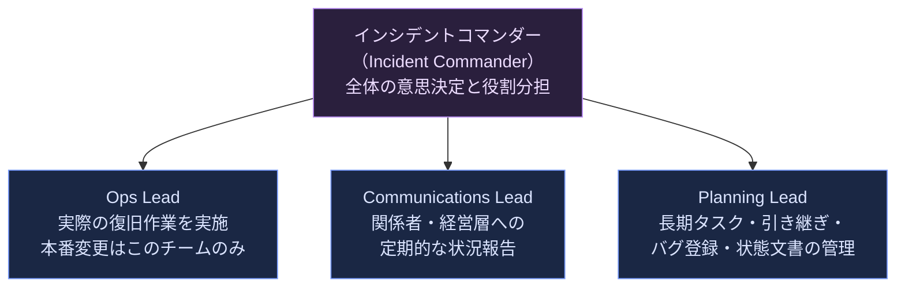

- **インシデントコマンダー**：委任していない役割はすべて自動的に自分が持つ、という原則で全体責任を負う
- **Ops Lead**：本番環境に変更を加えられるのはこのチームだけ、という一本化が「フリーランシング」を防ぐ鍵になる
- **Communications Lead**：定期的な状況更新を発信し、経営層からの問い合わせでOps Leadの集中力を削がないよう防波堤になる
- **Planning Lead**：バグ登録・食事の手配・引き継ぎ調整など、Opsが目の前の作業に専念できるよう長期的な雑務を巻き取る

さらに重要な運用ルールとして、**生きたインシデント状態文書（Living Incident State Document）**を全員が編集可能な形で共有し続けること、そして**シフト交代時には「あなたが今からインシデントコマンダーです、いいですね？」と明示的な確認を取ってから離れる**ことが定められています。

#### いつインシデントを宣言すべきか

判断に迷ったら、次のいずれかに該当すれば宣言すべきだとされています。

- 対応に2つ目以上のチームの関与が必要か
- 障害がユーザーから見える状態か
- 1時間集中して調べても解決しない状態が続いているか

「早めに宣言して、簡単な修正で早めにクローズする」方が、こじれてから慌てて体制を組むよりもずっとコストが低い、というのが原著の一貫した主張です。

### 3.6 ポストモーテム文化

#### ブレームレスであることの意味

ポストモーテムは「インシデントの記録、影響範囲、取られた対処、根本原因、再発防止策」をまとめた文書です。原著が繰り返し強調するのが、**ポストモーテムは処罰ではなく学習機会である**という原則です。

ブレームレス（非難のない）なポストモーテムとは、関係者全員が「その時点で持っていた情報の中で最善の判断をした」という前提に立ち、個人や特定チームの「悪い行動」を追及しないことを意味します。この文化は医療・航空業界に起源を持ち、ミスが致命的になりうる領域ほど「仕組みを直す」姿勢が徹底されているという知見に基づきます。人を「直す」ことはできませんが、その人が正しい選択をしやすいように仕組みや情報を変えることはできる、という考え方です。

#### ポストモーテムを書くべきタイミング

明確な基準を事前に定めておくことが推奨されており、代表的なトリガーは次の通りです。

- ユーザーが体感するレベルのダウンタイムや性能劣化
- あらゆる種類のデータ損失
- オンコール担当者による本番介入（ロールバックやトラフィック切り替えなど）
- 一定時間を超えた復旧
- 監視の見落とし（＝人力でしか障害に気づけなかった）

#### ベストプラクティス：ポストモーテム文化を根付かせる工夫

- **月間ポストモーテム**：優れたポストモーテムを社内報で紹介し、模範例として共有する
- **輪読会（Reading Club）**：軽食を囲みながら過去のポストモーテムを議論する場を設ける
- **Wheel of Misfortune**：過去のインシデントを新人が疑似体験する再演トレーニング
- **未レビューのポストモーテムは存在しないのと同じ**：レビューを経て初めて組織の知識になる
- **経営層の可視的な称賛**：Googleでは実際に全社集会でポストモーテムの実例が称賛され、迅速な対応をした社員に報奨が贈られた事例が紹介されています

### 3.7 その他の実践トピック（概観）

原著Part IIIには、より高度な分散システム設計に関わる章も含まれます。初学者は詳細より「何を扱っている章か」を把握しておくと、後で必要になったときに参照しやすくなります。

| 章 | テーマ | 一言要約 |
|---|---|---|
| 17. テストの信頼性 | 単体・統合・システムテスト戦略 | 本番相当の検証をどれだけ手前で行うか |
| 18. SREにおけるソフトウェアエンジニアリング | SREチーム自身の開発生産性 | 運用チームも「作る」仕事を評価・投資対象にする |
| 19-20. ロードバランシング | フロントエンド／データセンター内 | トラフィックを健全なバックエンドへどう分散するか |
| 21. 過負荷への対応 | Handling Overload | 優雅な劣化（グレースフルデグラデーション）の設計 |
| 22. カスケード障害への対応 | Addressing Cascading Failures | 小さな障害が連鎖的に拡大するのを防ぐ設計原則 |
| 23. 分散合意によるクリティカルステート管理 | Distributed Consensus | Paxosなどによる状態管理の信頼性確保 |
| 24-25. Cronとデータパイプライン | 定期実行・バッチ処理の信頼性 | 分散環境での「確実に1回実行する」難しさ |
| 26. データ整合性 | Data Integrity | 「書いたものが読めること」をどう保証するか |
| 27. 大規模ローンチの信頼性 | Reliable Product Launches | ローンチチェックリストによる事前レビュー |

---

## 第4部：マネジメント（Management）

### 4.1 オンコールへの導入とその先

新しくSREチームに加わったエンジニアが、いきなり本番のページに対応することはありません。段階的なオンボーディングを経て、シャドーイング（先輩の対応に同席する）→逆シャドーイング（自分が対応し先輩がレビューする）→単独オンコールという順を踏みます。前述の「Wheel of Misfortune」もこの教育プロセスの一部として位置づけられています。

### 4.2 割り込みへの対処

ページほど緊急ではないが日常的に発生する「割り込み」（チケット対応、質問対応など）は、トイルの主要な発生源の一つです。原著は、割り込み処理専任のロール（「トリアージ担当」のような役割）をローテーションの中に明示的に設けることで、他のメンバーが集中して作業できる時間を確保する手法を紹介しています。

### 4.3 コミュニケーションと協業

SREはしばしば複数のプロダクトチームを横断的に支援するため、通常のソフトウェアエンジニアリングチーム以上に、明文化されたコミュニケーション習慣が重要になります。定例の「本番会議（Production Meeting）」でその週に起きた障害・変更・リスクを共有する慣習や、チーム間の期待値をすり合わせるオンボーディングドキュメントの整備がこれにあたります。

### 4.4 SREエンゲージメントモデルの進化

あるサービスにSREチームが関わり始める際、Googleでは段階的な関与モデルを採用しています。

この段階的なアプローチには理由があります。SREチームがフルエンゲージメントで運用責任を引き受けるのは、そのサービスが一定の信頼性基準（適切な監視、十分なテスト、オンコールに耐えるドキュメント等）を満たしている場合に限られます。基準を満たさないサービスをいきなり引き受けると、SREチーム自身がトイルに埋もれてしまうためです。

---

## 第5部：初学者向け導入ロードマップ

「明日から何をすればいいのか」という問いに答えるため、ここまでの内容を実践導入の順序としてまとめ直します。組織の規模によらず、この順序は概ね有効です。

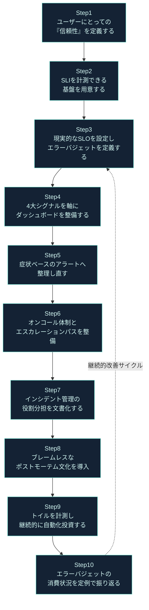

| ステップ | やること | つまずきやすいポイント |
|---|---|---|
| Step 1 | ユーザー体験の観点で「信頼性」が何を意味するか関係者と合意する | いきなり技術指標から入ると、ビジネス側との合意が取れない |
| Step 2 | クライアント側・サーバー側の両方でSLIを計測できるようにする | サーバー側だけの計測ではクライアントの体感遅延を見落とす |
| Step 3 | 現状の実績値をベースに、無理のないSLOから始める | 最初から厳しすぎる目標を置き、誰も守れず形骸化する |
| Step 4 | レイテンシ・トラフィック・エラー・飽和度の4指標を最低限揃える | 指標を増やしすぎてダッシュボードが誰にも読めなくなる |
| Step 5 | 「原因」ベースの複雑なアラートルールを、「症状」ベースへ整理する | 依存関係を細かく作り込みすぎて壊れやすいアラートになる |
| Step 6 | プライマリ／セカンダリのローテーションと呼び出し手順を整備する | 補償や負荷分散のルールを決めずに属人的な運用のまま拡大する |
| Step 7 | インシデントコマンダー等の役割と生きた状態文書のテンプレートを用意する | 役割が曖昧なまま「とりあえず集まって対応」を繰り返す |
| Step 8 | ポストモーテムのテンプレートとレビュープロセスを定める | 書いて終わりにし、アクションアイテムが実行されない |
| Step 9 | トイルを定期的にアンケートや時間記録で可視化する | 「感覚的に忙しい」だけで終わり、削減対象が特定できない |
| Step 10 | 四半期ごとにSLO達成率とエラーバジェット消費をレビューする | 一度決めたSLOを見直さず、実態と乖離したまま放置する |

---

## 第6部：2026年、AI時代のSRE

原著が刊行された2016年から10年が経ち、SREを取り巻く環境は大きく変化しています。ここでは2026年8月時点での最新動向を、複数の情報源から紹介します。

### 6.1 「信頼性」の定義そのものが広がっている

Catchpoint社（LogicMonitor傘下）が2026年1月に公表した「The SRE Report 2026」（世界400名超のSRE・DevOps・IT専門家への調査、8回目の実施）は、信頼性の定義がアップタイムだけでは語れなくなっていることを指摘しています。回答者の約3分の2が「パフォーマンスの劣化はダウンタイムと同じくらい深刻な問題である」と回答しており、これは2年連続で同水準の結果です。AIシステムが本番環境に組み込まれるにつれ、従来の死活監視だけでは実態を捉えきれなくなっている、という報告は、原著の「4大シグナル」の考え方を土台にしつつも、それをアプリケーション層だけでなくインターネットスタック全体・体験全体に広げる必要性を示しています。

同レポートは、トイルの中央値が34%であるという調査結果も報告しており、これは原著刊行時にGoogle社内で報告されていた約33%という数字と驚くほど近い水準です。AIによる自動化がトイル削減に寄与したと回答したエンジニアは半数近くに上るものの、その実感には役職による差があり、現場エンジニアより経営層の方が楽観的である、という傾向も示されています。

### 6.2 AIは「増幅器」である ―― DORAレポートの視点

Google Cloudが2025年9月に発表した「2025 DORA Report: State of AI-assisted Software Development」は、世界約5,000人のテクノロジー専門家への調査と100時間超の定性データに基づく報告です。この調査が導き出した中心的な結論は、**AIはチームの実力を「修正」するのではなく「増幅」する**というものです。すでに高いパフォーマンスを発揮しているチームはAIの活用でさらに加速する一方、技術的負債やプロセスの混乱を抱えるチームは、AIの導入によってその問題がむしろ拡大する傾向が見られました。この知見は、SREが長年主張してきた「トイルを減らし、健全な運用基盤を整えることが先決である」という原則の正しさを、AI時代においても裏付けるものだと言えます。

### 6.3 SREという職能自体の変化

Observability Engineeringの著者でHoneycomb社CTOのCharity Majorsは、2026年のインタビューで、SREの立ち位置を約15年前のQAエンジニアの立ち位置になぞらえています。エージェント型AIが「使い捨てのソフトウェア」の生成を加速させる未来（同氏の見立てでは少なくとも5年先）において、SREが担う役割そのものが再定義されていく、という見方を示しています。一方で同氏は継続して、SLOこそがダッシュボードよりも先に置かれるべき「エンジニアリングチームのためのAPI」であると主張しており、原著が確立したSLO中心の思想は、観測可能性（オブザーバビリティ）を重視する新しい潮流の中でも引き続き土台であり続けています。

また、原著の編者の一人であるNiall Richard Murphyは、2026年7月にAI運用エージェント企業Ciroosのディスティングイッシュト・エンジニアに就任したことが報じられました。Amazon・Google・Microsoftを渡り歩いた同氏がAIエージェントによる「自律的な信頼性」の領域に軸足を移したことは、SREという分野が次のフェーズ――人間のオンコール担当者を支援する自動化から、AIエージェントが一次対応を担う世界――へ移行しつつあることを象徴する動きと言えるでしょう。

### 6.4 変わらないもの

これらの新しい動向に共通しているのは、**エラーバジェット・SLO・トイル削減・ブレームレスなポストモーテムといった原著の核となる概念が、10年を経てもなお共通言語であり続けている**という事実です。ツールやAIの実装は目まぐるしく変わっても、「信頼性をどう測り、どう組織として合意し、どう学習を積み重ねるか」という原著の骨格は、2026年のSREレポートやDORAレポートの議論の土台として、今も参照され続けています。

---

## まとめ：ベストプラクティスチェックリスト

- [ ] 100%の信頼性を目指さず、ユーザー体験とコストのバランスからSLOを定義している
- [ ] エラーバジェットを、リリース可否を判断する客観的な共通言語として運用している
- [ ] SLIは平均値ではなくパーセンタイル（p95/p99等）で計測している
- [ ] トイルを定期的に計測し、業務時間の50%を超えないよう管理している
- [ ] ダッシュボードは最低限、レイテンシ・トラフィック・エラー・飽和度の4指標をカバーしている
- [ ] アラートは「症状」ベースで設計し、「原因」の追跡はデバッグ時の参考情報にとどめている
- [ ] オンコールのプライマリ／セカンダリ体制と、エスカレーションパスが明文化されている
- [ ] インシデント発生時の役割（コマンダー／Ops／Comms／Planning）が事前に定義されている
- [ ] 生きたインシデント状態文書を使い、シフト交代時は明示的な引き継ぎ確認を行っている
- [ ] ポストモーテムはブレームレスな文化のもとで作成され、レビューを経て組織に共有されている
- [ ] リリースはHermetic Buildとカナリア展開を基本とし、変更差分を小さく保っている
- [ ] 四半期ごとにSLO達成率・エラーバジェット消費・トイル比率を振り返り、目標を調整している

---

## 参考文献

本ガイドは以下の一次情報源・調査レポート・インタビュー記事を参照して作成しました。

1. Google, "Site Reliability Engineering - Table of Contents" — https://sre.google/sre-book/table-of-contents/
2. Google, "Chapter 3 - Embracing Risk" — https://sre.google/sre-book/embracing-risk/
3. Google, "Chapter 4 - Service Level Objectives" — https://sre.google/sre-book/service-level-objectives/
4. Google, "Chapter 5 - Eliminating Toil" — https://sre.google/sre-book/eliminating-toil/
5. Google, "Chapter 6 - Monitoring Distributed Systems" — https://sre.google/sre-book/monitoring-distributed-systems/
6. Google, "Chapter 8 - Release Engineering" — https://sre.google/sre-book/release-engineering/
7. Google, "Chapter 11 - Being On-Call" — https://sre.google/sre-book/being-on-call/
8. Google, "Chapter 14 - Managing Incidents" — https://sre.google/sre-book/managing-incidents/
9. Google, "Chapter 15 - Postmortem Culture: Learning from Failure" — https://sre.google/sre-book/postmortem-culture/
10. Google, "SRE Workbook - Error Budget Policy" — https://sre.google/workbook/error-budget-policy/
11. Google SRE, "Site Reliability Engineering at Google" (書籍紹介・目次索引) — https://sre.google/resources/book-update/
12. O'Reilly Media, "Site Reliability Engineering: How Google Runs Production Systems" 書籍ページ — https://www.oreilly.com/library/view/site-reliability-engineering/9781491929117/
13. Catchpoint (LogicMonitor), "The SRE Report 2026: Reliability Is Being Redefined" — https://www.catchpoint.com/learn/sre-report-2026
14. LogicMonitor Press Release, "The SRE Report 2026: Reliability Is Being Redefined" (2026年1月22日) — https://www.logicmonitor.com/press/the-sre-report-2026-reliability-is-being-redefined
15. Google Cloud Blog, "Announcing the 2025 DORA Report" (2025年9月) — https://cloud.google.com/blog/products/ai-machine-learning/announcing-the-2025-dora-report
16. Google Research, "DORA 2025 State of AI-assisted Software Development Report" — https://research.google/pubs/dora-2025-state-of-ai-assisted-software-development-report/
17. The Pragmatic Engineer (Gergely Orosz), "Observability: the present and future, with Charity Majors" — https://newsletter.pragmaticengineer.com/p/observability-the-present-and-future
18. TechTarget, "Charity Majors on AI observability and the future of SRE" — https://www.techtarget.com/searchitoperations/podcast/Charity-Majors-on-AI-observability-and-the-future-of-SRE
19. GlobeNewswire / The Manila Times, "Ciroos Appoints SRE Pioneer Niall Murphy as Distinguished Engineer to Shape the Future of Autonomous Reliability" (2026年7月28日) — https://www.manilatimes.net/2026/07/28/tmt-newswire/globenewswire/ciroos-appoints-sre-pioneer-niall-murphy-as-distinguished-engineer-to-shape-the-future-of-autonomous-reliability/2393160

---

*本ガイドは、原著 "Site Reliability Engineering: How Google Runs Production Systems" (Copyright © 2017 Google, Inc., Published by O'Reilly Media, Inc.) を参照しながら執筆した非公式の学習用ノートです。原文の完全な内容は [sre.google/sre-book](https://sre.google/sre-book/table-of-contents/) で無償公開されています。*

*ライセンスに関する注意：原著は CC BY-NC-ND 4.0 で公開されています。同ライセンスは改変物（翻訳・要約・再構成を含む）の配布を許諾していないため、本ガイドは原著のライセンスの下で配布されるものではなく、その適用も受けません。原著に由来する翻訳・要約・再構成を含む形で本ガイドを再配布する場合は、事前に権利者の個別の許諾を得て、その旨を明記してください。許諾が得られない場合は、原著に依拠しない独立した解説として書き直したうえで配布してください。*
