# Systems Performance: Enterprise and the Cloud 実践ガイド

## 〜初学者のためのステップバイステップ・システムパフォーマンス分析入門〜

> 本ガイドは、Brendan Gregg 著『Systems Performance: Enterprise and the Cloud, 2nd Edition』（邦訳：『詳解 システム・パフォーマンス 第2版』オライリー・ジャパン刊）を軸に、システムパフォーマンス分析の考え方・メソドロジ・ツールを初学者向けに整理したものです。原著者本人のブログ・スライドや、Netflix・AWS・Grafana Labsなど国際的に著名な開発者・組織の一次情報を裏付けとして参照しています（参考文献参照）。

---

## この本はどんな本か

「詳解 システム・パフォーマンス 第2版」は、**エンタープライズとクラウド環境を対象としたOS・アプリケーションのパフォーマンス分析と改善**を扱う940ページの大著です。原著者のBrendan Greggは、Sun Microsystems・Oracle・Joyent・Netflix・Intel・OpenAI（2026年2月時点）で性能エンジニアリングに携わってきた、この分野で最も著名なエンジニアの一人です。USEメソッドの考案者であり、フレームグラフ（Flame Graph）の発明者でもあり、2013年にはUSENIXからLISA Outstanding Achievement Awardを受賞しています。

第2版では初版（2014年）から大きく加筆され、特に **perf・Ftrace・拡張BPF（eBPF）の解説** と **クラウドコンピューティングの章** が充実しました。本書（日本語版）の目次は次の16章＋付録という構成です（英語版は付録A〜E＋用語集）。

| パート | 章 | 主な内容 |
|---|---|---|
| 基礎 | 1章 イントロダクション | パフォーマンスエンジニアリングとは何か、可観測性の基本用語 |
| 基礎 | 2章 メソドロジ | USE法・RED法・ワークロード特性把握など分析手法全般 |
| 基礎 | 3章 オペレーティングシステム | カーネル、システムコール、割り込みの基礎知識 |
| 基礎 | 4章 可観測性ツール | ツールの4分類とデータソース（/proc、tracepoint等） |
| 基礎 | 5章 アプリケーション | プログラミング言語別の性能特性、CPU/off-CPU分析 |
| リソース別 | 6章 CPU | USEメソッド適用、プロファイリング、フレームグラフ |
| リソース別 | 7章 メモリ | 仮想メモリ、ページング、リーク検出 |
| リソース別 | 8章 ファイルシステム | キャッシング、レイテンシ分析 |
| リソース別 | 9章 ディスク | IOPS、レイテンシ、ヒートマップ |
| リソース別 | 10章 ネットワーク | TCP分析、パケットスニッフィング |
| クラウド | 11章 クラウドコンピューティング | ハードウェア仮想化・OS仮想化・軽量仮想化の比較 |
| 実践 | 12章 ベンチマーキング | 正しい・誤ったベンチマーキングの手法 |
| ツール詳解 | 13章 perf／14章 Ftrace／15章 BPF | 各ツールチェーンの実践的な使い方 |
| 総合 | 16章 ケーススタディ | 実際の障害調査の思考プロセス |
| 付録 | A〜F | USEメソッド早見表、sar早見表、bpftrace 1行プログラム集など |

本ガイドでは、この構成をベースにしながら、初学者が最初に押さえるべき「考え方（メソドロジ）」→「土台となる知識（OS）」→「観測手段（ツール）」→「リソース別の実践」→「クラウド特有の論点」→「ベンチマーキングと総合演習」という順に再構成して解説します。

---

## 1. なぜシステムパフォーマンスを学ぶのか

システムパフォーマンスエンジニアリングは、コンピュータシステム全体（ハードウェア・OS・アプリケーション）を対象に、パフォーマンスを研究する分野です。ここで言う「パフォーマンス」は単一の指標ではなく、レイテンシ・スループット・使用率・キャパシティなど複数の視点から評価されます。

クラウド時代においてこの分野が特に重要になった理由は、コスト構造の変化にあります。オンプレミス時代は「性能が悪くても、我慢すればハードウェアは既に買ってある」という状況が多かったのに対し、クラウドでは使用したリソース（インスタンス時間・CPU・メモリ・ネットワーク帯域）に応じて課金されるため、**非効率なコードやチューニング不足のシステムがそのままコスト増に直結**します。同時に、マルチテナント環境ではリソースの奪い合い（ノイジーネイバー問題）という、オンプレミスにはなかった新しい課題も生まれます。

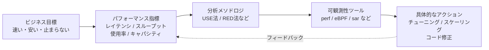

パフォーマンスエンジニアリングが難しいとされる理由は、原著1章でも述べられている通り、(1) 評価が主観的になりがちであること、(2) システムが複雑で複数レイヤーにまたがること、(3) 複数の原因が相互作用すること、(4) 複数の性能問題が同時に発生しうることにあります。だからこそ、勘や経験則だけに頼らない**体系的なメソドロジ**が必要になります。

---

## 2. 基礎概念：レイテンシ・可観測性・実験

具体的な手法に入る前に、共通言語となる基礎概念を押さえます。

### 2.1 レイテンシ（Latency）

レイテンシとは「処理にかかった時間」を指す言葉ですが、システムパフォーマンスの文脈では**測定対象を明確にすること**が重要です。同じ「Webページの表示が遅い」という現象でも、それがネットワークのレイテンシなのか、アプリケーション処理のレイテンシなのか、ディスクI/Oのレイテンシなのかによって、対処法はまったく異なります。レイテンシは原因に最も近い場所（低レイヤー）で測定するほど、真因の特定に役立ちます。

### 2.2 可観測性（Observability）

可観測性とは、外部からシステムの内部状態を推測できる度合いのことです。原著4章では、可観測性ツールを大きく4種類に分類しています。

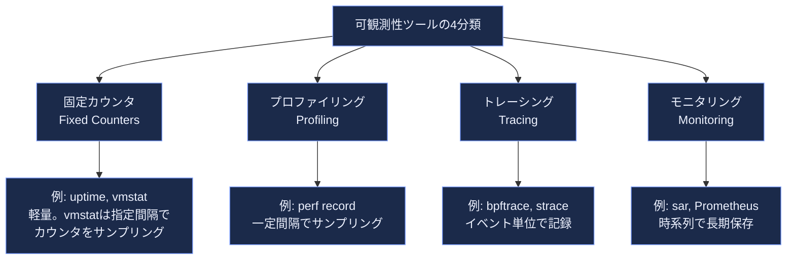

- **固定カウンタ**：`uptime`や`vmstat`のように、カーネルが常時集計しているカウンタを読み出すだけなのでオーバーヘッドがほぼゼロ。まず最初に確認すべき情報源です。
- **プロファイリング**：`perf record`のように一定間隔（例：99Hz）でスタックトレースをサンプリングし、統計的にどこが「ホット」かを可視化します。フレームグラフの元データになります。
- **トレーシング**：`bpftrace`や`strace`のように、個々のイベント（システムコール呼び出し、ディスクI/O発行など）を1件ずつ記録する手法です。詳細な反面、イベント数が多いとオーバーヘッドが大きくなります。
- **モニタリング**：`sar`やPrometheus/Grafanaのように、指標を時系列で継続的に記録し、後から傾向分析やアラートに使う手法です。

### 2.3 実験（Experimentation）

観測だけでなく、負荷生成ツール（`fio`、`iperf`、`sysbench`など）を使ってシステムに意図的に負荷をかけ、挙動を確かめる「アクティブベンチマーキング」も重要な手法です。ただし、本番環境での実験はリスクを伴うため、原著12章では実験・ベンチマーキング特有の注意点が1章分割かれています（後述）。

---

## 3. コアメソドロジ：USE法・RED法・診断サイクル

Systems Performanceという書籍の核心は、個別ツールの使い方以上に「**どういう順序・考え方で問題を切り分けるか**」というメソドロジにあります。

### 3.1 アンチメソッド：やってはいけない調査の仕方

原著2章では、まず「良くない調査方法」を3つ挙げています。

| アンチメソッド | 内容 | 問題点 |
|---|---|---|
| 街灯のアンチメソッド | 慣れたツールだけを見て回る | 本当の原因が見えている場所と限らない |
| ランダム変更アンチメソッド | とりあえず設定を変えて様子を見る | 原因不明のまま「治った気がする」で終わる |
| 誰か他人のせいにするアンチメソッド | 「ネットワークが悪い」等、担当外のせいにする | 検証なしに責任転嫁し、真因調査が止まる |

### 3.2 USEメソッド（Utilization, Saturation, Errors）

USEメソッドはBrendan Greggが考案した、システムパフォーマンス分析における最も有名なメソドロジです。Gregg自身は「未知のシステムに素早く切り込むために開発した」と述べており、飛行機のフライトマニュアルの緊急チェックリストになぞらえて、シンプルで網羅的、かつ高速であることを重視して設計されています。

考え方は非常にシンプルです。

> **「すべてのリソースについて、使用率（Utilization）・飽和度（Saturation）・エラー（Errors）を確認せよ」**

- **使用率（Utilization）**：そのリソースが仕事をしていた時間の割合（例：CPU使用率90%）。あるいはメモリのように容量ベースのリソースでは、使用済み容量の割合。
- **飽和度（Saturation）**：リソースが処理しきれず、キューに溜まっている「余分な仕事」の度合い（例：CPUのランキューの長さ）。使用率が100%に近づく前から飽和度は悪化し始めることが多く、早期警告として有用です。
- **エラー（Errors）**：エラーイベントの発生数。エラーは性能を劣化させる一方、リトライなどで見えにくく見落とされがちなため、他の2つより先にチェックすると効率的です。

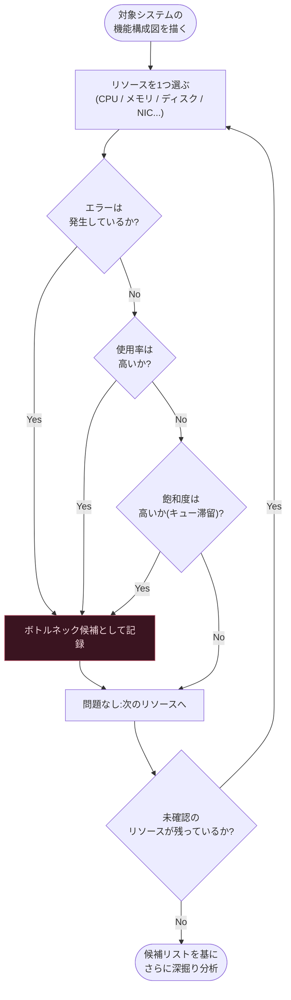

USEメソッドをLinuxの主要リソースに具体的に当てはめると、以下のようになります（原著付録Aの考え方を要約）。

| リソース | 使用率の指標例 | 飽和度の指標例 | エラーの指標例 |
|---|---|---|---|
| CPU | `mpstat`の`%usr`（ユーザー空間実行時間）+`%sys`（カーネル空間実行時間）。他に`%iowait`（I/O待機）、`%steal`（他VMに寄られた時間）、`%idle`なども重要な状態。特にクラウド環境では`%steal`の高騰に注意 | `vmstat`の`r`列（実行待ちスレッド数） | `dmesg`のCPU関連エラー |
| メモリ（容量） | `free`の使用済み容量 | スワッピング（`vmstat`の`si`/`so`）の発生 | `dmesg`のメモリエラー、OOM Killerによるプロセス強制終了 |
| ディスクI/O | `iostat`の`%util` | `iostat`の`avgqu-sz`（キュー長） | `smartctl`のディスクエラー |
| ネットワーク | `nicstat`の帯域使用率 | 送受信バッファのドロップ数 | `netstat -s`のretransmit数 |

USEメソッドの詳細は、Gregg本人による論文的な整理がCommunications of the ACM誌にも掲載されており、業界標準のメソドロジとして広く引用されています。

### 3.3 RED法：サービス視点の相棒

USEメソッドはインフラリソース中心の手法である一方、**マイクロサービス環境ではリクエスト単位の指標も同時に見る必要**があります。ここで登場するのが、Grafana Labs（旧Weaveworks/Kausal）のTom Wilkieが2015年に提唱した**RED法**です。RED法はGoogleのSRE本で知られる「4大ゴールデンシグナル」を、リクエスト駆動型サービス向けに簡略化したものとされています。

> **「すべてのサービスについて、Rate（リクエスト数）・Errors（失敗数）・Duration（処理時間）を確認せよ」**

Wilkie自身、USEメソッドはハードウェアやディスクのようなインフラ向けに強い一方、サービス視点の健全性把握には向かないとして、両者を**併用**することを推奨しています。実務では「RED法でユーザー影響のあるサービスの異常を検知し、USEメソッドでその背後にあるボトルネックリソースを特定する」という組み合わせ方が定石です。

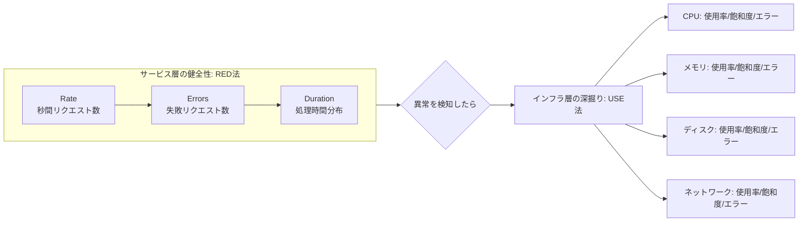

### 3.4 科学的メソッドと診断サイクル

アンチメソッドを避け、USE/RED法で当たりをつけた後は、**仮説検証型の診断サイクル**で深掘りしていきます。原著が推奨する「診断サイクル（Diagnosis Cycle）」は、以下のようなループとして整理できます。

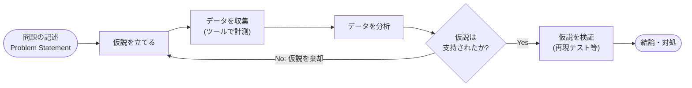

「問題の記述」では、いつから・何が・どの程度悪化したか、直前に何を変更したかを明確にする「問題記述メソッド」を使います。これにより、街灯のアンチメソッドのように無目的にツールを眺め回すことを防げます。

---

## 4. OSの基礎知識：カーネルとユーザーランド

ツールの出力を正しく解釈するには、最低限のOS内部構造の理解が欠かせません。原著3章の要点を、システムコールの流れを軸に整理します。

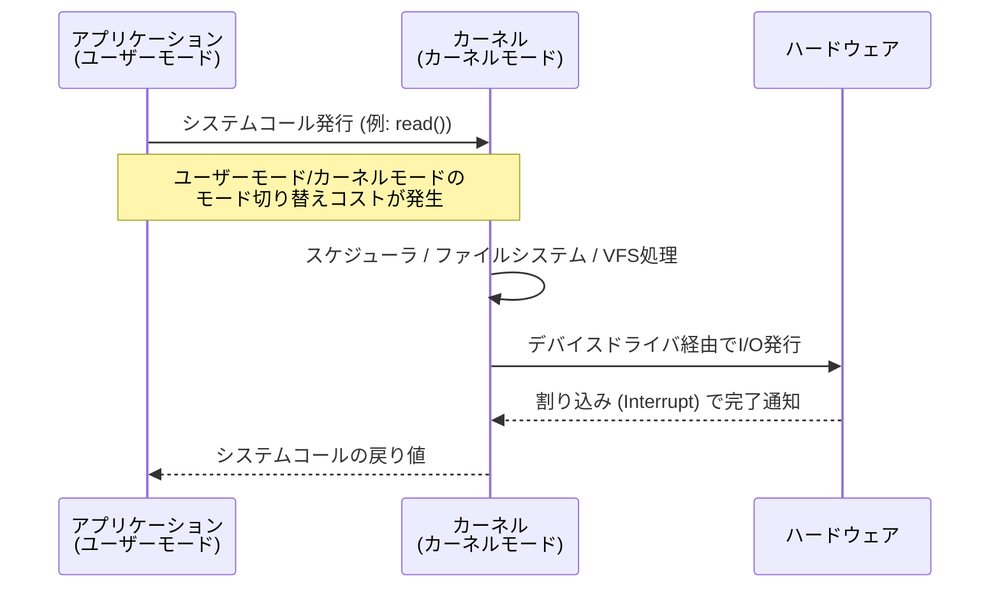

- **カーネルモードとユーザーモード**：アプリケーションは通常ユーザーモードで動作し、ハードウェアに直接アクセスできません。ファイル読み書きやネットワーク通信など特権操作が必要な際は、システムコールを介してカーネルモードに遷移します。このモード切り替え自体にコストがかかるため、頻繁なシステムコール発行（例：小さいバッファでの`read()`連発）は性能劣化の一因になります。
- **割り込み（Interrupt）**：ハードウェアがCPUに「処理が完了した／注意が必要」と通知する仕組みです。割り込みハンドラの処理が長いとCPUの他の作業を妨げるため、Linuxでは緊急度の低い処理を「ソフト割り込み（softirq）」として後回しにする仕組みがあります。
- **スケジューラ**：複数のプロセス・スレッドの中から、次にCPUで実行するものを選ぶ役割です。実行待ちのスレッドがランキューに溜まっている状態が、前述したCPUの「飽和」に相当します。
- **仮想メモリ**：プロセスに専用の連続したアドレス空間を提供する仕組み。物理メモリとの対応はページテーブルで管理され、必要なページのみを物理メモリに載せる「デマンドページング」により、実メモリ容量以上のプロセスを動かせます（後述7章）。

---

## 5. 可観測性ツールのデータソース

`perf`や`bpftrace`が「魔法のように」あらゆる情報を取得できるように見えるのは、カーネルが多様な計測点（データソース）を公開しているためです。原著4章で紹介される主要なデータソースを整理すると、以下のようになります。

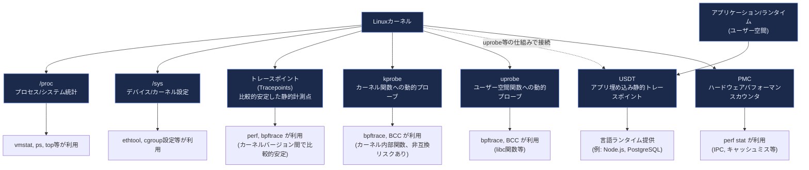

初学者がまず押さえるべきは、**「安定した抽象化レイヤーほど壊れにくいが、粒度は粗い」**という原則です。`/proc`やトレースポイントは比較的安定したインターフェースで、カーネルバージョンが変わっても使い続けやすい一方、kprobe（カーネル関数への動的プローブ）はカーネル内部実装に依存するため、カーネルアップデートで動かなくなるリスクがあります。運用ツールを自作する際は、この安定性のトレードオフを意識する必要があります。

> **注記**：トレースポイントは kprobe と比べれば安定していますが、**保証されたABIではありません**。イベント名・引数フィールドの構成・そもそもの提供有無は、カーネルのアップデートに伴って変更・削除されることがあります。利用可能なイベントとフィールドは、実行環境ごとに `bpftrace -l 'tracepoint:*'` や `/sys/kernel/debug/tracing/events/<subsystem>/<event>/format` で確認する運用にしてください。

---

## 6. CPUパフォーマンス分析

CPUは最もよく分析されるリソースです。原著6章の流れに沿って、USEメソッドをCPUに適用する具体的な手順を示します。

### 6.1 基本用語

- **使用率**：CPUが仕事をしていた時間の割合。`%user`（アプリケーションコード）と`%system`（カーネルコード）に分かれます。
- **飽和**：実行待ちでランキューに並んでいるスレッドの存在。`vmstat`の`r`列で確認できます。
- **IPC/CPI**：1クロックサイクルあたりに実行された命令数（Instructions Per Cycle）とその逆数（Cycles Per Instruction）。単純な使用率だけでなく、CPUがどれだけ効率的に働いているか（キャッシュミスで待たされていないか等）を示す重要な指標です。

### 6.2 CPU分析の観測ツールチェーン

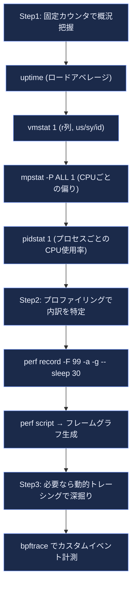

代表的なコマンド例（Linux環境）：

```bash
# Step1: 全体像の把握（負荷平均・r列・使用率）
uptime
vmstat 1
mpstat -P ALL 1
pidstat 1

# Step2: CPUプロファイリング(99Hz、全CPU、コールスタック付き、30秒間)
perf record -F 99 -a -g -- sleep 30
perf script > out.perf-script

# Step3: bpftraceでオンCPUサンプルの出現回数をカーネルスタック別に集計
bpftrace -e 'profile:hz:99 { @[kstack] = count(); }'
```

### 6.3 フレームグラフ：CPU分析の代表的な可視化

`perf record`で得られる大量のスタックトレースは、そのままではテキストの羅列で解読困難です。ここで用いられるのが**フレームグラフ（Flame Graph）**です。Brendan Greggが2011年に考案したこの可視化手法は、Netflixをはじめ多くの企業・言語で採用され、CPUプロファイリングの事実上の標準となっています。仕組みはシンプルで、収集した多数のスタックトレースをマージし、横幅を出現頻度、縦方向をスタックの深さとして描画します。横に広い山ほど「そのコードパスがCPU時間を多く消費している」ことを意味し、視覚的にホットスポットを一目で把握できます。

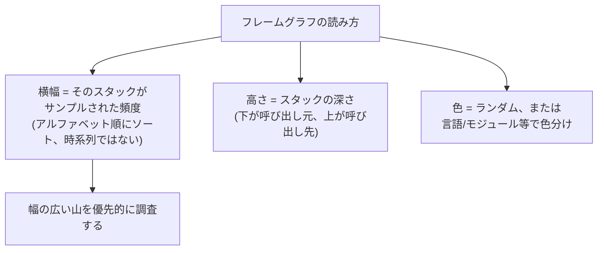

### 6.4 CPUチューニングの主な選択肢

- コンパイラ最適化オプション（`-O2`等）の見直し
- プロセス優先度（`nice`/`renice`）やスケジューリングクラスの調整
- CPUピニング／排他的cpusetによる特定コアへのバインド
- コンテナ環境ではcgroupのCPUリソースコントロールの見直し。ただし**cgroup v1とv2でインタフェースが異なる**点に注意が必要です

| 項目 | cgroup v1 | cgroup v2 |
|---|---|---|
| 相対的な配分（重み） | `cpu.shares`（既定1024） | `cpu.weight`（既定100） |
| 絶対的な上限（帯域制限） | `cpu.cfs_quota_us` と `cpu.cfs_period_us` の2ファイル | `cpu.max`（`"<quota> <period>"` を1ファイルで指定。無制限は `max`） |
| スロットリング統計 | `cpu.stat`（`nr_throttled`, `throttled_time`） | `cpu.stat`（`nr_throttled`, `throttled_usec`） |

どちらのバージョンがマウントされているかは、以下のコマンドで判別できます。

```bash
# cgroup2fs なら v2、tmpfs なら v1（またはハイブリッド構成）
stat -fc %T /sys/fs/cgroup/
```

---

## 7. メモリパフォーマンス分析

### 7.1 仮想メモリとページング

各プロセスは自分専用の仮想アドレス空間を持ち、実際の物理メモリとはページテーブルを介して対応付けられます。ページが必要になった時点で初めて物理メモリを割り当てる「デマンドページング」により、プロセスは実メモリを超えるアドレス空間を扱えます。

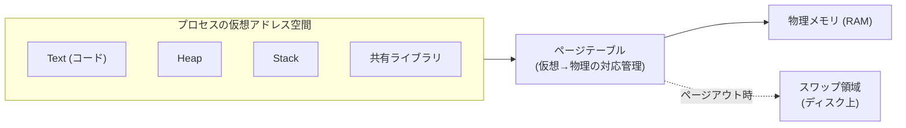

### 7.2 メモリのUSEメソッド

メモリは「容量ベースのリソース」であるため、使用率の解釈がCPUとは異なります。

| 観点 | 確認方法 | 意味 |
|---|---|---|
| 使用率 | `free -h`の`available`列 | `available`はスワップせずに新しいアプリケーションが利用できるメモリ量の推定値。`total - available`を実質的な使用量として見る（`used`はプロセス専用メモリでも`total - buff/cache`でもない） |
| 飽和 | `vmstat`の`si`/`so`列（スワップイン/アウト）、PSI (`/proc/pressure/memory`) | スワップが発生している＝物理メモリが不足し始めているサイン |
| エラー | OOM Killerのログ（`dmesg`） | メモリ確保に失敗しプロセスが強制終了された記録 |

初学者が特に誤解しやすいのは、「`free`コマンドの`free`列が少ない＝メモリ不足」という早合点です。Linuxは積極的に空きメモリをファイルシステムキャッシュとして活用するため、`free`列が小さいこと自体は正常です。ただし`buff/cache`の全量が即座に空きになるわけではなく、ダーティページや再利用できないページも含まれます。そのためカーネルが回収可能性を加味して算出する`available`を判断基準とし、`available`が継続的に減少していないかを見るのが正しい解釈です。あわせて注視すべきはスワップ活動（`vmstat`の`si`/`so`）とOOM Killerの発生有無です。

### 7.3 メモリリーク検出の考え方

原著7章では、メモリリーク検出のメソドロジとして、プロセスのワーキングセットサイズ（WSS：実際にアクセスされているメモリ量）の時系列推移を追い、単調増加していないかを確認する手法が紹介されています。`bpftrace`を使ってメモリリークを特定する場合は、`malloc`/`free`の呼び出しを単純に記録するだけでは不十分です。アロケーション状態を追跡する必要があります——各`malloc`の戻り値ポインタをキーに、確保サイズと確保時の呼び出しスタック（ustack）を値としてマップに保存し、対応する`free`呼び出し時にそのエントリを削除することで、未解放のアロケーションとそのコールスタックを特定できます。より手軽に活用する場合は、BCCの`memleak`ツールが同様のロジックを実装しており、リークしているアロケーションとそのコールスタックを表示できます。

---

## 8. ファイルシステムとディスクI/O

### 8.1 レイヤー構造の理解

アプリケーションから見えるファイルI/Oのレイテンシは、複数レイヤーを経由した合計時間です。ボトルネックがどのレイヤーにあるかを切り分けることが重要です。

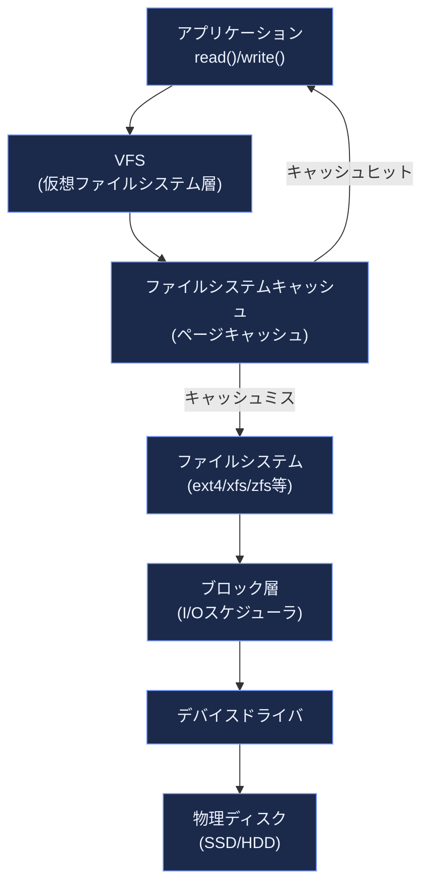

**論理I/Oと物理I/Oの違い**も重要な概念です。アプリケーションが発行した読み書き（論理I/O）は、キャッシュヒットすればディスクまで到達せず（物理I/Oゼロ）、逆に先読み（readahead）機構によって1回の論理I/Oが複数の物理I/Oを発生させることもあります。`iostat`が示すのは物理ディスクそのものではなく、**カーネルのブロックデバイス層で観測されたI/O統計**である点に注意が必要です。対象はカーネルから見えるデバイスまたはパーティションであり、仮想化環境やクラウドでは仮想ブロックデバイス（EBSボリューム等）の統計になります。ゲストのカーネルからはバックエンドのストレージインフラの挙動は見えないため、クラウド環境ではプロバイダ側のボリューム／サービスメトリクス（例：CloudWatchのEBSメトリクス）を併せて確認します。これらは物理ディスクを直接計測した値ではなく、プロバイダがボリューム単位で公開する指標ですが、IOPS／スループットの上限への到達、レイテンシ、バーストクレジットの消費といったバックエンド側の振る舞いを評価する手掛かりになります。

### 8.2 ディスクI/OへのUSEメソッド適用

```bash
# ディスクI/Oの使用率・飽和度をリアルタイム監視
iostat -xz 1

# 出力の読み方（代表的な列）:
# %util        : 使用率（デバイスがビジー状態だった時間の割合）
# avgqu-sz     : 飽和度の目安（I/Oキューの平均長）
# await        : I/O完了までの平均レイテンシ(ms)
# r/s, w/s     : 秒間の読み書きIOPS
```

原著9章では、IOPS（1秒あたりのI/O操作数）だけを見て判断することの危険性が強調されています。同じIOPS値でも、I/Oサイズ（4KBか1MBか）やランダムI/Oかシーケンシャルか、読み込みか書き込みかによって実際の負荷やレイテンシは大きく異なるため、**「IOPSは平等ではない」**という原則を意識する必要があります。

### 8.3 レイテンシの可視化：ヒートマップ

ディスクI/Oのレイテンシは平均値だけでは実態を見誤りがちです。多くのI/Oは高速に完了する一方、一部が極端に遅い「レイテンシの外れ値（Long Tail Latency）」を引き起こすことがあり、平均値ではこれが埋もれてしまいます。原著ではレイテンシヒートマップ（横軸を時間、縦軸をレイテンシ、色を頻度とする可視化）を使い、外れ値の分布パターンを視覚的に把握する手法が紹介されています。

---

## 9. ネットワークパフォーマンス分析

### 9.1 TCP接続のライフサイクルとレイテンシ

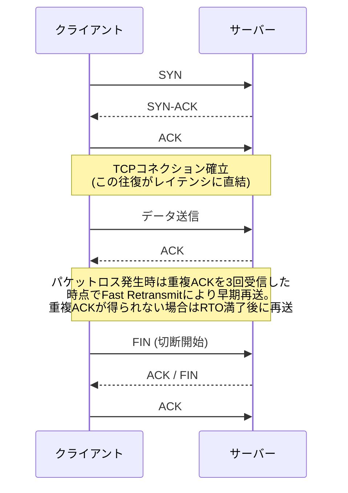

ネットワークレイテンシの分析では、接続確立にかかる時間（RTT: Round Trip Time）とデータ転送自体のスループットを分けて考えることが重要です。再送（retransmit）が多発している場合、ネットワーク経路上でパケットロスが起きている可能性が高く、`netstat -s`や`ss`コマンドで再送カウンタを確認します。

### 9.2 主要な観測コマンド

```bash
ss -tino               # TCPソケットの詳細情報（RTT、輻輳ウィンドウ等）
sar -n DEV 1           # インターフェースごとの送受信スループット
nicstat 1              # NIC使用率（帯域に対する割合）
tcpdump -i eth0 -w out.pcap   # パケットキャプチャ（詳細解析用）
```

`bpftrace`を用いれば、TCPコネクションの生成から切断までのライフタイム（`tcplife`相当のツール）や、再送イベントの発生箇所（`tcpretrans`相当）を低オーバーヘッドでトレースできます。

---

## 10. クラウドコンピューティング特有の考慮点

ここが本書のタイトルにも含まれる「Enterprise and the Cloud」の核心部分です。原著11章では、クラウドの仮想化方式を3つに分類し、それぞれのオーバーヘッドと可観測性の違いを整理しています。

### 10.1 仮想化方式の3分類

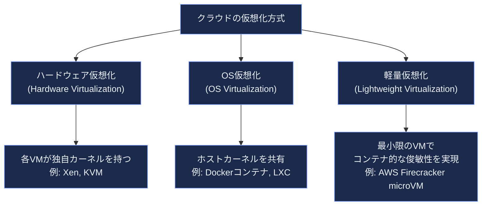

| 方式 | 分離レベル | 起動時間の目安 | オーバーヘッド | 代表技術 |
|---|---|---|---|---|
| ハードウェア仮想化 | ゲストごとに独立カーネル。分離レベルは最も高い | 数十秒〜 | ハイパーバイザー経由のI/O・ネットワークで発生しやすい | KVM, Xen |
| OS仮想化（コンテナ） | ホストカーネルをcgroup/namespaceで分離 | ミリ秒〜数秒 | 分離の甘さがトレードオフ（カーネルは共有） | Docker, containerd |
| 軽量仮想化（microVM） | 独自カーネルを持ちつつ最小構成で高速起動 | 100ms前後 | VM相当の分離を保ちつつオーバーヘッドを抑制 | AWS Firecracker |

**軽量仮想化の代表例：AWS Firecracker。** AWSがAWS Lambda向けに開発したオープンソースのVMM（Virtual Machine Monitor）で、KVMをベースに不要なデバイスエミュレーションを排除しています。公開されている実測値として、1台のmicroVMあたりのメモリオーバーヘッドは5MiB未満、起動時間は125ミリ秒程度とされており、コンテナに近い俊敏性とVMに近い分離レベルを両立させる設計として、サーバーレス基盤の標準的な実装パターンになっています。なお、FirecrackerとAWS Nitroは**別の層の技術**であり、同一の設計として扱わないよう注意が必要です。Nitroは、仮想化処理を専用ハードウェア（Nitroカード・Nitroセキュリティチップ）と軽量なNitro Hypervisorへオフロードする**EC2の基盤コンポーネント**です。一方Firecrackerは、LambdaやFargateといったサーバーレス基盤において、そのNitroベースのインスタンス上でテナントごとのmicroVMを起動するために追加で用いられる**VMM層**です。

### 10.2 マルチテナンシーと「ノイジーネイバー」問題

クラウド、特にコンテナオーケストレーション基盤では、1台の物理ホスト上に多数のテナント（コンテナ／VM）が同居します。あるテナントが過剰にリソースを使用し、同居する他のテナントの性能を劣化させる現象は「ノイジーネイバー（noisy neighbor）」問題と呼ばれ、クラウド特有の性能課題として扱われます。

Netflixの計算基盤チームは、自社のマルチテナントコンピュートプラットフォーム「Titus」において、このノイジーネイバー検知にeBPFを活用した事例を公開しています。従来の`perf`のようなツールは本番環境に常時仕掛けるにはオーバーヘッドが大きすぎる一方、eBPFでスケジューラのランキューレイテンシ（コンテナがCPUに割り当てられるまでの待ち時間）を継続的に計測することで、低オーバーヘッドかつ常時稼働可能な監視を実現したと報告されています。同チームはこの過程で開発したeBPFプログラムの性能を可視化するツール「bpftop」もオープンソースとして公開しました。

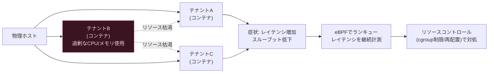

さらに近年では、コンテナ数を極端にスケールさせた際に、Linuxカーネル内部のロック競合（例：VFSのグローバルマウントロック）がボトルネックになるという、より深いレイヤーの知見もNetflixから報告されています。これは「オーケストレーション層は正常でも、その下のカーネル・CPUアーキテクチャに真因がある」という、まさにUSEメソッドが重視する**リソースを網羅的に調べる姿勢**の重要性を裏付ける事例といえます。

### 10.3 クラウド環境での可観測性の制約

クラウドインスタンス、特にコンテナ環境では、以下のような制約に注意が必要です。

- ハイパーバイザーのタイプによっては、ゲストOSからハードウェアパフォーマンスカウンタ（PMC）に直接アクセスできない場合がある
- コンテナはホストカーネルを共有するため、`perf`や`bpftrace`によるシステム全体のトレーシングには、ホスト側の権限（多くはroot相当の特権）が必要になることが多い
- クラウドのインスタンスタイプ選定自体もキャパシティプランニングの一部であり、「小さすぎるインスタンスでの機会喪失」と「大きすぎるインスタンスでのコスト超過」のバランスを取る必要がある

---

## 11. ベンチマーキングのベストプラクティスと落とし穴

パフォーマンス改善の効果を検証するにはベンチマークが必要ですが、原著12章では「ベンチマーキングは驚くほど間違えやすい」と警告されています。よくある落とし穴と、押さえるべきポイントを整理します。

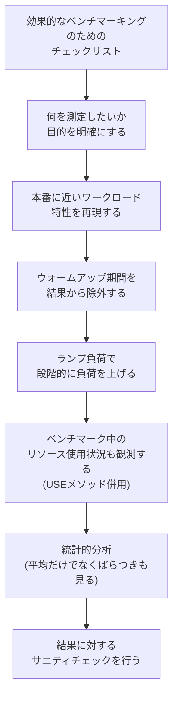

- **産業標準ベンチマークの罠**：業界標準ベンチマーク（例：TPCベンチマーク系）は比較のための共通指標として有用ですが、自社の実ワークロードとかけ離れた条件で測定されている場合、その数値がそのまま自社環境の性能を保証するわけではありません。
- **マイクロベンチマークの限界**：特定の1機能（例：単純なメモリコピー速度）だけを測定するマイクロベンチマークは有用ですが、コンパイラの最適化によって「測定対象のコードが丸ごと削除される」といった意図しない現象が起きることもあり、結果の解釈には注意が必要です。
- **ベンチマークについて問うべきこと**：原著では、他者が公表したベンチマーク結果を見る際に「誰が」「どんな目的で」「どんな条件で」計測したのかを問う姿勢の重要性が説かれています。ベンダーが公表する数値は、往々にして自社に有利な条件下で測定されている可能性があるためです。

---

## 12. ツールチェーンの選び方：perf・Ftrace・eBPF

原著13〜15章は、それぞれ`perf`・`Ftrace`・BPF（eBPF）という3つの主要ツールチェーンに1章ずつを割いています。それぞれの立ち位置を整理します。

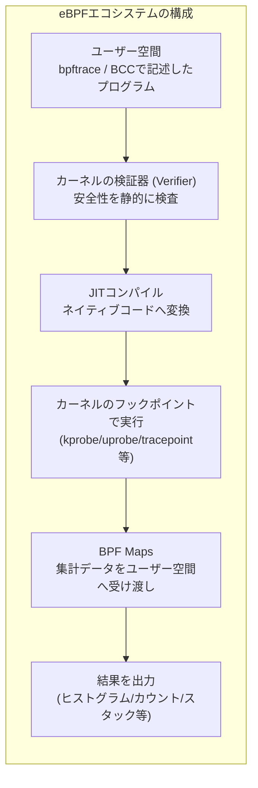

| ツール | 得意分野 | 特徴 |
|---|---|---|
| perf | CPUプロファイリング、ハードウェアカウンタ活用 | Linuxカーネルに標準搭載。フレームグラフ生成の起点としても定番 |
| Ftrace | カーネル内部の関数呼び出し追跡、ヒストグラムトリガー | 追加インストール不要でカーネルに組み込み済み |
| BPF (bpftrace/BCC) | カスタムイベントの低オーバーヘッド動的トレーシング | 150以上の既製ツールが公開されており、独自スクリプトも1行〜数十行で記述可能 |

eBPFは「Linuxをプログラム可能なカーネルに変える」技術だとGregg自身が表現しており、eBPF Foundation（Linux Foundation傘下、Meta・Google・Microsoft・Netflix・Isovalent等が参画）を中心に、観測性だけでなくネットワーキング・セキュリティ領域でも標準的な基盤技術として採用が進んでいます。この生態系の中核をなす2つのフロントエンドが、単発の複雑なツールを書くのに向く**BCC**と、1行プログラムから手軽に始められる**bpftrace**です。

### 実践：bpftraceの1行プログラム例

原著付録Cで多数紹介されている1行プログラムのうち、初学者が最初に試すのに適したものを抜粋します。

```bash
# execveによるプログラム実行をリアルタイムに表示（実行されるファイル名を表示）
bpftrace -e 'tracepoint:syscalls:sys_enter_execve { printf("%s\n", str(args.filename)); }'

# システムコールの発行回数をプロセス名ごとに集計
bpftrace -e 'tracepoint:raw_syscalls:sys_enter { @[comm] = count(); }'

# ブロックI/Oのレイテンシをヒストグラム表示（BCC版。1秒ごとに出力）
biolatency-bpfcc 1

# bpftrace同梱版（ディストリビューションによりパスは異なる）
bpftrace /usr/share/bpftrace/tools/biolatency.bt
```

ブロックI/Oのレイテンシは、`block_rq_issue`（発行）と`block_rq_complete`（完了）を自前でひも付ける1行プログラムとして書きたくなりますが、発行と完了の対応付けは見た目より厄介です。現行のBCC版`biolatency`も、これらのトレースポイントを使う経路では`dev`と`sector`の組をキーにして完了イベントを発行イベントへ対応付けています（カーネル内のブロックI/O会計関数へ直接フックできる環境では、リクエストを一意に識別できるポインタをキーにする実装が使われていた時期もあり、どちらになるかは対象カーネルとBCCのバージョンに依存します）。`dev`＋`sector`をキーにする方式では、1つのリクエストが分割して完了する（partial completion）場合や、同一セクタへのI/Oが同時に複数走る場合にペアリングが崩れ、ヒストグラムがリクエストレイテンシを正しく表さないことがあります。自前実装で同じ落とし穴を踏むより、まずは既製ツールを使い、精度が問題になる場面では手元のバージョンの実装がどのキーを使っているかを確認するのが確実です。

なお`kprobe:blk_account_io_start`のようなカーネル内部関数へのkprobeは、インライン化や関数名の変更でカーネルバージョンごとに使えなくなることがあります。自作する場合は比較的安定した`tracepoint:block:*`を優先し、利用可能なプローブは`bpftrace -l 'tracepoint:block:*'`で事前に確認してください。

---

## 13. 実践：60秒Linuxパフォーマンス分析チェックリスト

原著1章で紹介される「60秒でできるLinuxパフォーマンス分析」は、障害発生時に**まず何から手をつけるべきか**を示す実践的なチェックリストです。`uptime`・`vmstat`・`mpstat`・`pidstat`・`iostat`・`sar`・`top`といった、多くのLinuxディストリビューションで標準的に利用できる低オーバーヘッドの基本観測ツールを中心に構成されている点が利点です。ただしオーバーヘッドはゼロではありません。プロセス数やCPUコア数といった対象システムの規模と、サンプリング間隔（`1`秒指定など）に応じてコストは変動し、特にプロセス単位で集計する`pidstat`や`top`は大規模ホストで相応の負荷になり得ます。

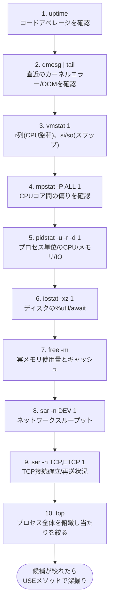

このチェックリストの狙いは、10個のコマンドを機械的に実行することそのものではなく、**「エラー・使用率・飽和度という3つの視点を、主要リソースすべてに対して漏れなく短時間で当てる」**という、USEメソッドの思想を実務に落とし込む型を身につけることにあります。

---

## 14. ケーススタディの読み方

原著16章では、実際の性能調査の思考プロセスがケーススタディとして紹介されています。初学者がこの種のケーススタディを読む際は、単に「どのコマンドを打ったか」を追うのではなく、以下の観点で読み解くと学習効果が高まります。

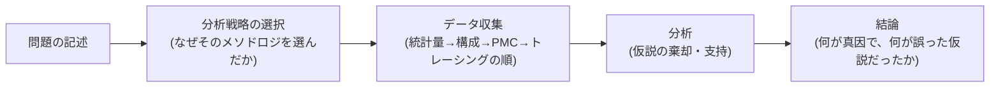

特に重要なのは、「最初に立てた仮説が外れることは珍しくない」という点です。原著のケーススタディでも、最初はネットワークを疑ったが実際の真因はメモリとディスクにあった、という展開が紹介されており、これはまさにアンチメソッド（誰かのせいにする／街灯の下だけ探す）を避け、USEメソッドで全リソースを機械的に確認することの価値を示す好例です。

---

## 15. 学習ロードマップ（初学者向け）

これから本書および関連ツールを学ぶ際の、実践的な順序の一例です。

| ステップ | やること | 目安 |
|---|---|---|
| 1 | USE法・RED法・診断サイクルの考え方を理解する（本ガイドの3章） | まず概念を先に押さえる |
| 2 | 手元のLinux環境（VMでも可）で「60秒チェックリスト」の10コマンドを実際に打ってみる | 出力の意味を1つずつ確認 |
| 3 | `perf record`でCPUプロファイリングを行い、フレームグラフを自分で生成してみる | 可視化の効果を体感する |
| 4 | `bpftrace`の1行プログラムを写経し、tracepoint/kprobe/uprobeの違いを体感する | 付録Cの一覧を活用 |
| 5 | コンテナ環境（Docker等）でcgroupのリソース制限を体験し、ノイジーネイバーの挙動を再現してみる | クラウド特有の論点の理解 |
| 6 | 自分のワークロードでベンチマークを設計し、11章のチェックリストに沿って検証する | 実務への橋渡し |

---

## まとめ

- システムパフォーマンス分析の核心は、個別ツールの暗記ではなく **USEメソッド（使用率・飽和度・エラー）** に代表される体系的なメソドロジです。
- サービス指向の環境では、RED法（Rate・Errors・Duration）とUSE法を**併用**することで、ユーザー影響とインフラ要因の両面をカバーできます。
- 可観測性ツールは「固定カウンタ→プロファイリング→トレーシング→モニタリング」という順に、オーバーヘッドと詳細度のトレードオフを意識して選びます。
- クラウド環境では、ハードウェア仮想化・OS仮想化・軽量仮想化というアーキテクチャの違いが、可観測性とオーバーヘッド特性に直結します。ノイジーネイバー問題のような、オンプレミスにはないマルチテナント特有の課題にも注意が必要です。
- eBPFは低オーバーヘッドの動的トレーシングを可能にし、Netflix・Google・Meta・Microsoftなど国際的な大手事業者を含む業界標準の基盤技術として定着しつつあります。
- ベンチマーキングは「間違えやすい」ものだと自覚し、目的の明確化・本番類似ワークロード・ウォームアップ除外・統計的検証といった基本を徹底することが重要です。

---

## 参考文献

1. 詳解 システム・パフォーマンス 第2版（オライリー・ジャパン） — https://www.oreilly.co.jp/books/9784814400072/
2. Brendan Gregg, "The USE Method" — https://www.brendangregg.com/usemethod.html
3. Brendan Gregg, "USE Method: Linux Performance Checklist" — https://www.brendangregg.com/USEmethod/use-linux.html
4. Brendan Gregg, "Thinking Methodically About Performance", Communications of the ACM — https://cacm.acm.org/practice/thinking-methodically-about-performance/
5. Wikipedia, "Brendan Gregg" — https://en.wikipedia.org/wiki/Brendan_Gregg
6. Brendan Gregg, "BPF Performance Tools" 書籍公式ページ — https://www.brendangregg.com/bpf-performance-tools-book.html
7. GitHub, "brendangregg/bpf-perf-tools-book" 公式リポジトリ — https://github.com/brendangregg/bpf-perf-tools-book
8. Brendan Gregg, "CPU Flame Graphs" — https://www.brendangregg.com/FlameGraphs/cpuflamegraphs.html
9. Wikipedia, "Flame graph" — https://en.wikipedia.org/wiki/Flame_graph
10. USENIX ATC'17, "Visualizing Performance with Flame Graphs" — https://www.usenix.org/conference/atc17/program/presentation/gregg-flame
11. Brendan Gregg, "Linux Performance" ツールマップ — https://www.brendangregg.com/linuxperf.html
12. Brendan Gregg, "Cloud Performance Root Cause Analysis at Netflix" (YOW2018スライド) — https://www.brendangregg.com/Slides/YOW2018_CloudPerfRCANetflix/
13. Netflix Technology Blog, "Noisy Neighbor Detection with eBPF" — https://netflixtechblog.com/noisy-neighbor-detection-with-ebpf-64b1f4b3bbdd
14. Netflix Technology Blog, "Announcing bpftop: Streamlining eBPF performance optimization" — https://netflixtechblog.com/announcing-bpftop-streamlining-ebpf-performance-optimization-6a727c1ae2e5
15. Netflix Technology Blog, "How Netflix uses eBPF flow logs at scale for network insight" — https://netflixtechblog.com/how-netflix-uses-ebpf-flow-logs-at-scale-for-network-insight-e3ea997dca96
16. InfoQ, "Netflix Uncovers Kernel-Level Bottlenecks While Scaling Containers on Modern CPUs" (2026) — https://infoq.com/news/2026/03/netflix-kernel-scaling-container/
17. Grafana Labs, "The RED Method: How to Instrument Your Services" (Tom Wilkie) — https://grafana.com/blog/the-red-method-how-to-instrument-your-services/
18. The New Stack, "The RED Method: A New Approach to Monitoring Microservices" — https://thenewstack.io/monitoring-microservices-red-method/
19. Firecracker microVM 公式サイト — https://firecracker-microvm.github.io/
20. AWS, "The Security Design of the AWS Nitro System" ホワイトペーパー — https://docs.aws.amazon.com/whitepapers/latest/security-design-of-aws-nitro-system/the-ec2-approach-to-preventing-side-channels.html
21. AWS Open Source Blog, "Announcing the Firecracker Open Source Technology" — https://aws.amazon.com/blogs/opensource/firecracker-open-source-secure-fast-microvm-serverless/
22. Brendan Gregg, "Systems Performance 2nd Edition" 書籍公式ページ（近況含む） — https://www.brendangregg.com/systems-performance-2nd-edition-book.html

*（本ガイドの作成にあたり、2026年8月24日時点でWeb検索により各情報源の内容を確認しています。）*
