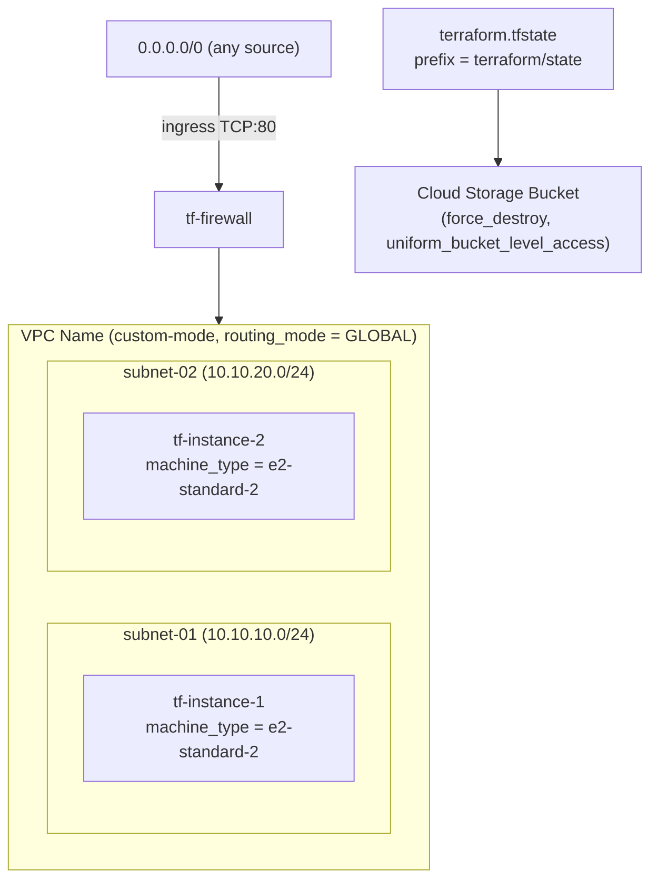
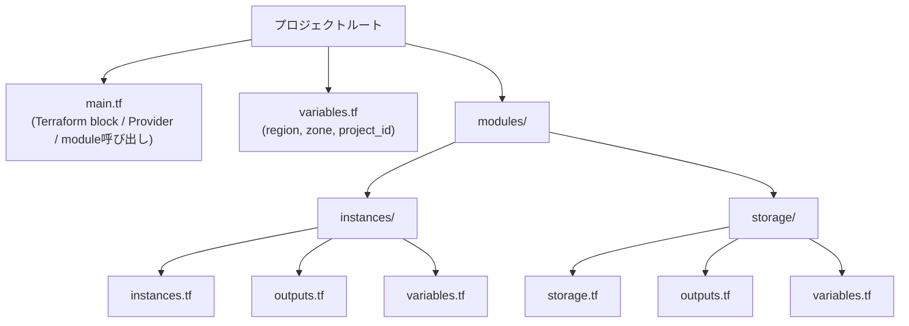
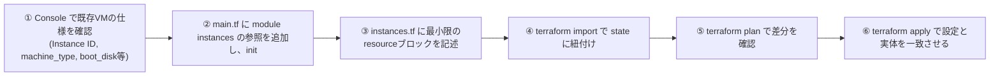
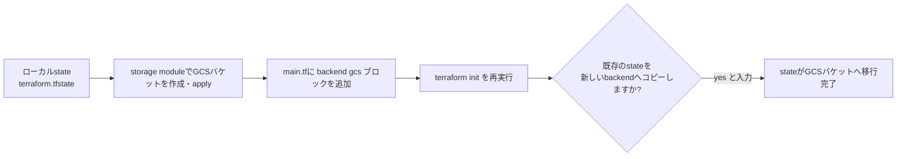
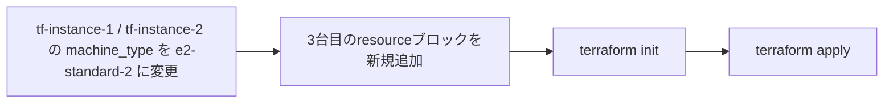
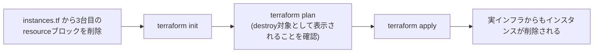
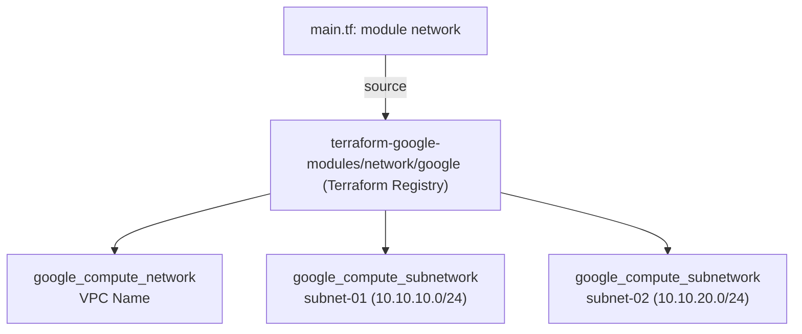
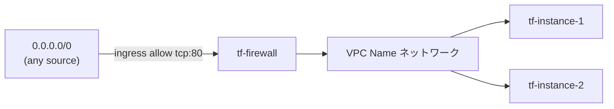

# Terraform で構築する Google Cloud インフラ管理 完全攻略ガイド

**対象ラボ**: Build Infrastructure with Terraform on Google Cloud - Challenge Lab
**対象読者**: Terraform / Google Cloud を学び始めた初学者〜中級者
**この文書の目的**: ラボの各タスクを「なぜそうするのか」というベストプラクティスの根拠とともに、ステップバイステップで解説する

---

## 目次

1. このラボで学ぶこと
2. 完成形のアーキテクチャ
3. 事前準備: Terraform CLI のインストール
4. Task 1: ディレクトリ構成とルート変数の設計
5. Task 2: 既存インフラのインポート(terraform import)
6. Task 3: リモートバックエンドの構成(GCS Backend)
7. Task 4: インフラの変更(Update in-place)
8. Task 5: リソースの削除(Destroy)
9. Task 6: Terraform Registry モジュールの活用(VPC)
10. Task 7: ファイアウォールルールの設定
11. ベストプラクティス総まとめ
12. 参考文献・引用ソース一覧

---

## 1. このラボで学ぶこと

このChallenge Labは、以下6つのTerraformの中核スキルを、実際に手を動かしながら習得することを目的としている。

| # | テストされるトピック | 対応するTask |
|---|---|---|
| 1 | 既存インフラを Terraform 設定に import する | Task 2 |
| 2 | 自作の Terraform module を構築・参照する | Task 1, 2, 3 |
| 3 | remote backend を設定する | Task 3 |
| 4 | Terraform Registry のモジュールを利用する | Task 6 |
| 5 | インフラの再プロビジョニング・削除・更新 | Task 4, 5 |
| 6 | 作成したリソース間の疎通確認 | Task 6, 7 |

Challenge Lab は手順書がなく、既存の知識を応用して自力でゴールにたどり着く形式のため、**「なぜこの設計にするのか」という一段階深い理解**が重要になる。このガイドでは単なる手順だけでなく、その根拠となる公式ドキュメントも併せて示す。

---

## 2. 完成形のアーキテクチャ

すべてのTaskを終えると、以下のような構成が出来上がる。



ポイントは、**VMインフラ(instances / network / firewall)** と **Terraformの状態管理基盤(storage bucket)** が、役割としては明確に分離されていることである。バケットはアプリケーションのインフラではなく、Terraform自身の運用基盤(state管理)のために存在する。

---

## 3. 事前準備: Terraform CLI のインストール

Cloud Shell はデフォルトでは Terraform がプリインストールされておらず、また Cloud Shell の VM 自体は非アクティブ状態が一定時間続くと破棄される一時的な環境である。そのため、素朴に `apt install terraform` を実行しただけでは、セッションが切れた瞬間にインストールが失われてしまう。

**ベストプラクティス**: `$HOME/.customize_environment` にインストールスクリプトを書いておく。このファイルは Cloud Shell の VM 起動のたびに自動実行されるため、何度セッションが切れても環境が再現される。

```bash
cat <<'EOF' > ~/.customize_environment
# HashiCorpリポジトリをセットアップしてTerraformをインストール
wget -O - https://apt.releases.hashicorp.com/gpg | sudo gpg --dearmor -o /usr/share/keyrings/hashicorp-archive-keyring.gpg
echo "deb [arch=$(dpkg --print-architecture) signed-by=/usr/share/keyrings/hashicorp-archive-keyring.gpg] https://apt.releases.hashicorp.com $(grep -oP '(?<=UBUNTU_CODENAME=).*' /etc/os-release || lsb_release -cs) main" | sudo tee /etc/apt/sources.list.d/hashicorp.list
sudo apt update && sudo apt install -y terraform
EOF
bash ~/.customize_environment
```

```bash
terraform --version
# Terraform v1.9.0 のように、v1.5.7以降のバージョンが表示されればOK
```

> **初学者向け補足**: `.bashrc` と違い、`.customize_environment` は「シェルにログインするたび」ではなく「VMが起動するたび」に一度だけ root 権限で実行されるスクリプトである。ソフトウェアのインストールなど、システム全体に影響する処理を永続化させたい場合に使う。

---

## 4. Task 1: ディレクトリ構成とルート変数の設計

### 4.1 なぜmoduleに分割するのか

Terraformの設定を1つの `main.tf` にすべて書くことも技術的には可能だが、以下の理由でモジュール化がベストプラクティスとされている。

- **再利用性**: 同じ instances module を dev/staging/prod など複数環境から呼び出せる
- **責務の分離**: instances(compute)とstorage(state管理基盤)は関心事が異なるため、別モジュールにすることで見通しが良くなる
- **チーム開発への拡張性**: モジュール単位でレビュー・バージョン管理がしやすくなる

### 4.2 ディレクトリ構成



```bash
mkdir -p modules/instances modules/storage
touch main.tf variables.tf
touch modules/instances/{instances.tf,outputs.tf,variables.tf}
touch modules/storage/{storage.tf,outputs.tf,variables.tf}
```

### 4.3 variables.tf の実装(ルート・各モジュール共通)

各 `variables.tf`(ルート、instances、storage の3ファイルすべて)に、同じ3つの変数を定義する。

```hcl
variable "project_id" {
  description = "The GCP project ID"
  type        = string
  default     = "<あなたのプロジェクトID>"
}

variable "region" {
  description = "The GCP region"
  type        = string
  default     = ""
}

variable "zone" {
  description = "The GCP zone"
  type        = string
  default     = "<ラボ開始時に指定されたゾーン>"
}
```

> **ベストプラクティス**: `default` に決め打ちの値を入れるのはアンチパターンとされることが多いが、Challenge Lab のような単一環境・単一目的の検証環境では、`terraform apply` のたびに `-var` を指定する手間を省くために default 値を設定するのが合理的である。本番運用では `terraform.tfvars` や `TF_VAR_*` 環境変数、あるいは CI/CD のシークレット管理と組み合わせるのがより安全である。

### 4.4 main.tf: Terraform block と Provider

```hcl
terraform {
  required_providers {
    google = {
      source  = "hashicorp/google"
      version = "~> 5.0"
    }
  }
}

provider "google" {
  project = var.project_id
  region  = var.region
  zone    = var.zone
}
```

`provider "google"` ブロックに `zone` を明示的に含めることで、以降 `google_compute_instance` などのリソースでゾーンを省略した場合に、このデフォルトゾーンが自動的に使われるようになる。

### 4.5 初期化

```bash
terraform init
```

`terraform init` は、(1) provider プラグインのダウンロード、(2) モジュールの解決、(3) backend の初期化、の3つを行うコマンドである。設定ファイルを変更するたび(特にmoduleやproviderを追加・変更した際)は再実行が必要になる。

---

## 5. Task 2: 既存インフラのインポート(terraform import)

### 5.1 importの位置づけを正しく理解する

`terraform import` は、**「すでにクラウド上に存在するリソースの実体」と「Terraformの設定(resourceブロック)」を紐付け、stateファイルに記録する**コマンドである。ここで重要な注意点が2つある。

- `terraform import` は **state に記録するだけ** で、resourceブロック(HCLコード)そのものは自動生成しない(Terraform 1.5+ の `import` block を使えば設定生成の一部自動化も可能だが、本ラボでは伝統的な CLI 方式を使う)
- **importするresourceブロックは、事前に手動で書いておく必要がある**。書いた内容と実際のリソースの差分は、import後の `terraform plan` で検出される

### 5.2 インポート手順のフロー



### 5.3 main.tfへのmodule参照追加

```hcl
module "instances" {
  source     = "./modules/instances"
  project_id = var.project_id
  region     = var.region
  zone       = var.zone
}
```

module を追加・変更したら、必ず `terraform init` を再実行してモジュールを解決させる。

### 5.4 instances.tf: 最小限のresourceブロック

ラボの指示どおり、以下の引数だけに絞って最小構成で書く。項目を絞る理由は、「import後にstateとの差分を最小化し、意図しないリソースの再作成(recreate)を避けるため」である。特に `boot_disk.initialize_params.image` のようなイミュータブルな属性は、値が一致していないと `terraform apply` 時にリソースの作り直しが発生してしまう。

```hcl
resource "google_compute_instance" "tf-instance-1" {
  name         = "tf-instance-1"
  machine_type = "e2-medium"
  zone         = var.zone

  boot_disk {
    initialize_params {
      image = "projects/debian-cloud/global/images/family/debian-12"
    }
  }

  network_interface {
    network = "default"
    access_config {}
  }

  metadata_startup_script = <<-EOT
        #!/bin/bash
    EOT

  allow_stopping_for_update = true
}

resource "google_compute_instance" "tf-instance-2" {
  name         = "tf-instance-2"
  machine_type = "e2-medium"
  zone         = var.zone

  boot_disk {
    initialize_params {
      image = "projects/debian-cloud/global/images/family/debian-12"
    }
  }

  network_interface {
    network = "default"
    access_config {}
  }

  metadata_startup_script = <<-EOT
        #!/bin/bash
    EOT

  allow_stopping_for_update = true
}
```

> **重要**: `machine_type` と `boot_disk` の image は、Console上で確認した実際の値に必ず置き換えること。値が実物と食い違っていると、import自体は成功しても、その後の `apply` でインスタンスの再作成が走ってしまう危険がある。

### 5.5 import コマンドの実行

module内のresourceをimportする場合、アドレスに `module.<モジュール名>.` のprefixを付ける。

```bash
terraform import module.instances.google_compute_instance.tf-instance-1 <PROJECT_ID>/<ZONE>/tf-instance-1
terraform import module.instances.google_compute_instance.tf-instance-2 <PROJECT_ID>/<ZONE>/tf-instance-2
```

`google_compute_instance` のimport IDは `{{project}}/{{zone}}/{{name}}` の形式を取る。IDのフォーマットはリソースの種類ごとに異なるため、必ずproviderドキュメントで確認する習慣をつけること。

### 5.6 plan → apply

```bash
terraform plan
terraform apply
```

ここで最小構成にしか記述していない属性(disk sizeやlabelsなど)については、Terraformが「設定にない値」を検出し、in-place update(作り直しではない、その場での更新)が発生することがある。ラボの範囲ではこれは想定内の挙動だが、本番環境では **import前にすべての実属性を漏れなく記述し、`terraform plan` の差分がゼロ(no changes)になる状態を確認してからapplyする** のが正しい手順である。

---

## 6. Task 3: リモートバックエンドの構成(GCS Backend)

### 6.1 なぜremote backendが必要なのか

デフォルトではTerraformの state(`terraform.tfstate`)はローカルディスクに保存される。これには次のような問題がある。

- チームで作業する場合、stateの競合や上書きが発生しやすい
- ローカルファイルが破損・紛失するとインフラの管理情報が失われる
- 誰かが同時に `apply` すると、インフラの二重変更が起きうる(ロックがない)

GCS backendは、**stateをCloud Storageバケットに保管し、かつstate lockingをサポートする**ため、チーム開発や本番運用における事実上の標準的な選択肢となっている。

### 6.2 バケットリソースの作成(storage module)

```hcl
# modules/storage/storage.tf
resource "google_storage_bucket" "default" {
  name                        = "<Bucket Name>"
  location                    = "US"
  force_destroy               = true
  uniform_bucket_level_access = true
}
```

| 引数 | 役割 |
|---|---|
| `force_destroy` | バケットにオブジェクトが残っていても `terraform destroy` を通す(検証環境向け設定。本番では慎重に検討) |
| `uniform_bucket_level_access` | オブジェクト単位のACLを無効化し、IAMのみでアクセス制御する。Googleが現在推奨する設定方式 |

```hcl
# modules/storage/outputs.tf
output "bucket_name" {
  value = google_storage_bucket.default.name
}
```

main.tfへの参照追加とinit/applyは、instances moduleのときと同様の手順で行う。

```hcl
module "storage" {
  source     = "./modules/storage"
  project_id = var.project_id
  region     = var.region
  zone       = var.zone
}
```

```bash
terraform init
terraform apply
```

### 6.3 remote backendの設定と移行フロー



```hcl
# main.tf
terraform {
  backend "gcs" {
    bucket = "<Bucket Name>"
    prefix = "terraform/state"
  }

  required_providers {
    google = {
      source  = "hashicorp/google"
      version = "~> 5.0"
    }
  }
}
```

> **注意点**: `backend` ブロックには変数(`var.xxx`)を使うことができない。これはTerraformの設計上の制約で、backend設定はプロバイダーやモジュールより前、変数の評価より前の段階で読み込まれるためである。バケット名は直接文字列で書く必要がある。

```bash
terraform init
```

`backend` ブロックを追加して `init` を実行すると、Terraformは既存のローカルstateを検出し、次のように尋ねてくる。

```
Do you want to copy existing state to the new backend?
  Enter "yes" to copy and "no" to start with an empty state.
```

ここで **`yes`** と入力することで、既存の管理対象(import済みのインスタンスなど)の記録を失わずに移行できる。`no`を選ぶと空のstateから始まってしまい、既存リソースの管理情報を失うため注意が必要である。

---

## 7. Task 4: インフラの変更(Update in-place)

### 7.1 machine_typeの変更

```hcl
resource "google_compute_instance" "tf-instance-1" {
  name         = "tf-instance-1"
  machine_type = "e2-standard-2"  # e2-medium から変更
  # ...(以下は変更なし)
}
```

`tf-instance-2` も同様に `e2-standard-2` へ変更する。`allow_stopping_for_update = true` を設定済みであるため、Terraformはインスタンスを削除せず、**停止 → 属性変更 → 起動** という形でin-place updateを行う。この引数を設定していない場合、`machine_type` のようなプロパティ変更はエラーになるか、リソースの完全な再作成(destroy & create)を招く。

### 7.2 3台目のインスタンス追加

```hcl
resource "google_compute_instance" "instance-name" {
  name         = "<Instance Name>"
  machine_type = "e2-standard-2"
  zone         = var.zone

  boot_disk {
    initialize_params {
      image = "projects/debian-cloud/global/images/family/debian-12"
    }
  }

  network_interface {
    network = "default"
    access_config {}
  }

  metadata_startup_script = <<-EOT
        #!/bin/bash
    EOT

  allow_stopping_for_update = true
}
```

```bash
terraform init
terraform apply
```

### 7.3 変更・追加のワークフロー



> **ベストプラクティス**: 複数リソースにまたがる同種の変更(全インスタンスのmachine_type変更など)は、本来であれば `for_each` や `count` を使ってDRY(Don't Repeat Yourself)に書くのが望ましい。本ラボでは学習目的上、明示的に3つのresourceブロックとして書くが、実務では以下のような書き方も検討する価値がある。

```hcl
variable "instances" {
  type    = map(string)
  default = {
    "tf-instance-1" = "e2-standard-2"
    "tf-instance-2" = "e2-standard-2"
  }
}

resource "google_compute_instance" "this" {
  for_each     = var.instances
  name         = each.key
  machine_type = each.value
  # ...
}
```

---

## 8. Task 5: リソースの削除(Destroy)

### 8.1 Terraformにおける「削除」の正しい考え方

Terraformでは、クラウドコンソールから直接インスタンスを消すのではなく、**「設定ファイルからresourceブロックを削除し、applyする」** ことでリソースを削除するのがベストプラクティスである。理由は明確で、コンソールから直接削除すると、Terraformの管理下にある設定(state)と実際のインフラとの間に不整合(drift)が生まれてしまうためである。



```bash
# instances.tf から google_compute_instance.instance-name ブロックを削除した後
terraform init
terraform apply
```

`terraform plan` の出力で、対象リソースが `-` (destroy)としてマークされていることを確認してから `apply` するのが望ましい流れである。設定ファイルからブロックを削除するだけでresourceが自動的にstateからも消えるため、`terraform state rm` や `terraform destroy -target` のような個別コマンドを使う必要はない(それらは「stateからは消すが実体は残す」「特定リソースだけを明示的に指定して壊す」といった、より高度なユースケース向けのコマンドである)。

---

## 9. Task 6: Terraform Registry モジュールの活用(VPC)

### 9.1 なぜ自作せずRegistryモジュールを使うのか

VPCとサブネットの構成は、Google Cloudでは非常に定型的なパターンであり、Terraform Registry上に `terraform-google-modules/network/google` という、Googleとコミュニティが共同メンテナンスしている実績豊富なモジュールが公開されている。車輪の再発明を避け、実績のあるモジュールを再利用することは、Terraformにおける明確なベストプラクティスの一つである。

### 9.2 モジュールの参照関係



### 9.3 main.tfへのモジュール追加

```hcl
module "vpc" {
  source  = "terraform-google-modules/network/google"
  version = "10.0.0"

  project_id   = var.project_id
  network_name = "<VPC Name>"
  routing_mode = "GLOBAL"

  subnets = [
    {
      subnet_name   = "subnet-01"
      subnet_ip     = "10.10.10.0/24"
      subnet_region = var.region
    },
    {
      subnet_name   = "subnet-02"
      subnet_ip     = "10.10.20.0/24"
      subnet_region = var.region
    },
  ]
}
```

> **バージョン固定の重要性**: `version` は必ず明示的に固定する。Registryモジュールはメジャーバージョンが上がると破壊的変更(引数名の変更など)を伴うことが多く、固定しないと、ある日突然 `terraform init -upgrade` で最新版が引き込まれてapplyが失敗する、という事故につながる。本ラボでは互換性の観点から `10.0.0` を指定するよう案内されているが、実務で新規に使う場合はRegistryで最新の安定版を確認し、`~> 10.0` のような柔軟なバージョン制約を検討するとよい。

```bash
terraform init
terraform apply
```

### 9.4 インスタンスをサブネットに接続する

`instances.tf` の `network_interface` を、デフォルトネットワークから作成したVPC/サブネットへ切り替える。

```hcl
resource "google_compute_instance" "tf-instance-1" {
  # ...(略)
  network_interface {
    network    = module.vpc.network_name
    subnetwork = "subnet-01"
    access_config {}
  }
}

resource "google_compute_instance" "tf-instance-2" {
  # ...(略)
  network_interface {
    network    = module.vpc.network_name
    subnetwork = "subnet-02"
    access_config {}
  }
}
```

`module.vpc.network_name` のように、モジュールの `output` を他のリソースから参照できるのがmodule設計の大きな利点である。モジュール間の暗黙的な依存関係も、Terraformが自動的にDAG(有向非巡回グラフ)として解決してくれる。

```bash
terraform init
terraform apply
```

---

## 10. Task 7: ファイアウォールルールの設定

### 10.1 GCPのファイアウォールの基本方針

Google CloudのVPCは、デフォルトではingress(内向き)通信を暗黙的にすべて拒否する設計になっている。そのため、VM間やインターネットからの通信を許可するには、明示的にfirewallルールを作成する必要がある。「最小権限の原則」に基づき、本来は必要なポート・必要なソースIP範囲だけに絞るのがベストプラクティスだが、本ラボでは疎通確認を目的として `0.0.0.0/0` からの `tcp:80` を許可する。



### 10.2 firewallリソースの実装

```hcl
resource "google_compute_firewall" "tf-firewall" {
  name    = "tf-firewall"
  network = module.vpc.network_self_link

  allow {
    protocol = "tcp"
    ports    = ["80"]
  }

  source_ranges = ["0.0.0.0/0"]
}
```

> **`network`引数について**: ラボの指示にもあるとおり、`network` 引数には `projects/<PROJECT_ID>/global/networks/<VPC Name>` という形式のURL(self_link)を渡す必要がある。`terraform-google-modules/network/google` モジュールは `network_self_link` というoutputを提供しているため、素直にそれを参照すればよい。もしoutputの名前がわからない場合は、`terraform state show module.vpc` や `terraform state list` でstate内のリソース属性を確認する習慣をつけると良い。

```bash
terraform init
terraform apply
```

### 10.3 疎通確認

apply後は、いずれかのインスタンスからもう一方のインスタンスの外部IP(または内部IP)に対して、ポート80でアクセスできることを確認する。

```bash
# tf-instance-1 に SSH接続後
curl -m 5 http://<tf-instance-2の外部IP>:80
```

Webサーバー自体は起動していないため、素の `curl` ではタイムアウトではなく接続拒否(connection refused)が返るのが正常である。ここで重要なのは「タイムアウトしない=ファイアウォールでブロックされていない」ことの確認であり、アプリケーション層の応答自体はこのラボの検証対象ではない。

---

## 11. ベストプラクティス総まとめ

| 観点 | ベストプラクティス | このラボでの該当箇所 |
|---|---|---|
| モジュール化 | 関心事ごとに module を分割する(compute / storage など) | Task 1 |
| 変数管理 | ハードコードせず `variables.tf` に集約し、defaultを活用する | Task 1 |
| import前の準備 | importするresourceの実属性を事前にConsoleで確認し、極力一致させる | Task 2 |
| import後の検証 | `terraform plan` の差分がゼロになることを確認してから運用に入る | Task 2 |
| state管理 | ローカルstateではなくremote backend(GCS等)+ locking を使う | Task 3 |
| backendの制約 | backendブロックには変数を使えないことを理解しておく | Task 3 |
| in-place update | `allow_stopping_for_update = true` で不要な再作成を避ける | Task 4 |
| リソース削除 | コンソールから直接消さず、設定ファイルの変更→applyで削除する | Task 5 |
| 既存モジュール活用 | 車輪の再発明を避け、Registryの実績あるモジュールを使う | Task 6 |
| バージョン固定 | モジュール・providerのバージョンを明示的に固定する | Task 6 |
| 最小権限 | firewallは必要なport・source_rangeだけに絞る(本ラボでは検証用に緩和) | Task 7 |

---

## 12. 参考文献・引用ソース一覧

以下は、本ガイド内の各ベストプラクティスの根拠となる一次情報源(HashiCorp公式ドキュメント、Terraform Registry、Google Cloud公式ドキュメント)である。

| トピック | ソース |
|---|---|
| Cloud Shellの環境永続化(`.customize_environment`) | https://cloud.google.com/shell/docs/configuring-cloud-shell |
| Terraform Modules の基本 | https://developer.hashicorp.com/terraform/language/modules |
| Input Variables の定義方法 | https://developer.hashicorp.com/terraform/language/values/variables |
| `google_compute_instance` リソースリファレンス | https://registry.terraform.io/providers/hashicorp/google/latest/docs/resources/compute_instance |
| `terraform import` コマンドリファレンス | https://developer.hashicorp.com/terraform/cli/commands/import |
| Import の使い方ガイド | https://developer.hashicorp.com/terraform/cli/import/usage |
| `google_storage_bucket` リソースリファレンス | https://registry.terraform.io/providers/hashicorp/google/latest/docs/resources/storage_bucket |
| Uniform bucket-level access について | https://cloud.google.com/storage/docs/uniform-bucket-level-access |
| GCS Backend(remote backend)設定リファレンス | https://developer.hashicorp.com/terraform/language/backend/gcs |
| Terraform State の概念 | https://developer.hashicorp.com/terraform/language/state |
| `terraform-google-modules/network/google` モジュール | https://registry.terraform.io/modules/terraform-google-modules/network/google/latest |
| `google_compute_firewall` リソースリファレンス | https://registry.terraform.io/providers/hashicorp/google/latest/docs/resources/compute_firewall |
| VPCファイアウォールルールの概要(Google Cloud) | https://cloud.google.com/firewall/docs/firewalls |
| リソースの削除(Destroy)に関する言語ドキュメント | https://developer.hashicorp.com/terraform/language/resources/destroy |
| `terraform destroy` コマンドリファレンス | https://developer.hashicorp.com/terraform/cli/commands/destroy |
| Terraform Style Guide(命名規則・構成のベストプラクティス) | https://developer.hashicorp.com/terraform/language/style |

---

以上が、このChallenge Labを最短距離かつベストプラクティスに沿って攻略するための全手順である。各Taskの最後には必ず `terraform plan` で差分を確認し、意図しない変更(特にリソースの再作成)が含まれていないかをチェックしてから `apply` する習慣を徹底してほしい。
