# Terraform: Up and Running 実践ガイド ― 初学者のためのステップバイステップ解説

> **原著**: *Terraform: Up and Running, 3rd Edition*（Yevgeniy Brikman著、O'Reilly Media、2022年9月刊、全460ページ）
> **原著URL**: https://www.oreilly.com/library/view/terraform-up-and/9781098116736/
> 本ガイドは同書の10章構成（前書き・第1〜10章・付録A「推奨読書リスト」）を土台に、初学者が挫折しないよう独自に再構成し、2026年8月時点の最新エコシステム動向（HCP Terraform、OpenTofu、Ephemeral Resources等）を補足した学習ドキュメントです。書籍本文の引用ではなく、公式ドキュメントとWeb検索で確認した一次情報に基づく解説です。

---

## この記事について

| 項目 | 内容 |
|---|---|
| 対象読者 | Terraformに初めて触れるソフトウェアエンジニア・インフラエンジニア |
| 前提知識 | 基本的なLinuxコマンド操作、クラウド（本ガイドはAWSを主軸）の基礎概念 |
| ゴール | Terraformの思想・基本構文・State管理・モジュール化・チーム運用までを一気通貫で理解する |
| 対応バージョン | Terraform 1.16系（2026年8月時点の最新安定版）、一部でOpenTofu 1.12系にも言及 |
| 図解ポリシー | ASCIIアートは使用せず、フローチャートはMermaid、比較情報はMarkdown表で統一 |

原著は「Intermediate to advanced」向けとされていますが、本ガイドではその内容を噛み砕き、各章の要点・具体的なHCLコード例・ベストプラクティスを初学者向けに再構成しています。

---

## 目次

- 第0部: 前提知識 ― DevOpsとInfrastructure as Codeとは
- 第1部（原著第1章）: なぜTerraformなのか
- 第2部（原著第2章）: Terraformことはじめ
- 第3部（原著第3章）: Terraformの状態（State）管理
- 第4部（原著第4章）: 再利用可能なインフラをモジュールで作る
- 第5部（原著第5章）: ループ・条件分岐・デプロイ・落とし穴
- 第6部（原著第6章）: シークレット管理
- 第7部（原著第7章）: 複数プロバイダーの利用
- 第8部（原著第8章）: 本番グレードのTerraformコード
- 第9部（原著第9章）: Terraformコードのテスト手法
- 第10部（原著第10章）: チームでTerraformを使う
- 第11部（独自追加）: 2026年8月時点のTerraformエコシステム最新動向
- 学習ロードマップ・チェックリスト
- 付録A: 推奨リソース（原著付録A準拠）
- 参考文献

---

## 第0部: 前提知識 ― DevOpsとInfrastructure as Codeとは

### 0-1. DevOpsとは何か

DevOpsは「開発（Development）」と「運用（Operations）」を統合し、ソフトウェアを高速かつ安全にリリースし続けるための文化・プラクティスの総称です。特定のツールや役職名ではなく、以下のような目標を達成するための考え方の集合体だと理解するのが適切です。

- 変更を小さく・頻繁にリリースする
- 自動化によって人的ミスを減らす
- 障害からの復旧を高速化する
- チーム間のサイロ（分断）を解消する

### 0-2. Infrastructure as Code（IaC）とは

IaCとは、サーバー・ネットワーク・データベースなどのインフラをGUI操作ではなく「コード」として定義し、バージョン管理・レビュー・自動テスト・自動デプロイの対象にするプラクティスです。IaCツールは大きく5つのカテゴリに分類できます。

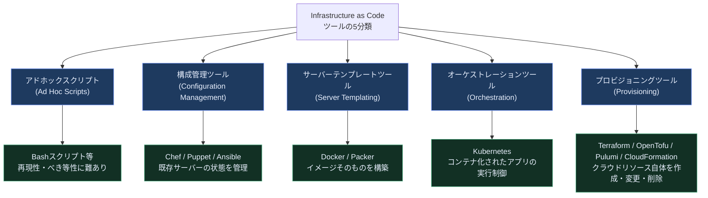

| カテゴリ | 代表ツール | 主な役割 | べき等性 | 学習コスト |
|---|---|---|---|---|
| アドホックスクリプト | Bash, Python | 何でもできるが再現性が低い | 実装依存 | 低 |
| 構成管理ツール | Chef, Puppet, Ansible, SaltStack | 既存サーバーへのソフトウェア導入・設定 | 高 | 中 |
| サーバーテンプレートツール | Docker, Packer, Vagrant | 不変のイメージを事前に作成 | 高（イメージ単位） | 中 |
| オーケストレーションツール | Kubernetes, Nomad, ECS | コンテナ／プロセスの配置とスケーリング | 高 | 高 |
| プロビジョニングツール | Terraform, OpenTofu, Pulumi, AWS CDK, CloudFormation | クラウドAPIを叩きインフラそのものを作成 | 高 | 中〜高 |

### 0-3. IaCの4つのメリット

1. **セルフサービス化**: チケット申請なしにチームが自分でインフラを立てられる
2. **速度と安全性の両立**: 自動テスト・自動レビューにより人手より高速かつ確実
3. **ドキュメントとしてのコード**: コード自体が「今のインフラがどうなっているか」の正となる
4. **バージョン管理と監査可能性**: Gitの履歴がそのまま変更履歴・監査ログになる

---

## 第1部（原著第1章対応）: なぜTerraformなのか

### 1-1. Terraformの仕組み

Terraformは、HashiCorp社が開発した宣言的（declarative）なプロビジョニングツールです。HCL（HashiCorp Configuration Language）と呼ばれるDSL（ドメイン特化言語）でインフラのあるべき状態（Desired State）を記述し、`terraform plan` で現状との差分を計算、`terraform apply` でクラウドAPIを呼び出して差分を解消します。

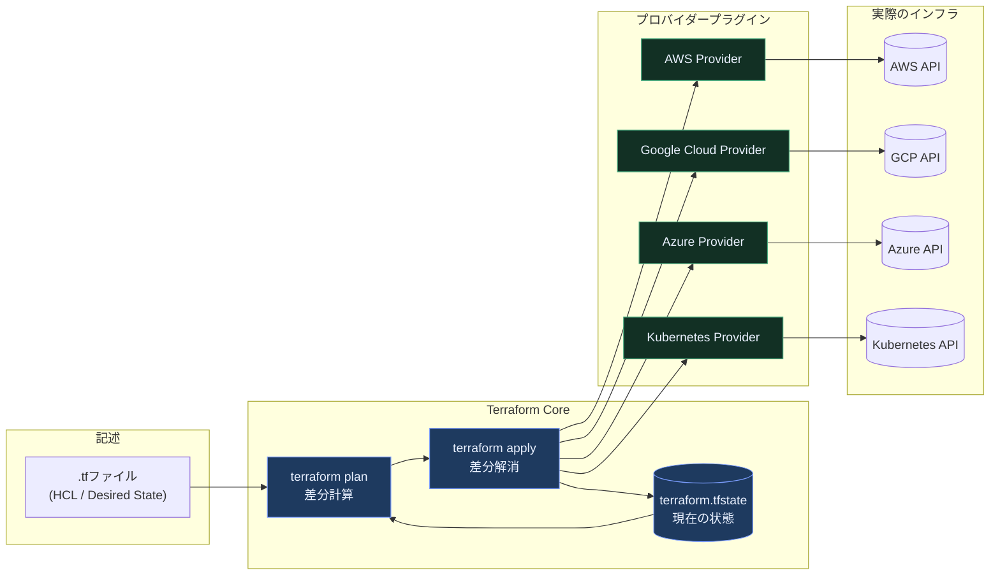

Terraformは特定プロバイダーの機能をコアには持たず、プロバイダー（Provider）というプラグイン機構を通じて各クラウド・SaaSのAPIと通信します。この設計により、AWS・GCP・Azure・Kubernetes・Datadog・GitHubなど数千種類のプロバイダーが同じHCL構文とワークフローで扱えます。

### 1-2. 比較: Configuration Management vs Provisioning

| 観点 | Configuration Management（Chef/Ansible） | Provisioning（Terraform） |
|---|---|---|
| 主対象 | 既存サーバー内部のソフトウェア設定 | クラウドリソースそのものの作成・削除 |
| 典型操作 | パッケージインストール、設定ファイル配布 | VM/VPC/ロードバランサー/DBの作成 |
| 実行の抽象度 | サーバーにログインして変更 | クラウドAPI経由でリソースを操作 |
| 組み合わせ例 | Terraformでサーバーを作り、Ansibleで中身を構成する | ― |

### 1-3. 比較: Mutable Infrastructure vs Immutable Infrastructure

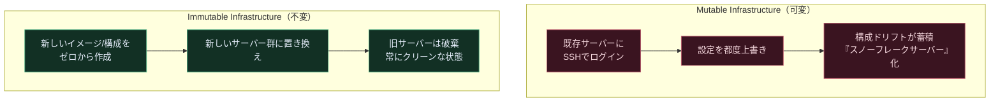

Terraform自体は可変・不変どちらの運用にも対応できますが、Server Templatingツール（Packer等）と組み合わせてAMIやコンテナイメージ単位で丸ごと入れ替える不変運用が、2026年時点でも本番環境のベストプラクティスとされています。

### 1-4. 比較: Procedural Language vs Declarative Language

| 観点 | 手続き型（Chef, Ansibleの一部） | 宣言型（Terraform, CloudFormation） |
|---|---|---|
| 記述内容 | 「どうやって」目的の状態にするかの手順 | 「何を」実現したいかの最終状態 |
| べき等性の担保 | 開発者が自前で条件分岐を書く必要がある | ツールが自動的に差分のみ適用 |
| 依存関係の解決 | 手動で順序を管理 | Terraformが依存グラフを自動構築 |
| コードの再利用性 | 実行順序に強く依存し低い | 宣言の組み合わせで高い |

### 1-5. 比較: 主要IaC/構成管理ツールの全体像

| ツール | ベンダー | 言語/形式 | 主対象 | ライセンス（2026年8月時点） |
|---|---|---|---|---|
| Terraform | HashiCorp（IBM傘下） | HCL | マルチクラウドのプロビジョニング | BUSL 1.1（ソースアベイラブル） |
| OpenTofu | Linux Foundation | HCL（Terraform互換） | マルチクラウドのプロビジョニング | MPL 2.0（オープンソース） |
| Pulumi | Pulumi Corp | TypeScript/Python/Go等の汎用言語 | マルチクラウドのプロビジョニング | Apache 2.0 |
| AWS CloudFormation | AWS | YAML/JSON | AWS専用プロビジョニング | AWSマネージドサービス（無料） |
| Chef | Progress Software | Ruby DSL | サーバー構成管理 | 商用/コミュニティ版 |
| Puppet | Perforce | 独自DSL | サーバー構成管理 | 商用/コミュニティ版 |
| Ansible | Red Hat（IBM傘下） | YAML | サーバー構成管理・簡易プロビジョニング | GPLv3 |

> **2026年時点の重要な補足**: HashiCorpは2023年8月にTerraformのライセンスをMPL 2.0からBUSL 1.1（Business Source License）へ変更し、これに反発したコミュニティがLinux Foundation傘下でOpenTofuをフォークしました。さらに2025年2月27日、IBMがHashiCorpを約64億ドルで買収完了しています。この経緯の詳細は第11部で解説します。

### まとめ

- TerraformはHCLで書く宣言型のプロビジョニングツールであり、Provider機構によりマルチクラウドを同一ワークフローで扱える
- 構成管理・サーバーテンプレート・オーケストレーション・プロビジョニングは役割が異なり、実務では組み合わせて使うのが一般的
- 不変インフラの考え方はTerraform運用のベストプラクティスの土台になる

---

## 第2部（原著第2章対応）: Terraformことはじめ

原著第2章は、AWS上で「単一サーバー」→「単一Webサーバー」→「設定可能なWebサーバー」→「Webサーバークラスタ」→「ロードバランサー」という順に、段階的に本番相当の構成へ育てていくハンズオン構成になっています。本ガイドでも同じ順序で、各ステップの目的とHCLコード例を示します。

### 2-1. AWSアカウントの準備（ベストプラクティス）

本番運用を見据える場合、以下は必ず押さえておくべき基本です。

- **ルートユーザーは日常利用しない**: MFAを設定した上で金庫にしまい、IAMユーザー/IAM Identity Center経由で作業する
- **最小権限のIAMユーザーでTerraformを実行する**: `AdministratorAccess`を安易に付与しない
- **認証情報をコードに埋め込まない**: 環境変数や`~/.aws/credentials`、あるいはCI/CDのOIDC連携を使う

### 2-2. Terraformのインストール

```bash
# macOS (Homebrew)
brew tap hashicorp/tap
brew install hashicorp/tap/terraform

# バージョン確認
terraform version
```

複数バージョンを切り替える場合は`tfenv`や`asdf`のようなバージョンマネージャの利用が推奨されます。プロジェクトごとにバージョンを固定するため、`required_version`をコード側にも明示します。

```hcl
terraform {
  required_version = ">= 1.16.0, < 2.0.0"
}
```

### 2-3. 単一サーバーのデプロイ

Terraformの最小構成は「provider」と「resource」の2ブロックです。

```hcl
provider "aws" {
  region = "us-east-2"
}

resource "aws_instance" "example" {
  ami           = "ami-0fb653ca2d3203ac1"
  instance_type = "t2.micro"

  tags = {
    Name = "terraform-example"
  }
}
```

**注意**: AMI ID はリージョン固有かつ時間とともに廃止・置き換えが進むため、上のようにハードコードした ID は別リージョンや将来の実行では解決できずに `apply` が失敗します。実務では `aws_ami` データソースで最新の AMI を動的に解決します。

```hcl
data "aws_ami" "ubuntu" {
  most_recent = true
  owners      = ["099720109477"] # Canonical

  filter {
    name   = "name"
    values = ["ubuntu/images/hvm-ssd/ubuntu-jammy-22.04-amd64-server-*"]
  }
}

resource "aws_instance" "example" {
  ami           = data.aws_ami.ubuntu.id
  instance_type = "t2.micro"

  tags = {
    Name = "terraform-example"
  }
}
```

基本ワークフローは次の3ステップです。

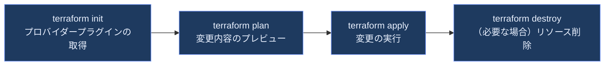

**ベストプラクティス**
- `terraform plan`の出力は必ず目視確認してから`apply`する（CI上でも`plan`結果をレビュー対象にする）
- `terraform apply`の前に`terraform fmt`と`terraform validate`をCIに組み込み、構文エラーを早期検出する

### 2-4. 単一Webサーバーのデプロイ

`user_data`でサーバー起動時にスクリプトを実行し、`aws_security_group`でポートを開放します。

```hcl
resource "aws_security_group" "instance" {
  name = "terraform-example-instance"

  ingress {
    from_port   = 8080
    to_port     = 8080
    protocol    = "tcp"
    cidr_blocks = ["0.0.0.0/0"]
  }
}

resource "aws_instance" "example" {
  ami                    = "ami-0fb653ca2d3203ac1"
  instance_type          = "t2.micro"
  vpc_security_group_ids = [aws_security_group.instance.id]

  user_data = <<-EOF
              #!/bin/bash
              echo "Hello, World" > index.html
              nohup busybox httpd -f -p 8080 &
              EOF

  user_data_replace_on_change = true

  tags = {
    Name = "terraform-example"
  }
}
```

`0.0.0.0/0`のような全開放CIDRは学習用の最小構成であり、本番では特定のCIDRブロックやセキュリティグループ参照に絞り込むのがベストプラクティスです。

### 2-5. 設定可能なWebサーバー（変数の導入）

ハードコードを避けるため`variable`ブロックで入力値を外出しします。変数を定義しただけでは何も変わらないため、2-4でポート番号を直書きしていた箇所（セキュリティグループの`ingress`と`user_data`）を必ず`var.server_port`への参照に置き換えます。

```hcl
variable "server_port" {
  description = "The port the server will use for HTTP requests"
  type        = number
  default     = 8080
}
```

```hcl
resource "aws_security_group" "instance" {
  name = "terraform-example-instance"

  ingress {
    from_port   = var.server_port
    to_port     = var.server_port
    protocol    = "tcp"
    cidr_blocks = ["0.0.0.0/0"]
  }
}

resource "aws_instance" "example" {
  ami                    = "ami-0fb653ca2d3203ac1"
  instance_type          = "t2.micro"
  vpc_security_group_ids = [aws_security_group.instance.id]

  # ${var.server_port} で変数の値をスクリプトへ埋め込む（HEREDOC内でも補間が効く）
  user_data = <<-EOF
              #!/bin/bash
              echo "Hello, World" > index.html
              nohup busybox httpd -f -p ${var.server_port} &
              EOF

  user_data_replace_on_change = true

  tags = {
    Name = "terraform-example"
  }
}

output "public_ip" {
  value       = aws_instance.example.public_ip
  description = "The public IP address of the web server"
}
```

これで`server_port`の値を変えるだけで、**実際に待ち受けるポートと許可するポートの両方**が追従します。片方だけを変数化すると、サーバーは新しいポートで待ち受けるのにセキュリティグループは旧ポートを開けたまま、という接続不能な状態になるため、必ず両方をひとつの変数から導出します。

**ベストプラクティス**
- すべての`variable`と`output`に`description`を書く（自己文書化、`terraform-docs`との相性も良い）
- 型制約（`type`）を明示し、想定外の値の混入を防ぐ

### 2-6. Webサーバークラスタのデプロイ

単一サーバーでは可用性が確保できないため、Auto Scaling Group（ASG）とLaunch Templateでクラスタ化します。

```hcl
resource "aws_launch_template" "example" {
  image_id      = "ami-0fb653ca2d3203ac1"
  instance_type = "t2.micro"

  vpc_security_group_ids = [aws_security_group.instance.id]

  user_data = base64encode(<<-EOF
              #!/bin/bash
              echo "Hello, World" > index.html
              nohup busybox httpd -f -p ${var.server_port} &
              EOF
  )
}

resource "aws_autoscaling_group" "example" {
  launch_template {
    id      = aws_launch_template.example.id
    version = aws_launch_template.example.latest_version
  }

  instance_refresh {
    strategy = "Rolling"
  }

  min_size = 2
  max_size = 10

  tag {
    key                 = "Name"
    value               = "terraform-asg-example"
    propagate_at_launch = true
  }
}
```

`version`に文字列`"$Latest"`を書くと、Launch Templateの中身（AMIやユーザーデータ）を変更してもASG側の属性値は`"$Latest"`のまま変わらないため、Terraformは差分を検知せずASGを更新しません。`aws_launch_template.example.latest_version`を参照すれば、テンプレート更新のたびにバージョン番号が変わってASGにも差分が現れ、`instance_refresh`によるローリング入れ替えが起動します。

### 2-7. ロードバランサーのデプロイ

ALB（Application Load Balancer）をASGの手前に配置し、ヘルスチェック付きでトラフィックを分散します。

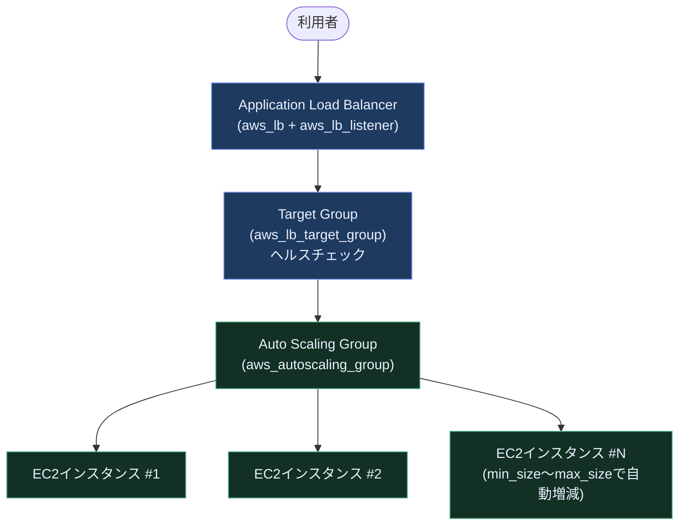

### 2-8. クリーンアップ

学習環境では課金を止めるため`terraform destroy`で作成したリソースを確実に削除します。共有環境では`terraform plan -destroy`で影響範囲を確認してから実行するのが安全です。

**ベストプラクティス**
- 個人の検証環境は使い終わったら都度`destroy`する（コスト管理）
- 本番環境では`prevent_destroy`ライフサイクルルールで誤削除を防止する

```hcl
resource "aws_db_instance" "production" {
  # ...

  lifecycle {
    prevent_destroy = true
  }
}
```

---

## 第3部（原著第3章対応）: Terraformの状態（State）管理

### 3-1. State fileとは何か、なぜ必要か

Terraformは実際のクラウドリソースと、HCLで書いた宣言との対応関係を`terraform.tfstate`というJSONファイルに記録します。このState fileがあることで、Terraformは「今何が存在するか」「次の`apply`で何を変更すべきか」を判断できます。State fileがなければ、Terraformは既存リソースをゼロから再作成しようとしてしまいます。

### 3-2. Stateの共有ストレージ（リモートバックエンド）

チーム開発ではState fileをローカルに置かず、S3・Google Cloud Storage・Azure Blob Storage・HCP Terraformのようなリモートバックエンドで共有・排他制御するのが必須のベストプラクティスです。

```hcl
terraform {
  backend "s3" {
    bucket       = "my-company-terraform-state"
    key          = "global/services/webserver-cluster/terraform.tfstate"
    region       = "us-east-2"
    encrypt      = true
    use_lockfile = true
  }
}
```

### 3-3. 【2026年最新】S3ネイティブロックとDynamoDBの非推奨化

長年、S3バックエンドでの排他ロックにはDynamoDBテーブルの併設が「お作法」とされてきました。しかし**Terraform 1.10（2024年11月）でS3ネイティブロック（`use_lockfile`）が実験的機能として導入され、Terraform 1.11でGA（正式版）に昇格、同時に`dynamodb_table`引数が非推奨化**されました。S3の条件付き書き込み（Conditional Writes）機能を使い、state本体と同じバケット内に`.tflock`ファイルを作成する仕組みで、DynamoDBテーブルの作成・IAM権限管理が不要になります。

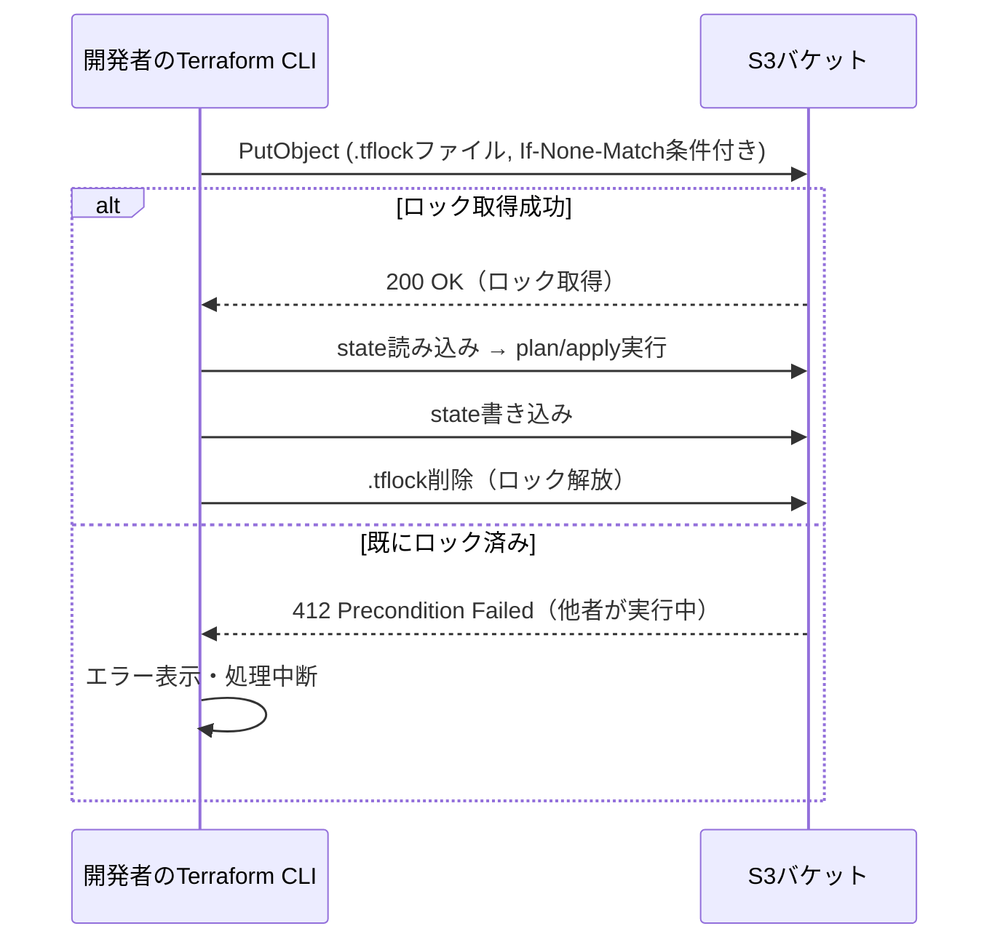

| 項目 | 旧方式（S3 + DynamoDB） | 新方式（S3ネイティブロック） |
|---|---|---|
| 必要なAWSリソース | S3バケット + DynamoDBテーブル | S3バケットのみ |
| 設定パラメータ | `dynamodb_table = "terraform-locks"` | `use_lockfile = true` |
| 対応バージョン | 全バージョン（非推奨方向） | Terraform 1.10で実験導入、1.11でGA |
| IAM権限 | S3権限 + DynamoDB権限 | S3権限のみ |
| 今後の見通し | `dynamodb_table`は非推奨、将来削除予定 | 新規プロジェクトの標準として推奨 |

**ベストプラクティス**: 新規プロジェクトは`use_lockfile = true`を採用し、既存プロジェクトも計画的に移行する。移行時はS3バケットのバージョニングを有効化しておくこと。

### 3-4. Backendの制約

- バックエンド設定自体は変数展開ができない（`backend`ブロック内でvariableは使えない）
- バックエンドの切り替えには`terraform init -migrate-state`が必要
- ロックの取得に失敗するとチーム全体の作業がブロックされるため、CI/CDのタイムアウト設計が重要

### 3-5. State分離: WorkspacesとFile Layout

環境（dev/staging/prod）ごとにStateを分離する方法は主に2つあります。

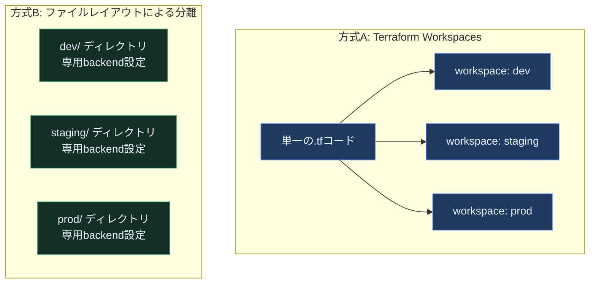

| 観点 | Workspaces | ファイルレイアウト分離 |
|---|---|---|
| コードの重複 | なし（1本のコードを使い回す） | ディレクトリごとに重複しやすい |
| 環境間の設定差分 | `terraform.workspace`変数で分岐が必要 | ディレクトリごとに完全に独立して記述可能 |
| 誤爆リスク | 「今どのworkspaceにいるか」の見落としリスクあり | ディレクトリが分かれているため誤爆しにくい |
| 原著の推奨 | 小規模・一時的な環境分離向け | 本番運用の環境分離として推奨 |

**ベストプラクティス**: 本番環境の分離にはWorkspacesよりファイルレイアウトによる分離（Gruntwork社が提唱する「live」リポジトリのパターンなど）が安全とされています。理由は、Workspacesは「今どの環境を操作しているか」がコマンドライン上で見えにくく、誤って本番を破壊するリスクがあるためです。

### 3-6. `terraform_remote_state`データソース

あるコンポーネントのStateから、別のコンポーネントが出力値を参照する仕組みです。

```hcl
data "terraform_remote_state" "vpc" {
  backend = "s3"

  config = {
    bucket = "my-company-terraform-state"
    key    = "global/vpc/terraform.tfstate"
    region = "us-east-2"
  }
}

resource "aws_instance" "example" {
  subnet_id = data.terraform_remote_state.vpc.outputs.subnet_id
}
```

**ベストプラクティス**: モジュール間の依存関係を`terraform_remote_state`で明示することで、VPCのような基盤コンポーネントと、アプリケーション固有のリソースを別々のStateに分離しつつ連携できます。

**セキュリティ上の注意**: `outputs.subnet_id`のように特定の出力値だけを参照していても、`terraform_remote_state`はバックエンド(上の例ではS3バケット)から**State全体を読み取ります**。つまり参照側にバックエンドの読み取り権限を与えることは、そのStateに含まれるすべての値（DBパスワードや秘密鍵など、リソース属性としてStateに平文で残る機密情報を含む）へのアクセスを許すことと同義です。機密情報を含むStateを他チームと共有する場合は、必要な値だけを渡す限定的な手段を検討します。

- HCP Terraform/Enterpriseでは`tfe_outputs`データソースを使い、State全体ではなくワークスペースの出力値だけを共有する
- 出力値をSSM Parameter StoreやSecrets Managerへ書き出し、参照側にはそのパラメータのみ読み取り権限を与える
- そもそもStateに機密情報を残さないよう、write-only引数（第6部参照）やエフェメラルリソースを使う

---

## 第4部（原著第4章対応）: 再利用可能なインフラをモジュールで作る

### 4-1. モジュールの基本

モジュールとは、`.tf`ファイル群をまとめたディレクトリのことです。ルートモジュール（実行の起点）から子モジュールを`module`ブロックで呼び出します。

```hcl
module "webserver_cluster" {
  source = "../../modules/services/webserver-cluster"

  cluster_name  = "webservers-stage"
  instance_type = "t2.micro"
  min_size      = 2
  max_size      = 2
}
```

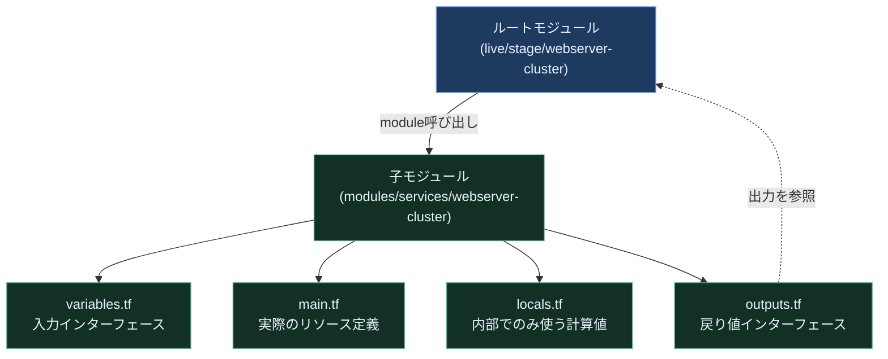

### 4-2. モジュール入力変数（Module Inputs）

呼び出し元から値を注入するためのインターフェースです。`default`を持たない変数は必須パラメータになります。

```hcl
variable "cluster_name" {
  description = "The name to use for all the cluster resources"
  type        = string
}

variable "instance_type" {
  description = "The type of EC2 Instance to run"
  type        = string
  default     = "t2.micro"

  # 空文字を弾く。この validation があって初めて、
  # 第9部の expect_failures = [var.instance_type] が検証エラーを検出できる
  validation {
    condition     = length(trimspace(var.instance_type)) > 0
    error_message = "instance_type must not be empty."
  }
}
```

### 4-3. モジュールのlocal値

繰り返し使う計算式や、外部に公開する必要のない中間値は`locals`にまとめます。

```hcl
locals {
  http_port    = 80
  any_port     = 0
  any_protocol = "-1"
  all_ips      = ["0.0.0.0/0"]
}
```

### 4-4. モジュール出力値（Module Outputs）

呼び出し元やCLIから参照できる戻り値です。

```hcl
output "asg_name" {
  value       = aws_autoscaling_group.example.name
  description = "The name of the Auto Scaling Group"
}

output "alb_dns_name" {
  value       = aws_lb.example.dns_name
  description = "The domain name of the load balancer"
}
```

### 4-5. モジュールの落とし穴

| 落とし穴 | 内容 | 対処 |
|---|---|---|
| ファイルパス | `user_data`等でモジュール内の相対ファイルを読む際、実行時のカレントディレクトリ基準になってしまう | `path.module`を使い、常にモジュール自身のディレクトリからの相対パスにする |
| インラインブロック | `ingress {}`のようなインラインブロックは、呼び出し元から動的に個数を増減できない | 可能な限り`aws_security_group_rule`等の別リソースに分離し、`for_each`で動的生成する |
| ハードコードされたリージョン/プロバイダー | モジュール内で`provider "aws" { region = ... }`を固定すると再利用性が落ちる | プロバイダー設定は呼び出し元（ルートモジュール）に任せる |

```hcl
# path.moduleの利用例（落とし穴の対処）
resource "aws_instance" "example" {
  user_data = file("${path.module}/user-data.sh")
}
```

### 4-6. モジュールバージョニング

Gitリポジトリやレジストリの参照時に`ref`やバージョン制約を明示し、意図しない破壊的変更の巻き込みを防ぎます。

```hcl
module "webserver_cluster" {
  source  = "github.com/foo/modules//services/webserver-cluster?ref=v0.1.4"

  cluster_name  = "webservers-stage"
  instance_type = "t2.micro"
}

# Terraformレジストリ経由の場合
module "vpc" {
  source  = "terraform-aws-modules/vpc/aws"
  version = "~> 5.0"
}
```

**ベストプラクティス**
- `ref`にブランチ名（`main`等）を指定しない。必ずタグ／コミットハッシュで固定する
- セマンティックバージョニング（`~> 5.0`のような制約演算子）で、意図しないメジャーアップデートの巻き込みを防ぐ

---

## 第5部（原著第5章対応）: ループ・条件分岐・デプロイ・落とし穴

### 5-1〜5-4. ループの4パターン

Terraformには目的の異なる4種類のループ構文があります。使い分けを誤ると保守性が大きく下がるため、表で整理します。

| 構文 | 対象 | 特徴 | 典型的な用途 |
|---|---|---|---|
| `count` | リソース／モジュール全体 | インデックス番号(`count.index`)で複製 | 単純に同じものをN個作る |
| `for_each`（マップ/セット） | リソース／モジュール全体 | 各要素にキー文字列が付き、途中の要素削除に強い | 名前付きの複数リソースを作る |
| `for`式 | リスト・マップの変換 | 値の変換・フィルタリングのみ、リソースは複製しない | 変数の加工、出力値の整形 |
| `for`文字列ディレクティブ | テンプレート文字列内 | 文字列の中でループを展開 | `user_data`スクリプト等の動的生成 |

```hcl
# 以下の例が参照する入力変数。宣言がないと undeclared variable エラーになる
variable "names" {
  description = "for式で大文字化する名前のリスト"
  type        = list(string)
  default     = ["neo", "trinity", "morpheus"]
}

variable "users" {
  description = "バケットポリシーへ展開するユーザー名のリスト"
  type        = list(string)
  default     = ["neo", "trinity"]
}

# count: 単純な複製（ただしリスト順序に依存し途中削除に弱い）
resource "aws_iam_user" "example" {
  count = 3
  name  = "neo.${count.index}"
}

# for_each: キーに基づく複製（推奨）。順序に依存しないため安全に増減できる
resource "aws_iam_user" "example2" {
  for_each = toset(["neo", "trinity", "morpheus"])
  name     = each.value
}

# for式: 値の変換
locals {
  upper_names = [for name in var.names : upper(name)]
}

# for文字列ディレクティブ: テンプレート内でのループ
locals {
  bucket_policy = <<-EOF
  %{ for user in var.users ~}
  Allow access for ${user}
  %{ endfor ~}
  EOF
}
```

**ベストプラクティス**: `count`は「同じものをN個作る」だけの単純なケースに留め、要素の識別が必要な場合は`for_each`を優先する。`for_each`はキーで管理されるため、リストの途中の要素を削除しても他のリソースが不要に再作成されません。

### 5-5. 条件分岐

Terraformには`if`文はありませんが、三項演算子と`count`/`for_each`を組み合わせて条件付きリソース作成を表現します。

```hcl
variable "enable_autoscaling" {
  description = "スケジュールベースのオートスケーリングを有効にするか"
  type        = bool
  default     = false
}

resource "aws_autoscaling_schedule" "scale_out_during_business_hours" {
  count = var.enable_autoscaling ? 1 : 0

  scheduled_action_name = "scale-out-during-business-hours"
  min_size               = 2
  max_size               = 10
  desired_capacity       = 10
  recurrence             = "0 9 * * *"
  autoscaling_group_name = aws_autoscaling_group.example.name
}
```

### 5-6. ゼロダウンタイムデプロイ

`create_before_destroy`ライフサイクルルールは、Terraformの既定の「削除してから作成」を「作成してから削除」へ**順序を入れ替える**ものです。ただしこれ**単体ではダウンタイムがなくなることは保証されません**。Terraformはリソースの作成APIが完了した時点で次のステップへ進むだけで、新しいインスタンス上でアプリケーションが実際にリクエストを処理できる状態になったかどうかは判断しないためです。ヘルスチェックを待たずに旧リソースを破棄すれば、その隙間はそのままサービス断になります。

無停止に近づけるには、`create_before_destroy`に加えて次の3点を揃える必要があります。

1. **新旧のASGを同じロードバランサー（ターゲットグループ）に接続する。** 接続していなければ、そもそもトラフィックの引き継ぎ先が存在しません。
2. **`min_elb_capacity`（ASGの新規作成時のみ待機）または`wait_for_elb_capacity`（新規作成時と更新時の両方で待機）で、指定台数がELBのヘルスチェックを通過するまでTerraformを待たせる。** この待機がないと、健全なインスタンスが揃う前に旧ASGが破棄されます。
3. **既存ASGのインスタンス入れ替えは`instance_refresh`に任せ、その完了を明示的に確認する。** `instance_refresh`は`apply`の完了後もAWS側で非同期に進むため、**`apply`が成功しても入れ替えが成功したとは限りません**。CDパイプライン側でリフレッシュのステータス（`Successful` / `Failed` / `Cancelled`）をポーリングし、失敗・中断時は直前のLaunch Templateバージョンへ戻すロールバック手順まで用意して初めて運用に耐えます。

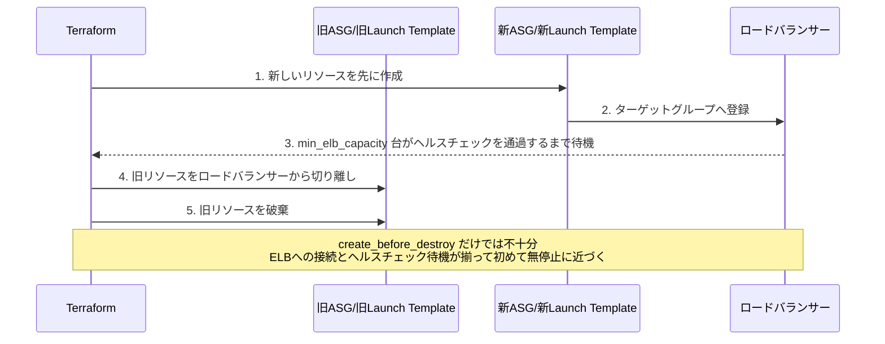

```hcl
resource "aws_launch_template" "example" {
  # ...
  lifecycle {
    create_before_destroy = true
  }
}

# ASGが参照するターゲットグループ。この宣言がないと
# aws_lb_target_group.asg は未定義参照となり terraform validate が失敗する
resource "aws_lb_target_group" "asg" {
  name = "terraform-asg-example"

  # インスタンスが待ち受け、セキュリティグループが開放しているポートと
  # 同じ変数から導出する。ここを 80 のような固定値にするとヘルスチェックが
  # 通らず、容量待機がタイムアウトして apply が失敗する
  port     = var.server_port
  protocol = "HTTP"
  vpc_id   = var.vpc_id

  health_check {
    path     = "/"
    protocol = "HTTP"
    matcher  = "200"
  }
}

variable "server_port" {
  description = "サーバーが待ち受け、ターゲットグループが転送するポート"
  type        = number
  default     = 8080
}

variable "vpc_id" {
  description = "ターゲットグループを作成するVPCのID"
  type        = string
}

variable "min_size" {
  description = "ASGの最小インスタンス数（min_elb_capacityの待機台数にも使う）"
  type        = number
  default     = 2
}

resource "aws_autoscaling_group" "example" {
  # ...

  # 1. ロードバランサー（ターゲットグループ）へ接続し、健全性の判定もELBに委ねる
  target_group_arns = [aws_lb_target_group.asg.arn]
  health_check_type = "ELB"

  # 2. 指定台数がELBのヘルスチェックを通過するまで apply を完了させない
  #    min_elb_capacity は「作成時」しか待たないため、既存ASGの更新でも待つ
  #    wait_for_elb_capacity を使う
  wait_for_elb_capacity = var.min_size

  # 3. 既存ASGのインスタンス入れ替えは instance_refresh に任せる
  #    ただし apply 完了後もAWS側で非同期に進むため、
  #    CD側で完了確認とロールバックを別途実装すること
  instance_refresh {
    strategy = "Rolling"
    preferences {
      min_healthy_percentage = 100
    }
  }

  lifecycle {
    create_before_destroy = true
  }
}
```

### 5-7. Terraformの落とし穴

| 落とし穴 | 内容 | 対処 |
|---|---|---|
| `count`/`for_each`の制約 | 値をリソースブロック内の計算結果に依存させられない場合がある（plan時に値が未確定だとエラー） | 可能な限り`variable`など、plan前に確定する値をループ対象にする |
| ゼロダウンタイムデプロイの限界 | DBのようなステートフルなリソースには単純に適用できない | Blue/Greenやマイグレーション専用の仕組みを別途設計する |
| Valid Plansが失敗することがある | `plan`が通っても、`apply`時にクラウド側の制約（クォータ等）でエラーになることがある | リトライ処理・クォータの事前申請・段階的apply |
| リファクタリングの難しさ | リソース名の変更やモジュール構造の変更は、Terraform内部では「削除→再作成」と解釈されがち | `moved`ブロック（Terraform 1.1以降）や`terraform state mv`で安全に移行する |

```hcl
# リソース名変更時の安全な移行(movedブロック)
moved {
  from = aws_instance.old_name
  to   = aws_instance.new_name
}
```

---

## 第6部（原著第6章対応）: シークレット管理

### 6-1. シークレット管理の基礎

シークレット管理を設計する際は、次の3つの問いに答える必要があります。

1. **何を保存するか**: パスワード、APIキー、証明書の秘密鍵など
2. **どこに保存するか**: 暗号化されたストレージ（Vault、Secrets Manager等）
3. **どうアクセスさせるか**: 環境変数、ファイルマウント、動的な短命クレデンシャル発行

### 6-2. 主要シークレット管理ツール比較

| ツール | 提供元 | 動的シークレット | 主な用途 |
|---|---|---|---|
| HashiCorp Vault | HashiCorp（IBM傘下） | 対応（DB/クラウド認証情報を動的発行） | マルチクラウド・オンプレ横断のシークレット管理 |
| AWS Secrets Manager | AWS | 一部対応（RDSローテーション等） | AWS中心の環境 |
| AWS SSM Parameter Store | AWS | 非対応（静的値） | 低コストな設定値・軽量シークレット |
| Azure Key Vault | Microsoft | 一部対応 | Azure中心の環境 |
| Google Secret Manager | Google | 非対応（静的値） | GCP中心の環境 |

### 6-3. Terraformでのシークレット利用パターン

Terraformの`sensitive = true`はCLI出力へのマスキングのみを行い、**State fileには平文（またはそれに近い形）でシークレットが記録されてしまう**という長年の課題がありました。

```hcl
variable "db_password" {
  description = "The password for the database"
  type        = string
  sensitive   = true
}
```

**重要な注意**: `sensitive`はあくまで表示上のマスクです。State file自体を暗号化する（リモートバックエンドの暗号化オプションを有効にする）ことと、アクセス権限をIAMで絞ることが必須のベストプラクティスです。

### 6-4.【2026年最新】Ephemeral Resources & Write-Only Argumentsによる根本解決

長年の「Stateにシークレットが残ってしまう」問題に対し、HashiCorpは**Terraform 1.10でEphemeral Resourcesを、続くTerraform 1.11でWrite-Only Argumentsを**導入しました。よく一組として扱われますが、両者は同じリリースで登場したわけではなく導入バージョンが1つずれています。いずれも原著第3版（2022年刊）の時点では存在しなかった、2026年時点における最重要のシークレット管理アップデートです。

- **Ephemeral Resources**（`ephemeral`ブロック、**Terraform 1.10以降**）: `apply`実行中のメモリ上にのみ存在し、PlanファイルにもStateファイルにも書き込まれないリソース
- **Write-Only Arguments**（`_wo`サフィックスの引数、**Terraform 1.11以降**）: プロバイダー側がサポートする場合、値を受け取って設定するが、Stateには保存しない引数

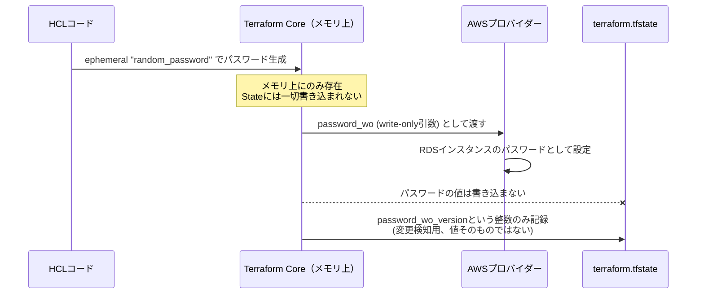

```hcl
ephemeral "random_password" "db_password" {
  length           = 16
  override_special = "!#$%&*()-_=+[]{}<>:?"
}

resource "aws_db_instance" "example" {
  identifier        = "my-db"
  engine            = "postgres"
  instance_class    = "db.t3.micro"
  allocated_storage = 20

  username = "app_user"

  password_wo         = ephemeral.random_password.db_password.result
  password_wo_version  = 1

  # 学習・検証用DBの前提。これを省くとAWSが最終スナップショット識別子を要求し、
  # terraform destroy が失敗する。本番DBでは skip_final_snapshot は false のままにし、
  # final_snapshot_identifier に有効な識別子を指定すること
  #   skip_final_snapshot       = false
  #   final_snapshot_identifier = var.final_snapshot_identifier  # 例: "my-db-final-2026-08-29"
  # timestamp() のような毎回変わる関数は差分が消えなくなるため使わない
  skip_final_snapshot = true
}
```

**生成したパスワードの受け取りとローテーション**: この構成では生成値がStateにもPlanにも残らないため、`terraform output`で後から取り出すことは**できません**。値を人やアプリが使う必要がある場合は、同じ`apply`の中でシークレットストアへ書き込み、以後はそこから読む運用にします（`aws_secretsmanager_secret_version`の`secret_string_wo`と`secret_string_wo_version`を使えば、Secrets Manager側にもStateを経由せずに書き込めます）。

ローテーション時の注意点は`password_wo_version`です。write-only引数の値そのものはStateに保存されないため、Terraformは値の変化を検知できません。**新しいパスワードを実際に適用するには、`password_wo_version`をインクリメントする**必要があります（`1` → `2`）。バージョンを据え置いたままパスワード生成側だけを変えても、プロバイダーは更新を行わず、コード上の値と実際のDBパスワードが乖離します。定期ローテーションを行う場合は、この整数をコードまたは変数として管理し、ローテーションのたびに必ず1つ上げる手順をランブック化しておきます。

| 比較項目 | 従来方式（`sensitive = true`のみ） | 2026年推奨方式（Ephemeral + Write-Only） |
|---|---|---|
| CLI出力へのマスキング | あり | あり |
| State fileへの平文保存 | される（要暗号化・厳格なアクセス制御） | されない |
| Plan fileへの保存 | される | されない |
| 対応バージョン | 全バージョン | Ephemeral Resources: Terraform 1.10以降／Write-Only Arguments: Terraform 1.11以降 |
| プロバイダー側の対応 | 不要 | Write-Only引数の実装が必要（`hashicorp/aws`は`password_wo`等で順次対応） |
| 主な利用先 | 変数、リソース属性全般 | `locals`、Ephemeral変数（`ephemeral = true`）、子モジュールのEphemeral出力、`ephemeral`ブロック、プロバイダー設定、プロビジョナーと`connection`ブロック、対応リソースのWrite-Only引数 |

**ベストプラクティス**: 2026年8月時点で新規に本番コードを書く場合、パスワードやAPIトークンのような一度きりの機微値は、プロバイダーが対応していれば積極的にEphemeral Resources + Write-Only Argumentsへ移行する。既存コードの移行は、影響範囲の大きいDB系リソースから段階的に行うのが安全です。

---

## 第7部（原著第7章対応）: 複数プロバイダーの利用

### 7-1. 単一プロバイダーでの作業とプロバイダーのインストール

プロバイダーは`required_providers`ブロックでソースとバージョンを明示します。

```hcl
terraform {
  required_providers {
    aws = {
      source  = "hashicorp/aws"
      version = "~> 6.0"
    }
  }
}
```

### 7-2. 同一プロバイダーの複数コピー（マルチリージョン・マルチアカウント）

`alias`を使うことで、1つのTerraformコード内から複数リージョン・複数AWSアカウントを扱えます。

```hcl
provider "aws" {
  region = "us-east-2"
}

provider "aws" {
  alias  = "usa_west_2"
  region = "us-west-2"
}

resource "aws_instance" "east" {
  provider = aws
  # ...
}

resource "aws_instance" "west" {
  provider = aws.usa_west_2
  # ...
}
```

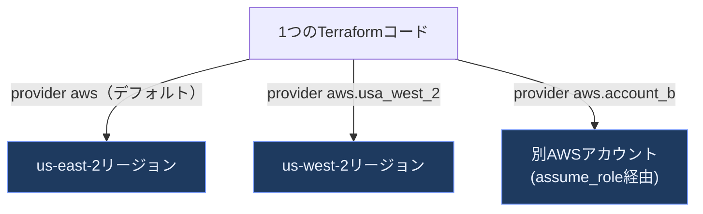

### 7-3. 複数プロバイダーに対応したモジュールの作成

モジュールを複数プロバイダーで再利用可能にするには、`configuration_aliases`でエイリアスの受け渡しを明示します。

```hcl
terraform {
  required_providers {
    aws = {
      source                = "hashicorp/aws"
      version               = "~> 6.0"
      configuration_aliases = [aws.usa_west_2]
    }
  }
}
```

### 7-4. 異なる複数プロバイダーの利用: Docker/Kubernetesクラッシュコース

TerraformはAWSのようなクラウドAPIだけでなく、DockerデーモンやKubernetes APIも「プロバイダー」として扱えます。

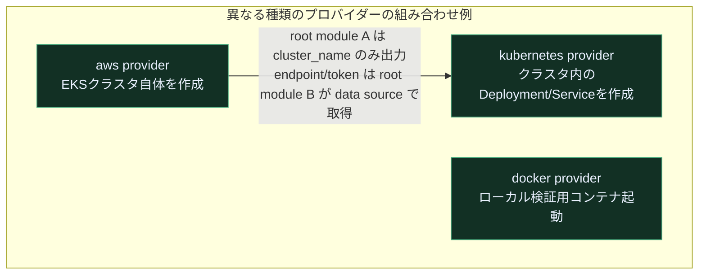

### 7-5. EKSでのDockerコンテナデプロイ

クラスタ本体とクラスタ内のリソースは、**別々のroot module（＝別State）**として構成します。まずEKSクラスタを作る側です。

```hcl
# root module A（例: live/eks-cluster）: aws プロバイダーでクラスタ本体だけを管理する

# クラスタが参照する前提を同じroot module内で宣言しておく
variable "subnet_ids" {
  description = "EKSコントロールプレーンを配置するサブネットID（最低2つ、別AZ）"
  type        = list(string)
}

data "aws_iam_policy_document" "cluster_assume_role" {
  statement {
    effect  = "Allow"
    actions = ["sts:AssumeRole"]

    principals {
      type        = "Service"
      identifiers = ["eks.amazonaws.com"]
    }
  }
}

resource "aws_iam_role" "cluster" {
  name               = "example-cluster-role"
  assume_role_policy = data.aws_iam_policy_document.cluster_assume_role.json
}

resource "aws_iam_role_policy_attachment" "cluster" {
  role       = aws_iam_role.cluster.name
  policy_arn = "arn:aws:iam::aws:policy/AmazonEKSClusterPolicy"
}

resource "aws_eks_cluster" "cluster" {
  name     = "example-cluster"
  role_arn = aws_iam_role.cluster.arn

  vpc_config {
    subnet_ids = var.subnet_ids
  }

  # ロール権限が付与される前にクラスタ作成が走らないようにする
  depends_on = [aws_iam_role_policy_attachment.cluster]
}

output "cluster_name" {
  value       = aws_eks_cluster.cluster.name
  description = "Kubernetesリソース側のroot moduleへ渡すクラスタ名"
}
```

次に、そのクラスタ内でKubernetesリソースを管理する側です。クラスタは自分では作らず、**data sourceで既存クラスタを参照**して`provider "kubernetes"`を構成します。

```hcl
# root module B（例: live/eks-workloads）: kubernetes プロバイダーでクラスタ内リソースを管理する
variable "cluster_name" {
  description = "root module A の cluster_name 出力（terraform_remote_state 等で受け取る）"
  type        = string
}

data "aws_eks_cluster" "cluster" {
  name = var.cluster_name
}

# provider ブロックが参照する認証トークンの供給元
data "aws_eks_cluster_auth" "cluster" {
  name = var.cluster_name
}

provider "kubernetes" {
  host                   = data.aws_eks_cluster.cluster.endpoint
  cluster_ca_certificate = base64decode(data.aws_eks_cluster.cluster.certificate_authority[0].data)
  token                  = data.aws_eks_cluster_auth.cluster.token
}

resource "kubernetes_deployment" "example" {
  metadata {
    name = "example-app"
  }

  spec {
    replicas = 3
    # selector と template は紙面の都合で省略している（どちらも必須ブロック）
  }
}
```

> このスニペットは要点のみを抜き出した**断片**です。そのまま`apply`できる形にするには、`terraform`ブロックの`required_providers`で`hashicorp/aws`と`hashicorp/kubernetes`を宣言し、`kubernetes_deployment`の`spec`に必須の`selector`と`template`を補う必要があります。

**ベストプラクティス**: EKSクラスタ本体（`aws`プロバイダー管轄）と、その中で動くKubernetesリソース（`kubernetes`プロバイダー管轄）は、必ずroot module／Stateを分離します。同一のapplyでクラスタを作りながら、そのクラスタの`endpoint`や`token`で`provider "kubernetes"`を構成すると、プロバイダー設定が「まだ存在しないリソースの属性」に依存することになり、初回`apply`や`plan`が失敗したり、クラスタの再作成時にプロバイダーの初期化ごと壊れてStateを手当てできなくなったりします。分離しておけば、クラスタ側の変更（バージョンアップ、ノードグループ変更）とアプリ側の変更（Deploymentの更新）を独立した変更頻度・責任分界点で回せます。

---

## 第8部（原著第8章対応）: 本番グレードのTerraformコード

### 8-1. なぜ本番グレードのインフラ構築は時間がかかるのか

「動くだけのTerraformコード」と「本番運用に耐えるTerraformコード」の間には大きなギャップがあります。原著はこのギャップを埋める要素を「本番グレードインフラのチェックリスト」として整理しています。

### 8-2. 本番グレードインフラのチェックリスト

| カテゴリ | 具体項目 |
|---|---|
| インストール | バージョン管理、依存関係管理、OS起動時の自動起動設定 |
| 設定 | 環境ごとの設定値管理、シークレット管理（第6部参照） |
| ビルド | パッケージング、コンテナ化、Immutableなアーティファクト管理 |
| デプロイ | ゼロダウンタイムデプロイ、ロールバック手順 |
| 高可用性 | 複数AZ/複数リージョン、Auto Scaling、フェイルオーバー |
| スケーラビリティ | 水平/垂直スケーリング、負荷分散 |
| パフォーマンス | キャッシュ、CDN、コネクションプーリング |
| 監視 | メトリクス、ログ集約、アラート、ダッシュボード |
| セキュリティ | 最小権限、暗号化（転送時/保管時）、ネットワーク分離 |
| コスト最適化 | 適切なインスタンスサイズ、スポットインスタンス活用、未使用リソースの削除 |

### 8-3. 本番グレードモジュールの4原則

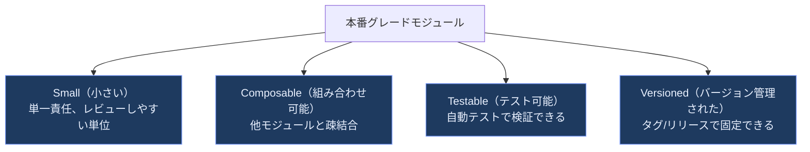

| 原則 | 悪い例 | 良い例 |
|---|---|---|
| Small | 1つのモジュールにVPC・ASG・RDS・IAMをすべて詰め込む | VPCモジュール、ASGモジュール、RDSモジュールに分割 |
| Composable | モジュール内部でハードコードされたリソース名に依存 | 入力変数と出力値だけで疎結合に連携 |
| Testable | 手動でのAWSコンソール確認に依存 | `terraform test`やTerratestで自動検証可能 |
| Versioned | `source`にブランチ名やパスをそのまま指定 | タグ・コミットハッシュでバージョン固定 |

### 8-4. Terraformを超えて

本番運用では、Terraformだけで完結せず、CI/CDパイプライン、監視ツール（Datadog等）、Policy as Codeツール（第11部参照）との組み合わせが前提になります。

---

## 第9部（原著第9章対応）: Terraformコードのテスト手法

### 9-1. 手動テスト

`terraform apply`で実際にデプロイし、curlやブラウザで動作確認、`terraform destroy`で片付ける、という最も基本的な検証方法です。手動テストは重要ですが、繰り返し実行するコストが高く、実施漏れが起きやすいという弱点があります。

### 9-2. 自動テストの3階層

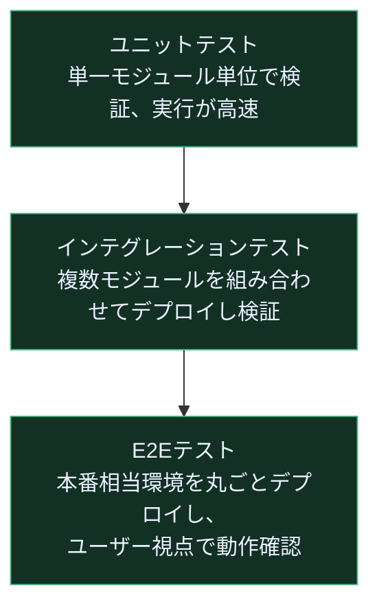

| 階層 | 実行速度 | カバー範囲 | 実行頻度の目安 |
|---|---|---|---|
| ユニットテスト | 速い（秒〜分） | 単一モジュールのロジック | 全PRで実行 |
| インテグレーションテスト | 中程度（分） | モジュール間の連携 | 全PRまたはマージ時 |
| E2Eテスト | 遅い（分〜時間） | 本番相当環境全体 | 定期実行・リリース前 |

### 9-3.【2026年最新】`terraform test`ネイティブテストフレームワーク

原著刊行時点（2022年）ではTerraform公式のテストフレームワークは存在せず、Go言語製のTerratest（Gruntwork社製）が事実上の標準でした。しかし**Terraform 1.6でネイティブの`terraform test`コマンドがGAとなり、Terraform 1.7で`mock_provider`によるモック機能が追加**されたことで、HCLだけで書ける公式テストの選択肢が確立しました。2026年時点では「ロジック検証はネイティブ`terraform test`＋モック、実クラウド確認が必要な深いテストはTerratest」という併用が一般的なベストプラクティスです。

`tests/webserver_cluster.tftest.hcl`の例:

```hcl
mock_provider "aws" {}

run "validate_cluster_size" {
  command = plan

  variables {
    cluster_name  = "test-cluster"
    instance_type = "t2.micro"
    min_size      = 2
    max_size      = 2
  }

  assert {
    condition     = aws_autoscaling_group.example.min_size == 2
    error_message = "ASGのmin_sizeが期待値と一致しません"
  }
}

run "reject_invalid_instance_type" {
  command = plan

  variables {
    # instance_type の validation 失敗だけをテストしたいので、
    # 必須変数である cluster_name には有効な値を与えておく
    # （未指定だと「変数未設定」で先に失敗し、意図したテストにならない）
    cluster_name  = "test-cluster"
    instance_type = ""
  }

  expect_failures = [var.instance_type]
}
```

`expect_failures`は「そのオブジェクトの検証が失敗すること」を期待するテストです。したがって`var.instance_type`を指定する場合、**変数側に`validation`ブロックが定義されていることが前提**になります。上の`reject_invalid_instance_type`が意図どおり動くのは、第4部で`instance_type`に空文字を拒否する`validation`を書いてあるからです。`validation`のない変数に`expect_failures`を指定すると、失敗が発生せずテスト自体が失敗します。

```bash
terraform test
```

### 9-4. `mock_provider`による高速ユニットテスト

`mock_provider`を使うと、実際のクラウド認証情報なしに、計算属性（ARN、IDなど）をTerraformが自動生成してテストを走らせられます。

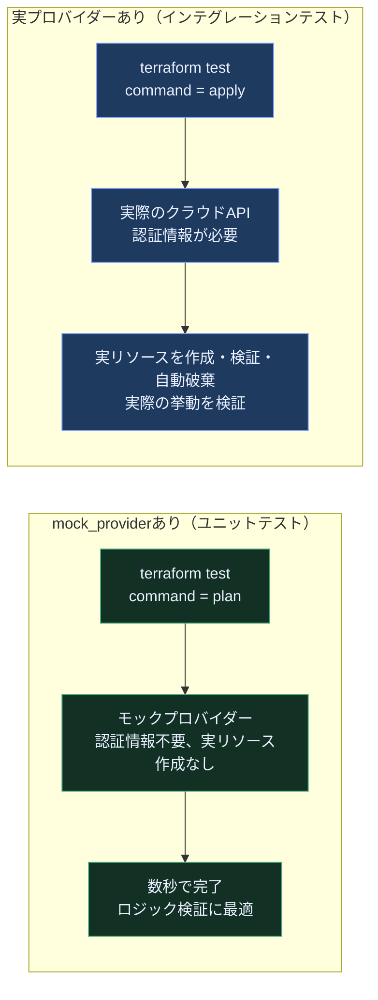

**ベストプラクティス**: `mock_provider`によるplanベースのユニットテストをCIの最初のゲートとして高速に回し、実プロバイダーを使うapplyベースのインテグレーションテストは頻度を抑えて（例: マージ時のみ）実行する構成が、速度とコストのバランスに優れています。

### 9-5. Terratest等その他のアプローチ

Go言語でTerraformコードをデプロイし、HTTPリクエストやAWS SDK呼び出しで検証後に自動破棄する手法です。`terraform test`では表現しづらい複雑な検証ロジック（外部APIとの結合確認等）に向いています。

```go
package test

import (
    "testing"
    "github.com/gruntwork-io/terratest/modules/terraform"
)

func TestWebServerCluster(t *testing.T) {
    terraformOptions := &terraform.Options{
        TerraformDir: "../examples/webserver-cluster",
    }

    defer terraform.Destroy(t, terraformOptions)
    terraform.InitAndApply(t, terraformOptions)
    // HTTPリクエストなどで検証
}
```

---

## 第10部（原著第10章対応）: チームでTerraformを使う

### 10-1. チームへのIaC導入

原著が強調するのは、技術的な正しさだけでなく「組織的にどう導入するか」です。

- 上司・意思決定者に投資対効果（デプロイ速度、障害復旧時間の改善）を説明する
- 一度にすべてを移行せず、新規プロジェクトや影響範囲の小さい部分から段階的に導入する
- チームに学習時間を確保する（Terraformの学習コストをスケジュールに織り込む）

### 10-2〜10-3. アプリケーションコードとインフラコードのデプロイワークフロー

原著は「アプリケーションコードのデプロイ」と「インフラコードのデプロイ」を並べて比較し、共通のワークフロー原則を示しています。

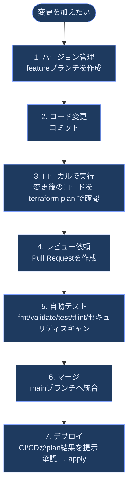

| 観点 | アプリケーションコード | インフラコード |
|---|---|---|
| デプロイ単位 | ビルド済みアーティファクト（バイナリ/コンテナ） | `terraform apply`によるクラウドAPI呼び出し |
| ロールバック | 旧アーティファクトへの切り戻し | 直前のコードへの`revert` + 再`apply`（データを伴う変更は要注意） |
| 承認プロセス | コードレビュー + CIパス | コードレビュー + `plan`結果の目視確認 |
| 特有のリスク | ロジックバグ | 削除を伴う変更による本番データ/リソースの喪失 |

### 10-4. まとめて考える

- インフラコードもアプリケーションコードと同じ厳密さでバージョン管理・レビュー・テストする
- `terraform plan`の出力を「デプロイ前の最終確認ポイント」としてワークフローに組み込む
- CI/CD上での`apply`実行権限は最小限のロール・環境に限定する

---

## 第11部（独自追加）: 2026年8月時点のTerraformエコシステム最新動向

原著第3版は2022年9月刊行のため、その後の約4年間でTerraformを取り巻く状況は大きく変化しました。本部は2026年8月27日時点でのWeb検索結果に基づき、実務上インパクトの大きい変化を整理します。

### 11-1. ライセンス変更とOpenTofuフォークの経緯

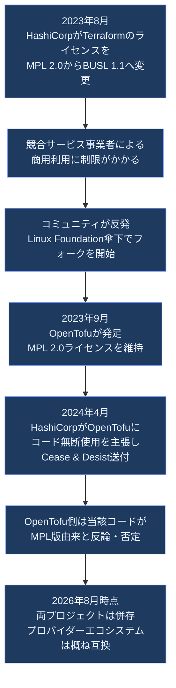

### 11-2. IBMによるHashiCorp買収（2025年2月完了）

2024年4月に発表されたIBMによるHashiCorp買収（約64億ドル、1株35ドルの現金買収）は、英国競争市場庁（CMA）と米国連邦取引委員会（FTC）の承認を経て**2025年2月27日に完了**しました。TerraformはRed Hat Ansibleと、VaultはOpenShift/Guardiumと統合される方針が示されています。

### 11-3. Terraform vs OpenTofu 現状比較表（2026年8月時点）

| 項目 | Terraform | OpenTofu |
|---|---|---|
| 運営元 | HashiCorp（IBM傘下） | Linux Foundation |
| ライセンス | BUSL 1.1（ソースアベイラブル） | MPL 2.0（オープンソース） |
| 最新安定版 | 1.16.x系（1.16.0、2026年8月リリース） | 1.12.x系（1.12.6、2026年8月リリース） |
| 商用マネージドSaaS | HCP Terraform（旧Terraform Cloud） | Scalr、Spacelift等サードパーティ |
| Policy as Code | Sentinel（HCP Terraform/Enterprise専用）+ OPA | OPA中心 |
| State保存時暗号化（バックエンド側） | S3 backendの`encrypt = true`、GCS/Azureのサーバーサイド暗号化など | 同左（Terraform互換のバックエンド機能をそのまま利用） |
| ネイティブなState/Plan暗号化（クライアント側） | OSS単体では非対応（HCP Terraform経由で保管時暗号化を利用） | OSS単体でネイティブ対応（1.7以降のState Encryption。差別化ポイント） |
| AI/MCP統合 | HCP Terraform MCPサーバーでレジストリ検索・ワークスペース操作に対応 | コミュニティベースのツールが中心 |
| プロバイダー互換性 | ― | Terraformプロバイダーの多くがそのまま利用可能 |

**実務上の判断軸**: HCP Terraformの高度な機能（Stacks、Sentinel、AI統合）を積極活用したい組織はTerraformを、ライセンスの自由度やベンダーロックイン回避を重視する組織はOpenTofuを選ぶ、という「二刀流」戦略を取る企業も増えています。

### 11-4. HCP Terraform: Stacks・料金体系・AI統合

- **Terraform Stacks**: 複数のインフラコンポーネント（VPC、DB、アプリ基盤など）をライフサイクルの異なる単位としてまとめて管理する機能。2025年のHashiConfでGA。関連機能はそれぞれ状況が異なり、**リンクドStacks**（Stacks間の依存関係の自動連携）は2025年2月25日にPublic Betaとして発表された段階、**モノレポのネイティブサポート**は2025年12月にGAとなっている
- **無料枠の変更**: 従来のHCP Terraform無料プランは2026年3月31日に終了し、現在は「管理対象リソース500個まで」という新しい無料枠に移行。有償プランは概ね管理対象リソース1つあたり月額0.10ドル程度から
- **AI/MCP統合**: HCP Terraform MCPサーバーにより、AIエージェントやIDEから自然言語でレジストリ検索・ワークスペース操作・コスト影響の問い合わせが可能になっている（2025〜2026年のロードマップの中心テーマ）

### 11-5. Policy as Code: Sentinel vs OPA vs スキャナー系ツール比較

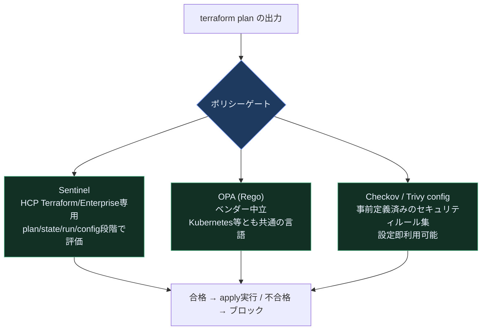

| ツール | 分類 | ロックイン | 得意分野 |
|---|---|---|---|
| Sentinel | 統合型プロプライエタリゲート | HCP Terraform/Enterprise専用 | run全体（plan/state/config）との緊密な統合 |
| OPA（Rego） | 汎用ポリシーエンジン | なし（Kubernetes等でも同一言語） | 組織独自のガバナンスルールの一元管理 |
| Checkov / Trivy config | 静的セキュリティスキャナー | なし | 既知の誤設定（公開バケット等）の即時検出。tfsecはレガシー扱いでTrivyのconfigスキャンへ統合・移行が進んでいるため、新規導入はTrivyを選ぶ |

**ベストプラクティス**: 単一ツールに頼らず、「スキャナーで既知の穴を塞ぐ」＋「OPA/Sentinelで組織固有のガバナンスを強制する」の2層構成が2026年時点の成熟した構成として紹介されています。ネイティブHCLの`precondition`/`postcondition`/`check`ブロックだけでも、変数の値域や参照先リソースの属性など「宣言内で表現できる前提条件」は`plan`/`apply`の時点で弾けるため、まずはHCL標準機能から始めるのも有効です。

---

## 学習ロードマップ・チェックリスト

### 初学者向け学習ステップ

```mermaid
flowchart LR
    S1["Step1<br/>HCL基礎構文<br/>(provider/resource/variable/output)"] --> S2["Step2<br/>単一リソースのplan/apply/destroy"]
    S2 --> S3["Step3<br/>State管理とリモートバックエンド"]
    S3 --> S4["Step4<br/>モジュール化と再利用"]
    S4 --> S5["Step5<br/>ループ・条件分岐・ゼロダウンタイムデプロイ"]
    S5 --> S6["Step6<br/>シークレット管理<br/>(Ephemeral Resources含む)"]
    S6 --> S7["Step7<br/>テスト自動化<br/>(terraform test / mock_provider)"]
    S7 --> S8["Step8<br/>CI/CD統合とチーム運用"]
    S8 --> S9["Step9<br/>Policy as Code / 本番グレード化"]

    classDef step fill:#1e3a5f,stroke:#7c9eff,color:#eaf1ff
    class S1,S2,S3,S4,S5,S6,S7,S8,S9 step
```

### 学習・導入チェックリスト

- [ ] `terraform version`で意図したバージョンが使われているか確認した
- [ ] Stateをローカルではなくリモートバックエンド（S3等）に置き、`use_lockfile = true`でロックを有効化した
- [ ] すべての`variable`/`output`に`description`と`type`を明記した
- [ ] モジュールの`source`をタグ・コミットハッシュで固定し、ブランチ名を直接参照していない
- [ ] シークレットは`sensitive = true`任せにせず、可能な範囲でEphemeral Resources/Write-Only Argumentsへの移行を検討した
- [ ] CIで`terraform fmt -check`・`terraform validate`・`terraform test`を実行している
- [ ] `terraform plan`の出力を人がレビューしてから`apply`する運用になっている
- [ ] 本番の重要リソースに`prevent_destroy`を設定した
- [ ] OPA/Sentinel/Checkov等、最低1つのPolicy as Codeレイヤーを導入した

### 資格取得を目指す場合の補足

HashiCorp Certified: Terraform Associateは2026年1月8日に旧003版から**004版**へ刷新され、Terraform 1.12時点の機能（安全なライフサイクル戦略、カスタム条件、HCP Terraformプロジェクト等）に対応した出題内容になっています。本ガイドの第2〜5部・第9部の内容は、同資格の主要出題範囲（Terraformの基本概念、ワークフロー、State、モジュール、HCP Terraform）と重なっています。

---

## 付録A: 推奨リソース（原著付録A「Recommended Reading」準拠の構成）

原著の付録Aは「Books」「Blogs」「Talks」「Newsletters」「Online Forums」の5カテゴリで関連リソースを紹介する構成になっています。本ガイドでも同じカテゴリ構成で、2026年8月時点でも参照価値の高いソースを整理します。

### Books（関連書籍）

- *Terraform: Up and Running, 3rd Edition* ― Yevgeniy Brikman著（本ガイドの原著）
- *Fundamentals of DevOps and Software Delivery* ― Yevgeniy Brikman著（DevOps全般の考え方を体系的に学べる姉妹書）

### Blogs（ブログ）

- Gruntwork Blog（著者Yevgeniy Brikman本人が現在も更新するTerraform/OpenTofu/Terragrunt関連の一次情報源）
- HashiCorp公式ブログ（新機能・破壊的変更のリリースノートの一次情報源）

### Talks（カンファレンス動画）

- HashiConf（HashiCorp主催の年次カンファレンス。Terraform Stacks等の大型発表が行われる場）

### Newsletters（ニュースレター）

- Gruntwork Newsletter（DevOps/IaCの実務トピックを定期配信）

### Online Forums（オンラインフォーラム）

- HashiCorp Discuss（公式コミュニティフォーラム）
- GitHub Issues（`hashicorp/terraform`および`opentofu/opentofu`リポジトリ、バグ報告・仕様議論の一次情報）

---

## 参考文献

本ガイドの2026年最新動向部分は、以下のWeb検索結果（2026年8月27日時点で確認）に基づいています。著名な国際的開発者・HashiCorp公式・O'Reilly公式の一次情報を優先して参照しています。

### 書籍・著者情報

1. Terraform: Up and Running, 3rd Edition（O'Reilly公式ページ、目次） ― https://www.oreilly.com/library/view/terraform-up-and/9781098116736/
2. Yevgeniy Brikman ホームページ（Gruntwork共同創業者、本書著者） ― https://www.ybrikman.com/
3. Gruntwork Blog「A Comprehensive Guide to Terraform」（著者本人による原型ブログシリーズ） ― https://www.gruntwork.io/blog/a-comprehensive-guide-to-terraform
4. Gruntwork Blog「Terraform: Up & Running」刊行告知 ― https://blog.gruntwork.io/terraform-up-running-5869b53edcde
5. Gruntwork Blog トップページ（継続更新中） ― https://www.gruntwork.io/blog

### バージョン・ライセンス・組織動向

6. Hashicorp Terraform | endoflife.date（バージョン・サポート期限一覧） ― https://endoflife.date/terraform
7. Releases · hashicorp/terraform（GitHub公式リリースノート） ― https://github.com/hashicorp/terraform/releases
8. Terraform (software) | Wikipedia（ライセンス・沿革） ― https://en.wikipedia.org/wiki/Terraform_(software)
9. OpenTofu | Wikipedia（フォークの経緯） ― https://en.wikipedia.org/wiki/OpenTofu
10. IBM closes $6.4B HashiCorp acquisition | TechCrunch ― https://techcrunch.com/2025/02/27/ibm-closes-6-4b-hashicorp-acquisition/
11. IBM completes HashiCorp acquisition after gaining regulatory approval | IT Pro ― https://www.itpro.com/business/acquisition/ibm-hashicorp-acquisition-complete
12. HashiCorp Terraform OpenTofu and the IBM Acquisition Wild Card for Infrastructure as Code | SoftwareSeni ― https://www.softwareseni.com/hashicorp-terraform-opentofu-and-the-ibm-acquisition-wild-card-for-infrastructure-as-code/
13. OpenTofu vs Terraform in 2026: Is the Fork Finally Worth It? | DEV Community ― https://dev.to/mechcloud_academy/opentofu-vs-terraform-in-2026-is-the-fork-finally-worth-it-3nd1

### State管理・S3ネイティブロック

14. Terraform State Locking Without DynamoDB: S3 Native Locking Explained | DEV Community ― https://dev.to/aws-builders/terraform-state-locking-without-dynamodb-s3-native-locking-explained-448l
15. Terraform S3 State Locking Without DynamoDB (2026) | Nerd Level Tech ― https://nerdleveltech.com/terraform-s3-native-state-locking-tutorial

### シークレット管理（Ephemeral Resources / Write-Only Arguments）

16. Use temporary write-only arguments | Terraform | HashiCorp Developer（公式ドキュメント） ― https://developer.hashicorp.com/terraform/language/manage-sensitive-data/write-only
17. Ephemeral values in resources | Terraform | HashiCorp Developer（公式ドキュメント） ― https://developer.hashicorp.com/terraform/language/manage-sensitive-data/ephemeral
18. Ephemeral values in Terraform | HashiCorp公式ブログ ― https://www.hashicorp.com/en/blog/ephemeral-values-in-terraform
19. Adopting Terraform Ephemeral Resources | DEV Community ― https://dev.to/drewmullen/adopting-terraform-ephemeral-resources-1b67
20. Terraform Ephemeral Resources Explained: Temporary Values ― https://www.terraformpilot.com/articles/terraform-ephemeral-resources-explained/

### テスト（terraform test / mock_provider）

21. Tests - Provider Mocking | Terraform | HashiCorp Developer（公式ドキュメント） ― https://developer.hashicorp.com/terraform/language/tests/mocking
22. Terraform 1.7 adds test mocking and config-driven remove | HashiCorp公式ブログ ― https://www.hashicorp.com/en/blog/terraform-1-7-adds-test-mocking-and-config-driven-remove
23. terraform test: The Built-in Terraform Module Testing Framework, No Go Required ― https://recca0120.github.io/en/2026/03/15/terraform-test/
24. How to Use Mock Providers in Terraform Tests | OneUptime ― https://oneuptime.com/blog/post/2026-02-23-how-to-use-mock-providers-in-terraform-tests/view

### Policy as Code・HCP Terraform最新動向

25. Enforce policy as code | HashiCorp Terraform（公式） ― https://www.hashicorp.com/en/products/terraform/use-cases/enforce-policy-as-code
26. Manage policies and policy sets in Terraform Enterprise | HashiCorp Developer（公式） ― https://developer.hashicorp.com/terraform/enterprise/workspaces/policy-enforcement/manage-policy-sets
27. OPA vs Sentinel vs Scalr: Policy as Code for Terraform | Scalr ― https://scalr.com/learning-center/enforcing-policy-as-code-in-terraform-a-comprehensive-guide
28. Terraform Policy as Code (2026): OPA/Conftest vs Sentinel vs Checkov | Coding Protocols ― https://codingprotocols.com/blog/terraform-policy-as-code-opa-sentinel-checkov
29. HCP Terraform Free Tier in 2026: What Survived the EOL | Scalr ― https://scalr.com/learning-center/hcp-terraform-free-tier-is-being-discontinued-what-you-need-to-know
30. Terraform Stacks, explained | HashiCorp公式ブログ ― https://www.hashicorp.com/en/blog/terraform-stacks-explained
31. Terraform introduces workspaces and Stacks restore, and more | HashiCorp公式ブログ ― https://www.hashicorp.com/en/blog/terraform-introduces-workspaces-and-stacks-restore-and-more

### 認定資格

32. HashiCorp Certified: Terraform Associate (004) – The Ultimate 2026 Exam Guide | FlashGenius ― https://flashgenius.net/blog-article/hashicorp-certified-terraform-associate-004-the-ultimate-2026-exam-guide
33. How to Pass HashiCorp Terraform Associate (004) in 2026: Complete Study Guide | CertLand Blog ― https://certland.net/blog/hashicorp-terraform-associate-004-study-guide-2026/
