# The DevOps Handbook 完全ガイド — 初学者のためのステップバイステップ実践book

> 対象書籍: *The DevOps Handbook, 2nd Edition*（Gene Kim, Jez Humble, Patrick Debois, John Willis, Nicole Forsgren 著／IT Revolution Press／2021年11月刊・528ページ）
> 参照: [O'Reilly掲載ページ](https://www.oreilly.com/library/view/the-devops-handbook/9781098182281/)

本ガイドは、DevOpsの「バイブル」とも呼ばれる『The DevOps Handbook』第2版の全23章・6パート構成を初学者向けに噛み砕き、各章のエッセンスをステップバイステップのベストプラクティスとして整理したものです。2026年8月時点の最新動向（DORA 2025レポート、プラットフォームエンジニアリングの潮流）も併せて解説します。

---

## 目次

1. [本書の位置づけと全体像](#1-本書の位置づけと全体像)
2. [第1部: 3つの道（The Three Ways）— DevOpsの原理原則](#2-第1部-3つの道the-three-ways-devopsの原理原則)
3. [第2部: どこから始めるか](#3-第2部-どこから始めるか)
4. [第3部: 第一の道の技術的実践 — フロー](#4-第3部-第一の道の技術的実践--フロー)
5. [第4部: 第二の道の技術的実践 — フィードバック](#5-第4部-第二の道の技術的実践--フィードバック)
6. [第5部: 第三の道の技術的実践 — 継続的学習と実験](#6-第5部-第三の道の技術的実践--継続的学習と実験)
7. [第6部: 情報セキュリティ・変更管理・コンプライアンスの統合](#7-第6部-情報セキュリティ変更管理コンプライアンスの統合)
8. [2026年の視点: AI時代のDORAとプラットフォームエンジニアリング](#8-2026年の視点-ai時代のdoraとプラットフォームエンジニアリング)
9. [初学者向け8ステップ導入ロードマップ](#9-初学者向け8ステップ導入ロードマップ)
10. [よくあるアンチパターン](#10-よくあるアンチパターン)
11. [実践チェックリスト](#11-実践チェックリスト)
12. [用語集](#12-用語集)
13. [参考文献](#13-参考文献)

---

## 1. 本書の位置づけと全体像

### 1.1 なぜこの本を読むべきか

『The DevOps Handbook』は、小説形式でDevOpsの物語を描いた前作『The Phoenix Project』の実践編にあたります。前作が「なぜDevOpsが必要か」を物語で伝えたのに対し、本書は「具体的にどうやるか」を体系立てて解説する、いわば実務家のための**リファレンスマニュアル**です。

第2版（2021年）では、初版（2016年）から100ページ以上が新規追加され、adidas・American Airlines・Fannie Mae・Target・米空軍など15本の新しいケーススタディと、共著者に加わった Nicole Forsgren 博士（*Accelerate* の共著者であり、DORA調査の生みの親）による最新の研究データが盛り込まれています。

### 1.2 初版と第2版の違い

| 項目 | 初版（2016年） | 第2版（2021年） |
|---|---|---|
| 著者 | Gene Kim, Jez Humble, Patrick Debois, John Willis | 上記4名 + Nicole Forsgren（新規） |
| ページ数 | 約480ページ | 528ページ |
| ケーススタディ | 既存事例中心 | 15本の新規ケーススタディを追加（adidas, American Airlines, Fannie Mae, Target, 米空軍など） |
| 研究的裏付け | 実務者の経験知が中心 | *Accelerate*研究・DORA調査の統計的知見を統合 |
| 想定読者 | IT部門のDevOps実践者 | IT部門に留まらず、事業部門全体を巻き込む変革の手引き |

### 1.3 全体構成（6パート・23章）

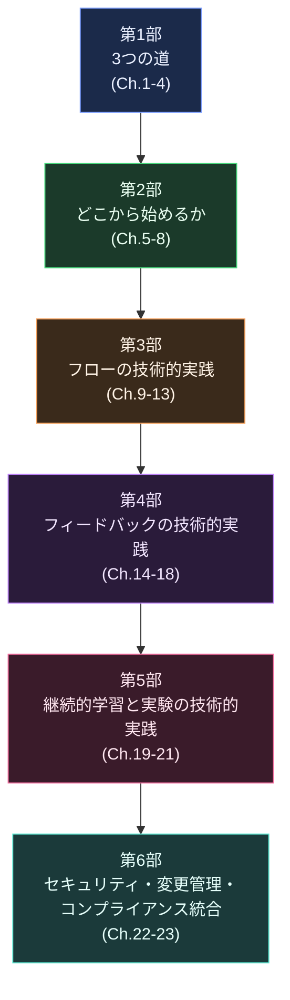

**ベストプラクティス**：本書は頭から順に読む必要はありません。まず第1部で「思想」を理解し、第2部で「自組織にどう当てはめるか」を考え、第3〜6部を実務の辞書として都度参照する、という読み方が初学者には最も効果的です。

---

## 2. 第1部: 3つの道（The Three Ways）— DevOpsの原理原則

DevOpsのあらゆるプラクティスは、Gene Kim が提唱した**「3つの道（The Three Ways）」**という3つの原理原則から派生していると本書は主張します（[出典: Gene Kim, "The Three Ways"](https://itrevolution.com/articles/the-three-ways-principles-underpinning-devops/)）。第2版ではこの3つの道が Part 1 の中心テーマとして再整理されています（[出典: IT Revolution, "The Three Ways Revisited"](https://itrevolution.com/articles/three-ways-revisited-devops-handbook/)）。

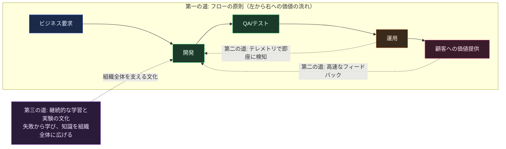

### 2.1 第一の道（The First Way）: フローの原則（第2章）

ビジネス要求から顧客への価値提供へ向かう作業の流れ（バリューストリーム）全体のパフォーマンスを最適化する考え方です。特定のチーム（例: 開発だけ）の効率を上げても、ボトルネックが別の箇所（例: 変更管理プロセス）にあれば全体のスループットは改善しません。

**ベストプラクティス**：
- 作業を可視化し、バリューストリーム全体のリードタイムを計測する
- WIP（仕掛かり作業）を制限し、コンテキストスイッチを減らす
- 局所最適ではなく全体最適を目指す（開発チームだけでなく、ビジネス〜運用までの一連の流れを見る）
- 複雑さを生む要因（大きなバッチサイズ、手作業のリリース、長命なブランチ）を継続的に排除する

### 2.2 第二の道（The Second Way）: フィードバックの原則（第3章）

右から左（運用→開発）へ、継続的で高速なフィードバックループを構築する考え方です。問題が発生してから顧客に届くまでの時間を最小化し、品質を作り込みます。

**ベストプラクティス**：
- 障害や問題を早期（できれば作り込んだ瞬間）に検知する仕組みを作る
- 開発者が自分の変更が本番でどう振る舞っているかを即座に把握できるようにする
- 問題の原因を個人ではなくシステムに求め、再発防止を仕組み化する

### 2.3 第三の道（The Third Way）: 継続的な学習と実験の原則（第4章）

高い信頼と科学的な姿勢に基づく組織文化を作り、リスクを取ることと失敗から学ぶことの両方を奨励する考え方です。

**ベストプラクティス**：
- 失敗を許容し、そこから学ぶ文化（ブレームレス文化）を醸成する
- 日々の業務の中に改善のための時間を組み込む（20%タイムなど）
- ローカルな学びをグローバルな改善へ転換する仕組み（内部Wiki、社内カンファレンスなど）を用意する

---

## 3. 第2部: どこから始めるか

### 3.1 バリューストリームの選定（第5章）

DevOps変革はすべてのシステムに一斉導入するのではなく、**1つのバリューストリームからパイロット的に始める**ことが推奨されています。

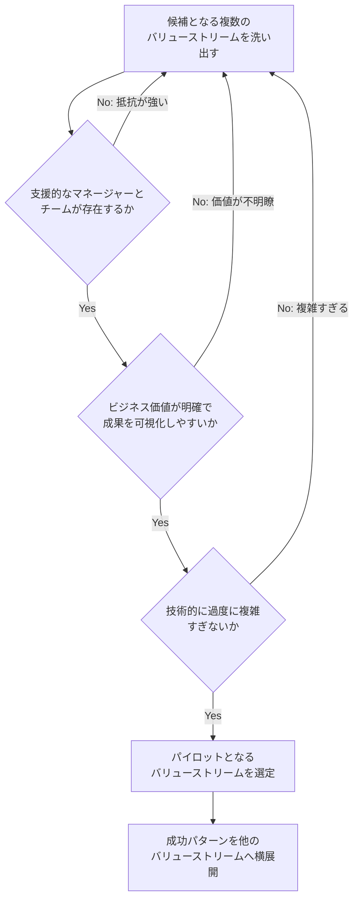

**ベストプラクティス**：
- 最初は「新規開発（グリーンフィールド）」でも「既存システム改修（ブラウンフィールド）」でもよいが、**支援的なチームとマネージャーがいること**を最優先する
- ビジネスへのインパクトが説明しやすい対象を選び、経営層への説得材料にする
- 最初から全社展開を狙わず、成功事例を作ってから横展開する

### 3.2 作業を理解し可視化する（第6章）

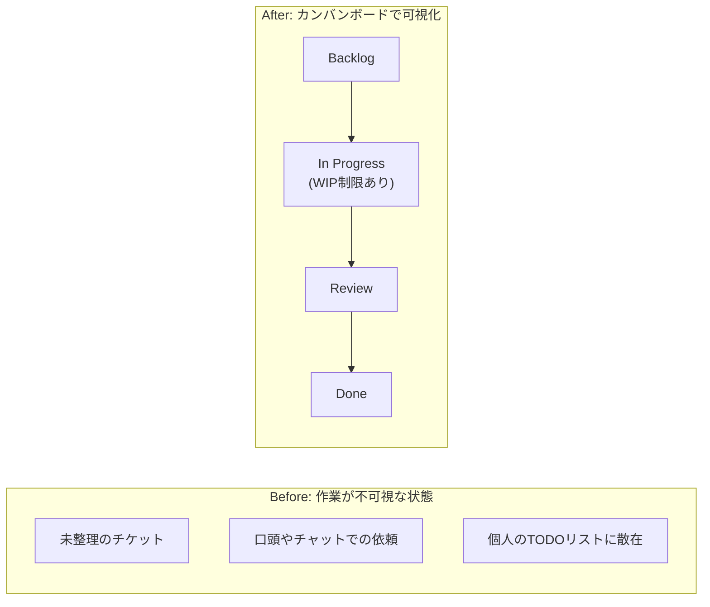

**ベストプラクティス**：
- すべての作業（機能開発だけでなく、障害対応・技術的負債の返済・割り込み作業も含む）をカンバンボードなどで可視化する
- WIP（Work In Progress）に上限を設け、同時並行作業数を制限する
- 可視化した作業を組織全体（他チーム、経営層）にも共有し、ボトルネックの合意形成を進める

### 3.3 コンウェイの法則を意識した組織とアーキテクチャの設計（第7章）

**コンウェイの法則**：「システムを設計する組織は、その組織のコミュニケーション構造をそのまま模倣した構造の設計を生み出す」という法則です。本書はこの法則を逆手に取り、望ましいアーキテクチャに合わせて組織を設計する**「逆コンウェイ作戦（Inverse Conway Maneuver）」**を推奨しています。この概念は *Team Topologies* の著者 Matthew Skelton・Manuel Pais の議論とも強く結びついています（[出典: IT Revolution, Conway's Law解説](https://itrevolution.com/articles/conways-law-critical-for-efficient-team-design-in-tech/)、[出典: Team Topologies 抜粋](https://itrevolution.com/wp-content/uploads/2022/06/TTOP_excerpt.pdf)）。

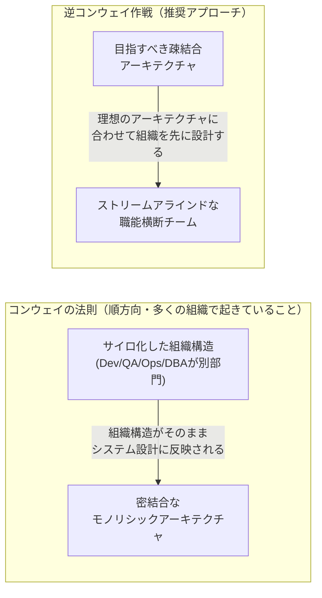

**ベストプラクティス**：
- 機能別（Dev/QA/Ops/DBA）に組織を分けるのではなく、**バリューストリームやサービス単位の職能横断チーム**（ストリームアラインドチーム）を編成する
- チームが独立してデプロイできる範囲（サービス境界）を明確にする
- Team Topologies の4つのチームタイプ（ストリームアラインド／プラットフォーム／イネーブリング／複雑サブシステム）を参考に、チーム間の連携モデルを設計する

### 3.4 運用作業を開発の日常業務に統合する（第8章）

**ベストプラクティス**：
- 運用担当者を各機能チームに「大使（liaison）」として配置する、または運用担当者を開発チームに常駐させる
- Opsが持つ知見（本番運用のノウハウ）をセルフサービス化されたツールやプラットフォームとして開発チームに提供する
- 「Dev vs Ops」の対立構造ではなく、共通の目標（顧客への価値提供）を持つ1つのチームとして機能させる

---

## 4. 第3部: 第一の道の技術的実践 — フロー

### 4.1 デプロイメントパイプラインの基盤を作る（第9章）

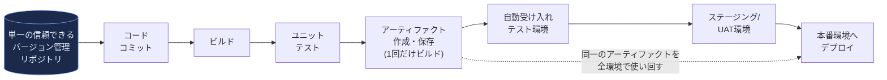

**ベストプラクティス**：
- アプリケーションコード・非機密の設定・インフラ定義（IaC）は、すべて単一のバージョン管理システムで管理する
- ただし**認証情報・秘密鍵・APIトークンなどの秘密値はリポジトリに保存しない**。値はシークレット管理サービス（Secret Manager、Vault 等）で管理し、リポジトリには「どのシークレットを参照するか」という参照だけを置く
- 「一度ビルドしたアーティファクトを、環境ごとに再ビルドせず、そのまま昇格させていく」という原則（Build once, deploy many）を徹底する
- 開発者が自分のPCで本番同等の環境を容易に再現できるようにする

### 4.2 高速で信頼できる自動テストを実現する（第10章）

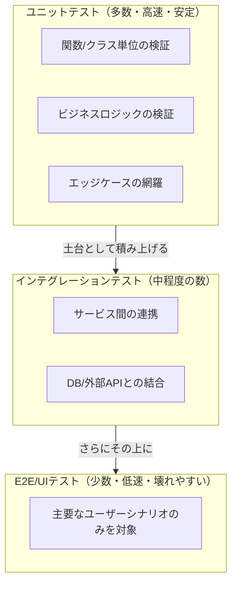

**ベストプラクティス**：
- テストピラミッドの原則に従い、**高速で安定したユニットテストを大量に**、E2Eテストは主要シナリオのみに絞る
- テストが不安定（flaky）になった場合は原因を放置せず即座に修正するか、テストスイートから隔離する
- テストスイート全体の実行時間を数分以内（理想は10分以内）に保ち、開発者が頻繁に実行できる状態を維持する

### 4.3 継続的インテグレーションを実践する（第11章）

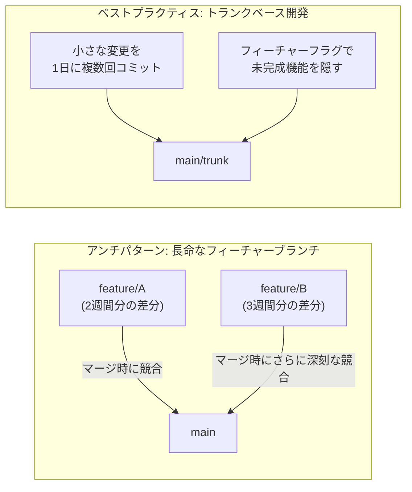

Google Cloud の Accelerate State of DevOps 調査では、信頼性目標を達成しているエリートパフォーマーは、そうでないチームと比べて**トランクベース開発を採用している確率が2.3倍高い**という結果が示されています（[出典: Google Cloud, Accelerate State of DevOps](https://cloud.google.com/resources/state-of-devops)）。

**ベストプラクティス**：
- 長命なフィーチャーブランチを避け、1日に複数回、小さな差分をtrunk（main）へマージする
- 未完成の機能は長期ブランチで隠すのではなく、フィーチャーフラグでコード上ON/OFFを切り替える
- コミットのたびにビルド・自動テストが走り、数分でフィードバックが返る状態を維持する

### 4.4 低リスクなリリースを自動化する（第12章）

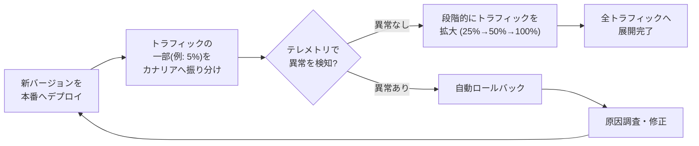

**ベストプラクティス（低リスクリリース手法の比較）**：

| 手法 | 概要 | 主な利点 |
|---|---|---|
| フィーチャーフラグ | コードはデプロイ済みだが、機能のON/OFFを実行時に切り替える | デプロイと機能公開を分離でき、機能公開を即時停止できる。ただし、デプロイ済みコードやスキーマ・データ・非同期処理は元に戻らないため、コードとデータのロールバックまたは前方互換性の維持が別途必要 |
| カナリアリリース | 新バージョンへ少量のトラフィックだけ流し、問題なければ徐々に拡大 | 実際の本番トラフィックで安全に検証できる |
| ブルーグリーンデプロイ | 新旧2系統の本番環境を用意し、トラフィックを一括切替 | 切り戻しが単純明快 |
| ダークローンチ | 新機能をユーザーに見せずに裏側で本番稼働させ負荷等を検証 | ユーザー体験に影響を与えず検証可能 |

### 4.5 低リスクリリースのためのアーキテクチャ（第13章）

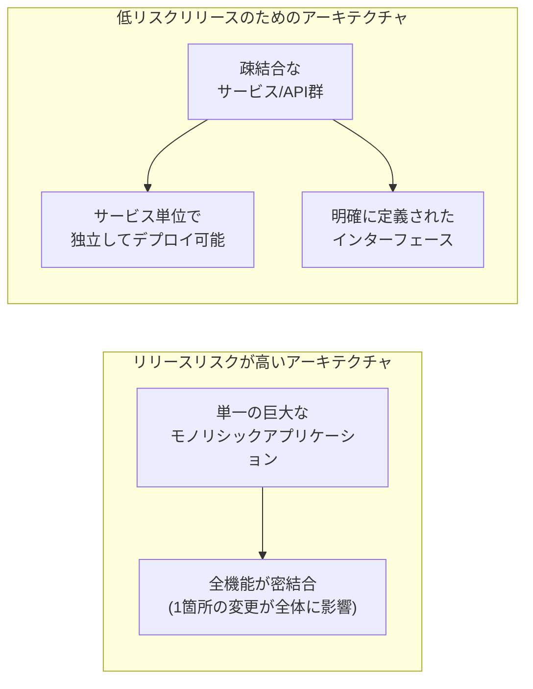

**ベストプラクティス**：
- アーキテクチャをサービス（またはモジュール）単位に分割し、それぞれ独立してテスト・デプロイできるようにする
- サービス間の依存関係を明示的なAPI契約として定義し、暗黙の結合を排除する
- 「アーキテクチャの疎結合さ」と「組織の疎結合さ（第7章のコンウェイの法則）」を両輪で進める

---

## 5. 第4部: 第二の道の技術的実践 — フィードバック

### 5.1 問題を見て解決するためのテレメトリを作る（第14章）

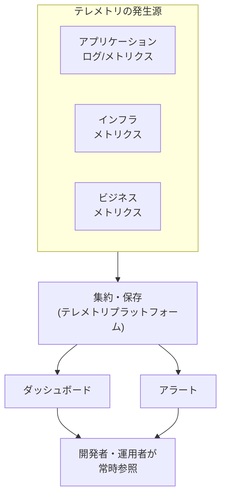

**ベストプラクティス**：
- アプリケーション層・インフラ層・ビジネス層、3種類すべてのテレメトリを収集する（アプリだけ、インフラだけでは不十分）
- ダッシュボードを「見に行く」のではなく、チームの作業スペース（物理・チャット問わず）に常時表示する
- ログ・メトリクス・トレースを1箇所に集約し、横断的に検索・相関分析できるようにする

### 5.2 テレメトリを分析し問題を予見する（第15章）

**ベストプラクティス**：
- 異常検知のしきい値を固定値ではなく、統計的な手法（標準偏差、季節性を考慮した異常検知など）で設定する
- ポストモーテムで得られた知見をもとに、同種の問題を先回りして検知するアラートを追加する
- 「異常が起きてから気づく」のではなく「異常の予兆を捉える」ことを目指す

### 5.3 開発と運用が安全にデプロイできるようフィードバックを実現する（第16章）

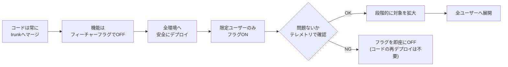

**ベストプラクティス**：
- デプロイ（コードを本番環境に配置する行為）とリリース（機能をユーザーに公開する行為）を分離する
- 開発者自身が自分のコードの本番での挙動をテレメトリ経由で確認できる権限とツールを持つ
- 障害復旧の第一手段を「フラグOFF」にし、緊急ロールバックの心理的・時間的コストを最小化する

### 5.4 仮説駆動開発とA/Bテストを日常業務に統合する（第17章）

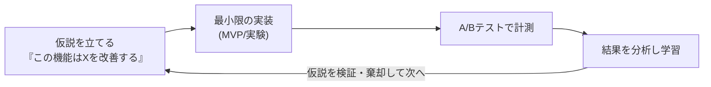

**ベストプラクティス**：
- 新機能をリリースする前に「この機能によって何がどう変化するはずか」という仮説を明文化する
- 主観的な意見ではなく、A/Bテストなどの実験結果でリリース判断を行う
- 失敗した仮説（改善につながらなかった機能）も貴重な学びとして記録する

### 5.5 現在の作業の品質を高めるレビューと調整プロセスを作る（第18章）

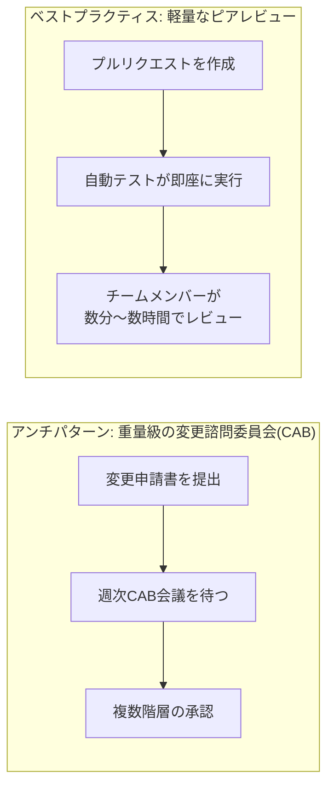

**ベストプラクティス**：
- 変更承認を「重量級の委員会」から「ピアレビュー＋自動テスト」へ移行する
- ペアプログラミングやモブプログラミングをリアルタイムレビューの一形態として活用する
- レビューのボトルネックが継続的デリバリーの速度を落としていないか定期的に見直す

---

## 6. 第5部: 第三の道の技術的実践 — 継続的学習と実験

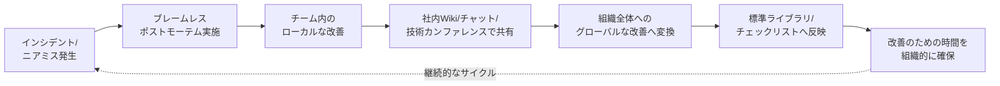

### 6.1 日常業務に学習を組み込む（第19章）: ブレームレスポストモーテム

障害対応の文化を語る上で欠かせないのが、Etsy の元CTO John Allspaw が2012年に提唱した**「ブレームレスポストモーテムとJust Culture」**の考え方です。個人を責めるのではなく、なぜその時その判断が「合理的」に見えたのかをシステム全体の視点から分析することで、エンジニアが萎縮せずに真実を語れる環境を作ります（[出典: John Allspaw, "Blameless PostMortems and a Just Culture"](https://codeascraft.com/2012/05/22/blameless-postmortems/)）。この考え方はGoogleのSRE本でも標準的な手法として採用されています。

**ベストプラクティス**：
- インシデント発生後、関係者全員が処罰を恐れずに事実を話せる場を設ける
- 「誰が悪かったか」ではなく「なぜその判断が当時は合理的に見えたか」を分析する
- ポストモーテムのアクションアイテムには必ず担当者と期限を設定し、実行を追跡する

### 6.2 カオスエンジニアリング: 意図的に障害を起こして学ぶ

継続的学習の実践として本書が重視するのが、Netflixが体系化した**カオスエンジニアリング**です。Netflixはこれを「本番環境の乱れた状況に耐えられるという確信を築くための、システムに対する実験の学問」と定義しています（[出典: principlesofchaos.org](https://principlesofchaos.org/)）。

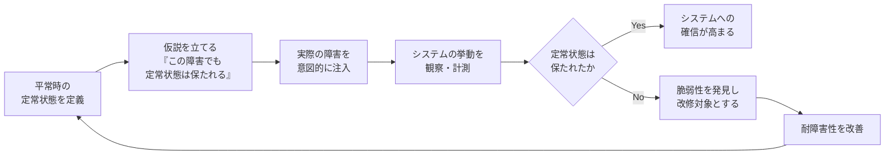

**ベストプラクティス**：
- 定常状態（正常な挙動を表す測定可能な指標）を明確に定義してから実験を始める
- 実験は本番相当の環境、できれば本番環境そのもので行う（ステージング環境では現実的な挙動が再現できないため）
- 影響範囲（ブラストラディウス）を最小限に抑えるガードレールを設けた上で、実験を自動化・継続実行する

### 6.3 ローカルな発見をグローバルな改善に変換する（第20章）

**ベストプラクティス**：
- チーム固有のノウハウを、組織全体で使える標準ツール・ライブラリ・チェックリストに昇華させる
- 社内版のカンファレンスや発表会（Google の「20% プロジェクト報告会」のような場）を定期開催する
- 「車輪の再発明」を防ぐための共通プラットフォームチームやイネーブリングチームを設置する

### 6.4 組織的学習と改善のための時間を確保する（第21章）

**ベストプラクティス**：
- 業務時間の一定割合（例: 20%）を、日々の機能開発以外の改善活動に充てることを制度化する
- 技術的負債の返済を「いつかやること」ではなく、バックログの中で優先順位を持つ正式なタスクとして扱う
- 学習と実験を評価する仕組み（人事評価やチーム目標）を整備し、口先だけの奨励で終わらせない

---

## 7. 第6部: 情報セキュリティ・変更管理・コンプライアンスの統合

### 7.1 情報セキュリティは全員の日常業務（第22章）

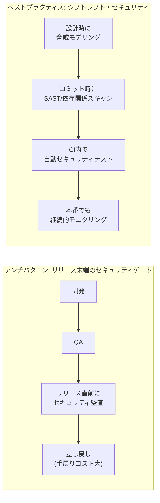

**ベストプラクティス**：
- セキュリティ担当者をリリース末端の「ゲートキーパー」ではなく、開発初期から関与する「イネーブラー」として位置づける
- 静的解析（SAST）、依存関係の脆弱性スキャン、シークレット検出をCIパイプラインに自動組み込みする
- セキュリティのベストプラクティスをセルフサービスのガードレール（承認済みライブラリ、テンプレート）として提供する

### 7.2 デプロイメントパイプラインを保護する（第23章）

**ベストプラクティス**：
- パイプライン自体（CI/CDツール、シークレット管理、アーティファクトリポジトリ）へのアクセスを最小権限の原則で厳格に管理する
- すべての変更履歴（誰が・いつ・何を変更したか）を監査可能な形で記録する
- コンプライアンス要件（変更管理、職務分掌など）を、手作業の承認フローではなく、パイプライン内の自動化された制御として実装する

---

## 8. 2026年の視点: AI時代のDORAとプラットフォームエンジニアリング

本書の初版発行（2016年）から10年、DevOpsを取り巻く環境は大きく変化しました。ここでは2026年8月時点での最新動向を補足します。

### 8.1 DORA調査の変遷とAI時代の実証データ

DORA（DevOps Research and Assessment）は、Google Cloudが主催する業界最大規模の継続調査で、*Accelerate* の共著者でもある Nicole Forsgren 博士が牽引してきました。2025年、この調査は大きな転換点を迎えています。

DORAチームは2025年、報告書の名称を「Accelerate State of DevOps」から**「State of AI-assisted Software Development」**へと変更しました。これはDevOpsという枠を超え、AIを含む新しい働き方全般を対象とする調査へと範囲を広げたことを意味する、単なる名称変更ではない転換だと分析されています（[出典: RedMonk, "DORA 2025: Measuring Software Delivery After AI"](https://redmonk.com/rstephens/2025/12/18/dora2025/)）。指標面では、2024年に**デプロイメント手戻り率（deployment rework rate）**が5つ目の指標として追加され、2025年には5指標モデルが正式化されています（[出典: DORA, "2025: Year in Review"](https://dora.dev/insights/dora-2025-year-in-review/)）。

2025年のDORA報告書では、世界中の技術者約5,000名の調査データから「AIは組織の強みも弱みも両方を増幅する“アンプ”である」という中心的な知見が示されました。基盤（技術的負債の少なさ、明確なプロセス、健全な文化）が整っているハイパフォーマーチームではAIが強力な加速装置として働く一方、混乱した組織ではAIが問題をさらに悪化させる、というものです（[出典: Splunk, "State of DevOps 2025"](https://www.splunk.com/en_us/blog/learn/state-of-devops.html)）。DORA自身も、AI導入がソフトウェア提供のスループットとの正の相関を示す一方で、変更失敗の増加や手戻りの増加など不安定性の高まりとも相関していることを指摘し、「検証コスト（verification tax）」という新たな摩擦が生じていると分析しています（[出典: DORA, "Balancing AI tensions"](https://dora.dev/insights/balancing-ai-tensions/)）。

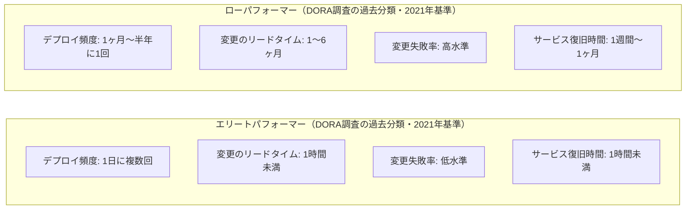

**2026年の実践への示唆**：
- AIコーディング支援ツールを導入する前に、まず本書が説く基礎（トランクベース開発・自動テスト・テレメトリ・疎結合アーキテクチャ）を固めることが、AIの恩恵を最大化する前提条件になる
- コードレビューやQAといった「下流工程」がAIによるコード生成速度の増加に追いついていない組織では、ボトルネックがそこへ移動するため、レビュー・テストの自動化投資を優先する

### 8.2 プラットフォームエンジニアリングの台頭

2026年現在、DevOpsの実践は「プラットフォームエンジニアリング」という形で進化を続けています。Gartnerは、大規模なソフトウェアエンジニアリング組織の80%が2026年までに、アプリケーション提供のための再利用可能なサービス・コンポーネント・ツールを社内向けに提供する専任プラットフォームチームを設置すると予測しています（2022年時点の45%から増加）（[出典: Roadie.io, "Platform Engineering in 2026"](https://roadie.io/blog/platform-engineering-in-2026-why-diy-is-dead/)）。CNCF Q1 2026 Technology Radarによれば、ハイブリッドAIワークフロー（AIと人間の協調作業）を採用するプラットフォームチームは35%、専任プラットフォームエンジニアリングチームを持つ組織は28%に達しているとも報告されています（[出典: CNCF, "Technology Radar Q1 2026"](https://radar.cncf.io/)）。また、LeanOpsレポートでは、多くの組織においてプラットフォームエンジニアリング専任チームへの移行が加速していると指摘されています（[出典: LeanOps, "Platform Engineering Trends 2026"](https://leanopstech.com/blog/platform-engineering-trends-2026/)）。

これは本書第7〜8章で語られる「運用の知見をセルフサービス化する」という思想の延長線上にあり、DevOpsを置き換えるものではなく、DevOpsの原則（フロー・フィードバック・継続的学習）を大規模かつ持続可能な形で実現するための組織的な進化と捉えるのが適切です。

---

## 9. 初学者向け8ステップ導入ロードマップ

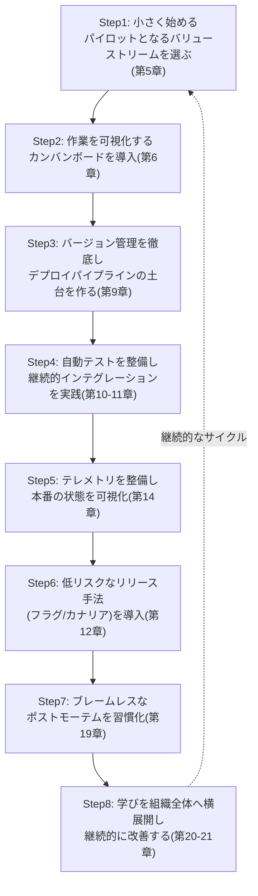

| ステップ | 主な成果物 | 対応する章 |
|---|---|---|
| Step1: パイロット選定 | 支援的なチーム・明確な価値を持つ対象領域 | 第5章 |
| Step2: 作業の可視化 | チーム共通のカンバンボード | 第6章 |
| Step3: パイプライン基盤 | 単一リポジトリ・自動ビルド | 第9章 |
| Step4: CI/自動テスト | テストピラミッド・トランクベース開発 | 第10-11章 |
| Step5: テレメトリ整備 | ダッシュボード・アラート | 第14章 |
| Step6: 低リスクリリース | フィーチャーフラグ・カナリアリリース | 第12章 |
| Step7: 学習文化の定着 | ブレームレスポストモーテムの実施フロー | 第19章 |
| Step8: 組織への横展開 | 社内ナレッジ共有の仕組み | 第20-21章 |

---

## 10. よくあるアンチパターン

- **⚠️ ビッグバン導入**: 全社一斉にDevOpsツールを導入しようとし、混乱と抵抗を招く（正しくは1つのバリューストリームから始める）
- **⚠️ ツール導入だけで満足する**: CI/CDツールやKubernetesを導入しただけでDevOpsが完了したと錯覚する（文化と組織設計の変革を伴わない技術導入は効果が限定的）
- **⚠️ 長命なフィーチャーブランチの放置**: マージ地獄を生み、継続的インテグレーションの恩恵を得られない
- **⚠️ リリース末端でのセキュリティ監査**: 開発の最終段階でしかセキュリティを確認せず、手戻りコストを増大させる
- **⚠️ 犯人探し型のポストモーテム**: 個人の責任追及に終始し、エンジニアが真実を語らなくなり、組織的な学習が止まる
- **⚠️ 重量級の変更諮問委員会（CAB）への依存**: 週次会議での承認待ちがリードタイムを支配し、フローを阻害する
- **⚠️ テレメトリなきデプロイ**: 本番での挙動を計測せずにリリースし、問題発覚が顧客からの苦情頼みになる
- **⚠️ AIツール導入を基礎の代替と考える**: トランクベース開発やテスト自動化などの基礎を整えないままAIコーディング支援を導入し、DORA 2025が指摘する「不安定性の増幅」を招く

---

## 11. 実践チェックリスト

- [ ] 支援的なチームとマネージャーが揃った、1つのバリューストリームからパイロットを開始したか
- [ ] すべての作業（機能開発・障害対応・技術的負債）をカンバンボードなどで可視化しているか
- [ ] コード・設定・インフラ定義を単一のバージョン管理システムで一元管理しているか
- [ ] コミットのたびに自動ビルド・自動テストが数分以内に完了する体制があるか
- [ ] 長命なフィーチャーブランチではなく、トランクベース開発とフィーチャーフラグを使っているか
- [ ] アプリケーション・インフラ・ビジネスの3種類のテレメトリを収集しダッシュボード化しているか
- [ ] カナリアリリースやフィーチャーフラグなど、低リスクなリリース手法を導入しているか
- [ ] インシデント発生後、ブレームレスなポストモーテムを実施する文化があるか
- [ ] セキュリティチェック（SAST、依存関係スキャン）をCIパイプラインに自動組み込みしているか
- [ ] 組織的な学習・改善のための時間を制度として確保しているか
- [ ] コンウェイの法則を踏まえ、目指すアーキテクチャに合わせた組織設計（逆コンウェイ作戦）を検討したか

---

## 12. 用語集

| 用語 | 説明 |
|---|---|
| バリューストリーム | ビジネス上の仮説を、顧客に価値を届ける技術サービスへと変換する一連のプロセス全体 |
| デプロイメントパイプライン | コードのコミットから本番リリースまでを自動化した一連のワークフロー |
| トランクベース開発 | 長命なブランチを作らず、main（trunk）へ小さな変更を頻繁にマージしていく開発スタイル |
| フィーチャーフラグ | コードのデプロイと機能の公開を分離し、実行時にON/OFFを切り替える仕組み |
| カナリアリリース | 新バージョンへ一部のトラフィックだけを流し、問題がなければ段階的に対象を拡大するリリース手法 |
| テレメトリ | アプリケーション・インフラ・ビジネスの状態を示す、ログ・メトリクス・トレースなどの計測データ |
| ブレームレスポストモーテム | 個人の責任追及ではなく、システム全体の視点から失敗の原因を分析する事後検証手法 |
| コンウェイの法則 | システムの構造がそれを設計した組織のコミュニケーション構造を模倣するという法則 |
| 逆コンウェイ作戦 | 望ましいシステムアーキテクチャを実現するために、あらかじめ組織構造を設計するアプローチ |
| カオスエンジニアリング | 本番相当の環境に意図的に障害を注入し、システムの耐障害性を検証する実験的手法 |
| DORAメトリクス | デプロイ頻度・変更のリードタイム・変更失敗率・サービス復旧時間（旧称: 平均修復時間）の4指標に、2024年追加のデプロイメント手戻り率を加えた5指標からなるソフトウェア提供パフォーマンスの指標群 |
| プラットフォームエンジニアリング | 開発者向けにセルフサービスの内部プラットフォーム（IDP）を構築・提供する専門領域 |

---

## 13. 参考文献

1. Gene Kim, Jez Humble, Patrick Debois, John Willis, Nicole Forsgren, *The DevOps Handbook, 2nd Edition* — [O'Reilly掲載ページ](https://www.oreilly.com/library/view/the-devops-handbook/9781098182281/)
2. IT Revolution, "The DevOps Handbook, Second Edition"（書籍紹介ページ） — [https://itrevolution.com/product/the-devops-handbook-second-edition/](https://itrevolution.com/product/the-devops-handbook-second-edition/)
3. Gene Kim, "The Three Ways: The Principles Underpinning DevOps" — [https://itrevolution.com/articles/the-three-ways-principles-underpinning-devops/](https://itrevolution.com/articles/the-three-ways-principles-underpinning-devops/)
4. IT Revolution, "The Three Ways Revisited: The DevOps Handbook, Second Edition" — [https://itrevolution.com/articles/three-ways-revisited-devops-handbook/](https://itrevolution.com/articles/three-ways-revisited-devops-handbook/)
5. DORA（Google Cloud）公式サイト — [https://dora.dev/](https://dora.dev/)
6. DORA, "State of AI-assisted Software Development 2025" — [https://dora.dev/dora-report-2025/](https://dora.dev/dora-report-2025/)
7. DORA, "2025: Year in Review"（名称変更・指標拡張の経緯） — [https://dora.dev/insights/dora-2025-year-in-review/](https://dora.dev/insights/dora-2025-year-in-review/)
8. DORA, "Balancing AI tensions: Moving from AI adoption to effective SDLC use" — [https://dora.dev/insights/balancing-ai-tensions/](https://dora.dev/insights/balancing-ai-tensions/)
9. Google Cloud, "Accelerate State of DevOps"（トランクベース開発の統計等） — [https://cloud.google.com/resources/state-of-devops](https://cloud.google.com/resources/state-of-devops)
10. RedMonk (Rachel Stephens), "DORA 2025: Measuring Software Delivery After AI" — [https://redmonk.com/rstephens/2025/12/18/dora2025/](https://redmonk.com/rstephens/2025/12/18/dora2025/)
11. Splunk, "State of DevOps 2025: Review of the DORA Report on AI Assisted Software Development" — [https://www.splunk.com/en_us/blog/learn/state-of-devops.html](https://www.splunk.com/en_us/blog/learn/state-of-devops.html)
12. IT Revolution / Matthew Skelton, "Conway's Law: Critical for Efficient Team Design in Tech" — [https://itrevolution.com/articles/conways-law-critical-for-efficient-team-design-in-tech/](https://itrevolution.com/articles/conways-law-critical-for-efficient-team-design-in-tech/)
13. Matthew Skelton, Manuel Pais, *Team Topologies*（抜粋PDF） — [https://itrevolution.com/wp-content/uploads/2022/06/TTOP_excerpt.pdf](https://itrevolution.com/wp-content/uploads/2022/06/TTOP_excerpt.pdf)
14. John Allspaw, "Blameless PostMortems and a Just Culture"（Etsy Code as Craft, 2012） — [https://codeascraft.com/2012/05/22/blameless-postmortems/](https://codeascraft.com/2012/05/22/blameless-postmortems/)
15. "Principles of Chaos Engineering"（Netflix発、Chaos Community） — [https://principlesofchaos.org/](https://principlesofchaos.org/)
16. Roadie.io, "Platform Engineering in 2026: Why DIY Is Dead" — [https://roadie.io/blog/platform-engineering-in-2026-why-diy-is-dead/](https://roadie.io/blog/platform-engineering-in-2026-why-diy-is-dead/)
17. LeanOps, "Platform Engineering Trends 2026: 11 Key Shifts" — [https://leanopstech.com/blog/platform-engineering-trends-2026/](https://leanopstech.com/blog/platform-engineering-trends-2026/)
18. GetDX, "DORA metrics: the complete guide to measuring DevOps performance in the AI era" — [https://getdx.com/blog/dora-metrics/](https://getdx.com/blog/dora-metrics/)

---

*本ガイドは2026年8月24日時点の公開情報に基づいて作成されています。DORA調査や各種統計は年次で更新されるため、最新の数値は各一次情報源（dora.dev等）を直接ご確認ください。*
