# Understanding the Linux Kernel 完全解説ガイド ― 初学者のためのステップバイステップ入門

> **原典について**: このガイドは O'Reilly *Understanding the Linux Kernel, 3rd Edition*（Daniel P. Bovet, Marco Cesati 著、2005年11月刊、942ページ、Linux 2.6系カーネルを対象）の目次構成・章立てを土台にしつつ、初学者向けに再構成し、2026年8月時点の最新カーネル動向（EEVDF スケジューラ、io_uring、eBPF/sched_ext、Rust for Linux、cgroup v2 など）を補完した独自ドキュメントです。原著は942ページに及ぶ関数レベルの詳細な解説書ですが、本ガイドはその「考え方」と「全体構造」を掴むことを目的とし、初学者が挫折しないよう概念・図解・現代的な文脈を中心に再編しています。原著の詳細な実装（関数名・行単位のコード解説）を読みたい方は、ぜひ原典を参照してください。
>
> - 原典ページ: https://www.oreilly.com/library/view/understanding-the-linux/0596005652/
> - 本ガイドはASCIIアート（罫線文字）を一切使用せず、図解はすべてMermaid、表はすべてMarkdown記法で作成しています。

## この記事について

Linuxカーネルは、世界中のサーバー・スマートフォン（Android）・組み込み機器・スーパーコンピュータで動く、現代コンピューティングの土台です。しかし「カーネルとは何をしているのか」「なぜOSにカーネルが必要なのか」は、アプリケーション開発者にとってブラックボックスになりがちです。

このガイドは、**Linuxカーネルのソースコードを読んだことがない人**でも、以下を段階的に理解できるように設計されています。

1. OS・カーネルの基本概念（プロセス、メモリ、ファイル、デバイス）
2. x86ハードウェアがどのようにカーネルを支えているか（セグメンテーション、ページング、割り込み）
3. カーネル内部の主要サブシステム（スケジューラ、メモリ管理、VFS、ブロックI/O、ページキャッシュ）
4. 2005年の原著から2026年現在までにカーネルがどう進化したか（CFS→EEVDF、AIO→io_uring、BKL撤廃、eBPF、Rust統合など）

## 対象読者

- Linux/Unix系OSを使っているが、カーネル内部の仕組みを体系的に学んだことがないソフトウェアエンジニア・QAエンジニア
- インフラ・SRE・組み込み開発者で、パフォーマンスチューニングやトラブルシューティングのためにカーネルの基礎知識が必要な人
- OS自作やLinuxカーネル開発への第一歩を踏み出したい人

## 前提知識

- C言語の基本文法（ポインタ、構造体、関数）が読める
- Linuxのコマンドライン操作（`ps`, `top`, `strace` など）に触れたことがある
- コンピュータアーキテクチャの基礎（CPU、メモリ、レジスタ）をぼんやりとでも知っている

前提知識に不安がある場合も、各章は概念から丁寧に説明するため読み進められます。

## 目次（この記事の構成）

| Part | タイトル | 原著対応章 |
|---|---|---|
| 第0部 | OS・カーネルの基礎知識 | （準備） |
| 第1部 | 序論：Linuxカーネルとは何か | Ch.1 Introduction |
| 第2部 | メモリアドレッシング | Ch.2 Memory Addressing |
| 第3部 | プロセス | Ch.3 Processes |
| 第4部 | 割り込みと例外 | Ch.4 Interrupts and Exceptions |
| 第5部 | カーネル同期 | Ch.5 Kernel Synchronization |
| 第6部 | タイミング計測 | Ch.6 Timing Measurements |
| 第7部 | プロセススケジューリング | Ch.7 Process Scheduling |
| 第8部 | メモリ管理 | Ch.8 Memory Management |
| 第9部 | プロセスアドレス空間 | Ch.9 Process Address Space |
| 第10部 | システムコール | Ch.10 System Calls |
| 第11部 | シグナル | Ch.11 Signals |
| 第12部 | 仮想ファイルシステム（VFS） | Ch.12 The Virtual Filesystem |
| 第13部 | I/Oアーキテクチャとデバイスドライバ | Ch.13 I/O Architecture and Device Drivers |
| 第14部 | ブロックデバイスドライバ | Ch.14 Block Device Drivers |
| 第15部 | ページキャッシュ | Ch.15 The Page Cache |
| 第16部 | ファイルアクセス | Ch.16 Accessing Files |
| 第17部 | ページフレーム回収 | Ch.17 Page Frame Reclaiming |
| 第18部 | Ext2/Ext3から現代のファイルシステムへ | Ch.18 The Ext2 and Ext3 Filesystems |
| 第19部 | プロセス間通信（IPC） | Ch.19 Process Communication |
| 第20部 | プログラム実行 | Ch.20 Program Execution |
| 第21部 | システム起動とモジュール | Appendix A/B |
| 第22部 | 2026年最新動向：原著から20年、カーネルはどう変わったか | （独自追加） |
| — | 学習ロードマップ／チェックリスト／参考文献 | — |

---

## 第0部：OS・カーネルの基礎知識

本編に入る前に、「OS」「カーネル」という言葉が指すものを整理します。

### 0.1 オペレーティングシステムとカーネルの違い

**オペレーティングシステム（OS）** は、ハードウェアとアプリケーションの間に立ち、コンピュータ資源（CPU・メモリ・ディスク・ネットワーク）を管理する巨大なソフトウェア群の総称です。「Linux」という言葉は文脈によって、狭義には**カーネル単体**を指し、広義には（Ubuntu、Fedora、Android のように）カーネル＋シェル＋ライブラリ＋アプリケーション群を含む「ディストリビューション」を指します。

**カーネル（kernel）** は、OSの中核（核）となるプログラムで、以下の役割を持ちます。

- CPU時間を複数のプロセスに公平に割り当てる（スケジューリング）
- メモリを各プロセスに割り当て、互いに干渉しないよう保護する（メモリ管理）
- ファイルシステムを通じてデータの永続化を提供する（ファイルシステム）
- キーボード・ディスク・ネットワークカードなどのハードウェアを抽象化する（デバイスドライバ）
- プロセス同士が安全に通信できる仕組みを提供する（IPC）

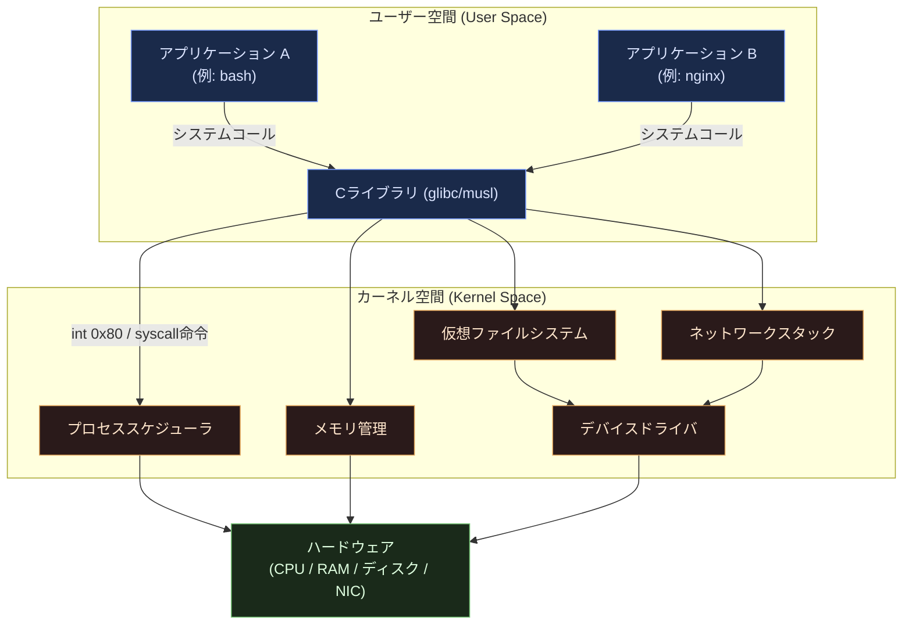

> **ベストプラクティス**: 「ユーザー空間」と「カーネル空間」の分離こそが、Linuxの安定性・セキュリティの根幹です。アプリケーションのバグでOS全体がクラッシュしないのは、CPUのモード切り替え機構（後述の第2部・第4部）が、ユーザープログラムに直接ハードウェアやカーネルのメモリへアクセスさせないよう保護しているためです。

### 0.2 モノリシックカーネル vs マイクロカーネル

原著の1.1節「Linux Versus Other Unix-Like Kernels」で議論されるように、カーネルの設計思想には大きく2つの流派があります。

| 設計 | 特徴 | 代表例 |
|---|---|---|
| モノリシックカーネル | すべてのカーネル機能（スケジューラ、ファイルシステム、ドライバ）が1つの特権アドレス空間で動く。高速だが、1つのドライバのバグが全体をクラッシュさせるリスクがある | Linux、伝統的なUnix系OS |
| マイクロカーネル | 最小限の機能（プロセス間通信・基本スケジューリング）のみカーネル空間に置き、ファイルシステムやドライバはユーザー空間のサーバープロセスとして動く。堅牢だが、プロセス間通信のオーバーヘッドがある | Mach、L4、MINIX 3 |
| ハイブリッド | モノリシックを基本としつつ、動的にロード可能なモジュール機構で柔軟性を持たせる | Linux（実質的にこちらに近い）、Windows NT系 |

Linuxはモノリシックカーネルとして設計されていますが、**ローダブルカーネルモジュール（LKM）** の仕組みにより、デバイスドライバやファイルシステムを実行時に動的追加・削除できる柔軟性を備えています（詳細は第21部）。

### 0.3 プロセス／カーネルモデル（Process/Kernel Model）

原著1.6.1節で説明される中心概念です。Unix系カーネルでは、カーネルはそれ自体が独立したプロセスとして動くのではなく、**「各プロセスに代わって特権モードで実行される」** という考え方を取ります。プロセスがシステムコールを発行したり、割り込み・例外が発生すると、CPUはユーザーモードからカーネルモードへ切り替わり、そのプロセスのコンテキストのままカーネルコードを実行します。

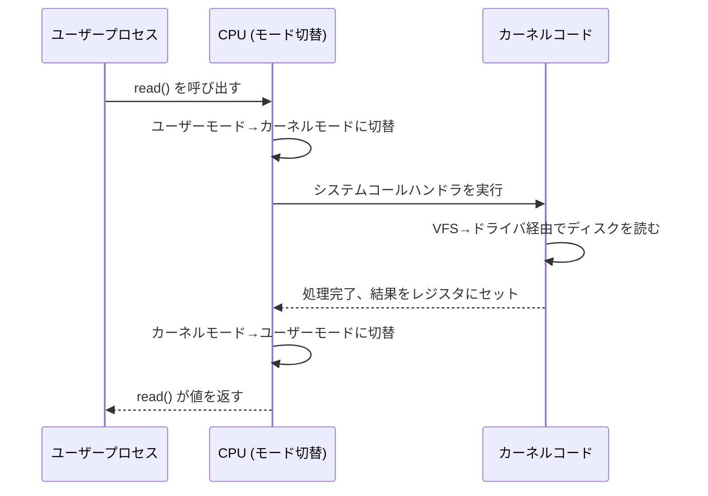

### 0.4 リエントラント（再入可能）カーネル

現代のカーネルは**リエントラントカーネル**です。つまり、複数のプロセスがほぼ同時にカーネルコードを実行でき（マルチプロセッサはもちろん、シングルプロセッサでも割り込みによるネスト実行がある）、カーネル自身が「自分自身に対して同時実行されても壊れない」よう設計されている必要があります。これが第5部「カーネル同期」で扱うテーマの出発点です。

学習の道筋としては、次の順序で読み進めると理解しやすくなります。


---

## 第1部：序論 ― Linuxカーネルとは何か（原著 Ch.1 Introduction）

### 1.1 LinuxとUnix系カーネルの関係

原著1.1節では、Linuxが「Unix互換（Unix-like）」カーネルであると位置づけられています。Linuxは、AT&TのオリジナルUnixのソースコードを一切使わず、Linus Torvaldsが1991年にゼロから書き起こしたコードです。にもかかわらず、POSIX標準に準拠したシステムコールインターフェースを提供するため、Unix向けに書かれたプログラムの多くがLinux上でもそのまま動きます。

Linuxが従来のUnix系カーネル（BSD系、System V系）と異なる主な特徴は以下の通りです。

| 特徴 | 内容 |
|---|---|
| 動的カーネルモジュール | 実行中のカーネルにドライバやファイルシステムを動的に追加・削除できる |
| マルチプラットフォーム対応 | x86, ARM, RISC-V, PowerPC, MIPS など多数のCPUアーキテクチャに移植されている |
| シンメトリックマルチプロセッシング（SMP） | 複数CPUコアを対等に扱い、負荷分散する |
| オープンソース開発モデル | GPLv2ライセンスの下、世界中の企業・個人開発者が共同で開発する |

### 1.2 ハードウェア依存性

原著1.2節では、カーネルコードが「ハードウェア非依存部分」と「ハードウェア依存部分（アーキテクチャ依存コード）」に分かれることが説明されます。Linuxソースツリーでは `arch/` ディレクトリ以下に、x86、arm64、riscv などアーキテクチャごとのコードが分離されており、CPUの割り込みコントローラやページテーブル形式といった機種依存の詳細はこの層に閉じ込められています。これにより、スケジューラやVFSといった大部分のコードは全アーキテクチャで共通化されています。

### 1.3 Linuxのバージョニング

原著執筆時点（2005年）は、開発版（奇数マイナー番号、例: 2.5.x）と安定版（偶数マイナー番号、例: 2.6.x）を分離する伝統的な番号付けが説明されていましたが、2004年の2.6リリース以降、Linuxはこの「開発/安定」分離モデルを廃止しました。現在（2026年時点）のバージョニングルールは次のとおりです。

- **メインラインカーネル**: `X.Y` 形式（例: 7.1）。約9〜10週間ごとに新しいメジャーバージョンがリリースされる。最初の2週間だけ新機能のマージを受け付ける「マージウィンドウ」があり、その後は `-rc1` から `-rcN` までのリリース候補でバグ修正のみが行われる。
- **安定版（stable）**: メインラインリリース後、Greg Kroah-HartmanとSasha Levinらが `X.Y.Z` 形式でバグ修正・セキュリティパッチのみを継続配布する。
- **LTS（Long Term Support）**: 特定のメインラインバージョンが数年間（最大6年程度）保守される。2026年8月時点でのLTS系列は 6.18, 6.12, 6.6, 6.1, 5.15 などが並行してメンテナンスされている。

> **出典**: Linux kernelバージョン情報とGreg Kroah-Hartman/Sasha Levinによる安定版リリース運用について — https://www.kernel.org/ 、Wikipedia "Linux kernel" — https://en.wikipedia.org/wiki/Linux_kernel

### 1.4 基本的なOSの概念

原著1.4節の内容を整理します。

**マルチユーザーシステム**: Linuxは複数のユーザーが同時にログインし、それぞれ独立したプロセス群を実行できるよう設計されています。各ユーザーはUID（ユーザーID）、各ユーザーが属するグループはGID（グループID）で識別されます。

**プロセス**: 実行中のプログラムのインスタンス。カーネルは各プロセスに `task_struct` という構造体（プロセスディスクリプタ）を割り当てて管理します（詳細は第3部）。

**カーネルアーキテクチャ**: 原著は「モノリシックカーネルだが、モジュール機構により柔軟性を確保している」とLinuxの立ち位置を説明しています。

### 1.5 Unixファイルシステムの概観

原著1.5節は、Linuxのファイルモデルの基礎を説明します。

- **ファイル**: バイト列の集合。特別な構造を持たない「フラットなバイトストリーム」として扱われる（これがUnix哲学の核心の一つ）。
- **ハードリンクとシンボリックリンク**: ハードリンクは同じinodeを指す別名、シンボリックリンクはパス文字列を保持する別ファイル。
- **ファイルタイプ**: 通常ファイル、ディレクトリ、シンボリックリンク、デバイスファイル（キャラクタ型/ブロック型）、名前付きパイプ（FIFO）、ソケット。
- **ファイルディスクリプタとinode**: プロセスから見た「開いているファイルの番号」がファイルディスクリプタ、ファイルシステム上の実体を表すメタデータがinode。
- **アクセス権とファイルモード**: 所有者・グループ・その他に対する読み書き実行権限（rwx）。
- **ファイル操作システムコール**: `open()`, `read()`, `write()`, `close()`, `rename()`, `unlink()` など。


### 1.6 Unixカーネルの概観

原著1.6節は本書全体の「地図」にあたる節で、以下のトピックを先取りして紹介します。いずれも本ガイドの各Partで詳しく扱います。

| トピック | 対応Part |
|---|---|
| プロセス/カーネルモデル、リエントラントカーネル | 第0部 |
| プロセスアドレス空間 | 第9部 |
| 同期・クリティカルリージョン（カーネルプリエンプション無効化、割り込み無効化、セマフォ、スピンロック） | 第5部 |
| シグナルとプロセス間通信 | 第11部・第19部 |
| プロセス管理（ゾンビプロセス、プロセスグループ、ログインセッション） | 第3部 |
| メモリ管理（仮想メモリ、カーネルメモリアロケータ、キャッシング） | 第8部・第9部 |
| デバイスドライバ | 第13部・第14部 |

---

## 第2部：メモリアドレッシング（原著 Ch.2 Memory Addressing）

### 2.1 メモリアドレスの3つの顔

原著2.1節は、CPUが扱うアドレスには3種類あることを説明します。

| アドレスの種類 | 説明 |
|---|---|
| 論理アドレス（Logical Address） | プログラムが直接指定するアドレス。x86ではセグメント＋オフセットで構成される |
| 線形アドレス／仮想アドレス（Linear/Virtual Address） | セグメンテーションユニットが論理アドレスを変換した、単一の32bit/64bit空間上のアドレス |
| 物理アドレス（Physical Address） | 実際にメモリバス上に現れる、DRAMチップ上の番地 |


### 2.2〜2.3 ハードウェアのセグメンテーションとLinuxでの利用

x86 CPUは本来、セグメントレジスタ（CS, DS, SS など）とセグメントディスクリプタテーブル（GDT/LDT）を使ってメモリを区分するセグメンテーション機構を持っています。原著2.2〜2.3節はこの仕組みを詳細に解説しますが、要点は「**Linuxはセグメンテーションをほぼ使わない**」ということです。すべてのプロセスに対して、ベースアドレス0、リミット4GB（32bit環境）の「フラットなアドレス空間」を割り当てるセグメントディスクリプタのみを使い、実質的にアドレス変換をページングユニットに一任しています。これはx86の複雑なセグメンテーション機構に依存せず、他アーキテクチャへの移植性を高めるための設計判断です。

64bit（x86-64）環境では、セグメンテーションはさらに形骸化し、CS/SSなど一部のセグメントレジスタが名残として残るのみとなっています。

### 2.4〜2.5 ページング機構

**ページング**は、線形アドレスを物理アドレスへ変換する仕組みです。メモリは固定サイズの「ページ」（通常4KB）単位で管理され、CPU内の**ページテーブル**がこの変換を担います。

原著が対象とする2.6カーネル（32bit時代）は2段階（あるいはPAE有効時3段階）のページテーブルを解説していましたが、現代の64bit（x86-64）環境では**4段階（一部は5段階）ページテーブル**が標準です。

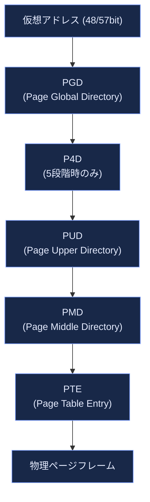

**TLB（Translation Lookaside Buffer）** は、頻繁に使われるページテーブルエントリをCPU内にキャッシュし、毎回メモリ上のページテーブルを歩く（ウォークする）コストを削減する仕組みです。原著2.4.8節で解説されるこの概念は、現代でもパフォーマンスチューニングの重要なポイント（TLBミス削減、Huge Pages活用）として生き続けています。

### 2.5 Linuxにおけるページング詳細

原著2.5節では、以下のような実装詳細が解説されます。

- **線形アドレスのフィールド分割**: 仮想アドレスの各ビット範囲がPGD/PUD/PMD/PTEインデックスにどう割り当てられるか
- **物理メモリレイアウト**: カーネル自身が使う物理メモリ領域（`ZONE_DMA`, `ZONE_NORMAL`, `ZONE_HIGHMEM` など）
- **プロセスページテーブル**とカーネルページテーブルの違い
- **ハイメモリのカーネルマッピング**: 32bit環境で物理メモリが4GBに迫る場合、カーネルの直接マッピング可能領域（Low Memory）を超える部分（High Memory）を一時的にマッピングする仕組み

> **2026年時点の補足**: 64bit環境が主流になった現在、32bit時代特有の「ハイメモリ問題」（原著2.5.5〜2.5.6節が詳述する内容）は実務上ほぼ解消しています。64bitのアドレス空間は理論上16EB（エクサバイト）に及び、物理メモリの直接マッピングに困ることがほぼないためです。ただし、組み込み機器や一部のレガシー環境では32bitカーネルも現役であり、概念としては依然重要です。

### 2.6 ハードウェアキャッシュとメモリ階層

原著2.4.7節が触れるハードウェアキャッシュ（L1/L2/L3キャッシュ）は、CPUとメインメモリの速度差を埋めるための仕組みです。現代のCPUではこの階層がさらに複雑化しており、NUMA（Non-Uniform Memory Access）構成のマルチソケットサーバーでは「どの物理コアがどのメモリバンクに近いか」がパフォーマンスに大きく影響します（NUMAは第8部で再登場します）。

| メモリ階層 | 典型的なレイテンシ（目安） | 典型的な容量 |
|---|---|---|
| CPUレジスタ | <1ns | 数百バイト |
| L1キャッシュ | 1ns前後 | 数十KB |
| L2キャッシュ | 3〜10ns | 数百KB〜数MB |
| L3キャッシュ | 10〜20ns | 数MB〜数十MB |
| メインメモリ（DRAM） | 50〜100ns | 数GB〜数TB |
| NVMe SSD | 数十〜数百μs | 数百GB〜数十TB |

---

## 第3部：プロセス（原著 Ch.3 Processes）

### 3.1 プロセス、軽量プロセス、スレッド

原著3.1節は、Linux独自の設計思想を説明する重要な節です。多くのOSでは「プロセス」と「スレッド」を明確に別のカーネルオブジェクトとして扱いますが、Linuxは**両方を単一の抽象「task」として扱います**。プロセス生成に使う `clone()` システムコールに渡すフラグ（`CLONE_VM`, `CLONE_FS`, `CLONE_FILES` など）によって、「アドレス空間を親と共有するか」「ファイルディスクリプタテーブルを共有するか」を個別に選択でき、これにより伝統的な「プロセス」と「軽量プロセス（スレッド）」の両方を統一的に表現しています。

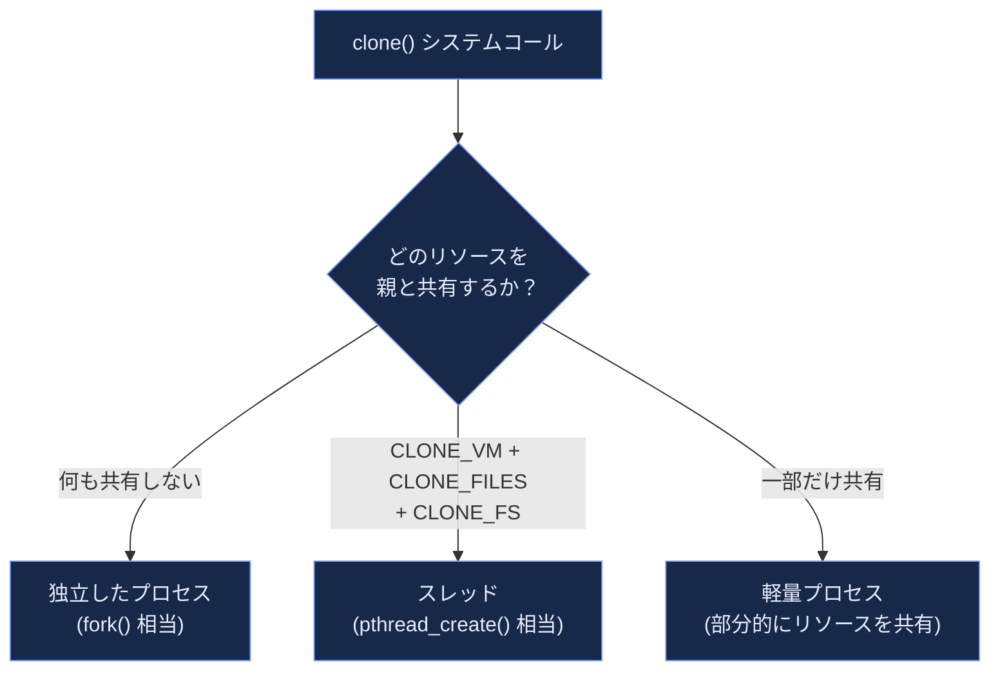

### 3.2 プロセスディスクリプタ

カーネルは各プロセス（タスク）を `task_struct` という巨大な構造体で表現します。原著3.2節はこの構造体の要素を詳しく解説します。

- **プロセス状態**: `TASK_RUNNING`（実行可能）、`TASK_INTERRUPTIBLE`（シグナルで起床可能な待機）、`TASK_UNINTERRUPTIBLE`（シグナル無視の待機、いわゆるDステート）、`TASK_STOPPED`（停止）、`EXIT_ZOMBIE`（終了済みだが親が回収待ち）など。

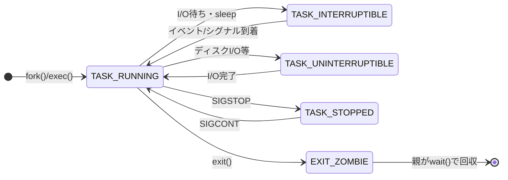

- **プロセスの識別**: PID（プロセスID）、PGID（プロセスグループID）、SID（セッションID）。原著が説明する「pidhashテーブル」は、現代のカーネルでは効率的なradix tree/IDR（IDアロケータ）ベースの実装に置き換わっています。
- **プロセス間の関係**: 親子関係（`parent`/`children`）、兄弟関係（`sibling`）を双方向リンクリストで管理。
- **待ち行列（wait queue）**: プロセスがイベント（I/O完了、ロック解放など）を待つための仕組み。
- **リソース制限**: `RLIMIT_NOFILE`（開けるファイル数上限）、`RLIMIT_NPROC` など、`ulimit` コマンドで確認・設定できる各種上限。

### 3.3 プロセス切り替え（コンテキストスイッチ）

原著3.3節は、あるプロセスの実行を中断し、別のプロセスに実行を切り替える「プロセス切り替え（コンテキストスイッチ）」のハードウェアレベルの詳細を扱います。

- **ハードウェアコンテキスト**: CPUレジスタ・プログラムカウンタ・スタックポインタなど、プロセス実行を再開するために必要な情報一式。
- **TSS（Task State Segment）**: x86が本来ハードウェアレベルでタスク切り替えをサポートするための構造体。Linuxはこれをフルには使わず、ソフトウェアによる軽量な切り替え（`switch_to` マクロ）を採用しています。
- **FPU/MMX/SSE/AVXレジスタの保存**: 浮動小数点演算ユニットの状態は、実際に使用したプロセスのみ遅延保存する「Lazy FPU」的な最適化が伝統的に行われてきましたが、現代のCPU（AVX-512など）ではこの管理は `XSAVE`/`XRSTOR` 命令群にさらに一般化されています。

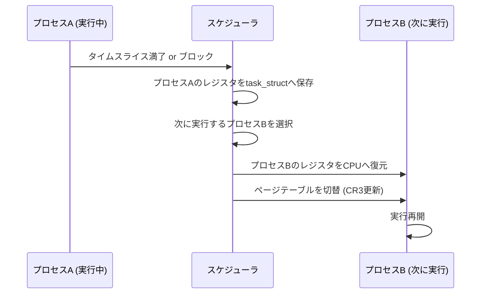

### 3.4 プロセスの生成

原著3.4節では `clone()`, `fork()`, `vfork()` の3つのシステムコールが解説されます。

| システムコール | 特徴 |
|---|---|
| `fork()` | 親プロセスの完全なコピーを作る。従来は全メモリを物理コピーしていたが、現代は**Copy-On-Write（COW）**により、実際に書き込みが発生するまでページを共有し続けることで高速化されている |
| `vfork()` | 親のアドレス空間をそのまま共有し、子が `exec()` するかexitするまで親をブロックする。`exec()` 直後に破棄されるアドレス空間のコピーコストを避けるための最適化 |
| `clone()` | 前述の通り、共有するリソースをフラグで細かく制御できる、最も汎用的な生成手段。`pthread_create()` の裏側でも使われる |

`copy_process()` 関数（内部実装）は、新しいプロセスディスクリプタの割り当て、PIDの割り当て、各種リソース（ファイルディスクリプタテーブル、シグナルハンドラ、アドレス空間）のコピーまたは共有設定を行います。

**カーネルスレッド**は、ユーザー空間を持たずカーネル内でのみ動作する特殊なプロセスです。原著が例示するプロセス0（`swapper`/idle task）、プロセス1（`init`）に加え、現代のカーネルには `kworker`, `ksoftirqd`, `kswapd`, `migration` など多数のカーネルスレッドが存在し、`ps -ef` で `[ ]` 括弧付きの名前として確認できます。

### 3.5 プロセスの終了

原著3.5節は `exit()` システムコールの内部（`do_exit()`）を解説します。プロセスが終了しても、親プロセスが `wait()`/`waitpid()` で終了ステータスを回収するまでは、そのプロセスディスクリプタは**ゾンビ（zombie）状態**としてカーネルに残り続けます。親が回収を怠ると「ゾンビプロセスの蓄積」という運用上のトラブルにつながります（`ps aux` で `Z` ステータスとして観測可能）。

> **ベストプラクティス**: デーモンプロセスを自作する際は、子プロセスの終了を必ず `SIGCHLD` ハンドラや `waitpid()` で回収する設計にしてください。コンテナ環境（Docker等）でPID 1として動くプロセスがゾンビ回収を怠ると、ゾンビが蓄積してPIDテーブルを圧迫する典型的な障害パターンになります（`tini` や `dumb-init` のような軽量init代替が使われる理由の一つです）。

---

## 第4部：割り込みと例外（原著 Ch.4 Interrupts and Exceptions）

### 4.1〜4.2 割り込みシグナルの役割

カーネルが「今何かが起きた」ことを知る手段は主に2つです。

- **割り込み（Interrupt）**: 外部デバイス（キーボード、ディスク、NIC、タイマー）がCPUに対して非同期に発生させる信号。「IRQ（Interrupt Request）」とも呼ばれる。
- **例外（Exception）**: CPU自身が命令実行中に検出する同期的なイベント。ゼロ除算、ページフォルト、不正命令など。

原著4.2.1節が解説する**APIC（Advanced Programmable Interrupt Controller）** は、複数CPUコアへ割り込みを分配するための仕組みで、現代のマルチコアCPUでも中核的な役割を果たしています（Local APIC + I/O APIC構成）。

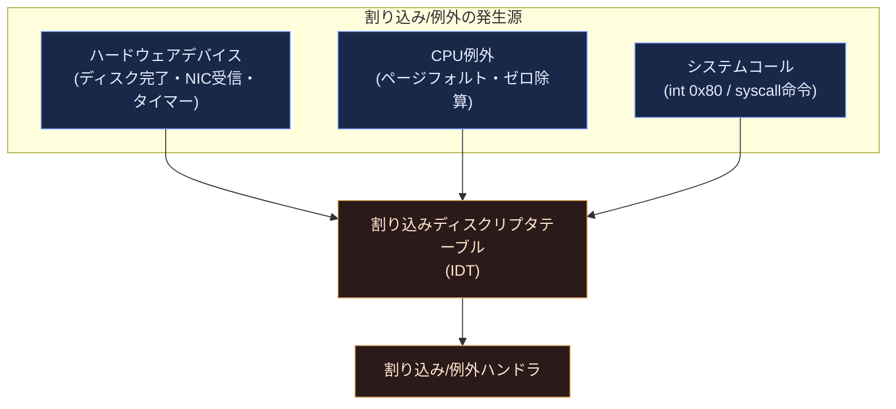

### 4.3〜4.5 IDTと例外ハンドリング

**割り込みディスクリプタテーブル（IDT）** は、各割り込み番号／例外番号に対応するハンドラのアドレスを保持するテーブルです。原著4.4節ではこのテーブルの初期化過程、4.5節では例外発生時にCPUがレジスタをどう保存し、ハンドラへどう制御を渡すかが解説されます。

### 4.6〜4.7 割り込みハンドリングとSoftirq/Tasklet

割り込みハンドラは**できるだけ短時間で終わらせる**ことが鉄則です（割り込み処理中は他の割り込みがブロックされるため）。そこでLinuxは「重い処理」を後回しにする**遅延処理機構（deferrable functions）**を持っています。

| 機構 | 特徴 |
|---|---|
| Softirq | 静的に定義された少数の高優先度の遅延処理。ネットワークパケット処理などパフォーマンスが重要な用途で使われる |
| Tasklet | Softirqの上に実装された、動的に登録できる遅延処理。同じtaskletは複数CPUで同時実行されない |
| ワークキュー（Work Queue） | カーネルスレッドのコンテキストで実行される遅延処理。プロセスコンテキストが必要な処理（スリープを伴う処理）に使われる |

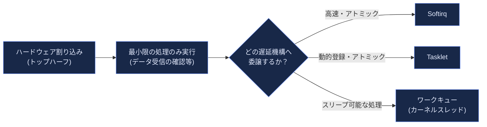

> **ベストプラクティス**: `top` や `vmstat` で `si`（softirq）列の値が高止まりしている場合、ネットワーク割り込み処理がCPUを圧迫しているサインです。NICのマルチキュー機能とRSS（Receive Side Scaling）、あるいは `irqbalance` によるCPUコア間の割り込み分散設定を見直す出発点になります。

### 4.8 ワークキュー

原著4.8節は、旧来の `keventd`（predefined work queue）を解説していますが、現代のカーネルでは**CMWQ（Concurrency-Managed Workqueues）** に置き換わっており、ワーカースレッドの数がワークロードに応じて動的にプール管理されるようになっています。`ps -ef | grep kworker` で確認できる `kworker/N:M` プロセス群がこれにあたります。

### 4.9 割り込み・例外からの復帰

割り込みハンドラの実行が終わると、カーネルは以下を確認してから制御をユーザー空間へ戻します。

- ネストした割り込みハンドラの再開処理
- カーネルプリエンプションが必要か（第7部で詳述）
- ユーザーモードへ戻る場合、再スケジューリングが必要か、保留中のシグナルがあるか

---

## 第5部：カーネル同期（原著 Ch.5 Kernel Synchronization）

### 5.1 なぜ同期が必要か

リエントラントカーネルでは、複数のCPU（マルチプロセッサ）や、割り込み・例外によるネスト実行により、**同じデータ構造に複数の実行文脈が同時にアクセスしうる**状況が常態化しています。このとき適切な保護がなければ「競合状態（レースコンディション）」によるデータ破壊が発生します。

### 5.2 同期プリミティブ

原著5.2節が解説する主要な同期機構は、現代のカーネルでも基本的に健在です。

| 機構 | 特徴 | 適した場面 |
|---|---|---|
| Per-CPU変数 | そもそも共有しない。CPUごとに独立したデータを持たせることで同期コストをゼロにする | 統計カウンタなど |
| アトミック操作 | `atomic_t` 型に対する加算・減算などをCPU命令レベルで不可分に行う | 単純なカウンタ |
| メモリバリア | コンパイラ・CPUによる命令並べ替えを制御し、他CPUから見た書き込み順序を保証する | ロックフリーアルゴリズム |
| スピンロック | ロック取得までCPUをビジーウェイト（回転）させる。短時間だけ保持するロックに向く | 割り込みコンテキストでも使える短時間ロック |
| セマフォ | ロック取得できない場合、プロセスをスリープさせる | 長時間保持しうるロック（プロセスコンテキストのみ） |
| Seqlock | 読み手は再試行前提で高速に読み、書き手を優先する。読み手が圧倒的多数の場合に有効 | `jiffies` の読み取りなど |
| RCU (Read-Copy-Update) | 読み手はロック不要（ほぼゼロコスト）、更新は新バージョンを作成してから安全なタイミングで旧バージョンを回収する | 読み取りが圧倒的に多いデータ構造（ルーティングテーブル等） |
| Completion | あるタスクの完了を別のタスクが待つための軽量な同期プリミティブ | 初期化処理の待ち合わせ |

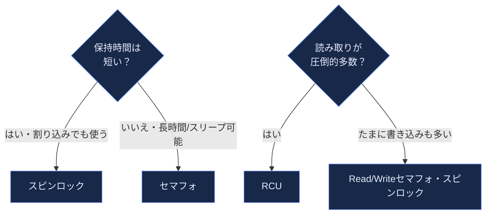

### RCU（Read-Copy-Update）の考え方

原著5.2.7節でも紹介されるRCUは、2002年10月にLinuxカーネルへ導入されて以来、Linuxの並行性処理を語る上で欠かせない技術に成長しました。RCUの核心的な発想は「読み手はロックを一切取らず、更新者が新しいバージョンのデータ構造を作成し、既存の読み手が全員読み終わるのを待ってから古いバージョンを解放する」というものです。

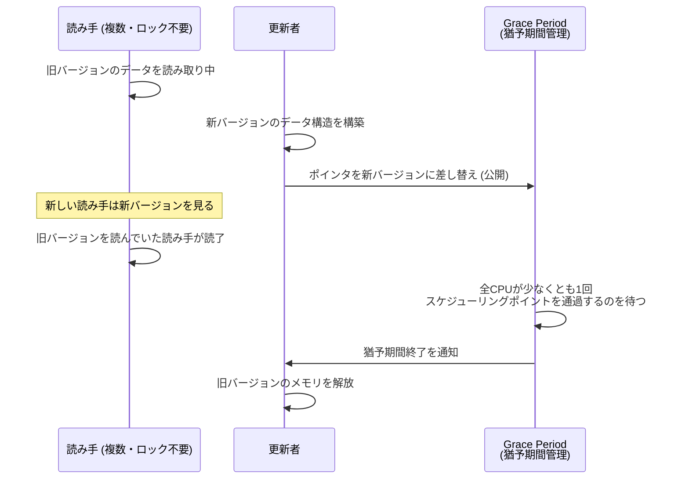

> **出典**: Paul E. McKenney, Jonathan Walpole, "What is RCU, Fundamentally?" (LWN.net) — https://lwn.net/Articles/262464/ ／ "A Tour Through RCU's Requirements" (The Linux Kernel Documentation) — https://docs.kernel.org/RCU/Design/Requirements/Requirements.html

### 5.3〜5.4 使い分けと典型的な保護パターン

原著5.3節は「どのデータ構造をどの同期プリミティブで守るべきか」を、アクセス元（例外／割り込み／遅延処理）の組み合わせごとに場合分けして詳述しています。原著5.4節で紹介される**ビッグカーネルロック（BKL: Big Kernel Lock）** は、2.6系初期に残っていた「カーネル全体を1本の粗いロックで保護する」歴史的な遺物でしたが、2011年リリースのLinux 2.6.39で完全に撤廃されました。BKL撤廃は、より細粒度のロック（per-subsystemロック、RCU）へ置き換える約十年がかりの取り組みの集大成であり、Linuxのマルチコアスケーラビリティ向上における最重要マイルストーンの一つとされています。

> **ベストプラクティス**: カーネル空間に限らず、アプリケーション開発でも「読み取りが多く書き込みが稀」なデータ構造にはRCU的発想（コピーオンライト＋アトミックなポインタ差し替え）が有効です。例えば設定のホットリロードや、参照カウント付き不変オブジェクトの置き換えパターンは、ユーザー空間の並行プログラミングでも頻出します。

---

## 第6部：タイミング計測（原著 Ch.6 Timing Measurements）

### 6.1 クロックとタイマー回路

原著6.1節は、x86ハードウェアが提供する複数の時刻源を紹介します。

| デバイス | 特徴 |
|---|---|
| RTC (Real Time Clock) | バッテリーバックアップされ、電源オフ中も時刻を保持する |
| TSC (Time Stamp Counter) | CPUクロックごとにインクリメントされる高精度カウンタ。高頻度サンプリングに使われる |
| PIT (Programmable Interval Timer) | 伝統的な周期割り込み生成デバイス（レガシー） |
| HPET (High Precision Event Timer) | PITより高精度なタイマー |
| ローカルAPICタイマー | CPUコアごとに独立して動作するタイマー |

### 6.2 Linuxのタイムキーピングアーキテクチャ

原著が解説する `jiffies`（カーネル起動からの周期的タイマー割り込み回数を数えるグローバル変数）は今も存在しますが、現代のカーネルは`hrtimer`（高解像度タイマー）サブシステムを中心に据えており、`jiffies` の粒度（伝統的に100Hz〜1000Hz）に縛られないナノ秒単位のタイマー精度を実現しています。

**tickless kernel（NO_HZ）**: 原著が前提とする「一定間隔でタイマー割り込みが発生し続ける」設計は、現代では大きく変化しています。CPUがアイドル状態やユーザー空間で単一タスクを実行中の場合、不要な定期タイマー割り込みを止める `NO_HZ_IDLE` / `NO_HZ_FULL` モードにより、消費電力削減とレイテンシ改善を両立しています。

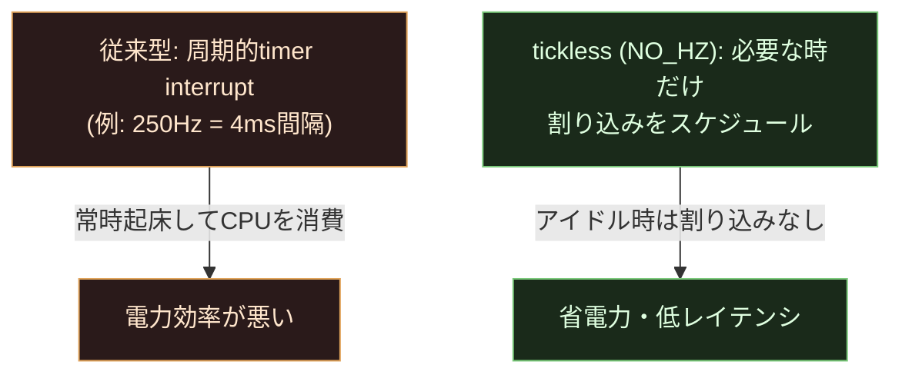

### 6.3〜6.6 時刻更新・統計・ソフトウェアタイマー

原著は `sys_time()`, `sys_gettimeofday()`, `setitimer()`, `alarm()`, POSIXタイマーなどのシステムコール群を解説します。現代の開発では、これらの低レベルAPIの代わりに `clock_gettime(CLOCK_MONOTONIC, ...)` や `timerfd_create()` を使うのが一般的です。動的タイマー（ソフトウェアタイマー）は `add_timer()`/`del_timer()` から `timer_list` を使う実装へと発展し、`nanosleep()` の内部実装にも使われています。

> **ベストプラクティス**: アプリケーションで経過時間を計測する際は、システム時刻の変更（NTP補正やユーザーによる手動変更）の影響を受けない `CLOCK_MONOTONIC` を使用してください。壁時計時刻 `CLOCK_REALTIME` はログのタイムスタンプには適していますが、タイムアウト処理や経過時間計測には不向きです。

---

## 第7部：プロセススケジューリング（原著 Ch.7 Process Scheduling）

### 7.1〜7.2 スケジューリングポリシー

原著が解説する2.6初期のスケジューラは、優先度配列を使った**O(1)スケジューラ**（Ingo Molnarによる設計）でした。「動的優先度」「平均スリープ時間」「アクティブ配列／期限切れ配列」といった原著7.2節の概念は、まさにこのO(1)スケジューラ時代のものです。しかし、このスケジューラは公平性の保証が弱く、ヒューリスティックのチューニングが職人芸的だったため、2007年リリースのLinux 2.6.23で**CFS（Completely Fair Scheduler、Ingo Molnar設計）**に置き換えられました。

さらに2023年、Linux 6.6で CFS は **EEVDF（Earliest Eligible Virtual Deadline First）** に置き換わりました（Peter Zijlstra設計）。原著出版から20年の間に、Linuxのスケジューラ設計思想は大きく2度の世代交代を経ています。

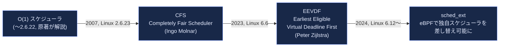

> **出典**: Jonathan Corbet, "An EEVDF CPU scheduler for Linux" (LWN.net, 2023年3月) — https://lwn.net/Articles/925371/ ／ The Linux Kernel Documentation "EEVDF Scheduler" — https://docs.kernel.org/scheduler/sched-eevdf.html

### CFSの考え方（原著執筆後に主流化した設計）

CFSは「各プロセスが消費したCPU時間を優先度で重み付けした**仮想実行時間（vruntime）**」を赤黒木（red-black tree）で管理し、常にvruntimeが最小のプロセスを次に実行する、というシンプルな原理で「完全な公平性」を目指しました。ただし、この「最小vruntimeを選ぶ」という方式には、レイテンシが重要なタスク（ネットワークI/O待ちから起床したタスクなど）に「緊急性」の概念がないという弱点がありました。

### EEVDFへの進化

EEVDFは、CFSのvruntimeモデルを土台にしつつ、各タスクに「**仮想デッドライン（virtual deadline）**」という概念を追加しました。「公平に扱われるべき権利（eligible）」を持つタスクの中から、最も早いデッドラインを持つタスクを選ぶことで、単純な「最小vruntime選択」よりも緊急性の高いタスクへの応答性を改善しています。

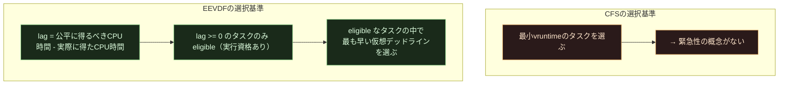

> **出典**: "EEVDF" (Linux Kernel Internals) — https://kernel-internals.org/sched/eevdf/ ／ Peter Zijlstra による原論文ベースの実装は1995年の学術論文 "Earliest Eligible Virtual Deadline First" (Ion Stoica, Hussein Abdel-Wahab) に由来

### 7.3〜7.4 スケジューラが使うデータ構造と関数

原著が解説する **runqueue（実行キュー）** はCPUごとに1つ存在し、実行可能なプロセスの集合を管理します（現代でも赤黒木構造は健在）。`schedule()` 関数は、次に実行すべきタスクを選択しコンテキストスイッチを実際に発生させる中心的な関数です。`try_to_wake_up()` はスリープ中のタスクを実行可能状態に戻す処理を担当します。

### 7.5 マルチプロセッサでの負荷分散

原著7.5節が解説する**スケジューリングドメイン**の概念（物理的なCPUトポロジー：SMT兄弟コア、同一ソケット内のコア、NUMAノード間、といった階層構造を意識した負荷分散）は、現代のスケジューラでも中心的な設計原則として引き継がれています。`load_balance()` に相当する処理は、各階層で「タスクをどのCPUへ移動すべきか」を判断します。

### 2024年以降：sched_ext（eBPFで作るカスタムスケジューラ）

Linux 6.12（2024年11月）でマージされた **sched_ext** は、eBPFプログラムとしてスケジューリングポリシーそのものをユーザー空間から差し替え可能にする仕組みです。ゲーム機（SteamOS）向けのレイテンシ最適化スケジューラ `scx_lavd` や、データセンター向けの `scx_rusty` など、ワークロード特化型スケジューラをカーネル再コンパイルなしに試せるようになりました。

> **ベストプラクティス**: `cat /proc/sys/kernel/sched_latency_ns` や `chrt`, `nice`/`renice` コマンドで確認・調整できるスケジューラパラメータは、レイテンシ重視のワークロード（オーディオ処理、ゲーム、取引システム）とスループット重視のワークロード（バッチ処理）で最適値が異なります。本番環境でのチューニングは、まず `perf sched` や `trace-cmd` によるプロファイリングでボトルネックを特定してから行うべきです。

### 7.6 スケジューリング関連のシステムコール

`nice()`, `sched_setaffinity()`（CPUアフィニティ設定）, `sched_setscheduler()`（リアルタイムポリシー設定）などは原著の時代から変わらず提供され続けています。リアルタイムプロセス向けには `SCHED_FIFO`, `SCHED_RR` に加え、決定論的なレイテンシ保証を提供する `SCHED_DEADLINE` ポリシーが2.6.34以降追加されています。

---

## 第8部：メモリ管理（原著 Ch.8 Memory Management）

### 8.1 ページフレーム管理

物理メモリは固定サイズの**ページフレーム**単位で管理されます。原著8.1節が解説する主要な概念は次の通りです。

- **ページディスクリプタ**: 各物理ページフレームに対応する `struct page` 構造体。使用状況、参照カウント、所属するキャッシュなどを記録する。
- **NUMA（Non-Uniform Memory Access）**: マルチソケットサーバーで、CPUごとに「近い」メモリと「遠い」メモリが存在するアーキテクチャ。原著執筆時点では先進的な話題でしたが、現代のクラウドインスタンス・データセンターサーバーでは標準的な構成です。
- **メモリゾーン**: `ZONE_DMA`（古いデバイスがアクセスできる低位アドレス）、`ZONE_NORMAL`、`ZONE_HIGHMEM`（32bit限定）など、用途別にメモリ領域を区分する仕組み。64bit環境では `ZONE_HIGHMEM` は事実上不要になっています。

### バディシステムアロケータ

物理ページフレームの割り当て・解放を効率的に行うための古典的アルゴリズムです。原著8.1.7節が解説するこの仕組みは、現代のカーネルでも変わらず中核アルゴリズムとして使われています。

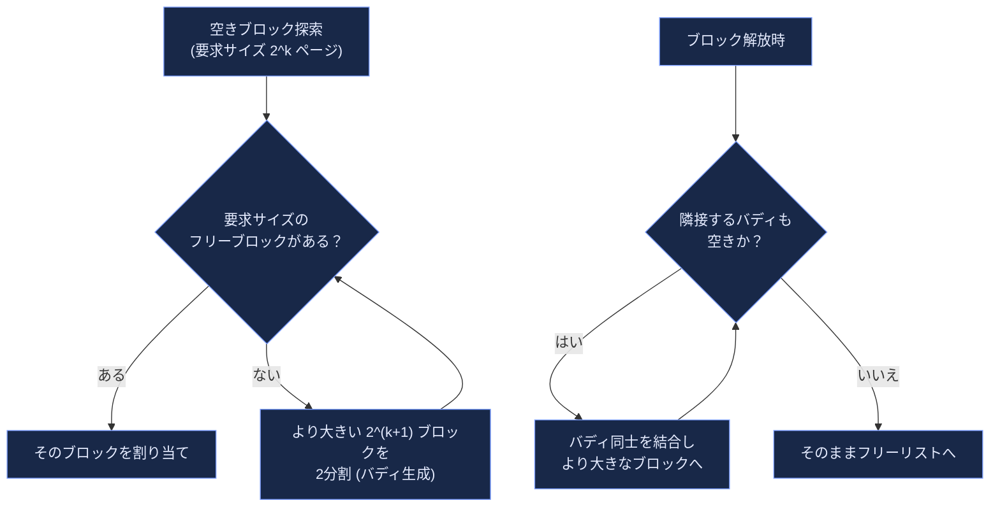

### 8.2 メモリ領域管理：スラブアロケータ

バディシステムはページ単位（4KB刻み）の粗い粒度でしか割り当てできません。カーネル内部では `task_struct` や `inode` のように、数十〜数百バイトの小さなオブジェクトを頻繁に確保・解放する必要があります。この用途向けに、原著8.2節は**スラブアロケータ（Slab Allocator）**を解説します。

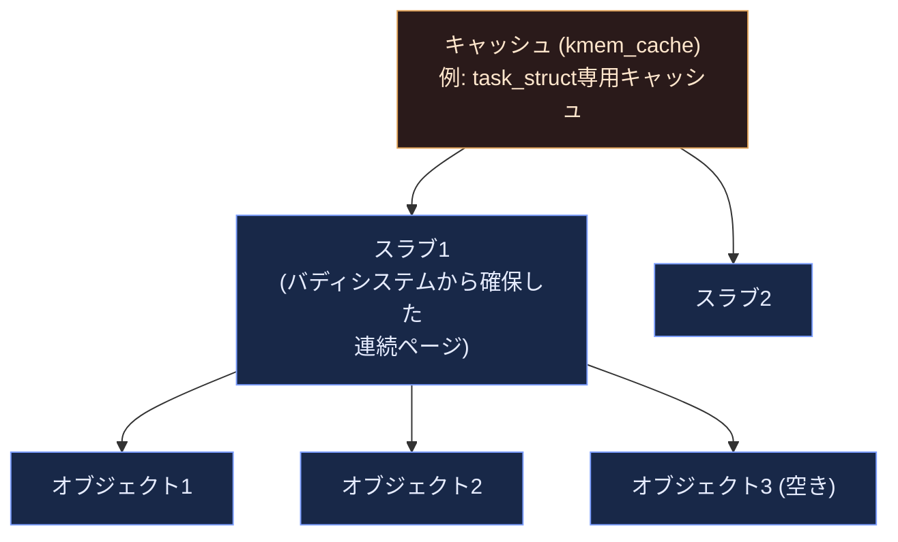

原著が解説するオリジナルのスラブアロケータ（Solaris由来のアイデア、Sun MicrosystemsのJeff Bonwickが考案）は、その後 **SLUB**（現在のデフォルト）や **SLOB**（組み込み向け軽量版、後に廃止）といった代替実装に置き換わりました。SLUBはマルチコア環境でのスケーラビリティを重視し、per-CPUキャッシュを活用してロック競合を減らす設計です。`/proc/slabinfo` や `slabtop` コマンドで、現在どのキャッシュがどれだけメモリを消費しているか確認できます。

### 8.3 非連続メモリ領域（vmalloc）

物理的に連続していないページフレームを、仮想アドレス空間上では連続して見えるようにマッピングする仕組みが `vmalloc()` です。大きなサイズを要求する際、物理メモリの断片化によりバディシステムで連続領域を確保できない場合に使われます（`kmalloc()` が物理的に連続したメモリを返すのに対し、`vmalloc()` は仮想的にのみ連続）。

> **ベストプラクティス**: カーネルモジュール開発では、小さく頻繁に確保・解放するオブジェクトには `kmalloc()`/専用スラブキャッシュ、大きな一括確保には `vmalloc()` を使い分けるのが定石です。ユーザー空間の類推でいえば、`kmalloc()` はスタック的に高速だがサイズ制約があり、`vmalloc()` はヒープ的に柔軟だがTLBミスのコストが相対的に高い、というトレードオフになります。

---

## 第9部：プロセスアドレス空間（原著 Ch.9 Process Address Space）

### 9.1〜9.2 プロセスのアドレス空間とメモリディスクリプタ

各プロセスは、独自の仮想アドレス空間（`mm_struct`、メモリディスクリプタ）を持ちます。カーネルスレッドは通常のユーザー空間を持たないため、直前に実行していた通常プロセスの `mm_struct` を「借用」する最適化（`active_mm`）が行われます。

### 9.3 メモリ領域（VMA: Virtual Memory Area）

プロセスのアドレス空間は、目的別に区切られた「メモリ領域（VMA）」の集合として管理されます。典型的なプロセスのアドレス空間レイアウトは次のようになります。

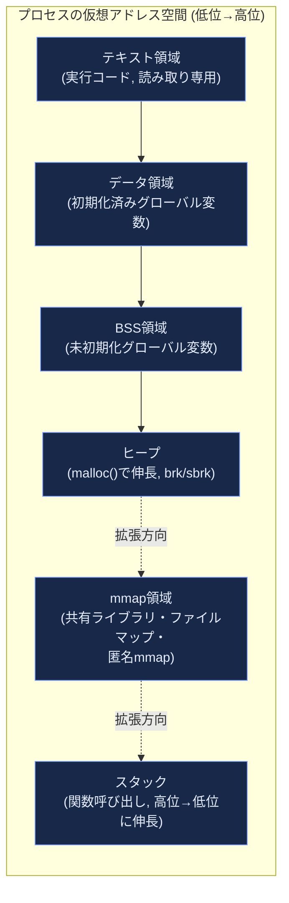

各VMAは、開始・終了アドレス、アクセス権（読み取り/書き込み/実行）、対応するファイル（ファイルマップの場合）などのメタデータを持ちます。`find_vma()` は指定アドレスに最も近いVMAを、`get_unmapped_area()` は新規マッピング用の空き領域を探索する関数です。

### 9.4 ページフォルト例外ハンドラ

**ページフォルト**は、CPUがページテーブルを参照した際に「そのページが現在物理メモリ上に存在しない、またはアクセス権限がない」ことを検出して発生させる例外です。原著9.4節は、この例外を「正常系」と「異常系」に分類します。

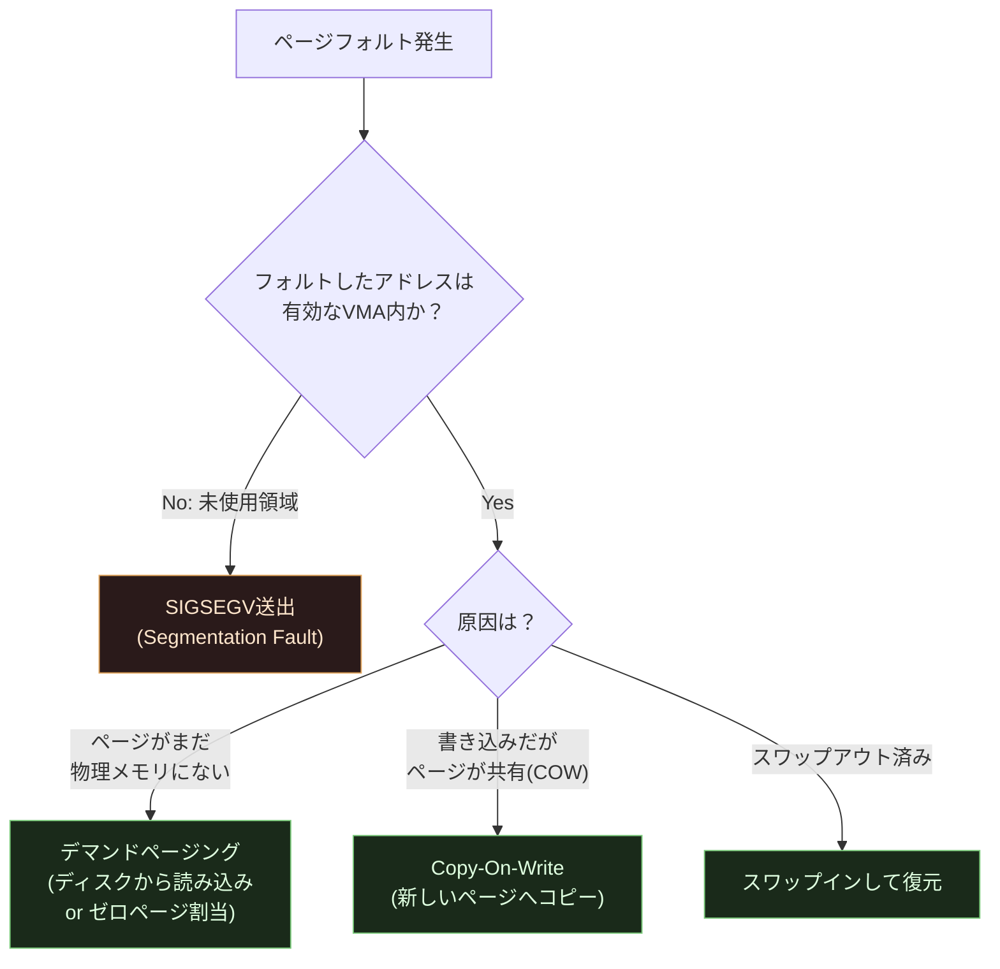

**デマンドページング（Demand Paging）**: プロセス生成やファイルmmap時点では実際のメモリ確保・ディスク読み込みは行わず、実際にそのページへアクセスがあって初めて物理メモリを割り当てる遅延評価戦略。メモリ効率と起動速度を大きく改善します。

**Copy-On-Write（COW）**: `fork()` 直後、親子プロセスは物理的に同じページを共有し（読み取り専用としてマップ）、どちらかが書き込もうとした瞬間にページフォルトが発生し、そこで初めて実際のコピーが行われる最適化。第3部で触れた `fork()` の高速化の正体はこれです。

### 9.5〜9.6 アドレス空間の生成・削除とヒープ管理

`execve()` 実行時にアドレス空間が新規作成され（第20部で詳述）、プロセス終了時に破棄されます。ヒープの伸長は伝統的に `brk()`/`sbrk()` システムコールで行われますが、`malloc()` の内部実装（glibcのptmallocなど）は、小さな確保には `brk()` を、大きな確保には `mmap()`（匿名マッピング）を使い分けています。

> **ベストプラクティス**: メモリリークの調査では、`/proc/<pid>/smaps` や `pmap -x <pid>` でVMAごとのメモリ使用量を可視化できます。「Heap」セグメントだけでなく「anon」（匿名mmap領域）の肥大化も見逃さないようにしてください。大きなオブジェクトはmalloc実装がmmapで確保するため、ヒープではなく匿名マッピング領域に現れます。

---

## 第10部：システムコール（原著 Ch.10 System Calls）

### 10.1〜10.2 POSIX APIとシステムコールハンドラ

**システムコール**は、ユーザー空間のプログラムがカーネルへ処理を依頼するための、唯一の正規の入り口です。原著は、glibcなどのライブラリが提供する「POSIX API」（例: `fopen()`）と、その内部で実際に呼ばれる「生のシステムコール」（例: `open()`）を区別して説明します。1つのライブラリ関数が複数のシステムコールを組み合わせて実装されていることもあれば、逆に複数のライブラリ関数が同じシステムコールを共有していることもあります。

### 10.3 システムコールの発行・終了

x86における伝統的なシステムコール発行方法は `int $0x80` ソフトウェア割り込みでした。原著が解説するこの方式は、割り込みディスクリプタテーブル経由で処理されるため相応のオーバーヘッドがあります。これを高速化するために導入されたのが `sysenter`/`sysexit` 命令（32bit）、そして64bit環境の `syscall`/`sysret` 命令です。

```mermaid
flowchart LR
    subgraph Legacy["伝統的方式 (原著が解説)"]
        L1["int $0x80"] --> L2["IDT経由でディスパッチ<br/>(比較的低速)"]
    end
    subgraph Modern["現代の高速方式"]
        M1["syscall命令 (x86-64)"] --> M2["MSRに登録された<br/>ハンドラへ直接ジャンプ<br/>(高速)"]
    end

    classDef oldFill fill:#2a1a1a,stroke:#e0a35a,color:#ffe6cc
    classDef newFill fill:#1a2a1a,stroke:#7ac97a,color:#dfffe0
    class L1,L2 oldFill
    class M1,M2 newFill
```

原著が触れる **vsyscallページ** は、頻繁に呼ばれる一部のシステムコール（`gettimeofday()` など）をユーザー空間内の固定アドレスにマッピングし、モード切替なしで実行できるようにする最適化でした。セキュリティ上の懸念（固定アドレスがROP攻撃の標的になりやすい）から、現代のカーネルは **vDSO（virtual Dynamic Shared Object）** という、ASLR（アドレス空間配置のランダム化）に対応した後継の仕組みに置き換えています。

### 10.4 パラメータの受け渡しと検証

システムコールに渡されたユーザー空間のポインタは、カーネルが信頼してそのまま使うことは絶対にできません。原著10.4節が解説する**アクセス検証**（`copy_from_user()`, `copy_to_user()` を通じたポインタの正当性チェック）は、Linuxのセキュリティモデルの基本です。**例外テーブル（Exception Table）**は、ユーザーポインタの不正アクセスで発生したページフォルトを、システムコール中断ではなく「エラーコードを返す」形へ変換するための、コンパイル時に生成される特殊なメタデータです。

> **ベストプラクティス**: カーネルモジュールやシステムコールを書く際、ユーザー空間から渡されたポインタへ直接 `*ptr` のようにアクセスすることは絶対に避け、必ず `copy_from_user()`/`copy_to_user()`（あるいはBPFの `bpf_probe_read_user()` のような安全なヘルパー）を経由してください。これを怠ると、悪意あるユーザー空間プログラムに任意のカーネルメモリ読み書きを許してしまう深刻な脆弱性になります。

### 10.5 カーネルラッパールーチン

多くのシステムコールは、アーキテクチャ非依存の実処理関数（`sys_read()` など）と、アーキテクチャ依存の薄いラッパー（レジスタからの引数取り出しなど）に分離されています。

---

## 第11部：シグナル（原著 Ch.11 Signals）

### 11.1 シグナルの役割

シグナルは、プロセスに対して非同期にイベントを通知する、Unix系OS最古のIPC（プロセス間通信）機構の一つです。`kill -9` の `SIGKILL`、Ctrl+Cで送られる `SIGINT`、不正メモリアクセスで発生する `SIGSEGV` など、多くの開発者が日常的に触れる仕組みです。

原著11.1.2節が触れる「POSIXシグナルとマルチスレッドアプリケーション」の関係は現代でも重要な注意点です。シグナルはプロセス全体（スレッドグループ）に配送されることもあれば、特定の1スレッドに配送されることもあり、`pthread_sigmask()` によるスレッドごとのシグナルマスク制御が必要になります。

### 11.2〜11.3 シグナルの生成と配送

```mermaid
flowchart TB
    Gen["シグナル生成<br/>(kill()/tkill()/カーネル内部)"] --> Pending["保留シグナルキューへ追加"]
    Pending --> Check{"配送先プロセスは<br/>そのシグナルを<br/>ブロックしているか？"}
    Check -- "はい" --> Wait["ブロック解除まで保留"]
    Check -- "いいえ" --> Deliver["次にユーザーモードへ<br/>戻るタイミングで配送"]
    Deliver --> Action{"アクション種別"}
    Action -- "デフォルト" --> Default["デフォルト動作<br/>(終了・無視・停止・コアダンプ)"]
    Action -- "無視" --> Ignore["何もしない"]
    Action -- "カスタムハンドラ" --> Handler["シグナルハンドラを<br/>ユーザースタック上で実行"]

    classDef n1 fill:#182848,stroke:#7c9eff,color:#e6ecff
    class Gen,Pending,Check,Wait,Deliver,Action,Default,Ignore,Handler n1
```

原著11.3.2節が解説する「シグナルハンドラの起動」は、カーネルがユーザースタック上に**シグナルフレーム**を構築し、あたかもユーザープログラムが自発的にハンドラ関数を呼び出したかのように制御を渡す、という巧妙な仕組みです。ハンドラの実行が終わると、`sigreturn` システムコールによって元のコンテキストへ復帰します。

### システムコールの再実行

シグナルハンドラの実行によって中断されたシステムコール（`read()` の途中でシグナルを受信した場合など）は、`SA_RESTART` フラグの有無によって「自動的に再実行される」か「`EINTR` エラーを返す」かが決まります。原著11.3.3節が説明するこの挙動は、堅牢なシステムコールラッパーを書く上で今も注意すべきポイントです。

### 11.4 シグナル関連のシステムコール

`kill()`, `sigaction()`（シグナルハンドラの設定）, `sigprocmask()`（ブロックするシグナル集合の変更）, `sigsuspend()` などが原著で解説されます。リアルタイムシグナル（`SIGRTMIN`〜`SIGRTMAX`）は、標準シグナルと異なりキューイングされ、失われることがない拡張です。

> **ベストプラクティス**: シグナルハンドラの中では、`printf()` のような非async-signal-safeな関数の呼び出しを避けてください。ハンドラが割り込んだタイミングでロックを保持していた場合、ハンドラ内で同じロックを取ろうとしてデッドロックする典型的なバグパターンがあります。複雑な処理が必要な場合は、`signalfd()` でシグナルをファイルディスクリプタとして扱い、通常のイベントループ（`epoll`）で処理する設計が推奨されます。

---

## 第12部：仮想ファイルシステム（VFS）（原著 Ch.12 The Virtual Filesystem）

### 12.1 VFSの役割

Linuxは ext4, XFS, Btrfs, NFS, FAT32 など多種多様なファイルシステムを、アプリケーションからは**同一のシステムコールインターフェース**（`open()`, `read()`, `write()` など）で扱えるようにしています。これを実現しているのが**VFS（Virtual Filesystem Switch）**という抽象化レイヤーです。原著12.1節は、この「共通ファイルモデル（Common File Model）」の設計思想を解説します。

```mermaid
flowchart TB
    App["アプリケーション<br/>open()/read()/write()"] --> VFS["VFS<br/>(共通インターフェース)"]
    VFS --> Ext4["ext4"]
    VFS --> XFS["XFS"]
    VFS --> Btrfs["Btrfs"]
    VFS --> NFS["NFS<br/>(ネットワークファイルシステム)"]
    VFS --> ProcFS["procfs/sysfs<br/>(擬似ファイルシステム)"]

    classDef n1 fill:#182848,stroke:#7c9eff,color:#e6ecff
    class App,VFS n1
    classDef fsFill fill:#2a1a1a,stroke:#e0a35a,color:#ffe6cc
    class Ext4,XFS,Btrfs,NFS,ProcFS fsFill
```

### 12.2 VFSの4大オブジェクト

原著12.2節が解説するVFSの中核データ構造は、現代のカーネルでも変わらず健在です。

| オブジェクト | 役割 |
|---|---|
| スーパーブロックオブジェクト | マウントされたファイルシステム全体のメタデータ（種類、サイズ、マウントオプション） |
| inodeオブジェクト | 個々のファイル・ディレクトリのメタデータ（サイズ、権限、タイムスタンプ、データブロック位置） |
| ファイルオブジェクト | プロセスが「開いている」ファイルの状態（現在のオフセット、アクセスモード） |
| dentryオブジェクト（ディレクトリエントリ） | パス名の構成要素とinodeの対応関係。ディレクトリ階層のキャッシュ |

```mermaid
flowchart LR
    SB["スーパーブロック<br/>(ファイルシステム全体)"] --> Inode1["inode<br/>(ファイルA)"]
    SB --> Inode2["inode<br/>(ファイルB)"]
    Dentry1["dentry<br/>('/var/data/a.txt')"] -.対応.-> Inode1
    File1["fileオブジェクト<br/>(プロセスXが開いている)"] -.参照.-> Dentry1

    classDef n1 fill:#182848,stroke:#7c9eff,color:#e6ecff
    class SB,Inode1,Inode2,Dentry1,File1 n1
```

**dentryキャッシュ（dcache）**は、パス名からinodeへの変換結果をキャッシュし、繰り返し行われるファイルパス解決を高速化します。`ls`, `find` のようなコマンドの体感速度が、初回実行より2回目以降の方が速いのは、多くの場合このキャッシュ効果です。

### 12.3〜12.4 ファイルシステムの種類とマウント

原著12.4.1節が解説する**名前空間（namespace）**は、当時は「プロセスごとに異なるマウントポイント構成を持てる」という比較的マニアックな機能でしたが、2013年前後からDockerなどのコンテナ技術がこの仕組み（マウント名前空間）を土台に構築されたことで、Linuxカーネルの中でも特に注目される機能へと変貌しました（詳細は第22部）。

**特殊ファイルシステム**: `procfs`（`/proc`、実行中プロセスの情報をファイルとして公開）、`sysfs`（`/sys`、デバイスモデルの情報を公開）、`tmpfs`（メモリ上に存在する一時ファイルシステム）などは、実データを持たず、カーネル内部の状態を動的に生成してファイルのように見せる「疑似ファイルシステム」です。

### 12.5 パス名の探索（Pathname Lookup）

`/var/data/document.txt` のようなパスを解決する際、カーネルはルートから順に各コンポーネントをdentryキャッシュ・実ディスクと照合しながら辿ります。

```mermaid
flowchart LR
    Root["/"] --> Var["var"] --> Data["data"] --> Doc["document.txt"]
    Root -.dcacheヒット.-> CacheNote["キャッシュされていれば<br/>ディスクI/Oなしで即座に解決"]

    classDef n1 fill:#182848,stroke:#7c9eff,color:#e6ecff
    class Root,Var,Data,Doc n1
    classDef noteFill fill:#1a2a1a,stroke:#7ac97a,color:#dfffe0
    class CacheNote noteFill
```

シンボリックリンクの解決では、無限ループ防止のための再帰深度制限（`MAXSYMLINKS`）が設けられています。

### 12.6〜12.7 VFSシステムコールの実装とファイルロック

`open()`, `read()`, `write()`, `close()` の各システムコールが、VFS層でどのように具体的なファイルシステムのメソッド（`file_operations` 構造体を通じて）に委譲されるかが原著12.6節で解説されます。原著12.7節のファイルロックには、伝統的な `flock()`（ファイル全体をロック、BSD由来）と `fcntl()`（バイト範囲ロック、POSIX由来）の2系統があり、両者の意味論の違い（プロセス単位かファイルディスクリプタ単位か等）は現在も互換性トラブルの原因になりやすいポイントです。

> **ベストプラクティス**: 複数プロセスから同じファイルへロックをかける場合、`flock()` と `fcntl()` を混在させないでください。両者は独立したロック機構であり、片方でロックを取っても、もう片方の呼び出しからは「ロックされていない」ように見えるため、意図しない同時書き込みが発生します。

---

## 第13部：I/Oアーキテクチャとデバイスドライバ（原著 Ch.13 I/O Architecture and Device Drivers）

### 13.1 I/Oアーキテクチャ

CPUがデバイスと通信する方法は、大きく「I/Oポート（`in`/`out` 命令でアクセスする専用アドレス空間）」と「メモリマップドI/O（MMIO、通常のメモリアドレス空間の一部にデバイスレジスタをマッピング）」の2種類があります。現代のPCIeデバイスの多くはMMIOを使用しています。

### 13.2 デバイスドライバモデル

原著13.2節が解説する**sysfsファイルシステム**と**kobject**の仕組みは、Linuxのデバイス管理の統一的な基盤として現在も中核を担っています。

```mermaid
flowchart TB
    Kobj["kobject<br/>(基本単位: 参照カウント・<br/>sysfsエントリを持つ)"] --> Device["Device<br/>(物理/論理デバイス)"]
    Kobj --> Driver["Driver<br/>(デバイスを操作するコード)"]
    Kobj --> Bus["Bus<br/>(PCI, USB, I2C等)"]
    Kobj --> Class["Class<br/>(機能種別: ブロック,<br/>ネットワーク, TTY等)"]
    Bus -- "デバイスとドライバの<br/>マッチング" --> Device
    Bus -- "デバイスとドライバの<br/>マッチング" --> Driver

    classDef n1 fill:#182848,stroke:#7c9eff,color:#e6ecff
    class Kobj,Device,Driver,Bus,Class n1
```

`/sys` 以下のディレクトリツリーは、このkobjectの階層構造をそのままファイルシステムとして可視化したものです。`udev`（現在は `systemd-udevd` に統合）は、この `sysfs` の変化（デバイスの抜き差し）をカーネルから `netlink` ソケット経由で受け取り、`/dev` 以下のデバイスファイルを動的に生成する役割を担います。

### 13.3 デバイスファイル

原著13.3節は、デバイスファイル（`/dev/sda`, `/dev/tty0` など）の番号割り当て（メジャー番号・マイナー番号）と、`udev` による動的なデバイスファイル生成の仕組みを解説します。

### 13.4〜13.5 デバイスドライバの実装

**ポーリングモード**（CPUがデバイスの状態を繰り返し確認する）と**割り込みモード**（デバイスがCPUに通知する）の使い分け、**DMA（Direct Memory Access）**（CPUを介さずデバイスとメモリ間で直接データ転送する仕組み）は、原著13.4節の中心的なトピックです。DMAは、CPUがデータ転送を待つ無駄な時間を排除し、転送中もCPUが他の処理を実行できるようにする、パフォーマンス上重要な機構です。

```mermaid
flowchart LR
    subgraph Without["DMAなしの場合"]
        W1["CPUがデバイスから<br/>1バイトずつコピー"] --> W2["CPU時間を大きく消費"]
    end
    subgraph With["DMAありの場合"]
        D1["CPUはDMAコントローラに<br/>転送を指示するだけ"] --> D2["デバイスとメモリ間で<br/>直接転送"] --> D3["転送完了時のみ<br/>割り込みでCPUに通知"]
    end

    classDef oldFill fill:#2a1a1a,stroke:#e0a35a,color:#ffe6cc
    classDef newFill fill:#1a2a1a,stroke:#7ac97a,color:#dfffe0
    class W1,W2 oldFill
    class D1,D2,D3 newFill
```

キャラクタデバイスドライバ（原著13.5節）は、シーケンシャルなバイトストリームとしてアクセスされるデバイス（シリアルポート、キーボード等）向けのシンプルなインターフェースを提供します。

---

## 第14部：ブロックデバイスドライバ（原著 Ch.14 Block Device Drivers）

### 14.1〜14.2 ブロックデバイスの扱いとジェネリックブロック層

ブロックデバイス（ディスク）は、キャラクタデバイスと異なり「固定サイズのブロック単位でランダムアクセス可能」という特徴を持ちます。原著14.2節が解説する **bio構造体（Block I/O）**は、1回のI/O要求を表現するデータ構造で、複数のセグメント（メモリ上の分散したバッファ）をひとまとめにして1つのI/O要求として発行できるようにする仕組みです。

### 14.3 I/Oスケジューラ

原著14.3.4節は、当時利用可能だった4種類のI/Oスケジューラ（elevator）を解説しています。

| I/Oスケジューラ（2005年当時） | 特徴 |
|---|---|
| Noop | 並べ替えを行わず単純にキューイングするのみ。SSD等シーク時間が無視できるデバイス向け |
| CFQ (Completely Fair Queuing) | プロセスごとに公平にI/O帯域を割り当てる |
| Deadline | 各リクエストに期限を設け、飢餓状態を防ぐ |
| Anticipatory | 直後に追加のI/O要求が来ることを見越して、あえて少し待つ |

これらはすべて**回転するディスク（HDD）のシーク時間最適化**を主眼に設計されたスケジューラでした。しかし、SSD/NVMeストレージの普及によって前提が根本から変わりました。

```mermaid
flowchart TB
    A["原著の時代:<br/>HDD前提のI/Oスケジューラ<br/>(Noop/CFQ/Deadline/Anticipatory)<br/>シングルキュー + シングルロック"] -->|SSD/NVMe普及、<br/>マルチコアCPU時代へ| B["blk-mq<br/>(Multi-Queue Block Layer)<br/>2013年 Linux 3.13〜"]
    B --> C["mq-deadline / kyber / bfq<br/>(マルチキュー対応スケジューラ)"]
    B --> D["NVMe: CPUコアごとに<br/>専用キューを持ち、<br/>ロック競合を最小化"]

    classDef oldFill fill:#2a1a1a,stroke:#e0a35a,color:#ffe6cc
    classDef newFill fill:#1a2a1a,stroke:#7ac97a,color:#dfffe0
    class A oldFill
    class B,C,D newFill
```

**blk-mq（マルチキューブロックレイヤー）**への刷新は、原著が解説する「シングルキュー＋シングルロック」というブロックI/O層の根本設計を、マルチコアCPU・超高速NVMeデバイスの時代に合わせて全面的に書き直したものです。1つの共有キューがボトルネックになっていた問題を、CPUコアごと（あるいはハードウェアキューごと）に独立したキューを持たせることで解消しました。

### 14.4〜14.5 ブロックデバイスドライバの登録と初期化

原著14.4節が解説する「ディスクディスクリプタ（gendisk）の初期化」「リクエストキューの割り当て」「割り込みハンドラの設定」といったドライバ登録の流れは、blk-mq移行後も概念としては引き継がれていますが、具体的なAPI（`blk_mq_alloc_tag_set()` など）は大きく刷新されています。

> **ベストプラクティス**: クラウドVMやコンテナホストでディスクI/O性能をチューニングする際は、まず `cat /sys/block/<device>/queue/scheduler` で現在有効なI/Oスケジューラを確認してください。NVMeデバイスでは多くの場合 `none`（スケジューリングなし、blk-mqのマルチキューにハードウェア側で任せる）が最適ですが、単一のSATA SSD/HDDでは `mq-deadline` や `bfq` が有効なケースもあります。

---

## 第15部：ページキャッシュ（原著 Ch.15 The Page Cache）

### 15.1 ページキャッシュとは

ディスクI/Oはメモリアクセスに比べて桁違いに遅いため、Linuxは一度読み込んだファイルの内容を**ページキャッシュ**としてメモリ上に保持し、次回以降のアクセスをメモリ速度で処理できるようにしています。原著15.1節が解説する `address_space` オブジェクトは、1つのファイル（正確にはinode）に紐づくページキャッシュのページ群を管理する構造体です。

原著が解説する**radix tree**（ページオフセットからページディスクリプタへの高速な検索木）は、現代のカーネルではより汎用的な **XArray** というデータ構造に置き換わっています（Linux 4.20、2018年、Matthew Wilcoxによる設計）。XArrayはradix treeの機能を包含しつつ、RCUと組み合わせた安全な並行アクセスをより扱いやすくしたAPIを提供します。

```mermaid
flowchart TB
    App["アプリケーションの read()"] --> Check{"該当ページは<br/>ページキャッシュに<br/>存在するか？"}
    Check -- "Yes: キャッシュヒット" --> Fast["メモリから即座にコピー<br/>(ディスクI/O不要)"]
    Check -- "No: キャッシュミス" --> Disk["ディスクから読み込み"]
    Disk --> Insert["ページキャッシュへ格納"]
    Insert --> Fast

    classDef n1 fill:#182848,stroke:#7c9eff,color:#e6ecff
    class App,Check,Fast,Disk,Insert n1
```

### 15.2 ブロックのページキャッシュ格納

**バッファヘッド（buffer head）**は、ページキャッシュ上の1ページを、ファイルシステムのブロックサイズ（例: ext4なら通常4KB）単位で細分化して管理するためのメタデータです。原著が解説するこの仕組みは現代でも存在しますが、大きなI/O向けには、より軽量な `struct bio` ベースの経路（バッファヘッドを経由しない直接的なページI/O）が優先して使われるようになっています。

### 15.3 ダーティページの書き戻し

メモリ上で変更された（ディスクの内容と一致しなくなった）ページを「ダーティページ」と呼びます。原著が解説する `pdflush` カーネルスレッド群（複数のダーティページ書き戻し専用スレッド）は、Linux 2.6.32以降 **per-BDI flusher thread**（バッキングデバイス情報ごとに1本の書き戻しスレッド）方式に置き換わりました。これにより、1台の低速デバイスへの書き戻し待ちが、他の高速デバイスへの書き戻しをブロックしてしまう問題が解消されています。

```mermaid
flowchart LR
    Write["write() でページを変更"] --> Dirty["ダーティページとしてマーク"]
    Dirty --> Trigger{"書き戻しのトリガー"}
    Trigger -- "定期的" --> Periodic["dirty_writeback_centisecsごと"]
    Trigger -- "ダーティページが<br/>閾値を超過" --> Threshold["dirty_ratio到達"]
    Trigger -- "明示的" --> Explicit["sync()/fsync()呼び出し"]
    Periodic --> Flush["per-BDI flusherスレッドが<br/>ディスクへ書き戻し"]
    Threshold --> Flush
    Explicit --> Flush

    classDef n1 fill:#182848,stroke:#7c9eff,color:#e6ecff
    class Write,Dirty,Trigger,Periodic,Threshold,Explicit,Flush n1
```

### 15.4 sync()、fsync()、fdatasync()

原著が解説するこれら3つのシステムコールの違い（`sync()`＝システム全体のダーティページを書き戻す、`fsync()`＝特定ファイルのデータとメタデータを書き戻す、`fdatasync()`＝データのみ書き戻す）は現在も変わりません。

> **ベストプラクティス**: `/proc/sys/vm/dirty_ratio` と `/proc/sys/vm/dirty_background_ratio` は、書き込み性能とクラッシュ時のデータ損失リスクのトレードオフを調整するカーネルパラメータです。データベースサーバーのようにデータ整合性が重要なワークロードでは、これらの値を小さくして頻繁な書き戻しを促す一方、`fsync()` の呼び出しコストとのバランスを取る必要があります。

---

## 第16部：ファイルアクセス（原著 Ch.16 Accessing Files）

### 16.1 ファイルの読み書き

原著16.1節は、`read()`/`write()` システムコールが、前述のVFS・ページキャッシュ層を通じてどのように実装されているかを解説します。**リードアヘッド（Read-Ahead）**は、シーケンシャルアクセスパターンを検出した場合に、要求された範囲より先のデータを先読みしてページキャッシュに載せておく最適化です。

### 16.2 メモリマッピング（mmap）

`mmap()` システムコールは、ファイルの内容を直接プロセスのアドレス空間にマッピングし、`read()`/`write()` の代わりにメモリアクセス（ポインタの読み書き）としてファイル操作を行える仕組みです。

```mermaid
flowchart TB
    subgraph ReadWrite["read()/write() 方式"]
        RW1["ユーザーバッファ確保"] --> RW2["read()でカーネルが<br/>ページキャッシュから<br/>ユーザーバッファへコピー"]
    end
    subgraph Mmap["mmap() 方式"]
        M1["mmap()でファイルを<br/>アドレス空間にマップ"] --> M2["ポインタで直接<br/>ページキャッシュを参照<br/>(コピー不要、<br/>デマンドページングで実現)"]
    end

    classDef n1 fill:#182848,stroke:#7c9eff,color:#e6ecff
    class RW1,RW2,M1,M2 n1
```

mmapされたファイルへの初回アクセスは、第9部で解説したページフォルト機構によってオンデマンドに処理されます（デマンドページング）。データベースエンジンや大規模データ処理システムが `mmap()` を好んで使うのは、この「コピーの削減」と「OSのページキャッシュ管理に任せられる」という利点のためです。

### 16.3〜16.4 ダイレクトI/Oと非同期I/O

**ダイレクトI/O**（`O_DIRECT` フラグ）は、あえてページキャッシュをバイパスし、ユーザーバッファとディスクの間で直接データ転送を行う仕組みです。データベースなど独自のバッファキャッシュ管理を行うアプリケーションが、OSのキャッシュとの二重管理を避けるために使用します。

原著16.4節は「Linux 2.6における非同期I/O（AIO）」を紹介していますが、当時のPOSIX AIO実装は用途が限定的（`O_DIRECT`のブロックデバイスなど）で、広く使われるには至りませんでした。この領域は2019年、原著出版から14年後に劇的な進化を遂げます。

### 2019年以降：io_uringによる非同期I/Oの刷新

**io_uring**（Jens Axboe設計、Linux 5.1、2019年）は、従来のPOSIX AIOやepollベースの非同期処理が抱えていた制約（システムコールのオーバーヘッド、バッファI/Oへの非対応、複雑なAPI）を一掃する、ユーザー空間とカーネル空間で共有するリングバッファ（SQ: Submission Queue / CQ: Completion Queue）ベースの汎用非同期I/Oインターフェースです。

```mermaid
flowchart LR
    subgraph UserSpace["ユーザー空間"]
        SQE["SQE作成<br/>(送信したいI/O要求)"]
    end
    SQ["Submission Queue<br/>(共有リングバッファ)"]
    Kernel["カーネル: I/O処理を実行<br/>(システムコール発行なしで<br/>複数要求をまとめて処理可能)"]
    CQ["Completion Queue<br/>(共有リングバッファ)"]
    subgraph UserSpace2["ユーザー空間"]
        CQE["CQE受信<br/>(完了通知をポーリング/待機)"]
    end

    SQE --> SQ --> Kernel --> CQ --> CQE

    classDef n1 fill:#182848,stroke:#7c9eff,color:#e6ecff
    class SQE,SQ,Kernel,CQ,CQE n1
```

io_uringの鍵となる利点は、ユーザー空間とカーネル空間が同じメモリ領域（リングバッファ）を共有することで、**システムコールの発行回数そのものを大幅に削減**できる点です。ファイルI/Oだけでなく、ネットワークI/O（ゼロコピー送受信）、`openat()`, `close()` など多様な操作へと対応範囲が拡大し続けています。2026年時点では、大規模Webサービス（Cloudflareのエッジランタイム等）や高性能データベース、ストレージシステムでの採用が進んでいます。

> **出典**: "The Design and Evolution of io_uring" by Jens Axboe — https://unixism.net/loti/what_is_io_uring.html ／ Jens Axboe, io_uringメンテナ, Linuxブロック層メンテナ

> **ベストプラクティス**: 高スループットが要求されるI/O集約型アプリケーション（プロキシ、データベース、ストレージエンジン）を新規開発する場合、`epoll` ベースの伝統的な非同期モデルに加えて `io_uring`（多くの言語で `tokio-uring`, `liburing` などのバインディングが提供されている）の採用を検討する価値があります。ただし、カーネルバージョン要件（機能によっては比較的新しいカーネルが必要）とセキュリティ面の考慮（一部のコンテナ環境ではseccompプロファイルの制約でio_uringが無効化されていることがある）を事前に確認してください。

---

## 第17部：ページフレーム回収（原著 Ch.17 Page Frame Reclaiming）

### 17.1 ページフレーム回収アルゴリズム（PFRA）

物理メモリは有限であるため、カーネルは「使われていない、あるいは使用頻度の低いページ」を見つけて回収し、新たな確保要求に再利用する必要があります。これが**PFRA（Page Frame Reclaiming Algorithm）**です。

### 17.2 逆マッピング（Reverse Mapping）

あるページを回収したい（＝物理メモリから追い出したい）とき、カーネルは「そのページが**どのプロセスの、どの仮想アドレスに**マッピングされているか」を知る必要があります。原著17.2節が解説する**逆マッピング（rmap）**の仕組みは、通常のページテーブル探索（仮想アドレス→物理アドレス）とは逆方向（物理ページ→それを参照している全プロセスの仮想アドレス）の検索を可能にします。

```mermaid
flowchart LR
    Page["物理ページフレーム"] -.rmap: 逆方向検索.-> VMA1["プロセスAのVMA"]
    Page -.rmap: 逆方向検索.-> VMA2["プロセスBのVMA<br/>(共有ライブラリ等で共有)"]
    VMA1 --> PTE1["プロセスAのPTE"]
    VMA2 --> PTE2["プロセスBのPTE"]

    classDef n1 fill:#182848,stroke:#7c9eff,color:#e6ecff
    class Page,VMA1,VMA2,PTE1,PTE2 n1
```

このrmapがあるからこそ、あるページを回収する際に「そのページを参照している全プロセスのページテーブルエントリを無効化する」という処理が可能になります。

### 17.3 PFRAの実装：LRUリスト

原著17.3節が解説する**LRU（Least Recently Used）リスト**による回収候補の選定は、現代のカーネルでも中核的なアルゴリズムです。ページは「アクティブリスト」と「非アクティブリスト」の2段階（さらに匿名ページとファイルキャッシュページで別々に管理）に分類され、非アクティブリストの末尾から順に回収候補として検討されます。

```mermaid
flowchart TB
    New["新規ページ"] --> Inactive["非アクティブリスト"]
    Inactive -- "参照(アクセス)された" --> Active["アクティブリスト"]
    Active -- "しばらく参照されない" --> Inactive
    Inactive -- "メモリ不足時、<br/>末尾から回収" --> Reclaim{"ダーティか？"}
    Reclaim -- "ファイルキャッシュ<br/>(クリーン)" --> Drop["即座に破棄可能"]
    Reclaim -- "匿名ページ<br/>(プロセスのヒープ等)" --> Swap["スワップ領域へ書き出し"]

    classDef n1 fill:#182848,stroke:#7c9eff,color:#e6ecff
    class New,Inactive,Active,Reclaim,Drop,Swap n1
```

**kswapd**カーネルスレッドは、空きメモリが一定の閾値を下回ると起動し、バックグラウンドでページ回収を行います。緊急時（メモリ枯渇が深刻な場合）は、プロセスのメモリ確保要求自体が同期的に回収処理を実行する「直接回収（direct reclaim）」に切り替わります。

### OOM Killer（Out Of Memory Killer）

回収を試みても十分なメモリを確保できない場合の最終手段として、原著が解説する**OOM Killer**は、システムを守るために「最も殺すべき（＝最もメモリを大量消費し、システムへの重要度が低い）」プロセスを選び強制終了させます。この選定には `oom_score`（各プロセスに付与される「殺されやすさ」スコア）が使われ、`/proc/<pid>/oom_score_adj` で手動調整できます。

> **ベストプラクティス**: コンテナ環境（Kubernetes等）でメモリ上限（limit）を設定している場合、コンテナ内でOOM Killerが発動すると、意図しないプロセス（データベース接続プールなど、システム上重要なプロセス）が巻き添えで殺されることがあります。重要なプロセスには `oom_score_adj` を負の値に設定して優先度を下げる、あるいはそもそもリクエストとリミットの設定を見直して余裕を持たせる設計が推奨されます。

### 17.4 スワッピング

物理メモリが枯渇した際、匿名ページ（ファイルバッキングのないヒープ・スタック等のページ）をディスク上の**スワップ領域**へ退避させる仕組みです。**スワップキャッシュ**は、スワップイン・アウトの一貫性を保つための中間層として機能します。

---

## 第18部：Ext2/Ext3から現代のファイルシステムへ（原著 Ch.18 The Ext2 and Ext3 Filesystems）

### 18.1〜18.3 Ext2の設計

原著18章は、当時Linuxの標準ファイルシステムだった**Ext2**（および原著執筆時点で最新だったジャーナリング拡張版**Ext3**）のディスク上データ構造を詳細に解説します。

```mermaid
flowchart TB
    SB["スーパーブロック<br/>(全体メタデータ)"] --> BG1["ブロックグループ1"]
    SB --> BG2["ブロックグループ2"]
    SB --> BGN["ブロックグループN"]
    BG1 --> GD["グループディスクリプタ"]
    BG1 --> BM["ブロックビットマップ"]
    BG1 --> IM["inodeビットマップ"]
    BG1 --> IT["inodeテーブル"]
    BG1 --> DB["データブロック"]

    classDef n1 fill:#182848,stroke:#7c9eff,color:#e6ecff
    class SB,BG1,BG2,BGN,GD,BM,IM,IT,DB n1
```

Ext2はディスクを「ブロックグループ」に分割し、関連するファイル（同一ディレクトリ内のファイル群など）をなるべく近いブロックグループへ配置することでシーク時間を最小化する設計思想を持っていました。

### 18.7 Ext3とジャーナリング

原著18.7節が解説する**ジャーナリング**は、ファイルシステムのメタデータ変更を「ジャーナル（ログ）」に先行して記録することで、突然の電源断やクラッシュからの復旧を高速かつ確実にする仕組みです（原子的操作＝トランザクションの概念をファイルシステムに導入）。Ext3は、原著の言葉を借りれば「Ext2の完全な互換性を保ちながらジャーナリングを追加する」という保守的なアプローチを取りました。

### 2005年から2026年へ：Linuxファイルシステムの系譜

原著出版から20年、Linuxで利用可能なファイルシステムの選択肢は大きく広がりました。

```mermaid
flowchart LR
    Ext2["Ext2<br/>(原著の主題)"] -->|ジャーナリング追加| Ext3["Ext3<br/>(原著が解説)"]
    Ext3 -->|エクステント・遅延割当<br/>大容量対応| Ext4["Ext4<br/>(2008〜、現在も主要ディストロの<br/>デフォルトの一つ)"]
    XFS["XFS<br/>(元SGI、大容量・並列I/O志向)"] --> Modern["現在の主要選択肢"]
    Ext4 --> Modern
    Btrfs["Btrfs<br/>(CoW, スナップショット,<br/>チェックサム内蔵)"] --> Modern
    ZFS["ZFS on Linux<br/>(ライセンス問題でDKMS配布)"] --> Modern

    classDef oldFill fill:#2a1a1a,stroke:#e0a35a,color:#ffe6cc
    classDef newFill fill:#1a2a1a,stroke:#7ac97a,color:#dfffe0
    class Ext2,Ext3 oldFill
    class Ext4,XFS,Btrfs,ZFS,Modern newFill
```

| ファイルシステム | 特徴 | 2026年時点の位置づけ |
|---|---|---|
| Ext4 | Ext2/3の正統進化版。エクステントベースの割り当て、遅延割り当て、ジャーナルチェックサム | 多くのディストリビューションで依然デフォルト、安定性重視の選択肢 |
| XFS | 高い並列I/O性能、大容量ボリューム向け。Red Hat系ディストリビューションのデフォルト | エンタープライズ・大規模ストレージで広く採用 |
| Btrfs | Copy-on-Write、スナップショット、内蔵RAID、透過的チェックサムによるデータ破損検出 | openSUSE, Fedora Workstationなどでデフォルト採用が進む |
| bcachefs | Kent Overstreetによる新世代CoWファイルシステム。2024年（Linux 6.7）にメインライン入りしたが、開発運用方針を巡るLinus Torvaldsとの対立の末、2025年後半（Linux 6.18）にメインラインカーネルから完全に削除され、DKMS（外部）モジュールとしての配布に移行 | メインライン外での独立開発が継続中 |

> **出典**: "Bcachefs removed from the mainline kernel" (LWN.net) — https://lwn.net/Articles/1040120/ ／ Wikipedia "Bcachefs" — https://en.wikipedia.org/wiki/Bcachefs

### コラム：bcachefsを巡る顛末が示すLinuxカーネル開発の統治構造

2024年1月、Linux 6.7でbcachefsがメインラインへマージされたことは、新しいファイルシステムがLinuxカーネルに採用される稀有な事例として注目されました。しかし2025年、マージウィンドウ（新機能受け入れ期間）外でのバグ修正と称した大規模な機能追加パッチの提出を巡り、リリースマネージャーであるLinus Torvaldsと開発者Kent Overstreetの間で対立が深まり、最終的にTorvaldsは「信頼関係の回復には持続的な協調姿勢の実証が必要」としてbcachefsのメインライン除外を決断しました。

この出来事は、Linuxカーネル開発が単なる技術力だけでなく、「マージウィンドウのルールを守る」「rc（リリース候補）期間中は純粋なバグ修正のみを行う」といった**開発プロセスへの信頼**によって支えられていることを象徴する事例として、業界で広く議論されました。技術的に優れたコードであっても、確立された開発ワークフローへの適合がLinuxカーネルへの統合において同様に重視されるという、オープンソースガバナンスの実例です。

---

## 第19部：プロセス間通信（IPC）（原著 Ch.19 Process Communication）

### 19.1 パイプ

最も基本的なIPC機構である**パイプ**は、シェルの `|` 演算子でおなじみの、片方向のバイトストリーム通信路です。原著19.1節が解説する `pipefs`（特殊ファイルシステム）による実装は現在も基本的に同じ設計です。

```mermaid
flowchart LR
    ProcA["プロセスA<br/>(書き込み側)"] -- "write()" --> Buf["カーネル内<br/>リングバッファ<br/>(通常64KB)"]
    Buf -- "read()" --> ProcB["プロセスB<br/>(読み取り側)"]

    classDef n1 fill:#182848,stroke:#7c9eff,color:#e6ecff
    class ProcA,Buf,ProcB n1
```

### 19.2 FIFO（名前付きパイプ）

通常のパイプは親子関係にあるプロセス間でしか使えませんが、**FIFO**（`mkfifo` で作成）はファイルシステム上に名前を持つため、関係のないプロセス間でも通信路として利用できます。

### 19.3 System V IPC

原著19.3節が解説する **System V IPC**（セマフォ、メッセージキュー、共有メモリ）は、Unix系OSの伝統的なIPC機構群です。`ipcs` コマンドで現在使用中のSystem V IPCリソースを確認できます。共有メモリ（`shmget()`）は、複数プロセスが同一の物理メモリ領域を直接マッピングする、最も高速なIPC手段です。

### 19.4 POSIX メッセージキュー

原著が触れるPOSIXメッセージキュー（`mq_open()` 系API）は、System V IPCより新しい標準化されたインターフェースで、ファイルディスクリプタベースであるため `select()`/`poll()`/`epoll()` と統合しやすいという利点があります。

```mermaid
flowchart TB
    IPC{"IPC機構を選ぶ"}
    IPC -- "単純な親子間の<br/>ストリーム通信" --> Pipe["パイプ"]
    IPC -- "関係ないプロセス間の<br/>ストリーム通信" --> Fifo["名前付きパイプ (FIFO)"]
    IPC -- "最高速のデータ共有" --> Shm["共有メモリ"]
    IPC -- "構造化されたメッセージ<br/>+ epoll統合" --> Mq["POSIXメッセージキュー"]
    IPC -- "ネットワーク経由も<br/>視野に入れる汎用性" --> Socket["Unixドメインソケット /<br/>TCP・UDPソケット"]

    classDef n1 fill:#182848,stroke:#7c9eff,color:#e6ecff
    class IPC,Pipe,Fifo,Shm,Mq,Socket n1
```

> **2026年時点の補足**: 原著の19章はシステムVIPC・POSIX IPC中心の解説にとどまりますが、現代のアプリケーション開発（特にマイクロサービス・コンテナ環境）では、プロセス間通信の主流はUnixドメインソケット、gRPC/HTTPベースのネットワークIPC、あるいはメッセージブローカー（Kafka、RabbitMQ等）へと大きくシフトしています。ただし、単一ホスト内での高速・低レイテンシな通信が必要な場面（データベースエンジンの内部プロセス間連携など）では、共有メモリやUnixドメインソケットが今も現役です。

---

## 第20部：プログラム実行（原著 Ch.20 Program Execution）

### 20.1 実行可能ファイル

原著20.1節は、プログラムが実行される際にカーネルが処理する要素を整理します。

- **プロセスの資格情報とケーパビリティ**: 伝統的なUnixの「root（UID 0）か、それ以外か」という二値的な権限モデルに対し、Linuxの**ケーパビリティ（Capabilities）**は、root権限を `CAP_NET_BIND_SERVICE`（1024番未満のポートへのbind）、`CAP_SYS_ADMIN` など細かい単位に分割し、必要最小限の権限だけをプロセスに付与できるようにする仕組みです。
- **LSM（Linux Security Modules）フレームワーク**: SELinux, AppArmor, Smack といった強制アクセス制御（MAC）システムを、カーネルへプラグイン的に組み込むためのフック機構。原著執筆時点でもすでに存在した設計ですが、現代のクラウドネイティブ環境では、コンテナのサンドボックス化（seccomp-BPFとの組み合わせ）において重要性が増しています。
- **コマンドライン引数と環境変数**: `execve()` の第2・第3引数として渡される `argv[]`, `envp[]`。
- **プログラムセグメントとメモリ領域**: 実行ファイルの各セクション（`.text`, `.data`, `.bss`）が、第9部で説明したVMAとしてどうマッピングされるか。

### 20.2 実行可能フォーマット

Linuxが標準でサポートする実行可能ファイル形式は**ELF（Executable and Linkable Format）**です。原著20.2節はELFの構造（ヘッダ、プログラムヘッダテーブル、セクションヘッダテーブル）を解説します。`file` コマンドで実行ファイルの種類を確認する際に見る「ELF 64-bit LSB executable」という表示は、まさにこのフォーマットです。

```mermaid
flowchart LR
    Shell["シェルが execve() を呼ぶ"] --> Check{"ファイル形式の判定"}
    Check -- "ELFマジックナンバー" --> ELF["ELFローダー<br/>(binfmt_elf)"]
    Check -- "シバン行 #!" --> Script["スクリプトインタプリタへ委譲<br/>(例: #!/bin/bash)"]
    Check -- "その他の登録形式" --> Other["binfmt_miscで登録された<br/>他のインタプリタ<br/>(例: Java, .NET, WASM等)"]
    ELF --> Load["セグメントをVMAへマッピング<br/>(テキスト・データ・動的リンカ)"]
    Load --> Entry["エントリポイントへジャンプ<br/>(通常は動的リンカ ld.so)"]

    classDef n1 fill:#182848,stroke:#7c9eff,color:#e6ecff
    class Shell,Check,ELF,Script,Other,Load,Entry n1
```

### 20.3 実行ドメイン

原著が解説する**実行ドメイン（execution domains）**は、異なるUnix系OS（SCO UnixやSolaris等）向けにコンパイルされたバイナリを、システムコール番号の変換によってLinux上でも動かせるようにする互換性レイヤーの仕組みでした。現代ではその役割は縮小していますが、類似の思想は Windows向けバイナリを動かす **Wine**（システムコールではなくWin32 APIレベルの互換レイヤー）や、異なるアーキテクチャ向けバイナリを実行する `binfmt_misc` + エミュレータ（QEMU user-mode等、Dockerのマルチアーキテクチャビルドで利用）に受け継がれています。

### 20.4 execファミリー関数

`execve()` を土台に、glibcは `execl()`, `execv()`, `execvp()` など複数のバリエーションを提供します。原著20.4節はこれらの違い（引数リスト形式か配列形式か、PATH検索を行うか）を整理します。`fork()` に続けて `exec*()` を呼ぶ「fork-exec」パターンは、シェルがコマンドを実行する際の基本形です。

> **ベストプラクティス**: 高頻度にプロセスを起動するアプリケーション（CIランナー、ビルドシステム等）では、`fork()` のコピーオンライトコストや `exec()` 後の動的リンク解決コストがボトルネックになることがあります。`posix_spawn()`（多くの環境で `vfork()`+`exec()` の組み合わせに最適化される）や、静的リンクバイナリの活用、プロセスプール（ワーカープロセスの再利用）といった対策が有効です。

---

## 第21部：システム起動とモジュール（原著 Appendix A/B）

### A. システム起動

原著付録Aは、電源投入からカーネルが動き出すまでの過程を「時代」になぞらえて詩的に説明しています（原始時代のBIOS、古代のブートローダ、中世のsetup()関数、ルネサンスのstartup_32()関数、近代のstart_kernel()関数）。

```mermaid
flowchart TB
    Power["電源投入"] --> Firmware["ファームウェア初期化<br/>(原著: BIOS<br/>現代: 多くはUEFI)"]
    Firmware --> Boot["ブートローダ<br/>(GRUB2, systemd-boot等)"]
    Boot --> KernelLoad["カーネルイメージ + initramfsを<br/>メモリへロード"]
    KernelLoad --> RealMode["実モード初期化<br/>(setup.S等、最小限の<br/>ハードウェア検出)"]
    RealMode --> ProtectedMode["プロテクトモード/<br/>ロングモードへ移行"]
    ProtectedMode --> StartKernel["start_kernel()<br/>(C言語による本格的な初期化:<br/>メモリ管理・スケジューラ・<br/>VFS等の起動)"]
    StartKernel --> Init["init プロセス (PID 1) 起動<br/>(現代: 多くはsystemd)"]

    classDef n1 fill:#182848,stroke:#7c9eff,color:#e6ecff
    class Power,Firmware,Boot,KernelLoad,RealMode,ProtectedMode,StartKernel,Init n1
```

**2026年時点の補足**: 原著が前提とするBIOSベースの起動は、現代の多くのx86システムで**UEFI（Unified Extensible Firmware Interface）**に置き換わっています。UEFIはBIOSよりも高機能で、大容量ディスクへの対応、セキュアブート（署名検証によるブートローダ・カーネルの改ざん防止）、GPTパーティション形式のネイティブサポートなどを提供します。また、`initramfs`（起動時に必要な最小限のドライバ・ツールを含む一時的なルートファイルシステム）は、実際のルートファイルシステムをマウントするために必要なストレージドライバ（RAID, LVM, 暗号化ボリューム等）を動的にロードする役割を担い、現代のほぼ全てのディストリビューションで標準的に使われています。

### B. モジュール

原著付録Bが解説する**ローダブルカーネルモジュール（LKM）**の仕組みは、カーネルの機能をコンパイル時に固定するのではなく、実行時に動的にロード・アンロードできるようにする仕組みです。

```mermaid
flowchart LR
    Cmd["insmod / modprobe コマンド"] --> Load["モジュールをカーネル<br/>アドレス空間へロード"]
    Load --> Init2["モジュール初期化関数<br/>(module_init())を実行"]
    Init2 --> Register["デバイスドライバ・<br/>ファイルシステム等として登録"]
    Unload["rmmod コマンド"] --> Cleanup["モジュール終了関数<br/>(module_exit())を実行"]
    Cleanup --> Unreg["登録解除・メモリ解放"]

    classDef n1 fill:#182848,stroke:#7c9eff,color:#e6ecff
    class Cmd,Load,Init2,Register,Unload,Cleanup,Unreg n1
```

**モジュール依存関係**は `depmod` によって解決され、`modprobe` は要求されたモジュールが依存する他のモジュールを自動的にロードします。**モジュールライセンス**（`MODULE_LICENSE()` マクロ）は、GPL互換かどうかによって、そのモジュールが利用できるカーネル内部シンボル（`EXPORT_SYMBOL_GPL()` でエクスポートされたもの）の範囲が変わる、Linuxカーネル特有の仕組みです。

> **ベストプラクティス**: サードパーティ製のカーネルモジュール（GPUドライバ等）を導入する際は、`modinfo <module>` でライセンス表記を確認する習慣をつけてください。非GPLモジュール（"proprietary" 表記等）はカーネルに「テイント（汚染）」フラグを立て、`dmesg` にその旨が記録されます。カーネルクラッシュの原因調査時、テイントされたモジュールが関与していないかは重要な切り分けポイントです。

---

## 第22部：2026年最新動向 ― 原著から20年、カーネルはどう変わったか

*Understanding the Linux Kernel* 第3版が対象とした Linux 2.6 系（2005年当時）から、2026年8月現在のカーネルまでの間に、実に20年以上の開発が積み重なりました。この間、Linuxカーネルのソースコード行数は数百万行から3,000万行以上へと膨れ上がり、開発体制・技術的基盤の両面で大きな変化が起きています。ここでは、原著を読んだだけでは分からない「その後」を、主要トピックごとに整理します。

### 22.1 現在のバージョニング状況（2026年8月時点）

| リリース系統 | バージョン例 | 備考 |
|---|---|---|
| メインライン（開発中） | 7.2-rc系 | Linus Torvaldsが直接マージ判断を行う開発ツリー |
| 最新安定版 | 7.1.x | 約9〜10週間ごとにメジャー番号が上がる |
| LTS（長期サポート） | 6.18.x, 6.12.x, 6.6.x, 6.1.x, 5.15.x | Greg Kroah-HartmanとSasha Levinが中心となり、最大約6年間パッチを継続提供 |

原著が対象とした2.6系は「開発版/安定版を交互にリリースする」伝統的モデルでしたが、2004年の2.6リリース以降このモデルは廃止され、現在は「1本のメインラインツリーが継続的に前進し、必要な系統だけLTSとして枝分かれする」モデルに一本化されています。

> **出典**: Linux kernel リリース状況 — https://www.kernel.org/ 、"New Linux LTS Stable Kernels Ship" (LinuxCompatible, 2026年8月) — https://www.linuxcompatible.org/story/new-linux-lts-stable-kernels-ship-61844-612103-and-66151 、Wikipedia "Linux kernel" — https://en.wikipedia.org/wiki/Linux_kernel

### 22.2 スケジューラの進化：O(1) → CFS → EEVDF → sched_ext

第7部で詳述した通り、原著が解説するO(1)スケジューラは2007年にCFSへ、CFSは2023年（Linux 6.6）にEEVDFへと置き換わりました。さらに2024年（Linux 6.12）には、eBPFプログラムとしてスケジューリングポリシー自体を差し替え可能にする **sched_ext** がマージされ、特定ワークロード（ゲーミング、データセンター）向けのカスタムスケジューラをカーネル再ビルドなしに試験・運用できるようになっています。

### 22.3 Rust for Linux：C言語一辺倒からの転換

原著が前提とする「カーネルはC言語とアセンブリのみで書かれる」という設計原則は、2022年（Linux 6.1）に大きな例外を迎えました。**Rust for Linux**プロジェクト（Miguel Ojeda主導）により、メモリ安全性を言語レベルで保証するRustが、実験的サポートとしてカーネルへ導入されたのです。

2025年12月、Linux Kernel Maintainers Summit（東京開催）において、開発者たちはこの「実験」の成功を正式に宣言し、Rustサポートから"experimental"のフラグを外すことを決定しました。Linus Torvalds自身も、約5年間の取り組みを経てこの節目を後押ししたと報じられています。

```mermaid
flowchart LR
    A["2022年 (Linux 6.1)<br/>Rustサポートを実験的に導入"] --> B["2023年 (Linux 6.8)<br/>最初のRust製ドライバがマージ"]
    B --> C["2025年12月<br/>Kernel Maintainers Summitで<br/>「実験」終了を正式宣言"]
    C --> D["2026年<br/>Android 16 (6.12カーネル)で<br/>Rust製ashmemモジュールが<br/>実機に大量出荷"]

    classDef n1 fill:#182848,stroke:#7c9eff,color:#e6ecff
    class A,B,C,D n1
```

Rust採用の主目的は、C言語では構造的に防ぎきれない「メモリ安全性バグ」（バッファオーバーフロー、use-after-free等）を、言語自体の型システムと借用チェッカーによってコンパイル時に排除することです。2026年時点で、NVIDIA GPU向けの新ドライバ「Nova」やAndroidのバインダードライバなど、実運用レベルのRustコードがカーネルに組み込まれつつあります。

> **出典**: "New Linux Patch Confirms: Rust Experiment Is Done, Rust Is Here To Stay" (Phoronix, 2025年12月) — https://www.phoronix.com/news/Rust-To-Stay-Linux-Kernel 、"The state of the kernel Rust experiment" (LWN.net) — https://lwn.net/Articles/1050174/ 、Miguel Ojeda（Rust for Linuxプロジェクトリード）

### 22.4 eBPF：カーネルを「プログラム可能」にする技術

原著の時代、カーネルの挙動を拡張するには、カーネルモジュールを書いてロードするか、カーネル自体を再コンパイルするしかありませんでした。2014年、Alexei StarovoitovとDaniel Borkmannによって拡張された**eBPF（extended Berkeley Packet Filter）**は、この状況を一変させました。

eBPFは、ユーザー空間から安全に検証された小さなプログラムをカーネル内に注入し、パケットフィルタリング、システムコールのトレーシング、セキュリティポリシーの実施、そして前述のsched_extのようなスケジューリングポリシーまで、カーネルの様々なフックポイントで実行できるようにする技術です。

```mermaid
flowchart TB
    Dev["開発者がeBPFプログラムを記述<br/>(C言語のサブセット, またはRust)"] --> Compile["LLVM/Clangで<br/>eBPFバイトコードへコンパイル"]
    Compile --> Load["bpf()システムコールで<br/>カーネルへロード要求"]
    Load --> Verify["eBPFベリファイア<br/>(無限ループ・不正メモリアクセス<br/>がないことを静的検証)"]
    Verify -- "検証OK" --> JIT["JITコンパイラが<br/>ネイティブ機械語に変換"]
    Verify -- "検証NG" --> Reject["ロード拒否"]
    JIT --> Attach["指定されたフックポイントへ<br/>アタッチ (XDP, kprobe,<br/>tracepoint, LSM, sched_ext等)"]

    classDef n1 fill:#182848,stroke:#7c9eff,color:#e6ecff
    class Dev,Compile,Load,Verify,JIT,Attach n1
    classDef errFill fill:#2a1a1a,stroke:#e0a35a,color:#ffe6cc
    class Reject errFill
```

eBPFベリファイアが「カーネルをクラッシュさせない」ことを実行前に静的検証するという設計は、原著が説明するような「モジュール開発者の注意力に依存する安全性」から、「機械的に保証される安全性」への転換を象徴しています。Brendan GreggによるeBPFベースの可観測性ツール群（`bpftrace` 等）の普及もあり、eBPFは現在、Kubernetesのネットワーキング（Cilium）やセキュリティ監視（Falco）の基盤技術としても広く採用されています。

> **出典**: Wikipedia "eBPF" — https://en.wikipedia.org/wiki/EBPF 、Alexei Starovoitov, Daniel Borkmann（eBPFサブシステムメンテナ）、"The eBPF Subsystem" (The Linux Kernel Documentation) — https://docs.kernel.org/bpf/

### 22.5 コンテナ技術を支える namespaces と cgroups

原著12.4.1節が軽く触れる「名前空間（namespace）」は、原著執筆時点ではまだ発展途上の機能でした。2013年前後のDocker登場を契機に、この名前空間と**cgroups（control groups）**の組み合わせが「コンテナ」という現代のソフトウェア配布・実行の基本単位を支える中核技術へと押し上げられました。

| 名前空間の種類 | 分離対象 |
|---|---|
| PID namespace | プロセスID空間（コンテナ内はPID 1から始まる独立した番号体系） |
| Mount namespace | マウントポイント（コンテナごとに異なるファイルシステム階層を見せる） |
| Network namespace | ネットワークインターフェース・ルーティングテーブル・ポート空間 |
| UTS namespace | ホスト名・ドメイン名 |
| IPC namespace | System V IPC・POSIX メッセージキュー |
| User namespace | UID/GIDのマッピング（コンテナ内rootをホストの非特権ユーザーへマッピング） |
| Cgroup namespace | cgroup階層の可視範囲 |

**cgroups**は、プロセスグループに対してCPU・メモリ・I/O帯域などのリソース使用量を制限・計測する仕組みです。原著の時代には存在しなかったこの機構は、2.6.24（2008年）で初めてマージされ、その後 **cgroup v2**（統一階層、Linux 4.5以降で安定化）へと整理され、現代のコンテナランタイム（containerd, CRI-O）やKubernetesのリソース管理の基盤となっています。

```mermaid
flowchart TB
    subgraph Container["「コンテナ」の正体"]
        NS["名前空間による分離<br/>(見える世界を制限)"]
        CG["cgroupによる制限<br/>(使えるリソース量を制限)"]
    end
    NS --> Result["独立した実行環境に<br/>見える通常のLinuxプロセス"]
    CG --> Result

    classDef n1 fill:#182848,stroke:#7c9eff,color:#e6ecff
    class NS,CG,Result n1
```

> **ベストプラクティス**: 「コンテナは軽量な仮想マシンだ」という理解は誤解を招きます。コンテナは、名前空間とcgroupsで隔離・制限された**通常のLinuxプロセス**にすぎません。ホストと同じカーネルを共有するため、カーネル脆弱性の影響がコンテナ境界を越える可能性がある点（VMのハードウェア仮想化による隔離とは根本的に異なる点）は、セキュリティ設計上常に意識すべき前提です。

---

### 22.6 RCUのその後：カーネル全体への浸透

第5部で紹介したRCU（Read-Copy-Update、2002年10月導入）は、原著出版時点ではまだ新しい技術でしたが、その後20年でLinuxカーネルのほぼ全サブシステムに浸透しました。Paul E. McKenney（IBM、後にFacebook/Meta）を中心とするコミュニティにより、Tree RCU（大規模SMPシステム向けにスケーラブルに再設計されたRCU実装）、SRCU（スリープ可能なRCUバリアント）、RCU Tasks（トレーシング用途向け）など、用途別の派生実装が整備されています。RCUは現在、ルーティングテーブル、ネットワークソケットのルックアップ、dentryキャッシュなど、読み取りが極めて多いデータ構造の保護に不可欠な技術となっています。

> **出典**: "RCU Usage In the Linux Kernel: Eighteen Years Later" (ACM SIGOPS Operating Systems Review) — Paul E. McKenney, Joel Fernandes, Silas Boyd-Wickizer, Jonathan Walpole

### 22.7 「そのまま」と「変わったもの」の整理

原著が解説する概念のうち、20年経った今も本質的に変わらないもの・大きく進化したものを整理すると、次のようになります。

| 領域 | 2005年（原著） | 2026年（現在） | 変化の度合い |
|---|---|---|---|
| プロセス/カーネルモデル、リエントラントカーネルの基本思想 | 確立済み | 同じ | ほぼ不変 |
| VFSの4大オブジェクト（superblock/inode/dentry/file） | 確立済み | 同じ（radix tree→XArrayなど内部実装は刷新） | 概念は不変、実装は刷新 |
| プロセススケジューラ | O(1)スケジューラ | EEVDF + sched_ext(eBPF) | 大きく進化 |
| 非同期I/O | 限定的なPOSIX AIO | io_uring | 劇的に進化 |
| 同期プリミティブ | スピンロック・セマフォ・BKL・初期RCU | BKL撤廃、RCU全面浸透、ロックフリー技法の高度化 | 大きく進化 |
| ファイルシステム | Ext2/Ext3中心 | Ext4/XFS/Btrfsが主流、bcachefs等新規開発が継続 | 選択肢が拡大 |
| ブロックI/O層 | シングルキュー+シングルロック | blk-mq（マルチキュー） | 全面刷新 |
| デバイスモデル（kobject/sysfs） | 確立済み | 同じ | ほぼ不変 |
| コンテナ／隔離技術 | 名前空間の萌芽のみ | namespaces + cgroup v2でコンテナ技術の基盤に | ゼロから確立 |
| 拡張性・可観測性 | カーネルモジュール、静的なトレーシング | eBPF（動的・安全に検証されたプログラム注入） | ゼロから確立 |
| 実装言語 | C言語・アセンブリのみ | C言語・アセンブリ + Rust（2025年末に正式サポート） | 新次元の変化 |

### 22.8 カーネル開発コミュニティとガバナンス

原著の巻末付録Cが挙げる参考文献リストは書籍・論文が中心ですが、現代のLinuxカーネル開発の「一次情報源」は大きく様変わりしました。カーネルメーリングリスト（LKML）でのパッチレビューという基本プロセスは今も変わりませんが、開発の透明性を支える情報インフラとして以下が定着しています。

- **LWN.net**: Jonathan Corbetが1997年に創刊した、カーネル開発の動向を深く技術的に解説するニュースサイト。カーネル開発者自身が寄稿することも多く、Linuxカーネル開発の「一次情報に準ずる二次情報源」として世界中の開発者に参照されています。
- **kernel.org / docs.kernel.org**: カーネルソース配布とドキュメントの公式拠点。
- **Linux Plumbers Conference / Kernel Maintainers Summit**: 年次で開催される、カーネル開発者同士が対面で技術的・組織的な議論を行う会議。前述のRust実験終了の決定も、2025年のこの場でなされました。

Greg Kroah-Hartman（安定版メンテナ）、Jonathan Corbet（LWN編集長）、Paul McKenney（RCU）、Peter Zijlstra（スケジューラ）、Jens Axboe（ブロック層・io_uring）、Alexei Starovoitov（eBPF）、Miguel Ojeda（Rust for Linux）など、本ガイドで繰り返し登場した開発者たちの多くは、それぞれのサブシステムの「メンテナ」として、世界中から届くパッチをレビューし、Linus Torvaldsへプルリクエストを送る役割を担っています。この分散的だが規律あるレビュー体制こそが、3,000万行を超える巨大なコードベースを、20年以上にわたり継続的に進化させ続けてきた原動力です。

---

## 学習ロードマップ

原著およびカーネル内部を本格的に学び進めたい場合、以下の順序を推奨します。

```mermaid
flowchart TB
    Step1["Step 1: 本ガイドで全体像を掴む<br/>(所要目安: 1〜2週間)"] --> Step2["Step 2: 手を動かす<br/>strace/ftrace/bpftraceで<br/>実際のシステムコール・<br/>スケジューリングを観察する"]
    Step2 --> Step3["Step 3: 原著 or 現行ドキュメントを<br/>興味のあるサブシステムから深掘り<br/>(例: docs.kernel.org の該当節)"]
    Step3 --> Step4["Step 4: QEMU上で自前のLinux環境を<br/>ビルド・起動し、カーネルパラメータや<br/>簡単なモジュールを実際に試す"]
    Step4 --> Step5["Step 5: 興味のあるサブシステムの<br/>メーリングリスト/LWN.netを購読し、<br/>実際の開発議論を追う"]

    classDef n1 fill:#182848,stroke:#7c9eff,color:#e6ecff
    class Step1,Step2,Step3,Step4,Step5 n1
```

### おすすめの実践コマンド

| コマンド | 学べること |
|---|---|
| `strace -c <command>` | プログラムが発行するシステムコールの種類と回数 |
| `ps aux --sort=-%cpu` | 現在のプロセスとその状態（第3部の復習） |
| `cat /proc/<pid>/status` | プロセスディスクリプタの主要フィールドの実例 |
| `cat /proc/meminfo` | メモリ管理・ページキャッシュの現在の状態（第8部・第15部の復習） |
| `vmstat 1` | ページフォルト率、スワップ活動、CPU使用率のリアルタイム観測 |
| `lsblk` / `cat /sys/block/*/queue/scheduler` | ブロックデバイスとI/Oスケジューラの確認（第14部の復習） |
| `ls /sys/class/` | デバイスモデル（kobject/class）の実例（第13部の復習） |
| `cat /proc/interrupts` | 割り込みの発生状況とCPUへの分配（第4部の復習） |

## チェックリスト：このガイドで押さえておきたい理解ポイント

- [ ] ユーザー空間とカーネル空間の分離、およびシステムコールによる橋渡しの仕組みを説明できる
- [ ] 論理アドレス・線形アドレス・物理アドレスの3段階変換の流れを説明できる
- [ ] プロセスディスクリプタ（task_struct）とプロセス状態遷移を図示できる
- [ ] fork()のCopy-On-Write最適化がなぜ・どう機能するかを説明できる
- [ ] 割り込みハンドラがなぜ「短く」あるべきか、softirq/tasklet/workqueueの使い分けを説明できる
- [ ] スピンロックとセマフォの使い分け基準、およびRCUの基本的な考え方を説明できる
- [ ] O(1)→CFS→EEVDFというスケジューラの進化とその理由を説明できる
- [ ] バディシステムとスラブアロケータの役割分担を説明できる
- [ ] ページフォルトが「異常」だけでなく「正常な仕組み」としても使われることを説明できる（デマンドページング）
- [ ] VFSの4大オブジェクト（superblock/inode/dentry/file）の関係を図示できる
- [ ] DMAが何を解決する技術かを説明できる
- [ ] blk-mqがなぜ従来のI/Oスケジューラモデルから刷新されたかを説明できる
- [ ] ページキャッシュとダーティページ書き戻しの基本的な流れを説明できる
- [ ] io_uringが従来の非同期I/Oと何が違うかを説明できる
- [ ] LRUリストによるページ回収とOOM Killerの役割を説明できる
- [ ] シグナルの生成から配送、ハンドラ実行までの流れを説明できる
- [ ] namespacesとcgroupsが「コンテナ」をどう実現しているかを説明できる
- [ ] eBPFがなぜ「安全にカーネルを拡張できる」技術なのかを説明できる
- [ ] Rust for Linuxが解決しようとしている問題（メモリ安全性）を説明できる

---

## 参考文献・出典

本ガイドの作成にあたり、O'Reilly公式ページによる原著の目次・概要確認に加え、著名な国際的カーネル開発者・組織による一次情報（LWN.net、kernel.orgドキュメント、開発者本人のブログ・パッチ投稿等）を優先的に参照しました。

### 原著情報

1. Daniel P. Bovet, Marco Cesati, *Understanding the Linux Kernel, 3rd Edition*, O'Reilly Media, 2005 — https://www.oreilly.com/library/view/understanding-the-linux/0596005652/

### カーネルバージョン・リリース管理

2. kernel.org（Linuxカーネル公式配布サイト） — https://www.kernel.org/
3. "New Linux LTS Stable Kernels Ship: 6.18.44, 6.12.103, and 6.6.151"（Greg Kroah-Hartman, Sasha Levinによる安定版リリース） — https://www.linuxcompatible.org/story/new-linux-lts-stable-kernels-ship-61844-612103-and-66151
4. "Linux LTS Kernel 6.18.42, 6.12.101, and 6.6.148 Released" — https://www.linuxcompatible.org/story/linux-lts-kernel-61842-612101-and-66148-released-security-hardening-and-amdgpu-fixes-included
5. endoflife.date "Linux Kernel"（サポート期間一覧） — https://endoflife.date/linux
6. Wikipedia "Linux kernel" — https://en.wikipedia.org/wiki/Linux_kernel

### プロセススケジューラ（O(1)→CFS→EEVDF→sched_ext）

7. Jonathan Corbet, "An EEVDF CPU scheduler for Linux", LWN.net, 2023年3月 — https://lwn.net/Articles/925371/
8. "EEVDF Scheduler", The Linux Kernel Documentation — https://docs.kernel.org/scheduler/sched-eevdf.html
9. "sched-eevdf.rst", torvalds/linux（カーネル公式ドキュメントソース） — https://github.com/torvalds/linux/blob/master/Documentation/scheduler/sched-eevdf.rst
10. "EEVDF", Linux Kernel Internals（Peter Zijlstraによる実装の技術解説） — https://kernel-internals.org/sched/eevdf/
11. Wikipedia "Earliest eligible virtual deadline first scheduling" — https://en.wikipedia.org/wiki/Earliest_eligible_virtual_deadline_first_scheduling
12. "A Fair Slice", Linux Magazine（CFSからEEVDFへの移行解説） — https://www.linux-magazine.com/Issues/2025/301/EEVDF

### Rust for Linux

13. "New Linux Patch Confirms: Rust Experiment Is Done, Rust Is Here To Stay", Phoronix, 2025年12月（Miguel Ojedaによるパッチ投稿を報道） — https://www.phoronix.com/news/Rust-To-Stay-Linux-Kernel
14. "The state of the kernel Rust experiment", LWN.net — https://lwn.net/Articles/1050174/
15. Wikipedia "Rust for Linux" — https://en.wikipedia.org/wiki/Rust_for_Linux
16. "Rust Goes Mainstream in the Linux Kernel", The New Stack — https://thenewstack.io/rust-goes-mainstream-in-the-linux-kernel/

### 非同期I/O（io_uring）

17. "The Design and Evolution of io_uring", Jens Axboe（io_uring設計者、Linuxブロック層メンテナ） — https://unixism.net/loti/what_is_io_uring.html
18. "io_uring: Linux Performance Boost or Security Headache?", Upwind — https://www.upwind.io/feed/io_uring-linux-performance-boost-or-security-headache
19. Wikipedia "Jens Axboe" — https://en.wikipedia.org/wiki/Jens_Axboe

### カーネル同期（RCU）

20. Paul E. McKenney, Jonathan Walpole, "What is RCU, Fundamentally?", LWN.net — https://lwn.net/Articles/262464/
21. "A Tour Through RCU's Requirements", The Linux Kernel Documentation（著者: Paul E. McKenney） — https://docs.kernel.org/RCU/Design/Requirements/Requirements.html
22. Paul E. McKenney, Jonathan Walpole, "What is RCU, Fundamentally?", PDXScholar（Portland State University） — https://pdxscholar.library.pdx.edu/compsci_fac/86/

### eBPF / sched_ext

23. Wikipedia "eBPF"（原著者: Alexei Starovoitov, Daniel Borkmann） — https://en.wikipedia.org/wiki/EBPF
24. "The eBPF Subsystem", The Linux Kernel Documentation — https://docs.kernel.org/bpf/
25. "Even more formal verification for BPF", LWN.net — https://lwn.net/Articles/1087069/

### ファイルシステム（bcachefsを巡る経緯を含む）

26. "Bcachefs removed from the mainline kernel", LWN.net — https://lwn.net/Articles/1040120/
27. "Linus Torvalds Removes The Bcachefs Code From The Linux Kernel", Phoronix — https://www.phoronix.com/news/Bcachefs-Removed-Linux-6.18
28. Wikipedia "Bcachefs" — https://en.wikipedia.org/wiki/Bcachefs

### さらに学ぶために（関連書籍）

29. Robert Love, *Linux Kernel Development, 3rd Edition*, Addison-Wesley — 原著と並んでカーネル入門の定番として広く参照される一冊
30. Jonathan Corbet, Alessandro Rubini, Greg Kroah-Hartman, *Linux Device Drivers, 3rd Edition*, O'Reilly（通称LDD3、オンライン無料公開版あり） — デバイスドライバ開発の実践的定番書
31. Brian Ward, *How Linux Works, 3rd Edition*, No Starch Press — カーネルよりもう少し広いシステム管理者視点の入門書

---

*本ガイドは学習目的の独自再構成であり、O'Reilly *Understanding the Linux Kernel, 3rd Edition* の著作権保護されたテキストを複製するものではありません。原著の詳細な関数レベルの解説を必要とする場合は、必ず原典をご参照ください。*