# UNIX and Linux System Administration Handbook 実践ガイド
### 初学者のためのステップバイステップ・ベストプラクティス解説

> 本ガイドは、Evi Nemeth・Garth Snyder・Trent R. Hein・Ben Whaley・Dan Mackin著『UNIX and Linux System Administration Handbook, 5th Edition』（O'Reilly / Addison-Wesley Professional, 2017年刊, ISBN-13: 978-0-13-427755-4）の全31章構成に沿って、2026年8月時点の最新プラクティスを補いながら再構成した学習用ドキュメントです。原著は1232ページに及ぶ「システム管理者のバイブル」と呼ばれる書籍で、Tim O'Reilly（O'Reilly Media創業者）が「自分たちの物差しにした数少ない本の一つ」と評したことでも知られています。
>
> 原著書誌情報: [https://www.oreilly.com/library/view/unix-and-linux/9780134278308/](https://www.oreilly.com/library/view/unix-and-linux/9780134278308/)

---

## この文書の使い方

- 各章は「① 何のための章か」「② 初学者向けの基礎解説」「③ ベストプラクティス」「④ コマンド／設定リファレンス」の順で構成しています。
- フローチャートはすべて **Mermaid** 記法で記述しています（ASCIIアートは一切使用していません）。GitHubやVS Code、Obsidianなど主要なMarkdownビューアでそのまま描画できます。
- 各章末の「出典」に、2026年8月27日時点でWeb検索により確認した一次情報・著名開発者の発信元URLを明記しています。
- コマンド例はUbuntu 24.04 LTS（Debian系）とRHEL 9 / Rocky Linux 9（Red Hat系）の両方を意識して記載し、ディストリビューション差異がある箇所は明示しています。

---

## 全体構成（原著4パート・31章）

| パート | 章番号 | 章タイトル（原題） |
|---|---|---|
| **第1部: 基本管理 (Basic Administration)** | 1〜12 | Where to Start／Booting／Access Control／Process Control／Filesystem／Software Installation／Scripting／User Management／Cloud Computing／Logging／Drivers and the Kernel／Printing |
| **第2部: ネットワーキング (Networking)** | 13〜22 | TCP/IP／Physical Networking／IP Routing／DNS／Single Sign-On／Electronic Mail／Web Hosting／Storage／NFS／SMB |
| **第3部: 運用 (Operations)** | 23〜29 | Configuration Management／Virtualization／Containers／CI/CD／Security／Monitoring／Performance Analysis |
| **第4部: 組織と実務 (Management Practices)** | 30〜31 | Data Center Basics／Methodology, Policy, and Politics |

---

# 第1部: 基本管理 (Basic Administration)

## 第1章: どこから始めるか (Where to Start)

### ① 何のための章か
システム管理者（sysadmin）という職務の輪郭を掴むための導入章です。原著は「バックアップの監督」「ローカルドキュメントの整備」「消火活動（トラブル対応）」を必須業務の代表例として挙げています。

### ② 初学者向けの基礎解説
システム管理は「サーバーを立てたら終わり」ではなく、**継続的な責務**です。原著が定義する必須業務は次の5つに整理できます。

| 必須業務 | 具体的な内容 |
|---|---|
| ハードウェアとインフラの追加・削除 | サーバー調達、クラウドインスタンスの起動・廃止 |
| 自動化 | 手作業の繰り返しをスクリプト・IaCに置き換える |
| 定常メンテナンス | パッチ適用、アップグレード、証明書更新 |
| ユーザーサポート | アカウント発行、権限付与、問い合わせ対応 |
| トラブルシューティング | 障害の切り分けと復旧（＝「消火活動」） |

初心者がまず身につけるべきは、**「推測せず、まず一次情報を確認する」**という姿勢です。`man` ページ、ディストリビューションの公式ドキュメント、そしてIETFのRFCが最も信頼できる一次情報源になります。

### ③ ベストプラクティス

**ベストプラクティス**
- 変更を加える前に必ず現状の設定をバックアップ・バージョン管理下に置く（`/etc` を Git 管理するなど）。
- 本番環境で初めて実行するコマンドはない、を原則にする（検証環境・ステージングで先に試す）。
- 「なぜこの設定にしたか」をコミットメッセージやREADMEに残す — 半年後の自分は他人と同じである。

### ④ ディストリビューション選定の勘所

| ディストリビューション系統 | 代表例 | 主な用途 |
|---|---|---|
| Debian系 | Ubuntu LTS, Debian | クラウド、コンテナベースイメージ、幅広いドキュメント |
| Red Hat系 | RHEL, Rocky Linux, AlmaLinux | エンタープライズ、長期サポート、CIS/STIG準拠が容易 |
| SUSE系 | openSUSE, SLES | ヨーロッパ圏エンタープライズ、YaST管理 |
| Arch系 | Arch Linux | ローリングリリース、学習用途 |

> 出典: UNIX and Linux System Administration Handbook, 5th Edition 目次・書誌情報（O'Reilly） — https://www.oreilly.com/library/view/unix-and-linux/9780134278308/

---

## 第2章: ブートとシステム管理デーモン (Booting and System Management Daemons)

### ① 何のための章か
電源投入からログインプロンプトが表示されるまでの一連の流れと、その後のサービス管理を担う `systemd` を理解する章です。

### ② 初学者向けの基礎解説
現代のLinuxディストリビューションのほとんど（Ubuntu, RHEL, Fedora, Arch, Debian等）は `systemd` をPID 1（最初に起動するプロセス）として採用しています。systemdは2010年にLennart PoetteringとKay Sieverによって開発され、SysVinitの命令的（imperative）なシェルスクリプト方式に代わり、**宣言的（declarative）**なUnitファイルで「何を」「いつ」「何に依存して」起動するかを記述する方式を導入しました。

#### 起動プロセスの全体像

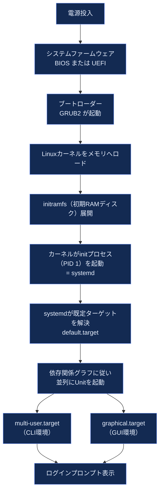

#### systemdのUnit種別

| Unit種別 | 拡張子 | 役割 |
|---|---|---|
| Service | `.service` | デーモン・プロセスの起動管理（nginx, postgresqlなど） |
| Socket | `.socket` | ソケットベースのアクティベーション（遅延起動） |
| Target | `.target` | 複数Unitのグルーピング（旧runlevel相当） |
| Timer | `.timer` | cronに代わるスケジュール実行 |
| Mount / Automount | `.mount` / `.automount` | ファイルシステムのマウント管理 |
| Device | `.device` | udevが検出したデバイスの表現 |

Unitファイルの優先順位（後者が前者を上書き）:

```
/usr/lib/systemd/system/   ← パッケージが提供する既定Unit（最も優先度が低い）
/run/systemd/system/       ← 実行時に生成される一時Unit
/etc/systemd/system/       ← 管理者による作成・上書き（最優先）
```

#### systemdユニットの依存関係イメージ（例: Webサーバー）

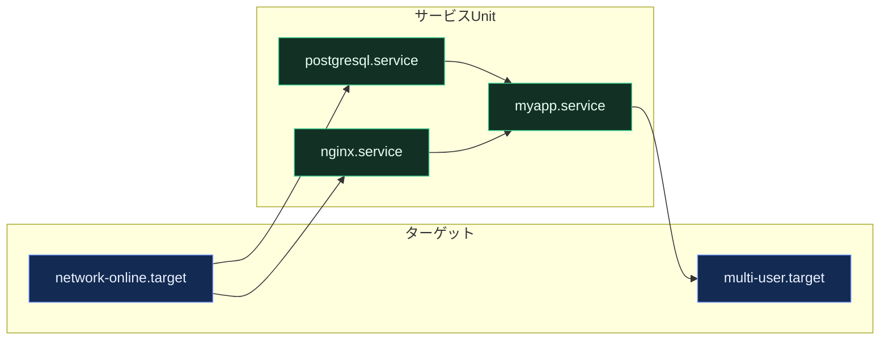

### ③ ベストプラクティス

**ベストプラクティス**
- アップストリームのUnitファイルは直接編集しない。`systemctl edit <unit>` でオーバーライドファイル（`/etc/systemd/system/<unit>.d/override.conf`）を作成する — パッケージ更新時に上書き消失しない。
- Unitファイルを作成・変更したら必ず `systemctl daemon-reload` を実行する。これを忘れると変更が反映されない、最も典型的なハマりどころ。
- `After=` は起動順序を制御するだけで依存関係を意味しない。実際の依存を強制するには `Requires=` または `Wants=` と組み合わせる。
- 障害調査は `systemctl status <unit>` → `journalctl -u <unit> -xe` の順で行う（ログ・終了コード・プロセスツリーが一括で見える）。
- 準備完了シグナルが必要なサービスには `Type=notify` と `sd_notify()`（`systemd-notify`）を使う。
- 滅多に使わないサービスはソケットアクティベーションでメモリ消費を抑える。

### ④ 主要コマンドリファレンス

| コマンド | 用途 |
|---|---|
| `systemctl start/stop/restart <unit>` | サービスの起動・停止・再起動 |
| `systemctl enable/disable <unit>` | 次回起動時の自動起動設定 |
| `systemctl status <unit>` | 状態・直近ログの確認 |
| `systemctl list-units --failed` | 失敗したUnitの一覧 |
| `systemd-analyze blame` | 起動時間のボトルネック分析 |
| `systemd-analyze critical-chain` | 起動のクリティカルパス表示 |
| `journalctl -b` | 今回起動分のログ表示 |

> 出典: DevToolbox「Systemd: The Complete Guide for 2026」 — https://devtoolbox.dedyn.io/blog/systemd-complete-guide ／ Lennart Poettering氏 Mastodon投稿（systemd v261の新機能解説, 2026年6月） — https://mastodon.social/@pid_eins/116803790296454733 ／ The Register「Systemd daddy quits Microsoft to prove Linux can be trusted」（2026年1月, Lennart Poettering氏の動向） — https://www.theregister.com/2026/01/29/lennart_poettering_quits_microsoft/

---

## 第3章: アクセス制御とrootの権限 (Access Control and Rootly Powers)

### ① 何のための章か
「誰が」「何に」「どこまで」アクセスできるかを制御する、Linuxセキュリティの根幹を扱います。

### ② 初学者向けの基礎解説
標準UNIXアクセス制御は、ファイルごとに「所有者（owner）」「グループ（group）」「その他（other）」の3主体に対し、「読み（r）」「書き（w）」「実行（x）」の3権限を割り当てる方式です。

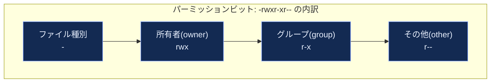

rootアカウントはUID 0を持ち、通常のパーミッションチェックをすべてバイパスできる特別な存在です。現代の運用では「rootに直接ログインする」のではなく、**一般ユーザーが `sudo` を介して一時的にroot権限を借りる**方式が標準になっています。

#### sudoによる権限昇格の流れ

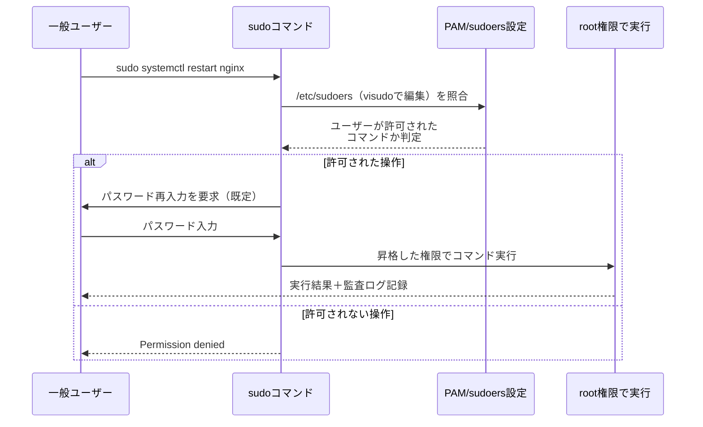

### ③ ベストプラクティス

**ベストプラクティス**
- rootパスワードを直接配布しない。個々のユーザーに専用アカウントを発行し、必要な操作だけを `sudo` で許可する（最小権限の原則）。
- `/etc/sudoers` は必ず `visudo` で編集する（構文エラーを事前検知し、自分自身をロックアウトする事故を防ぐ）。
- `ALL=(ALL) ALL` のような包括的な許可はroot直渡しと同義。実行を許すコマンドをできる限り具体的に絞る（例: `dbadmin ALL=(ALL) /bin/systemctl restart postgresql`）。
- `NOPASSWD` は真に必要な自動化アカウント以外では避ける。
- sudoersにエディタ（vi/vim/nano/emacs）や `less`・`find`・`awk` など、シェルエスケープが可能なバイナリを許可しない — GTFOBinsに掲載されている典型的な権限昇格経路になる。
- 高セキュリティ環境では `timestamp_timeout=0` として、sudo実行のたびにパスワード再入力を要求する。
- `auditd` でsudo実行・`/etc/passwd` や `/etc/shadow` の変更を監査ログに記録する。

### ④ コマンドリファレンス

| コマンド | 用途 |
|---|---|
| `chmod u+x,g-w file` | パーミッション変更（シンボリックモード） |
| `chmod 750 file` | パーミッション変更（8進数モード） |
| `chown user:group file` | 所有者・グループの変更 |
| `visudo` | sudoers編集（構文チェック付き） |
| `sudo -l` | 自分に許可されたsudoコマンド一覧 |
| `getfacl` / `setfacl` | ACL（拡張アクセス制御リスト）の確認・設定 |

> 出典: Oracle Linux公式ドキュメント「Follow the Principle of Least Privilege」 — https://docs.oracle.com/en/operating-systems/oracle-linux/9/security/security-FollowthePrincipleofLeastPrivilege.html ／ DecryptionDigest「Linux sudo sudoers Hardening 2026」 — https://www.decryptiondigest.com/blog/linux-sudo-sudoers-security-hardening-privilege-escalation-guide ／ Kevin Wells氏「Mastering sudo: Enforcing Least Privilege in Linux」 — https://kevwells.com/mastering-sudo-enforcing-least-privilege-in-linux/

---

## 第4章: プロセス制御 (Process Control)

### ① 何のための章か
実行中プログラム（プロセス）のライフサイクル、シグナルによる制御、リソース管理を扱います。

### ② 初学者向けの基礎解説
プロセスは生成（fork）されてから終了するまで、いくつかの状態を遷移します。

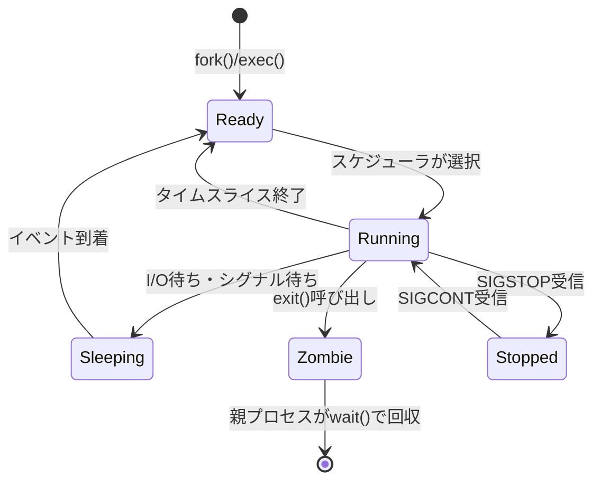

プロセスへの介入は「シグナル」を通じて行います。よく使うシグナルは次の通りです。

| シグナル | 番号 | 意味 |
|---|---|---|
| `SIGHUP` | 1 | 設定再読み込みの慣習的合図（端末切断の原義） |
| `SIGINT` | 2 | Ctrl+Cによる割り込み |
| `SIGKILL` | 9 | 強制終了（プロセス側で捕捉・無視不可） |
| `SIGTERM` | 15 | 正常終了の要求（既定のkillシグナル、捕捉可能） |
| `SIGSTOP` / `SIGCONT` | 19 / 18 | 一時停止・再開 |

### ③ ベストプラクティス

**ベストプラクティス**
- プロセスを止めるときは、まず `SIGTERM`（既定の `kill`）で正常終了を試み、応答がない場合のみ `SIGKILL` にエスカレートする。いきなり `kill -9` はリソース解放処理やDBのコミットを妨げる可能性がある。
- 長時間稼働のサービスはsystemdの管理下に置き、生プロセスとして `nohup` や `&` で放置しない（再起動・クラッシュ時の自動復旧、リソース上限、ログの一元化が失われるため）。
- CPU/メモリの過剰消費を防ぐには `nice`/`renice` による優先度調整より、systemdの `CPUQuota=` / `MemoryMax=`（cgroup v2ベースのリソース制御）を使うほうが確実。
- ゾンビプロセスが大量発生している場合は「親プロセスが `wait()` を呼んでいない」実装上のバグを疑う。

### ④ コマンドリファレンス

| コマンド | 用途 |
|---|---|
| `ps aux` / `ps -ef` | 全プロセス一覧 |
| `top` / `htop` | リアルタイムリソース監視 |
| `kill -TERM <pid>` | 正常終了要求 |
| `kill -9 <pid>` | 強制終了 |
| `pgrep` / `pkill` | 名前によるプロセス検索・終了 |
| `nice -n 10 cmd` | 優先度を下げて実行 |
| `systemd-cgtop` | cgroup単位のリソース使用状況 |

---

## 第5章: ファイルシステム (The Filesystem)

### ① 何のための章か
ファイル・ディレクトリがディスク上でどう組織されるか、そして標準的なディレクトリ配置（FHS）を理解する章です。

### ② 初学者向けの基礎解説
Linuxのファイルシステム階層は、Filesystem Hierarchy Standard (FHS) にゆるく準拠しています。

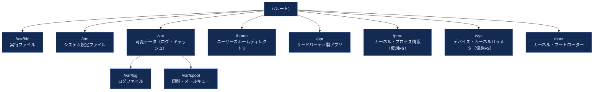

`/proc` と `/sys` は物理ディスク上に実体を持たない**仮想ファイルシステム**で、カーネルの内部状態をファイルのように読み書きできるインターフェースです。

### ③ ベストプラクティス

**ベストプラクティス**
- `/`（ルート）、`/var`、`/home` は可能な限り別パーティション（別論理ボリューム）に分離する。ログの肥大化やユーザーデータの増加が、OS起動に必須のルート領域を圧迫する事故を防ぐ。
- ファイルシステムの選定は用途で使い分ける（詳細は第20章）。一般用途はext4、大容量・高スループットが必要ならXFS、スナップショットや圧縮が必要ならBtrfs。
- `df -h` と `du -sh` は似て非なる情報を返す。`df` はマウントポイント単位の空き容量、`du` は指定パス配下の実使用量。両方を定期的に確認する運用を組み込む。
- シンボリックリンクとハードリンクの違い（ハードリンクは同一inodeを共有し別ファイルシステムをまたげない）を理解した上でバックアップ設計を行う。

### ④ コマンドリファレンス

| コマンド | 用途 |
|---|---|
| `df -h` | マウントポイントごとの空き容量 |
| `du -sh <dir>` | ディレクトリの使用量集計 |
| `mount` / `umount` | ファイルシステムのマウント・アンマウント |
| `lsblk` | ブロックデバイス一覧の階層表示 |
| `find / -xdev -size +100M` | 大容量ファイルの検索 |
| `stat <file>` | inode情報の詳細表示 |

---

## 第6章: ソフトウェアのインストールと管理 (Software Installation and Management)

### ① 何のための章か
パッケージマネージャーを通じたソフトウェアの導入・更新・削除、依存関係解決の仕組みを扱います。

### ② 初学者向けの基礎解説
主要ディストリビューションのパッケージ管理系統は大きく2つに分かれます。

| 系統 | パッケージ形式 | 低レベルツール | 高レベル（依存解決込み）ツール |
|---|---|---|---|
| Debian系 | `.deb` | `dpkg` | `apt` / `apt-get` |
| Red Hat系 | `.rpm` | `rpm` | `dnf`（RHEL8以降。旧`yum`の後継） |


近年はディストリビューション非依存のパッケージ形式（Flatpak, Snap, AppImage）や、言語エコシステム固有のパッケージマネージャー（pip, npm, cargo）も併用されるのが一般的です。

### ③ ベストプラクティス

**ベストプラクティス**
- 本番サーバーでは自動アップグレード（`unattended-upgrades` 等）はセキュリティパッチのみに限定し、メジャーバージョンアップは計画的なメンテナンスウィンドウで実施する。
- パッケージのGPG署名検証を無効化しない（`--allow-unauthenticated` 等のフラグは緊急時以外使わない）。
- 依存関係の破損を避けるため、異なる系統のパッケージマネージャー（例: `apt` と手動 `make install`）を同一ファイルに対して混在させない。
- `apt-mark hold <pkg>` / `dnf versionlock` で、意図せぬバージョンアップを防ぎたいパッケージを固定する。
- コンテナイメージのビルドでは、パッケージキャッシュを最後にクリア（`apt-get clean` 等）してイメージサイズを削減する。

### ④ コマンドリファレンス

| 操作 | Debian系 (apt) | Red Hat系 (dnf) |
|---|---|---|
| メタデータ更新 | `apt update` | `dnf makecache` |
| インストール | `apt install <pkg>` | `dnf install <pkg>` |
| アップグレード | `apt upgrade` | `dnf upgrade` |
| 削除 | `apt remove <pkg>` | `dnf remove <pkg>` |
| 検索 | `apt search <keyword>` | `dnf search <keyword>` |
| インストール済み一覧 | `apt list --installed` | `dnf list installed` |
| パッケージ情報 | `apt show <pkg>` | `dnf info <pkg>` |

> 出典: Red Hat公式ドキュメント（RHEL 9 dnfパッケージ管理） — https://docs.redhat.com/ ／ Debian公式 `apt` マニュアル — https://manpages.debian.org/

---

## 第7章: スクリプティングとシェル (Scripting and the Shell)

### ① 何のための章か
反復作業を自動化するためのシェルスクリプトの基礎と、堅牢なスクリプトを書くための作法を扱います。

### ② 初学者向けの基礎解説
シェルはコマンドの「パイプ」と「リダイレクト」によって小さなツールを組み合わせる、UNIX哲学の中核です。


### ③ ベストプラクティス

**ベストプラクティス**
- スクリプト冒頭に `#!/usr/bin/env bash` と `set -euo pipefail` を必ず入れる。`-e` はエラー発生時に即座に停止、`-u` は未定義変数の参照をエラーにし、`-o pipefail` はパイプ中の失敗を検知可能にする。
- 変数展開は常にダブルクォートで囲む（`"$var"`）。スペースを含むファイル名でのワードスプリッティング事故を防ぐ。
- `shellcheck` で静的解析を通してからデプロイする。
- 冪等性（何度実行しても同じ結果になること）を意識する。ファイル追記型の操作は、既存行の存在チェックを先に行う。
- 複雑なロジックが必要になったら、シェルではなくPythonなど汎用言語への切り替えを検討する（原著もこの判断基準を明示的に推奨している）。

### ④ コマンドリファレンス

| コマンド | 用途 |
|---|---|
| `grep` / `egrep` | パターン検索 |
| `sed 's/old/new/g'` | ストリーム編集・置換 |
| `awk '{print $N}'` | フィールド抽出・集計 |
| `xargs` | 標準入力から引数を構築して実行 |
| `cut -d, -f1` | 区切り文字によるフィールド切り出し |
| `shellcheck script.sh` | シェルスクリプトの静的解析 |

---

## 第8章: ユーザー管理 (User Management)

### ① 何のための章か
ユーザーアカウント・グループの作成、認証情報の管理、ライフサイクル（入社〜退職）を扱います。

### ② 初学者向けの基礎解説
Linuxのユーザー情報は `/etc/passwd`（ユーザー基本情報）、`/etc/shadow`（パスワードハッシュ）、`/etc/group`（グループ情報）に保存されます。

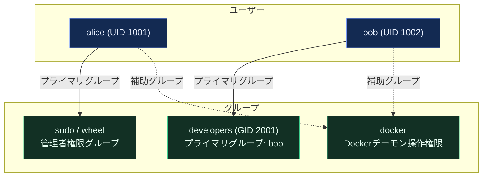

大規模組織では、ローカルアカウントの手動管理はスケールしません。LDAP・Active Directory・クラウドIAM（第17章 SSO参照）と連携した一元管理が標準です。

### ③ ベストプラクティス

**ベストプラクティス**
- 退職・異動が発生したら即座にアカウントを無効化する（`usermod -L` またはロック）。削除は監査証跡のため一定期間経過後に行う。
- 共有アカウントを作らない。誰が何をしたかの追跡可能性（アカウンタビリティ）を最優先する。
- パスワードポリシーは `pam_pwquality` で強制し、加えて可能な限りSSH鍵認証・多要素認証（MFA）へ移行する。
- 定期的に（四半期ごと等）アカウント棚卸しを行い、不要な特権グループ所属を洗い出す。
- サービスアカウントにはログインシェルを `/usr/sbin/nologin` に設定し、対話的ログインを禁止する。

### ④ コマンドリファレンス

| コマンド | 用途 |
|---|---|
| `useradd -m -s /bin/bash alice` | ユーザー作成（ホームディレクトリ付き） |
| `usermod -aG docker alice` | 補助グループへの追加 |
| `usermod -L alice` | アカウントロック |
| `passwd -e alice` | 次回ログイン時のパスワード変更強制 |
| `chage -l alice` | パスワード有効期限の確認 |
| `id alice` | 所属UID/GIDの確認 |

---

## 第9章: クラウドコンピューティング (Cloud Computing)

### ① 何のための章か
自前のデータセンターに代わり、AWS・GCP・Azure等のクラウドプラットフォーム上でシステムを構築・運用する際の考え方を扱います。

### ② 初学者向けの基礎解説
クラウドの本質は「所有」から「利用」への転換です。原著は主要プラットフォームごとのVPS（仮想プライベートサーバー）クイックスタートを解説していますが、共通して押さえるべき概念は以下の通りです。

| 概念 | 説明 |
|---|---|
| IaaS / PaaS / SaaS | インフラ／プラットフォーム／ソフトウェアそれぞれをサービスとして提供する層 |
| リージョン / アベイラビリティゾーン | 地理的な分散単位。障害時の可用性設計の基盤 |
| セキュリティグループ / VPC | クラウド上の仮想ネットワーク境界とファイアウォール |
| IAM（Identity and Access Management） | クラウドリソースへのアクセス制御。OSのユーザー管理と同様「最小権限の原則」が鉄則 |

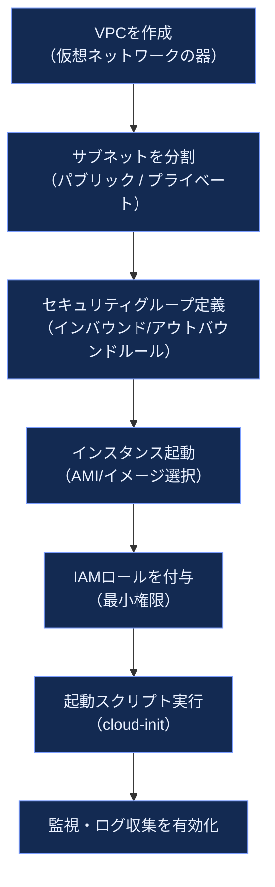

### ③ ベストプラクティス

**ベストプラクティス**
- インスタンスへの設定はSSH経由の手作業ではなく `cloud-init` またはConfiguration Management（第23章）で自動化し、「作り直せば元通り」を実現する（イミュータブルインフラの考え方）。
- コスト管理はタグ付けから始める（プロジェクト・環境・所有者タグを全リソースに強制）。未使用のボリューム・IPアドレスの棚卸しを定期実行する。
- IAMロールは「必要な操作だけ」を許可するカスタムポリシーを基本とし、`AdministratorAccess` のような包括的権限をアプリケーションに付与しない。
- マルチAZ・マルチリージョン構成は「単一障害点をなくす」ためのものであり、コストとのトレードオフを事業要件に照らして判断する。

> 出典: 各クラウドプロバイダ公式ドキュメント（AWS, GCP, Azure）の一般提供情報に基づく。原著第9章「Cloud Computing」構成 — UNIX and Linux System Administration Handbook, 5th Edition, Pearson目次 — https://www.pearson.com/en-us/subject-catalog/p/unix-and-linux-system-administration-handbook/P200000000513/9780137460359

---

## 第10章: ロギング (Logging)

### ① 何のための章か
システムやアプリケーションが生成するログの収集・保存・ローテーション・分析を扱います。障害調査とセキュリティ監査の生命線です。

### ② 初学者向けの基礎解説
現代のLinuxでは、`systemd-journald` が主要なログ収集基盤となり、従来の `syslog`（rsyslog / syslog-ng）と併用されるのが一般的です。

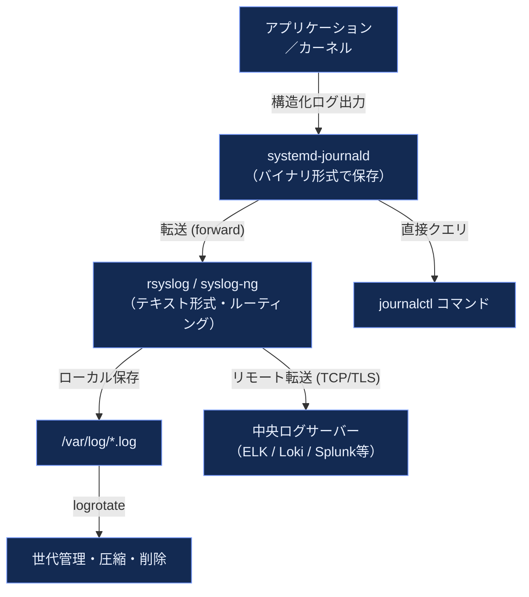

### ③ ベストプラクティス

**ベストプラクティス**
- ログは「見るためのもの」ではなく「機械が処理するためのもの」と捉え、可能な限り構造化（JSON等）で出力する。
- `journald` の永続化を有効にする（既定では `/run` 上の揮発領域のみの場合がある）。`/etc/systemd/journald.conf` で `Storage=persistent` を設定し、再起動後もログが残るようにする。
- `logrotate` で世代数・サイズ上限・圧縮を必ず設定し、`/var/log` がディスクを圧迫してサービス停止を招く事故を防ぐ。
- セキュリティ監査対象のログ（認証ログ、sudo実行ログ）は改ざん防止のため、生成元とは別のサーバーへ即座に転送する。
- 大規模環境ではログ量そのものをコスト要因として管理する — 何を・どのレベルで・どこまで残すかの「ロギングポリシー」を明文化する。

### ④ コマンドリファレンス

| コマンド | 用途 |
|---|---|
| `journalctl -u <unit>` | 特定サービスのログ表示 |
| `journalctl -b` | 今回起動分のログ |
| `journalctl -f` | ログのリアルタイム追跡（tail -f相当） |
| `journalctl --since "1 hour ago"` | 時間範囲指定 |
| `logrotate -d /etc/logrotate.conf` | logrotate設定のドライラン確認 |

> 出典: UNIX and Linux System Administration Handbook, 5th Edition 第10章「Logging」構成（systemdジャーナル・syslog・ログローテーションの3本柱） — Pearson目次 — https://www.pearson.com/en-us/subject-catalog/p/unix-and-linux-system-administration-handbook/P200000000513/9780137460359

---

## 第11章: ドライバとカーネル (Drivers and the Kernel)

### ① 何のための章か
カーネルのバージョニング、デバイスドライバ、ロード可能カーネルモジュール（LKM）の管理を扱います。

### ② 初学者向けの基礎解説
Linuxカーネルはモジュール方式を採用しており、必要なドライバを実行中のカーネルに動的に組み込む（`insmod`/`modprobe`）ことができます。

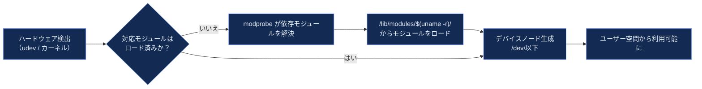

カーネルのバージョン番号は `メジャー.マイナー.パッチ`（例: `6.8.0`）の形式で管理され、安定版・LTS（Long Term Support）版の選定がサーバー運用の可用性に直結します。

### ③ ベストプラクティス

**ベストプラクティス**
- 本番サーバーには可能な限りディストリビューションが提供するLTSカーネルを使う。独自ビルドカーネルは保守コストが高く、セキュリティパッチ適用が遅れがちになる。
- カーネルアップデート後は必ず再起動して新カーネルで正常起動することを確認する（クラウドでは事前にスナップショットを取得）。
- `dmesg` はカーネルが生成する一次情報であり、ハードウェア障害・OOM Killer発動・ドライバエラーの初動調査で最初に確認する。
- 未署名の第三者カーネルモジュールをロードする場合はSecure Bootとの互換性（モジュール署名）を事前確認する。

### ④ コマンドリファレンス

| コマンド | 用途 |
|---|---|
| `uname -r` | 現在のカーネルバージョン確認 |
| `lsmod` | ロード済みモジュール一覧 |
| `modprobe <module>` | モジュールのロード（依存解決込み） |
| `dmesg -T` | カーネルログの表示（人間可読な時刻付き） |
| `sysctl -a` | カーネルパラメータの一覧 |

---

## 第12章: 印刷 (Printing)

### ① 何のための章か
CUPS（Common UNIX Printing System）を用いた印刷サービスの構成を扱います。クラウドネイティブな環境では優先度は下がりますが、オフィス・研究機関のオンプレミス環境では依然として現役の知識です。

### ② 初学者向けの基礎解説
CUPSはIPP（Internet Printing Protocol）を用いて、ネットワークプリンタへのジョブ投入・キュー管理・ドライバ変換を担います。

| 構成要素 | 役割 |
|---|---|
| `cupsd` | 印刷デーモン本体 |
| PPDファイル | プリンタ固有の機能定義 |
| 印刷キュー | ジョブの順序管理 |
| Webインターフェース（`localhost:631`） | ブラウザからの管理画面 |

### ③ ベストプラクティス

**ベストプラクティス**
- 印刷サーバーの管理インターフェース（ポート631）は信頼できるネットワークセグメントに限定し、インターネットに公開しない。
- 共有プリンタキューは部署単位でACLを設定し、意図しないジョブ投入（誤送信によるコスト・情報漏洩）を防ぐ。

### ④ コマンドリファレンス

| コマンド | 用途 |
|---|---|
| `lpstat -p` | プリンタ状態の確認 |
| `lpadmin -p <name> -E -v <uri>` | プリンタの追加・有効化 |
| `cancel <job-id>` | 印刷ジョブのキャンセル |

---

# 第2部: ネットワーキング (Networking)

## 第13章: TCP/IPネットワーキング (TCP/IP Networking)

### ① 何のための章か
インターネットとイントラネットの通信基盤であるTCP/IPプロトコルスイートの基礎を扱います。

### ② 初学者向けの基礎解説
TCP/IPは階層化されたモデルで理解すると全体像が掴みやすくなります。

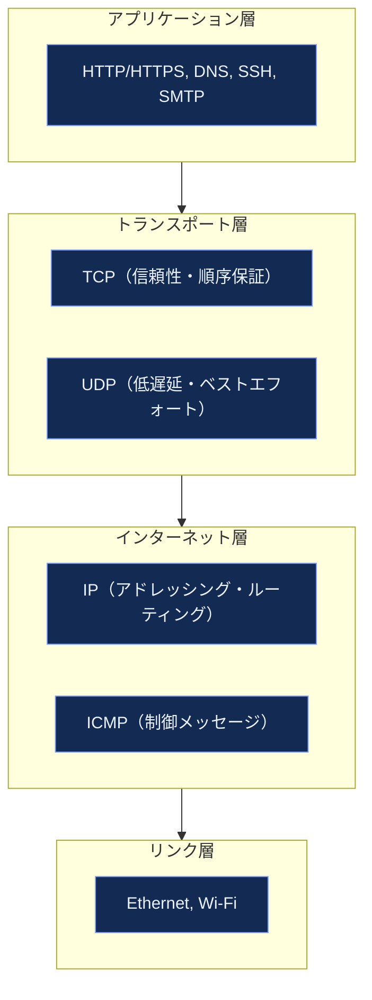

IPアドレスは32ビット（IPv4）または128ビット（IPv6）の識別子で、サブネットマスク（CIDR表記, 例: `/24`）によってネットワーク部とホスト部を区切ります。

### ③ ベストプラクティス

**ベストプラクティス**
- IPv4アドレス枯渇と将来の拡張性を考慮し、新規インフラはIPv6デュアルスタック対応を初期設計に組み込む。
- サブネット設計は将来の成長を見込んで余裕を持たせる（過度に細かい `/30` 等の割当は後で行き詰まる）。
- ネットワークトラブル時は `ping`（疎通）→ `traceroute`（経路）→ `ss`/`netstat`（ローカルソケット状態）→ `tcpdump`（パケットキャプチャ）の順で切り分ける。
- 本番環境のファイアウォールルールは「デフォルト拒否、必要な通信のみ許可（default deny）」を原則とする。

### ④ コマンドリファレンス

| コマンド | 用途 |
|---|---|
| `ip addr show` | インターフェースのIPアドレス確認 |
| `ip route show` | ルーティングテーブル表示 |
| `ss -tulnp` | リスニングポート一覧（netstatの後継） |
| `tcpdump -i eth0 port 443` | パケットキャプチャ |
| `dig` / `nslookup` | DNS問い合わせ |
| `curl -v https://example.com` | HTTP通信の詳細確認 |

---

## 第14章: 物理ネットワーキング (Physical Networking)

### ① 何のための章か
Ethernet・Wi-Fi・SDN（ソフトウェア定義ネットワーキング）・配線・機材選定など、物理層〜データリンク層の実務を扱います。

### ② 初学者向けの基礎解説

| 項目 | 概要 |
|---|---|
| Ethernet規格 | 1GbE, 10GbE, 25/40/100GbEなど。データセンターでは25GbE以上が主流になりつつある |
| 二重化（Bonding/LACP） | 複数の物理NICを論理的に束ね、帯域拡張と冗長性を両立 |
| SDN（Software-Defined Networking） | 制御プレーンとデータプレーンを分離し、ネットワーク構成をソフトウェアで一元管理 |

### ③ ベストプラクティス

**ベストプラクティス**
- サーバーの物理NICは可能な限り2枚以上を異なるスイッチに接続し、LACPボンディングでスイッチ単体障害に耐える構成にする。
- ラック配線は将来の増設・トラブルシューティングを見据え、ラベリングと配線図の維持を怠らない。
- Wi-Fiは管理用ネットワークとしては極力使わず、帯域外管理（IPMI/iDRAC/iLO等の専用ポート）を用意する。

---

## 第15章: IPルーティング (IP Routing)

### ① 何のための章か
パケットが送信元から宛先までどのように転送されるか、静的・動的ルーティングの仕組みを扱います。

### ② 初学者向けの基礎解説

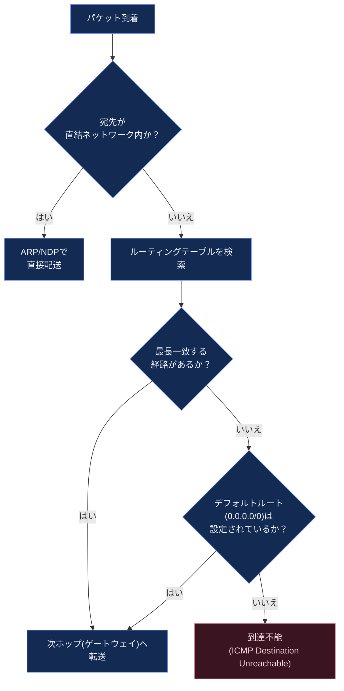

動的ルーティングプロトコル（OSPF, BGPなど）は、経路情報をルーター間で自動交換し、経路変化に追従します。BGPはインターネット全体の経路制御を担う「インターネットの背骨」です。

### ③ ベストプラクティス

**ベストプラクティス**
- 小規模・単純なネットワークでは静的ルートで十分。動的ルーティングは複数経路・冗長化が必要な規模から導入を検討する。
- ルーティングテーブルの変更は必ず現在の到達性を確認した上で行う（リモート作業中の誤設定は自分自身を隔離するリスクがある — コンソールアクセスを確保してから作業する）。

---

## 第16章: DNS - ドメインネームシステム (DNS: The Domain Name System)

### ① 何のための章か
人間可読なドメイン名をIPアドレスへ変換する、インターネットの「電話帳」の仕組みと構築方法を扱います。

### ② 初学者向けの基礎解説

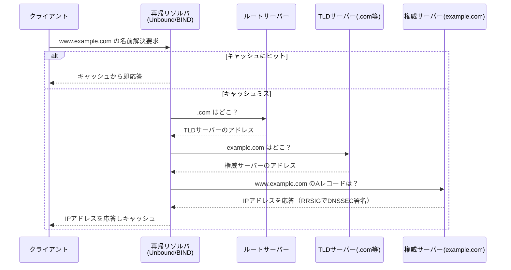

DNSSECは、DNS応答に暗号署名を付与し、キャッシュポイズニングなどの改ざん攻撃から保護する拡張です。ただし2026年時点でも、ルートゾーンは署名済み（約92%）である一方、`.com`・`.net`など主要TLD配下でのDNSSEC実運用率は依然として一桁%台にとどまっており、「署名はしたが検証はされていない」というギャップが指摘されています。

### ③ ベストプラクティス

**ベストプラクティス**
- 権威DNSサーバーと再帰リゾルバの役割を混同しない。権威サーバーはゾーン情報を「答える」役割、再帰リゾルバは外部への「問い合わせを代行する」役割で、同一サーバーに同居させると設定ミスやキャッシュポイズニングのリスクが増す。
- 重要なドメイン（ログインポータル、決済関連）はDNSSECでゾーンに署名し、自組織が管理する再帰リゾルバ側でも検証（validation）を有効化する。
- ゾーンファイルの変更はTTLを考慮した計画的なロールアウトを行う（切り替え直前は一時的にTTLを短縮しておく）。
- 名前解決のトラブルシューティングは `dig +trace` で権威委任のチェーンを実際にたどって確認する。

### ④ コマンドリファレンス

| コマンド | 用途 |
|---|---|
| `dig example.com A` | Aレコードの問い合わせ |
| `dig +trace example.com` | 権威委任チェーンの追跡 |
| `dig +dnssec example.com` | DNSSEC署名情報付きで問い合わせ |
| `named-checkzone` | BINDゾーンファイルの構文検証 |
| `unbound-control status` | Unboundの稼働状況確認 |

> 出典: ControlD「DNS Security Best Practices For Forward-Thinking Businesses」 — https://controld.com/blog/dns-security-best-practices/ ／ SHPV「DNSSEC en 2026」（ルートゾーン署名率・主要TLD採用率の実測値） — https://www.shpv.fr/blog/dnssec-configuration/ ／ Sesame Disk「Secure DNS Updates in 2026」（DNSSEC署名済みゾーン8%・エンドツーエンド検証1%未満の指摘） — https://sesamedisk.com/secure-dns-updates-rfc-2136-ipv6-dnssec-2026/

---

## 第17章: シングルサインオン (Single Sign-On)

### ① 何のための章か
一度の認証で複数システムへアクセスできるSSOの仕組み（Kerberos, LDAP, SAML, OAuth/OIDC）を扱います。

### ② 初学者向けの基礎解説

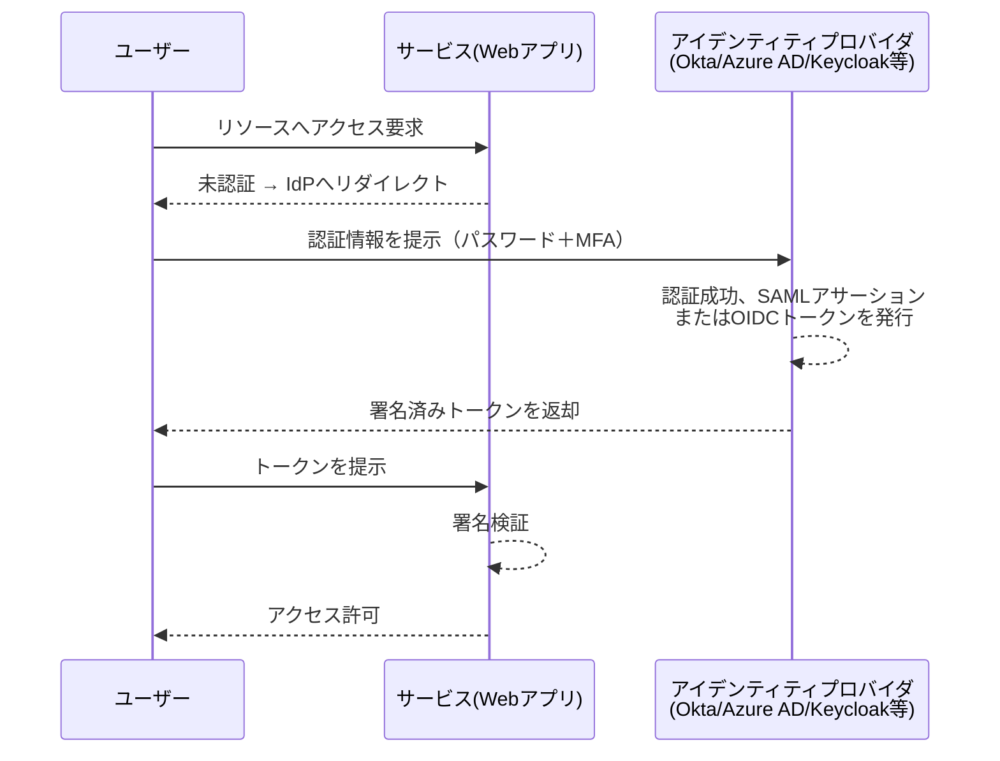

Kerberosはチケットベースの認証プロトコルで、企業内Active Directory環境の中核をなします。SAML/OIDCはWebアプリケーション向けの現代的な標準です。

### ③ ベストプラクティス

**ベストプラクティス**
- 新規に自前で認証機構を実装しない。実績のあるIdP（Keycloak, Okta, Azure AD等）とOIDC/SAMLの標準プロトコルに乗る。
- サービスアカウント・機械間通信にはmTLSやOAuth2クライアントクレデンシャルフローを用い、人間用の認証情報を流用しない。
- トークンの有効期限は業務要件と天秤にかけた上で短めに設定し、リフレッシュトークンのローテーションを行う。

---

## 第18章: 電子メール (Electronic Mail)

### ① 何のための章か
SMTPによるメール配送の仕組みと、なりすまし対策（SPF/DKIM/DMARC）を扱います。

### ② 初学者向けの基礎解説

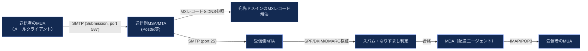

| 技術 | 役割 |
|---|---|
| SPF | 送信元IPが正規のものかDNS TXTレコードで検証 |
| DKIM | メール本文への電子署名で改ざん検知 |
| DMARC | SPF/DKIM失敗時のポリシー（隔離・拒否）を宣言 |

### ③ ベストプラクティス

**ベストプラクティス**
- 自組織ドメインからの送信メールには必ずSPF・DKIM・DMARCの3点セットを設定する。未設定はフィッシングへの悪用や、正規メールの迷惑メール判定を招く。
- メールサーバーをオープンリレーにしない（第三者中継を許可しない設定を確認する）。
- 大量配信（マーケティングメール等）はレピュテーション管理された専用サービス（SES, SendGrid等）に分離し、トランザクションメールのIPレピュテーションを守る。

---

## 第19章: Webホスティング (Web Hosting)

### ① 何のための章か
Webサーバー・リバースプロキシ・TLS終端・スケールアウト構成を扱います。

### ② 初学者向けの基礎解説

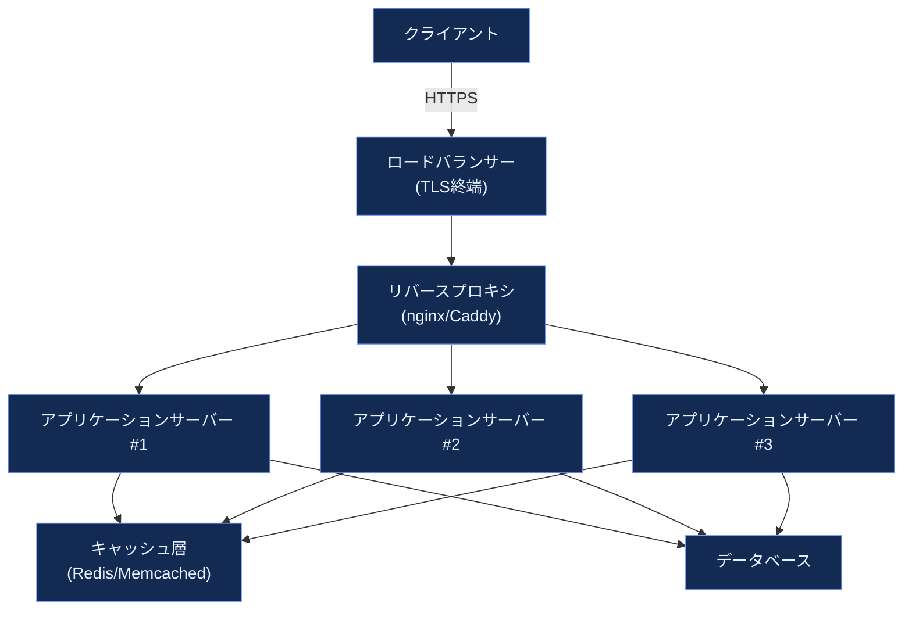

TLS証明書は現在、Let's Encryptに代表される無料の自動発行認証局が普及し、`certbot` や `acme.sh` によるACMEプロトコル自動更新が標準的です。

### ③ ベストプラクティス

**ベストプラクティス**
- TLS証明書の自動更新を必ず設定し、手動更新に頼らない（有効期限切れによるサービス停止は最も「防げたはずの」障害の一つ）。
- HTTPは常にHTTPSへリダイレクトし、`Strict-Transport-Security`（HSTS）ヘッダーを設定する。
- リバースプロキシでリクエストレート制限・タイムアウトを設定し、単一の遅いバックエンドがサービス全体を巻き込まないようにする。
- 静的アセットはCDN経由で配信し、オリジンサーバーの負荷を下げる。

---

## 第20章: ストレージ (Storage)

### ① 何のための章か
物理ディスク〜RAID〜LVM〜ファイルシステムに至るストレージスタック全体の設計を扱います。

### ② 初学者向けの基礎解説

#### RAIDレベル比較

| RAIDレベル | 方式 | 最小ディスク数 | 耐障害性 | 特徴 |
|---|---|---|---|---|
| RAID 0 | ストライピング | 2 | なし | 高速だが1台故障で全損 |
| RAID 1 | ミラーリング | 2 | 1台故障まで耐える | 単純・信頼性高いが容量効率50% |
| RAID 5 | パリティ分散 | 3 | 1台故障まで耐える | 容量効率が良いが書き込み性能に制約 |
| RAID 6 | 二重パリティ | 4 | 2台故障まで耐える | 大容量ディスクでのリビルド中障害に強い |
| RAID 10 | ミラー+ストライプ | 4 | 各ミラーペアで1台まで | 高速・高信頼性、容量効率50% |

#### LVMの3層構造

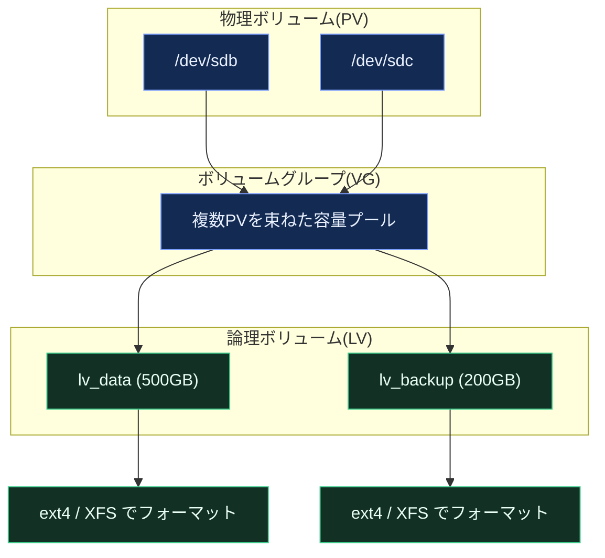

#### ファイルシステム選定の目安

| ファイルシステム | 得意な用途 | 特記事項 |
|---|---|---|
| ext4 | 汎用・互換性重視 | 縮小可能、枯れた実績、小ファイル/メタデータ操作が多いワークロードに強い |
| XFS | 大容量ファイル・DB・高スループット | RHEL系の既定FS。拡張のみ可能で縮小不可（アーキテクチャ上の制約） |
| Btrfs | スナップショット・圧縮・整合性検証 | openSUSE/Fedora既定。RAID5/6機能は本番非推奨とされる場合がある |
| ZFS | エンタープライズストレージ全般 | チェックサム・重複排除・スナップショットを統合提供 |

### ③ ベストプラクティス

**ベストプラクティス**
- 本番用途ではRAID 5は避け、RAID 6またはRAID 10を優先する。大容量ディスク（10TB超）ではリビルド中の追加故障確率が無視できず、RAID 5は実質的にデータ損失リスクを内包する。
- `mdadm`（ソフトウェアRAID）+ LVM（論理ボリューム管理）+ XFS/ext4（ファイルシステム）を組み合わせるのが、ディスク冗長性・柔軟なリサイズ・実績のあるFSを両立する定番構成。
- RAIDやディスクの健康状態を `smartctl` と `mdadm --detail` で定期監視し、故障予兆をアラート化する。
- XFSはオンラインでの拡張はできるが縮小できない、という制約をボリューム設計時に織り込む（将来的な縮小が必要な用途にはLVM thin provisioning + ext4を検討）。
- バックアップは「RAIDの代わり」ではない。RAIDは可用性のための冗長化であり、誤削除・ランサムウェア・論理障害からはバックアップでしか守れない。

### ④ コマンドリファレンス

| コマンド | 用途 |
|---|---|
| `pvcreate` / `vgcreate` / `lvcreate` | LVMの物理・ボリュームグループ・論理ボリューム作成 |
| `lvextend -L +50G /dev/vg/lv` | 論理ボリュームの拡張 |
| `mdadm --create /dev/md0 --level=1 --raid-devices=2 /dev/sdb /dev/sdc` | ソフトウェアRAID作成 |
| `mdadm --detail /dev/md0` | RAIDアレイの状態確認 |
| `smartctl -a /dev/sda` | ディスクのS.M.A.R.T.情報確認 |
| `mkfs.xfs` / `mkfs.ext4` | ファイルシステム作成 |

> 出典: FOSS Linux「Linux Storage Deep Dive: LVM, mdadm, ZFS RAID」（Arjun K.氏, 2026年6月） — https://www.fosslinux.com/158254/linux-storage-deep-dive-lvm-mdadm-and-zfs-raid.htm ／ LinuxTeck「Linux File System Comparison ext4 xfs btrfs — Best Choice for Production 2026」 — https://www.linuxteck.com/linux-file-system-comparison-ext4-xfs-btrfs/ ／ Red Hat公式ドキュメント「Chapter 3. The XFS File System」 — https://docs.redhat.com/en/documentation/red_hat_enterprise_linux/7/html/storage_administration_guide/ch-xfs

---

## 第21章: ネットワークファイルシステム (The Network File System, NFS)

### ① 何のための章か
複数のクライアントからネットワーク越しにファイルシステムを共有するNFSの仕組みを扱います。

### ② 初学者向けの基礎解説

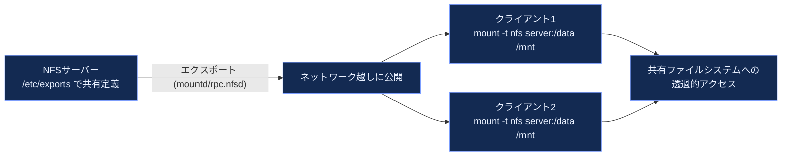

現行の主流はNFSv4で、単一ポート（TCP 2049）での通信・統合されたロック機構・Kerberosによる強固な認証（`sec=krb5p`）をサポートします。

### ③ ベストプラクティス

**ベストプラクティス**
- 新規構築ではNFSv3ではなくNFSv4系を採用する。ポート集約によりファイアウォール設定が単純化し、セキュリティも向上する。
- `no_root_squash` は特別な理由がない限り避ける（既定の `root_squash` はクライアント側rootの権限をサーバー側で無権限ユーザーへマッピングし、権限昇格の悪用を防ぐ）。
- パフォーマンスが重要な用途では、マウントオプション（`rsize`/`wsize`）をネットワーク帯域・レイテンシに合わせてチューニングする。
- NFSサーバーの単一障害点化を避けるため、重要用途ではHA構成や、クラウドではマネージドファイルサービス（EFS, Filestore等）の利用を検討する。

### ④ コマンドリファレンス

| コマンド | 用途 |
|---|---|
| `exportfs -av` | `/etc/exports` の設定を反映 |
| `showmount -e server` | サーバーが公開しているエクスポート一覧 |
| `mount -t nfs4 server:/data /mnt` | NFSv4マウント |
| `nfsstat` | NFS統計情報の確認 |

---

## 第22章: SMB (Server Message Block)

### ① 何のための章か
Windows環境との相互運用を担うSMB/CIFSプロトコルと、Linux側実装であるSambaを扱います。

### ② 初学者向けの基礎解説
Sambaは、LinuxサーバーをWindowsファイルサーバー・ドメインコントローラとして機能させるオープンソース実装です。混在環境（Windows端末＋Linuxサーバー）では依然として重要な選択肢です。

### ③ ベストプラクティス

**ベストプラクティス**
- SMBv1（NT LAN Manager以前含む）は既知の重大な脆弱性（EternalBlue等）があるため、必ず無効化しSMBv2/v3のみを許可する。
- Samba設定ファイル `smb.conf` の共有定義は、Linux側のファイルパーミッションと二重に整合性を取る（SMB側ACLとPOSIXパーミッションの不一致がアクセス不能・過剰許可の原因になりやすい）。
- Active Directoryとの統合（`winbind`または`sssd`）を使い、ローカルSambaユーザーの二重管理を避ける。

### ④ コマンドリファレンス

| コマンド | 用途 |
|---|---|
| `testparm` | `smb.conf` の構文チェック |
| `smbclient -L server` | 共有一覧の確認 |
| `pdbedit -L` | Sambaユーザーデータベースの一覧 |
| `smbstatus` | 現在の接続状況確認 |

---

# 第3部: 運用 (Operations)

## 第23章: 構成管理 (Configuration Management)

### ① 何のための章か
サーバー台数が増えても手作業を繰り返さず、「あるべき状態」をコードで宣言し自動的に収束させる構成管理ツール（Ansible, Puppet, Chef等）を扱います。

### ② 初学者向けの基礎解説
Ansibleはエージェントレス（管理対象にソフトウェアを事前導入する必要がない）でSSH経由に処理を実行する構成管理ツールとして、現在最も広く使われているツールの一つです。

```mermaid
flowchart TB
    CONTROL["Ansibleコントロールノード<br/>(Playbookを保持)"] -->|"SSH接続"| N1["管理対象ノード1"]
    CONTROL -->|"SSH接続"| N2["管理対象ノード2"]
    CONTROL -->|"SSH接続"| N3["管理対象ノード3"]
    N1 --> CHECK1{"現在の状態は<br/>Playbookの宣言と一致？"}
    CHECK1 -- "一致" --> SKIP1["変更なし(ok)"]
    CHECK1 -- "不一致" --> APPLY1["差分のみ適用(changed)"]

    classDef ctrlFill fill:#132a52,stroke:#7c9eff,color:#eaf1ff
    classDef nodeFill fill:#123024,stroke:#3ecf8e,color:#eafff5
    class CONTROL ctrlFill
    class N1,N2,N3,CHECK1,SKIP1,APPLY1 nodeFill
```

**冪等性（idempotency）**が構成管理の中核概念です。同じPlaybookを何度実行しても、既に望ましい状態であれば「何もしない」、そうでなければ「差分だけを適用する」という性質を指します。

### ③ ベストプラクティス

**ベストプラクティス**
- `command`/`shell` モジュールの多用を避け、`package`/`service`/`copy`/`template`等の専用モジュールを優先する。専用モジュールは状態チェックを内蔵しており冪等性が保証されるが、`shell`は明示的に `creates=`/`changed_when` を書かない限り毎回「変更あり」と報告してしまう。
- Playbook・Role・インベントリはすべてGitでバージョン管理し、レビュープロセスを経てから適用する（インフラの変更もコードレビューの対象にする）。
- 変更適用前に必ず `--check`（ドライラン）モードで差分を確認する習慣をつける。
- 環境差異（開発・ステージング・本番）は変数ファイルで分離し、Playbook本体はロジックを共通化する。
- 秘密情報（パスワード・APIキー）は平文でリポジトリに置かず、`ansible-vault` や外部シークレットマネージャーと連携する。

### ④ コマンドリファレンス

| コマンド | 用途 |
|---|---|
| `ansible-playbook site.yml --check` | ドライラン実行 |
| `ansible-playbook site.yml --diff` | 変更差分の表示 |
| `ansible all -m ping` | 疎通確認 |
| `ansible-vault encrypt secrets.yml` | 秘密情報の暗号化 |
| `ansible-lint` | Playbookの静的解析 |

> 出典: Spacelift「Infrastructure as Code with Ansible: Tutorial」 — https://spacelift.io/blog/ansible-infrastructure-as-code ／ OneUptime「How to Fix 'Changed Status' Idempotency Issues」（`command`/`shell`モジュールの冪等性問題と対処） — https://oneuptime.com/blog/post/2026-01-24-ansible-changed-status-idempotency/view ／ OneUptime「How to Write Idempotent Ansible Tasks」 — https://oneuptime.com/blog/post/2026-02-21-how-to-write-idempotent-ansible-tasks/view

---

## 第24章: 仮想化 (Virtualization)

### ① 何のための章か
1台の物理マシン上で複数の独立したOS環境を動かす仮想化技術（ハイパーバイザー）を扱います。

### ② 初学者向けの基礎解説

```mermaid
flowchart TB
    subgraph Type1["Type-1（ベアメタル型）ハイパーバイザー"]
        HW1["物理ハードウェア"] --> HV1["ハイパーバイザー<br/>(KVM, ESXi, Hyper-V)"]
        HV1 --> VM1a["ゲストOS #1"]
        HV1 --> VM1b["ゲストOS #2"]
    end
    subgraph Type2["Type-2（ホスト型）ハイパーバイザー"]
        HW2["物理ハードウェア"] --> HOST["ホストOS"]
        HOST --> HV2["ハイパーバイザーアプリ<br/>(VirtualBox, VMware Workstation)"]
        HV2 --> VM2a["ゲストOS"]
    end

    classDef hvFill fill:#132a52,stroke:#7c9eff,color:#eaf1ff
    class HW1,HV1,VM1a,VM1b,HW2,HOST,HV2,VM2a hvFill
```

LinuxではKVM（Kernel-based Virtual Machine）がType-1ハイパーバイザーの標準実装であり、多くのクラウドプラットフォームの基盤技術でもあります。

### ③ ベストプラクティス

**ベストプラクティス**
- 本番環境ではType-1（ベアメタル型）ハイパーバイザーを採用する。ホストOSを経由しない分、オーバーヘッドが小さく攻撃対象領域（アタックサーフェス）も狭い。
- 仮想マシンのリソース（CPU/メモリ）は物理ホストに対して過剰にオーバーコミットしない。特にメモリのオーバーコミットはスワップ多発によるレイテンシ悪化を招く。
- ゲストOSにも独立してセキュリティパッチ適用・監視を行う。ハイパーバイザーが安全でもゲストが脆弱なら意味がない。

---

## 第25章: コンテナ (Containers)

### ① 何のための章か
仮想マシンより軽量なプロセスレベルの隔離技術であるコンテナ（Docker, Podman, Kubernetes）を扱います。

### ② 初学者向けの基礎解説
コンテナは仮想マシンとは異なり、ハードウェアをエミュレートせず、Linuxカーネルの機能（namespaces と cgroups）を用いてホストOS上のプロセスを隔離します。

```mermaid
flowchart TB
    subgraph VMs["仮想マシン方式"]
        HW1["物理ハードウェア"] --> HV["ハイパーバイザー"]
        HV --> G1["ゲストOS #1（フルカーネル）"]
        HV --> G2["ゲストOS #2（フルカーネル）"]
        HV --> G3["ゲストOS #3（フルカーネル）"]
        G1 --> APP1["アプリ"]
        G2 --> APP2["アプリ"]
        G3 --> APP3["アプリ"]
    end
    subgraph Containers["コンテナ方式"]
        HW2["物理ハードウェア"] --> HOSTOS["ホストOS（単一カーネル）"]
        HOSTOS --> ENGINE["コンテナランタイム<br/>(containerd/runc)"]
        ENGINE --> C1["コンテナ #1<br/>(namespaces+cgroupsで隔離)"]
        ENGINE --> C2["コンテナ #2"]
        ENGINE --> C3["コンテナ #3"]
    end

    classDef vmFill fill:#132a52,stroke:#7c9eff,color:#eaf1ff
    classDef cFill fill:#123024,stroke:#3ecf8e,color:#eafff5
    class HW1,HV,G1,G2,G3,APP1,APP2,APP3 vmFill
    class HW2,HOSTOS,ENGINE,C1,C2,C3 cFill
```

| 隔離技術 | 役割 |
|---|---|
| Namespaces | PID・ネットワーク・マウント・ホスト名などの「見える範囲」をプロセスごとに分離 |
| cgroups (Control Groups) | CPU・メモリ・I/O帯域の割当上限を強制 |
| OverlayFS | イメージレイヤーをCopy-on-Writeで重ね合わせ、ディスク使用量とビルド時間を削減 |

単体のコンテナランタイム（Docker/Podman）は1台のホストに閉じますが、複数ホストにまたがるオーケストレーション（スケジューリング・自己修復・スケーリング）を担うのがKubernetesです。

### ③ ベストプラクティス

**ベストプラクティス**
- コンテナはrootユーザーで実行しない（`USER` ディレクティブで非特権ユーザーを指定）。rootで動くコンテナは、コンテナエスケープが発生した際にホストへの権限昇格リスクを高める。
- イメージは最小構成のベースイメージ（distroless, alpine等）を使い、不要なパッケージ・シェルを含めない — 攻撃対象領域の縮小とイメージサイズ削減を両立する。
- コンテナは「軽量なVM」ではなく「隔離されたプロセス」である、という認識を持つ。永続化が必要なデータはコンテナ内に置かず、ボリュームや外部ストレージに分離する。
- 本番運用では単発の `docker run` ではなく、Kubernetes等のオーケストレーターで自己修復（クラッシュ時再起動）・水平スケーリングを構成する。
- VMとコンテナは「どちらか一方」ではなく併用が一般的（VMでセキュリティ境界を確保し、その中でコンテナを高密度に稼働させる）。

### ④ コマンドリファレンス

| コマンド | 用途 |
|---|---|
| `docker build -t app:1.0 .` | イメージビルド |
| `docker run --rm -it app:1.0` | コンテナ起動（使い捨て） |
| `docker ps` | 稼働中コンテナ一覧 |
| `kubectl get pods` | Kubernetes Pod一覧 |
| `kubectl describe pod <name>` | Podの詳細・イベント確認 |
| `kubectl logs <pod>` | ログ確認 |

> 出典: Northflank「Containers vs virtual machines: key differences and when to use each (2026)」 — https://northflank.com/blog/containers-vs-virtual-machines ／ AWS公式「Docker vs VM」比較ドキュメント — https://aws.amazon.com/compare/the-difference-between-docker-vm/ ／ Luminhkhuong Engineering Knowledge Base「VMs vs. Docker vs. Kubernetes」（namespaces/cgroups/OverlayFS/OCIランタイムスタックの技術解説） — https://luminhkhuong.dev/technical-knowledge/devops/vm-docker-k8s-explained/

---

## 第26章: 継続的インテグレーションとデリバリー (Continuous Integration and Delivery, CI/CD)

### ① 何のための章か
コード変更をビルド・テスト・デプロイまで自動化するパイプラインの設計を扱います。

### ② 初学者向けの基礎解説

```mermaid
flowchart LR
    DEV["開発者が<br/>git pushする"] --> TRIGGER["CIパイプライン起動<br/>(GitHub Actions/GitLab CI等)"]
    TRIGGER --> LINT["静的解析<br/>(Lint/型チェック)"]
    LINT --> BUILD["ビルド"]
    BUILD --> TEST["自動テスト<br/>(単体・統合)"]
    TEST --> SCAN["セキュリティスキャン<br/>(依存関係・イメージ脆弱性)"]
    SCAN --> ARTIFACT["アーティファクト生成<br/>(コンテナイメージ等)"]
    ARTIFACT --> STAGING["ステージング環境へ<br/>自動デプロイ"]
    STAGING --> APPROVAL{"本番デプロイの<br/>承認ゲート"}
    APPROVAL -- "承認" --> PROD["本番環境へデプロイ<br/>(Blue-Green/Canary)"]
    APPROVAL -- "却下" --> DEV

    classDef ciFill fill:#132a52,stroke:#7c9eff,color:#eaf1ff
    class DEV,TRIGGER,LINT,BUILD,TEST,SCAN,ARTIFACT,STAGING,APPROVAL,PROD ciFill
```

「継続的デリバリー（Continuous Delivery）」は本番デプロイ可能な状態を常に維持することを指し、「継続的デプロイ（Continuous Deployment）」はそこからさらに人手の承認なしで自動的に本番反映することを指します。両者はしばしば混同されますが、明確に異なる概念です。

### ③ ベストプラクティス

**ベストプラクティス**
- パイプラインの各ステージは「早く失敗する（fail fast）」順に並べる。実行コストの軽いLintを最初に、時間のかかる統合テストを後段に配置し、フィードバックループを最短化する。
- テストが通らない限りマージできないブランチ保護ルールを設定し、「グリーンなmain」を常に維持する。
- 本番デプロイはBlue-GreenまたはCanaryなど、即座にロールバック可能な戦略を採用する。
- CI環境自体もIaCで管理し、CIツールの設定変更もコードレビューの対象にする。
- ビルドしたコンテナイメージは脆弱性スキャンを通し、既知のCVEを含むイメージを本番に出さない。

### ④ 主要ツール

| カテゴリ | 代表的ツール |
|---|---|
| CI/CDプラットフォーム | GitHub Actions, GitLab CI, Jenkins, CircleCI |
| コンテナレジストリ | Docker Hub, GitHub Container Registry, Amazon ECR |
| 脆弱性スキャン | Trivy, Grype, Snyk |
| デプロイ戦略ツール | Argo CD (GitOps), Spinnaker |

---

## 第27章: セキュリティ (Security)

### ① 何のための章か
システム全体を防御するための多層防御（Defense in Depth）の考え方、SSH強化、脆弱性管理、監査を扱います。

### ② 初学者向けの基礎解説

```mermaid
flowchart TB
    subgraph Layers["多層防御 (Defense in Depth)"]
        L1["境界防御<br/>ファイアウォール / WAF"]
        L2["ネットワーク隔離<br/>VLAN / セキュリティグループ"]
        L3["ホスト強化<br/>不要サービス停止 / パッチ管理"]
        L4["認証・認可<br/>SSH鍵認証 / MFA / 最小権限"]
        L5["アプリケーション対策<br/>入力検証 / 依存関係管理"]
        L6["監視・検知<br/>auditd / IDS / SIEM"]
        L7["データ保護<br/>暗号化 (at rest / in transit)"]
    end
    L1 --> L2 --> L3 --> L4 --> L5 --> L6 --> L7

    classDef secFill fill:#132a52,stroke:#7c9eff,color:#eaf1ff
    class L1,L2,L3,L4,L5,L6,L7 secFill
```

#### SSHハードニングのチェックリスト（`/etc/ssh/sshd_config`）

| 設定項目 | 推奨値 | 理由 |
|---|---|---|
| `PasswordAuthentication` | `no` | パスワード総当たり攻撃を根本から排除 |
| `PermitRootLogin` | `prohibit-password`（鍵のみ許可）または `no` | rootへの直接攻撃面を縮小 |
| `PubkeyAuthentication` | `yes` | 鍵ベース認証を有効化 |
| `MaxAuthTries` | `3` | 総当たりの試行回数を制限 |
| 鍵の種類 | Ed25519（`ssh-keygen -t ed25519`） | RSAより高速・鍵長が短く、乱数生成器の弱さへの耐性も高い |

### ③ ベストプラクティス

**ベストプラクティス**
- SSH鍵を設定したら、**必ず新しいセッションで鍵ログインが成功することを確認してから**パスワード認証を無効化する。順序を間違えると自分自身をロックアウトする典型的な事故につながる。
- OpenSSHは定期的にCVEが報告される（例: 証明書のprincipal名にコンマを含めることで`authorized_keys`制限を回避できた2026年の脆弱性）。最新パッチの適用を常に追跡する。
- CIS BenchmarkやDISA STIGなど、業界標準の構成ベースラインをディストリビューションごとに適用する。RHEL系とDebian系ではパス・パッケージ名・PAMモジュール設定が異なるため、系統別に手順・Ansible Roleを用意する。
- `auditd` を導入し、root権限でのコマンド実行、`/etc/passwd`・`/etc/shadow`・`/etc/sudoers` への変更を監査ログに記録する。
- 脆弱性スキャンとパッチ適用は「知る」で終わらせず、SLA（例: Critical脆弱性は72時間以内に適用）を運用ルールとして明文化する。

### ④ コマンドリファレンス

| コマンド | 用途 |
|---|---|
| `sshd -t` | sshd_config構文チェック（適用前に必須） |
| `fail2ban-client status sshd` | ブルートフォース対策の状況確認 |
| `auditctl -l` | 現在の監査ルール一覧 |
| `ausearch -m USER_LOGIN` | 監査ログの検索 |
| `lynis audit system` | ローカルセキュリティ監査ツール |

> 出典: Falcon Internet Blog「Hardening SSH in 2026」（CVE-2026-35414の解説とハードニングチェックリスト） — https://www.falconinternet.net/blog/ssh-hardening-guide-2026 ／ DecryptionDigest「Linux Server Security Hardening 2026: CIS Benchmarks, Auditd」 — https://www.decryptiondigest.com/blog/linux-server-security-hardening-cis-benchmark ／ Mozilla Wiki「Security/Guidelines/OpenSSH」 — https://wiki.mozilla.org/Security/Guidelines/OpenSSH

---

## 第28章: モニタリング (Monitoring)

### ① 何のための章か
システムの健全性を継続的に可視化し、障害を未然に検知・対処する監視基盤の設計を扱います。

### ② 初学者向けの基礎解説
Google SREチームが提唱する「4大シグナル（Four Golden Signals）」は、監視すべき指標を絞り込むための実践的な枠組みです。

| シグナル | 説明 |
|---|---|
| レイテンシ (Latency) | リクエスト処理にかかる時間。成功時と失敗時を分けて計測することが重要 |
| トラフィック (Traffic) | システムへの需要（リクエスト数等）。他3指標を解釈する文脈を与える |
| エラー (Errors) | 失敗したリクエストの比率・件数 |
| 飽和度 (Saturation) | リソースがどれだけ限界に近いか（CPU使用率、キュー長等） |

```mermaid
flowchart LR
    APP["アプリケーション<br/>／ノードエクスポーター"] -->|"メトリクス公開<br/>(/metrics エンドポイント)"| PROM["Prometheus<br/>(スクレイプ・時系列DB)"]
    PROM -->|"クエリ(PromQL)"| GRAFANA["Grafana<br/>（ダッシュボード可視化）"]
    PROM -->|"閾値評価"| ALERT["Alertmanager<br/>（アラートルーティング）"]
    ALERT -->|"通知"| ONCALL["オンコール担当者<br/>(Slack/PagerDuty)"]

    classDef monFill fill:#132a52,stroke:#7c9eff,color:#eaf1ff
    class APP,PROM,GRAFANA,ALERT,ONCALL monFill
```

### ③ ベストプラクティス

**ベストプラクティス**
- レイテンシは平均値ではなくパーセンタイル（p50/p95/p99）で監視する。平均値は少数の極端に遅いリクエストを覆い隠してしまう。
- エラーは件数ではなく比率（エラーレート）でアラートを設定する。トラフィックが変動する環境では件数ベースの閾値は意味をなさなくなる。
- 静的な閾値だけでなく、`predict_linear()` のような変化率ベースの予測で「このままいくと何分後に閾値超過するか」を検知し、飽和が実際に発生する前にアラートを上げる。
- アラート疲れ（Alert Fatigue）を避けるため、「人間が今すぐ対応すべきもの」だけをページ通知にし、それ以外はダッシュボード・チケットに留める。
- SLI（Service Level Indicator）とSLO（目標値）を先に定義し、監視項目をそこから逆算する（何でも測るのではなく、ユーザー体験に直結する指標を測る）。

### ④ コマンドリファレンス／主要ツール

| ツール | 役割 |
|---|---|
| Prometheus | メトリクス収集・時系列データベース・アラートルール評価 |
| Grafana | ダッシュボード可視化 |
| Alertmanager | アラートの重複排除・グルーピング・ルーティング |
| Node Exporter | ホストレベルメトリクス（CPU/メモリ/ディスク）の公開 |
| OpenTelemetry | メトリクス・ログ・トレースの統一計装標準 |

> 出典: Google SRE Book「Monitoring Distributed Systems」（4大シグナルの原典） — https://sre.google/sre-book/monitoring-distributed-systems/ ／ Better Stack Community「The Four Golden Signals for SRE Monitoring」 — https://betterstack.com/community/guides/monitoring/sre-golden-signals/ ／ Sherlocks.ai「The Four Golden Signals of SRE」（p99/エラーレート/predict_linear()によるアラート設計） — https://www.sherlocks.ai/blog/four-golden-signals-of-sre

---

## 第29章: パフォーマンス分析 (Performance Analysis)

### ① 何のための章か
「システムが遅い」という曖昧な訴えを、再現可能な手順でボトルネックの特定に落とし込む方法論を扱います。

### ② 初学者向けの基礎解説
Netflix・Intel・OpenAIで性能エンジニアとして活躍したBrendan Gregg氏が提唱した**USE法（Utilization, Saturation, Errors）**は、あらゆるハードウェアリソースに対して機械的に適用できる、体系的なボトルネック特定手法です。

```mermaid
flowchart TB
    START["性能問題の調査を開始"] --> LIST["対象リソースを列挙<br/>(CPU, メモリ, ディスクI/O, ネットワーク)"]
    LIST --> LOOP["各リソースについて<br/>3つの質問を確認"]
    LOOP --> U["Utilization: <br/>使用率は高いか？"]
    LOOP --> S["Saturation: <br/>処理待ちのキューが<br/>溜まっていないか？"]
    LOOP --> E["Errors: <br/>エラーは発生していないか？"]
    U --> JUDGE{"いずれかで<br/>異常を検出？"}
    S --> JUDGE
    E --> JUDGE
    JUDGE -- "はい" --> DRILL["該当リソースを<br/>詳細ツールで深掘り<br/>(perf/eBPF/flame graph)"]
    JUDGE -- "いいえ" --> NEXT["次のリソースへ"]
    NEXT --> LOOP
    DRILL --> ROOT["根本原因を特定"]

    classDef perfFill fill:#132a52,stroke:#7c9eff,color:#eaf1ff
    class START,LIST,LOOP,U,S,E,JUDGE,DRILL,NEXT,ROOT perfFill
```

### ③ ベストプラクティス

**ベストプラクティス**
- 調査の最初の60秒でシステム全体を俯瞰する（Brendan Gregg氏が「Linux Performance Analysis in 60,000 Milliseconds」として体系化した手法）。`uptime`（負荷平均）→ `dmesg`（直近のカーネルエラー）→ `vmstat`（CPU/メモリ概況）→ `mpstat`（コア別使用率）→ `pidstat`（プロセス別リソース）→ `iostat`（ディスクI/O）→ `sar`（ネットワーク統計）の順に俯瞰し、当たりをつけてから深掘りツールに進む。
- 平均値だけでなく分布（パーセンタイル、ヒストグラム）を見る。平均は外れ値を隠す。
- `perf` やeBPFベースのツール（bpftrace等）で、実際にCPUを消費しているコードパスをフレームグラフとして可視化し、推測ではなくデータで原因を特定する。
- USE法は「何が正常でないか」を機械的に洗い出すためのチェックリストであり、原因の特定そのものはリソースごとの専用ツールでの深掘りが必要になる、という位置づけを理解する。

### ④ コマンドリファレンス

| コマンド | 用途 |
|---|---|
| `vmstat 1` | CPU/メモリ/スワップの概況（1秒間隔） |
| `mpstat -P ALL 1` | コアごとのCPU使用率 |
| `iostat -xz 1` | ディスクI/Oの詳細統計 |
| `sar -n DEV 1` | ネットワークインターフェース統計 |
| `perf top` | リアルタイムでCPUを消費している関数の表示 |
| `pidstat 1` | プロセス単位のリソース使用状況 |

> 出典: Brendan Gregg氏 公式サイト「The USE Method」 — https://www.brendangregg.com/usemethod.html ／ Brendan Gregg氏 公式サイト（Netflix Tech Blogでの「Linux Performance Analysis in 60,000 Milliseconds」への言及、および2026年時点の近況：Intel退社・OpenAI入社） — https://www.brendangregg.com/ ／ Wikipedia「Brendan Gregg」（USE法・フレームグラフの功績、2013年USENIX LISA Outstanding Achievement Award） — https://en.wikipedia.org/wiki/Brendan_Gregg

---

# 第4部: 組織と実務 (Management Practices)

## 第30章: データセンターの基礎 (Data Center Basics)

### ① 何のための章か
物理的なデータセンター運用（電源、冷却、ラック、DCIM）の基礎知識を扱います。クラウド中心の現在でも、オンプレミス設備やコロケーションを扱う組織には必須の知識です。

### ② 初学者向けの基礎解説

| 要素 | 概要 |
|---|---|
| 冗長電源 (N+1 / 2N) | UPS・発電機・電源系統の二重化レベル |
| 冷却方式 | ホット/コールドアイル分離、CRAC/CRAHユニット |
| ラック単位管理 | U（ラックユニット）単位での機器配置・配線・重量分散 |
| Tier分類（Uptime Institute） | Tier I〜IVでデータセンターの可用性レベルを分類 |

### ③ ベストプラクティス

**ベストプラクティス**
- 単一のデータセンター・単一の電源系統に全てのインフラを集約しない。事業継続計画（BCP）の観点から、地理的・電源的な分散を検討する。
- ラック内の配線・機器配置は「後で誰が見ても分かる」ことを基準に、ラベリングとドキュメント（DCIM: Data Center Infrastructure Management）を継続的に更新する。
- 温度・湿度・電力使用量（PUE: Power Usage Effectiveness）を継続的にモニタリングし、冷却効率の劣化を早期発見する。

---

## 第31章: 方法論・ポリシー・組織politics (Methodology, Policy, and Politics)

### ① 何のための章か
技術力だけでは解決できない「組織の中でどう機能するか」——インシデント対応プロセス、ポストモーテム文化、変更管理、ステークホルダーとのコミュニケーションを扱う、原著の締めくくりの章です。

### ② 初学者向けの基礎解説
Google SREの実践で広く知られる**ブレームレス・ポストモーテム（blameless postmortem）**は、「誰が悪かったか」ではなく「なぜシステムがその失敗を許してしまったか」を問う障害分析の文化です。

```mermaid
flowchart TB
    DETECT["障害検知<br/>（監視アラート／ユーザー報告）"] --> TRIAGE["トリアージ<br/>（影響範囲・深刻度の判定）"]
    TRIAGE --> DECLARE["インシデント宣言<br/>（指揮者/コミュニケーション役の任命）"]
    DECLARE --> MITIGATE["応急対応<br/>（切り戻し・トラフィック退避）"]
    MITIGATE --> RESOLVE["恒久対応・復旧確認"]
    RESOLVE --> POSTMORTEM["ブレームレス・ポストモーテム作成<br/>（タイムライン・根本原因・再発防止策）"]
    POSTMORTEM --> ACTION["アクションアイテムを<br/>バックログへ登録・追跡"]
    ACTION --> REVIEW["組織的なレビュー<br/>（同様の障害パターンの水平展開）"]

    classDef incFill fill:#132a52,stroke:#7c9eff,color:#eaf1ff
    class DETECT,TRIAGE,DECLARE,MITIGATE,RESOLVE,POSTMORTEM,ACTION,REVIEW incFill
```

### ③ ベストプラクティス

**ベストプラクティス**
- ポストモーテムは「個人の失敗」ではなく「プロセス・システムの欠陥」に焦点を当てて記述する。個人を非難する文化は、次に同様の問題に気づいた人が報告をためらう萎縮効果を生む。
- 変更管理（Change Management）は、変更内容・ロールバック手順・影響範囲を事前に文書化してから実施する。「本番で試しながら考える」を避ける。
- トイル（Toil：手作業で繰り返され、長期的価値を生まない作業）を定期的に棚卸しし、自動化への投資判断材料にする。
- 技術的な意思決定であっても、影響を受けるステークホルダー（他チーム、事業側）への説明責任を果たす。技術的に正しいことと、組織的に受け入れられることは必ずしも一致しない。
- オンコール担当者の燃え尽きを防ぐため、ローテーション設計・エスカレーションパスの明確化・「起こされた後の休息」を制度として保証する。

> 出典: Google SRE Book「A Collection of Best Practices for Production Services」「Example Postmortem」（Appendix B, D） — https://sre.google/sre-book/monitoring-distributed-systems/ の関連章（Google Cloud SRE Book, sre.google公開）

---

# 学習ロードマップ（初学者向け推奨進行順）

原著の章立ては網羅的ですが、初学者が実務で最初に触れる優先度で並べ替えると、以下のような学習パスが効率的です。

```mermaid
flowchart LR
    S1["Step1<br/>基本操作<br/>(第4,5,7章)"] --> S2["Step2<br/>権限とユーザー<br/>(第3,8章)"]
    S2 --> S3["Step3<br/>ブートとサービス管理<br/>(第2,6,10章)"]
    S3 --> S4["Step4<br/>ネットワーク基礎<br/>(第13,15,16章)"]
    S4 --> S5["Step5<br/>ストレージとセキュリティ<br/>(第20,27章)"]
    S5 --> S6["Step6<br/>自動化と運用<br/>(第23,25,26章)"]
    S6 --> S7["Step7<br/>監視と性能改善<br/>(第28,29章)"]
    S7 --> S8["Step8<br/>組織運用<br/>(第31章)"]

    classDef stepFill fill:#132a52,stroke:#7c9eff,color:#eaf1ff
    class S1,S2,S3,S4,S5,S6,S7,S8 stepFill
```

---

# 参考文献・出典一覧

本ガイド作成にあたり、2026年8月27日時点でWeb検索により確認した情報源です。書籍そのものの一次情報に加え、著名な国際的開発者・組織による最新（2026年）の実務知見を優先的に参照しました。

## 原著書誌情報

1. UNIX and Linux System Administration Handbook, 5th Edition（O'Reilly電子版） — https://www.oreilly.com/library/view/unix-and-linux/9780134278308/
2. UNIX and Linux System Administration Handbook, 5th Edition（Pearson詳細目次） — https://www.pearson.com/en-us/subject-catalog/p/unix-and-linux-system-administration-handbook/P200000000513/9780137460359
3. UNIX and Linux System Administration Handbook（InformIt出版情報） — https://www.informit.com/store/unix-and-linux-system-administration-handbook-9780134278315

## 第2章（Booting / systemd）関連

4. DevToolbox「Systemd: The Complete Guide for 2026」 — https://devtoolbox.dedyn.io/blog/systemd-complete-guide
5. Lennart Poettering氏 Mastodon投稿（systemd v261新機能解説, 2026年6月） — https://mastodon.social/@pid_eins/116803790296454733
6. The Register「Systemd daddy quits Microsoft to prove Linux can be trusted」（2026年1月） — https://www.theregister.com/2026/01/29/lennart_poettering_quits_microsoft/

## 第3章（Access Control / sudo）関連

7. Oracle Linux公式ドキュメント「Follow the Principle of Least Privilege」 — https://docs.oracle.com/en/operating-systems/oracle-linux/9/security/security-FollowthePrincipleofLeastPrivilege.html
8. DecryptionDigest「Linux sudo sudoers Hardening 2026」 — https://www.decryptiondigest.com/blog/linux-sudo-sudoers-security-hardening-privilege-escalation-guide
9. Kevin Wells氏「Mastering sudo: Enforcing Least Privilege in Linux」 — https://kevwells.com/mastering-sudo-enforcing-least-privilege-in-linux/

## 第16章（DNS/DNSSEC）関連

10. ControlD「DNS Security Best Practices For Forward-Thinking Businesses」 — https://controld.com/blog/dns-security-best-practices/
11. SHPV「DNSSEC en 2026：sécuriser vos résolutions DNS avec la chaîne de confiance」 — https://www.shpv.fr/blog/dnssec-configuration/
12. Sesame Disk「Secure DNS Updates in 2026」 — https://sesamedisk.com/secure-dns-updates-rfc-2136-ipv6-dnssec-2026/

## 第20章（Storage / LVM / RAID）関連

13. FOSS Linux「Linux Storage Deep Dive: LVM, mdadm, ZFS RAID」（Arjun K.氏, 2026年6月） — https://www.fosslinux.com/158254/linux-storage-deep-dive-lvm-mdadm-and-zfs-raid.htm
14. LinuxTeck「Linux File System Comparison ext4 xfs btrfs — Best Choice for Production 2026」 — https://www.linuxteck.com/linux-file-system-comparison-ext4-xfs-btrfs/
15. Red Hat公式ドキュメント「Chapter 3. The XFS File System」 — https://docs.redhat.com/en/documentation/red_hat_enterprise_linux/7/html/storage_administration_guide/ch-xfs

## 第23章（Configuration Management / Ansible）関連

16. Spacelift「Infrastructure as Code with Ansible: Tutorial」 — https://spacelift.io/blog/ansible-infrastructure-as-code
17. OneUptime「How to Fix 'Changed Status' Idempotency Issues」 — https://oneuptime.com/blog/post/2026-01-24-ansible-changed-status-idempotency/view
18. OneUptime「How to Write Idempotent Ansible Tasks」 — https://oneuptime.com/blog/post/2026-02-21-how-to-write-idempotent-ansible-tasks/view

## 第25章（Containers / Docker / Kubernetes）関連

19. Northflank「Containers vs virtual machines: key differences and when to use each (2026)」 — https://northflank.com/blog/containers-vs-virtual-machines
20. AWS公式「Docker vs VM」比較ドキュメント — https://aws.amazon.com/compare/the-difference-between-docker-vm/
21. Luminhkhuong Engineering Knowledge Base「VMs vs. Docker vs. Kubernetes」 — https://luminhkhuong.dev/technical-knowledge/devops/vm-docker-k8s-explained/

## 第27章（Security / SSHハードニング）関連

22. Falcon Internet Blog「Hardening SSH in 2026: Keys, Certificates, and the Bypass You Might Have Missed」 — https://www.falconinternet.net/blog/ssh-hardening-guide-2026
23. DecryptionDigest「Linux Server Security Hardening 2026: CIS Benchmarks, Auditd」 — https://www.decryptiondigest.com/blog/linux-server-security-hardening-cis-benchmark
24. Mozilla Wiki「Security/Guidelines/OpenSSH」 — https://wiki.mozilla.org/Security/Guidelines/OpenSSH

## 第28章（Monitoring / SRE Golden Signals）関連

25. Google SRE Book「Monitoring Distributed Systems」 — https://sre.google/sre-book/monitoring-distributed-systems/
26. Better Stack Community「The Four Golden Signals for SRE Monitoring」 — https://betterstack.com/community/guides/monitoring/sre-golden-signals/
27. Sherlocks.ai「The Four Golden Signals of SRE」 — https://www.sherlocks.ai/blog/four-golden-signals-of-sre

## 第29章（Performance Analysis / USE法）関連

28. Brendan Gregg氏 公式サイト「The USE Method」 — https://www.brendangregg.com/usemethod.html
29. Brendan Gregg氏 公式サイト（近況・経歴） — https://www.brendangregg.com/
30. Wikipedia「Brendan Gregg」 — https://en.wikipedia.org/wiki/Brendan_Gregg

---

*本ガイドはUNIX and Linux System Administration Handbook, 5th Editionの構成に基づく学習用二次資料であり、原著の著作権はEvi Nemeth、Garth Snyder、Trent R. Hein、Ben Whaley、Dan Mackin、およびPearson Educationに帰属します。原著の完全な内容・詳細な手順については、必ず原著（ISBN-13: 978-0-13-427755-4）をご参照ください。*
