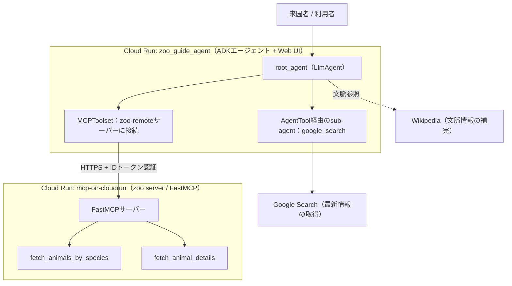
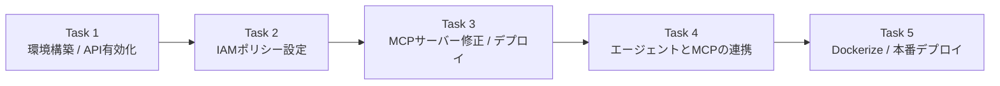
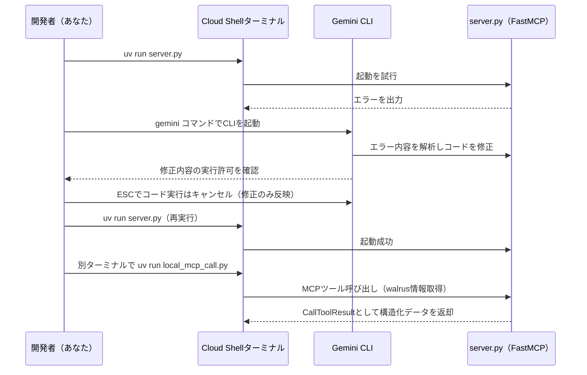
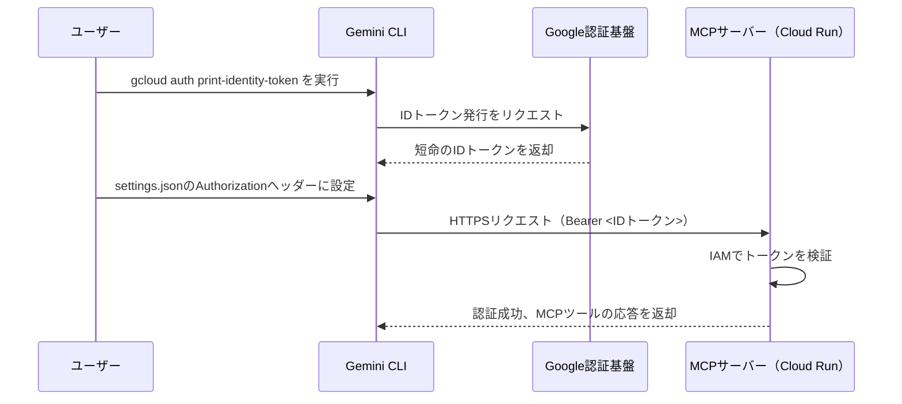
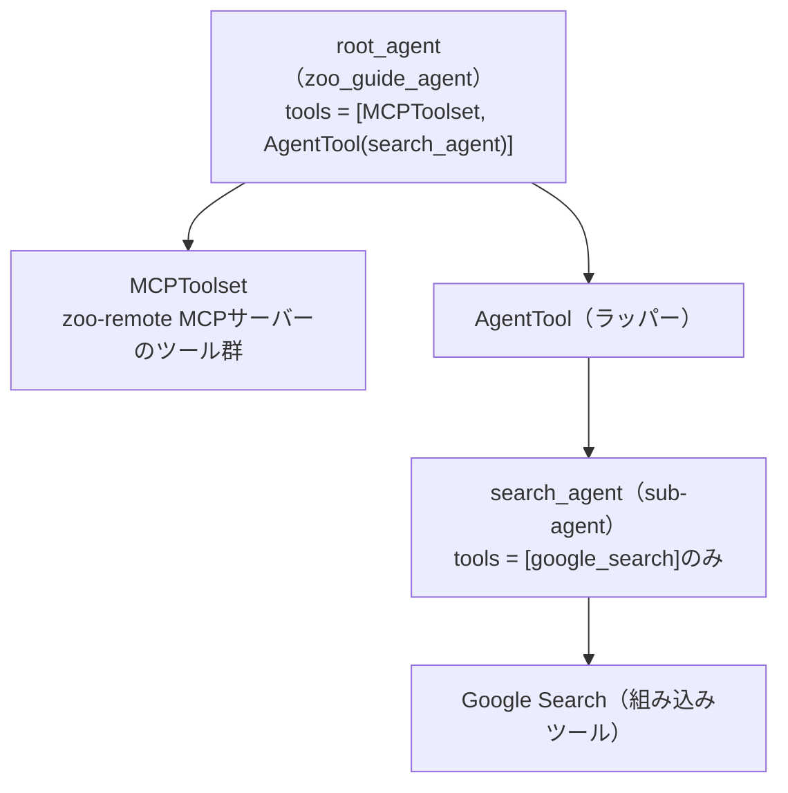
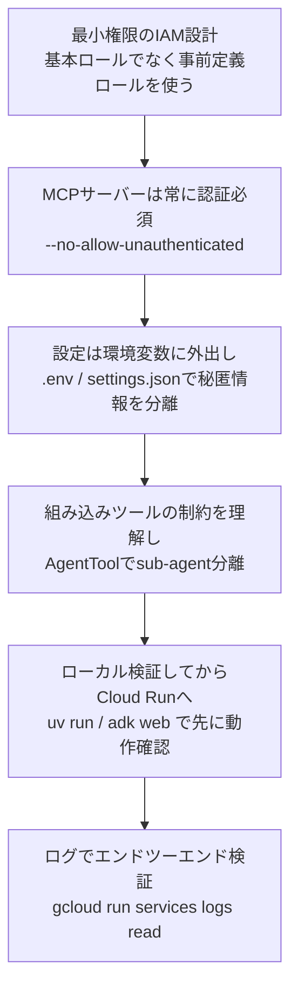

# Cloud Creek Zoo「Zoo Tour Guide」AIエージェント構築チャレンジラボ 完全解説ガイド

> 対象ラボ: [Build a Smart Cloud Application with Vibe Coding and MCP: Challenge Lab](https://www.skills.google/course_templates/1459/labs/620761)（Gemini Enterprise Agent Ready / GEAR プログラム）
>
> このガイドは、Google Cloud上でMCP（Model Context Protocol）サーバーとADK（Agent Development Kit）エージェントを構築・デプロイするチャレンジラボについて、**初学者でも迷わず進められるレベル**までブレークダウンした解説書です。単なる手順の再掲ではなく、各コマンド・各設定が「なぜ必要なのか」を、Google Cloud公式ドキュメントおよび公式コードラボを根拠として提示します。

---

## 目次

1. [シナリオの全体像](#1-シナリオの全体像)
2. [システム全体アーキテクチャ](#2-システム全体アーキテクチャ)
3. [Task 1: 環境構築とAPI有効化](#3-task-1-環境構築とapi有効化)
4. [Task 2: IAMポリシーバインディング](#4-task-2-iamポリシーバインディング)
5. [Task 3: MCPサーバーの修正とCloud Runへのデプロイ](#5-task-3-mcpサーバーの修正とcloud-runへのデプロイ)
6. [Task 4: エージェントとMCPサーバーの連携](#6-task-4-エージェントとmcpサーバーの連携)
7. [Task 5: DockerizeとADKエージェントの本番デプロイ](#7-task-5-dockerizeとadkエージェントの本番デプロイ)
8. [ベストプラクティスまとめ](#8-ベストプラクティスまとめ)
9. [よくあるエラーとトラブルシューティング](#9-よくあるエラーとトラブルシューティング)
10. [参考文献](#10-参考文献)

---

## 1. シナリオの全体像

Cymbal Groupの「Digital Experience」コンサルティング部門として、Cloud Creek Zooの来園者向けAIエージェント「Zoo Tour Guide」を仕上げるのがミッションです。要件を整理すると、実装すべきものは3層に分かれます。

| レイヤー | 役割 | 使用技術 |
|---|---|---|
| データ取得層 | 動物の生息地・種情報をルックアップ | MCPサーバー（zoo server、FastMCP実装） |
| 補助知識層 | 一般的な文脈情報の補完 | Wikipedia参照 + Google Search |
| 対話・オーケストレーション層 | 来園者の質問を解釈し適切なツールを呼び出す | ADK（Agent Development Kit）エージェント |

ジュニアコンサルタントが壊した「zoo server」のPythonコードを直す作業（Task 3）と、IAMポリシーが未整備な状態を是正する作業（Task 2）が、このラボの「実務的なひねり」になっています。単に手順をなぞるだけでなく、**なぜそのAPIやロールが必要か**を理解しておくと、本番環境で類似の構成を組む際に応用が効きます。

---

## 2. システム全体アーキテクチャ

最終形として、以下の2つのCloud Runサービスが連携するアーキテクチャができあがります。



ポイントは2つです。

1. **MCPサーバーは`--no-allow-unauthenticated`でデプロイされ、IDトークンによる認証が必須**になる（Task 3・4で扱う）。
2. **ADKの`google_search`組み込みツールは、他のツール（MCPToolsetなど）と同一エージェント内で単純併用できない**という既知の制約があり、これをAgentToolでラップしたsub-agentパターンで回避する必要がある（Task 5で扱う、後述）。

タスク全体の流れは以下の通りです。



---

## 3. Task 1: 環境構築とAPI有効化

### 3.1 何をするか

Cloud Shell Editorでプロジェクト設定・コードのダウンロード・`.env`ファイルの作成を行い、その後必要なAPIを有効化します。

### 3.2 コマンドの意味を理解する

```bash
gcloud config set project <PROJECT_ID>
```

これはgcloud CLIの**デフォルトプロジェクト**を設定するコマンドです。以降のコマンドで`--project`フラグを省略しても、このプロジェクトに対して実行されます。Cloud Shellはセッションが切れると設定がリセットされることがあるため、ラボ中に認証エラーが出た場合はまずこれを再実行するのが定石です。

```bash
gcloud storage cp gs://<PROJECT_ID>-labconfig-bucket/labs_code.zip .
unzip labs_code.zip
```

Cloud Storageからボイラープレートコードを取得します。ラボ環境ではプロジェクトごとに専用のGCSバケットが用意され、そこに演習用の初期コードが格納されているのが一般的なパターンです。

### 3.3 `.env`ファイルの設計思想

```bash
cd ~/zoo_guide_agent
cat <<EOF > .env
MODEL="<MODEL_NAME>"
SERVICE_ACCOUNT="<PROJECT_ID>-compute@developer.gserviceaccount.com"
MCP_SERVER_URL="https://<MCP_SERVICE>-<HASH>.<REGION>.run.app/mcp/"
GOOGLE_GENAI_USE_ENTERPRISE=1
GOOGLE_CLOUD_PROJECT=<PROJECT_ID>
PROJECT_NUMBER=<PROJECT_NUMBER>
GOOGLE_CLOUD_LOCATION=<REGION>
EOF
```

`.env`にシークレットや接続先URLをハードコードせず環境変数として切り出すのは、**12-Factor App**の設定管理原則に沿ったベストプラクティスです。特に`MCP_SERVER_URL`はTask 3でCloud Runにデプロイした後にしか確定しない値のため、後から書き換える前提の設計になっています。

`SERVICE_ACCOUNT`が`<PROJECT_ID>-compute@developer.gserviceaccount.com`という形式になっているのは、Compute Engineのデフォルトサービスアカウントを指しています。Cloud Runもデフォルトではこのサービスアカウントの権限で動作するため、Task 2のIAM設定と直接関係してきます。

### 3.4 有効化すべきAPI

| API | 役割 |
|---|---|
| Agent Platform API | ADKエージェントがGeminiモデル・エンタープライズAI機能を利用するための基盤API |
| Artifact Registry API | Cloud Runデプロイ時にコンテナイメージを保存するレジストリ |
| Compute Engine API | Cloud Run / Cloud Buildが内部的に利用するコンピューティング基盤 |
| Cloud Build API | ソースコードからコンテナイメージをビルドする（`gcloud run deploy --source=.`の裏側） |
| Cloud Run Admin API | Cloud Runサービスの作成・更新・管理 |

**ベストプラクティス:** APIの有効化には`serviceusage.services.enable`権限が必要です。自分がプロジェクトオーナーでない場合は、Service Usage Admin（`roles/serviceusage.serviceUsageAdmin`）ロールを管理者に依頼する必要があります。ラボ環境では学生アカウントに最初から付与されていますが、実務のプロジェクトでは明示的に確認すべきポイントです。

### 3.5 根拠・参考ソース

- Agent Platform APIの有効化手順とロール要件: [Get started with Gemini Enterprise Agent Platform（Google Cloud公式ドキュメント）](https://docs.cloud.google.com/gemini-enterprise-agent-platform/models/start)
- APIを有効化するために必要な権限（`serviceusage.services.enable`）: [Build and deploy an AI agent to Cloud Run using ADK（Google Cloud公式ドキュメント）](https://docs.cloud.google.com/run/docs/ai/build-and-deploy-ai-agents/adk)

---

## 4. Task 2: IAMポリシーバインディング

### 4.1 なぜIAM設定が「タスク」として独立しているのか

このラボの物語上、「プロジェクトのアーキテクチャがCymbal Groupの厳格なIAMポリシーに則って確定していなかった」という設定になっています。これは実務でも非常によくある状況で、**最小権限の原則（Principle of Least Privilege）**に基づき、自動化サービス（Cloud Build、Cloud Run）が相互に呼び出し合うために必要な権限だけを、必要な主体（ユーザーまたはサービスアカウント）に絞って付与する作業です。

### 4.2 付与すべきロール

| ロール | ロールID | 付与理由 |
|---|---|---|
| Cloud Run Admin | `roles/run.admin` | Cloud Runサービスの作成・デプロイ・IAMポリシーの変更（サービスを公開状態にする等）を行うために必要 |
| Agent Platform User | `roles/aiplatform.user` | Gemini Enterprise Agent Platform（Vertex AI基盤）上でモデル推論・エージェント実行を行うために必要 |

### 4.3 コマンドの型

```bash
gcloud projects add-iam-policy-binding <PROJECT_ID> \
    --member="user:<USER_EMAIL>" \
    --role="roles/run.admin"

gcloud projects add-iam-policy-binding <PROJECT_ID> \
    --member="user:<USER_EMAIL>" \
    --role="roles/aiplatform.user"
```

`--member`は`user:`、`group:`、`serviceAccount:`などのプレフィックスで主体の種類を明示する必要があります。ここを間違える（例: `serviceAccount:`とすべきところを`user:`にする）のは、実務でも頻発するミスです。

**ベストプラクティス:** 基本ロール（Owner / Editor / Viewer）を安易に付与せず、目的に応じた事前定義ロール（predefined role）を使うことで、影響範囲を最小化できます。Cloud Run Adminロールには「IAMポリシーを変更してサービスを公開状態にする」権限まで含まれるため、本番運用では誰に付与するかを慎重に管理すべきロールです。

### 4.4 根拠・参考ソース

- Cloud RunのIAMアクセス制御とCloud Run Adminロールの権限範囲: [Access control with IAM（Cloud Run 公式ドキュメント）](https://docs.cloud.google.com/run/docs/securing/managing-access)
- `gcloud projects add-iam-policy-binding`コマンドリファレンス: [gcloud projects add-iam-policy-binding（Google Cloud SDK 公式ドキュメント）](https://docs.cloud.google.com/sdk/gcloud/reference/projects/add-iam-policy-binding)
- Agent Platform Userロール（`roles/aiplatform.user`）の定義: [Get started with Gemini Enterprise Agent Platform（Google Cloud公式ドキュメント）](https://docs.cloud.google.com/gemini-enterprise-agent-platform/models/start)
- IAMロール付与の一般手順: [Manage access to projects, folders, and organizations（IAM 公式ドキュメント）](https://docs.cloud.google.com/iam/docs/granting-changing-revoking-access)

---

## 5. Task 3: MCPサーバーの修正とCloud Runへのデプロイ

### 5.1 ローカルでの再現・修正・テストのフロー

このタスクの本質は「エラーメッセージを読んで自力でデバッグする」ことです。Gemini CLIを使ってPythonコードのバグを修正する流れを図解します。



**なぜGemini CLIに実行許可を求められたらESCでキャンセルするのか:** Gemini CLIはエージェント的にコード変更後そのままPythonファイルを実行しようとすることがありますが、ラボの意図は「コードの修正」であり、実行そのものはCLIの外側（自分のターミナル）で行うことで、修正結果を確実に目視確認するためです。

### 5.2 ここで使われているMCPサーバーの実装パターン

`mcp-on-cloudrun`ディレクトリの構成（`Dockerfile`, `server.py`, `pyproject.toml`, `uv.lock`）は、GoogleがCloud Runドキュメントで公式に案内しているMCPサーバー構築パターンそのものです。`uv`（高速なPythonパッケージ・プロジェクトマネージャー）を使ってFastMCPベースのサーバーを構築するのが、2025年後半以降のGoogle公式チュートリアルにおける標準的な作法になっています。

このラボの題材（zoo server、`fetch_animals_by_species`のようなツール名）は、Google公式の「Cloud Runにセキュアなmcpサーバーをデプロイする」コードラボと同系統の教材であり、FastMCPで`get_animals_by_species`や`get_animal_details`のようなツールを持つzoo MCPサーバーを構築する内容が公式に公開されています。

### 5.3 Cloud Runへのデプロイコマンドの読み解き

```bash
gcloud run deploy <MCP_SERVICE_NAME> \
    --no-allow-unauthenticated \
    --region=<REGION> \
    --source=. \
    --min=1 \
    --project=<PROJECT_ID> \
    --labels=lab-dev=mcp-zoo-cloud-run-service
```

| フラグ | 意味 |
|---|---|
| `--no-allow-unauthenticated` | 未認証アクセスを拒否し、IAM（IDトークン）による認証を必須にする |
| `--source=.` | カレントディレクトリのソースコードをCloud Buildでビルドしてデプロイ（Dockerfileを直接使うか、Buildpacksで自動ビルドされる） |
| `--min=1` | 最小インスタンス数を1に設定し、コールドスタートの遅延を回避（常時1インスタンスが起動しているため課金は発生し続ける点に注意） |
| `--labels=` | リソースにラベルを付与し、コスト管理・棚卸しをしやすくする |

**ベストプラクティス（`--no-allow-unauthenticated`が重要な理由）:** MCPサーバーは動物データという機微ではない情報を扱っていますが、「誰でも呼び出せるエンドポイント」を放置すると、意図しない大量アクセスによるコスト増や、将来機能追加した際の情報漏えいリスクにつながります。Google Cloudの公式チュートリアルでも、MCPサーバーをCloud Runにデプロイする際はセキュリティ上の理由から一貫して`--no-allow-unauthenticated`を使うことが強調されています。

### 5.4 根拠・参考ソース

- リモートMCPサーバーのCloud Run構築チュートリアル（`uv init`、`pyproject.toml`、`server.py`の標準構成）: [Build and deploy a remote MCP server on Cloud Run（Google Cloud公式ドキュメント）](https://docs.cloud.google.com/run/docs/tutorials/deploy-remote-mcp-server)
- `--no-allow-unauthenticated`を使うべき理由の解説: [Build and Deploy a Remote MCP Server to Google Cloud Run in Under 10 Minutes（Google Cloud公式ブログ）](https://cloud.google.com/blog/topics/developers-practitioners/build-and-deploy-a-remote-mcp-server-to-google-cloud-run-in-under-10-minutes)
- zoo MCPサーバー（`get_animals_by_species`等）を題材にした公式コードラボ: [How to deploy a secure MCP server on Cloud Run（Google Codelabs）](https://codelabs.developers.google.com/codelabs/cloud-run/how-to-deploy-a-secure-mcp-server-on-cloud-run)
- Cloud Run上でのMCPサーバーホスティング全般のベストプラクティス: [Host MCP servers on Cloud Run（Google Cloud公式ドキュメント）](https://docs.cloud.google.com/run/docs/host-mcp-servers)

---

## 6. Task 4: エージェントとMCPサーバーの連携

### 6.1 IDトークン認証の仕組み

`--no-allow-unauthenticated`でデプロイしたMCPサーバーに、Gemini CLIやADKエージェントからアクセスするには、リクエストヘッダーに有効なGoogle発行のIDトークンを添付する必要があります。



**重要な注意点:** `gcloud auth print-identity-token`で発行されるIDトークンは**短命（有効期限が短い）**です。ラボ手順で「認証エラーが出たら`/quit`してプロジェクトを再設定する」という注意書きがあるのは、このトークンが失効した際の典型的な対処法を指しています。本番運用では、都度手動でトークンを発行するのではなく、サービスアカウントの権限借用（impersonation）やGemini CLIの`authProviderType: service_account_impersonation`のような仕組みを使うのがベストプラクティスです。

### 6.2 `~/.gemini/settings.json`の構造

```json
{
  "mcpServers": {
    "zoo-remote": {
      "httpUrl": "https://<MCP_SERVICE>-<HASH>.<REGION>.run.app/mcp/",
      "headers": {
        "Authorization": "Bearer $ID_TOKEN"
      }
    }
  },
  "selectedAuthType": "compute-default-credentials",
  "hasSeenIdeIntegrationNudge": true
}
```

| キー | 役割 |
|---|---|
| `mcpServers.<name>.httpUrl` | Streamable HTTPトランスポートでMCPサーバーに接続するエンドポイント（末尾の`/mcp/`が必須） |
| `headers.Authorization` | Bearerトークン形式で認証情報を渡す。`$ID_TOKEN`は環境変数展開される |
| `selectedAuthType` | Gemini CLI自体の認証方式。Compute Engineのデフォルト認証情報を使う設定 |

Gemini CLIはこの設定ファイルの`httpUrl` + `headers`の組み合わせをMCPサーバー接続の標準パターンとして公式にサポートしており、Bearerトークンをヘッダーに載せる方式は他社のMCPサーバー（GitHub MCP Serverなど）でも同一の構文が使われています。

### 6.3 Gemini CLIでの検証手順の意味

- `/mcp`のようなスラッシュコマンドでMCPツール一覧を確認する → 接続が正しく確立されているかを最初に確認するステップ
- `Where can I find penguins?`という自然文プロンプト → LLMがMCPツール（`fetch_animals_by_species`等）を自律的に選択して呼び出せるかの検証
- `always allow all tools from the zoo-remote MCP server`を選択 → 開発中は毎回の確認プロンプトを省略できるが、**本番のエージェントに同じ設定を持ち込む場合は、ツールの安全性を精査した上で許可範囲を絞るべき**
- カスタムコマンド`/find --animal="lion"`→ MCPプロンプト機能（MCP Prompts）を使い、定型的なツール呼び出し＋フォーマットをショートカット化する仕組み

### 6.4 サーバーログの確認

```bash
gcloud run services logs read <MCP_SERVICE_NAME> --region <REGION> --limit=5
```

Cloud Runサービスのログを直接読み取ることで、「ツール呼び出しが実際にサーバー側まで到達したか」をエンドツーエンドで確認できます。エージェント側でエラーが出た際、原因がエージェント側にあるのかMCPサーバー側にあるのかを切り分ける基本動作です。

### 6.5 根拠・参考ソース

- Gemini CLIのMCPサーバー設定（`httpUrl`、`headers`、Bearerトークン方式）の公式仕様: [MCP servers with the Gemini CLI（google-gemini/gemini-cli 公式リポジトリ）](https://github.com/google-gemini/gemini-cli/blob/main/docs/tools/mcp-server.md)
- サービスアカウント権限借用によるIAM保護されたMCPサーバーへの本番接続パターン（`service_account_impersonation`）: 同上ドキュメント内 `myIapProtectedServer` の設定例
- Cloud Runサービスのログ確認コマンド: [Access control with IAM（Cloud Run 公式ドキュメント）](https://docs.cloud.google.com/run/docs/securing/managing-access)

---

## 7. Task 5: DockerizeとADKエージェントの本番デプロイ

### 7.1 `agent.py`のTODOで最も重要な落とし穴: google_searchとMCPツールの併用制限

ADKには「1つのエージェント内で組み込みツール（`google_search`など）を他のツールと単純併用できない」という既知の制約があります。これを知らずにそのまま実装すると、以下のようなエラーに直面します。

```text
400 INVALID_ARGUMENT: Multiple tools are supported only when they are all search tools.
```

このラボが「Wikipedia参照に加えてGoogle Search MCPサーバーツールを持たせる」という要件をわざわざ明示しているのは、この制約への対処を実践させる意図があると考えられます。公式な回避パターンは、**`google_search`を専用のsub-agentに閉じ込め、それを`AgentTool`でラップしてroot_agentのツールとして登録する**という構成です。



この構成のポイントは、**「1エージェント1組み込みツール」というADKの制約を、sub-agent単位で守る**ことです。`search_agent`は`google_search`だけを持ち、`root_agent`はMCPツールと「search_agentを呼び出すためのAgentTool」だけを持つため、それぞれのエージェント内では制約に抵触しません。

イメージのPythonコード（概念例、実際のTODOはラボの`agent.py`のコメントに従って実装します）:

```python
from google.adk.agents import Agent
from google.adk.tools import google_search
from google.adk.tools.agent_tool import AgentTool
from google.adk.tools.mcp_tool import MCPToolset, StreamableHTTPConnectionParams

search_agent = Agent(
    model="gemini-flash-latest",
    name="search_agent",
    instruction="あなたはGoogle検索専門のエージェントです。最新の一般情報を検索して回答します。",
    tools=[google_search],
)

mcp_toolset = MCPToolset(
    connection_params=StreamableHTTPConnectionParams(
        url=MCP_SERVER_URL,  # .envのMCP_SERVER_URL
        headers={"Authorization": f"Bearer {ID_TOKEN}"},
    ),
)

root_agent = Agent(
    model=MODEL,
    name="zoo_guide_agent",
    instruction="来園者の質問に対し、動物情報はMCPツールで、最新の一般情報はsearch_agentツールで回答してください。",
    tools=[mcp_toolset, AgentTool(agent=search_agent)],
)
```

### 7.2 ローカルでのADK動作確認

```bash
cd ~/zoo_guide_agent
python -m venv .venv
source .venv/bin/activate
pip install --no-cache-dir -r requirements.txt
cd ~
adk web
```

**ベストプラクティス:** 仮想環境（`venv`）を切ってから依存関係をインストールするのは、Cloud Shellのグローバルなpython環境を汚染しないための基本動作です。`adk web`は`zoo_guide_agent`ディレクトリの**親ディレクトリ**から実行する必要がある点に注意してください（ADKはディレクトリ構成からエージェントパッケージを自動検出する設計になっています）。

### 7.3 Cloud Runへの本番デプロイコマンド

```bash
cd ~/zoo_guide_agent
adk deploy cloud_run \
  --project=<PROJECT_ID> \
  --region=<REGION> \
  --service_name=<AGENT_SERVICE_NAME> \
  --with_ui \
  . \
  -- \
  --labels=lab-dev=cloud-zoo-run-adk-service
```

| フラグ | 意味 |
|---|---|
| `--project` / `--region` | デプロイ先プロジェクトとリージョン（モデルが利用可能なリージョンを選ぶ必要がある点に注意） |
| `--service_name` | Cloud Runサービス名。省略時は`adk-default-service-name`になる |
| `--with_ui` | ADK開発者Web UIをコンテナに同梱してデプロイする（動作検証用。本番の来園者向けUIとは別に、内部検証用として有用） |
| `.` | エージェントコードのソースディレクトリ（カレントディレクトリ） |
| `--`以降 | `adk deploy cloud_run`ではなく、内部で呼び出される`gcloud run deploy`にそのまま渡される追加フラグ |

`adk deploy cloud_run`は、エージェントコードのパッケージング、コンテナイメージのビルド、Artifact Registryへのプッシュ、Cloud Runへのデプロイを1コマンドで完結させるADK CLIの機能です。裏側ではCloud BuildとCloud Run Admin APIが使われるため、Task 1・2で有効化・権限付与した内容がここで実際に効いてきます。

未認証呼び出しを許可するかを聞かれた際に`y`と回答するのは、来園者が誰でもアクセスできる公開エージェントとして仕上げる、というラボの要件（「公開呼び出し用に設定し、公開URLで応答することを確認する」）に対応するためです。

### 7.4 デプロイ後の検証

```bash
adk web  # ローカル確認用（本番はService URLを直接開く）
```

デプロイ完了後に出力される`Service URL`を開き、Token Streamingを有効化した上で質問（例: `Where can I find elephants?`）を投げ、MCPツール呼び出しとGoogle Search呼び出しの両方が正しくイベントとして表示されるかを確認します。ここで「関数呼び出しイベントが両方見える」ことが、7.1で説明したAgentToolパターンが正しく機能している証拠になります。

### 7.5 根拠・参考ソース

- `adk deploy cloud_run`コマンドのフラグ仕様（`--with_ui`、`--service_name`等）: [Cloud Run - Agent Development Kit (ADK)（Google公式ADKドキュメント）](https://google.github.io/adk-docs/deploy/cloud-run/)
- zoo-tour-guideを題材にしたADK公式デプロイチュートリアル: [Build and deploy an ADK agent on Cloud Run（Google Codelabs）](https://codelabs.developers.google.com/codelabs/production-ready-ai-with-gc/5-deploying-agents/deploy-an-adk-agent-to-cloud-run)
- Cloud Run上でのADKエージェントの一般的なビルド・デプロイ手順: [Build and deploy an AI agent to Cloud Run using ADK（Google Cloud公式ドキュメント）](https://docs.cloud.google.com/run/docs/ai/build-and-deploy-ai-agents/adk)
- MCPToolset / StreamableHTTPConnectionParamsの公式仕様: [MCP tools - Agent Development Kit (ADK)（Google公式ADKドキュメント）](https://google.github.io/adk-docs/tools/mcp-tools/)
- `google_search`など組み込みツールが他のツールと併用できない制約、およびAgentToolによるsub-agentラッピングでの回避策: [Support using enterprise_web_search built-in tool with other tools in the same agent（google/adk-python Issue #3412）](https://github.com/google/adk-python/issues/3412)、[ADK: Root agent with sub_agents fails if sub-agents use a mix of VertexAiSearchTool and custom function tools（google/adk-python Issue #899）](https://github.com/google/adk-python/issues/899)

---

## 8. ベストプラクティスまとめ



| # | 原則 | このラボでの実例 |
|---|---|---|
| 1 | 最小権限 | `roles/run.admin`と`roles/aiplatform.user`のみを付与し、Ownerを使わない |
| 2 | ゼロトラストに近い認証設計 | MCPサーバーを`--no-allow-unauthenticated`でデプロイし、IDトークンで検証 |
| 3 | 設定と秘匿情報の分離 | `.env`にURLやプロジェクト情報、`settings.json`にMCP接続情報を分離管理 |
| 4 | フレームワークの制約を事前に把握する | `google_search`とMCPツールの併用制限をAgentToolパターンで回避 |
| 5 | ローカルファースト検証 | `uv run server.py` → `adk web`の順でローカル確認してから本番デプロイ |
| 6 | 可観測性の確保 | Cloud Runログを都度確認し、問題の切り分けを迅速に行う |

---

## 9. よくあるエラーとトラブルシューティング

| 症状 | 想定される原因 | 対処 |
|---|---|---|
| `uv run server.py`実行時にエラー | ジュニアコンサルタントが混入させたバグ（インポート漏れ、型不一致など） | Gemini CLIでエラーメッセージを渡し、修正案を確認。実行はESCでキャンセルし手動で再実行 |
| `google.logging.v2.WriteLogEntriesPartialErrors` | プロジェクト設定がリセットされている | `gcloud config set project <PROJECT_ID>`を再実行 |
| Gemini CLIで認証エラー | `ID_TOKEN`の有効期限切れ | `/quit`で終了し、`gcloud config set project`後にトークンを再発行して再起動 |
| Cloud Runデプロイで`Quota exceeded for total allowable CPU` | リージョンのCPUクォータに達している | 少し待ってから同じコマンドを再実行 |
| `400 INVALID_ARGUMENT: Multiple tools are supported only when they are all search tools` | `google_search`を他のツールと同じエージェントに混在させている | 7.1のAgentToolによるsub-agent分離パターンを適用 |
| ADKデプロイ時に未認証呼び出しの確認プロンプト | `--with_ui`で公開UIを含めてデプロイしている | 来園者向け公開エージェントとして仕上げる要件のため`y`で許可 |

---

## 10. 参考文献

1. [Get started with Gemini Enterprise Agent Platform（Google Cloud公式ドキュメント）](https://docs.cloud.google.com/gemini-enterprise-agent-platform/models/start)
2. [Access control with IAM（Cloud Run 公式ドキュメント）](https://docs.cloud.google.com/run/docs/securing/managing-access)
3. [gcloud projects add-iam-policy-binding（Google Cloud SDK 公式ドキュメント）](https://docs.cloud.google.com/sdk/gcloud/reference/projects/add-iam-policy-binding)
4. [Manage access to projects, folders, and organizations（IAM 公式ドキュメント）](https://docs.cloud.google.com/iam/docs/granting-changing-revoking-access)
5. [Build and deploy a remote MCP server on Cloud Run（Google Cloud公式ドキュメント）](https://docs.cloud.google.com/run/docs/tutorials/deploy-remote-mcp-server)
6. [Build and Deploy a Remote MCP Server to Google Cloud Run in Under 10 Minutes（Google Cloud公式ブログ）](https://cloud.google.com/blog/topics/developers-practitioners/build-and-deploy-a-remote-mcp-server-to-google-cloud-run-in-under-10-minutes)
7. [Host MCP servers on Cloud Run（Google Cloud公式ドキュメント）](https://docs.cloud.google.com/run/docs/host-mcp-servers)
8. [Use the Cloud Run remote MCP server（Google Cloud公式ドキュメント）](https://docs.cloud.google.com/run/docs/use-cloud-run-mcp)
9. [How to deploy a secure MCP server on Cloud Run（Google Codelabs）](https://codelabs.developers.google.com/codelabs/cloud-run/how-to-deploy-a-secure-mcp-server-on-cloud-run)
10. [MCP servers with the Gemini CLI（google-gemini/gemini-cli 公式リポジトリ）](https://github.com/google-gemini/gemini-cli/blob/main/docs/tools/mcp-server.md)
11. [Cloud Run - Agent Development Kit (ADK)（Google公式ADKドキュメント）](https://google.github.io/adk-docs/deploy/cloud-run/)
12. [Build and deploy an ADK agent on Cloud Run（Google Codelabs）](https://codelabs.developers.google.com/codelabs/production-ready-ai-with-gc/5-deploying-agents/deploy-an-adk-agent-to-cloud-run)
13. [Build and deploy an AI agent to Cloud Run using ADK（Google Cloud公式ドキュメント）](https://docs.cloud.google.com/run/docs/ai/build-and-deploy-ai-agents/adk)
14. [MCP tools - Agent Development Kit (ADK)（Google公式ADKドキュメント）](https://google.github.io/adk-docs/tools/mcp-tools/)
15. [Support using enterprise_web_search built-in tool with other tools in the same agent（google/adk-python Issue #3412）](https://github.com/google/adk-python/issues/3412)
16. [ADK: Root agent with sub_agents fails if sub-agents use a mix of VertexAiSearchTool and custom function tools（google/adk-python Issue #899）](https://github.com/google/adk-python/issues/899)

---

*本ガイドはGoogle Cloud Skills Boostのチャレンジラボ学習を補助する目的で作成された非公式の解説資料です。実際のラボ画面・値（プロジェクトID、リージョン、サービス名など）はラボ開始時に自動採番されるため、本ガイド内の`<PLACEHOLDER>`表記は各自のラボ環境の値に読み替えてください。*
