# AWS Certified Solutions Architect - Associate (SAA-C03) 完全ガイド

## ドメイン1: セキュアなアーキテクチャの設計

> 本ガイドは AWS 公式の [Exam Guide (SAA-C03)](https://docs.aws.amazon.com/aws-certification/latest/solutions-architect-associate-03/solutions-architect-associate-03.html) および [Content Domain 1: Design Secure Architectures](https://docs.aws.amazon.com/aws-certification/latest/solutions-architect-associate-03/solutions-architect-associate-03-domain1.html) の公式タスクステートメントに基づき、初学者向けにステップバイステップで解説したものです。各セクションの根拠となる一次情報源のURLは本文中および末尾の「参考資料」に明記しています。

---

## この記事について

AWS Certified Solutions Architect - Associate (SAA-C03) の**ドメイン1: セキュアなアーキテクチャの設計**は、試験全体の**30%**を占める最大の出題領域です。3つの試験対象タスク(Task Statement)から構成されており、それぞれ「知っておくべき知識(Knowledge of)」と「できるようになるべきスキル(Skills in)」が公式ガイドで明確に定義されています。

このガイドでは、公式ガイドの各項目を一つずつ取り上げ、
1. **何を問われるのか**(公式の定義)
2. **なぜ重要なのか**(背景・仕組み)
3. **どう実装するのか**(ベストプラクティス)

の3段階でステップバイステップに解説します。

---

## 1. ドメイン1の全体像

### 1.1 試験における位置づけ

SAA-C03 試験は4つのドメインで構成されており、ドメイン1が最も配点比率が高い領域です。

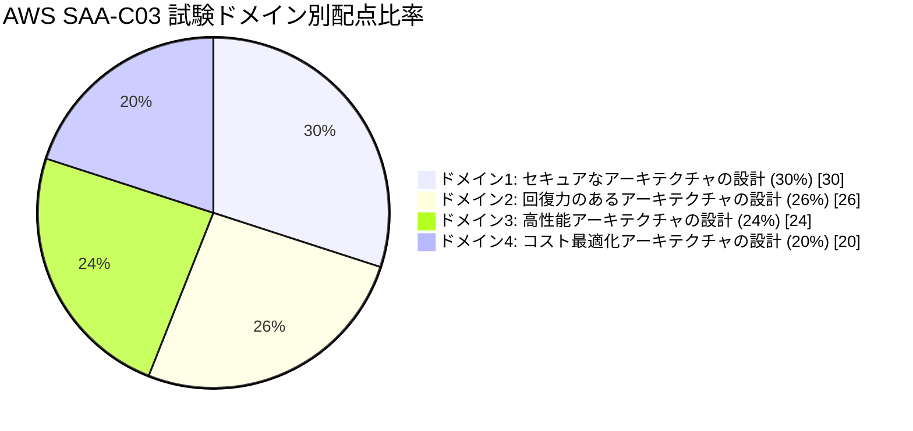

出典: [AWS Certified Solutions Architect - Associate (SAA-C03) Exam Guide](https://docs.aws.amazon.com/aws-certification/latest/solutions-architect-associate-03/solutions-architect-associate-03.html) の "Content outline" セクション。

試験は50問の採点対象問題と15問の非採点問題(将来の出題候補を評価するためのもの、どれが非採点かは受験者にはわからない)で構成され、720点以上(100〜1,000点のスケールスコア)で合格となります。

### 1.2 3つのタスクの関係

ドメイン1は以下の3つのタスクステートメントに分解されます。

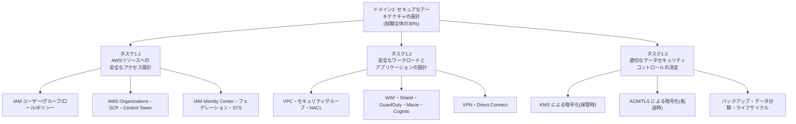

出典: [Content Domain 1: Design Secure Architectures](https://docs.aws.amazon.com/aws-certification/latest/solutions-architect-associate-03/solutions-architect-associate-03-domain1.html)

大まかに言うと、
- **タスク1.1**は「誰が・どのアカウントから・何にアクセスできるか」を制御する **IDとアクセス管理(IAM)** の領域
- **タスク1.2**は「ネットワークとアプリケーションをどう守るか」という **インフラ・アプリケーションセキュリティ** の領域
- **タスク1.3**は「データそのものをどう守るか」という **データ保護・暗号化** の領域

と整理すると理解しやすくなります。それでは、それぞれを順番に見ていきましょう。

---

## 2. タスク1.1: AWSリソースへの安全なアクセス設計

公式ガイドでの定義は以下の通りです。

> **Knowledge of:** 複数アカウントにまたがるアクセス制御と管理/ AWSフェデレーションアクセスとIDサービス(例: IAM, AWS IAM Identity Center)/ AWSのグローバルインフラストラクチャ(例: アベイラビリティーゾーン、AWSリージョン)/ AWSセキュリティのベストプラクティス(例: 最小権限の原則)/ AWS責任共有モデル
>
> **Skills in:** IAMユーザーとルートユーザーへのセキュリティベストプラクティスの適用(MFAなど)/ IAMユーザー・グループ・ロール・ポリシーを含む柔軟な認可モデルの設計/ ロールベースアクセス制御戦略の設計(AWS STS、ロールスイッチ、クロスアカウントアクセス)/ 複数AWSアカウントのセキュリティ戦略の設計(AWS Control Tower、SCP)/ AWSサービスに対するリソースポリシーの適切な使用の判断/ ディレクトリサービスをIAMロールとフェデレーションすべきタイミングの判断

出典: [Content Domain 1 - Task 1.1](https://docs.aws.amazon.com/aws-certification/latest/solutions-architect-associate-03/solutions-architect-associate-03-domain1.html)

### 2.1 AWS共有責任モデル

AWSと利用者の間でセキュリティ責任がどう分担されるかを理解することが、すべての土台になります。

| 領域 | 責任者 | 具体例 |
|---|---|---|
| クラウドの**セキュリティ** (Security **OF** the Cloud) | AWS | データセンターの物理セキュリティ、ハードウェア、ネットワークインフラ、仮想化基盤 |
| クラウド内の**セキュリティ** (Security **IN** the Cloud) | 利用者 | IAM設定、OSパッチ適用、ネットワーク設定(セキュリティグループ等)、データの暗号化、アプリケーションレベルの認証 |

サービスの種類(IaaS/PaaS/マネージド/サーバーレス)によって、利用者側の責任範囲は変動します。例えばEC2(IaaS)ではゲストOSのパッチ適用まで利用者責任ですが、Lambda(サーバーレス)ではOSパッチはAWS責任となり、利用者はコードとその設定のみに集中できます。試験では「このシナリオでの障害はAWS側の責任か利用者側の責任か」を問う設問が頻出します。

### 2.2 IAMの基本構成要素

AWS Identity and Access Management (IAM) は、認証(誰であるか)と認可(何ができるか)を管理する中核サービスです。

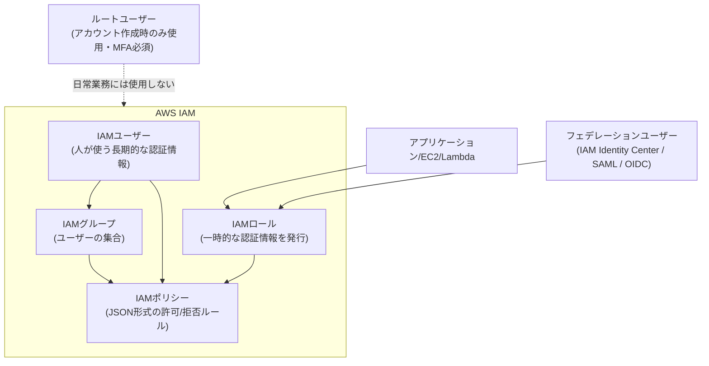

出典: [Security best practices in IAM](https://docs.aws.amazon.com/IAM/latest/UserGuide/best-practices.html)

各要素の役割は次の通りです。

| 要素 | 役割 | ポイント |
|---|---|---|
| IAMユーザー | 個人に紐づく長期的な認証情報 | 現在のベストプラクティスでは人間のユーザーには極力使わず、フェデレーションを推奨 |
| IAMグループ | ユーザーの集合体 | ポリシーをまとめて適用でき管理が容易になる |
| IAMロール | 一時的な認証情報を発行する「なりすまし可能な身分証」 | EC2・Lambda・クロスアカウントアクセス・フェデレーションユーザーなど、あらゆる「人以外/一時的」なアクセスの基本単位 |
| IAMポリシー | 許可/拒否を定義するJSONドキュメント | ID ベースポリシー(ユーザー/グループ/ロールに付与)とリソースベースポリシー(S3バケットなど)の2種類がある |

### 2.3 最小権限の原則とポリシー評価ロジック

**最小権限の原則(Principle of Least Privilege)**とは、「タスクの実行に必要な最小限の権限だけを付与する」という考え方です。AWSの公式ベストプラクティスガイドでも、最初はAWS管理ポリシーから始めて段階的に最小権限へ絞り込み、IAM Access Analyzerを使って実際のアクセス活動に基づいた最小権限ポリシーを生成することが推奨されています。

出典: [Security best practices in IAM](https://docs.aws.amazon.com/IAM/latest/UserGuide/best-practices.html)

IAMが複数のポリシーをどう評価して最終的な許可/拒否を決定するか、そのロジックを理解することは非常に重要です。

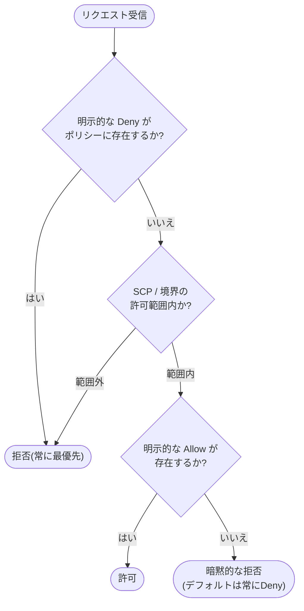

**評価の鉄則**:
1. デフォルトはすべて**暗黙的な拒否 (implicit deny)**
2. **明示的な Allow** があれば許可される
3. ただし**明示的な Deny** が一つでもあれば、他のどんなAllowよりも優先されて必ず拒否される
4. SCP・許可境界(Permissions Boundary)・リソースベースポリシーなど複数のポリシータイプが絡む場合は、それぞれの「共通部分(intersection)」が実効権限になる

この「Deny最優先」のロジックは試験で非常によく問われるポイントです。

### 2.4 ルートユーザーとIAMユーザーの保護

| ベストプラクティス | 内容 | 出典 |
|---|---|---|
| ルートユーザーを日常業務に使わない | アカウント作成後は緊急時・特定のアカウントタスク以外で使用しない | [IAM best practices](https://docs.aws.amazon.com/IAM/latest/UserGuide/best-practices.html) |
| ルートユーザーとIAMユーザーにMFAを必須化 | 多要素認証(仮想MFA、ハードウェアMFAなど)を有効化する | 同上 |
| 人間のユーザーにはフェデレーションを利用 | IDプロバイダー経由で一時的な認証情報を使わせ、長期的なアクセスキーの発行を避ける | 同上 |
| ワークロードにはIAMロールを利用 | アプリケーション/EC2/Lambda等には長期アクセスキーではなくロールによる一時認証情報を使わせる | 同上 |
| 未使用の認証情報を定期的に見直し削除する | IAM Credential Reportで90日以上未使用のキーを特定し無効化・削除する | 同上 |

### 2.5 IAM Identity Center とフェデレーション

**AWS IAM Identity Center**(旧AWS SSO)は、複数のAWSアカウントや業務アプリケーションへのシングルサインオンを一元管理するサービスです。AWSは、集中的なアクセス管理のために人間のユーザーにはIAM Identity Centerの利用を推奨しています。

出典: [AWS Identity and Access Management (IAM) Best Practices](https://aws.amazon.com/iam/resources/best-practices/)

フェデレーションを使うべき典型的なケース:
- 社内に既存のActive DirectoryやオンプレミスIdPがあり、それと連携してAWSへのアクセスを許可したい場合
- 複数のAWSアカウントに対して、部署やロールに応じた権限セットを一元的に割り当てたい場合
- SAML 2.0やOIDC経由の外部IDプロバイダーと連携する場合

IAM Identity Centerを使うと、ユーザーは自分のディレクトリ資格情報でサインインし、裏側ではIAMロールへの一時的なAssumeRoleが行われる仕組みになっています。

### 2.6 AWS STSとクロスアカウントアクセス

**AWS Security Token Service (STS)** は、一時的なセキュリティ認証情報(アクセスキーID・シークレットアクセスキー・セッショントークン)を発行するサービスです。クロスアカウントアクセスの基本パターンは以下の通りです。

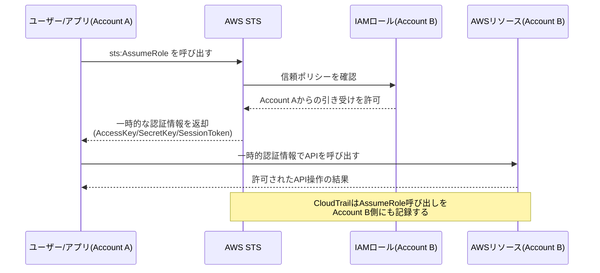

出典: [IAM tutorial: Delegate access across AWS accounts using IAM roles](https://docs.aws.amazon.com/IAM/latest/UserGuide/tutorial_cross-account-with-roles.html)、[AssumeRole - AWS STS API Reference](https://docs.aws.amazon.com/STS/latest/APIReference/API_AssumeRole.html)

ステップバイステップで整理すると:

1. **Account B**(リソースを所有する側)で、Account Aを信頼する**信頼ポリシー(Trust Policy)**付きのIAMロールを作成する
2. **Account A**のユーザーやロールに`sts:AssumeRole`を許可するポリシーをアタッチする
3. Account Aのユーザーが`AssumeRole` APIを呼び出す(必要に応じてMFAや外部IDを条件に含める)
4. STSが一時的な認証情報(デフォルト有効期限1時間)を発行する
5. その一時的な認証情報を使ってAccount Bのリソースにアクセスする

サードパーティ(APNパートナーなど)によるクロスアカウントアクセスでは、意図しない「混乱した代理」問題(confused deputy problem)を防ぐために**外部ID(External ID)**を条件に含めることがベストプラクティスとされています。

出典: [Cross account resource access in IAM](https://docs.aws.amazon.com/IAM/latest/UserGuide/access_policies-cross-account-resource-access.html)

### 2.7 マルチアカウント戦略: Organizations, Control Tower, SCP

複数のAWSアカウントを一元的に統治するための仕組みが**AWS Organizations**です。

- **AWS Organizations**: 複数アカウントをまとめて管理し、一括請求や組織単位(OU)によるグルーピングを可能にする
- **サービスコントロールポリシー(SCP)**: 組織・OU・アカウント単位で「そのアカウント内で許可される権限の上限」を設定するガードレール。SCP自体は権限を**付与しない**点に注意(あくまで上限を制限するのみで、実際の許可はIDベース/リソースベースポリシーが必要)
- **AWS Control Tower**: AWS OrganizationsとIAM Identity Centerを組み合わせ、ベストプラクティスに基づいたマルチアカウント環境(ランディングゾーン)を短時間で構築・維持するマネージドサービス

出典: [What is AWS Organizations?](https://docs.aws.amazon.com/organizations/latest/userguide/orgs_introduction.html)、[Service control policy examples](https://docs.aws.amazon.com/organizations/latest/userguide/orgs_manage_policies_scps_examples.html)、[Choosing AWS security, identity, and governance services](https://docs.aws.amazon.com/decision-guides/latest/security-on-aws-how-to-choose/choosing-aws-security-services.html)

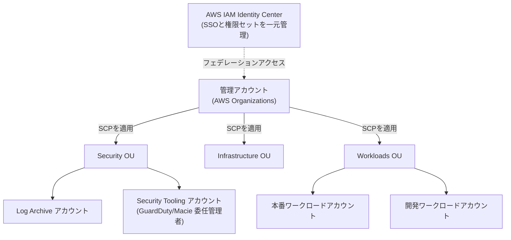

SCPの重要なポイント(試験頻出):
- SCPは**管理アカウント自体には適用されない**(管理アカウントはSCPの制約を受けない)
- SCPは**権限を追加しない**。あくまで「実効権限 = IDベースポリシー ∩ SCP」という掛け算(積集合)であり、SCPで許可されていてもIDベースポリシーで許可されていなければアクセスは拒否される
- 2025年9月のアップデートでSCPはIAMポリシー言語全体をサポートするようになり、Condition・個別リソースARN・NotActionなどより柔軟な記述が可能になった

出典: [AWS Organizations supports full IAM policy language for SCPs](https://aws.amazon.com/about-aws/whats-new/2025/09/aws-organizations-iam-language-service-control-policies)

### 2.8 リソースベースポリシー

IDベースポリシー(ユーザー/グループ/ロールにアタッチ)に対し、**リソースベースポリシー**はリソース側(S3バケット、KMSキー、Lambda関数、SQSキューなど)に直接アタッチするポリシーです。クロスアカウントで特定のプリンシパルにアクセスを許可したい場合に特に有用で、S3バケットポリシーはその代表例です。

出典: [Cross account resource access in IAM](https://docs.aws.amazon.com/IAM/latest/UserGuide/access_policies-cross-account-resource-access.html)

「リソースベースポリシーを使うべきか、IAMロールを使うべきか」の判断ポイント:

| シナリオ | 推奨アプローチ |
|---|---|
| 別アカウントのユーザーに一時的にリソースへアクセスさせたい | クロスアカウントIAMロール + AssumeRole |
| S3バケットに対して複数の外部アカウントから読み取りを許可したい | S3バケットポリシー(リソースベース) |
| サービス間(Lambda→S3など)でアクセスを許可したい | サービスロール(IAMロール) + 必要に応じてリソースポリシー |

### タスク1.1 ベストプラクティスまとめ

| カテゴリ | ベストプラクティス | 出典 |
|---|---|---|
| ルートユーザー | 日常業務では使わずMFAで保護する | [IAM Best Practices](https://docs.aws.amazon.com/IAM/latest/UserGuide/best-practices.html) |
| 人間のアクセス | フェデレーション/IAM Identity Centerで一時的な認証情報を使わせる | 同上 |
| ワークロードのアクセス | IAMロールを使い長期アクセスキーを避ける | 同上 |
| 権限設計 | 最小権限の原則から始め、Access Analyzerで継続的に絞り込む | 同上 |
| マルチアカウント | Organizations + SCPで組織全体のガードレールを設定 | [AWS Organizations](https://docs.aws.amazon.com/organizations/latest/userguide/orgs_introduction.html) |
| クロスアカウント | AssumeRole + 外部IDで「混乱した代理」問題を防止 | [Cross account resource access](https://docs.aws.amazon.com/IAM/latest/UserGuide/access_policies-cross-account-resource-access.html) |
| 監査 | IAM Access Analyzerで意図しない外部共有を検出する | [IAM Best Practices](https://docs.aws.amazon.com/IAM/latest/UserGuide/best-practices.html) |

---

## 3. タスク1.2: 安全なワークロードとアプリケーションの設計

公式ガイドでの定義は以下の通りです。

> **Knowledge of:** アプリケーションの設定と認証情報のセキュリティ/ AWSサービスエンドポイント/ AWS上でのポート・プロトコル・ネットワークトラフィックの制御/ セキュアなアプリケーションアクセス/ 適切なユースケースを備えたセキュリティサービス(例: Amazon Cognito、Amazon GuardDuty、Amazon Macie)/ AWS外部の脅威ベクトル(例: DDoS、SQLインジェクション)
>
> **Skills in:** セキュリティコンポーネントを含むVPCアーキテクチャの設計(セキュリティグループ、ルートテーブル、ネットワークACL、NATゲートウェイなど)/ ネットワークセグメンテーション戦略の決定(パブリックサブネットとプライベートサブネットの利用など)/ アプリケーションを保護するためのAWSサービスの統合(AWS Shield、AWS WAF、IAM Identity Center、AWS Secrets Managerなど)/ AWSクラウドとの間の外部ネットワーク接続の保護(VPN、AWS Direct Connectなど)

出典: [Content Domain 1 - Task 1.2](https://docs.aws.amazon.com/aws-certification/latest/solutions-architect-associate-03/solutions-architect-associate-03-domain1.html)

### 3.1 VPCの基本アーキテクチャ

Amazon VPC(Virtual Private Cloud)は、AWS上に論理的に分離されたネットワーク空間を作るサービスです。安全なワークロード設計の第一歩は、適切なサブネット構成とルーティング設計です。

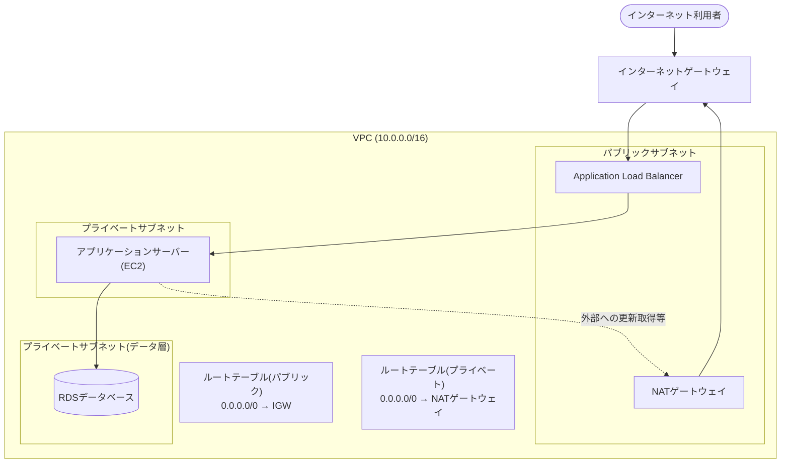

出典: [Infrastructure security in Amazon VPC](https://docs.aws.amazon.com/vpc/latest/userguide/infrastructure-security.html)

**ネットワークセグメンテーションの基本原則**:

| 層 | 配置するリソース | インターネットからの直接アクセス |
|---|---|---|
| パブリックサブネット | ALB、NATゲートウェイ、踏み台ホスト | あり(IGWへの経路を持つ) |
| プライベートサブネット(アプリ層) | EC2アプリケーションサーバー、Lambda(VPC内) | なし(NAT経由でのみ外向き通信) |
| プライベートサブネット(データ層) | RDS、ElastiCache | なし(アプリ層からのみアクセス許可) |

この「パブリック/プライベートの階層化」こそが、ネットワークセグメンテーション戦略の中核です。

### 3.2 セキュリティグループ vs ネットワークACL

VPC内のトラフィック制御には、**セキュリティグループ**と**ネットワークACL(NACL)**という2種類のファイアウォールが存在し、それぞれ異なるレイヤーで動作します。

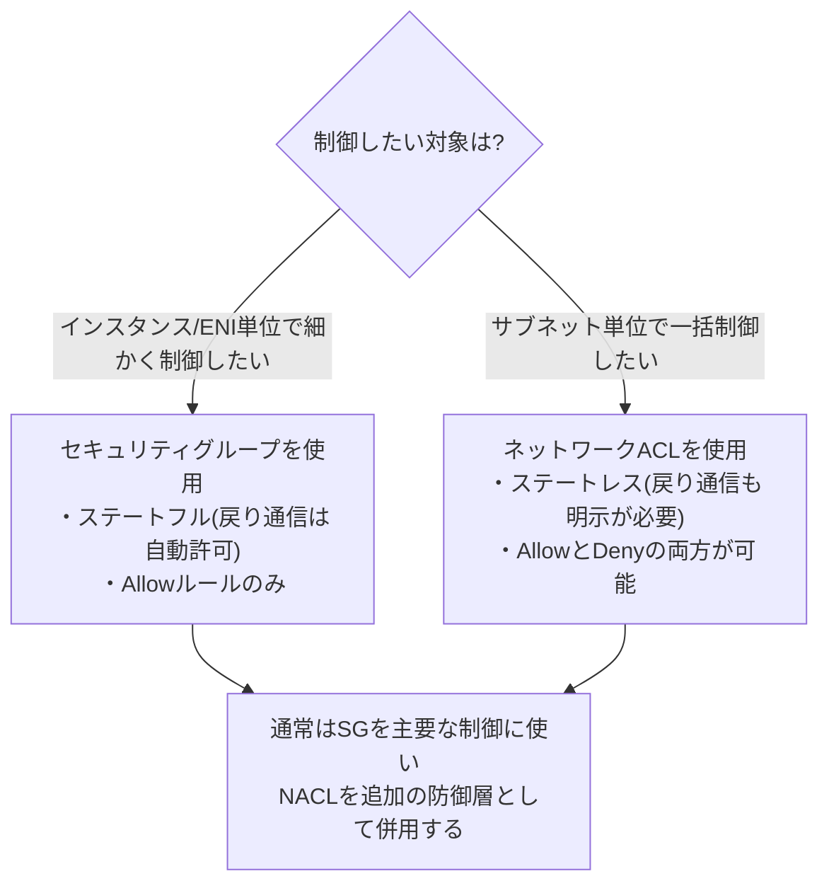

出典: [Infrastructure security in Amazon VPC](https://docs.aws.amazon.com/vpc/latest/userguide/infrastructure-security.html)、[Control traffic to your AWS resources using security groups](https://docs.aws.amazon.com/vpc/latest/userguide/vpc-security-groups.html)

| 比較項目 | セキュリティグループ | ネットワークACL |
|---|---|---|
| 適用単位 | インスタンス(ENI)単位 | サブネット単位 |
| ルール | Allowのみ | AllowとDenyの両方 |
| 状態管理 | ステートフル(戻り通信は自動許可) | ステートレス(インバウンド・アウトバウンド両方に明示ルールが必要) |
| 評価順序 | すべてのルールを評価してから決定(優先順位なし) | 番号の小さいルールから順に評価し、最初にマッチしたルールが適用される |
| 1つのリソースに対する数 | 複数のSGを同時にアタッチ可能 | サブネットにつき1つのNACL |

AWS公式ドキュメントでは「セキュリティグループを主要な制御手段とし、必要に応じてネットワークACLを二次的な防御層(特定のIPを明示的にブロックしたい場合など)として追加する」ことが推奨されています。

出典: [Infrastructure security in Amazon VPC](https://docs.aws.amazon.com/vpc/latest/userguide/infrastructure-security.html)

### 3.3 多層防御(Defense in Depth)

単一のセキュリティ対策に依存せず、複数の防御層を重ねることが、AWS Well-Architected フレームワークのセキュリティの柱における設計原則の一つ「すべての層でセキュリティを適用する(Apply security at all layers)」です。

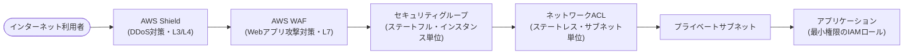

出典: [Security - AWS Well-Architected Framework](https://docs.aws.amazon.com/wellarchitected/latest/framework/security.html)(設計原則: 強固なID基盤の実装、トレーサビリティの実現、すべての層でのセキュリティ適用、セキュリティのベストプラクティスの自動化、転送中および保管中データの保護、人によるデータへの直接アクセスの排除、セキュリティイベントへの備え)

### 3.4 脅威ベクトルへの対策: AWS WAF と AWS Shield

外部からの代表的な脅威ベクトルには**DDoS攻撃**と**SQLインジェクション**などのWebアプリケーション攻撃があり、AWSはそれぞれに対応するマネージドサービスを提供しています。

| サービス | 保護対象レイヤー | 主な役割 |
|---|---|---|
| **AWS Shield Standard** | ネットワーク層/トランスポート層(L3/L4) | 全AWS顧客に無償で自動適用され、一般的なDDoS攻撃から保護する |
| **AWS Shield Advanced** | L3/L4 + アプリケーション層(L7) | 追加料金で高度なDDoS検知・緩和・24時間対応のDDoS対応チーム(DRT)へのアクセスを提供 |
| **AWS WAF** | アプリケーション層(L7) | HTTP/HTTPSリクエストを検査し、SQLインジェクションやクロスサイトスクリプティング(XSS)などを防ぐカスタマイズ可能なルールを適用 |
| **AWS Firewall Manager** | マルチアカウント/マルチリソース | 複数アカウント・複数リソースにわたってWAFやShield Advancedのポリシーを一元的に適用・管理 |

出典: [What is AWS WAF?](https://docs.aws.amazon.com/waf/latest/developerguide/what-is-aws-waf.html)、[AWS Shield Standard overview](https://docs.aws.amazon.com/waf/latest/developerguide/ddos-standard-summary.html)、[AWS Shield Advanced overview](https://docs.aws.amazon.com/waf/latest/developerguide/ddos-advanced-summary.html)

WAFとShieldは併用されることが多く、CloudFrontやALBの前段に配置することで、多層防御図の一番左(エッジ)を構成します。

### 3.5 GuardDuty, Macie, Cognito のユースケース

公式ガイドが名指しする3つのセキュリティサービスは、それぞれ異なる役割を担います。

| サービス | 種別 | 主なユースケース |
|---|---|---|
| **Amazon GuardDuty** | 脅威検知 | CloudTrail・VPCフローログ・DNSログを機械学習と脅威インテリジェンスで分析し、不審な挙動(不正アクセス、マルウェア通信など)を検出する |
| **Amazon Macie** | データセキュリティ | 機械学習とパターンマッチングでS3内の個人情報(PII)など機密データを自動的に発見・分類し、リスクを可視化する |
| **Amazon Cognito** | アプリケーション認証 | Web/モバイルアプリにサインアップ・サインイン・アクセス制御機能を素早く追加するためのユーザーディレクトリ/フェデレーション認証サービス |

出典: [What is Amazon Macie?](https://docs.aws.amazon.com/macie/latest/user/what-is-macie.html)、[Security, identity, and compliance overview](https://docs.aws.amazon.com/whitepapers/latest/aws-overview/security-services.html)

判断のポイント: 「アプリの利用者(エンドユーザー)のログイン管理をしたい」→**Cognito**、「AWS環境内の不審な挙動を検知したい」→**GuardDuty**、「S3内に個人情報が置かれていないか棚卸ししたい」→**Macie**、という役割分担で覚えると混同しにくくなります。

### 3.6 AWS Secrets Manager によるアプリケーション認証情報の保護

データベースのパスワードやAPIキーなどのアプリケーション認証情報をソースコードに直書きすることは典型的なアンチパターンです。**AWS Secrets Manager**はこれらの認証情報を暗号化して安全に保管・取得し、自動的にローテーションする仕組みを提供します。

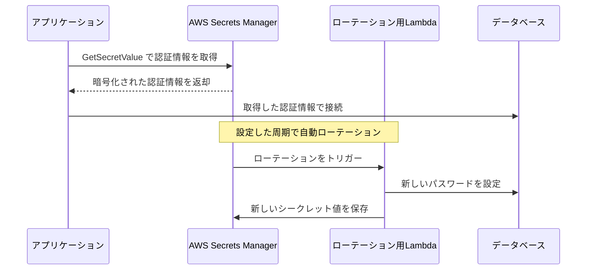

出典: [AWS Secrets Manager Documentation](https://docs.aws.amazon.com/secretsmanager/)

これにより、アプリケーションのコードや設定ファイルに認証情報を平文で書く必要がなくなり、「アプリケーション設定と認証情報のセキュリティ」という公式ガイドの知識項目に直接対応します。

### 3.7 ハイブリッド接続: VPNとDirect Connect

オンプレミス環境とAWSクラウドを安全に接続する方法として、主に2つの選択肢があります。

| 接続方式 | 特徴 | 適したユースケース |
|---|---|---|
| **AWS Site-to-Site VPN** | インターネット経由でIPsecトンネルを確立 | 素早く低コストで接続したい場合、バックアップ回線として |
| **AWS Direct Connect** | AWSとオンプレミス間を専用線で物理的に接続 | 大量データ転送、低レイテンシー、帯域の安定性が求められる本番用途 |
| **Direct Connect + VPN(併用)** | 専用線を主回線、VPNをフェイルオーバー用に併用 | 高可用性が求められるハイブリッド環境 |

VPCへのアクセスを外部に開放する際は、パブリックインターネット経由ではなくVPNやDirect Connectを使うことで、「AWSクラウドとの間の外部ネットワーク接続を保護する」という公式ガイドの要件を満たせます。

### タスク1.2 ベストプラクティスまとめ

| カテゴリ | ベストプラクティス |
|---|---|
| ネットワーク設計 | パブリック/プライベートサブネットでワークロードを階層化する |
| ファイアウォール | セキュリティグループを主、ネットワークACLを副として多層で構成する |
| エッジ保護 | CloudFront/ALBの前段にWAFとShieldを配置する |
| 脅威検知 | GuardDutyを有効化し、S3の機密データはMacieで棚卸しする |
| アプリ認証情報 | Secrets Managerで一元管理し、自動ローテーションを設定する |
| ハイブリッド接続 | 本番はDirect Connect、バックアップ/簡易接続はVPNを使う |

---

## 4. タスク1.3: 適切なデータセキュリティコントロールの決定

公式ガイドでの定義は以下の通りです。

> **Knowledge of:** データアクセスとガバナンス/ データ復旧/ データの保持と分類/ 暗号化と適切な鍵管理
>
> **Skills in:** コンプライアンス要件を満たすためのAWS技術の整合/ 保管時のデータ暗号化(AWS KMSなど)/ 転送時のデータ暗号化(AWS Certificate Manager [ACM] を使ったTLSなど)/ 暗号化キーに対するアクセスポリシーの実装/ データバックアップとレプリケーションの実装/ データアクセス・ライフサイクル・保護に関するポリシーの実装/ 暗号化キーのローテーションと証明書の更新

出典: [Content Domain 1 - Task 1.3](https://docs.aws.amazon.com/aws-certification/latest/solutions-architect-associate-03/solutions-architect-associate-03-domain1.html)

### 4.1 暗号化の基本: 保管時と転送時

データ保護は大きく2つの状態に分けて考えます。

| 状態 | 定義 | 代表的な保護手段 |
|---|---|---|
| **保管時の暗号化(Encryption at Rest)** | ディスクやストレージに保存されているデータ | AWS KMSを使ったS3 SSE-KMS、EBS暗号化、RDS暗号化など |
| **転送時の暗号化(Encryption in Transit)** | ネットワークを通過中のデータ | TLS/SSL(ACMで発行した証明書を使用) |

AWS Well-Architected フレームワークのセキュリティの柱でも「転送中および保管中のデータを保護する」ことが7つの設計原則の一つとして掲げられています。

出典: [Security - AWS Well-Architected Framework](https://docs.aws.amazon.com/wellarchitected/latest/framework/security.html)

### 4.2 AWS KMSとエンベロープ暗号化

**AWS Key Management Service (KMS)** は、暗号化キーの作成・管理・利用を行うマネージドサービスです。KMSは「エンベロープ暗号化」という方式を採用しており、実データを直接カスタマー管理キー(CMK)で暗号化するのではなく、CMKで暗号化した「データキー」を使ってデータそのものを暗号化します。

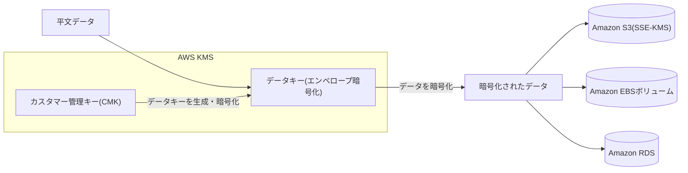

出典: [AWS Key Management Service best practices](https://docs.aws.amazon.com/pdfs/prescriptive-guidance/latest/aws-kms-best-practices/aws-kms-best-practices.pdf)

**キーの種類**:

| 種類 | キーマテリアルの生成元 | 特徴 |
|---|---|---|
| AWS所有キー | AWSが管理 | 利用者からは見えず、複数アカウントで共有される場合がある(無料) |
| AWS管理キー | AWSが管理、アカウント専用 | サービスごとに自動作成される(例: `aws/s3`) |
| カスタマー管理キー(CMK) | 利用者が作成・管理 | ポリシー、ローテーション、有効/無効化を利用者が制御できる |
| インポートされたキー | 利用者が外部で生成し持ち込む | AWSによる自動ローテーション対象外(手動ローテーションが必要) |

暗号化キーへのアクセスは、**キーポリシー(リソースベースポリシー)**単独でも許可できます。IAMポリシーで権限を付与する場合は、同一アカウントのIAMへ認可を委任する記述がキーポリシーに必要です。これらに加えて、KMS Grantsも権限を付与する認可経路です。

出典: [AWS Key Management Service best practices](https://docs.aws.amazon.com/pdfs/prescriptive-guidance/latest/aws-kms-best-practices/aws-kms-best-practices.pdf)

### 4.3 キーローテーション

暗号化キーは定期的にローテーションすることで、万が一キーが漏えいした場合の被害範囲(ブラストラディウス)を限定できます。

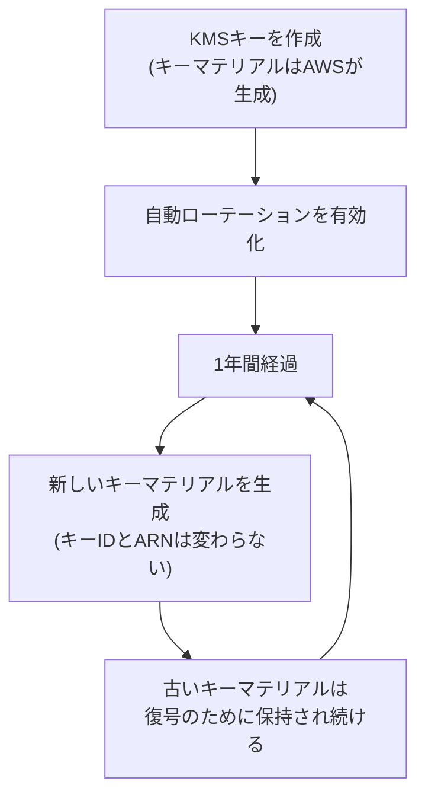

出典: [Rotate AWS KMS keys](https://docs.aws.amazon.com/kms/latest/developerguide/rotate-keys.html)

ポイント:
- カスタマーマネージドキーの自動ローテーションはデフォルトで無効。有効化した場合のデフォルト間隔は365日（年1回）で、周期を設定可能。対象は対称暗号化のAWS_KMSオリジンキーで、キーIDやARNは変更されない(アプリケーション側の変更は不要)
- 過去のキーマテリアルはすべて保持されるため、古いバージョンで暗号化されたデータも引き続き復号可能
- インポートされたキーマテリアル(EXTERNAL origin)は自動ローテーションの対象外。ただし対称暗号化キーであればオンデマンドローテーションを利用できる
- AWS KMSはデータキーの過度な再利用を推奨しておらず、データキー自体は「ラッピングキー」であるCMKよりも高頻度で使い捨てられる設計になっている

出典: [Rotate AWS KMS keys](https://docs.aws.amazon.com/kms/latest/developerguide/rotate-keys.html)

### 4.4 転送時の暗号化: ACMとTLS

**AWS Certificate Manager (ACM)** は、TLS/SSL証明書のプロビジョニング・管理・自動更新を行うサービスです。

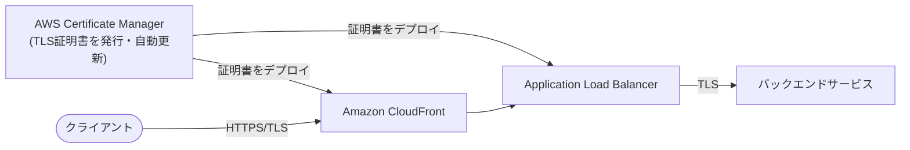

ACM証明書はCloudFront・ALB・API Gatewayなどに直接アタッチでき、有効期限が近づくと自動更新されるため、証明書の期限切れによるサービス停止という典型的な運用ミスを防げます。これは公式ガイドの「証明書のローテーションと更新」という項目に直接対応します。

### 4.5 データ分類、ガバナンス、ライフサイクル

データセキュリティコントロールを設計する際は、暗号化だけでなく「データそのものの取り扱いルール」を定義する必要があります。

| 観点 | 内容 |
|---|---|
| **データ分類** | 機密度に応じて「公開」「社内限定」「機密」「規制対象」などのラベルを付け、それぞれに適した保護レベルを適用する |
| **データアクセスガバナンス** | 最小権限の原則に基づき、必要な人・システムだけがデータにアクセスできるようにIAMポリシーやバケットポリシーで制御する |
| **データライフサイクル** | S3ライフサイクルポリシーなどを使い、一定期間後に低コストのストレージクラスへ移行したり、不要になったデータを自動削除したりする |
| **コンプライアンス整合** | 業界規制(医療分野の各種規制、金融分野の規制など)の要件に合わせて、保持期間・暗号化方式・アクセスログの取得方法を設計する |

Amazon Macieのようなサービスを組み合わせることで、S3内にどのような機密データが存在するかを自動的に発見・分類し、ガバナンスの実効性を高めることができます(3.5節を参照)。

### 4.6 バックアップと障害復旧

データ保護には「暗号化」だけでなく「消失・破損からの復旧」の観点も欠かせません。**AWS Backup**は、EC2/EBS・RDS・DynamoDB・EFSなど複数のAWSサービスにまたがるバックアップを一元的なポリシーで管理できるマネージドサービスです。

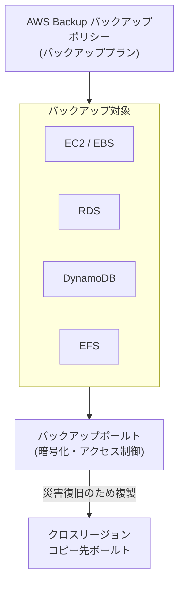

出典: [Creating cross-Region copies](https://docs.aws.amazon.com/aws-backup/latest/devguide/cross-region-backup.html)(AWS Backupのクロスリージョンコピー機能に言及)

データ復旧戦略を設計する際のポイント:
- バックアップボールト自体もKMSで暗号化し、アクセス権限を最小化する
- クロスリージョンコピーを設定することで、リージョン規模の障害からもデータを保護できる
- S3のバージョニングやレプリケーション(SRR/CRR)も、暗号化設定を引き継ぎつつデータ復旧性を高める手段として活用できる

### タスク1.3 ベストプラクティスまとめ

| カテゴリ | ベストプラクティス | 出典 |
|---|---|---|
| 保管時の暗号化 | KMSでS3/EBS/RDSなどを暗号化する | [KMS Best Practices](https://docs.aws.amazon.com/pdfs/prescriptive-guidance/latest/aws-kms-best-practices/aws-kms-best-practices.pdf) |
| キー管理 | カスタマー管理キーを使い、自動ローテーションを有効化する | [Rotate AWS KMS keys](https://docs.aws.amazon.com/kms/latest/developerguide/rotate-keys.html) |
| 転送時の暗号化 | ACMで証明書を発行しCloudFront/ALBにアタッチ、自動更新を活用する | — |
| キーアクセス制御 | キーポリシーとIAMポリシーの両方で最小権限を徹底する | [KMS Best Practices](https://docs.aws.amazon.com/pdfs/prescriptive-guidance/latest/aws-kms-best-practices/aws-kms-best-practices.pdf) |
| データ分類 | Macie等でS3内の機密データを継続的に発見・分類する | [What is Amazon Macie?](https://docs.aws.amazon.com/macie/latest/user/what-is-macie.html) |
| バックアップ | AWS Backupで一元的なバックアッププランを組み、クロスリージョンで複製する | — |

---

## 5. 試験対策のポイント

### 5.1 頻出する比較の整理

| 比較対象 | 覚えるべき違い |
|---|---|
| セキュリティグループ vs NACL | ステートフル/ステートレス、インスタンス単位/サブネット単位、Allowのみ/Allow・Deny両方 |
| SCP vs IAMポリシー | SCPは権限の「上限」を定めるガードレールであり権限は付与しない。実効権限は積集合 |
| Shield Standard vs Shield Advanced | 無償・自動 vs 有償・高度な緩和とDRTサポート |
| KMS自動ローテーション vs 手動ローテーション | AWS生成キーマテリアルは年1回自動、インポートキーは手動/オンデマンド |
| VPN vs Direct Connect | インターネット経由の迅速な接続 vs 専用線による安定した高帯域接続 |
| GuardDuty vs Macie vs Cognito | 脅威検知 vs 機密データ発見 vs アプリ利用者認証 |

### 5.2 よくある誤解・落とし穴

- **「SCPをAllowすればアクセスできる」は誤り**: SCPだけでは何も許可されない。必ずIDベース/リソースベースポリシーとの掛け算(共通部分)で実効権限が決まる。
- **「NACLだけで十分」は誤り**: NACLはステートレスなので、戻りの通信も明示的に許可しないと通信が成立しない。基本はセキュリティグループを主軸に設計する。
- **「ルートユーザーはAdministratorAccessロールと同じ」は誤り**: ルートユーザーには一部のタスク(アカウント解約など)がIAMユーザー/ロールでは実行できず、逆に日常業務には絶対に使うべきではない。
- **「暗号化すればコンプライアンス要件はすべて満たせる」は誤り**: 暗号化はデータ保護の一手段に過ぎず、データ分類・アクセスガバナンス・保持期間・監査ログなど総合的な設計が必要。

---

## 6. まとめ

ドメイン1「セキュアなアーキテクチャの設計」は、SAA-C03試験で最大の配点比率(30%)を持つ領域であり、以下の3つの柱で構成されています。

1. **タスク1.1(アクセス設計)**: IAMの基本構成要素、最小権限の原則、ポリシー評価ロジック、STSによるクロスアカウントアクセス、Organizations/SCP/Control Towerによるマルチアカウント統治
2. **タスク1.2(ワークロード/アプリケーション設計)**: VPCのネットワークセグメンテーション、セキュリティグループとNACLの多層防御、WAF/Shieldによる脅威対策、GuardDuty/Macie/Cognitoの使い分け、Secrets Managerによる認証情報保護、VPN/Direct Connectによる安全な接続
3. **タスク1.3(データセキュリティ)**: KMSによる保管時暗号化とエンベロープ暗号化、キーローテーション、ACM/TLSによる転送時暗号化、データ分類とガバナンス、AWS Backupによるデータ復旧

これらはすべて独立した知識ではなく、実際のアーキテクチャ設計では組み合わさって機能します。学習の際は、単一のサービスを暗記するのではなく、「なぜそのサービスが必要で、どのサービスと組み合わせて使うのか」という文脈で理解することが、試験本番でのシナリオ問題に対応する鍵となります。

---

## 7. 参考資料(出典URL一覧)

### 公式試験ガイド
- [AWS Certified Solutions Architect - Associate (SAA-C03) Exam Guide](https://docs.aws.amazon.com/aws-certification/latest/solutions-architect-associate-03/solutions-architect-associate-03.html)
- [Content Domain 1: Design Secure Architectures](https://docs.aws.amazon.com/aws-certification/latest/solutions-architect-associate-03/solutions-architect-associate-03-domain1.html)

### IAM / アクセス管理
- [Security best practices in IAM](https://docs.aws.amazon.com/IAM/latest/UserGuide/best-practices.html)
- [AWS Identity and Access Management (IAM) Best Practices](https://aws.amazon.com/iam/resources/best-practices/)
- [IAM tutorial: Delegate access across AWS accounts using IAM roles](https://docs.aws.amazon.com/IAM/latest/UserGuide/tutorial_cross-account-with-roles.html)
- [Cross account resource access in IAM](https://docs.aws.amazon.com/IAM/latest/UserGuide/access_policies-cross-account-resource-access.html)
- [AssumeRole - AWS Security Token Service API Reference](https://docs.aws.amazon.com/STS/latest/APIReference/API_AssumeRole.html)

### マルチアカウント統治
- [What is AWS Organizations?](https://docs.aws.amazon.com/organizations/latest/userguide/orgs_introduction.html)
- [Service control policy examples](https://docs.aws.amazon.com/organizations/latest/userguide/orgs_manage_policies_scps_examples.html)
- [AWS Organizations supports full IAM policy language for SCPs](https://aws.amazon.com/about-aws/whats-new/2025/09/aws-organizations-iam-language-service-control-policies)
- [Choosing AWS security, identity, and governance services](https://docs.aws.amazon.com/decision-guides/latest/security-on-aws-how-to-choose/choosing-aws-security-services.html)

### ネットワークセキュリティ
- [Infrastructure security in Amazon VPC](https://docs.aws.amazon.com/vpc/latest/userguide/infrastructure-security.html)
- [Control traffic to your AWS resources using security groups](https://docs.aws.amazon.com/vpc/latest/userguide/vpc-security-groups.html)
- [What is AWS WAF?](https://docs.aws.amazon.com/waf/latest/developerguide/what-is-aws-waf.html)
- [AWS Shield Standard overview](https://docs.aws.amazon.com/waf/latest/developerguide/ddos-standard-summary.html)
- [AWS Shield Advanced overview](https://docs.aws.amazon.com/waf/latest/developerguide/ddos-advanced-summary.html)

### アプリケーションセキュリティサービス
- [What is Amazon Macie?](https://docs.aws.amazon.com/macie/latest/user/what-is-macie.html)
- [Security, Identity, and Compliance - Overview of Amazon Web Services](https://docs.aws.amazon.com/whitepapers/latest/aws-overview/security-services.html)
- [AWS Secrets Manager Documentation](https://docs.aws.amazon.com/secretsmanager/)

### データ保護・暗号化
- [AWS Key Management Service best practices](https://docs.aws.amazon.com/pdfs/prescriptive-guidance/latest/aws-kms-best-practices/aws-kms-best-practices.pdf)
- [Rotate AWS KMS keys](https://docs.aws.amazon.com/kms/latest/developerguide/rotate-keys.html)

### AWS Well-Architected フレームワーク
- [Security - AWS Well-Architected Framework](https://docs.aws.amazon.com/wellarchitected/latest/framework/security.html)
- [Security Pillar Whitepaper (PDF)](https://docs.aws.amazon.com/pdfs/wellarchitected/latest/security-pillar/wellarchitected-security-pillar.pdf)

---

*本ガイドは学習補助を目的として作成されたものであり、AWS公式のExam Guideおよび各サービスの公式ドキュメントの内容を正確に反映するよう努めていますが、最終的な試験範囲・出題内容は必ず[AWS公式サイト](https://aws.amazon.com/certification/certified-solutions-architect-associate/)でご確認ください。*
