# CCNA Automation認定「ソフトウェア開発と設計」完全ガイド

> 本ドキュメントは、Cisco公式の「CCNA Automation」認定ページおよび試験ガイド（200-901 CCNAAUTO）の公開情報をもとに、試験ドメイン **「1.0 Software Development and Design（ソフトウェア開発と設計）」** を初学者向けにステップバイステップで解説したものです。Cisco社が公式に発行する教材そのものではなく、非公式の学習補助資料です。最新情報は必ず巻末の参考ソースからCisco公式ページをご確認ください。

---

## 目次

1. [この認定と試験について](#sec-1)
2. [試験全体のドメイン構成](#sec-2)
3. [1.1 データフォーマットの比較（XML / JSON / YAML）](#sec-3)
4. [1.2 データフォーマットをPythonのデータ構造にパースする](#sec-4)
5. [1.3 テスト駆動開発（TDD）の概念](#sec-5)
6. [1.4 ソフトウェア開発手法の比較（Agile / Lean / Waterfall）](#sec-6)
7. [1.5 コードを関数・クラス・モジュールに整理する利点](#sec-7)
8. [1.6 代表的なデザインパターン（MVCとObserver）](#sec-8)
9. [1.7 バージョン管理の利点](#sec-9)
10. [1.8 Gitの基本操作](#sec-10)
11. [実践シナリオでつなげて理解する](#sec-11)
12. [学習チェックリスト・理解度クイズ](#sec-12)
13. [参考ソース](#sec-13)

---

<a id="sec-1"></a>
## 1. この認定と試験について

CCNA Automationは、ネットワークの自動化・プログラマビリティ領域における第一歩となる認定資格です。合格には、コア試験である **「Automating Networks Using Cisco Platforms（200-901 CCNAAUTO）v1.1」** を突破する必要があります。

- 試験時間：120分
- 出題言語：英語・日本語
- 前提資格：なし（ただし1年以上のソフトウェア開発経験、特にPythonの実務経験があると学習がスムーズ）
- 有効期限：3年間（継続教育クレジットまたは再受験で更新可能）

この試験は、単なる「ネットワークの知識」だけでなく、**ソフトウェア開発の基礎知識**と**Ciscoプラットフォームを操作する自動化スキル**の両方を問う点が最大の特徴です。本ガイドで扱う「1.0 ソフトウェア開発と設計」は、その土台となる最初のドメインにあたります。

---

<a id="sec-2"></a>
## 2. 試験全体のドメイン構成

試験は6つのドメインで構成されており、それぞれに出題比率（重み）が設定されています。

| ドメイン番号 | ドメイン名 | 出題比率 |
|:---:|---|:---:|
| 1.0 | ソフトウェア開発と設計 | 15% |
| 2.0 | APIの理解と活用 | 20% |
| 3.0 | Ciscoプラットフォームと開発 | 15% |
| 4.0 | アプリケーション導入とセキュリティ | 15% |
| 5.0 | インフラとオートメーション | 20% |
| 6.0 | ネットワークの基礎 | 15% |

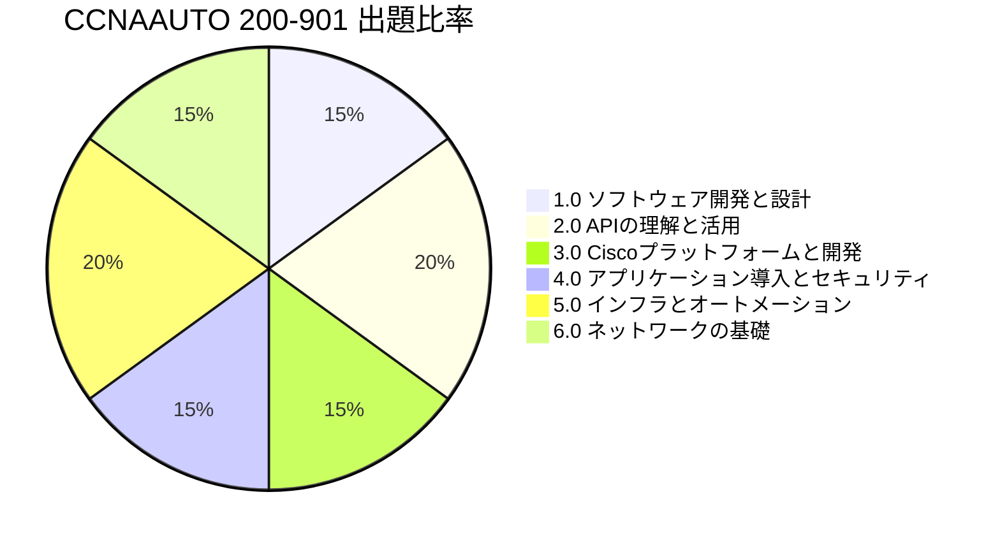

「1.0 ソフトウェア開発と設計」は全体の15%を占め、以下の8つの小項目（サブトピック）で構成されています。本ガイドではこの8項目すべてを順番に解説します。

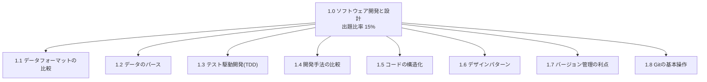

> 補足：Cisco公式の試験概要ページでは、この領域は「Python、Git、共通データ形式（XML・JSON・YAML）を含むソフトウェア開発スキルの実践」と紹介されています（出典は巻末参照）。

---

<a id="sec-3"></a>
## 3. 【1.1】データフォーマットの比較（XML / JSON / YAML）

### なぜ学ぶのか

ネットワーク自動化では、機器の設定情報やAPIのレスポンスを「人間にも機械にも読み書きしやすい形式」でやり取りします。その代表格が **XML・JSON・YAML** の3つです。試験では、それぞれの特徴を理解し、状況に応じて使い分けられるかが問われます。

### 3つのフォーマットの比較表

| 観点 | XML | JSON | YAML |
|---|---|---|---|
| 読みやすさ | タグが多く冗長 | シンプルで読みやすい | インデント主体で最も人間向き |
| 構造の表現方法 | 開始・終了タグで囲む | 波括弧・角括弧・コロン | インデントとハイフンのみ |
| コメント | 可能（`<!-- コメント -->`） | 不可 | 可能（`#`） |
| データ型 | 基本は文字列（スキーマで型定義も可） | 文字列・数値・真偽値・null・配列・オブジェクト | JSONの上位互換（アンカーや複数行文字列なども可） |
| 主な利用場面 | SOAP API、レガシーな設定ファイル | REST APIのリクエスト/レスポンス | Ansible Playbook、Kubernetes、CI/CD定義ファイル |
| 拡張子 | `.xml` | `.json` | `.yml` / `.yaml` |

### 同じ情報を3つの形式で書いてみる

同じネットワーク機器の情報を、それぞれの形式で表現すると次のようになります。

**XML**
```xml
<device>
  <hostname>Router1</hostname>
  <interface>
    <name>GigabitEthernet0/1</name>
    <status>up</status>
  </interface>
</device>
```

**JSON**
```json
{
  "hostname": "Router1",
  "interface": {
    "name": "GigabitEthernet0/1",
    "status": "up"
  }
}
```

**YAML**
```yaml
hostname: Router1
interface:
  name: GigabitEthernet0/1
  status: up
```

同じ内容でも、XMLはタグで、JSONは記号で、YAMLはインデントだけで階層構造を表現していることがわかります。

### 学習のポイント

- REST API（ドメイン2.0で詳しく学習）のやり取りやデータ表現には**JSON**が主流（古いSOAPベースのAPIや一部の機器設定エクスポートには**XML**を使用）
- Ansibleの設定ファイル（Playbook）には**YAML**が使われる
- Cisco NSOのデータモデル定義には**YANG**が使われる（YANGはデータモデル記述言語であり、APIや設定エクスポートで使われるXML/JSON、設定ファイルに使われるYAMLとは役割が異なる）

---

<a id="sec-4"></a>
## 4. 【1.2】データフォーマットをPythonのデータ構造にパースする

### 「パース」とは何か

「パース（parse）」とは、テキストとして書かれたデータ（XML/JSON/YAML）を、プログラムが直接操作できるデータ構造（Pythonの `dict` や `list` など）に変換する処理のことです。

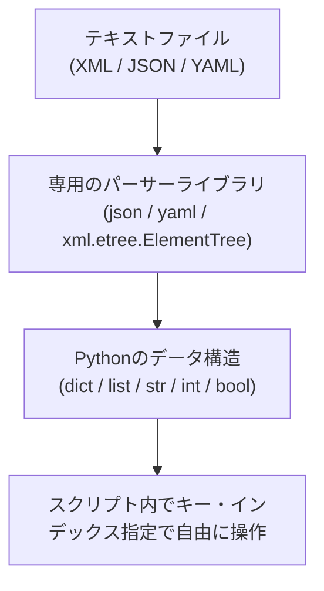

### JSONをパースする例

```python
import json

raw_text = '{"hostname": "Router1", "status": "up"}'

# JSON文字列 → Pythonのdict型に変換
parsed = json.loads(raw_text)

print(parsed["hostname"])   # Router1
print(type(parsed))         # <class 'dict'>
```

### YAMLをパースする例

```python
import yaml

with open("device.yaml") as f:
    config = yaml.safe_load(f)

print(config["hostname"])   # Router1
print(type(config))         # <class 'dict'>
```

### XMLをパースする例

```python
import xml.etree.ElementTree as ET

tree = ET.fromstring("<device><hostname>Router1</hostname></device>")
hostname = tree.find("hostname").text

print(hostname)              # Router1
```

### 学習のポイント

- JSONとYAMLは、パースすると多くの場合 **Pythonの `dict`（辞書型）または `list`（リスト型）** になる
- XMLはやや特殊で、**ツリー構造（要素オブジェクト）** としてパースされることが多い
- 試験では「このコードを実行した結果、変数の型は何になるか」といった読解問題が出やすいため、`type()` で型を確認する習慣をつけておくと良い

---

<a id="sec-5"></a>
## 5. 【1.3】テスト駆動開発（TDD）の概念

### TDDとは

テスト駆動開発（Test-Driven Development）とは、**「実装コードを書く前に、まずテストコードを書く」**という開発スタイルです。一般的に次の3ステップを繰り返します。

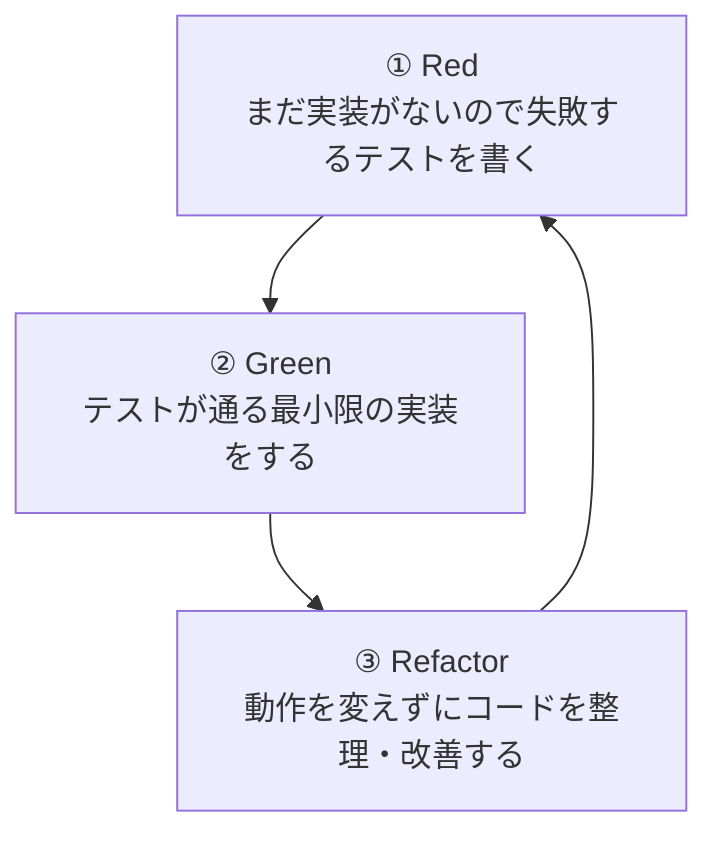

### コード例で見るTDDの流れ

```python
# ① Red: 先にテストを書く（この時点ではadd関数は存在しないので失敗する）
def test_add():
    assert add(2, 3) == 5

# ② Green: テストが通る最小限の実装を書く
def add(a, b):
    return a + b

# ③ Refactor: 必要であれば、動作を変えずにコードを整理する
#    （このシンプルな例ではこれ以上の改善は不要）
```

### なぜTDDが重要なのか

| メリット | 説明 |
|---|---|
| 仕様の明確化 | 「何ができれば正しいか」を先に定義するため、実装の目的がぶれにくい |
| 安心してリファクタリングできる | テストがあることで、後からコードを変更しても壊れていないか即座に確認できる |
| 自動化との相性 | ネットワーク自動化スクリプトも、意図しない設定変更を防ぐためにテストが重要 |
| バグの早期発見 | 実装直後にテストを実行するため、問題を早い段階で見つけられる |

### 学習のポイント

- 試験で問われるのは実装力そのものよりも**「TDDという考え方・サイクルを説明できるか」**という概念理解
- Red → Green → Refactor の順番と、それぞれの段階で何をするかを覚えておく

---

<a id="sec-6"></a>
## 6. 【1.4】ソフトウェア開発手法の比較（Agile / Lean / Waterfall）

### 3つの開発手法の比較表

| 項目 | Waterfall（ウォーターフォール） | Agile（アジャイル） | Lean（リーン） |
|---|---|---|---|
| 進め方 | 要件定義→設計→実装→テスト→リリースを一方向に進める | 短い反復（スプリント）を繰り返しながら少しずつ完成させる | 無駄を徹底的に排除し、価値の提供に集中する |
| 変更への強さ | 弱い（後工程での仕様変更がしにくい） | 強い（都度フィードバックを反映できる） | 強い（継続的な改善を前提とする） |
| ドキュメント量 | 事前に詳細な文書を作成する | 必要最小限、動くソフトウェアを重視 | 必要な分だけ、ムダな文書は作らない |
| 向いている場面 | 要件が最初から固まっている大規模プロジェクト | 要件変化が多いプロダクト開発、スタートアップ | 製造業由来の考え方をITに応用し、ムダなプロセスを削減したい場合 |
| キーワード | フェーズ、マイルストーン | スプリント、イテレーション、ふりかえり | カイゼン、ムダの排除、価値の流れ |

### フローで見る違い

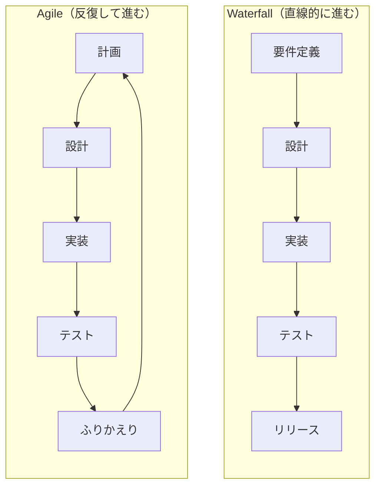

Waterfallは前の工程が終わってから次に進む「一方通行」のイメージ、Agileは短いサイクルを何度も回しながら少しずつ機能を追加していく「反復」のイメージです。

### 学習のポイント

- 「後戻りしにくいのはどれか」「短いサイクルで開発するのはどれか」のような特徴のマッチングが出題されやすい
- Leanは「開発プロセスそのもの」というより「ムダを減らす考え方」である点がAgileとの違い

---

<a id="sec-7"></a>
## 7. 【1.5】コードを関数・クラス・モジュールに整理する利点

### なぜコードを整理するのか

自動化スクリプトが数行で済むうちは良いですが、規模が大きくなるとコードを整理する仕組みが必要になります。Pythonでは主に3段階の単位でコードを整理します。

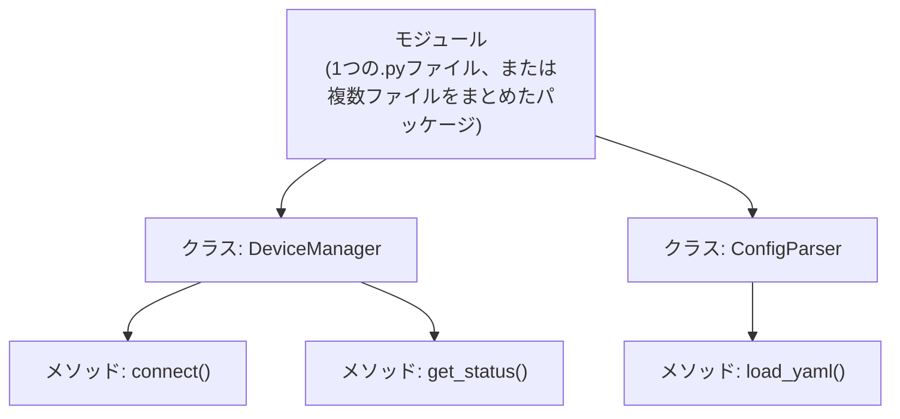

### それぞれの単位と利点

| 単位 | 説明 | 主な利点 |
|---|---|---|
| 関数（Function） | 特定の処理をひとまとまりにしたもの | 同じ処理を何度も書かずに再利用できる／処理の意図が名前からわかる |
| クラス（Class） | データ（属性）と処理（メソッド）をひとまとめにした設計図 | 関連する状態と振る舞いをまとめて管理できる／複数のインスタンスを独立して扱える |
| モジュール（Module） | 関数やクラスをまとめた1つのファイル（または複数ファイルのパッケージ） | 機能ごとにファイルを分割できる／他のスクリプトから `import` して再利用できる |

### コード例

```python
# config_utils.py というモジュールの中に、
# ConfigParserというクラスを定義する例

class ConfigParser:
    def __init__(self, filepath):
        self.filepath = filepath

    def load_yaml(self):
        import yaml
        with open(self.filepath) as f:
            return yaml.safe_load(f)

    def get_hostname(self, config):
        return config.get("hostname")
```

```python
# 別のスクリプトから再利用する

from config_utils import ConfigParser

parser = ConfigParser("device.yaml")
config = parser.load_yaml()
print(parser.get_hostname(config))
```

### 学習のポイント

- 「関数＝処理のまとまり」「クラス＝データと処理のまとまり」「モジュール＝ファイル単位のまとまり」という粒度の違いを整理して覚える
- 目的は一貫して**再利用性・可読性・保守性の向上**であることを押さえておく

---

<a id="sec-8"></a>
## 8. 【1.6】代表的なデザインパターン（MVCとObserver）

デザインパターンとは、ソフトウェア設計でよく出会う問題に対する「定石（型）」のことです。試験では **MVC** と **Observer** の2つが対象です。

### MVCパターン

MVCは「Model（データとロジック）」「View（画面表示）」「Controller（入力の処理）」の3つの役割にコードを分離する設計パターンです。

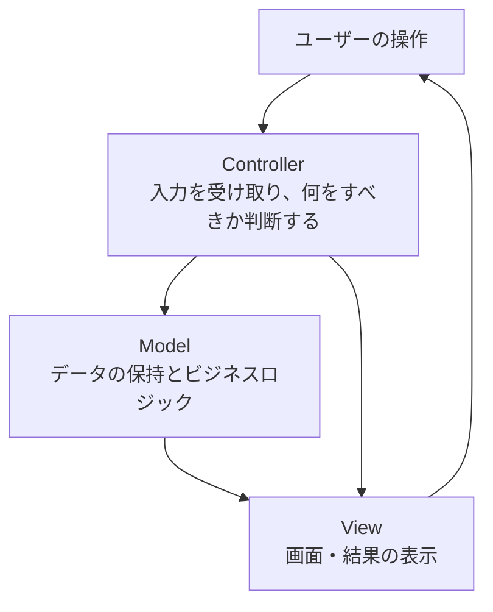

| 役割 | 説明 | ネットワーク自動化での例 |
|---|---|---|
| Model | データそのものと、それを扱うロジック | 機器のステータス情報、設定データ |
| View | ユーザーに見える部分 | ダッシュボードの画面、CLIの出力 |
| Controller | ユーザーの入力を受けてModelを更新する | Webhookを受け取り処理を振り分ける部分 |

**利点**：役割ごとにコードが分離されているため、画面デザインだけを変更したい場合でもロジックに手を入れずに済む、といった**保守性・拡張性の高さ**が得られます。

### Observerパターン

Observerパターンは、ある対象（Subject）の状態が変化したときに、それを購読している複数の相手（Observer）へ自動的に通知する設計パターンです。

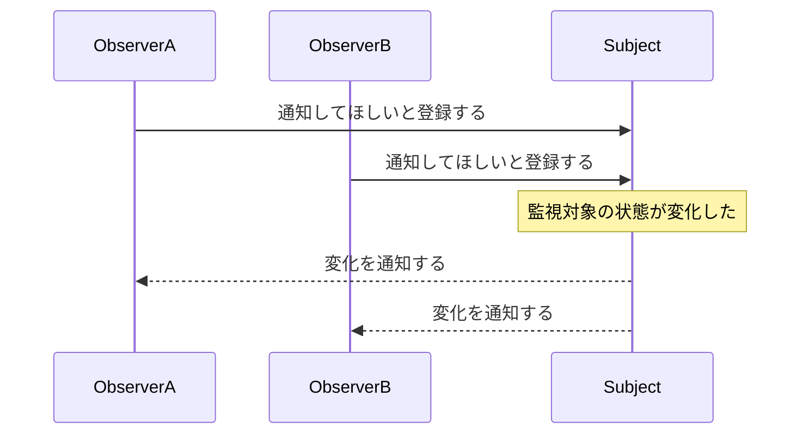

**利点**：通知する側（Subject）は「誰が見ているか」を細かく意識せずに済み、新しいObserverを追加してもSubject側のコードを変更する必要がありません。ネットワーク自動化では、機器の状態変化をWebhookで複数のシステムに通知する仕組みなどがこの考え方に近いパターンです。

```python
class Subject:
    def __init__(self):
        self._observers = []

    def subscribe(self, observer):
        self._observers.append(observer)

    def notify(self, event):
        for observer in self._observers:
            observer.update(event)

class LogObserver:
    def update(self, event):
        print(f"ログに記録: {event}")

class AlertObserver:
    def update(self, event):
        print(f"アラート送信: {event}")

subject = Subject()
subject.subscribe(LogObserver())
subject.subscribe(AlertObserver())
subject.notify("インターフェースがダウンしました")
```

### 2つのパターンの比較

| パターン | 目的 | 主な構成要素 | 典型的な利用例 |
|---|---|---|---|
| MVC | 画面・ロジック・データを分離し保守性を高める | Model / View / Controller | Web管理画面、監視ダッシュボード |
| Observer | 状態変化を複数の相手に自動で伝える | Subject（発行者）/ Observer（購読者） | イベント通知、Webhook、GUIのイベント処理 |

### 学習のポイント

- 「役割を分離するのはどちらか」＝MVC、「変化を通知するのはどちらか」＝Observer、という対応を覚える
- 試験では実装の細部よりも「なぜこのパターンを使う利点があるのか」という設計意図の理解が問われる

---

<a id="sec-9"></a>
## 9. 【1.7】バージョン管理の利点

### バージョン管理とは

バージョン管理システム（Version Control System, VCS）は、ファイルの変更履歴を記録し、いつ・誰が・何を変更したかを追跡できる仕組みです。Gitはその代表例です。

### なぜ必要なのか

| 課題 | バージョン管理がない場合 | バージョン管理がある場合 |
|---|---|---|
| 変更履歴の把握 | `config_final_v2_本当に最終.yaml` のようなファイル名で管理しがち | いつ・誰が・なぜ変更したかがコミット履歴として残る |
| 複数人での共同作業 | 上書き事故や作業の衝突が起きやすい | ブランチで作業を分離し、あとでマージできる |
| 問題発生時の切り戻し | どこまで戻せば良いか分からない | 特定のコミットまで簡単に戻せる |
| 変更内容の説明 | 「何を変えたか」を口頭やメモに頼る | `diff` で変更差分を正確に確認できる |
| 監査・レビュー | 変更の妥当性を後から検証しにくい | コミット単位でレビューでき、変更理由も記録に残る |

### ネットワーク自動化での重要性

ネットワーク機器の設定（YAML/JSONで表現された「インフラのコード」）をGitで管理することで、**「いつ・誰が・どの設定をどう変えたか」を追跡できる**ようになります。これは、インフラをコードとして扱う考え方（Infrastructure as Code）の土台にもなる重要な概念です。

### 学習のポイント

- 「変更履歴の追跡」「共同作業の容易化」「切り戻しの容易さ」「変更内容の可視化」の4点が代表的な利点
- 試験では「バージョン管理がなぜ重要か」という理由を説明できるかが問われる

---

<a id="sec-10"></a>
## 10. 【1.8】Gitの基本操作

### Gitにおける4つの領域

Gitの操作を理解するには、まず「データがどこにあるか」という4つの領域を押さえることが近道です。

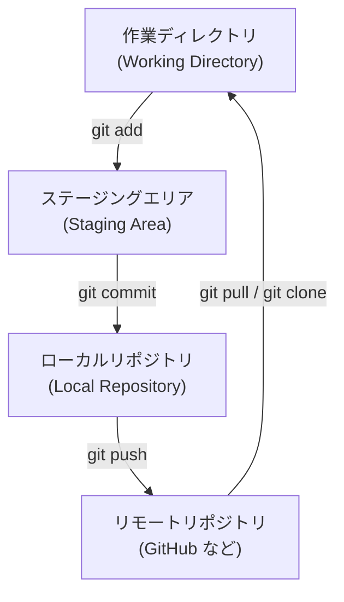

### 各コマンドの役割

| コマンド | 目的 | 動きのイメージ |
|---|---|---|
| `git clone <url>` | リモートリポジトリを丸ごと自分のPCに複製する | リモート → ローカル（新規取得） |
| `git add <file>` | 変更をステージングエリアに追加する | 作業ディレクトリ → ステージング |
| `git rm <file>` | ファイルを追跡対象から削除する | 作業ディレクトリ／ステージング |
| `git commit -m "メッセージ"` | ステージング内容をローカルの履歴として記録する | ステージング → ローカルリポジトリ |
| `git push` | ローカルの変更をリモートへ反映する | ローカル → リモート |
| `git pull` | リモートの変更を取得し、ローカルに反映する | リモート → ローカル |
| `git branch <name>` | 新しい作業の分岐（ブランチ）を作成する | ローカルリポジトリ内 |
| `git merge <branch>` | 別ブランチの変更を現在のブランチに取り込む | ローカルリポジトリ内 |
| `git diff` | 変更差分を確認する | 任意の2つの状態間の比較 |

### ブランチとマージのイメージ

新しい機能はいきなり本流（main）に手を入れず、専用のブランチを作って作業するのが一般的です。

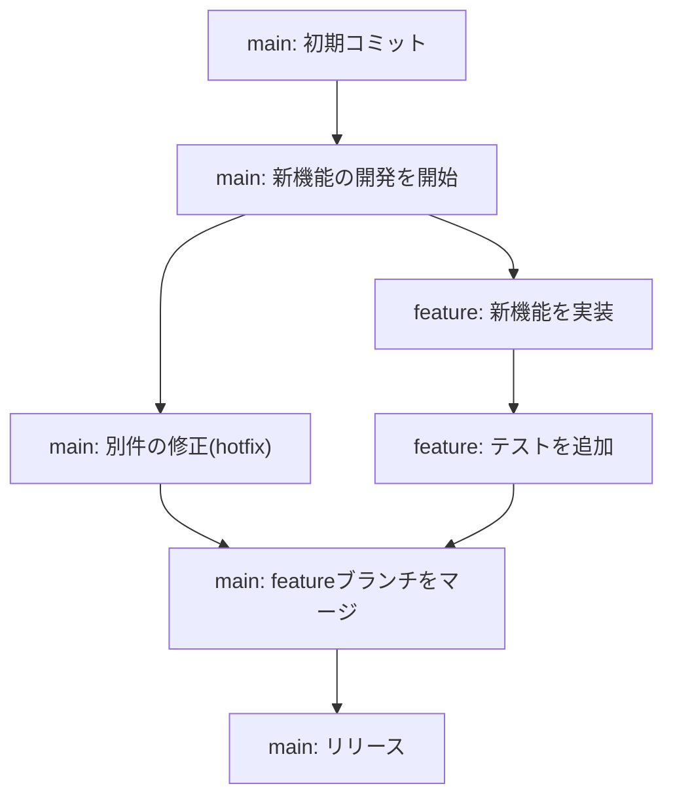

### コンフリクト（衝突）が起きたら

同じ箇所を別々のブランチで変更していると、マージ時に「コンフリクト」が発生します。Gitは競合箇所を次のような目印つきでファイルに書き込むので、どちらを残すか（または両方を活かすか）を手動で判断して解消します。

```
<<<<<<< HEAD
（現在のブランチでの変更内容）
=======
（マージしようとしているブランチでの変更内容）
>>>>>>> feature-branch
```

解消手順の流れは次の通りです。

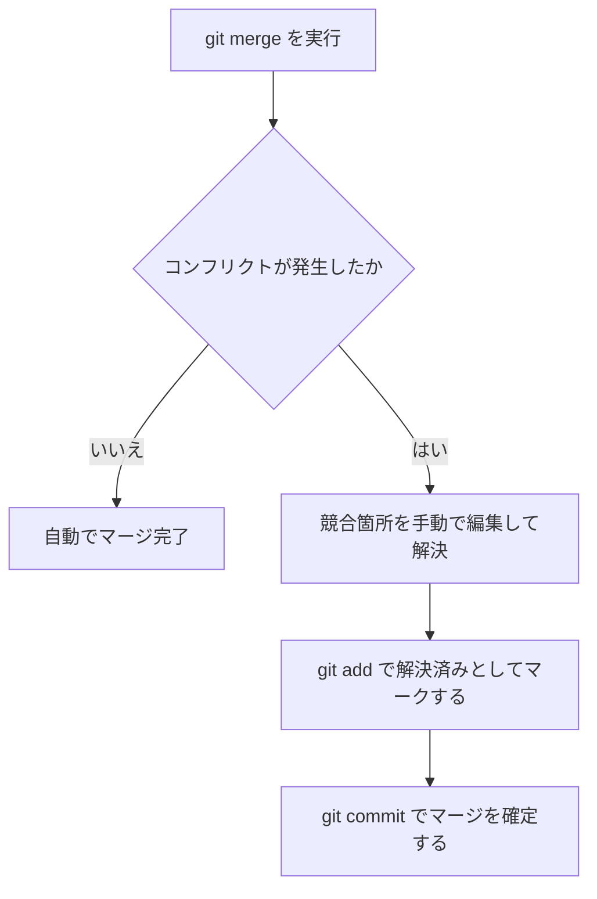

### diffで差分を確認する

```bash
git diff
```

```diff
- hostname: Router1
+ hostname: Router1-Core
```

`-` が削除された行、`+` が追加された行を示し、変更内容を一目で確認できます。

### 学習のポイント

- 各コマンドが「Gitの4つの領域のうち、どこからどこへデータを動かすものか」を対応づけて覚える
- `merge` でコンフリクトが起きた場合の対処の流れ（手動編集 → `add` → `commit`）は特に問われやすい
- `diff` は「変更前後の差分を可視化するもの」という位置づけを理解しておく

---

<a id="sec-11"></a>
## 11. 実践シナリオでつなげて理解する

ここまで学んだ8つの項目は、実際の自動化業務では次のように連携して使われます。

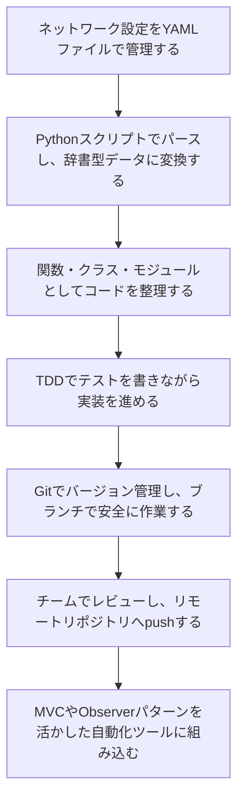

このように、「1.0 ソフトウェア開発と設計」の8項目は独立した知識ではなく、**現場の自動化スクリプト1本を作るまでの一連の流れ**を分解したものだと捉えると理解しやすくなります。

---

<a id="sec-12"></a>
## 12. 学習チェックリスト・理解度クイズ

### チェックリスト

- [ ] XML・JSON・YAMLの違いを、コメントの可否・読みやすさの観点で説明できる
- [ ] JSON/YAML/XMLをパースした結果、Pythonでどのようなデータ型になるか説明できる
- [ ] TDDのRed→Green→Refactorのサイクルを説明できる
- [ ] Waterfall・Agile・Leanの特徴の違いを説明できる
- [ ] 関数・クラス・モジュールそれぞれの役割と利点を説明できる
- [ ] MVCパターンの3つの役割と、Observerパターンの仕組みを説明できる
- [ ] バージョン管理がもたらす4つの利点を説明できる
- [ ] `clone` / `add` / `commit` / `push` / `pull` / `branch` / `merge` / `diff` の役割をそれぞれ説明できる

### 理解度クイズ（簡易）

<details>
<summary>Q1. コメントを書けるデータフォーマットはどれ？（クリックして回答を表示）</summary>

YAMLです。`#` を使ってコメントを記述できます。JSONとXML（標準）ではコメントは書けません。
</details>

<details>
<summary>Q2. TDDで最初に行うのはどのステップ？</summary>

Red（失敗するテストを先に書く）です。実装よりも先にテストを書く点がTDDの特徴です。
</details>

<details>
<summary>Q3. 短い反復（スプリント）を繰り返す開発手法はどれ？</summary>

Agile（アジャイル）です。Waterfallは一方向に進む手法、Leanはムダの排除に主眼を置いた考え方です。
</details>

<details>
<summary>Q4. 画面表示・入力処理・データを3つの役割に分離するデザインパターンはどれ？</summary>

MVC（Model・View・Controller）です。状態変化を複数の相手に自動通知するのはObserverパターンです。
</details>

<details>
<summary>Q5. マージ時にコンフリクトが発生した場合、次に行うべき操作の順番は？</summary>

競合箇所を手動で編集して解決する → `git add` で解決済みとしてマークする → `git commit` でマージを確定する、の順番です。
</details>

---

<a id="sec-13"></a>
## 13. 参考ソース

本ドキュメントの試験概要・試験ドメイン構成・出題比率は、以下のCisco公式ページおよび公式PDFの公開情報に基づいています。

| No. | ソース | 内容 |
|---|---|---|
| 1 | [CCNA Automation Certification（Cisco公式）](https://www.cisco.com/site/us/en/learn/training-certifications/certifications/automation/ccna-automation/index.html) | 認定資格の概要ページ |
| 2 | [CCNA Automation Exam and Training（Cisco公式）](https://www.cisco.com/site/us/en/learn/training-certifications/certifications/automation/ccna-automation/exams-and-training.html) | 対応するコア試験（200-901 CCNAAUTO）の情報ページ |
| 3 | [Automating Networks Using Cisco Platforms v1.1（200-901）試験トピックPDF（Cisco公式）](https://learningcontent.cisco.com/documents/marketing/exam-topics/200-901-CCNAAUTO_v.1.1.pdf) | 「1.0 Software Development and Design」を含む全6ドメインの詳細な出題トピック一覧・出題比率の一次情報 |

技術的な用語・概念（データ形式、デザインパターン、Git等）の解説にあたっては、下記のような一般的に広く参照される技術資料も参考にしています。個別の技術仕様の最新情報は、それぞれの公式ドキュメントも合わせてご確認ください。

- Git公式ドキュメント：https://git-scm.com/doc
- JSON仕様：https://www.json.org/json-ja.html
- YAML仕様：https://yaml.org/
- Agile Manifesto（アジャイルソフトウェア開発宣言）：https://agilemanifesto.org/iso/ja/manifesto.html

---

*本ドキュメントは学習補助を目的とした非公式資料です。試験内容は予告なく変更される場合があるため、受験前に必ずCisco公式サイトで最新の試験トピックをご確認ください。*
