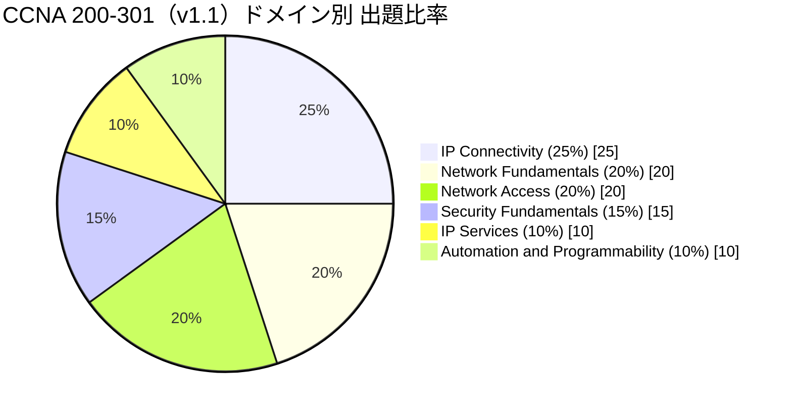
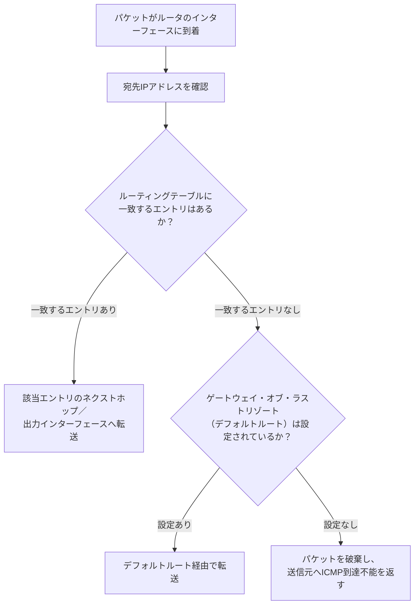
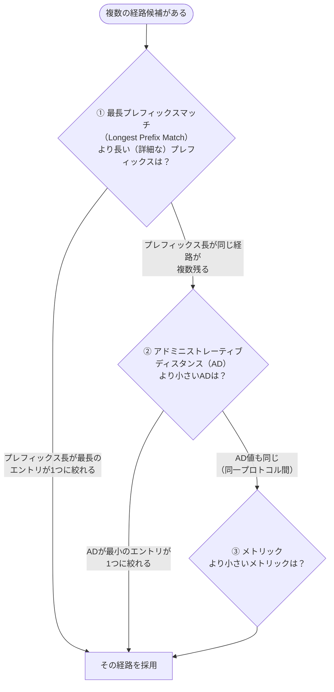
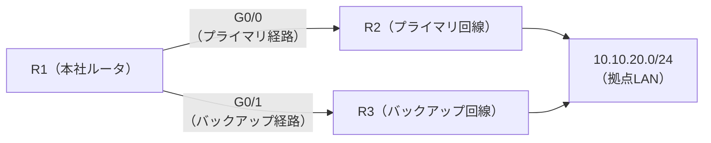
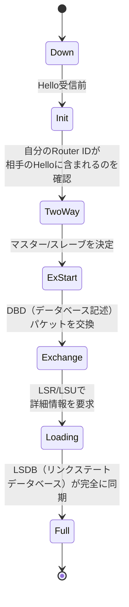
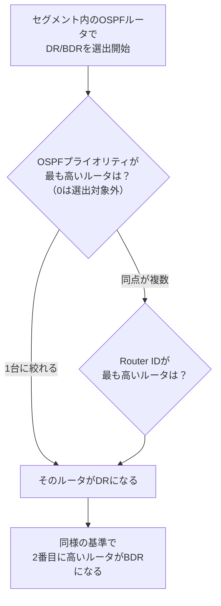
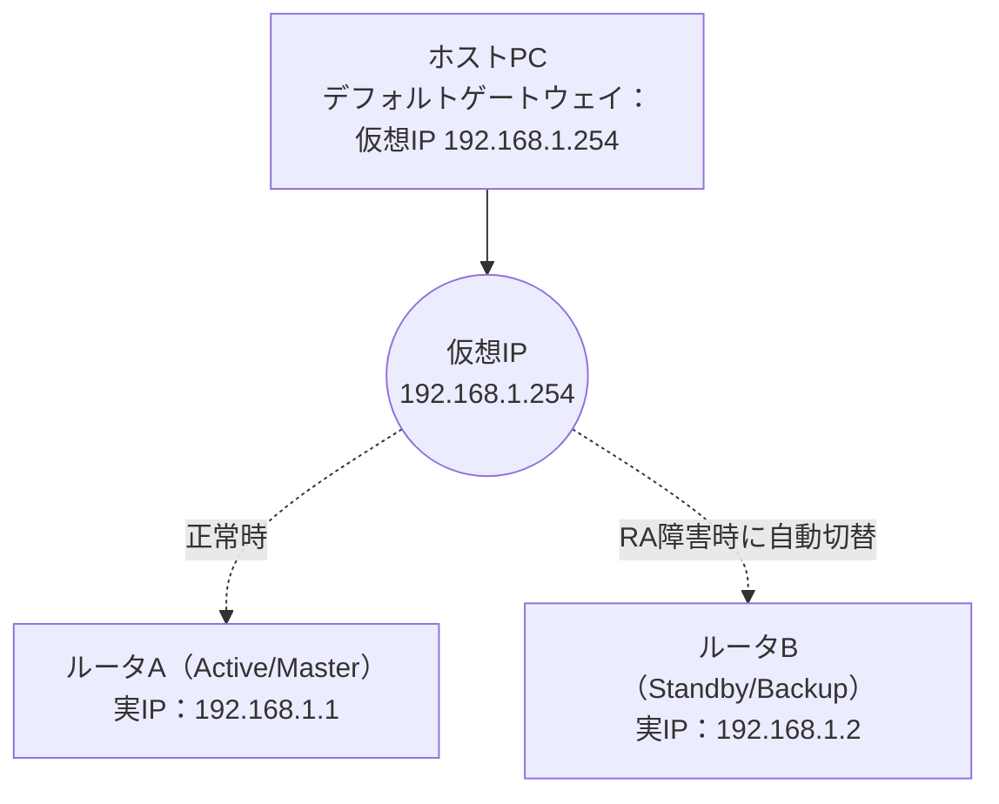

# CCNA 200-301 徹底解説：IP Connectivity（IP接続性）編

> 対象試験：Cisco CCNA 200-301（v1.1 ブループリント）
> 対象ドメイン：**3.0 IP Connectivity（出題比率 25%）** — 6ドメイン中、最大の出題比率を占める最重要分野です。

---

## 0. このガイドの全体像

CCNA 200-301試験は6つのドメインで構成されており、そのうち「IP Connectivity」は**単独で最も出題比率が高い分野（25%）**です。ルーティングの基礎を理解していないと、この後に学ぶIP Services（NAT/DHCP/DNS等）やSecurity Fundamentalsの理解も浅くなってしまうため、CCNA学習の中核と言える範囲です。



このガイドでは、公式試験ブループリント（v1.1）の「3.0 IP Connectivity」に定義された以下の5つのサブトピックを、初学者向けに順番通り・図解付きで解説します。

| 番号 | サブトピック | 本ガイドの章 |
|---|---|---|
| 3.1 | ルーティングテーブルの構成要素を解釈する | 第1章 |
| 3.2 | ルータがデフォルトでフォワーディング決定を行う仕組みを判断する | 第2章 |
| 3.3 | IPv4/IPv6のスタティックルーティングを設定・検証する | 第3章 |
| 3.4 | シングルエリアOSPFv2を設定・検証する | 第4章 |
| 3.5 | ファーストホップ冗長プロトコル（FHRP）の目的・機能・概念を説明する | 第5章 |

> 出典：Cisco「CCNA Exam v1.1 (200-301)」公式試験トピック（PDF）
> https://learningcontent.cisco.com/documents/marketing/exam-topics/200-301-CCNA-v1.1.pdf

---

## 第1章｜3.1 ルーティングテーブルの構成要素を解釈する

### 1-1. ルーティングテーブルとは何か

ルータは、パケットをどのインターフェースに転送すべきかを判断するために「ルーティングテーブル（経路表）」を持っています。これは「宛先ネットワークへ行くには、どの道（インターフェース／次のルータ）を通ればよいか」を記録した地図のようなものです。

以下は、Cisco IOSで `show ip route` コマンドを実行したときの出力例です（学習用の簡略例）。

```
R1# show ip route

Codes: L - local, C - connected, S - static, R - RIP, O - OSPF,
       B - BGP, D - EIGRP, * - candidate default, IA - OSPF inter area

Gateway of last resort is 203.0.113.1 to network 0.0.0.0

S*   0.0.0.0/0 [1/0] via 203.0.113.1
C    192.168.1.0/24 is directly connected, GigabitEthernet0/0
L    192.168.1.1/32 is directly connected, GigabitEthernet0/0
O    10.10.20.0/24 [110/20] via 192.168.1.2, 00:12:41, GigabitEthernet0/1
```

### 1-2. 各構成要素の意味（試験で問われるポイント）

試験トピック3.1では、以下の7つの構成要素を正確に読み取れることが求められます。

| 構成要素 | 出力例での該当箇所 | 意味 |
|---|---|---|
| **a. ルーティングプロトコルコード** | 行頭の `S`, `C`, `L`, `O` | その経路をどうやって学習したかを示す1〜2文字の記号（S=スタティック、C=直接接続、L=ローカル、O=OSPF等） |
| **b. プレフィックス（宛先ネットワークアドレス）** | `10.10.20.0` | パケットの宛先が属するネットワークアドレス |
| **c. ネットワークマスク** | `/24` （＝255.255.255.0） | プレフィックスの有効ビット長。ネットワーク部とホスト部の境界を示す |
| **d. ネクストホップ** | `via 192.168.1.2` | このネットワーク宛のパケットを次に転送すべき隣接ルータのIPアドレス |
| **e. アドミニストレーティブディスタンス（AD）** | `[110/20]` の **110** | その経路情報源（プロトコル）の「信頼度」。数値が小さいほど信頼される |
| **f. メトリック** | `[110/20]` の **20** | 同一プロトコル内で最適経路を決めるためのコスト値（OSPFではコスト、EIGRPでは複合値など） |
| **g. ゲートウェイ・オブ・ラストリゾート** | `Gateway of last resort is 203.0.113.1...` | ルーティングテーブルに一致する経路が無い場合に使われる「その他すべて」の転送先（通常はデフォルトルート） |

> 💡 **初学者がつまずきやすいポイント**
> `[110/20]` のような表記は「**[AD/メトリック]**」の順番で書かれています。AD（信頼度）が先、メトリック（コスト）が後です。試験ではこの順番を逆に覚えて失点するケースが非常に多いので、「AD → メトリック」の順で暗記しましょう。

### 1-3. パケット転送の流れ（全体イメージ）



---

## 第2章｜3.2 ルータのフォワーディング決定ロジック

同じ宛先に対して複数の経路情報がある場合、ルータは以下の**3段階の優先順位**で「どの経路を実際に使うか」を決定します。これが試験トピック3.2の核心です。



### 2-1. ①最長プレフィックスマッチ（Longest Prefix Match）

**最も優先される**ルール。宛先IPアドレスに対して、より長い（より詳細な＝ホスト数が少ない）プレフィックスを持つ経路が常に優先されます。

例：宛先 `10.10.20.5` へのパケットがある場合

| 候補経路 | プレフィックス長 | 採用される？ |
|---|---|---|
| `10.0.0.0/8` | /8（大まかな範囲） | ❌ 不採用 |
| `10.10.0.0/16` | /16 | ❌ 不採用 |
| `10.10.20.0/24` | /24（最も詳細） | ✅ **採用** |

→ プレフィックス長が異なる場合は、ADやメトリックを比較するまでもなく、最長一致が常に勝ちます。

### 2-2. ②アドミニストレーティブディスタンス（AD）

プレフィックス長が同じ経路が複数の情報源（プロトコル）から学習された場合に比較される「情報源の信頼度」です。**数値が小さいほど優先されます。**

| 経路情報源 | デフォルトAD値 |
|---|---|
| 直接接続（Connected） | 0 |
| スタティックルート | 1 |
| EIGRP サマリールート | 5 |
| 外部BGP（eBGP） | 20 |
| EIGRP（内部） | 90 |
| OSPF | 110 |
| IS-IS | 115 |
| RIP | 120 |
| EIGRP（外部） | 170 |
| 内部BGP（iBGP） | 200 |
| 未知（到達不能） | 255 |

> 💡 この表は「フローティングスタティックルート」（第3章）を理解するための前提知識になります。

### 2-3. ③メトリック

プレフィックス長・AD値の両方が同じ場合、**最後**に比較されるのがメトリックです。同一プロトコル内でのコストの比較であり、代表的なものは以下の通りです。

| プロトコル | メトリックの計算基準（概要） |
|---|---|
| RIP | ホップ数（経由するルータの数） |
| OSPF | コスト（帯域幅の逆数を基準とした値） |
| EIGRP | 帯域幅・遅延などを組み合わせた複合値 |

---

## 第3章｜3.3 IPv4/IPv6スタティックルーティングの設定・検証

### 3-1. スタティックルートの4分類

試験トピック3.3では、以下の4種類のスタティックルートを区別できることが求められます。

| 種類 | 書式イメージ（IOS） | 用途 |
|---|---|---|
| **デフォルトルート** | `ip route 0.0.0.0 0.0.0.0 <next-hop>` | 「その他すべて」の宛先に一致する経路。ゲートウェイ・オブ・ラストリゾートになる |
| **ネットワークルート** | `ip route 10.10.20.0 255.255.255.0 <next-hop>` | 特定のネットワーク（サブネット）宛の経路 |
| **ホストルート** | `ip route 10.10.20.5 255.255.255.255 <next-hop>` | 単一のホスト（/32）宛の経路 |
| **フローティングスタティック** | `ip route 10.10.20.0 255.255.255.0 <next-hop> 200` | AD値をあえて高く設定し、通常時は使われない「バックアップ経路」として機能させる |

### 3-2. 構成例（トポロジ）

以下は、R1がR2（プライマリ）とR3（バックアップ）の2経路でネットワーク `10.10.20.0/24` に到達できる構成です。



### 3-3. IOS設定例

```
! プライマリ経路（デフォルトのAD=1）
R1(config)# ip route 10.10.20.0 255.255.255.0 192.168.1.2

! フローティングスタティック（バックアップ経路。AD=200に設定し優先度を下げる）
R1(config)# ip route 10.10.20.0 255.255.255.0 192.168.10.2 200

! IPv6スタティックルート（IPv4と考え方は同じ）
R1(config)# ipv6 route 2001:db8:20::/64 2001:db8:1::2
```

R2経由の経路（AD=1）が生きている限り、ルーティングテーブルにはR2経由の経路のみが載ります。R2経由の経路が消えた（リンクダウンした）場合にのみ、AD=200のR3経由の経路がルーティングテーブルに現れ、通信が自動的に切り替わります。これが「フローティング（浮動）」と呼ばれる理由です。

### 3-4. 検証コマンド

| コマンド | 用途 |
|---|---|
| `show ip route` | IPv4ルーティングテーブル全体を確認 |
| `show ip route static` | スタティックルートのみを絞り込んで確認 |
| `show ipv6 route` | IPv6ルーティングテーブルを確認 |
| `ping` / `traceroute` | 実際の到達性を確認 |

---

## 第4章｜3.4 シングルエリアOSPFv2の設定・検証

### 4-1. OSPFの基本動作

OSPF（Open Shortest Path First）はリンクステート型のルーティングプロトコルです。ルータ同士が「隣接関係（アジェセンシー）」を確立し、リンク状態情報（LSA）を交換し合うことで、ネットワーク全体のトポロジを学習し、最短経路を計算します。

### 4-2. ネイバー隣接関係（Neighbor Adjacency）の確立ステート

2台のOSPFルータが隣接関係を確立するまでには、以下のステートを順番に遷移します。



| ステート | 状態の意味 |
|---|---|
| Down | 隣接ルータからHelloパケットを受信していない初期状態 |
| Init | Helloパケットを受信したが、相手のHelloに自分のRouter IDがまだ含まれていない |
| 2-Way | 双方向の疎通を確認（マルチアクセス網ではDR/BDR選出がこの時点で行われる） |
| ExStart | DBD交換のためのマスター／スレーブ関係を決定 |
| Exchange | DBD（データベース記述パケット）を交換し、互いが持つLSAの一覧を確認 |
| Loading | 不足しているLSAの詳細をLSR/LSUでやり取り |
| **Full** | **LSDBが完全に同期し、隣接関係が確立完了** |

### 4-3. ネットワークタイプ：ポイントツーポイント vs ブロードキャスト

| ネットワークタイプ | 代表例 | DR/BDR選出 |
|---|---|---|
| **ポイントツーポイント** | シリアル回線、ルータ間の直接リンク | 不要（2台のみのため） |
| **ブロードキャスト** | Ethernetセグメント（マルチアクセス） | **必要**（DR/BDRを選出） |

ブロードキャスト型のマルチアクセスネットワーク（例：同一Ethernetセグメントに3台以上のルータ）では、全ルータ同士がフルメッシュで隣接関係を結ぶと非効率（LSA交換の組み合わせ爆発）になるため、代表ルータ（DR）とバックアップ（BDR）を選出し、他のルータはDR/BDRとのみフル隣接関係を結びます。

### 4-4. DR/BDR選出ロジック



> 💡 **Router IDの決定順序（重要）**
> 1. `router-id` コマンドで明示的に設定された値（最優先）
> 2. ループバックインターフェースの中で最も高いIPアドレス
> 3. 物理インターフェースの中で最も高いIPアドレス（ループバックが無い場合）

### 4-5. 設定例

```
R1(config)# router ospf 1
R1(config-router)# router-id 1.1.1.1
R1(config-router)# network 192.168.1.0 0.0.0.255 area 0
R1(config-router)# network 10.10.20.0 0.0.0.255 area 0
```

「シングルエリア」という名前の通り、CCNAで問われるOSPFはすべて `area 0`（バックボーンエリア）のみで構成されるシンプルな構成です。

### 4-6. 検証コマンド

| コマンド | 確認できる内容 |
|---|---|
| `show ip ospf neighbor` | 隣接関係のステート（Fullになっているか） |
| `show ip protocols` | 有効なルーティングプロトコルの設定概要 |
| `show ip ospf interface` | インターフェースごとのOSPF設定・DR/BDR情報 |

---

## 第5章｜3.5 ファーストホップ冗長プロトコル（FHRP）

### 5-1. なぜFHRPが必要か

一般的なホスト（PC等）は、デフォルトゲートウェイとして**1つのIPアドレス**しか設定できません。もしそのデフォルトゲートウェイ（ルータ）が故障すると、そのセグメントは外部と通信できなくなってしまいます。

FHRP（First Hop Redundancy Protocol）は、**複数の物理ルータで1つの仮想IPアドレス（仮想ゲートウェイ）を共有**することで、1台が故障してももう1台が自動的に処理を引き継ぐ仕組みです。



### 5-2. 代表的なFHRPの比較

| プロトコル | 種別 | 特徴 |
|---|---|---|
| **HSRP**（Hot Standby Router Protocol） | Cisco独自 | Active/Standby方式。最も基本的で試験でも頻出 |
| **VRRP**（Virtual Router Redundancy Protocol） | 業界標準（RFC） | HSRPと似た仕組みだが、マルチベンダー環境で利用可能 |
| **GLBP**（Gateway Load Balancing Protocol） | Cisco独自 | 複数ルータで**負荷分散**しながら冗長性も確保できる |

> 📌 CCNA試験トピック3.5は「configure」ではなく「describe（説明する）」という動詞であることに注目してください。つまり**詳細な設定コマンドの暗記よりも、「目的・機能・概念」を説明できることが求められています**。「なぜ必要か」「HSRP/VRRP/GLBPの違いは何か」を言葉で説明できるようにしておきましょう。

---

## まとめ：学習の進め方

1. **3.1→3.2は必ずセットで理解する**：ルーティングテーブルの読み方（3.1）が分からないと、フォワーディング決定ロジック（3.2）も理解できません。
2. **AD値の表（第2章）は暗記必須**：フローティングスタティック（3.3）にも直結する重要な数値です。
3. **OSPFはステート遷移とDR/BDRが頻出**：`show ip ospf neighbor` の出力を読んで、今どのステートにいるかを判断できるように練習しましょう。
4. **FHRPは概念理解が中心**：コマンドよりも「なぜ必要か」「3種類の違い」を説明できるようにしておきましょう。
5. 出題比率25%はドメイン中最大です。学習時間の配分に迷ったら、まずIP Connectivityを優先してください。

---

## 参考ソース（出典）

本ガイドの試験範囲・出題比率・トピック構成は、以下のCisco公式情報に基づいています。

- Cisco「CCNA」認定ページ（日本語）
  https://www.cisco.com/c/ja_jp/training-events/training-certifications/certifications/associate/ccna.html
- Cisco「CCNA Exam v1.1 (200-301)」公式試験トピックPDF（ドメイン別出題比率・3.0 IP Connectivityの詳細トピック一覧の一次情報）
  https://learningcontent.cisco.com/documents/marketing/exam-topics/200-301-CCNA-v1.1.pdf
- Cisco Learning Network「CCNA Exam Topics」
  https://learningnetwork.cisco.com/s/ccna-exam-topics

※ 試験内容はCiscoにより予告なく変更される場合があります。最新の出題範囲は必ず上記公式ソースでご確認ください。
