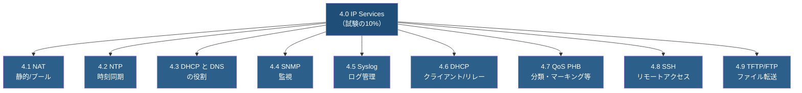
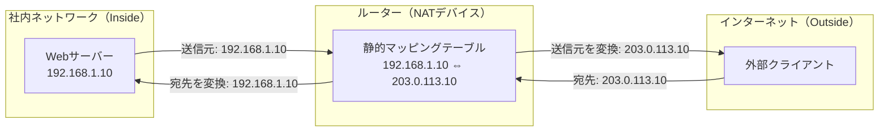
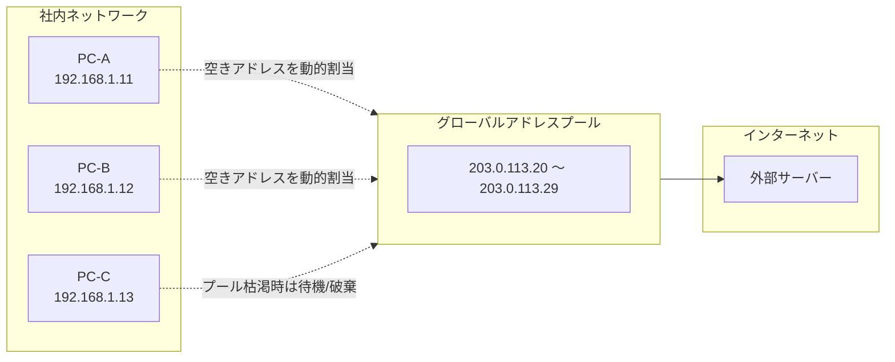
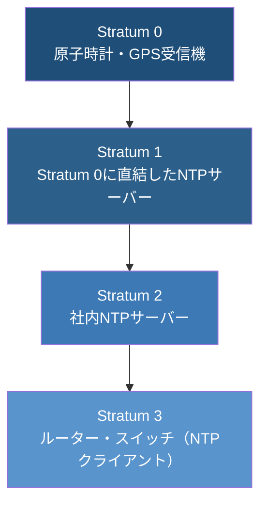
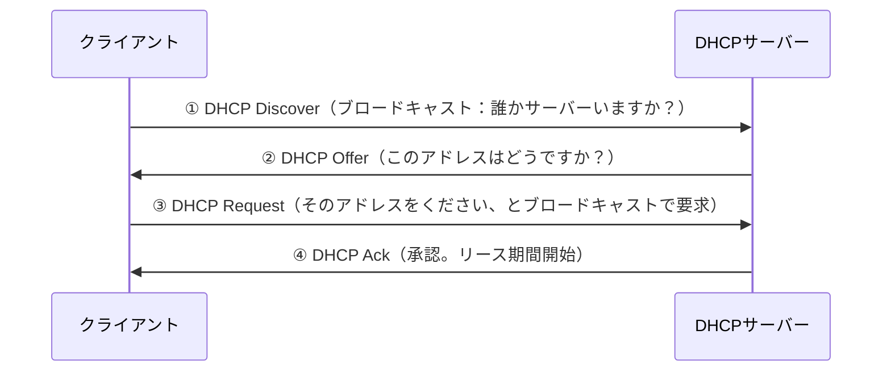
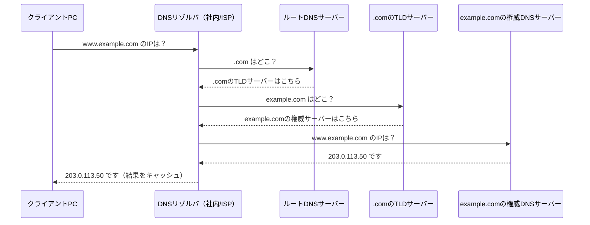
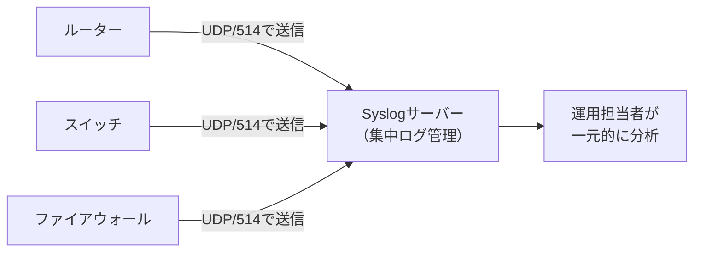
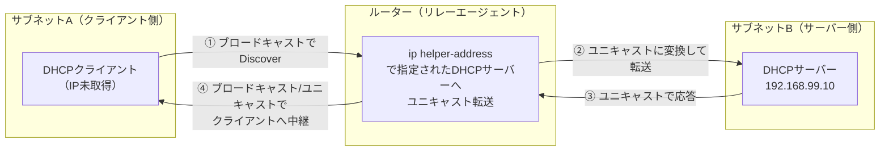
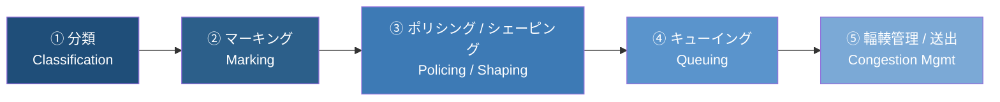
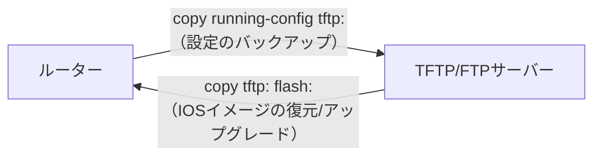

# CCNA 200-301（v1.1）試験対策ガイド：IP サービス（IP Services）

> 出題範囲 4.0「IP Services」／試験全体の **10%** を占める領域を、初学者向けにステップバイステップで解説します。

## この章の位置づけ

CCNA 200-301 試験は6つの大分野で構成されており、「IP Services」はそのうちの4番目の分野です。

| 分野番号 | 分野名 | 出題比率 |
|---|---|---|
| 1.0 | ネットワークの基礎（Network Fundamentals） | 20% |
| 2.0 | ネットワークアクセス（Network Access） | 20% |
| 3.0 | IP接続性（IP Connectivity） | 25% |
| **4.0** | **IPサービス（IP Services）** | **10%** |
| 5.0 | セキュリティの基礎（Security Fundamentals） | 15% |
| 6.0 | 自動化とプログラマビリティ（Automation and Programmability） | 10% |

出題比率としては大きくありませんが、**NAT・DHCP・DNS・NTP・SNMP・Syslog・QoS・SSH・TFTP/FTP** という、実務で毎日のように触れる「縁の下の力持ち」的な技術が9項目も詰め込まれた、非常に密度の高い分野です。1つ1つは浅く広く問われる傾向があるため、「名前は知っているが動作原理は説明できない」状態を最も避けるべき分野と言えます。



---

## 目次

1. [4.1 NAT（静的NATとプールを使った動的NAT）](#41-nat静的natとプールを使った動的nat)
2. [4.2 NTP（クライアント/サーバーモード）](#42-ntpクライアントサーバーモード)
3. [4.3 DHCP と DNS の役割](#43-dhcp-と-dns-の役割)
4. [4.4 SNMP の機能](#44-snmp-の機能)
5. [4.5 Syslog（ファシリティと重大度レベル）](#45-syslogファシリティと重大度レベル)
6. [4.6 DHCP クライアントとリレー](#46-dhcp-クライアントとリレー)
7. [4.7 QoS のフォワーディング動作（PHB）](#47-qos-のフォワーディング動作phb)
8. [4.8 SSH によるリモートアクセス](#48-ssh-によるリモートアクセス)
9. [4.9 TFTP/FTP の機能](#49-tftpftp-の機能)
10. [学習のポイントまとめ](#学習のポイントまとめ)
11. [出典・参考資料](#出典参考資料)

---

## 4.1 NAT（静的NATとプールを使った動的NAT）

### なぜNATが必要なのか

IPv4アドレスは32ビットしかなく、世界中の全デバイスに一意なグローバルアドレスを割り当てるには数が足りません。そこでRFC 1918で定義された**プライベートIPアドレス**（10.0.0.0/8、172.16.0.0/12、192.168.0.0/16）を社内で自由に使い、インターネットに出る際だけグローバルアドレスに変換する仕組みが**NAT（Network Address Translation）**です。

試験の4.1では、この中でも特に**インサイドソースNAT**（内部から外部への通信を対象とするNAT）の2種類、**静的NAT**と**プールを使った動的NAT**が対象です。

### 静的NAT（Static NAT）

1つの内部プライベートアドレスと1つの外部グローバルアドレスを、**1対1で固定的に**マッピングします。社内のWebサーバーなど、外部から常に同じアドレスでアクセスされたい機器に使います。



**設定例（IOS）:**

```
Router(config)# ip nat inside source static 192.168.1.10 203.0.113.10
Router(config)# interface GigabitEthernet0/0
Router(config-if)# ip nat inside
Router(config)# interface GigabitEthernet0/1
Router(config-if)# ip nat outside
```

### 動的NAT（プールを使用）

複数の内部アドレスに対して、**アドレスプール（範囲）**の中から空いているグローバルアドレスをその都度割り当てます。1対1の関係はセッションごとに変わりますが、同時に変換できるのはプール内のアドレス数までです。



**設定例（IOS）:**

```
Router(config)# ip nat pool NAT-POOL 203.0.113.20 203.0.113.29 netmask 255.255.255.0
Router(config)# access-list 1 permit 192.168.1.0 0.0.0.255
Router(config)# ip nat inside source list 1 pool NAT-POOL
```

### NAT方式の比較

| 項目 | 静的NAT | 動的NAT（プール） | （参考）PAT/NAT オーバーロード |
|---|---|---|---|
| マッピング関係 | 1対1・固定 | 1対1・都度変化 | 多対1（ポート番号で多重化） |
| 主な用途 | 社内サーバーの外部公開 | 一時的な複数端末の外部通信 | 家庭・小規模拠点のインターネット共有 |
| 同時接続数の上限 | 1 | プール内のアドレス数 | ポート数まで（事実上非常に多い） |
| 試験4.1での明示範囲 | 対象 | 対象 | 対象外（参考知識） |

> **試験のポイント**：4.1の出題範囲は「静的NAT」と「プールを使った動的NAT」の**設定と検証**（`show ip nat translations`、`show ip nat statistics` コマンドなど）です。PAT自体は別分野（NAT全体像の理解）として知っておくと安心です。

---

## 4.2 NTP（クライアント/サーバーモード）

### なぜ時刻同期が重要なのか

Syslogのタイムスタンプ、証明書の有効期限検証、ログの相関分析など、ネットワーク運用のあらゆる場面で**機器間の時刻が揃っている**ことが前提になります。NTP（Network Time Protocol）はUDP/123を使い、階層構造で正確な時刻を配布します。

### Stratum（階層）の考え方



数字が小さいほど「より正確な時刻源に近い」ことを意味します。CCNAでは、ルーターが**NTPクライアントにもNTPサーバーにもなれる**という点、つまり上位サーバーから時刻を受け取りつつ、下位の機器へ配布できる点を理解しておく必要があります。

### 設定例

```
! クライアントモード：上位のNTPサーバーと時刻同期する
Router(config)# ntp server 192.168.1.1

! サーバーモード：自分の時刻を配布する（他機器がこのルーターを参照可能にする）
Router(config)# ntp master 3
```

**検証コマンド：**

```
Router# show ntp status
Router# show ntp associations
```

`show ntp status` の `Clock is synchronized` という表示で同期状態を確認し、`show ntp associations` で参照先サーバーとの関係（`*` が付くものが実際に同期中の相手）を確認します。

> **試験のポイント**：NTPは**UDP/123**を使用すること、Stratum値が小さいほど信頼度が高いこと、`ntp server`（クライアント動作）と`ntp master`（サーバー動作）の設定コマンドの違いを押さえましょう。

---

## 4.3 DHCP と DNS の役割

### DHCPの役割：IPアドレスの自動割り当て

DHCP（Dynamic Host Configuration Protocol）は、クライアント端末にIPアドレス・サブネットマスク・デフォルトゲートウェイ・DNSサーバーアドレスなどを自動配布するプロトコルです。処理の流れは**DORA**という頭文字で覚えられます。



- **① Discover**：クライアントがまだIPを持たないため、ブロードキャストでDHCPサーバーを探す
- **② Offer**：サーバーが候補アドレスを提案
- **③ Request**：クライアントが（他のサーバーにも聞こえるよう）ブロードキャストで正式に要求
- **④ Ack**：サーバーが割り当てを確定し、リース情報を通知

### DNSの役割：名前解決

DNS（Domain Name System）は、人間が読める**ドメイン名**（例：`www.example.com`）を、機器が通信に使う**IPアドレス**に変換する分散データベースシステムです。



### 主なDNSレコードタイプ

| レコード | 用途 |
|---|---|
| A | ホスト名 → IPv4アドレス |
| AAAA | ホスト名 → IPv6アドレス |
| CNAME | ホスト名の別名（エイリアス） |
| MX | メールサーバーの指定 |
| PTR | IPアドレス → ホスト名（逆引き） |
| NS | ドメインを管理するネームサーバーの指定 |

> **試験のポイント**：4.3は「設定」ではなく「役割の説明（Explain the role）」が問われる項目です。DHCPは**UDP/67（サーバー）・68（クライアント）**、DNSは**UDP/TCP 53**を使うこと、DORAの流れ、DNSの階層的な名前解決の仕組みを説明できるようにしておきましょう。

---

## 4.4 SNMP の機能

SNMP（Simple Network Management Protocol）は、ネットワーク管理ソフトウェア（NMS：Network Management Station）がルーターやスイッチなどの状態を**監視・収集**するためのプロトコルです。

### SNMPの基本構成要素

| 用語 | 説明 |
|---|---|
| NMS（マネージャー） | 監視ソフトウェアが動くサーバー |
| エージェント | 監視される側の機器（ルーター/スイッチ）で動くプロセス |
| MIB | 管理対象データの構造を定義したデータベース（木構造） |
| OID | MIB内の各データ項目を一意に指す番号（例：`1.3.6.1.2.1.1.1`） |

### 通信の流れ（GET / SET / TRAP）

```mermaid
flowchart LR
    subgraph NMS["NMS（管理ステーション）"]
        M["監視ソフトウェア"]
    end
    subgraph Device["ネットワーク機器（エージェント）"]
        A["SNMPエージェント"]
    end

    M -->|"① GET：情報を取得したい"| A
    A -->|"② GET Response：値を返す"| M
    M -->|"③ SET：設定値を変更したい"| A
    A -->|"④ SET Response / 完了"| M
    A -.-|"独立通知：TRAP（自発的な異常通知）"|-> M
```

- **GET/GET-NEXT**：マネージャーがエージェントに値を「聞きに行く」（ポーリング）
- **SET**：マネージャーがエージェントの設定値を変更する
- **TRAP**：エージェント側から**自発的に**（ポーリングを待たず）異常をマネージャーへ通知する

### SNMPバージョンの比較

| バージョン | 認証 | 暗号化 | 特徴 |
|---|---|---|---|
| SNMPv1 | コミュニティ文字列（平文） | なし | 最も古く、セキュリティが弱い |
| SNMPv2c | コミュニティ文字列（平文） | なし | v1より効率化（GETBULKなど）、セキュリティはv1同様 |
| SNMPv3 | ユーザーベース認証 | あり（暗号化可能） | 認証・暗号化・完全性を提供する現行推奨バージョン |

> **試験のポイント**：4.4は「SNMPの機能を説明する（Explain the function）」ため、GET/SET/TRAPの違いと、SNMPv3で初めて暗号化・認証が導入された点を押さえておくと得点しやすいです。

---

## 4.5 Syslog（ファシリティと重大度レベル）

Syslogは、ネットワーク機器で発生したイベント（インターフェースダウン、設定変更、エラーなど）を記録・転送するための業界標準の仕組みです。



複数の機器から送られたログを1か所に集約することで、障害発生時の原因調査（時系列相関分析）が格段にやりやすくなります。

### 重大度レベル（Severity Level）0〜7

数字が**小さいほど深刻**です。試験で頻出のため、必ず暗記しておきましょう。

| レベル | 名称（英語） | 意味 |
|---|---|---|
| 0 | Emergency | システム使用不能 |
| 1 | Alert | 直ちに対応が必要 |
| 2 | Critical | 致命的な状態 |
| 3 | Error | エラー状態 |
| 4 | Warning | 警告状態 |
| 5 | Notice | 正常だが注意すべき状態 |
| 6 | Informational | 参考情報 |
| 7 | Debug | デバッグ用の詳細情報 |

覚え方の一例：**"Every Awesome Cisco Engineer Will Need Ice-cream Daily"**（Emergency, Alert, Critical, Error, Warning, Notice, Informational, Debug の頭文字）のような語呂合わせで暗記する学習者が多いです。

### ファシリティ（Facility）

ファシリティは「どの種類のプロセス・機能からのメッセージか」を分類する識別子です（例：`kern`＝カーネル、`local0`〜`local7`＝カスタム用途など）。重大度レベルと組み合わせて、ログの重要度と発生源の両方をフィルタリングできます。

### 設定例

```
Router(config)# logging host 192.168.1.100
Router(config)# logging trap warning
Router(config)# logging facility local5
```

上記は「Warning（レベル4）以上の重大度のログを、ファシリティlocal5として192.168.1.100のSyslogサーバーへ送信する」設定です。

> **試験のポイント**：重大度レベル0〜7の**名称と順序**は最頻出項目の1つです。数字が小さい＝深刻度が高いことを逆に覚えてしまうミスが多いので注意してください。

---

## 4.6 DHCP クライアントとリレー

### DHCPクライアントの設定

ルーターのインターフェース自体をDHCPクライアントとして動作させ、ISPなどから動的にIPアドレスを取得することも可能です（家庭用ルーターのWAN側などでよく使われる動作です）。

```
Router(config)# interface GigabitEthernet0/1
Router(config-if)# ip address dhcp
```

### DHCPリレーが必要な理由

DHCPのDiscoverメッセージは**ブロードキャスト**です。ブロードキャストは通常ルーターを越えて転送されないため、DHCPサーバーがクライアントと**別のサブネット**に存在する場合、そのままでは通信が成立しません。この問題を解決するのが**DHCPリレーエージェント**です。



### 設定例

クライアント側のサブネットに接続されたルーターのインターフェースに設定します。

```
Router(config)# interface GigabitEthernet0/0
Router(config-if)# ip helper-address 192.168.99.10
```

この設定により、ルーターはそのインターフェースで受信したDHCPブロードキャストを、指定したDHCPサーバー宛のユニキャストパケットに変換して転送する「リレーエージェント」として動作します。

> **試験のポイント**：`ip helper-address` は**クライアント側のサブネットに面したインターフェース**に設定する点、そしてこのコマンドはDHCP以外にも複数のUDPブロードキャストサービス（TFTP、DNSなど）を中継できる点を押さえておきましょう。

---

## 4.7 QoS のフォワーディング動作（PHB）

### PHB（Per-Hop Behavior）とは

QoS（Quality of Service）は、限られた帯域の中で音声やビデオなど遅延に敏感なトラフィックを優先させる仕組みです。PHB（Per-Hop Behavior：ホップ単位の転送動作）とは、各ネットワーク機器が**パケットに付与されたマーキング情報だけを見て**、その場でどう扱うかを決める考え方です。



### 各ステップの意味

| ステップ | 説明 |
|---|---|
| ① 分類（Classification） | トラフィックを種類ごとに識別する（例：音声、動画、通常データ） |
| ② マーキング（Marking） | 分類結果をパケットのヘッダーに書き込む（CoS、ToS、DSCPなど） |
| ③ ポリシング / シェーピング（Policing / Shaping） | 規定速度超過時の処理（破棄/再マーキング、またはバッファリングによる平準化） |
| ④ キューイング（Queuing） | 優先度に応じて複数の待ち行列（キュー）に振り分ける |
| ⑤ 輻輳管理（Congestion Management） | 帯域混雑時、優先度の高いキューから順にパケットを送出する |

### ポリシングとシェーピングの違い（頻出比較）

| 項目 | ポリシング（Policing） | シェーピング（Shaping） |
|---|---|---|
| 超過トラフィックの扱い | 破棄（ドロップ）または再マーキング | バッファリングして遅延送出 |
| バッファ使用 | 基本的に使わない | 使う（キューに一時保存） |
| 遅延・ジッタへの影響 | 増えない（即座に破棄するため） | 増える可能性がある（溜めるため） |
| 典型的な適用箇所 | 受信側（インバウンド）での制限 | 送信側（アウトバウンド）での平準化 |

### マーキングの主な値

| フィールド | 使われるレイヤー | 値の範囲 |
|---|---|---|
| CoS（Class of Service） | レイヤー2（802.1Qタグ内） | 0〜7 |
| ToS / DSCP | レイヤー3（IPヘッダー） | DSCPは0〜63（6ビット） |

> **試験のポイント**：4.7は設定コマンドの深掘りよりも「**概念の理解と説明**」が中心です。特に「ポリシングは破棄、シェーピングは遅延」という対比、そして分類→マーキング→キューイング→輻輳管理という処理順序をストーリーとして説明できるようにしておくと安心です。

---

## 4.8 SSH によるリモートアクセス

### なぜTelnetではなくSSHなのか

Telnet（TCP/23）はコマンドやパスワードを**平文**でやり取りするため、通信経路上で盗聴されると認証情報が丸見えになります。SSH（Secure Shell、TCP/22）は通信内容を**暗号化**するため、現在の実務およびCCNA試験ではSSHの利用が前提とされています。


### SSH設定の手順

```
! ① ホスト名とドメイン名を設定（RSA鍵生成の前提条件）
Router(config)# hostname R1
R1(config)# ip domain-name example.local

! ② RSA鍵ペアを生成
R1(config)# crypto key generate rsa
! （鍵長を聞かれたら 2048 などを入力）

! ③ ローカル認証用のユーザーを作成（※<PASSWORD>は各自の環境に応じた強固なパスワードに置換してください）
R1(config)# username admin privilege 15 secret <PASSWORD>

! ④ VTYラインでSSHのみを許可し、ローカル認証を使う
R1(config)# line vty 0 15
R1(config-line)# transport input ssh
R1(config-line)# login local
```

> ⚠️ **セキュリティ注記**: 上記設定例の `<PASSWORD>` は実環境では再利用せず、必ず強固なパスワードを設定してください。

### 検証コマンド

```
R1# show ip ssh
R1# show ssh
```

`show ip ssh` でSSHのバージョン（SSHv1/v2）や有効状態を、`show ssh` で現在接続中のSSHセッション一覧を確認できます。

> **試験のポイント**：SSH設定には「ホスト名＋ドメイン名の設定」「RSA鍵の生成」「ローカルユーザーの作成」「VTYラインでの `transport input ssh` 設定」という**4ステップの順序**が問われやすいポイントです。鍵生成前にホスト名・ドメイン名の設定が必須である点を忘れずに。

---

## 4.9 TFTP/FTP の機能

ルーターやスイッチのIOSイメージ・設定ファイルのバックアップ／復元では、汎用的なファイル転送プロトコルであるTFTPやFTPがよく使われます。

### TFTPとFTPの比較

| 項目 | TFTP | FTP |
|---|---|---|
| 使用トランスポート | UDP/69 | TCP/20（データ）・21（制御） |
| 認証 | なし（認証機能を持たない） | あり（ユーザー名・パスワード） |
| 信頼性 | 低い（コネクションレス、エラー訂正が簡易） | 高い（コネクション指向） |
| 主な用途 | IOSイメージ・設定ファイルの簡易バックアップ/復元 | より高機能なファイル転送、認証が必要な用途 |
| 特徴 | シンプルで軽量、社内の信頼できるネットワークで利用 | ディレクトリ操作やアクセス制御が可能 |

### 典型的な利用シーン



### 設定例（IOSでの実行コマンド）

```
! 現在の設定をTFTPサーバーにバックアップ
Router# copy running-config tftp
Address or name of remote host []? 192.168.1.50
Destination filename [running-config]?

! TFTPサーバーからIOSイメージをルーターのflashへ復元
Router# copy tftp flash
```

> **試験のポイント**：4.9は「機能と役割を説明できるか（Describe the capabilities and functions）」が問われる項目です。TFTPは**認証なし・UDP**、FTPは**認証あり・TCP**という対比、そしてIOSイメージや設定ファイルのバックアップ／復元という代表的な用途を押さえておきましょう。

---

## 学習のポイントまとめ

IP Servicesは9つの項目がありますが、それぞれの「土台となる問い」に立ち返ると整理しやすくなります。

| 項目 | 一言で言うと | 覚えるべきキーワード |
|---|---|---|
| 4.1 NAT | プライベート↔グローバルの変換 | 静的＝1対1固定、動的＝プールから都度割当 |
| 4.2 NTP | 機器間の時刻を揃える | UDP/123、Stratum値は小さいほど正確 |
| 4.3 DHCP/DNS | 自動設定と名前解決 | DORA、階層的な名前解決 |
| 4.4 SNMP | 機器の監視 | GET/SET/TRAP、v3で暗号化・認証 |
| 4.5 Syslog | ログの一元管理 | 重大度0〜7（0が最も深刻） |
| 4.6 DHCPリレー | サブネットを越えたDHCP | `ip helper-address`はクライアント側interfaceに設定 |
| 4.7 QoS PHB | 転送時の優先制御 | ポリシング＝破棄、シェーピング＝遅延 |
| 4.8 SSH | 暗号化されたリモート管理 | ホスト名→ドメイン名→鍵生成→VTY設定の順 |
| 4.9 TFTP/FTP | ファイル転送・バックアップ | TFTP=UDP/認証なし、FTP=TCP/認証あり |

学習の進め方としては、まず各項目の「①なぜ必要か」「②どう動くか（Mermaid図で流れを追う）」「③試験で問われやすい対比表」の3ステップで理解し、その後で実機またはPacket Tracer/CMLなどのシミュレータ上で実際にコマンドを打って検証コマンド（`show`コマンド）の出力まで確認すると定着しやすくなります。

---

## 出典・参考資料

本ガイドの出題範囲・出題比率・各細目（4.1〜4.9）の記述は、以下のシスコ公式情報を根拠としています。

- CCNA認定 公式ページ（日本語）：<https://www.cisco.com/c/ja_jp/training-events/training-certifications/certifications/associate/ccna.html>
- CCNA 200-301 試験トピック v1.1（公式PDF、英語）：<https://learningcontent.cisco.com/documents/marketing/exam-topics/200-301-CCNA-v1.1.pdf>
- CCNA 200-301 試験公式ページ：<https://www.cisco.com/c/ja_jp/training-events/training-certifications/exams/current-list/ccna-200-301.html>
- Cisco Learning Network（試験トピック確認用コミュニティサイト）：<https://learningnetwork.cisco.com/s/ccna-exam-topics>

> 出題範囲は予告なく更新される場合があります。学習開始前に必ず上記の公式ページ・PDFで最新の試験トピックをご確認ください。
