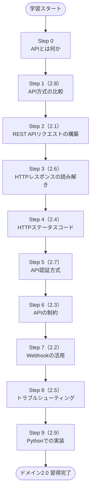
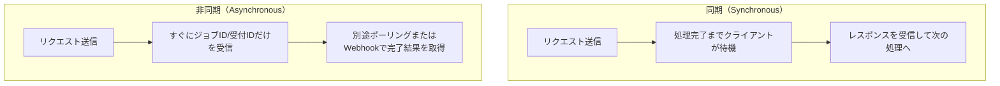
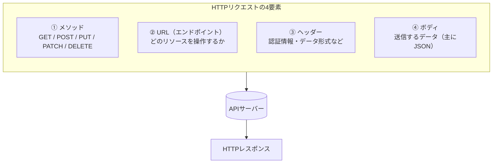
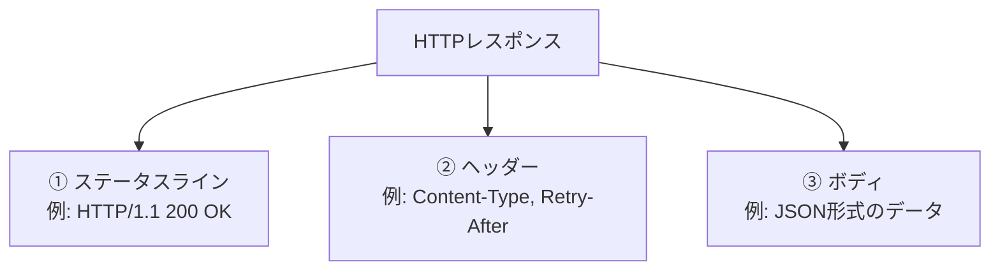
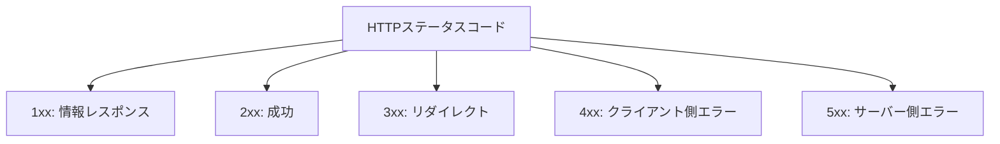
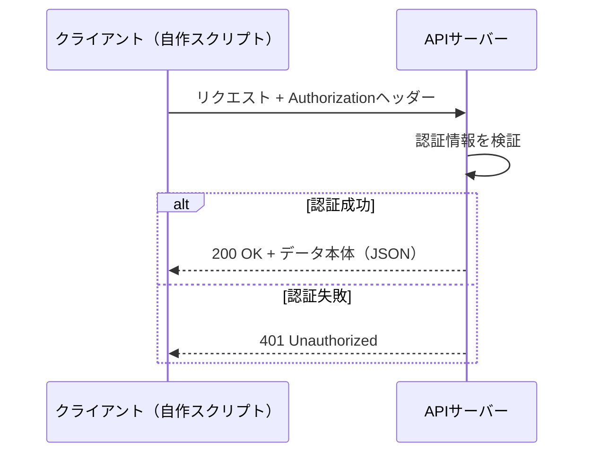
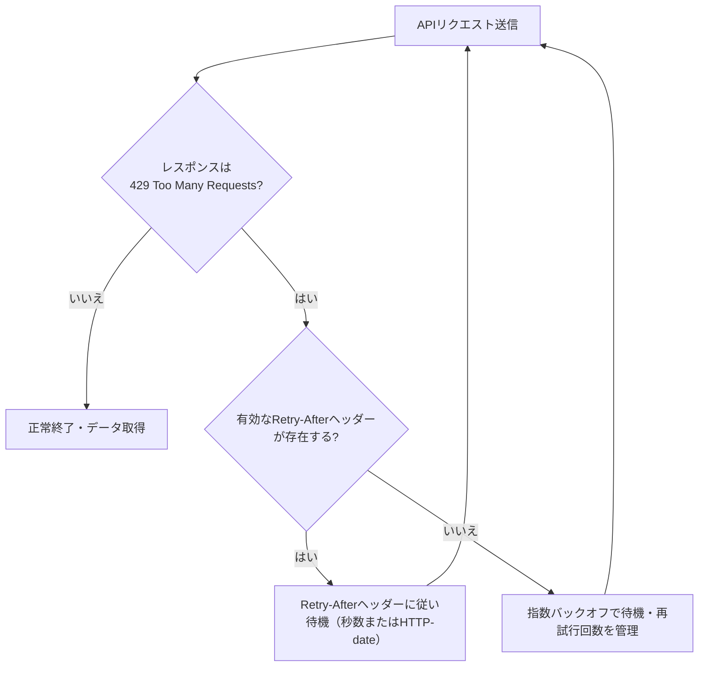
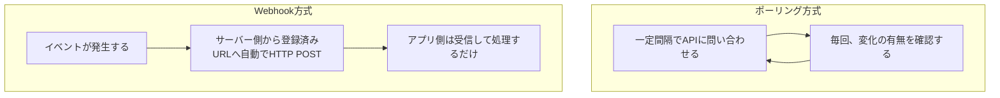
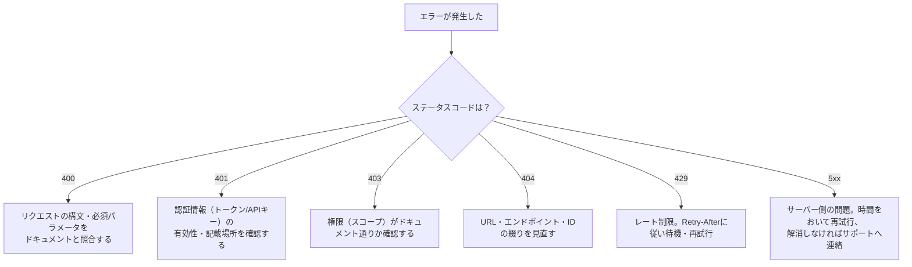

# CCNA Automation「APIの理解と活用」完全ガイド

## 〜試験項目 2.0 Understanding and Using APIs をステップバイステップで攻略する〜

> 本ガイドは、Cisco公式サイトの CCNA Automation 認定ページおよび公式試験トピック（Exam Topics）PDFの内容にもとづいて作成した**非公式の学習補助資料**です。試験内容は予告なく変更される場合があるため、必ず記事末尾の一次情報源（Cisco公式サイト）もあわせてご確認ください。

---

## 目次

1. [この記事について](#1-この記事について)
2. [CCNA Automation 試験の全体像](#2-ccna-automation-試験の全体像)
3. [学習ロードマップ](#3-学習ロードマップ)
4. [Step 0: そもそも「API」とは何か](#4-step-0-そもそもapiとは何か)
5. [Step 1（試験項目2.8）: APIの方式を比較する](#5-step-1試験項目28-apiの方式を比較する)
6. [Step 2（試験項目2.1）: ドキュメントからREST APIリクエストを組み立てる](#6-step-2試験項目21-ドキュメントからrest-apiリクエストを組み立てる)
7. [Step 3（試験項目2.6）: HTTPレスポンスの構造を読み解く](#7-step-3試験項目26-httpレスポンスの構造を読み解く)
8. [Step 4（試験項目2.4）: 主要なHTTPステータスコードを理解する](#8-step-4試験項目24-主要なhttpステータスコードを理解する)
9. [Step 5（試験項目2.7）: API認証方式を使い分ける](#9-step-5試験項目27-api認証方式を使い分ける)
10. [Step 6（試験項目2.3）: APIを使ううえでの制約を理解する](#10-step-6試験項目23-apiを使ううえでの制約を理解する)
11. [Step 7（試験項目2.2）: Webhookの活用パターンを理解する](#11-step-7試験項目22-webhookの活用パターンを理解する)
12. [Step 8（試験項目2.5）: ステータスコードから障害を切り分ける](#12-step-8試験項目25-ステータスコードから障害を切り分ける)
13. [Step 9（試験項目2.9）: Pythonのrequestsライブラリで実装する](#13-step-9試験項目29-pythonのrequestsライブラリで実装する)
14. [まとめ: 試験項目とこのガイドの対応表](#14-まとめ-試験項目とこのガイドの対応表)
15. [さらに学ぶために（関連する試験項目とのつながり）](#15-さらに学ぶために関連する試験項目とのつながり)
16. [出典・参考資料](#16-出典参考資料)

---

## 1. この記事について

Cisco は2026年、これまでの「DevNet Associate」認定を「**CCNA Automation**」として刷新しました。対応する試験は **Automating Networks Using Cisco Platforms v1.1（200-901 CCNAAUTO）** で、120分・合否判定の試験です。以前 DevNet Associate に合格していた人は、自動的に CCNA Automation 保持者として扱われます。

この試験の6つの出題ドメインのうち、最も配点比率が高いのが **「2.0 Understanding and Using APIs（APIの理解と活用）」で配点20%** です。ネットワーク自動化はほぼ必ずAPI経由で行われるため、この分野はCCNA Automation全体の土台となる最重要パートといえます。

本ガイドでは、この「2.0 Understanding and Using APIs」に含まれる9つの小項目（2.1〜2.9）を、**初学者でも迷わないようにステップ順に並び替えて**解説します。試験の公式な項番とは順番が異なりますが、「概念 → リクエスト → レスポンス → 認証 → 制約 → Webhook → トラブルシューティング → 実装」という理解しやすい流れに再構成しています。

---

## 2. CCNA Automation 試験の全体像

CCNA Automation認定を取得するには、以下の1科目に合格する必要があります。

| 項目 | 内容 |
|---|---|
| 試験名 | Automating Networks Using Cisco Platforms v1.1（200-901 CCNAAUTO） |
| 試験時間 | 120分 |
| 出題言語 | 英語・日本語 |
| 受験料 | US $300（または Cisco Learning Credits） |
| 有効期間 | 合格から3年間 |
| 前提条件 | 特になし（Python等のソフトウェア開発経験1年以上が推奨） |

試験は次の6つのドメインで構成されており、本ガイドが扱うのは **ドメイン2.0** です。

| ドメイン番号 | ドメイン名 | 出題比率 |
|---|---|---|
| 1.0 | Software Development and Design（ソフトウェア開発と設計） | 15% |
| **2.0** | **Understanding and Using APIs（APIの理解と活用）** | **20%** |
| 3.0 | Cisco Platforms and Development（Ciscoプラットフォームと開発） | 15% |
| 4.0 | Application Deployment and Security（アプリケーションの展開とセキュリティ） | 15% |
| 5.0 | Infrastructure and Automation（インフラと自動化） | 20% |
| 6.0 | Network Fundamentals（ネットワーク基礎） | 15% |

ドメイン2.0に含まれる公式の小項目（2.1〜2.9）は以下の通りです。詳細は本ガイドの各ステップで解説します。

| 項番 | 公式の項目名（原文） | 内容の要約 |
|---|---|---|
| 2.1 | Construct a REST API request to accomplish a task given API documentation | ドキュメントを見てREST APIリクエストを組み立てる |
| 2.2 | Describe common usage patterns related to webhooks | Webhookの一般的な利用パターンを説明する |
| 2.3 | Describe the constraints when consuming APIs | APIを利用する際の制約を説明する |
| 2.4 | Explain common HTTP response codes associated with REST APIs | 代表的なHTTPレスポンスコードを説明する |
| 2.5 | Troubleshoot a problem given the HTTP response code, request and API documentation | レスポンスコードとリクエスト、ドキュメントから問題を切り分ける |
| 2.6 | Interpret the parts of an HTTP response (response code, headers, body) | HTTPレスポンスの構成要素を読み解く |
| 2.7 | Utilize common API authentication mechanisms: basic, custom token, and API keys | 主要な認証方式（Basic・カスタムトークン・APIキー）を使う |
| 2.8 | Compare common API styles (REST, RPC, synchronous, and asynchronous) | APIの方式（REST/RPC、同期/非同期）を比較する |
| 2.9 | Construct a Python script that calls a REST API using the requests library | requestsライブラリでREST APIを呼び出すPythonスクリプトを書く |

---

## 3. 学習ロードマップ



この順番で学ぶ理由はシンプルです。**「概念（何ができるか）」を先に理解してから「作法（どう書くか）」を学び、最後に「実装（コードにする）」へ進む**という、初学者にとって最も挫折しにくい流れになっています。

---

## 4. Step 0: そもそも「API」とは何か

CCNA Automationで扱うAPIのほとんどは、Web上でHTTP通信を使ってやり取りする「Web API」です。まずは比喩で全体像をつかみましょう。

- **クライアント（あなたのスクリプト）** = レストランのお客さん
- **API** = 注文を受けて厨房に伝えるウェイター
- **APIサーバー（Cisco Meraki、Webexなど）** = 厨房

お客さんは厨房に直接入って調理しません。「メニュー（APIドキュメント）」を見て、決められた形式でウェイター（API）に注文し、料理（データ）を受け取ります。ネットワーク自動化も同じで、Pythonスクリプトが直接ネットワーク機器の内部処理を書き換えるのではなく、**あらかじめ定義された作法（API）を通じて**タスクを依頼します。

CCNA Automationで登場する代表的なCisco APIには、Meraki Dashboard API、Cisco Catalyst Center API、Webex API、ACI API、Cisco Catalyst SD-WAN API、NSO APIなどがあり、いずれも土台となる考え方はこのガイドで学ぶ内容と共通しています。

---

## 5. Step 1（試験項目2.8）: APIの方式を比較する

コードを書く前に、まず「APIにはいくつかの流派（スタイル）がある」ことを理解しておきましょう。試験項目2.8では、**REST と RPC**、**同期と非同期**という2つの軸での比較が問われます。

### 5.1 REST vs RPC

| 観点 | REST | RPC |
|---|---|---|
| 考え方 | 「リソース（モノ）」をURLで表現し、HTTPメソッドで操作する | 「手続き（関数）」をリモートから呼び出す感覚 |
| 例 | `GET /devices/123` → IDが123の機器情報を取得 | `callMethod("getDevice", {id:123})` のような呼び出し |
| 状態管理 | ステートレス（各リクエストが独立） | 実装によって異なる |
| CCNA Automationでの位置づけ | Cisco製品APIの主流（Meraki、Webexなど） | gRPCなど一部の自動化ツールで使用 |

### 5.2 同期 vs 非同期



- **同期**: 「レストランで注文して、料理ができるまでその場で待つ」イメージ。シンプルだが、処理に時間がかかる操作（例: 大規模な設定変更）には不向き。
- **非同期**: 「注文票（受付番号）だけ先にもらって、呼ばれたら取りに行く」イメージ。時間のかかる処理（機器の一括アップグレードなど）でよく使われ、完了通知には次章のWebhookやポーリングが使われる。

> **試験のポイント**: 「REST/RPC」と「同期/非同期」は別の軸です。例えば「RESTで非同期処理を実装する（ジョブIDを返すREST API）」という組み合わせも普通に存在します。混同しないようにしましょう。

---

## 6. Step 2（試験項目2.1）: ドキュメントからREST APIリクエストを組み立てる

REST APIへのリクエストは、次の4つの要素で構成されます。この構造を体に染み込ませることが、試験項目2.1の核心です。



### 6.1 各要素の役割

| 要素 | 役割 | 具体例 |
|---|---|---|
| メソッド | 何をしたいか（動詞） | `GET`=取得、`POST`=作成、`PUT`/`PATCH`=更新、`DELETE`=削除 |
| URL | どのリソースに対してか（名詞） | `/organizations/{orgId}/networks` |
| ヘッダー | 付帯情報 | `Authorization`（認証）、`Content-Type: application/json`（データ形式） |
| ボディ | 送信データ | `{"name": "Branch-01"}` のようなJSON |

### 6.2 ドキュメントから組み立てる実践例

CCNA Automationの試験項目3.9.aでは「Meraki、Cisco Catalyst Center、ACI、Cisco Catalyst SD-WAN、NSOを使ってネットワーク機器の一覧を取得する」ことが具体的に問われます。ここではMeraki Dashboard APIを例に、ドキュメントを見てリクエストを組み立てる手順を体験してみましょう。

**手順**
1. APIドキュメントで目的の操作（「組織配下のネットワーク一覧を取得したい」）を探す
2. 対応するメソッドとエンドポイントを確認する（例: `GET /organizations/{organizationId}/networks`）
3. 認証方法（後述のStep 5）をヘッダーに設定する
4. 必要なパスパラメータ（`{organizationId}`）を実際の値に置き換える

**組み立てた結果（例）**

```http
GET https://api.meraki.com/api/v1/organizations/549236/networks HTTP/1.1
Host: api.meraki.com
Authorization: Bearer <APIキー>
```

このように、APIドキュメントは「メニュー表」であり、そこに書かれた形式に沿って過不足なくリクエストを組み立てることが2.1のスキルです。

---

## 7. Step 3（試験項目2.6）: HTTPレスポンスの構造を読み解く

リクエストを送ると、APIサーバーはHTTPレスポンスを返します。レスポンスも3つの部分から構成されています。



**レスポンス例**

```http
HTTP/1.1 200 OK
Content-Type: application/json
X-Request-Id: 7a1c2e3f

[
  {
    "id": "N_1234",
    "name": "Branch-01",
    "timeZone": "Asia/Tokyo"
  }
]
```

| 部分 | この例での内容 | 意味 |
|---|---|---|
| ステータスライン | `200 OK` | リクエストが成功したことを示す |
| ヘッダー | `Content-Type: application/json` | ボディがJSON形式であることを示す |
| ボディ | ネットワーク情報の配列 | 実際に取得したデータ本体 |

ボディの中身（JSON）をPythonの辞書やリストに変換する処理は、試験ドメイン1.0（1.2 データ形式のパース）ともつながっています。あわせて押さえておくと理解が深まります。

---

## 8. Step 4（試験項目2.4）: 主要なHTTPステータスコードを理解する

ステータスコードは3桁の数字で、**先頭の数字が「大分類」**を表します。



### 8.1 分類ごとの意味

| 分類 | 意味 | 代表的なコード |
|---|---|---|
| 1xx | 情報提供のみ（処理継続中） | 100 Continue |
| 2xx | リクエスト成功 | 200 OK、201 Created、204 No Content |
| 3xx | 別の場所への転送・未更新 | 301 Moved Permanently、304 Not Modified |
| 4xx | クライアント（リクエスト側）に原因あり | 400、401、403、404、429 |
| 5xx | サーバー側に原因あり | 500、502、503 |

### 8.2 CCNA Automationで特に重要なコード

| コード | 名称 | よくある原因 |
|---|---|---|
| 200 | OK | GETやPUTなどが正常に完了 |
| 201 | Created | POSTでリソースが新規作成された |
| 204 | No Content | DELETEなど、成功したがボディを返さない |
| 400 | Bad Request | リクエストの構文やパラメータの誤り |
| 401 | Unauthorized | 認証情報が無い、または無効 |
| 403 | Forbidden | 認証はできているが権限（スコープ）が不足 |
| 404 | Not Found | URLやリソースIDの誤り、存在しないリソース |
| 429 | Too Many Requests | レート制限（後述）に抵触 |
| 500 | Internal Server Error | サーバー側の不具合 |
| 503 | Service Unavailable | サーバーが一時的に過負荷・メンテナンス中 |

---

## 9. Step 5（試験項目2.7）: API認証方式を使い分ける

「誰がリクエストしているか」をサーバーに証明する方法にはいくつかの種類があります。試験項目2.7では、**Basic認証・カスタムトークン・APIキー**の3種類が問われます。

### 9.1 3つの認証方式の比較

| 方式 | 仕組み | ヘッダー例 | 特徴 |
|---|---|---|---|
| Basic認証 | ユーザー名とパスワードをBase64エンコードして送る | `Authorization: Basic dXNlcjpwYXNz` | 実装は簡単だが、パスワードが漏れると影響が大きい。必ずHTTPS上で使う |
| カスタムトークン（Bearerトークン等） | 事前に取得したトークン文字列を送る | `Authorization: Bearer <token>` | OAuthなどで発行される一時的なトークンが多く、有効期限や権限範囲（スコープ）を持てる |
| APIキー | サービスごとに発行された固定のキー文字列を送る | 専用ヘッダー、またはクエリパラメータ | 実装がシンプルで長期利用に向くが、漏えい時の影響範囲が広い |

### 9.2 認証の流れ（シーケンス図）



### 9.3 Cisco製品での実例

Cisco Meraki Dashboard APIでは、APIキーを`Authorization: Bearer <APIキー>`ヘッダーで送る方式（v1）と、旧バージョンで使われていた専用ヘッダー`X-Cisco-Meraki-API-Key`が存在します。また、セキュリティ上の配慮として、**APIキーが誤っている場合はあえて403ではなく404を返す**設計になっており、これは「リソースの存在自体を第三者に推測させない」ための工夫です。試験項目2.5（トラブルシューティング）でもこうした「一見不自然に見えるコードの意図」を理解しているかが問われます。

---

## 10. Step 6（試験項目2.3）: APIを使ううえでの制約を理解する

APIは「無制限に、好きなだけ」呼び出せるわけではありません。試験項目2.3では、代表的な制約を理解しているかが問われます。

| 制約 | 内容 | 典型的なサイン |
|---|---|---|
| レート制限（Rate Limiting） | 一定時間内に呼び出せる回数の上限 | `429 Too Many Requests`、`Retry-After`ヘッダー |
| ページネーション | 一度のリクエストで返せる件数に上限がある | レスポンスに次ページへのリンク/トークンが含まれる |
| バージョニング | APIの仕様変更に備え、URLにバージョン番号を含む | `/api/v1/...` のような表記 |
| ペイロードサイズ制限 | 一度に送信・受信できるデータ量の上限 | 大きすぎるリクエストで`400`や`413`系のエラー |
| タイムアウト | 一定時間内にレスポンスが返らないと打ち切られる | クライアント側の接続エラー |

### 10.1 レート制限への対処（再試行フロー）



Cisco Meraki Dashboard APIの場合、組織単位で1秒あたりのリクエスト数に上限が設けられており、これを超えると`429`が返され、`Retry-After`ヘッダーで待機すべき時間（秒数またはHTTP-date形式）が示されます。自動化スクリプトを書く際は、こうした制約を前提に「失敗したら少し待って再試行する」処理を組み込むことが実務でも試験でも重要です。

---

## 11. Step 7（試験項目2.2）: Webhookの活用パターンを理解する

「APIサーバーに変化がないか、こちらから何度も聞きに行く」方式（ポーリング）に対して、「変化があったらサーバー側から知らせてもらう」方式が **Webhook** です。



| 観点 | ポーリング | Webhook |
|---|---|---|
| 通信の主体 | クライアントが定期的に問い合わせる | サーバー側がイベント発生時に通知する |
| リアルタイム性 | 問い合わせ間隔に依存する | ほぼリアルタイム |
| サーバー負荷 | 変化がなくても毎回リクエストが発生する | 変化があったときだけ通信が発生する |
| 実装の要点 | 間隔設計、無駄打ちの許容 | 受信用エンドポイントの用意、署名検証 |

### 11.1 Webhookの一般的な利用パターン

1. **事前登録**: 「このイベント（例: メッセージ投稿）が起きたら、このURLにPOSTしてください」とAPI提供元へ登録する
2. **イベント発火**: 実際にイベントが発生すると、登録先URLへHTTP POSTでデータが送られてくる
3. **受信処理**: 受信側アプリはPOSTされたJSONの中身（どのリソースで、どんな種類のイベントが起きたか）を見て処理を分岐する
4. **署名検証**: なりすまし防止のため、送信元がシークレットキーで生成した署名をヘッダーで検証してから処理するのがベストプラクティス
5. **速やかな応答**: 受信側は重い処理を後回しにし、まず`200`系のステータスを素早く返すのが定石（応答が遅いと再送されたり、登録が無効化されたりする場合がある）

Webex APIのWebhookでは、「どのリソース（例: メッセージ、会議室）」「どんな種類のイベント（作成・更新・削除など）」「通知先URL」を指定して登録し、実際の通知にはそのイベントに関するデータ本体が添えられます。機微な情報を含む場合はメタデータのみが渡され、詳細は別途本体のAPIから取得する設計になっている点も、Webhookが「万能ではなく制約もある仕組み」であることを示しています。

---

## 12. Step 8（試験項目2.5）: ステータスコードから障害を切り分ける

試験項目2.5は、「ステータスコード」「送ったリクエストの内容」「APIドキュメント」の3つを突き合わせて原因を推測する、いわば総合力を問う項目です。



### 12.1 よくある原因と対処の対応表

| 症状（ステータスコード） | 疑うべき原因 | 確認・対処のヒント |
|---|---|---|
| 400 Bad Request | 必須パラメータの欠落、型の不一致、JSON構文ミス | ドキュメントの必須項目一覧とリクエストボディを1つずつ突合する |
| 401 Unauthorized | トークン期限切れ、認証ヘッダーの書式誤り | ヘッダー名・`Bearer`等のプレフィックス・キーの有効性を確認する |
| 403 Forbidden | 認証は通っているが権限不足 | 発行したトークン/キーに必要なスコープ（権限範囲）が付与されているか確認する |
| 404 Not Found | URLタイプミス、削除済み/存在しないID | パスパラメータの値やAPIバージョン（`v1`等）を再確認する |
| 429 Too Many Requests | 短時間の連続リクエストによるレート制限抵触 | `Retry-After`ヘッダーの秒数（またはHTTP-date）を尊重し、リトライ間隔を調整する |
| 5xx系 | サーバー側の一時的な障害 | 自分側の問題ではないため、時間をおいて再試行し、継続する場合はサポート窓口へ |

トラブルシューティングの基本姿勢は「**まずステータスコードで大分類を絞り込み、次にレスポンスのボディに含まれるエラーメッセージやヘッダーで詳細を特定し、最後にドキュメントの該当箇所と実際のリクエストを見比べる**」という順序です。

---

## 13. Step 9（試験項目2.9）: Pythonのrequestsライブラリで実装する

ここまでの知識を、実際にPythonコードへ落とし込みます。試験項目2.9は「requestsライブラリを使ってREST APIを呼び出すスクリプトを書ける」ことを問う項目です。

### 13.1 基本形（GETリクエスト）

```python
import requests

url = "https://api.meraki.com/api/v1/organizations/549236/networks"
headers = {
    "Authorization": "Bearer <APIキー>",
    "Content-Type": "application/json",
}

response = requests.get(url, headers=headers, timeout=10)

# ステータスコードを確認する（試験項目2.4・2.6と直結）
if response.status_code == 200:
    networks = response.json()  # JSON文字列をPythonのlist/dictへ変換
    for network in networks:
        print(network["id"], network["name"])
else:
    print(f"エラー: {response.status_code} - {response.text}")
```

### 13.2 POSTリクエスト（データを送る場合）

```python
import requests

url = "https://api.meraki.com/api/v1/organizations/549236/networks"
headers = {
    "X-Cisco-Meraki-API-Key": "<APIキー>",  # 専用ヘッダー例（v1標準は Authorization: Bearer <APIキー>）
    "Content-Type": "application/json",
}
payload = {
    "name": "Branch-02",
    "productTypes": ["appliance", "switch"],
    "timeZone": "Asia/Tokyo",
}

response = requests.post(url, headers=headers, json=payload, timeout=10)

if response.status_code == 201:
    print("作成成功:", response.json())
else:
    print(f"作成失敗: {response.status_code} - {response.text}")
```

### 13.3 制約・障害対応を組み込んだ実装（Step 6・8の応用）

```python
import time
import requests

def get_with_retry(url, headers, max_retries=3):
    for attempt in range(max_retries):
        try:
            response = requests.get(url, headers=headers, timeout=10)
        except requests.exceptions.RequestException as e:
            print(f"通信エラー発生 ({e})。再試行します。")
            if attempt == max_retries - 1:
                break
            time.sleep(2 ** attempt)
            continue

        if response.status_code == 200:
            return response.json()

        if response.status_code == 429:
            # レート制限：Retry-Afterヘッダー（秒数またはHTTP-date）だけ待って再試行
            retry_after = response.headers.get("Retry-After")
            wait_seconds = None
            if retry_after is not None:
                try:
                    parsed_val = int(retry_after)
                    if parsed_val >= 0:
                        wait_seconds = min(parsed_val, 3600)
                except (ValueError, TypeError):
                    try:
                        import math
                        from email.utils import parsedate_to_datetime
                        from datetime import datetime, timezone
                        dt = parsedate_to_datetime(retry_after)
                        now = datetime.now(timezone.utc)
                        diff = max(0, math.ceil((dt - now).total_seconds()))
                        wait_seconds = min(diff, 3600)
                    except Exception:
                        pass
            if attempt == max_retries - 1:
                break
            if wait_seconds is None:
                wait_seconds = 2 ** attempt
            print(f"レート制限中。{wait_seconds}秒待機して再試行します。")
            time.sleep(wait_seconds)
            continue

        if response.status_code >= 500:
            # サーバー側エラー：指数バックオフで再試行
            if attempt == max_retries - 1:
                break
            time.sleep(2 ** attempt)
            continue

        # 400/401/403/404などクライアント側の問題は再試行しても解決しないため、
        # ここでエラー内容をログに残して処理を打ち切る
        raise RuntimeError(f"リクエスト失敗: {response.status_code} - {response.text}")

    raise RuntimeError("再試行の上限に達しました。")
```

このように、単に`requests.get()`を呼ぶだけでなく、**ステータスコードごとに適切な分岐処理を書けること**が、試験でもCiscoのネットワーク自動化の実務でも求められるスキルです。

---

## 14. まとめ: 試験項目とこのガイドの対応表

| 公式項番 | 内容 | 本ガイドの該当箇所 |
|---|---|---|
| 2.1 | REST APIリクエストの組み立て | Step 2 |
| 2.2 | Webhookの利用パターン | Step 7 |
| 2.3 | APIの制約 | Step 6 |
| 2.4 | HTTPレスポンスコード | Step 4 |
| 2.5 | トラブルシューティング | Step 8 |
| 2.6 | HTTPレスポンスの構造 | Step 3 |
| 2.7 | API認証方式 | Step 5 |
| 2.8 | APIスタイルの比較 | Step 1 |
| 2.9 | requestsライブラリでの実装 | Step 9 |

---

## 15. さらに学ぶために（関連する試験項目とのつながり）

「2.0 Understanding and Using APIs」は独立した知識ではなく、他のドメインの土台にもなっています。学習が一段落したら、次のつながりも意識すると理解が立体的になります。

- **ドメイン3.0（Cisco Platforms and Development）**: ここで学んだREST APIの知識を、Meraki／Cisco Catalyst Center／ACI／Cisco Catalyst SD-WAN／NSO／Webex／UCS Managerなど、実際のCisco製品APIに適用していきます（3.1, 3.2〜3.6, 3.9）。
- **ドメイン5.0（Infrastructure and Automation）**: 「Pythonスクリプトが何を自動化しているかを読み解く（5.7）」「RESTCONF/NETCONFの結果を解釈する（5.10）」「YANGモデルを読む（5.11）」「APIコールを含むシーケンス図を読み解く（5.14）」など、APIの知識をより実践的なインフラ自動化の文脈で使う項目が続きます。
- **ドメイン1.0（Software Development and Design）**: レスポンスボディのJSON/XML/YAMLをPythonのデータ構造にパースする力（1.2）は、Step 3・Step 9の内容と直結しています。

---

## 16. 出典・参考資料

本ガイドの内容は、以下の一次情報源にもとづいています。

- Cisco「CCNA Automation certification」公式ページ  
  https://www.cisco.com/site/us/en/learn/training-certifications/certifications/automation/ccna-automation/index.html
- Cisco「CCNA Automation Exam and Training」公式ページ（試験名・時間・受験料等）  
  https://www.cisco.com/site/us/en/learn/training-certifications/certifications/automation/ccna-automation/exams-and-training.html
- Cisco 公式 試験トピック（Exam Topics）PDF: Automating Networks Using Cisco Platforms v1.1（200-901 CCNAAUTO）  
  https://learningcontent.cisco.com/documents/marketing/exam-topics/200-901-CCNAAUTO_v.1.1.pdf
- Cisco Meraki Developer Hub「Authentication - Meraki Dashboard API v1」  
  https://developer.cisco.com/meraki/api-v1/authorization/
- Cisco Meraki Developer Hub「Getting Started - Meraki Dashboard API v1」  
  https://developer.cisco.com/meraki/api-v1/getting-started/
- Cisco Meraki Documentation「Cisco Meraki Dashboard API」（404によるリソース秘匿の設計、レート制限の考え方）  
  https://documentation.meraki.com/Platform_Management/Dashboard_Administration/Operate_and_Maintain/How-Tos/Cisco_Meraki_Dashboard_API
- Webex for Developers「APIs - Webhooks」（Webhookの概念と利用パターン）  
  https://developer-usgov.webex.com/docs/webhooks
- Webex for Developers「Webex Admin - Webhooks」（データ／メタデータの扱い）  
  https://developer.webex.com/admin/docs/api/guides/webhooks
- MDN Web Docs「HTTP response status codes」（HTTPステータスコードの一般的な定義）  
  https://developer.mozilla.org/en-US/docs/Web/HTTP/Reference/Status

> 試験内容・出題比率・URLは変更される可能性があります。受験前には必ず上記Cisco公式ページで最新情報をご確認ください。
