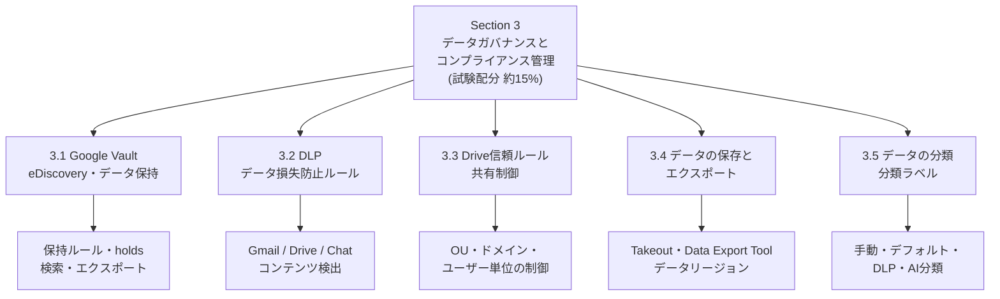
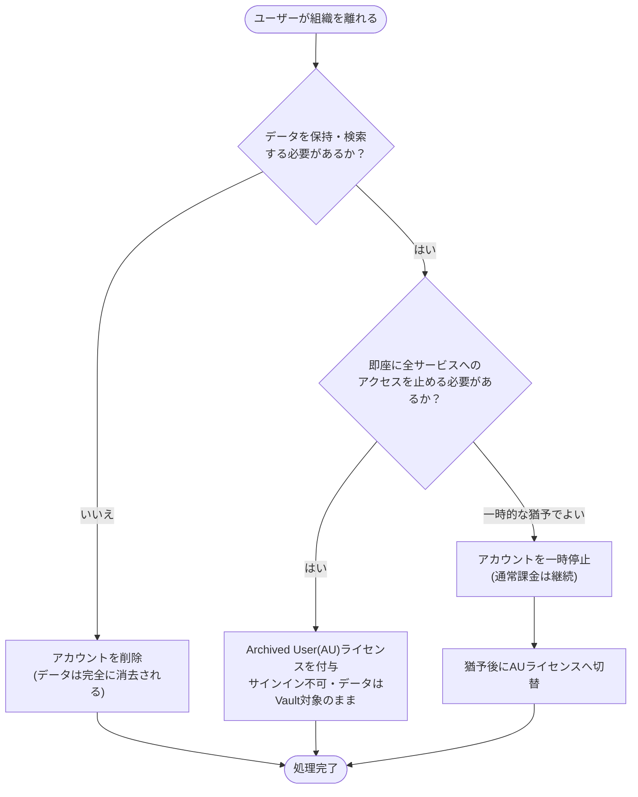
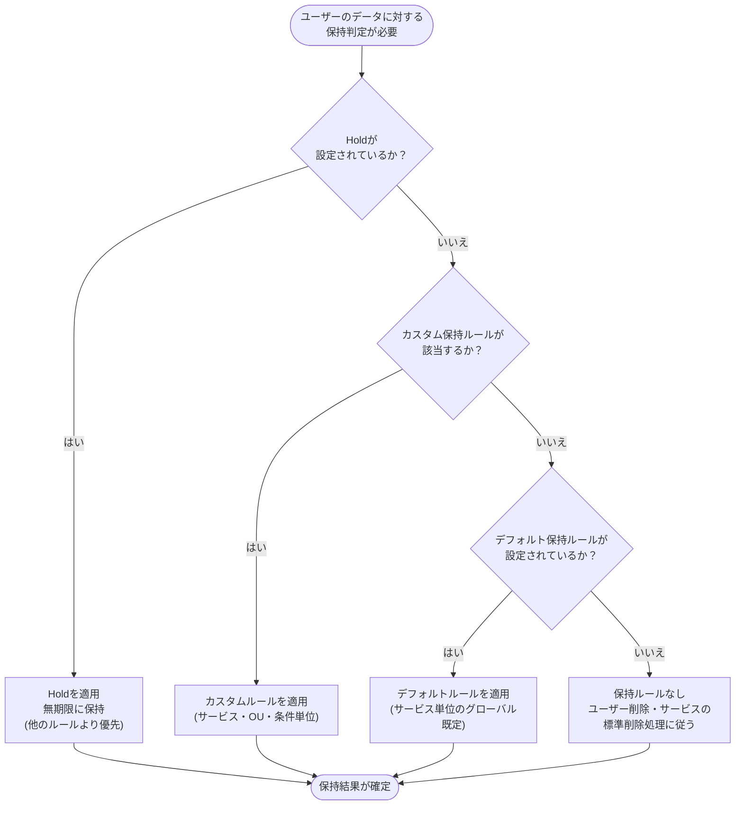
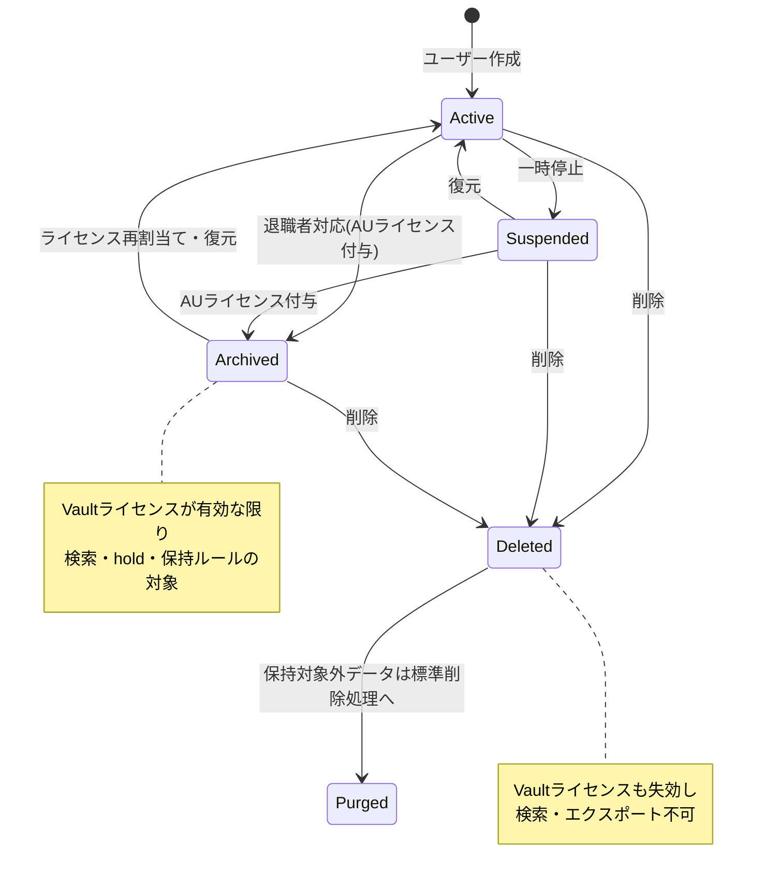
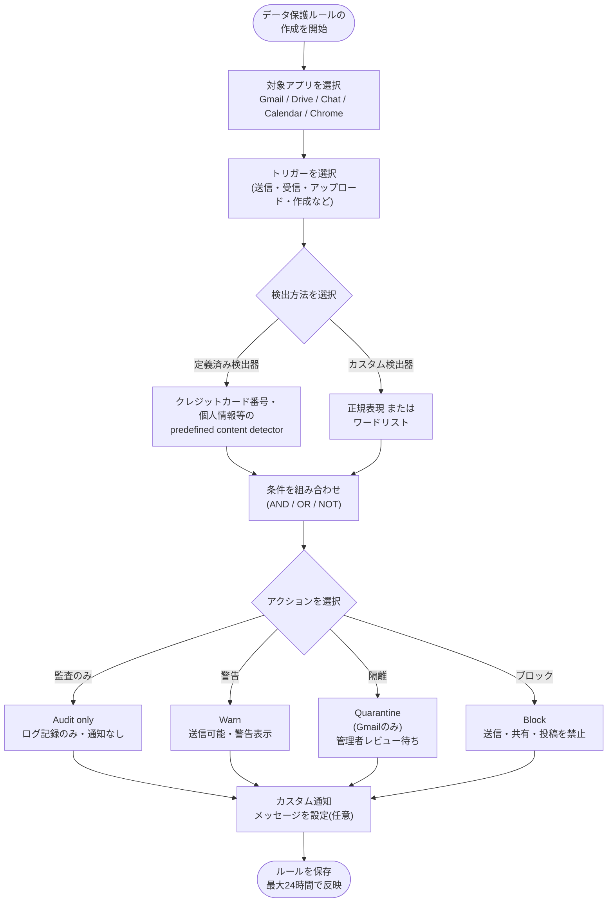
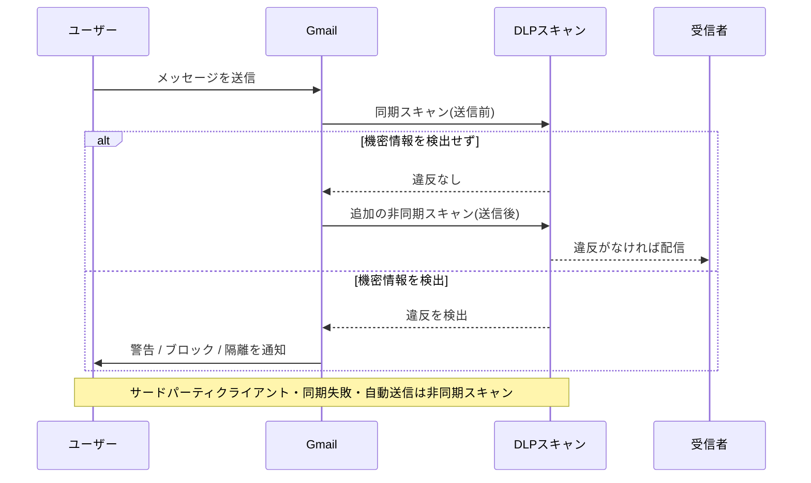
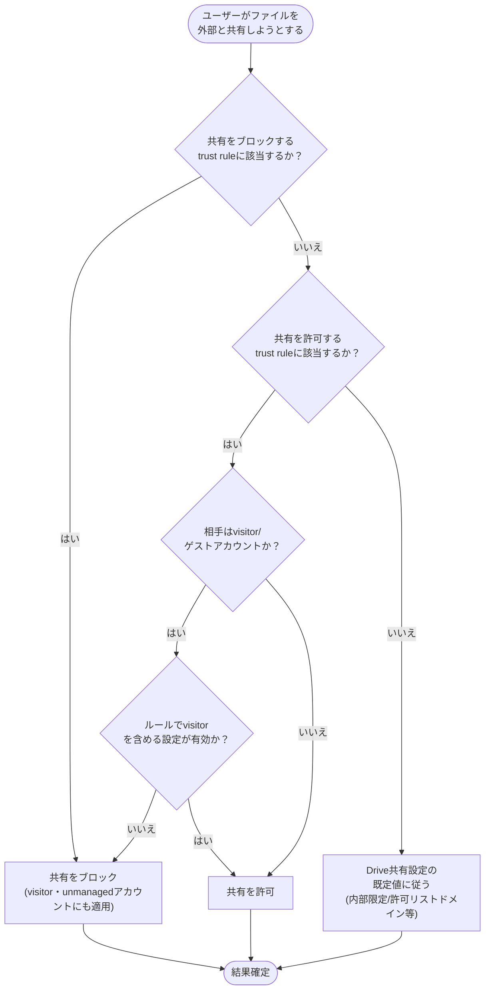
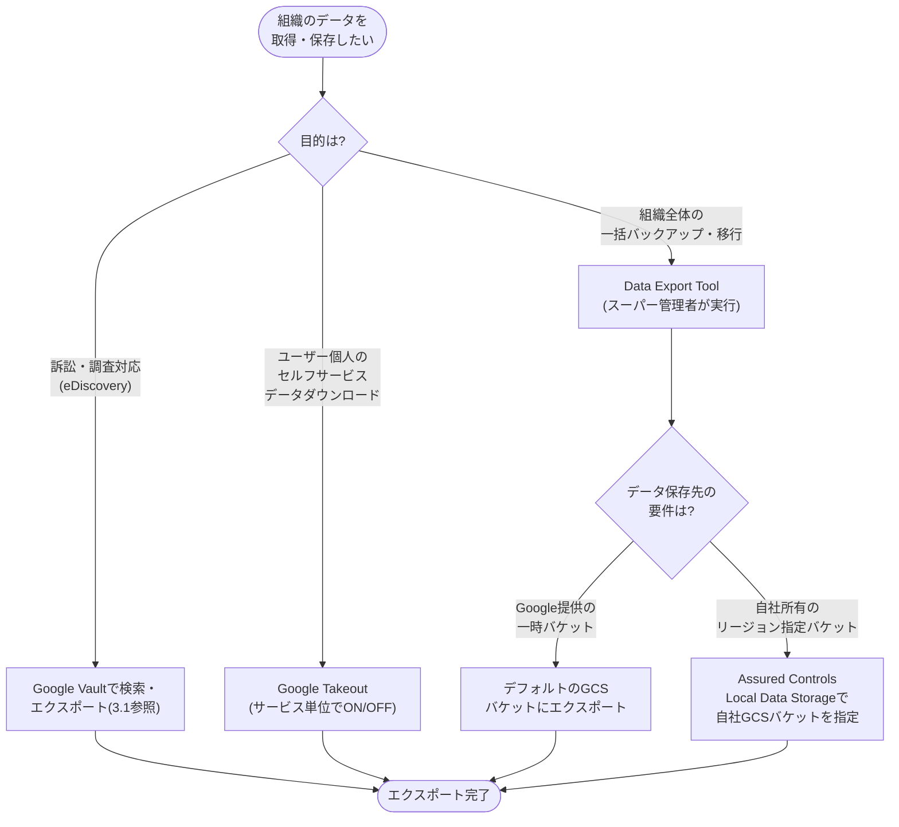
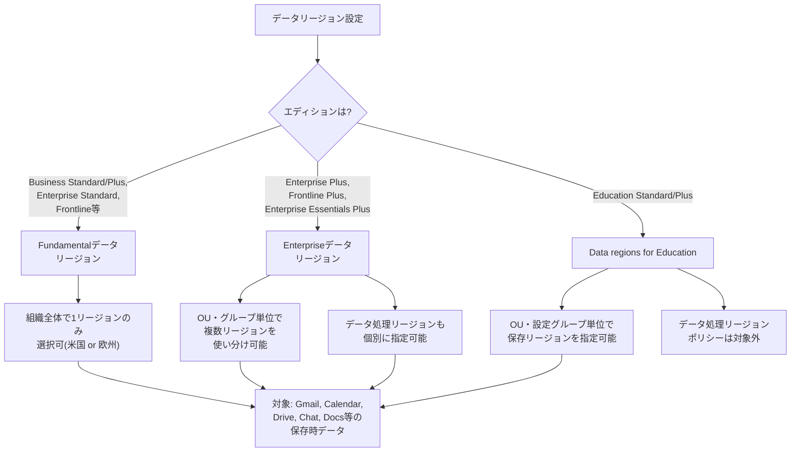
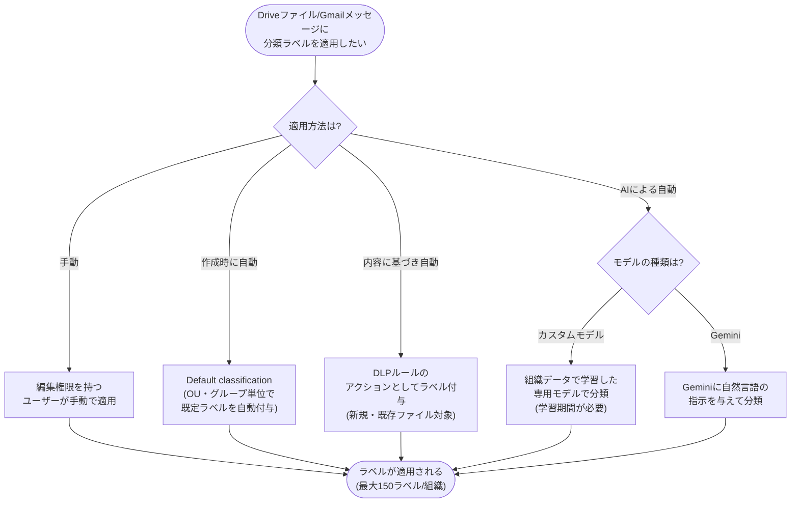

# Associate Google Workspace Administrator 試験対策ガイド

## Section 3: Managing data governance and compliance（データガバナンスとコンプライアンスの管理）

> 本ガイドは、Google公式の[認定試験ページ](https://cloud.google.com/learn/certification/associate-google-workspace-administrator?hl=en)および[公式Exam Guide PDF](https://services.google.com/fh/files/misc/associate_google_workspace_administrator_exam_guide_english.pdf)に記載された Section 3 の出題範囲（試験全体の**約15**%）に厳密に対応する形で構成しています。中級者〜上級者の管理者を対象に、各機能の仕組み・設定手順・実務上のベストプラクティスをステップバイステップで解説します。

Section 3 は次の5つのタスクから構成されます。

- **3.1** Google Vaultを使用したeDiscoveryとデータ保持
- **3.2** データ損失防止（DLP）ルールの作成と管理
- **3.3** Drive信頼ルール（Trust Rules）の作成と管理
- **3.4** 環境データの保存とエクスポート方法の決定
- **3.5** データの分類

以下の図は、この5タスクがどのように連携してGoogle Workspaceのデータガバナンス基盤を形成しているかを示しています。

5つのタスクは独立しているわけではありません。たとえばDLPルール（3.2）は分類ラベル（3.5）を自動付与するアクションとして使われ、Vault（3.1）はDrive信頼ルール（3.3）とは無関係にデータそのものを法的に保持します。この相互関係を意識しながら学習することが、実務でも試験でも重要です。

---

## 目次

1. [3.1 Google Vaultを使用したeDiscoveryとデータ保持](#31-google-vaultを使用したediscoveryとデータ保持)
   - [3.1.1 Google Vaultの全体像とEDRMモデル](#311-google-vaultの全体像とedrmモデル)
   - [3.1.2 アーカイブユーザーライセンスの活用](#312-アーカイブユーザーライセンスの活用)
   - [3.1.3 保持ポリシーの設定](#313-保持ポリシーの設定)
   - [3.1.4 法的・調査目的のholds設定](#314-法的調査目的のholds設定)
   - [3.1.5 保持ルールの自動化された運用](#315-保持ルールの自動化された運用)
   - [3.1.6 Vaultの検索とエクスポート機能](#316-vaultの検索とエクスポート機能)
   - [3.1.7 エクスポート先の設定](#317-エクスポート先の設定)
   - [3.1.8 監査レポートの生成](#318-監査レポートの生成)
   - [3.1.9 ベストプラクティス](#319-ベストプラクティス)
2. [3.2 データ損失防止（DLP）ルールの作成と管理](#32-データ損失防止dlpルールの作成と管理)
   - [3.2.1 DLP対応サービスと機能差](#321-dlp対応サービスと機能差)
   - [3.2.2 コンテンツ検出器によるDLPルールの自動化](#322-コンテンツ検出器によるdlpルールの自動化)
   - [3.2.3 サービス別のDLPルール適用](#323-サービス別のdlpルール適用)
   - [3.2.4 通知メッセージのカスタマイズ](#324-通知メッセージのカスタマイズ)
   - [3.2.5 ベストプラクティス](#325-ベストプラクティス)
3. [3.3 Drive信頼ルールの作成と管理](#33-drive信頼ルールの作成と管理)
   - [3.3.1 特定のOU・グループ・ドメイン・ユーザーへの共有制限](#331-特定のouグループドメインユーザーへの共有制限)
   - [3.3.2 特定のOU・グループ・ドメイン・ユーザーへの共有ブロック](#332-特定のouグループドメインユーザーへの共有ブロック)
   - [3.3.3 組織外との共有の許可・制限](#333-組織外との共有の許可制限)
   - [3.3.4 ベストプラクティス](#334-ベストプラクティス)
4. [3.4 環境データの保存とエクスポート方法の決定](#34-環境データの保存とエクスポート方法の決定)
   - [3.4.1 Google Takeout設定の管理](#341-google-takeout設定の管理)
   - [3.4.2 Data Export Toolの使用](#342-data-export-toolの使用)
   - [3.4.3 データの地理的保存場所の選択](#343-データの地理的保存場所の選択)
   - [3.4.4 業界規制に基づく法令・コンプライアンス設定](#344-業界規制に基づく法令コンプライアンス設定)
   - [3.4.5 ベストプラクティス](#345-ベストプラクティス)
5. [3.5 データの分類](#35-データの分類)
   - [3.5.1 ラベル適用のユースケース](#351-ラベル適用のユースケース)
   - [3.5.2 分類ラベルの設定方法](#352-分類ラベルの設定方法)
   - [3.5.3 ベストプラクティス](#353-ベストプラクティス)
6. [Section 3 まとめ表](#section-3-まとめ表)
7. [学習チェックリスト](#学習チェックリスト)
8. [参考文献](#参考文献)

---

## 3.1 Google Vaultを使用したeDiscoveryとデータ保持

### 3.1.1 Google Vaultの全体像とEDRMモデル

Google Vaultは、Google Workspaceの情報ガバナンス・eDiscoveryツールです。Vaultを使うことで、組織のデータを保持し、holdを設定し、検索し、そしてエクスポートできます。重要なのは、**Vaultはデータの別置きアーカイブではない**という点です。Vaultの保持ルールは各サービス（Gmail、Drive、Chatなど）のデータシステムに直接適用され、保持期間を過ぎたデータは各サービス側で削除されます。保持ルールを設定するまでは、Vaultは何もデータを保持しません。ユーザーはデータを削除でき、各サービスは通常のプロトコルに従ってデータを消去します[1]。

Vaultは、Electronic Discovery Reference Model（EDRM）が定めるeDiscoveryプロセスの最初の3段階をサポートします[1]。

| EDRM段階 | Vaultでの対応機能 | 概要 |
| --- | --- | --- |
| Identification（特定） | 検索 | ユーザーアカウント・OU・日付・キーワードでデータを検索し、メッセージ・添付ファイル・対応ファイルをプレビューできる |
| Preservation（保全） | Holds | アカウント・OU・グループに対してholdを設定し、法的・その他の保持義務のためにデータを無期限に保全する |
| Collection（収集） | エクスポート | 検索結果をエクスポートし、処理・分析用にダウンロードする |

### 3.1.2 アーカイブユーザーライセンスの活用

**3.1で最も出題頻度が高いテーマの一つが「アーカイブユーザー（AU）ライセンス」の使いどころです。**

Vaultがユーザーのデータを検索・保持・保全できるのは、そのユーザーにVaultライセンスが割り当てられている場合に限られます[2]。ユーザーが退職するなどして組織を離れる際、そのユーザーのGoogle Workspaceデータを引き続きVaultで保持・検索したい場合は、アカウントを**削除せず**、代わりに**Archived User（AU）ライセンス**を割り当てます[3]。

なぜアカウント削除ではなくアーカイブが推奨されるのでしょうか。理由は明確です。ユーザーアカウントを削除すると、そのユーザーに関連するすべてのGoogle Workspaceデータが削除され、Vaultが保持・hold していたデータも含めて消去されます[4]。削除後20日間はデータを復元できますが、データがすでに完全に消去（expunge）された場合は復元できません。

AUライセンスの主な特性は次のとおりです。

- AUライセンスが付与されたユーザーのアカウントは、AUが対応するサービスに限り、通常のライセンスと同様に**保持ルールとholdsの対象**になり続ける
- 退職者のアカウントを一時停止（suspend）するだけでも データは保全されるが、一時停止アカウントは**アクティブなアカウントと同額の課金**が発生する[3]
- Vault以外のアドオンライセンスはアーカイブ後も保持される場合があるが、そのことは各サービスのデータがVaultの保持ルール・holdsに対応することを意味しない[5]
- **Google Voiceの例外**: AUライセンスのアカウントに紐づくVoiceデータは、Vaultのretentionおよびholdsの対象外となる
- アーカイブされたユーザーを元に戻す（unarchive）には、対応するGoogle Workspaceエディションの利用可能なライセンスが必要。ライセンスがない場合、unarchive処理は失敗し、ユーザーはAUライセンスのままアーカイブされた状態に留まる[5]
- アーカイブされたユーザーは、いかなるシステムからもmanaged Google Accountにサインインできなくなる[5]

以下は、退職者データを扱う際の意思決定フローです。

> ⚠️ 注意: Google Cloud Directory Sync（GCDS）を利用している場合、GCDSがアカウントを削除ではなく一時停止するように構成されていることを確認してください。誤ってGCDS経由でアカウントが削除されると、Vaultが保持していたデータも失われます[4]。

### 3.1.3 保持ポリシーの設定

Vaultの保持ルールには**デフォルトルール**と**カスタムルール**の2種類があります。

**デフォルト保持ルール**は、サービスごとの既定の保全・削除ポリシーであり、カスタムルールやholdが適用されないユーザーデータに対して適用されます[6]。デフォルトルールで「No default retention」と表示されている場合、そのサービスにはデフォルトルールが設定されていないことを意味します。ステータスが「Off」の場合、そのサービスのデータは別サービスのデフォルトルールでカバーされていることを示します[6]。

**カスタム保持ルール**は、特定のOU・グループ・条件（日付、ラベル、キーワードなど）に基づいて設定する、より粒度の細かいルールです。

保持ルールの適用範囲の開始タイミングはサービスによって異なります[7]。

| サービス | 保持期間の起算点 |
| --- | --- |
| Gmail・Groups | メッセージが送受信された日 |
| Drive・Meet・Sites | ルールの設定方法により、ファイル作成日・変更日・ゴミ箱移動日などから起算される場合がある |

Gmailの保持ルールに関しては、ラベルベースのルールを使う場合、**スレッド内で最も新しくラベル付けされたメッセージの日付**を基準に保持期間が計算される点に注意が必要です[8]。

⚠️ **極めて重要な注意点**: 新しい保持ルールを送信（submit）すると、Vaultはその時点で保持期間を超えるデータの**即時パージ**をサービス側に許可します。この挙動はGmail・Drive・Groupsのいずれについても共通しており、ユーザーが保持を期待していたデータが失われる可能性があります[9] [10] [4]。そのため、公式ヘルプでは新しいルールを本番環境全体に適用する前に、小規模なアカウント群でテストすることを強く推奨しています[4]。

Groupsについては特有の制約があります。グループが削除されると、そのグループ内のメッセージはholdや保持ルールの対象であっても**削除されます**。ただし、ユーザーがグループへの購読を通じてGmailで受信したメッセージは削除されず、Gmailの保持ルール・holdの対象として残ります[4]。

保持ルールと自動削除機能（Google WorkspaceのGmail/Chatメッセージ自動削除設定）との関係も出題されやすいポイントです。自動削除ルールは、Vaultの保持ルールより長くメッセージを保全することはできません。自動削除ルールはVaultの保持ルールより先にメールボックスからメッセージを削除できますが、そのメッセージはGmailの30日間の保全ポリシーとVaultの保持ルールの両方が満了するまで、Vaultから引き続き検索可能です[11]。

### 3.1.4 法的・調査目的のholds設定

Holdは、特定のユーザー・OU・グループ・Chatスペース・共有ドライブに対して設定され、データを**無期限に**保持します。Holdはデフォルト保持ルールおよびカスタム保持ルールの**両方より優先**されます[12]。

Holdの主な性質は以下のとおりです。

- Holdは保持ルールを上書きする。保持ルールがデータをパージするよう設定されていても、hold対象のデータはholdが解除されるまでパージされない[13]
- Holdは**加算的**（additive）である。1つのholdが別のholdを置き換えることはない。たとえば「project X」というフレーズを含むメッセージを対象とするHold Aと、「budget」という語を含むメッセージを対象とするHold Bが同一ユーザーに設定されている場合、Vaultは両方の条件のいずれかに一致するメッセージを保全する[13]
- Holdが設定されたユーザーのアカウントは、hold解除までGoogle Workspace管理者が削除できない。データの転送も同様にできない[13]
- Hold対象データは、（a）holdが削除される、（b）custodianがholdから除外される、（c）ユーザーがVaultライセンスを失う、のいずれかが発生するまでパージできない[13]

サービスごとにholdが保全するデータの範囲は次のとおりです[13]。

| サービス | Holdが保全するデータ |
| --- | --- |
| Gmail | 送信済み・下書き（削除されていないもの）・ゴミ箱・アーカイブ・迷惑メールを含むメッセージと添付ファイル |
| Groups | Google Groups内のメッセージ（グループが削除されるまで） |
| Chat | 記録あり（履歴オン）のGoogle Chatメッセージ |
| Drive | ユーザーのDrive内のアイテム（フォルダ・ショートカットを除く）、および任意で関連する共有ドライブ内のアイテム。Meet録画やそのログファイル、新しいGoogle Sitesサイトにも適用される |

保持ルールとholdsの優先順位を図示すると以下のようになります。

組織全体のholdを横断的に確認したい場合は、Vaultの「Reports」機能を使い、Domain Holds（OUに適用されるhold）・User Holds（ユーザーを明示的に含むhold）・Group Holds（グループに適用されるhold）を確認できます。この機能を使うには「Manage Audits」権限が必要です[14]。

### 3.1.5 保持ルールの自動化された運用

タスク3.1の記述では「特定の基準（日付、コンテンツなど）に基づいてデータを自動的に保持または削除するための保持ルールの作成と管理」が挙げられています。これは3.1.3で解説したカスタム保持ルールの仕組みそのものであり、日付ベース（作成日・送信日からの経過日数）やラベル・条件ベースの両方を組み合わせて、定期的な棚卸し作業なしにコンプライアンス要件を満たせるようにする点が実務上の価値です。

Vaultユーザーは、自組織の法的・業務上の要件を満たしているかを確認するため、**定期的に保持ルールとholdsをレビュー**することが推奨されています[6]。保持ルールやholdを変更・削除すると、ユーザーが保持を期待していたデータをサービス側がパージすることを許可してしまう可能性があるため注意が必要です[6]。

### 3.1.6 Vaultの検索とエクスポート機能

検索とエクスポートを実行するには、Google Workspace管理者から**Manage Matters・Manage Searches・Manage Exports**の3つの権限を割り当てられている必要があります[15]。

検索の基本フローは次のとおりです。

1. vault.google.comにサインインする
2. 対象の**Matter**（案件。ホールド・検索・エクスポートをグループ化する作業単位）を開く
3. アカウント・OU・日付・キーワードなどの条件でデータを検索する。ほとんどのサービスでBoolean演算子を使った検索がサポートされている[1]
4. 検索結果をプレビューする。メッセージは会話単位でまとめてプレビューされ、個別メッセージをクリックすると展開できる[16]
5. 必要に応じてクエリを保存する（結果は保存されず、クエリ条件のみが保存される。保存済みクエリは動的で、再実行すると前回の検索以降に作成されたデータも含まれる）[16]

検索時の制約として、ワイルドカード検索は1ユーザーアカウントあたり100件以上の単語に一致すると結果を返せません。また、Calendar・Chat・Drive・Voiceの検索ではワイルドカードがサポートされていません[16]。Driveの検索では、Word・Excel・PowerPoint・PDF・HTML・TXT・RTFなどのファイル内テキストを検索できますが、動画・音声・画像・バイナリファイルの内容は検索できません[16]。

エクスポートを実行するには、まず検索を行い、その結果に対して「Export」をクリックします。エクスポートには以下の情報が含まれます[17]。

- 検索条件に一致したデータの包括的なコピー
- エクスポートされたデータを組織内の個々のユーザーに紐づけるために必要なメタデータ
- エクスポートされたデータがGoogleのサーバー上のデータと一致することを証明するための裏付け情報

エクスポートは開始時点から**15日間**利用可能で、その後はデータ保護のため自動的に削除されます[18]。GmailやGoogle Groups、Google Chatからのエクスポートでは、メッセージ本文のファイル形式としてPSTまたはmboxを選択できます[17]。

組織にスーパー管理者による「Multi-party approval for Vaultエクスポート」が設定されている場合、エクスポートリクエストはマルチパーティ承認プロセスをトリガーします。これはVault UIから開始されたエクスポートリクエストにのみ適用され、Vault APIから開始されたリクエストには適用されない点に注意してください[17]。

Vaultがエクスポートできないデータにも留意が必要です。VaultはContacts・Keep・Currentsなど一部のサービスをサポートしていません。一方、Calendarはretention・holds・検索・エクスポートに対応しています[19]。またVaultのエクスポートは法的開示（legal discovery）を目的として作成されるものであり、効率的なデータ処理を目的としたものではありません。差分バックアップの作成やデータの重複排除はできず、たとえばDriveのエクスポートでは、検索対象のアカウントがアクセス権を持つすべてのアイテムが含まれます。多数のアカウントが同一のアイテムにアクセスできる場合、各アカウントについて個別にエクスポートされるため、大量の重複データが生成されます[19]。

### 3.1.7 エクスポート先の設定

組織にデータリージョンポリシー（3.4.3で詳述）が設定されている場合、エクスポート実行時にエクスポートデータのリージョンを選択できます[17]。これはVaultのエクスポートと、後述するData Export Toolの両方に共通する考え方であり、法域をまたぐデータ主権要件がある組織にとって重要な設定項目です。

### 3.1.8 監査レポートの生成

Vaultは、保持ルールの作成・編集、検索の実行、エクスポートの実行など、**Vaultユーザーによるすべての操作の完全な監査ログ**を提供します。この監査ログは編集できません[20]。

監査ログへのアクセス方法は2通りあります。

1. **Vaultコンソール内のMatter単位の監査（Audit）機能**: 特定のMatterに関連する操作履歴をCSVでダウンロードできる。ただし、保持ルールに関連する操作はMatter単位の監査には含まれない（保持ルールはMatterの外側で管理されるため）[21]
2. **Admin consoleのセキュリティセンター内の「Investigation tool」**: データソースとして「Vault log events」を選択し、条件を指定して組織全体のVault操作を横断検索できる。この機能を利用するには「Security center administrator」権限が必要[22]

以下は、Vaultにおけるユーザーアカウントのライフサイクルと、それに伴うVaultの操作可否をまとめた状態遷移図です。

### 3.1.9 ベストプラクティス

- **削除ではなくアーカイブを使う**: 退職者のデータをVaultで扱い続けたい場合は、必ずアカウント削除ではなくAUライセンスへの切り替えを選択する[3]
- **新しい保持ルールは小規模なアカウント群でテストする**: ルール送信直後に即時パージが発生しうるため、本番全体への適用前に検証する[4]
- **Holdと保持ルールの優先順位を理解しておく**: Holdは常に保持ルールに優先する。監査や法務対応の観点では、まずhold状況を「Reports」機能で横断的に確認する[14]
- **GCDSはアカウント削除ではなく一時停止するよう構成する**: 同期ツール経由の誤削除でVaultの保全対象データが失われることを防ぐ[4]
- **メッセージ保存の一貫性を確保する**: 「Do not delete email and chat messages automatically」を設定し、Comprehensive Message Storageを有効化することで、他のGoogleプロダクトがユーザーに代わって送信したメッセージもGmailメールボックスにコピーが保存され、Vaultの対象になるようにする[23]
- **エクスポートの15日間の有効期限を運用に組み込む**: エクスポート後は速やかにダウンロード・保存し、必要であればローカルストレージやAssured Controlsの自社バケット機能と併用する

---

## 3.2 データ損失防止（DLP）ルールの作成と管理

### 3.2.1 DLP対応サービスと機能差

DLPは、Gmail・Google Drive・Google Chatの各サービスにおいて、機密コンテンツの共有・送信・アップロードを検知し、あらかじめ定義されたアクションを実行する仕組みです。加えてCalendarやChromeも、コンテンツ保護ルール（Data protection rule）のトリガー対象アプリとして選択できます[24]。

各サービスがサポートするDLPの機能には差があります。特に押さえておくべきはアクションの違いです。

| サービス | サポートされる主なアクション | 特記事項 |
| --- | --- | --- |
| Gmail | Block message／Warn users／Quarantine message／Audit only | Quarantineが使えるのはGmailのみ[25] |
| Drive | Block／Warn／Audit（ラベル付与などのアクションも可） | ダウンロード・印刷・コピーの禁止アクションと組み合わせ可能 |
| Chat | Block message／Warn users／Audit | メッセージ本文とファイル添付を個別にトリガー対象として選択可能[26] |

Drive DLPとChat DLPは、Cloud Identity PremiumユーザーがGoogle Workspaceライセンス（Enterprise・Business・Educationなどの対応エディション）も併せ持つ場合にも利用できます[27]。

DLPルールを作成・編集するには、次のいずれかの管理者権限が必要です[28]。

- Organizational unit administrator privileges（表示のみ）
- Groups administrator privileges
- **View DLP rule** および **Manage DLP rule** の両方の権限（両方を有効にしないと完全な権限にならない点に注意）

### 3.2.2 コンテンツ検出器によるDLPルールの自動化

DLPルールの核心は「コンテンツ検出器（content detector）」です。検出器には大きく2種類あります。

**定義済み検出器（Predefined content detectors）**: クレジットカード番号や運転免許証番号、納税者番号など、標準的な機密情報の種類を自動的にスキャン・報告するために、Googleがあらかじめ用意した検出器です[29]。コンテンツ検出器は機密コンテンツの検出を保証するものではなく、アプリケーションやファイル種別によっては制約があります。検出精度を高めるためには、すべてのコンテンツをスキャンするのではなく、特定のファイル属性のみをスキャン対象にする、あるいは近接マッチング（proximity matching）を使う方法が有効です[29]。

**カスタム検出器（Custom detectors）**: 組織固有の機密情報を検出するために作成する検出器で、以下の2種類があります[30]。

- **正規表現（Regular expression）**: パターンマッチングによってテキストを検出する。ルール作成画面の「Test Expression」機能で事前に検証できる
- **ワードリスト（Word list）**: カンマ区切りの単語リストで、大文字小文字や記号は無視され、完全一致する単語のみが検出される。ワードリスト内の各単語は少なくとも2文字の英数字を含む必要がある

条件は複数組み合わせることができ、**AND・OR・NOT**の各演算子を使ってネストした条件を構築できます[27]。標準的な個人識別情報（運転免許証番号、納税者番号など）を検出したい場合は、定義済み検出器を使うのが基本です[27]。

DLPルール作成の全体フローは以下のとおりです。

新しく作成したり変更したルールが実際に反映されるまで、最大**24時間**かかる場合があります（通常はもっと早く反映される）[24]。

Gmailにおけるスキャンの仕組みも出題対象です。Gmail Webとモバイルアプリでは、ユーザーが送信操作をした時点で**同期**（synchronous）スキャンを行います。サードパーティのメールアプリから送信した場合、同期スキャンが成功しなかった場合、自動転送や予約送信などで自動送信された場合は、メールボックスを離れた後に**非同期**（asynchronous）スキャンを行います。また、同期スキャンで違反が検出されなかったメッセージも、追加の保護として非同期で再スキャンされます[24][31]。

### 3.2.3 サービス別のDLPルール適用

DLPルールをGmailに適用する場合、それぞれのアクションでユーザー体験が異なります[25]。

- **Block message**: メッセージ送信をブロックし、ユーザーに通知する。アラートには「Back to editing」オプションがあり、ユーザーは機密コンテンツを編集・削除して再送信できる
- **Warn users**: 機密情報が検出されたことを警告するが、ユーザーの判断で送信を続行できる
- **Quarantine message**: 管理者がレビューするまでメッセージを隔離する。送信者にはメッセージが隔離された旨のアラートが表示され、カスタムメッセージを追加できる
- **Audit only**: メッセージは送信され、DLPイベントは今後の監査のためにログ記録される。新しいルールの影響評価に有用

Gmail向けDLPルールでは、ファイル名・拡張子・ファイル種別に基づく条件を、メール本文や件名ではなく**添付ファイルのみ**に適用する点に注意してください[29]。

Chat向けDLPルールでは、メッセージ送信とファイルアップロードをそれぞれ個別にトリガーとして選択できます。条件を設定しないルールを作成すると、選択したトリガー（メッセージ・添付ファイル、あるいはその両方）に対して指定したアクションがすべてのChatメッセージ・アップロードファイルに適用されてしまう点に注意が必要です[26]。また、カンマ区切り値（.csv）ファイルはプレーンテキストとして扱われるため、スプレッドシートとして見た場合に明らかな違反がある列でも、DLPが検出できない場合があります[26]。

### 3.2.4 通知メッセージのカスタマイズ

DLPルールがトリガーされた際にユーザーに表示される通知メッセージは、ルールごとにカスタマイズできます。カスタム通知を設定することで、なぜブロックされたのか、どうすればブロックを解除できるか、機密データの取り扱いに関する組織ガイドラインへのリンクなど、ユーザーにより具体的なコンテキストを提供できます[32]。

カスタム通知はドメイン単位・OU単位・グループ単位でルールごとに設定可能です。ルール作成のStep 4「Actions」内、「User Message」セクションで「customize message」を選択します。既存のルールにも後からカスタム通知を適用できます。カスタム化しない場合は、汎用的な既定の通知がユーザーに表示されます[32]。

### 3.2.5 ベストプラクティス

- **Audit onlyでルールをテストする**: ブロックや警告などのアクションを設定せずにルールを有効化し、トリガーされた際のログのみを確認することで、本番適用前に誤検知（false positive）を洗い出せる[33]
- **近接マッチングとファイル属性スキャンを活用する**: すべてのコンテンツを無差別にスキャンするのではなく、特定の属性や語の近接関係を条件に加えることで検出精度を高める[29]
- **条件のネストを恐れない**: AND・OR・NOTを組み合わせた複雑な条件により、単純なキーワード一致よりも高精度なポリシーを構築する
- **カスタム通知でセルフサービス解決を促す**: ユーザーが自分でブロックの原因を理解し対処できるようにすることで、ヘルプデスクへの問い合わせを削減する[32]
- **アプリごとのアクション差を理解した設計をする**: QuarantineはGmail限定機能であるため、Drive・Chatでは「Warn」や「Block」を中心にポリシーを設計する

---

## 3.3 Drive信頼ルールの作成と管理

### 3.3.1 特定のOU・グループ・ドメイン・ユーザーへの共有制限

Drive信頼ルール（Trust rules）は、Drive共有設定（sharing settings）やドメインの許可リスト（allowlist）よりも**粒度の細かい制御**を実現する仕組みです[34]。信頼ルールを使うことで、内部ユーザーによる共有と外部ユーザーによる共有を個別に管理できます[34]。

信頼ルールの条件では、以下のいずれかを共有の許可・ブロック対象として指定できます[35]。

- **User**: 個別ユーザーのメールアドレス
- **Organizational unit**: 特定のOU
- **Group**: 特定のグループ
- **External organization**: `other-company.com`のような外部組織のドメイン名。ビジター/ゲスト共有を使う場合を除き、そのドメインはGoogle Workspaceアカウントとしてドメイン検証済みである必要がある
- **Allowlisted domains**: 事前に許可リストに登録済みのドメイン群

条件には「**Include visitors & guest accounts**」というオプションがあり、これをチェックすると、Googleアカウントを持たない相手（ビジター/ゲスト）とも外部共有できるようになります。ただしこのオプションは一部の条件タイプには適用されません[35]。

### 3.3.2 特定のOU・グループ・ドメイン・ユーザーへの共有ブロック

信頼ルールの真価は、**ブロックルールが常に優先される**という設計にあります。組織外との共有をブロックするルールは、たとえ「Include visitors & guest accounts」オプションが選択されていなくても、常にビジターアカウントにも適用されます[35]。

ただし例外もあります。ある条件のスコープに含まれるグループ内にビジターアカウントが含まれ、かつ別のルールがそのビジターアカウントとの共有を明示的に許可している場合、ブロックアクションはそのグループ内のビジターアカウントには適用されません。つまりユーザーは、そのグループ内のビジターアカウントに引き続きファイルへのアクセスを提供できます[35] [36]。

外部の未管理アカウント（unmanaged account。コンシューマーアカウントやメール認証のみのGoogle Workspaceアカウントなど）についても特有のルールがあります。特定のドメインや組織との外部共有を許可するルールを作成した場合、そのドメイン・組織における未管理のGoogleアカウントとは共有**できません**。未管理アカウントと共有したい場合は、そのアカウントをグループに追加し、そのグループとの共有を許可するルールを作成する必要があります[35]。逆に、組織外との共有をブロックするルールは常に未管理アカウントにも適用されます[35]。

信頼ルールがOUに適用される場合、そのOU配下のすべての共有ドライブにもルールが適用されます。たとえば製造部門のOUが法務部門と共有できるルールを作成すると、法務部門のユーザーは製造部門が所有権を持つ共有ドライブにアクセスできるようになります[36]。

以下は、Drive信頼ルールの評価ロジックを図示したものです。

### 3.3.3 組織外との共有の許可・制限

信頼ルールを設定していない状態でも、Drive共有設定の「Sharing options」で外部共有を許可・制限できます。組織外との共有を許可する場合、信頼できるドメインのみを対象とする**許可リスト**（allowlist）方式もあります[37]。許可リストを使う場合の制約は次のとおりです[37]。

- 許可リストに登録するドメインは、ビジター共有を使う場合を除き、Google Workspaceドメインである必要がある
- 許可リスト内の特定ドメインのみを選択して共有を許可する、といった細かい制御はできない（信頼ルールであれば可能）

信頼ルールがまったく設定されていない場合、ユーザーは組織内の全員、Googleアカウントを持つ任意の相手、ビジターアカウントと共有できます。これらの共有をブロックする信頼ルールが一つも存在しない場合、「Drive共有設定でドメイン外共有が許可されている」設定（When sharing outside of your domain is allowed, users can make files and published content available to anyone with the link）がそのまま適用されます[36]。

信頼ルールを設定すると、Drive共有設定の推奨事項（セキュリティ健全性ページ上のもの）は表示されなくなります。たとえば「ドメイン外共有時の警告」に関する推奨事項は、信頼ルールを設定した組織では表示されません[38]。

フィッシング・スパム対策の観点でも、信頼ルールは有効な防御層です。悪意のある第三者がDriveのコラボレーション機能を悪用し、個人情報の入力を促す有害なリンクを含むドキュメントを共有するケースがあります。これらの通知はGoogleから送信されるため、ユーザーは正規のメッセージだと誤認しやすい傾向があります。信頼ルール（または許可リスト）で外部共有を制限することで、この種の攻撃対象領域を大きく減らせます[39]。

### 3.3.4 ベストプラクティス

- **許可リストではなく信頼ルールを優先する**: 特定ドメインのみを許可リストに含めたい、内部と外部で異なる粒度の制御をしたい、といった要件がある場合は許可リストよりも信頼ルールを選ぶ[34]
- **ブロックルールの優先順位を前提に設計する**: 「原則ブロック、例外的に許可」のポリシーを組む場合、ブロックルールがビジター・未管理アカウントにも自動的に及ぶ挙動を理解した上でルールの順序と範囲を設計する[35]
- **未管理アカウントとの共有が必要な場合はグループを経由する**: 個別に許可したいコンシューマーアカウントなどは、専用グループを作成しそのグループを対象にルールを作る[35]
- **すべてのドメインに2段階認証を要求する**: 許可リストに登録するドメインは2要素認証（またはそれに準ずるアカウントセキュリティ対策）を必須とすることで、侵害されたアカウント経由のスパム拡散リスクを抑える[39]
- **信頼ルール導入後はセキュリティ健全性ページの前提を再確認する**: Drive共有設定に基づく推奨表示が出なくなるため、信頼ルール自体の定期レビューを運用に組み込む[38]

---

## 3.4 環境データの保存とエクスポート方法の決定

### 3.4.1 Google Takeout設定の管理

Google Takeoutは、ユーザー自身が**セルフサービス**でGoogle Workspaceアカウント内のデータをダウンロードできる仕組みです。対象データはDrive・YouTubeなど、Takeoutと連携する主要サービス・追加サービスに及びます[40]。

Takeoutの制御は大きく2種類に分かれます[40]。

- **共有Takeoutコントロールを持つサービス**: Drive・Gmail・Calendar・Contactsなど、ほとんどのサービスはこのカテゴリに属し、個別にON/OFFを制御できず、まとめて許可・禁止する
- **個別Takeoutコントロールを持つサービス**: Blogger、Google Books、Google Maps、Google Pay、Google Photos、Google Play、Google Play Console、位置情報履歴、YouTubeなど。これらはサービスごとに個別にTakeoutを許可・禁止できる

管理者があるサービスのTakeoutを許可しない場合、ユーザーのTakeout画面にそのサービスは表示されず、データエクスポートのオプションも表示されません[40]。既定値はエディションによって異なり、通常のGoogle Workspaceでは許可（Allowed）が既定ですが、Google Workspace for Education K-12では共有コントロールが不許可（Not Allowed）に既定設定されています[40]。

管理者がサービスを無効化する際、Takeoutを許可しておくことでユーザーが事前にデータをエクスポートできるようにする、という運用も重要です。サービスを無効化してもユーザーのデータ自体は削除されませんが、後からアクセスできなくなる可能性があるため、無効化前にTakeoutでのエクスポートを推奨する運用が望ましいとされています[41]。

Takeoutの利用状況は、Admin consoleの「Reporting > Audit and investigation > Takeout log events」で監査できます。誰がいつTakeoutを使ってデータをダウンロードしたか、エクスポート開始時刻・完了時刻などを確認できます[42]。

### 3.4.2 Data Export Toolの使用

Data Export Toolは、Takeoutとは異なり、**スーパー管理者が組織全体のデータを一括でエクスポートする**ための機能です[43]。実行には以下の要件があります[43]。

- 作成から30日以上経過したGoogle WorkspaceまたはCloud Identityのスーパー管理者アカウントを使用する（組織アカウント自体が30日未満の場合は例外）
- 管理者アカウントで2段階認証（2SV）が有効になっている必要がある（この2SV要件はエクスポートを開始する管理者のみに適用される）
- エクスポートしたデータにアクセスするには、管理者アカウントでGoogle Cloudが有効になっている必要がある

組織にFedRAMP認証がある場合、またはユーザー数が1,000人を超える場合は、Data Export Toolを使用する前にGoogle Workspaceサポートへ連絡する必要があります。なお、Googleワークスペースサポートチームはエクスポートされたデータへのアクセスや処理を行いません[43]。

エクスポートの保存先は既定でGoogleが提供する一時的なCloud Storageバケットですが、Assured Controls / Assured Controls Plusアドオンを持つ組織は「Local Data Storage」機能を使い、自社所有のCloud Storageバケットを指定できます[43]。

エクスポート対象データには、通常のサービスデータに加え、**Vaultが保持・保全しているデータ**（ユーザーが削除したがVaultのholdや保持ルールの対象になっているデータ）も含まれます（Vaultライセンスが必要）[43]。エクスポート実行から24時間以内に作成されたユーザーアカウントのデータ、およびGoogle Vaultポリシーで保持・holdされていない削除済みデータは対象外です[43]。

3つのデータ取得手段（Vault・Takeout・Data Export Tool）の使い分けを整理すると以下のようになります。

| 手段 | 実行者 | 主な用途 | データ範囲 |
| --- | --- | --- | --- |
| Google Vault | Vault権限を持つ管理者・法務担当者 | eDiscovery・法的保全・調査 | 検索条件に一致したデータのみ |
| Google Takeout | エンドユーザー自身 | 個人データのセルフサービス取得 | そのユーザー自身のデータのみ |
| Data Export Tool | スーパー管理者 | 組織全体のバックアップ・エディション移行 | 組織全ユーザーの全データ（一部例外あり） |

### 3.4.3 データの地理的保存場所の選択

データリージョン（Data regions）機能を使うと、対象データを**特定の地理的ロケーション**に保存できます。選択できるロケーションは「米国（United States）」「欧州（Europe、EU向け）」「No preference（指定なし）」の3つです[44]。

対応エディションを持たないユーザーは、そのOUにデータリージョンポリシーを適用していてもデータリージョンポリシーの対象にはなりません[44]。

データリージョンは、保存時データ（data at rest。バックアップを含む）と、対応するGoogle Workspaceコアサービスにおけるデータ処理（data processing）の両方をカバーします[45]。ただし、データリージョンはログやキャッシュされたコンテンツなど、本ポリシーで明示的に対象とされていないデータタイプやカスタマーサプライドデータではないデータには適用できません[45]。

データリージョンには、エディション別に次の区分があります。

| レベル | 対象エディション | 特徴 |
| --- | --- | --- |
| Fundamentalデータリージョン | Business Standard・Business Plus・Enterprise Standard・Frontlineなど | 組織全体で1つのリージョンのみ選択可能（米国 or 欧州） |
| Data regions for Education | Education Standard・Education Plus | 保存リージョンをOU・設定グループ単位で指定可能。データ処理リージョンポリシーは含まれない |
| Enterpriseデータリージョン | Enterprise Plus・Frontline Plus・Enterprise Essentials Plus | OU・グループ単位で複数の保存リージョンを使い分け可能。データ処理リージョンも個別に指定できる |

データリージョンを選択する際は、特定のリージョンを選んでもパフォーマンスが向上したりネットワークやデータアクセスが最適化されたりするわけではない点に注意が必要です。むしろ、リージョン外にいるユーザーは、リアルタイムでの共同編集などの操作時にレイテンシが増加する場合があります[44]。

データリージョンの適用状況は「データリージョンステータスレポート」で確認できます[46]。Assured Controls / Assured Controls Plusアドオンを持つ組織は、より高度な「データリージョン詳細レポート」を利用でき、Chat・Drive・Gmailファイルなどリソースタイプ別の内訳や、外部監査人によるデータリージョンの第三者証明ステートメントも確認できます[47]。

### 3.4.4 業界規制に基づく法令・コンプライアンス設定

高度な規制対応が必要な組織向けに、Google Workspaceは**Assured Controls**および**Assured Controls Plus**という2段階のアドオンを提供しています。これらはFrontline PlusまたはEnterprise Plusで利用できる有料アドオンです[47]。

これらのアドオンは、以下のような世界各地の業界規制・データ主権要件への準拠を支援します[47]。

- Federal Risk and Authorization Management Program（FedRAMP）
- Criminal Justice Information Services（CJIS）セキュリティ要件
- International Traffic in Arms Regulations（ITAR）
- Impact Level 4（IL4）要件
- Financial Industry Regulatory Authority（FINRA）コンプライアンス

主な機能と、Assured Controls／Assured Controls Plusでの提供範囲は次のとおりです[47]。

| 機能 | 概要 | Assured Controls | Assured Controls Plus |
| --- | --- | :---: | :---: |
| Access Management | 米国拠点担当者・EU拠点担当者・FBI身元調査済み担当者など、特定属性を持つGoogleスタッフのみに顧客データへのアクセスを制限する | - | ✔ |
| Access Approvals | Googleサポートチームが機密・制限付きデータにアクセスする前に、顧客側の承認済み担当者から明示的な承認を得ることを必須にする | ✔ | ✔ |
| Client-side encryption（既定モード） | 機密データを日常的に扱うユーザーに対し、クライアントサイド暗号化（CSE）を既定で有効化する | ✔ | ✔ |
| Compliance data exports | SEC Rule 17a-4・SEC Rule 18a-6・CFTC § 1.31などFINRAコンプライアンス要件に対応するため、Workspaceデータをエクスポート・アーカイブする | ✔ | ✔ |
| Local data storage | 自社所有のCloud Storageバケットを使い、任意の地理的ロケーションにWorkspaceデータを保管する（継続的エクスポート・単発エクスポートの両方に対応） | ✔ | ✔ |
| Google Meetコンプライアンス録画 | 特定のユーザー・グループの会議を自動的に録画・文字起こしし、コンプライアンス上のアーカイブ要件（FINRA対応など）を満たす | ✔ | ✔ |

医療分野向けの規制対応としては、Google WorkspaceはHIPAA（Health Insurance Portability and Accountability Act）の対象事業者（covered entity）・ビジネスアソシエイト向けにBusiness Associate Agreement（BAA）を提供しています。BAAは、PHI（保護対象保健情報）の処理に関するGoogleとの取り決めを定めるものです[48]。BAAを締結するには、組織はGoogle Cloudのアカウントマネージャーと相談する必要があります[48]。BAAが適用されるのはあくまで「対象サービス（covered services）」に限られるため、PHIを扱う業務では、BAAの対象範囲に含まれるサービスのみを利用することが前提になります。

### 3.4.5 ベストプラクティス

- **Takeoutを無効化する前にユーザーへ告知する**: サービス自体を無効化する場合でも、ユーザーが必要なデータを事前にTakeoutでダウンロードできるよう配慮する[41]
- **Data Export Toolの実行前提条件を満たしておく**: 30日以上経過したスーパー管理者アカウント、2SV、Google Cloudの有効化を事前にチェックする[43]
- **1,000ユーザー超・FedRAMP環境では事前にサポートへ連絡する**: 大規模組織や高規制環境でのData Export Toolの利用は、事前調整が前提とされている[43]
- **データリージョンは「パフォーマンス向上策」ではなく「データ主権対応策」と位置づける**: レイテンシ増加などのトレードオフを理解した上で、GDPRなど地域規制への対応を主目的として設計する[44]
- **規制業種ではAssured Controls / Plusの必要性を早期に評価する**: FINRA・HIPAA・FedRAMP・CJIS・ITARなど、業種固有の規制要件がある場合は、標準エディションでは対応しきれない機能（Access Management、コンプライアンス録画など）が必要かどうかを事前に洗い出す[47]

---

## 3.5 データの分類

### 3.5.1 ラベル適用のユースケース

分類ラベル（Classification labels）は、Drive内のファイルおよびユーザーが作成するGmailメッセージに適用できるメタデータです。ラベルはシンプルなタグとしても使えますし、選択リスト・日付・数値・人物など、構造化された複数のメタデータフィールドを持たせることもできます[49]。

タスク3.5では、ユーザー分類・DLP・既定分類・AI分類といった観点でラベル適用のユースケースを識別することが求められます。公式ヘルプが挙げる代表的なユースケースは以下のとおりです[49]。

- **情報ガバナンス戦略に沿った分類**: 「機微度（Sensitivity）」ラベルを使い、「Confidential」や「Highly Sensitive」とマークされたファイルへのアクセスを制限したり、「Highly Sensitive」ラベルが付いたメッセージの外部送信を防いだりする
- **DriveとGmailメッセージへのポリシー適用**: DLPルールの条件・アクションとしてラベルを利用し、コンプライアンス要件を満たす。たとえばファイルやメッセージにPIIが含まれる場合、自動的に「Confidential」ラベルを適用し、そのファイルの外部共有やメッセージの送信をブロックする。ルールでラベルが使われている場合、そのラベルは破壊的な編集（無効化・削除）からロックされる
- **Drive内のファイルをより速く見つける**: 「Contract Status」「Due Date」といったラベルフィールドを使い、金曜日までに署名待ちのすべての契約書をDriveで検索する、といった使い方ができる。なおGmail内でのラベルに基づく検索はサポートされていない

サンプルとして挙げられるラベル体系には次のようなものがあります[49]。

- 輸出管理: EAR、ITAR、OFAC
- コンプライアンス: FINRA、HIPAA
- プライバシー: PII、SPII、No PII
- ステータス: Draft、In Review、Final
- コンテンツ種別: Contract、Design Doc、Mockup

分類ラベルを適用できる対象・できない対象も明確に区別されています[49]。

| 適用できる | 適用できない |
| --- | --- |
| 組織が所有するDrive内の任意のファイル | フォルダ・ショートカット・共有ドライブ自体・他組織が所有するファイル |
| 組織内ユーザーがGmailで作成中のメッセージ | Driveラベルをサポートするライセンスを持たないユーザーが所有するファイル |
| 非Gmailクライアントで作成されたメッセージ（ただしDLPルールのみで付与可能、ユーザー自身は付与不可） | 組織外のユーザーから送信されたメッセージ、すでに送受信済みのメッセージ |

### 3.5.2 分類ラベルの設定方法

分類ラベルの適用方法は、大きく**手動・既定（デフォルト）・DLPルール・AI分類**の4種類に分類できます。

**手動適用**: 編集権限を持つユーザーが、Drive上のファイルやGmail作成中のメッセージにラベルを付与する方法です。ラベルの表示・編集にはラベル自体への権限（view/edit）と、対象ファイルへのアクセス権限の両方が必要です[49]。

**既定分類（Default classification）**: 管理者がOU・グループ単位で既定のラベルを設定し、ファイルの作成時、または所有者変更時に自動的に適用する方法です[50]。既定分類ラベルは、選択リスト（options list）型のフィールドを持つDriveラベルにのみ利用できます[50]。

**DLPルールによる自動適用**: DLP for Driveの対応エディションであれば、DLPルールの条件に一致したコンテンツに対して自動的にラベルを適用できます。DLPルールはルール条件に一致する新規・既存ファイルの両方にラベルを適用します[49]。Gmailについても同様に、DLP for Gmailの対応エディションであれば、条件に一致する新規メッセージにラベルを自動適用できます[49]。

**AI分類（AI classification）**: プログラミング不要で、Drive内のファイルに自動的にラベルを付与する仕組みです。以下の2種類のモデルから選択できます[51]。

- **カスタムモデル（Custom models）**: 組織独自のトレーニングデータに基づいて構築する専用の機械学習モデル。管理者はモデルが学習するデータを管理し、モデルは組織固有のものになる。トレーニング段階では、指定されたラベラー（designated labelers）がトレーニング用ラベルを使ってサンプルファイルを分類し、そのデータセットをもとにモデルが機密データの分類方法を学習する。最低でも各フィールドオプションにつき100件以上のファイルへのトレーニングラベル付けが必要とされる[52]
- **Gemini（ベータ）**: Gemini大規模言語モデル（LLM）を使い、ファイルの内容を検査してカスタマイズ可能な平易な言語の指示に基づいて自動的にラベルを適用する方法。カスタムモデルのような事前トレーニング期間を必要としない[51]

AI分類でラベル付けされるためには、対象ファイルが共有ドライブ内にあるか、分類ラベルをサポートするライセンスを持つユーザーが所有している必要があります[51]。AI分類はFrontline PlusおよびEnterprise Plusに含まれるほか、Gemini Enterprise（旧称含む）・Gemini Education Premium・AI Securityの各アドオンでも利用できます[51]。

複数のラベル付与方法を併用する場合の優先順位にも注意が必要です。AI分類ラベルはDLPが設定したラベルによって上書きされますが、AI分類ラベル自身は既定分類ラベルを上書きします[50]。つまり優先順位は「DLPルール ＞ AI分類 ＞ 既定分類」という関係になります。

ラベルの制限事項も出題されやすいポイントです[49]。

- 組織全体で作成できるラベルは**最大150個**
- Driveの分類ラベルは、ユーザーおよびルールによって付与された数に制限はない
- Gmailの分類ラベルは、ユーザーおよびルールによって付与された合計が**最大20個**。ユーザーがこれを超えるとGmail上で警告が表示され、ルールによる付与の場合は上位20個のランクされたラベルのみが適用される
- ラベルおよびフィールドは他システムや他組織からインポートできない。またGoogle Workspace Domain Transferではラベルはサポートされない
- フィールドを必須（required）に設定できるが、未入力のままでもファイルの使用・共有・編集やメッセージの送信自体はブロックされない。未入力の必須フィールドはユーザーに強調表示される

ラベルの作成には**Manage Classification Labels**権限が必要です。誰がラベルを閲覧できるかは、ラベル作成時に「組織全体（既定）」または「特定のユーザー・グループのみ」として設定します。閲覧権限のないユーザーには、Drive・Gmailのどちらでもそのラベルは表示されません[49]。

### 3.5.3 ベストプラクティス

- **優先順位を理解してラベル戦略を設計する**: DLPルールが最優先で適用され、次いでAI分類、最後に既定分類が適用される点を踏まえ、コンプライアンス上重要なラベルはDLPルール経由での付与を検討する[50]
- **AI分類はトレーニングデータの質を確保してから展開する**: カスタムモデルは各フィールドオプションにつき最低100件以上のラベル付けが推奨されており、トレーニング期間中の運用計画を事前に立てる[52]
- **DLPと組み合わせて「ラベル→ポリシー適用」のパイプラインを構築する**: ラベル単体では情報の整理にとどまるため、DLPルールの条件としてラベルを利用し、外部共有のブロックや送信制限などの実効的なガバナンスにつなげる[49]
- **Gmailラベルの20個上限を前提にルールの優先順位を設計する**: ルールで多数のラベルが競合する場合、上位20個のみが適用されることを踏まえ、重要なラベルほど優先順位が高くなるようルールを設計する[49]
- **ラベルの可視性を必要最小限に絞る**: 特定のユーザー・グループのみが閲覧・付与できるようスコープを絞ることで、機密性の高い分類体系そのものが誤って広く公開されることを防ぐ[49]

---

## Section 3 まとめ表

| タスク | 中核機能 | 主な管理者権限 | 該当エディションの目安 |
| --- | --- | --- | --- |
| 3.1 Google Vault | 保持ルール・holds・検索・エクスポート・監査ログ | Manage Matters／Manage Searches／Manage Exports／Manage Audits | Vaultライセンスを含む・またはアドオンとして購入したエディション |
| 3.2 DLP | コンテンツ検出器・データ保護ルール・通知カスタマイズ | View DLP rule ＋ Manage DLP rule | Drive／Gmail／Chat DLP対応エディション、Cloud Identity Premium＋Workspace併用も可 |
| 3.3 Drive信頼ルール | 許可・ブロックルール、ビジター/未管理アカウント制御 | Rules関連の管理者権限 | Drive信頼ルール対応エディション |
| 3.4 データの保存とエクスポート | Takeout・Data Export Tool・データリージョン・Assured Controls | Service Settings／Billing Management／Data Regions Settings | エディションにより機能範囲が大きく異なる（Fundamental／Education／Enterpriseデータリージョン、Assured Controls等） |
| 3.5 データの分類 | 手動・既定・DLP・AI分類ラベル | Manage Classification Labels | 分類ラベル対応エディション、AI分類はFrontline Plus/Enterprise Plus等 |

---

## 学習チェックリスト

- [ ] EDRMの3段階（Identification／Preservation／Collection）とVaultの対応機能を説明できる
- [ ] Archived UserライセンスとアカウントSuspend・Deleteの違い、それぞれのデータ保持への影響を説明できる
- [ ] デフォルト保持ルールとカスタム保持ルールの優先順位、holdsとの優先順位を説明できる
- [ ] Vault検索・エクスポートに必要な3つの管理者権限を挙げられる
- [ ] Vaultのエクスポート保存期間（15日間）とエクスポート先のデータリージョン設定を説明できる
- [ ] DLPが対応する3つのサービス（Gmail・Drive・Chat）と、それぞれで使えるアクションの違い（Quarantineの制約）を説明できる
- [ ] 定義済み検出器とカスタム検出器（正規表現・ワードリスト）の違いを説明できる
- [ ] DLPルールにおけるカスタム通知メッセージの設定単位（ドメイン・OU・グループ）を説明できる
- [ ] Drive信頼ルールにおいて「ブロックが常に優先される」原則と、ビジター/未管理アカウントへの適用条件を説明できる
- [ ] 許可リスト（allowlist）と信頼ルール（trust rules）の機能差を説明できる
- [ ] Google Takeout・Data Export Tool・Google Vaultのエクスポートの目的の違いを説明できる
- [ ] Fundamental、Data regions for Education、Enterpriseデータリージョンの違い（保存リージョンの設定単位とデータ処理ポリシーの可否）を説明できる
- [ ] Assured ControlsとAssured Controls Plusで対応できる規制（FedRAMP・CJIS・ITAR・IL4・FINRA）を挙げられる
- [ ] 分類ラベルを適用できる対象・できない対象を説明できる
- [ ] 手動・既定分類・DLP・AI分類の4種類のラベル付与方法とその優先順位を説明できる
- [ ] AI分類のカスタムモデルとGeminiベースの分類の違いを説明できる
- [ ] 分類ラベルの制限（組織全体150個、Gmailメッセージ20個）を説明できる

---

## 参考文献

### 公式試験情報

- [Associate Google Workspace Administrator Certification](https://cloud.google.com/learn/certification/associate-google-workspace-administrator?hl=en) — Google Cloud公式認定ページ
- [Associate Google Workspace Administrator Certification exam guide (PDF)](https://services.google.com/fh/files/misc/associate_google_workspace_administrator_exam_guide_english.pdf) — 公式Exam Guide

### Google Vault（3.1）

- [1] [Vault - Google Vault Help](https://support.google.com/vault/answer/2462365?hl=en)
- [2] [Assign Vault licenses](https://support.google.com/vault/answer/3220205?hl=en)
- [3] [Buy Vault licenses for your organization](https://support.google.com/vault/answer/2557687?hl=en)
- [4] [Set up Vault for your organization](https://support.google.com/vault/answer/2584132?hl=en) ／ [Retain Groups messages with Vault](https://support.google.com/vault/answer/7657342?hl=en)
- [5] [Archive former employee accounts](https://support.google.com/vault/answer/6067442?hl=en)
- [6] [Manage retention rules and holds](https://support.google.com/vault/answer/3374023?hl=en)
- [7] [How retention works](https://support.google.com/vault/answer/2990828?hl=en)
- [8] [Retain Gmail messages with Vault](https://support.google.com/vault/answer/2535539?hl=en)
- [9] [Retain Drive files with Vault](https://support.google.com/vault/answer/7657465?hl=en)
- [10] [Retain Groups messages with Vault](https://support.google.com/vault/answer/7657342?hl=en)
- [11] [Vault retention FAQ](https://support.google.com/vault/answer/6093005?hl=en)
- [12] [Manage retention rules and holds](https://support.google.com/vault/answer/3374023?hl=en)
- [13] [Get started with holds in Google Vault](https://support.google.com/vault/answer/7664657?hl=en)
- [14] [Review all holds for your organization](https://support.google.com/vault/answer/9895152)
- [15] [Export data from Vault](https://support.google.com/vault/answer/2473458?hl=en)
- [16] [Get started with Vault search & export](https://support.google.com/vault/answer/6161352?hl=en)
- [17] [Export data from Vault](https://support.google.com/vault/answer/2473458?hl=en)
- [18] [Download an export from Vault](https://support.google.com/vault/answer/11030798?hl=en)
- [19] [Supported services & data types](https://support.google.com/vault/answer/6127699?hl=en)
- [20] [Vault - Google Vault Help](https://support.google.com/vault/answer/2462365)
- [21] [Vault log events (Reports & monitoring)](https://support.google.com/a/answer/13851268?hl=en)
- [22] [Vault log events](https://support.google.com/vault/answer/4239060?hl=en)
- [23] [Set up Vault for your organization](https://support.google.com/vault/answer/2584132?hl=en)

### データ損失防止 DLP（3.2）

- [24] [About DLP for Gmail](https://knowledge.workspace.google.com/admin/security/prevent-data-leaks-in-email-and-attachments-gmail-dlp)
- [25] [Prevent data leaks in email & attachments (Gmail DLP)](https://support.google.com/a/answer/14767988?hl=en)
- [26] [Prevent data leaks from Chat messages & attachments](https://support.google.com/a/answer/10846568?hl=en)
- [27] [Create DLP for Drive rules and custom content detectors](https://support.google.com/a/answer/9655387?hl=en)
- [28] [About DLP](https://support.google.com/a/answer/9646351?hl=en)
- [29] [About DLP for Gmail](https://knowledge.workspace.google.com/admin/security/prevent-data-leaks-in-email-and-attachments-gmail-dlp)
- [30] [Create DLP for Drive rules and custom content detectors](https://support.google.com/a/answer/9655387?hl=en)
- [31] [Google Workspace Updates: Data Loss Prevention enforcement in Gmail is now instantaneous](https://workspaceupdates.googleblog.com/2024/10/gmail-data-loss-prevention-enforcement-is-now-instantaneous.html)
- [32] [Google Workspace Updates: Custom notifications for Google Chat DLP rules are now generally available](https://workspaceupdates.googleblog.com/2023/12/custom-notifications-for-google-chat-data-loss-prevention-rules-web-mobile.html)
- [33] [About DLP](https://support.google.com/a/answer/9646351?hl=en)

### Drive信頼ルール（3.3）

- [34] [Create and manage trust rules for Drive sharing](https://support.google.com/a/answer/10621317?hl=en)
- [35] [Create and manage trust rules for Drive sharing](https://support.google.com/a/answer/10621317?hl=en)
- [36] [Create and manage trust rules for Drive sharing](https://support.google.com/a/answer/10621317?hl=en-)
- [37] [Manage external sharing for your organization](https://support.google.com/a/answer/60781?hl=en)
- [38] [Monitor the health of your Drive settings](https://support.google.com/a/answer/7492096)
- [39] [Help prevent Drive spam and phishing](https://support.google.com/a/answer/15201687?hl=en-EN)

### データの保存とエクスポート（3.4）

- [40] [Allow or block Google Takeout](https://knowledge.workspace.google.com/admin/users/advanced/allow-or-block-google-takeout)
- [41] [Manage access to services that aren't controlled individually](https://support.google.com/a/answer/7646040?hl=en)
- [42] [Takeout log events](https://support.google.com/a/answer/11479893)
- [43] [Choose the Workspace data you want to export](https://support.google.com/a/answer/14338836?hl=en) ／ [Export all your organization's data](https://support.google.com/a/answer/100458?hl=en)
- [44] [Choose a geographic location for your data](https://knowledge.workspace.google.com/admin/compliance/choose-a-geographic-location-for-your-data)
- [45] [Data covered by data regions](https://knowledge.workspace.google.com/admin/compliance/data-covered-by-data-regions)
- [46] [View your data regions status reports](https://support.google.com/a/answer/14316861?hl=en)
- [47] [About Assured Controls and Assured Controls Plus](https://knowledge.workspace.google.com/admin/security/about-assured-controls-and-assured-controls-plus)
- [48] [HIPAA - Compliance | Google Cloud](https://cloud.google.com/security/compliance/hipaa-compliance)

### データの分類（3.5）

- [49] [Get started as a classification labels admin](https://knowledge.workspace.google.com/admin/security/get-started-as-a-classification-labels-admin)
- [50] [Apply Default classification labels to new files automatically](https://support.google.com/a/answer/11280938?hl=en)
- [51] [Label Google Drive files automatically using AI classification](https://support.google.com/a/answer/12676216?hl=en)
- [52] [Apply Default classification labels to new files automatically](https://support.google.com/a/answer/11280938?hl=en)

---

*本ガイドは2026年8月時点でGoogle公式ヘルプセンター・公式Exam Guideから取得した情報を基に作成しています。Google Workspaceの管理コンソールUIや機能仕様は継続的に更新されるため、実際の試験対策・実務運用にあたっては、上記リンク先の最新情報を必ず確認してください。*
