# Google Cloud Professional Cloud Network Engineer試験 S4: CDN・DNS・IPアドレス管理

## 本ガイドについて

本ガイドはGoogle Cloud Professional Cloud Network Engineer（PCNE）認定試験の対策として、「CDN・DNS・IPアドレス管理」の3領域を中級者〜上級者向けに解説する単体Markdownドキュメントです。

公式Exam Guide（`professional_cloud_network_engineer_exam_guide_english.pdf`）を直接確認したうえで、本ガイドは以下の出題タスクに対応しています。

| 出題領域 | 対応する公式Exam Guideのタスク | 本ガイドでの扱い |
| --- | --- | --- |
| Cloud CDN | Section 3, Task 3.2「Configuring Cloud CDN」 | Part 1で全項目を網羅（対応オリジン、外部バックエンド、キャッシュ無効化） |
| Cloud DNS | Section 3, Task 3.3「Configuring Cloud DNS」 | Part 2で全項目を網羅（ゾーン管理、移行、ルーティングポリシー、DNSSEC、フォワーディング、split-horizon、クロスプロジェクトバインディング・ピアリング、GKE向けCloud DNS） |
| IPアドレス管理（IPAM） | Section 1, Task 1.2「Planning the IP address management (IPAM) strategy」の内容を、Section 2/Section 6の実装・運用視点から深掘り | Part 3で、サブネット設計・PUPI・IPv6・内部レンジによるIPAM自動化・BYOIP・Private Service ConnectやServerless VPC AccessのIP割当・Cloud NATのIPアドレス/ポート管理までを一気通貫で解説 |

ロードバランシング（Task 3.1）は別ガイドで既に扱っているため、本ガイドではCloud CDN・Cloud DNS・IPAMの3本柱に集中します。

ASCII図解は使用せず、フローチャートはすべてMermaid、図解や表はすべてMarkdown記法で記載しています。各項目の末尾には根拠となる一次情報源（Google Cloud公式ドキュメント）のURLを「出典」として明記しています。

---

## 目次

- [Part 1: Cloud CDN](#part-1-cloud-cdn)
  - [1.1 Cloud CDNのアーキテクチャと動作原理](#11-cloud-cdnのアーキテクチャと動作原理)
  - [1.2 対応オリジン（バックエンドタイプ）](#12-対応オリジンバックエンドタイプ)
  - [1.3 外部バックエンド（Internet NEG）とハイブリッド/マルチクラウド構成](#13-外部バックエンドinternet-negとハイブリッドマルチクラウド構成)
  - [1.4 キャッシュモードとキャッシュ可否の判定](#14-キャッシュモードとキャッシュ可否の判定)
  - [1.5 キャッシュキーのカスタマイズ](#15-キャッシュキーのカスタマイズ)
  - [1.6 キャッシュの無効化（Invalidation）](#16-キャッシュの無効化invalidation)
  - [1.7 コンテンツのアクセス制御（署名付きURL・署名付きCookie）](#17-コンテンツのアクセス制御署名付きurl署名付きcookie)
  - [1.8 Cloud CDNのベストプラクティス](#18-cloud-cdnのベストプラクティス)
- [Part 2: Cloud DNS](#part-2-cloud-dns)
  - [2.1 Cloud DNSの基本アーキテクチャとゾーンタイプ](#21-cloud-dnsの基本アーキテクチャとゾーンタイプ)
  - [2.2 パブリックゾーンとプライベートゾーン、Split-Horizon DNS](#22-パブリックゾーンとプライベートゾーンsplit-horizon-dns)
  - [2.3 フォワーディングゾーンとピアリングゾーン](#23-フォワーディングゾーンとピアリングゾーン)
  - [2.4 DNSルーティングポリシーとヘルスチェック](#24-dnsルーティングポリシーとヘルスチェック)
  - [2.5 DNSSEC（DNS Security Extensions）](#25-dnssecdns-security-extensions)
  - [2.6 DNSサーバーポリシー（Inbound / Outbound）](#26-dnsサーバーポリシーinbound--outbound)
  - [2.7 クロスプロジェクトバインディング vs DNSピアリング](#27-クロスプロジェクトバインディング-vs-dnsピアリング)
  - [2.8 GKEにおけるCloud DNS](#28-gkeにおけるcloud-dns)
  - [2.9 他プロバイダからCloud DNSへの移行](#29-他プロバイダからcloud-dnsへの移行)
  - [2.10 ハイブリッドDNSのリファレンスアーキテクチャとベストプラクティス](#210-ハイブリッドdnsのリファレンスアーキテクチャとベストプラクティス)
- [Part 3: IPアドレス管理（IPAM）](#part-3-ipアドレス管理ipam)
  - [3.1 IPアドレスの分類体系](#31-ipアドレスの分類体系)
  - [3.2 サブネットのIPv4アドレス範囲設計](#32-サブネットのipv4アドレス範囲設計)
  - [3.3 IPv6サポート](#33-ipv6サポート)
  - [3.4 内部レンジ（Internal Ranges）によるIPAM自動化](#34-内部レンジinternal-rangesによるipam自動化)
  - [3.5 BYOIP（Bring Your Own IP）](#35-byoipbring-your-own-ip)
  - [3.6 マネージドサービスへの接続とIPアドレス割当（PSA・PSC・Serverless VPC Access）](#36-マネージドサービスへの接続とipアドレス割当psapscserverless-vpc-access)
  - [3.7 Cloud NATにおけるIPアドレスとポートの管理](#37-cloud-natにおけるipアドレスとポートの管理)
  - [3.8 IPAM設計チェックリスト](#38-ipam設計チェックリスト)
- [試験対策チェックリスト（横断）](#試験対策チェックリスト横断)
- [参考文献](#参考文献)

---

## Part 1: Cloud CDN

### 1.1 Cloud CDNのアーキテクチャと動作原理

Cloud CDN（Content Delivery Network）は、Googleのグローバルなエッジネットワークを使ってコンテンツをユーザーの近くから配信するサービスです。Cloud CDNは単独では機能せず、必ずグローバル外部Application Load Balancerまたはクラシック Application Load Balancerと組み合わせて使用します。ロードバランサがフロントエンドのIPアドレスとポートを提供し、Cloud CDNはそのバックエンド（Google Cloudでは「オリジンサーバー」と呼ぶ）からのレスポンスをエッジでキャッシュします。

リクエストの処理はGoogle Front End（GFE）で行われます。GFEはユーザーに最も近いGoogleネットワークのエッジに位置し、Cloud CDNが有効なバックエンドサービス・バックエンドバケットへのリクエストであれば、まずキャッシュを検索します。

- **キャッシュヒット**: GFEがキャッシュキーに対応するレスポンスを保持していれば、そのままユーザーへ返却します（オリジンへの往復が発生しないため低レイテンシ）。
- **キャッシュミス**: GFEはリクエストをロードバランサ経由でオリジンサーバーへ転送します。レスポンスがキャッシュ可能であれば、次回以降のためにキャッシュへ格納します（この処理を「cache fill」と呼び、キャッシュからクライアントへ配信することを「cache egress」と呼びます）。
- **部分ヒット（partial hit）**: バイトレンジリクエストに対応したオリジンの場合、要求されたコンテンツの一部だけがキャッシュ済みで、残りをオリジンから取得するケースもあります。

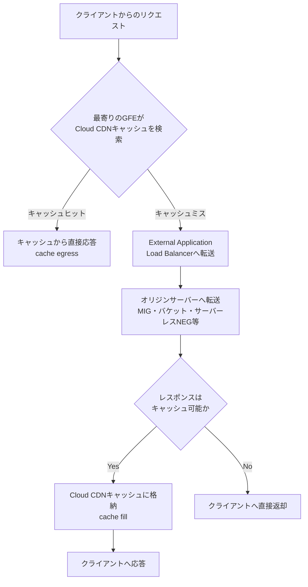

「キャッシュヒット率」は、リクエストされたオブジェクトがキャッシュから配信された割合を示す重要指標です。ヒット率が低い場合は、後述するキャッシュキーの設定やTTL設定を見直します。

キャッシュされたコンテンツは、有効期限切れ（expiration）または削除（eviction）のいずれかが発生するまで配信対象となります。両者は独立した概念です。

- **Expiration（期限切れ）**: レスポンスに設定されたTTL（`max-age`・`s-maxage`・`Expires`）に基づき、鮮度が切れているかどうかを判定します。
- **Eviction（削除）**: キャッシュ容量が満杯になった際、直近でアクセスされていないコンテンツから削除されます。期限切れかどうかに関わらず発生し、複数のGoogle Cloudプロジェクトが同じGFE群のキャッシュ容量を共有するため、人気度は複数プロジェクトを横断して比較されます。30日間アクセスがなければ無条件に削除されます。

> **出典**: [Cloud CDN overview](https://docs.cloud.google.com/cdn/docs/overview)

### 1.2 対応オリジン（バックエンドタイプ）

Cloud CDNは、External Application Load Balancerが対応する以下のバックエンドタイプすべてに対して有効化できます。

| バックエンドタイプ | 概要 |
| --- | --- |
| インスタンスグループ（MIG） | Compute EngineのマネージドインスタンスグループをVMベースのオリジンとして使用 |
| ゾーンNEG（Network Endpoint Group） | ゾーン単位でエンドポイントを指定するバックエンド |
| サーバーレスNEG | Cloud Run、Cloud Run functions（旧Cloud Functions）、App Engineのいずれか1つ以上のサービスをオリジンとして使用 |
| Internet NEG（外部バックエンド） | Google Cloud外部（オンプレミスや他クラウド）のエンドポイントをオリジンとして使用 |
| Cloud Storageバックエンドバケット | Cloud Storageバケットを静的コンテンツのオリジンとして使用 |

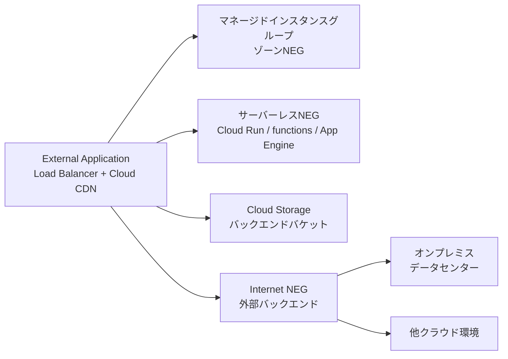

キャッシュヒット・ミスの挙動は、Compute Engine・バックエンドバケット・GKE Ingress・GKE Gatewayを含むすべての対応バックエンドタイプで一貫しています。GKEワークロードに対しては、GKE Ingressコントローラのバックエンド設定、またはGKE Gatewayの`GCPHTTPFilter`カスタムリソースを使ってCloud CDNを構成できます。

> **出典**:
- [Cloud CDN overview](https://docs.cloud.google.com/cdn/docs/overview)
- [External backends specified by using internet NEGs](https://docs.cloud.google.com/cdn/docs/external-backends-internet-neg-overview)

### 1.3 外部バックエンド（Internet NEG）とハイブリッド/マルチクラウド構成

オンプレミスや他クラウドにホストされたコンテンツも、Cloud CDNのグローバルエッジキャッシュ経由で配信できます。この際に使用するのが「Internet NEG」（外部バックエンドを指定するAPIリソース）です。

Internet NEGのエンドポイントタイプは2種類あります。

| エンドポイントアドレス | タイプ | 使いどころ |
| --- | --- | --- |
| ホスト名 + 任意のポート | `INTERNET_FQDN_PORT` | 外部バックエンドをパブリックDNSで解決可能なFQDNで指定する場合のベストプラクティス。IPアドレス変更の影響を受けにくい |
| IPアドレス + 任意のポート | `INTERNET_IP_PORT` | パブリックにアクセス可能なIPアドレスを直接指定する場合 |

Internet NEGの作成後、この2種類のエンドポイントタイプを相互に変更することはできません（新規作成が必要）。また、Cloud CDNは1つのサービスにつき単一の外部バックエンドからのフェッチのみをサポートし、複数の外部バックエンド間でのロードバランシングや、外部バックエンドとGoogle Cloudバックエンドとの間でのロードバランシングは行いません。

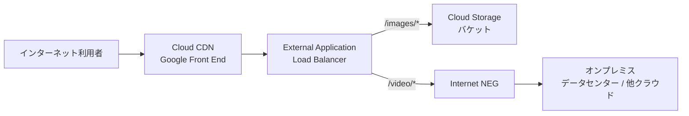

この構成は、段階的なクラウド移行やマルチクラウド戦略において、一部のコンテンツ（例: 画像）はGoogle Cloudへ、他のコンテンツ（例: 動画）はオンプレミスに残したまま、URLマップのパスルール（`/images/*`、`/video/*`など）で振り分けるユースケースに有効です。

外部バックエンドが特定の`Host`ヘッダーを期待する場合は、バックエンドサービス側でカスタムリクエストヘッダーとして`Host`を明示的に設定する必要があります（未設定の場合、クライアントが接続時に使用した`Host`ヘッダーがそのまま引き継がれます）。

> **出典**: [External backends specified by using internet NEGs](https://docs.cloud.google.com/cdn/docs/external-backends-internet-neg-overview)

### 1.4 キャッシュモードとキャッシュ可否の判定

Cloud CDNには3つのキャッシュモードがあり、オリジンからのキャッシュ指示（`Cache-Control`ヘッダー等）をどこまで尊重するかを制御します。

| キャッシュモード | 動作 |
| --- | --- |
| `CACHE_ALL_STATIC`（デフォルト） | 静的コンテンツタイプの成功レスポンスを自動キャッシュ。オリジンが有効なキャッシュ指示を送っていればそれも尊重する。gcloud CLIやREST APIで作成したCloud CDN対応バックエンドのデフォルト動作 |
| `USE_ORIGIN_HEADERS` | オリジンの成功レスポンスに有効なキャッシュ指示・キャッシュヘッダーが含まれていることを必須とする。指示がなければキャッシュせずそのままオリジンから転送 |
| `FORCE_CACHE_ALL` | オリジンが設定したキャッシュ指示を無視し、成功レスポンスを無条件にキャッシュ。動的なHTML・APIレスポンス等、ユーザー固有のコンテンツを扱うバックエンドには非推奨。プライベートバケットアクセスを有効化したバケットでは、このモードが必須になる場合がある |

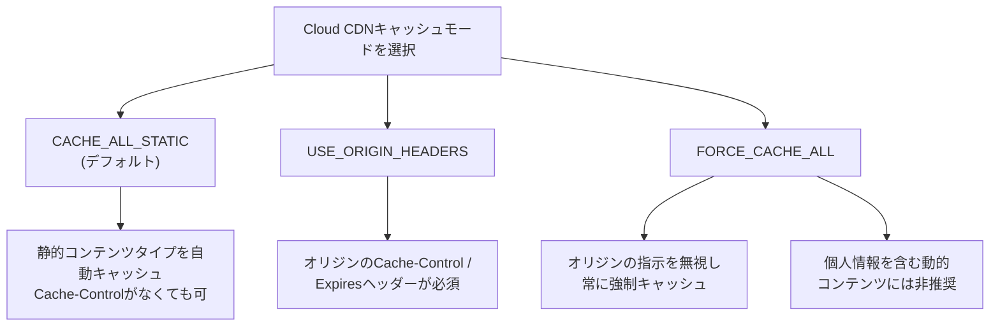

`CACHE_ALL_STATIC`モードでオリジンからのキャッシュ指示がない場合、以下のMIMEタイプが自動的にキャッシュ対象となります。

| カテゴリ | MIMEタイプ |
| --- | --- |
| Webアセット | `text/css`、`text/ecmascript`、`text/javascript`、`application/javascript` |
| フォント | `font/*`に一致するすべて |
| 画像 | `image/*`に一致するすべて |
| 動画 | `video/*`に一致するすべて |
| 音声 | `audio/*`に一致するすべて |
| ドキュメント | `application/pdf`、`application/postscript` |

`text/html`や`application/json`は、動的（ユーザー固有）なレスポンスであることが多いため、デフォルトではキャッシュ対象になりません。これらをキャッシュしたい場合は、オリジン側で明示的な`Cache-Control`ヘッダーを設定する必要があります。

キャッシュ可否のデフォルト値は以下のとおりです。

| パラメータ | デフォルト値 | 説明 |
| --- | --- | --- |
| Cache mode | `CACHE_ALL_STATIC` | 一般的な静的コンテンツタイプを自動キャッシュ |
| Client TTL | `3600秒` | クライアントブラウザキャッシュの`max-age` |
| Default TTL | `3600秒` | オリジンがヘッダーを返さない場合のキャッシュ期間 |
| Include Host | `true` | キャッシュキーにホストを含める |
| Include Protocol | `true` | HTTP/HTTPSを別オブジェクトとしてキャッシュ |
| Include Query String | `true` | クエリ文字列全体をキャッシュキーに含める |
| Max TTL | `86400秒` | キャッシュに残る絶対最大時間（24時間） |
| Negative Caching | `false` | 404などのエラーレスポンスはデフォルトでキャッシュしない |
| Serve While Stale | `86400秒` | オリジンに到達不能な場合、最大24時間古いコンテンツを配信 |

以下のいずれかに該当するレスポンスはキャッシュされません（`FORCE_CACHE_ALL`の一部を除く）。

- `Set-Cookie`ヘッダーを持つ
- 許可されたもの以外の`Vary`ヘッダー値を持つ
- `Cache-Control: no-store`または`private`ディレクティブを持つ
- リクエストに`Authorization`ヘッダーがあり、レスポンス側でオーバーライドされていない
- 最大サイズ（バイトレンジ対応オリジンで100 GiB、非対応オリジンで10 MiB）を超える

> **出典**: [Caching overview](https://docs.cloud.google.com/cdn/docs/caching)

### 1.5 キャッシュキーのカスタマイズ

Cloud CDNのキャッシュキーは、デフォルトでリクエストURIの全体（バックエンドサービスの場合）またはプロトコル・ホストを除いたURI（バックエンドバケットの場合）を使用します。キャッシュヒット率を最適化するため、以下の要素を個別に含める・除外することができます。

| URIパートの調整 | 効果 |
| --- | --- |
| プロトコルを除外 | `http://` と `https://` を同一キャッシュキーとして扱う |
| ホストを除外 | 複数ホスト名（同一コンテンツを配信する複数ドメイン等）を同一キャッシュとして扱う |
| クエリ文字列を除外 | クエリパラメータ違いを同一キャッシュとして扱う |
| クエリ文字列の含め・除外リスト | 特定パラメータのみ含める（include list）、または特定パラメータのみ除外する（exclude list）。両方を同時指定することはできない |
| HTTPリクエストヘッダーの追加 | デバイスタイプ・言語などに応じてバリエーションをキャッシュ（`Authorization`、`Cookie`、`Referer`、`User-Agent`等の高カーディナリティなヘッダーは追加不可） |
| 名前付きCookieの追加（バックエンドサービスのみ） | 最大5つまでのCookie名を指定し、A/Bテストやカナリアリリースなどのバリエーションをキャッシュ |

クエリパラメータの順序はキャッシュキーの一致判定に影響しません（`a=1&b=2`と`b=2&a=1`は同一キーになります）。

Cloud Storageバックエンドバケットに対しては、キャッシュバスティング（更新されたファイルを即座に反映させる仕組み）のためにクエリ文字列のinclude listを使う手法が有効です。たとえば`?version=VERSION`や`?hash=HASH`のようなパラメータをキャッシュキーに含めることで、明示的な無効化なしに新しいバージョンを配信できます。

> **出典**: [Caching overview](https://docs.cloud.google.com/cdn/docs/caching)

### 1.6 キャッシュの無効化（Invalidation）

キャッシュ無効化（cache purging）は、正規の期限切れ前に特定のコンテンツをキャッシュから強制的に削除する操作です。

- パスパターン（例: `/picture*`）またはホスト単位で無効化を指定できます。
- クエリ文字列違いだけで個別のオブジェクトを無効化することはできません（`/images.php?image=fred.png`のようなURLを個別無効化する場合は`/images.php`をパスパターンとして指定する必要があります）。
- キャッシュタグ（`Cache-Tag`レスポンスヘッダーで指定する「サロゲートキー」）を使うと、任意のメタデータ単位で一括無効化できます。1オブジェクトあたり最大50タグ、合計4 KiBまで、1回のリクエストで最大10タグを論理OR条件として指定可能です。
- 無効化リクエストはレート制限されており、1分あたり最大500件、反映には約10秒かかります。

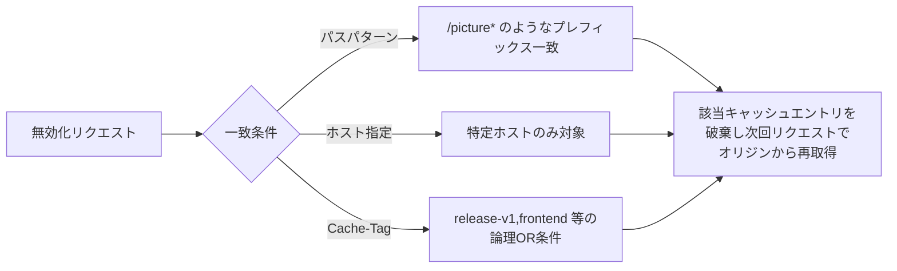

ベストプラクティスとして、無効化は「例外的な状況」（法的理由や誤アップロードの是正など）のためのものであり、通常のデプロイフローの一部として多用すべきではありません。日常的なコンテンツ更新には、TTL設計やバージョン付きURL（`file.css?v=2`のような）を優先します。

Shared VPCのクロスプロジェクトサービス参照を使う構成では、キャッシュ無効化はロードバランサのフロントエンド（転送規則・ターゲットプロキシ・URLマップ）を持つプロジェクト側で行う必要があり、サービスプロジェクト側の管理者はデフォルトでは無効化権限を持ちません。

> **出典**: [Cache invalidation overview](https://docs.cloud.google.com/cdn/docs/cache-invalidation-overview)

### 1.7 コンテンツのアクセス制御（署名付きURL・署名付きCookie）

Cloud CDNは、コンテンツへのアクセスを制御する3つの手段を提供します。

| 手法 | 用途 |
| --- | --- |
| 署名付きURL（Signed URL） | Googleアカウントの有無に関わらず、URLを保持する誰でも一定期間アクセス可能にする。単一または少数のリソースを保護する場合に適する |
| 署名付きCookie（Signed Cookie） | 特定のURLプレフィックス（例: `https://media.example.com/videos/`）配下のすべてのリクエストを、1つのCookieで一定期間認可する。HLS/DASHのようにマニフェスト内の多数のURLを個別に署名するのが非現実的な場合に有効 |
| プライベートオリジン認証 | Amazon S3や互換オブジェクトストアなど、Cloud CDN外の第三者オリジンへの直接アクセスを防ぎ、Cloud CDN経由の接続のみを許可する |

署名付きURL・署名付きCookieはURLマップでは直接設定できず、バックエンドサービスまたはバックエンドバケット単位で設定します。署名付きリクエストを構成したバックエンドでは、Cloud CDNが署名を検証し、期限切れや不正な署名を持つリクエストをHTTP 403で拒否してオリジンへ転送しません。一方、署名パラメータや署名Cookieを持たないリクエストはCloud CDNでは拒否されないため、未署名リクエストを許可するか検証して拒否するかはオリジン側のWebサーバーで実装する必要があります。オリジン側でも署名付きURL・署名付きCookieを独立に検証し、Cloud CDNが署名情報をオリジンへ渡さず同じ署名を検証できない場合は、オリジン認証や非公開化など同等のアクセス制御を適用します。ロードバランサーやCDNをバイパスしてオリジンへ直接到達できる構成、特にCloud Storageなど直接公開可能なオリジンでは、未署名または不正な署名を含むリクエストをオリジン側で検証してHTTP 403で拒否し、Cloud CDNのエッジ検証だけに依存しないようにします。署名済みリクエストと未署名リクエストは別々にキャッシュされるため、オリジンが不正なリクエストにキャッシュ可能なステータスコードを返すと、以降の正当なリクエストが誤って拒否される可能性がある点にも注意します。

> **出典**: [Content access control](https://docs.cloud.google.com/cdn/docs/authenticate-content)

### 1.8 Cloud CDNのベストプラクティス

Google公式のベストプラクティスドキュメントは、キャッシュヒット率・パフォーマンス・セキュリティ・キャッシュ運用・アップロード整合性・監視の6領域に整理されています。

**キャッシュヒット率の最適化**

- オリジンの`Cache-Control`ヘッダーに詳しくない場合は、`CACHE_ALL_STATIC`（デフォルト）のまま静的コンテンツを自動キャッシュさせるのが推奨。
- ユーザー固有のコンテンツはCloud CDNでキャッシュしない。
- キャッシュキーからホストやプロトコルを除外し、不要なキャッシュの分散（シャーディング）を避ける。
- GKE Gatewayを使う場合は、単一のグローバルキャッシュポリシーではなく`GCPHTTPFilter`でパスごとに`cacheKeyPolicy`とTTLをカスタマイズする（例: `/static/*`はクエリ文字列を除外してヒット率を最大化、`/api/*`は特定クエリ文字列を含めて動的応答を正しく区別）。

**パフォーマンスの最適化**

- HTTP/3・QUICプロトコルサポートを有効化する。
- GKE Gatewayでは、Podの再起動・一時的な到達不能に備え`serveWhileStale`を24時間以上に設定し、`requestCoalescing`を有効化してオリジンへの同時キャッシュフィルリクエストを集約する。
- ネガティブキャッシングを活用し、エラーやリダイレクトのレスポンスも適切なTTLでキャッシュしてオリジン負荷を下げる。
- TLS Early Data（0-RTT）を有効化し、再開接続のパフォーマンスを30〜50%改善する。

**セキュリティの最適化**

- Cloud Armorをキャッシュ済みコンテンツ（エッジセキュリティポリシー）とキャッシュミス・動的コンテンツ（バックエンドセキュリティポリシー）の両方に適用する。
- 署名付きURLを使う場合は、パブリック用とプライベート用でCloud Storageバケットを分離する。
- GKE Gateway環境でIAPとCloud CDNを併用する場合、両者は同一ルートで併存できないため、`GCPBackendPolicy`でIAPが有効なパスに`GCPHTTPFilter`のキャッシュ設定を併用しないよう構成する。

**キャッシュの運用**

- コンテンツのカテゴリ（ほぼリアルタイム、頻繁に更新、稀に更新）ごとにTTLを設計する。
- バージョン付きURL（クエリパラメータ、ファイル名、パスへのバージョン番号付与）を、無効化に代わるデフォルトの更新手法として採用する。
- 無効化は最終手段として最小限にとどめる。

**アップロードの整合性**

- 既存ファイルの上書きより、バージョン番号や日付を付けた新規ファイル名でのアップロードを優先する。
- 既存ファイルを更新する場合は、一時的な名前でアップロードしてから目的の名前へリネームすることでアトミック性を担保する。
- バイトレンジキャッシュされたファイルを更新する場合は、無効化リクエストを併用する。

**監視・ロギング**

- すべてのCloud CDN対応バックエンドでロギングを有効化する。
- Cloud CDN用のカスタムモニタリングダッシュボードを定期的に確認する。

> **出典**: [Content delivery best practices](https://docs.cloud.google.com/cdn/docs/best-practices)

---

## Part 2: Cloud DNS

### 2.1 Cloud DNSの基本アーキテクチャとゾーンタイプ

Cloud DNSは低レイテンシかつ高可用なDNSゾーンサービスであり、インターネットに公開される「パブリックゾーン」と、指定したVPCネットワーク内からのみ参照可能な「プライベートゾーン」の両方に対して権威DNSサーバーとして機能します。

Cloud DNSが提供する主なゾーンの種類は以下のとおりです。

| ゾーンタイプ | 概要 |
| --- | --- |
| パブリックゾーン | インターネットに公開される権威ゾーン。ゾーンApexにはNS/SOAレコードが存在し削除不可 |
| プライベートゾーン | 指定したVPCネットワークからのみクエリ可能なゾーン |
| フォワーディングゾーン | プライベートゾーンの一種。レコードを持たず、代わりにフォワーディングターゲット（DNSサーバー）を指定する |
| ピアリングゾーン（DNSピアリング） | 別のVPCネットワーク（DNSプロデューサーネットワーク）のDNS解決結果をそのまま参照するプライベートゾーン |
| マネージドリバースルックアップゾーン | Compute EngineのDNSデータに対してPTRルックアップを行う特殊なプライベートゾーン |
| Service Directoryゾーン | Service Directoryのネームスペースをバックエンドとするプライベートゾーン。レコードは直接追加できず、Service Directory側の登録内容から自動的に導出される |
| ゾーナルCloud DNSゾーン | GKEのクラスタスコープ選択時に作成される、単一のGoogle Cloudゾーンにスコープされたプライベートゾーン |

Cloud DNSはプロジェクトレベル・個別ゾーンレベルの両方でIAM権限を細かく設定できます。

> **出典**: [Cloud DNS overview](https://docs.cloud.google.com/dns/docs/overview)

### 2.2 パブリックゾーンとプライベートゾーン、Split-Horizon DNS

同一のドメイン名でパブリックゾーンとプライベートゾーンの両方を作成すると、クエリの発信元に応じて異なる応答を返す「Split-Horizon DNS」を実現できます。

以下は、`gcp.example.com`というパブリックゾーンとプライベートゾーンを両方作成した場合の例です。

| ゾーン | レコード | タイプ | TTL | データ |
| --- | --- | --- | --- | --- |
| プライベート | `myrecord1.gcp.example.com` | A | 5 | `10.128.1.35` |
| パブリック | `myrecord1.gcp.example.com` | A | 5 | `104.198.6.142` |
| パブリック | `myrecord2.gcp.example.com` | A | 50 | `104.198.7.145` |

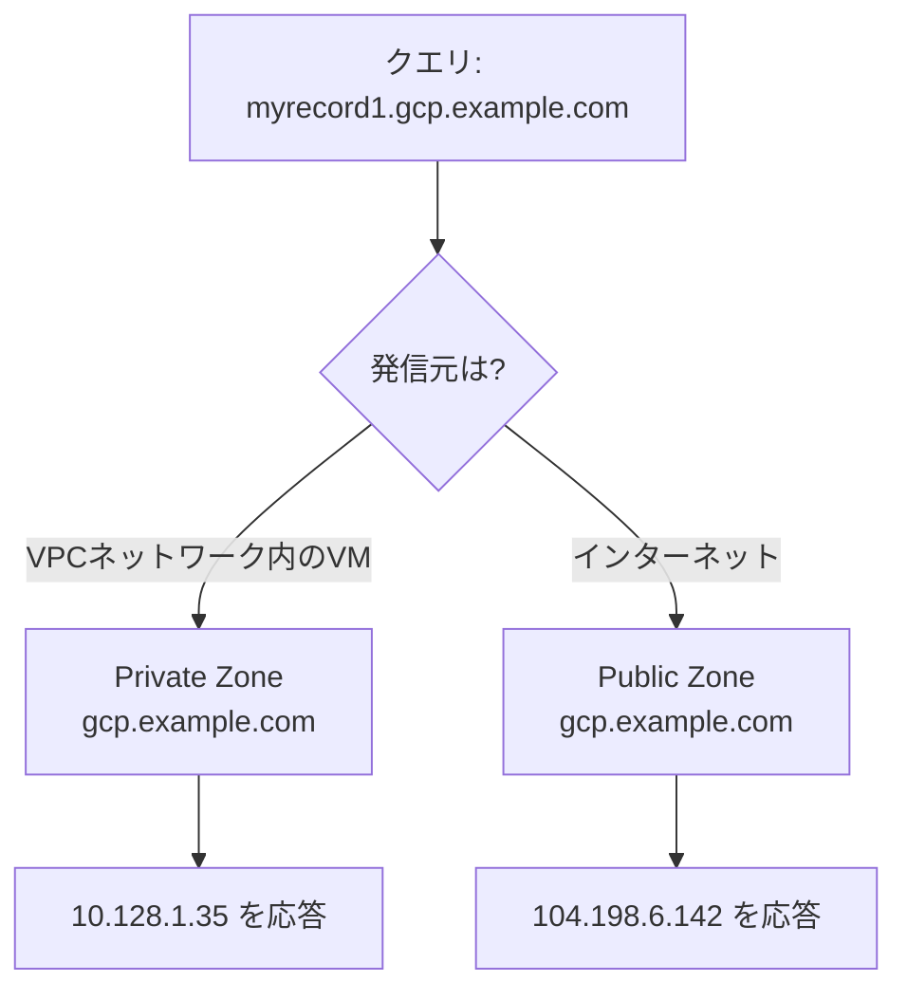

VPCネットワーク内のVMから`myrecord2.gcp.example.com`を問い合わせた場合、プライベートゾーンに該当レコードが存在しないため`NXDOMAIN`が返ります（同名のレコードがパブリックゾーンに存在していても影響しません）。これは、Google Cloudの名前解決が「最長サフィックス一致」で該当ゾーンを特定し、そのゾーン内でレコードが見つからなければ他のゾーンにフォールバックしない、という仕様に基づきます。

2つのゾーンが「オーバーラップ」する条件（片方のオリジンドメインがもう片方のサブドメインである、または完全一致する）についても整理しておきます。

- パブリックゾーン同士のオーバーラップは、同一のCloud DNSネームサーバー上では許可されません。
- プライベートゾーンは任意のパブリックゾーンとオーバーラップ可能です。
- 異なるVPCネットワークにスコープされたプライベートゾーン同士は、オーバーラップしても構いません。
- 同一VPCネットワークに認可された2つのプライベートゾーンは、片方がもう片方のサブドメインでない限り、同一オリジンを持つことはできません。

> **出典**: [DNS zones overview](https://docs.cloud.google.com/dns/docs/zones/zones-overview)

### 2.3 フォワーディングゾーンとピアリングゾーン

**フォワーディングゾーン**は、レコードを保持せず、指定したフォワーディングターゲット（DNSサーバー）へクエリを転送するプライベートゾーンです。フォワーディングターゲットは4種類に分類されます。

| ターゲットタイプ | 定義 | 想定される用途 |
| --- | --- | --- |
| Type 1 | 同一VPCネットワーク内のGoogle Cloud VMまたは内部パススルーNetwork Load Balancerの内部IPアドレス | 同一VPC内のカスタムDNSサーバー |
| Type 2 | Cloud VPNまたはCloud Interconnectで接続されたオンプレミスシステムのIPアドレス | オンプレミスDNSサーバーへの転送 |
| Type 3 | インターネットからアクセス可能な外部IPアドレス | パブリックなDNSサーバーや別VPCのVMの外部IP |
| Type 4 | 標準・非標準の名前解決順序でIPv4/IPv6両方を解決できるFQDN | IPアドレスが変動するターゲットの指定 |

ルーティング方式は「標準ルーティング」（RFC 1918アドレスは認可済みVPC経由、それ以外はインターネット経由）と「プライベートルーティング」（RFC 1918かどうかに関わらず常に認可済みVPC経由。Type 1/2のみサポート）の2種類があります。

重要な制約として、Cloud DNSはフォワーディングターゲットへの推移的ルーティング（transitive routing）をサポートしません。オンプレミスに接続された`vpc-net-a`とピアリングされた`vpc-net-b`から`vpc-net-a`経由でオンプレミスのフォワーディングターゲットへ到達しようとしても失敗します。この場合は、`vpc-net-b`から`vpc-net-a`をターゲットとするピアリングゾーンを作成することで解決します。

**ピアリングゾーン**（DNS Peering）は、別のVPCネットワーク（DNSプロデューサーネットワーク）で解決される内容を、認可されたVPCネットワーク（DNSコンシューマーネットワーク）からそのまま参照できるようにするプライベートゾーンです。DNSピアリングは一方向の関係であり、VPCネットワークピアリングとは全く別の仕組みです（VPCネットワークピアリングを設定しても、DNS情報は自動的には共有されません）。推移的なDNSピアリングは1ホップまでサポートされます（最大3つのVPCネットワークを、中間の1つがホップとなる形でチェーンできます）。

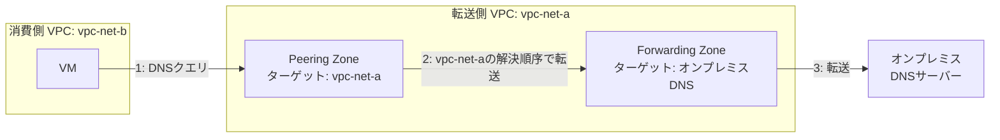

> **出典**: [DNS zones overview](https://docs.cloud.google.com/dns/docs/zones/zones-overview)

### 2.4 DNSルーティングポリシーとヘルスチェック

Cloud DNSは、パブリック・プライベート両方のゾーンのリソースレコードセットに対して3種類のルーティングポリシーを設定でき、トラフィックを特定の条件に応じて誘導できます。フォワーディングゾーン・DNSピアリングゾーン・マネージドリバースルックアップゾーン・Service Directoryゾーンにはルーティングポリシーを設定できません。

| ポリシー | 概要 |
| --- | --- |
| Weighted Round Robin（WRR） | DNS名に対する各レコードセットに異なる重みを割り当て、その比率でトラフィックを分散する。Active-ActiveやActive-Passive構成、本番/実験バージョン間のトラフィック分割などに使用。Geolocationポリシーとの併用は不可 |
| Geolocation | 送信元の地理的位置（Googleリージョン）を特定のDNSターゲットにマッピングする。送信元が完全一致しない場合は最も近いポリシーが適用される |
| Failover | アクティブ/バックアップ構成による高可用性を実現する。アクティブ集合がすべて不健全になった場合にバックアップ集合へ切り替える |

Geolocationポリシーは、Geofence（地理フェンス）を併用することで、そのリージョン内のすべてのエンドポイントが不健全であっても強制的にそのリージョンへトラフィックを固定できます（Geofence無効時は自動的に次に近いリージョンへフェイルオーバーします）。

Failoverポリシーでは、バックアップ集合への切り替え時に「trickle」（徐々にトラフィックを流す）機能を使い、0〜1の割合でバックアップへのトラフィック比率を段階的に検証できます（典型値は0.1）。

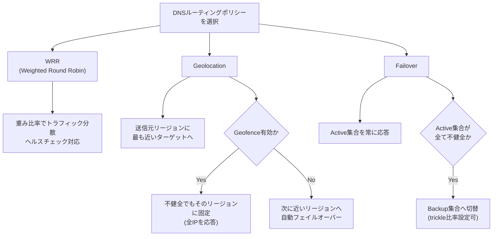

ヘルスチェックは、内部Application Load Balancer（リージョン/クロスリージョン）、内部パススルーNetwork Load Balancer、内部プロキシNetwork Load Balancer（プレビュー）、そして外部エンドポイントに対応します。内部パススルーNetwork Load Balancerの場合、Cloud DNSはバックエンドインスタンス単位のヘルス情報を確認し、デフォルトで20%のインスタンスが健全であればエンドポイント全体を健全と判定します。外部エンドポイントに対するヘルスチェックは、3つのGoogle Cloudソースリージョンからそれぞれ3つのプローバー（合計9プローバー）で実施され、TCP・HTTP・HTTPSプロトコルに対応します（SSL・HTTP/2・gRPCは非対応）。

DNSSECを有効化したマネージドゾーンでヘルスチェックを併用する場合、各ポリシーアイテム内で使用できるIPアドレスは1つのみに制限されます。

ルーティングポリシーがサポートするレコードタイプはA・AAAA・CNAME・MX・SRV・TXTですが、ヘルスチェックが有効なのはA・AAAAレコードのみです。

> **出典**: [DNS routing policies and health checks](https://docs.cloud.google.com/dns/docs/routing-policies-overview)

### 2.5 DNSSEC（DNS Security Extensions）

DNSSECは、DNSルックアップへの応答を認証する仕組みであり、プライバシー保護は提供しませんが、DNS応答の改ざん・ポイズニング攻撃を防止します。DNSSECを完全に機能させるには、以下の3か所すべてで有効化・設定が必要です。

1. **DNSゾーン**: Cloud DNSでDNSSECを有効化すると、DNSKEYレコードの作成・ローテーション、およびRRSIGレコードによるゾーンデータの署名が自動的に管理されます。
2. **トップレベルドメイン（TLD）レジストリ**: ドメインレジストラでDNSSECを有効化し、ゾーン内のDNSKEYレコードを認証するDSレコードをレジストリに登録する必要があります。レジストラ・レジストリの両方がDNSSECに対応していない場合、Cloud DNS側でDNSSECを有効化しても効果がありません。
3. **DNSリゾルバ**: 完全な保護のためには、DNSSEC署名済みドメインの署名を検証するリゾルバを使用する必要があります（Google Public DNSなどの検証対応パブリックリゾルバを利用可能）。

Cloud DNSは、DNSSECが有効化された状態のゾーンを、信頼チェーンを切断することなく他のDNSオペレータとの間で移行（マイグレーション）することもサポートしています。

> **出典**: [DNS Security Extensions (DNSSEC) overview](https://docs.cloud.google.com/dns/docs/dnssec)

### 2.6 DNSサーバーポリシー（Inbound / Outbound）

DNSサーバーポリシーは、VPCネットワーク単位でDNS解決に使用するDNSサーバーを制御する仕組みで、インバウンド・アウトバウンドのいずれか、または両方を同時に構成できます。

**インバウンドサーバーポリシー**は、VPCネットワークのCloud DNS名前解決サービスを、Cloud VPNトンネル・Cloud Interconnect VLANアタッチメント・Router Applianceで接続されたオンプレミスネットワークからも利用可能にします。有効化すると、適用対象VPCネットワーク内のすべてのサブネット（プロキシ専用サブネットやPrivate NAT用サブネットを除く）ごとに、プライマリIPv4範囲から内部IPv4アドレスの「インバウンドサーバーポリシーエントリポイント」が作成されます。

インバウンドサーバーポリシーエントリポイントはVPCネットワークピアリングやNetwork Connectivity Center（NCC）の境界を越えて到達できないため、必ずハイブリッド接続を受け取るVPCネットワーク自体にローカルポリシーとしてデプロイする必要があります（ピアリングされた別ネットワークのレコードを解決したい場合は、そちらにDNSピアリングゾーンを作成します）。

**アウトバウンドサーバーポリシー**は、代替ネームサーバーのリストを指定してVPCネットワークの名前解決順序を変更する仕組みです。代替ネームサーバーが1つでも設定されると、GKEクラスタスコープのレスポンスポリシーやプライベートゾーンにマッチしない限り、すべてのクエリが代替ネームサーバーへ送信されます。多くのCloud DNS機能（プライベートゾーン、ピアリング等）の解決が無効化される点に注意が必要です。

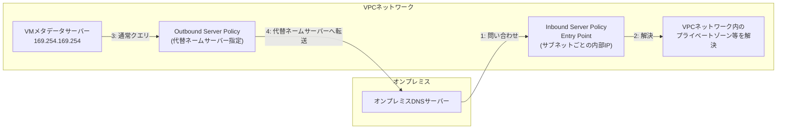

代替ネームサーバーの区分（Type 1〜3）はフォワーディングターゲットと同様に、ルーティング方式・ネットワーク要件が定義されています。とくにType 1・Type 2の場合、Cloud DNSは`35.199.192.0/19`を送信元としてクエリを送るため、オンプレミス側・代替ネームサーバー側の双方で、このレンジからのTCP/UDPポート53を許可するファイアウォールルールが必要です。

> **出典**: [DNS server policies](https://docs.cloud.google.com/dns/docs/server-policies-overview)

### 2.7 クロスプロジェクトバインディング vs DNSピアリング

Shared VPC環境では、DNSネームスペースの所有権をどのプロジェクトに置くかという設計判断が発生します。

| 観点 | DNSピアリングのみの構成 | クロスプロジェクトバインディング |
| --- | --- | --- |
| ゾーンの作成・管理 | 各サービスプロジェクトが独自のVPCネットワークを持ち、そこにゾーンを作成してホストプロジェクトとピアリングする | サービスプロジェクトが直接ゾーンを作成・管理し、Shared VPCネットワークにバインドする |
| プレースホルダーVPCの要否 | 各サービスプロジェクトに個別のVPCネットワークが必要になりがち | 不要（プレースホルダーVPCを用意する必要がない） |
| ホストプロジェクト管理者の負担 | サービスプロジェクトの管理も担うことが多い | サービスプロジェクトの管理はサービスプロジェクト側に委譲できる |
| IAMの適用範囲 | プロジェクトレベルで適用 | 同様にプロジェクトレベルで適用される |
| 推移的な解決のホップ制限 | ピアリングは1ホップまで | すべてのDNSゾーンがShared VPCネットワークに直接紐づくため、ホップ制限がなくHub&Spoke設計が可能 |
| Any-to-Any解決 | 個別設定が必要になりがち | Shared VPCネットワーク内のどのVMからも紐づくゾーンを解決可能 |

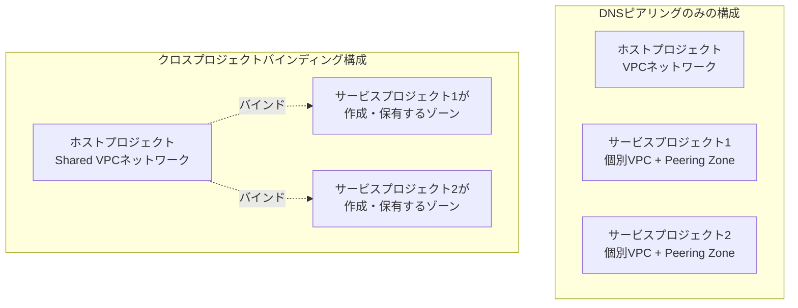

クロスプロジェクトバインディングは、Shared VPCのサービスプロジェクトごとにDNSネームスペースの所有権を分離したい場合（部門やビジネスユニットが異なる組織構造など）に特に有効です。

> **出典**: [DNS zones overview](https://docs.cloud.google.com/dns/docs/zones/zones-overview)

### 2.8 GKEにおけるCloud DNS

GKEクラスタのDNSは、Kubernetesの標準的なService Discoveryの延長として提供されます。デフォルトのDNSプロバイダはkube-dnsですが、Cloud DNSをGKEのDNSプロバイダとして選択することもできます。

| 項目 | kube-dns | Cloud DNS for GKE |
| --- | --- | --- |
| 実装形態 | クラスタ内で稼働するPod（自前でスケーリング・監視が必要） | Googleがフルマネージドで提供する権威DNS |
| 監視・スケーリングの手間 | 必要 | 不要（マネージドサービス） |
| Cloud LoggingとしてのDNS監視統合 | 個別対応が必要 | Cloud Loggingとネイティブに統合 |
| 対応レコード | A/AAAA/SRV/PTR等（PTRはレスポンスポリシールールで実装） | 同様にフルサポート |
| DNSスコープ | クラスタスコープのみ（`*.cluster.local`） | GKEクラスタスコープ、またはVPCスコープ（クラスタ内Serviceの名前をVPC全体から解決可能）を選択可能 |

GKEクラスタでCloud DNSを使う場合でも、クラスタ外部からServiceを名前解決できるようにするには、引き続きLoad Balancerでの公開とDNSインフラへの登録が必要です（Cloud DNSがServiceのClusterIP・ヘッドレス・ExternalNameを自動登録するのは、あくまでクラスタ内部の解決のためです）。

**NodeLocal DNSCache**は、各ノード上でDaemonSetとして動作するDNSキャッシュアドオンで、kube-dns・Cloud DNSいずれの構成でも併用できます。GKE Autopilotクラスタではデフォルトで有効（無効化不可）、GKE Standardクラスタの新しいバージョンではデフォルトで有効（無効化可能）です。PodのDNSリクエストはまずノードローカルのキャッシュに向かい、キャッシュミス時にkube-dnsまたはCloud DNSへフォワードされます。

外部からGKEのService・IngressのDNSレコードを自動的に管理したい場合は、OSSの**external-dns**コントローラを利用するのが一般的なパターンです。external-dnsはクラスタ内のService・Ingressリソースを監視し、対応するレコードをCloud DNSへ自動的に反映します。

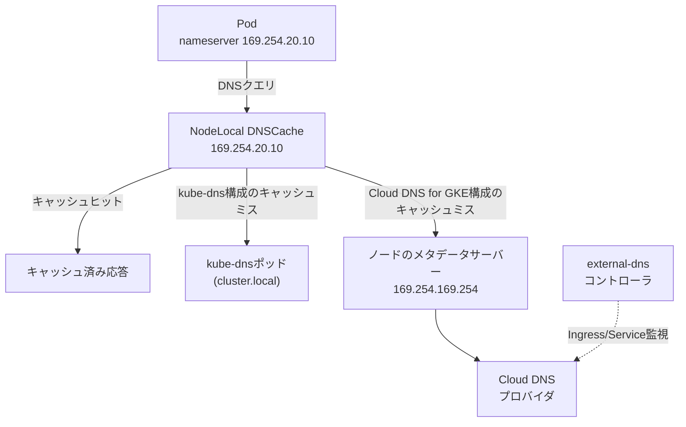

> **出典**:
- [About Cloud DNS for GKE](https://docs.cloud.google.com/kubernetes-engine/docs/concepts/about-cloud-dns)
- [Service discovery and DNS](https://docs.cloud.google.com/kubernetes-engine/docs/concepts/service-discovery)
- [Set up NodeLocal DNSCache](https://docs.cloud.google.com/kubernetes-engine/docs/how-to/nodelocal-dns-cache)

### 2.9 他プロバイダからCloud DNSへの移行

既存のDNSプロバイダからCloud DNSへドメインを移行する場合の標準的な手順は以下のとおりです。

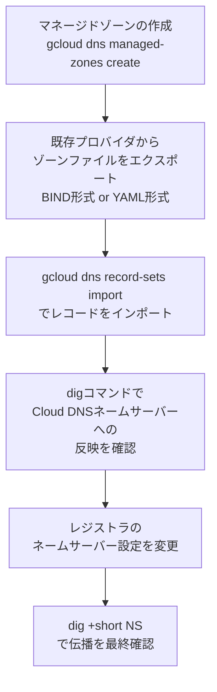

インポート時の注意点として、インポートファイルにゾーンApexのNS・SOAレコードが含まれている場合、Cloud DNSが自動生成するNS・SOAレコードと競合します。既存のCloud DNSレコードを優先する（推奨）場合はインポートファイルからNS・SOAレコードを削除し、権威DNSが他プロバイダとの分割構成（マルチプロバイダ構成）でCloud DNS以外のSOAを使いたい場合は`--delete-all-existing`フラグを使用します。

また、一部のDNS実装は末尾のピリオドなしでBINDゾーンファイルをエクスポートすることがあります。Cloud DNSはRFC標準に従い、末尾ピリオドのないドメイン名をゾーンの相対名として解釈するため、インポート前に確認が必要です。

Google Cloudは、複数のDNSプロバイダを併用してDNS基盤の可用性・冗長性を高める「マルチプロバイダDNS」構成も、OSSの`octoDNS`をベースに公式にサポートしています。この構成ではCloud DNSをActive-Active（推奨）またはActive-Passiveの一方として使い、レジストラ側のNSレコードに複数プロバイダのネームサーバーを含めます。

> **出典**:
- [Migrate to Cloud DNS](https://docs.cloud.google.com/dns/docs/migrating)
- [Best practices for Cloud DNS](https://docs.cloud.google.com/dns/docs/best-practices)

### 2.10 ハイブリッドDNSのリファレンスアーキテクチャとベストプラクティス

オンプレミスとGoogle Cloudが混在するハイブリッド環境では、以下の3つのDNS解決方式のいずれかを選択できますが、Googleは「2つの権威DNSシステムを使うハイブリッドアプローチ」を推奨しています。

| アプローチ | 概要 | 主なトレードオフ |
| --- | --- | --- |
| ハイブリッド（2つの権威DNS、推奨） | Cloud DNSがGoogle Cloud側を、既存のオンプレミスDNSサーバーがオンプレミス側を、それぞれ権威的に解決する | 双方向フォワーディングの設定が必要になるが、レイテンシと運用の分離のバランスが良い |
| オンプレミスに解決を集約 | オンプレミスDNSサーバーを唯一の権威とし、Google Cloudからは代替ネームサーバーで全クエリを転送 | 既存ツール・拒否リストを流用できるが、Google Cloudからのクエリレイテンシが増加し、オートスケールとの相性が悪化しうる |
| Cloud DNSに解決を集約 | Cloud DNSを唯一の権威とし、インバウンドフォワーディングでオンプレミスからの問い合わせに対応 | オンプレミス側の高可用DNSサーバー維持が不要になるが、オンプレミスからのクエリレイテンシが増加する |

命名規則としては、オンプレミスとGoogle Cloudで別々のサブドメイン（例: `corp.example.com`と`gcp.example.com`）を使う構成が推奨パターンです。同一ドメインを両者で共有する構成は、単一の権威DNSシステムでしか運用できず、ハイブリッド環境の管理を複雑にするため避けるべきとされています。

代表的なリファレンスアーキテクチャの1つとして、ハブ&スポークVPC構成（VPCネットワークピアリングでハブとスポークを接続し、ハブがオンプレミスとの接続を集約する構成）を見てみます。

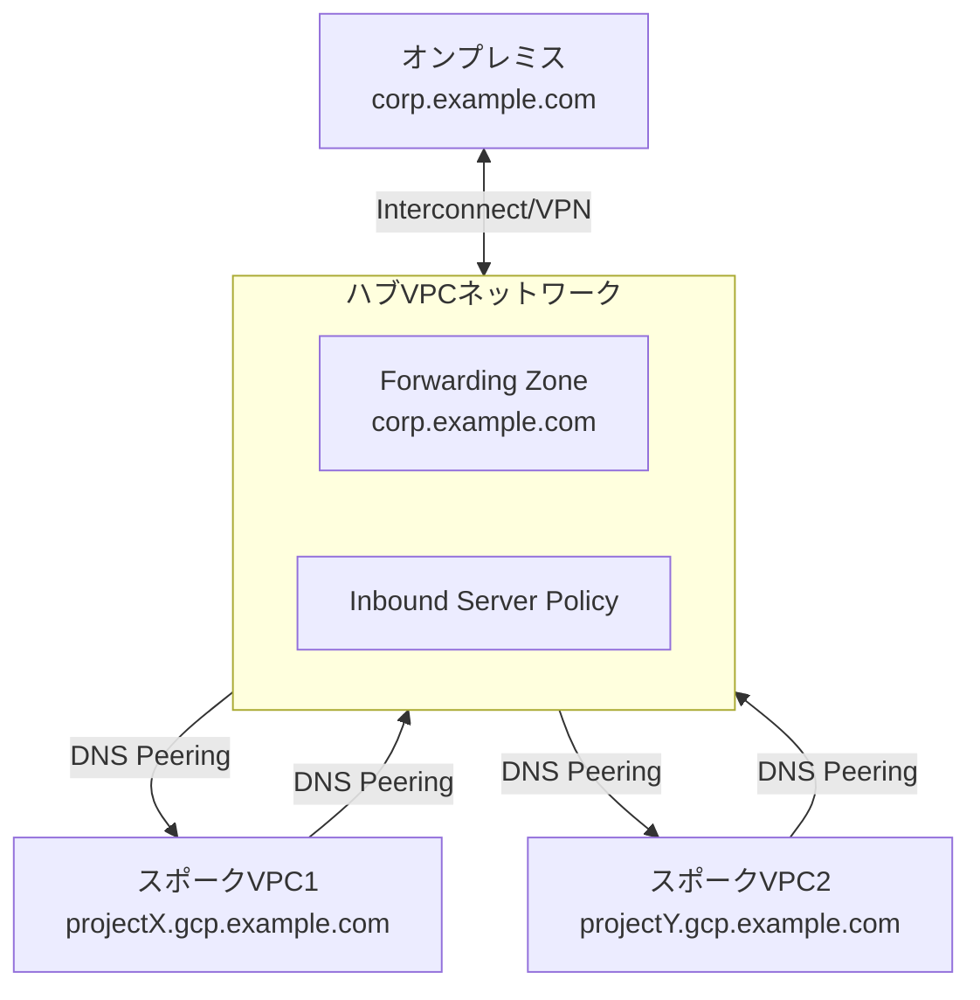

この構成のポイントは次のとおりです。

1. 各スポークVPCが自身のプライベートゾーン（例: `projectX.gcp.example.com`）を保有する。
2. ハブVPCのホストプロジェクトでインバウンドサーバーポリシーを有効化する。
3. ハブVPC内に`corp.example.com`用のフォワーディングゾーンを作成し、オンプレミスDNSサーバーへアウトバウンド転送する。
4. ハブVPCから各スポークVPCへ、それぞれの`projectX.gcp.example.com`をターゲットとするDNSピアリングゾーンを作成する。
5. 各スポークVPCからハブVPCへ、`example.com`（オンプレミス側）をターゲットとするDNSピアリングゾーンを作成する。
6. オンプレミスDNS側で`gcp.example.com`をハブVPCのインバウンドフォワーダーIPアドレスへ転送するよう設定する。

ベストプラクティスとして特に押さえておくべき点は以下のとおりです。

- 複数のVPCネットワークが同じオンプレミスDNSサーバーへアウトバウンド転送する構成は、DNSピアリングを使わずに個別設定すると失敗します（すべてのクエリの送信元が`35.199.192.0/19`という共通レンジになるため、応答を正しくルーティングできません）。1つのVPCネットワークにアウトバウンド転送を集約し、他のVPCネットワークはそこへDNSピアリングする設計が推奨されます。
- VPCネットワークピアリングとDNSピアリングは別物であり、片方を設定しても他方は自動的には有効になりません。
- 自動生成される`.internal`ゾーン（VMの内部DNS名）をオンプレミスから解決したい場合は、それらをハブプロジェクトにピアリングして集約するパターンが有効です。
- オンプレミス・Google Cloud双方のファイアウォールで、`35.199.192.0/19`からのDNSトラフィック（TCP/UDPポート53）を許可する。

> **出典**: [Best practices for Cloud DNS](https://docs.cloud.google.com/dns/docs/best-practices)

---

## Part 3: IPアドレス管理（IPAM）

### 3.1 IPアドレスの分類体系

Google CloudのIPアドレスは、複数の軸で分類されます。まずは全体像を整理します。

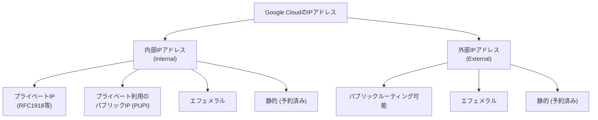

| 分類軸 | 区分 | 説明 |
| --- | --- | --- |
| 到達性 | 内部（Internal） | インターネットから到達不可。VPCネットワーク・ピアリング済みネットワーク・オンプレミス接続内でのみ有効 |
| 到達性 | 外部（External） | インターネットに公開されるパブリックルーティング可能なアドレス |
| ルーティング可否 | プライベート | インターネット上でルーティングされないアドレス空間（内部アドレスとしてのみ使用可能） |
| ルーティング可否 | パブリック | インターネットルーティング可能なアドレス空間。外部IPは常にパブリックIPだが、サブネットのプライマリ/セカンダリ範囲としてパブリックIPを内部的に使う場合は「PUPI（プライベート利用のパブリックIP）」と呼ぶ |
| スコープ | リージョナル | 特定リージョンのリソースに紐づく |
| スコープ | グローバル | PSC Google APIエンドポイントやPrivate Services Accessの割当レンジなど、リージョンに依存しない |
| ライフサイクル | エフェメラル | リソースのライフサイクルに紐づき、リソース削除・停止時に解放される |
| ライフサイクル | 静的（予約済み） | 明示的に解放するまでプロジェクトに割り当てられ続ける |

Cloud NATの自動IPアドレス割当は、静的アドレスとして表示されますが、Cloud NATゲートウェイの削除や手動アドレスへの切り替え時には削除される点、HA VPNのインターフェースには静的IPを手動指定できず、ゲートウェイ作成時に自動生成される2つの外部IPが削除まで割り当てられ続ける点など、いくつかの例外があります。

> **出典**: [IP addresses](https://docs.cloud.google.com/vpc/docs/ip-addresses)

### 3.2 サブネットのIPv4アドレス範囲設計

サブネットのIPv4範囲設計は、IPAM戦略の中核です。まず、有効な内部IPv4範囲を整理します。

| カテゴリ | 範囲 | 説明 |
| --- | --- | --- |
| プライベートIPv4アドレス | `10.0.0.0/8`、`172.16.0.0/12`、`192.168.0.0/16` | RFC 1918 |
| プライベートIPv4アドレス | `100.64.0.0/10` | RFC 6598（共有アドレス空間） |
| プライベートIPv4アドレス | `192.0.0.0/24` | RFC 6890（IETFプロトコル割当） |
| プライベートIPv4アドレス | `192.0.2.0/24`、`198.51.100.0/24`、`203.0.113.0/24` | RFC 5737（ドキュメント用） |
| プライベートIPv4アドレス | `192.88.99.0/24` | RFC 7526（IPv6toIPv4リレー、非推奨） |
| プライベートIPv4アドレス | `198.18.0.0/15` | RFC 2544（ベンチマークテスト） |
| プライベートIPv4アドレス | `240.0.0.0/4` | Class E（将来利用のための予約） |
| プライベート利用のパブリックIPv4アドレス（PUPI） | 上記以外の任意のパブリックIPv4（禁止範囲を除く） | 通常はインターネットルーティング可能だが、VPCネットワーク内で私的に使用。Googleはこれらをインターネットへ広告せず、インターネットからのトラフィックもルーティングしない |

サブネット範囲には以下のような制約もあります。

- 最小のプライマリ・セカンダリ範囲サイズは8アドレス（`/29`）。
- 使用できる最大の範囲は`/4`ですが、多くの制約により実質的には`/8`程度に収めることが推奨されます。
- サブネット範囲は複数のRFC範囲にまたがることはできません（例: `192.0.0.0/8`は`192.168.0.0/16`と`192.0.0.0/24`の両方を含むため無効）。
- サブネット範囲は「制限範囲」と一致・より狭い・より広いいずれの形でも重ならないようにする必要があります（例: `169.0.0.0/8`はリンクローカル範囲`169.254.0.0/16`と重複するため無効）。
- Auto ModeのVPCネットワークが使用する`10.128.0.0/9`ブロックの一部は、カスタムサブネットの範囲として使わないことが推奨されます（この範囲を使うと、Auto ModeネットワークとのVPCネットワークピアリングやCloud VPN接続ができなくなります）。
- ゲスト OS内で`172.17.0.0/16`（Dockerのデフォルトブリッジネットワーク等）を使うソフトウェアに依存している場合、このレンジをサブネット範囲として使わないようにします。

サブネットのプライマリIPv4範囲の中で、最初の2つと最後の2つのアドレスは予約されており使用できません（セカンダリ範囲はすべて使用可能です）。

| 予約アドレス | 説明 |
| --- | --- |
| ネットワークアドレス | プライマリ範囲の最初のアドレス |
| デフォルトゲートウェイアドレス | プライマリ範囲の2番目のアドレス |
| Second-to-lastアドレス | プライマリ範囲の最後から2番目（将来利用のための予約） |
| ブロードキャストアドレス | プライマリ範囲の最後のアドレス |

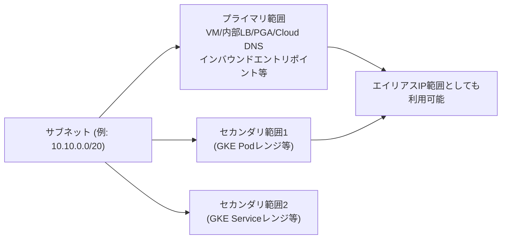

サブネットには「目的（purpose）」があり、通常のVM用サブネット（`PRIVATE`）以外にも、Private Service Connect公開用（`PRIVATE_SERVICE_CONNECT`）、プロキシ専用（`GLOBAL_MANAGED_PROXY`/`REGIONAL_MANAGED_PROXY`）、Private NAT専用（`PRIVATE_NAT`）、Shared VPCサービスをPrivate Service Connectへ移行するための`PEER_MIGRATION`など複数の種類があり、多くの場合作成後に目的を変更することはできません。

> **出典**: [Subnets](https://docs.cloud.google.com/vpc/docs/subnets)

### 3.3 IPv6サポート

VPCネットワークのサブネットは、IPv4専用・デュアルスタック・IPv6専用の3種類のスタックタイプをサポートします。IPv6範囲を持つサブネットはカスタムモードのVPCネットワークでのみサポートされ、Auto Modeネットワークやレガシーネットワークでは非対応です。

IPv6アドレスは、以下のようにVPCネットワーク→サブネット→VMインターフェースの階層でCIDRが割り当てられます。

| リソース | 範囲サイズ | 説明 |
| --- | --- | --- |
| VPCネットワーク | `/48` | 内部ULA範囲を有効化した際に、`fd20::/20`内から割り当てられるユニークローカルアドレス範囲 |
| サブネット | `/64` | 内部ならVPCの`/48`範囲から、外部ならGoogleが提供するリージョナル外部IPv6アドレスから割り当て |
| VMインターフェース | `/96` | サブネットの`/64`範囲から割り当て。外部IPv6の場合、サブネットの`/64`の前半`/65`がVMインターフェース用、後半`/65`がCloud Load Balancing用に予約されている |

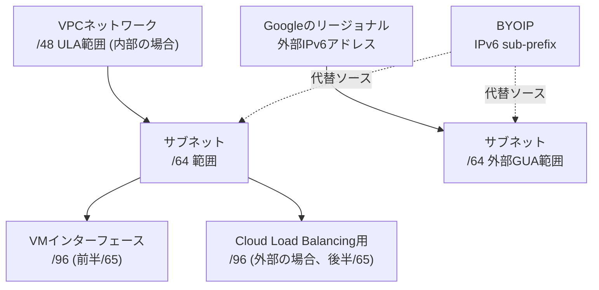

内部IPv6アドレスはUnique Local Address（ULA、RFC 4193）であり、インターネットに公開されずVM間通信のみに使用されます。外部IPv6アドレスはGlobal Unicast Address（GUA）であり、Premium Tierでのみ利用可能です。VPCネットワークの`/48`ULA範囲は、Google Cloud全体で一意である必要があり（VPCネットワークピアリング時のIPv6アドレス重複を防ぐため）、自動割当か任意の`/48`範囲の指定かを選択できます。一度割り当てた`/48`ULA範囲は変更・削除できません。

BYOIPを使う場合は、GUAをプライベートに（ULAと同様の役割で）内部IPv6サブネット範囲として使うことも、通常どおり外部IPv6範囲として使うことも可能です。

サブネットの内部`/64`範囲のうち、最初と最後の`/96`範囲はシステム用に予約されており、手動で割り当てることはできません。

> **出典**: [Subnets](https://docs.cloud.google.com/vpc/docs/subnets)

### 3.4 内部レンジ（Internal Ranges）によるIPAM自動化

「内部レンジ（Internal Range）」は、VPCネットワーク内の内部IPv4/IPv6 CIDRブロックを予約し、その使われ方を制御するリソースです。VPCネットワークピアリング・Shared VPC・Cloud VPN・Cloud Interconnectなどでネットワークトポロジが複雑化した際に、IPAMを体系的に管理するための土台となります。

内部レンジには「ピアリングタイプ」と「使用タイプ」という2つの重要な属性があります。

**ピアリングタイプ**（VPCネットワークピアリングに対する挙動）

| ピアリングタイプ | 説明 |
| --- | --- |
| `FOR_SELF` | 親VPCネットワークのみがこのCIDRブロックを使用可能。ピアリング先では使用不可 |
| `FOR_PEER` | ピアリング先のネットワークのみが使用可能。親ネットワークでは使用不可 |
| `NOT_SHARED` | 親ネットワーク・ピアリング先の両方が使用可能。ただしピアリング先での使用は親ネットワークから見えない形で行う必要がある |

**使用タイプ**（親VPCネットワーク内の他リソースとの関連付け可否）

| 使用タイプ | 説明 |
| --- | --- |
| `FOR_VPC`（デフォルト） | 親VPCネットワーク内の他のGoogle Cloudリソースと関連付け可能 |
| `EXTERNAL_TO_VPC` | 親VPCネットワーク内のリソースとは関連付け不可（オンプレミス専用の予約など） |
| `FOR_MIGRATION` | サブネット範囲の移行（別ネットワークへの移行を含む）に使用 |

IPv4の内部レンジを自動割当する場合、以下の4種類の割当戦略から選択できます。

| 戦略 | 説明 | 特徴 |
| --- | --- | --- |
| `RANDOM`（デフォルト） | 空いているCIDRブロックをランダムに割当 | 同時並行での予約が最速だが、断片化しやすい |
| `FIRST_AVAILABLE` | 数値的に最も若い開始アドレスを持つブロックを割当 | 最も予測可能で連続空間を最大化するが、同時予約時の競合で遅くなりやすい |
| `RANDOM_FIRST_N_AVAILABLE` | 若い順にN個の候補ブロックを集め、その中からランダムに1つを割当 | 競合を減らしつつ連続性もある程度確保できる |
| `FIRST_SMALLEST_FITTING` | 要求サイズを収容できる最小の空きブロック（最長プレフィックス）から、最も若いアドレスのブロックを割当 | 断片化の抑制に最も優れるが、競合による遅延が最大 |

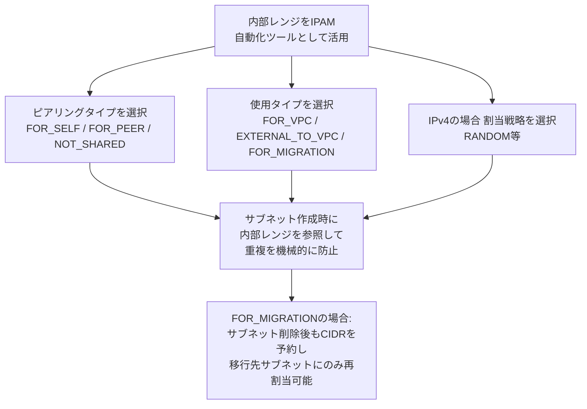

サブネット移行のユースケース（`FOR_MIGRATION`）では、サブネットを削除するとCIDR範囲は通常解放されますが、内部レンジで予約しておくことで、削除後・再作成前の間もそのCIDRを保持し、指定した移行先サブネットにのみ割当を許可できます。移行元・移行先が異なるプロジェクトであっても利用可能です。

> **出典**: [Internal ranges overview](https://docs.cloud.google.com/vpc/docs/internal-ranges)

### 3.5 BYOIP（Bring Your Own IP）

BYOIPは、組織が自ら保有する（または利用権を持つ）パブリックIPv4/IPv6アドレスをGoogle Cloudへ持ち込み、Google Cloudのリソースに割り当てる機能です。インポート後は、いくつかの例外を除きGoogle提供のIPアドレスと同様に管理されます。BYOIPで持ち込んだアドレスは、それを持ち込んだ顧客のみが利用可能で、アイドル状態・使用中のいずれであっても追加課金は発生しません。

BYOIPのプロビジョニングは以下の階層で進みます。

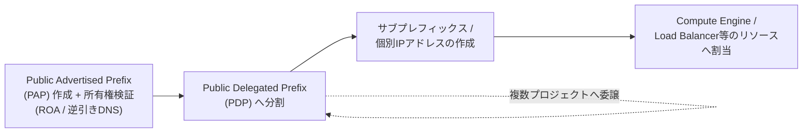

1. **Public Advertised Prefix（PAP）**: 持ち込むIPプレフィックス全体を表すリソース。Route Origin Authorization（ROA）や逆引きDNSによる所有権検証が必要です。
2. **Public Delegated Prefix（PDP）**: PAPを分割し、特定のリージョンやプロジェクトに委譲するためのサブプレフィックス。
3. **サブプレフィックス・個別IPアドレスの作成**: PDPからさらに細かい単位（個々のIPアドレスやより小さなCIDR）を切り出し、実際のリソースに割り当てます。

重要な注意点として、Googleは重複するBYOIPのルート広告をサポートしません。たとえば`203.0.112.0/23`をインポートしようとしても、その全体または一部（`203.0.112.0/24`など）がGoogle以外の場所で既に広告されている場合はインポートできません。同一プレフィックスが複数の場所から異なる形で広告されると、予期しないルーティングやパケットロスが発生する可能性があります。

組織設計としては、BYOIPアドレスの管理を専用の組織・専用プロジェクトに集約し、IAMロールでPAP・PDPの管理権限を明確に分離することが推奨されます。BYOIPアドレスはShared VPCのホストプロジェクトには委譲できますが、サービスプロジェクトへ直接委譲することはできません（ホストプロジェクトに委譲されたアドレスは、サービスプロジェクトからも利用可能です）。

BYOIPのプロビジョニング・削除プロセスには数週間かかることがあるため、実際に必要となるタイミングのかなり前から計画しておくことが重要です。

> **出典**:
- [Bring your own IP addresses](https://docs.cloud.google.com/vpc/docs/bring-your-own-ip)
- [Planning for bring your own IP addresses](https://docs.cloud.google.com/vpc/docs/byoip-planning)
- [Create a public advertised prefix](https://docs.cloud.google.com/vpc/docs/create-pap)

### 3.6 マネージドサービスへの接続とIPアドレス割当（PSA・PSC・Serverless VPC Access）

マネージドサービスへプライベートに接続する主要な3つの方式は、それぞれ異なるIPアドレス割当の考え方を持ちます。

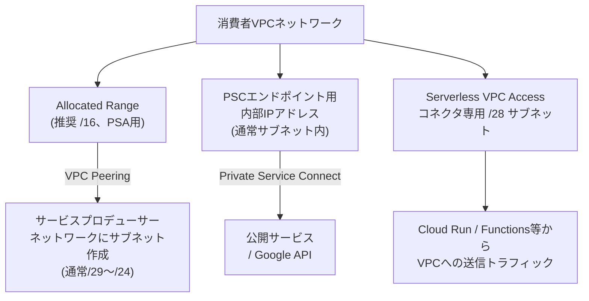

**Private Services Access**（PSA）は、サービスコンシューマーのVPCネットワークとサービスプロデューサーのVPCネットワークをVPCネットワークピアリングで接続する仕組みです。ルーティングの重複を避けるため、コンシューマー側に「Allocated Range」を確保する必要があります。

- Googleのサービス向けには最小`/24`、推奨`/16`ブロックが必要です。
- Allocated Rangeは、現在・将来のサブネット範囲（VPCネットワークピアリングやNCCスポークで接続されたネットワークのサブネット範囲を含む）と完全に分離しておく必要があります。
- サービスプロデューサー側は通常、このAllocated Rangeの中から`/29`〜`/24`程度のサブネットを選んでリソースを配置します。プロデューサー側のサブネット範囲自体は選択・変更できません。

**Private Service Connect**（PSC）のエンドポイントは、通常のサブネット内の内部IPアドレスとして構成されます（公開サービス用の場合は`PRIVATE_SERVICE_CONNECT`目的のサブネットを使用）。PSAとは異なりVPCネットワークピアリングを必要とせず、1つの内部IPアドレスで公開サービスやGoogle APIへ到達できる点が特徴です。

**Serverless VPC Access**は、Cloud Run・Cloud Run functions・App EngineなどのサーバーレスワークロードからVPCネットワークへ送信トラフィックを送るためのコネクタです。コネクタには専用の`/28`サブネット（16アドレス）が必要で、他のリソースと共用できず、作成後にサイズを変更することもできません。Shared VPCを使う場合、サービスプロジェクト側でコネクタを作成するには、ホストプロジェクトのネットワーク管理者が事前にそのサブネットを手動作成しておく必要があります。

> **出典**:
- [Private services access](https://docs.cloud.google.com/vpc/docs/private-services-access)
- [Configure private services access](https://docs.cloud.google.com/vpc/docs/configure-private-services-access)
- [Connect to a VPC network (Serverless VPC Access)](https://docs.cloud.google.com/vpc/docs/configure-serverless-vpc-access)

### 3.7 Cloud NATにおけるIPアドレスとポートの管理

Cloud NATは、Public NAT（インターネットへのアウトバウンド接続）とPrivate NAT（VPC間・オンプレミス間などプライベート接続向けのアウトバウンド接続）の2種類を提供し、それぞれIPアドレスとポートの管理方法が異なります。

**Public NATのIPアドレス割当**

| 割当方法 | 特徴 |
| --- | --- |
| 自動NAT IPアドレス割当 | 選択したネットワークサービスティア（Premium/Standard）、VM数、VMあたりのポート予約数に基づき、Googleがリージョナル外部IPアドレスを自動的に追加・削除する。追加されたアドレスは静的（予約済み）として扱われるがプロジェクトのクォータには計上されない。次にどのIPアドレスが割り当てられるかは予測できないため、許可リストのように事前に把握しておく必要がある用途には不向き |
| 手動NAT IPアドレス割当 | 静的外部IPアドレスを自身で作成し手動でゲートウェイに割り当てる。許可リストとの相性が良く、IPアドレスの「ドレイン（drain）」機能（新規接続には使わず、既存接続の正常終了のみ許可）を利用できる |

**Private NATのIPアドレス割当**

Private NATのIPアドレスは、`purpose=PRIVATE_NAT`のサブネットのプライマリIPv4範囲から供給される、リージョナル内部IPv4アドレスです。この範囲は自動割当ができず、ゲートウェイのルール作成時に明示的にサブネットを指定します。1つのPrivate NATサブネットが提供できるNAT IPアドレス数は、サブネットのプレフィックス長`PREFIX_LENGTH`を使って次の式で求められます。

```
利用可能なNAT IPアドレス数 = 2^(32 - PREFIX_LENGTH) - 4
```

（各サブネットには4つの未使用アドレスが存在するため4を減算します）

**ポート割当方式**

| 方式 | Public NATのデフォルト | Private NATのデフォルト | 特徴 |
| --- | --- | --- | --- |
| 静的ポート割当 | ○（デフォルト） | 選択可 | VMごとに固定のポート数を割り当てる。全VMのエグレス使用量が均一な場合に適する。Endpoint-Independent Mappingを使う場合は静的ポート割当が必須 |
| 動的ポート割当 | 選択可 | ○（デフォルト） | 最小・最大ポート数を指定し、使用状況に応じて自動的に増減させる。ポート使用量にばらつきがある場合に有効 |

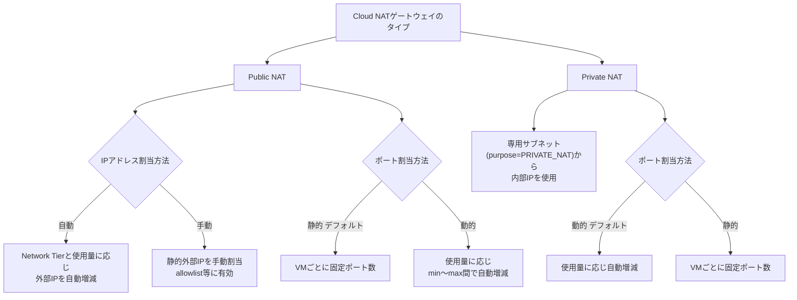

各NAT IPアドレスは、TCP・UDPそれぞれ64,512個のソースポート（0〜1023のウェルノウンポートを除く）を提供します。ポート予約の計算例として、Public NATで単一の手動NAT IPアドレスを使い、VMあたり最小64ポートを設定した場合、以下のように最大1,008台のVMをサポートできます。

```
⌊(1 NAT IPアドレス) × (64,512ポート/アドレス) / (64ポート/VM)⌋ = 1,008台
```

Private NATの場合、信頼性確保のためVMあたりの必要ポート数の「2倍」が割り当てられる点に注意が必要です。たとえば最小サイズの`/29`サブネット（8アドレス、うち4つが利用可能）でVMあたり最小64ポートを設定した場合は次のようになります。

```
⌊(2^(32-29) - 4) NAT IPアドレス × (64,512ポート/アドレス) / (64ポート/VM × 2)⌋ = 2,016台
```

IPアドレス・ポート割当のマッピングは時間とともに変化する可能性があるため、現在のマッピングを前提にネットワーク設定を構築すべきではない、という点も試験対策上のポイントです。

> **出典**: [IP addresses and ports (Cloud NAT)](https://docs.cloud.google.com/nat/docs/ports-and-addresses)

### 3.8 IPAM設計チェックリスト

- [ ] オンプレミス・マルチクラウド・Google Cloudの各環境で、重複しないRFC 1918アドレス空間を設計している
- [ ] RFC 1918アドレス空間が枯渇する、または断片化している場合の代替（非RFC1918範囲、PUPI、IPv6）を検討している
- [ ] Auto ModeネットワークのCIDR（`10.128.0.0/9`）や、ゲストOS内で使用中のレンジ（`172.17.0.0/16`等）との重複を避けている
- [ ] GKE用にPod範囲・Service範囲を含むセカンダリ範囲を十分な余裕を持って設計している
- [ ] 内部レンジ（Internal Ranges）を使って、サブネット作成前のIPAM予約とバッティング防止を自動化している
- [ ] Private Services Access用のAllocated Range（推奨/16）を、将来のサブネット拡張分も見込んで確保している
- [ ] Serverless VPC Access用に、各コネクタ専用の`/28`サブネットを確保している（拡張不可であることを踏まえたサイジング）
- [ ] IPv6導入時、VPCネットワークの`/48`ULA範囲、サブネットの`/64`範囲、VMの`/96`範囲という階層を理解し、外部/内部の使い分けを設計している
- [ ] BYOIPを使う場合、PAP/PDP/サブプレフィックスの委譲構造と、プロビジョニングに数週間かかることを踏まえたスケジュールを組んでいる
- [ ] Cloud NATについて、Public NAT（自動/手動IP割当、静的/動的ポート割当）とPrivate NAT（専用サブネットからの内部IP、デフォルト動的ポート割当）の違いを理解し、必要なVM数・ポート数から適切なIPアドレス数を逆算している
- [ ] IPアドレス・ポートのマッピングが時間とともに変化しうることを前提に、固定マッピングに依存したネットワーク設計（許可リスト等）を避けている、またはドレイン機能を活用した安全な運用を組んでいる

---

## 試験対策チェックリスト（横断）

- [ ] Cloud CDNが単体では機能せず、必ずExternal Application Load Balancerと組み合わせる点を説明できる
- [ ] Cloud CDNの5つの対応バックエンドタイプ（MIG・ゾーンNEG・サーバーレスNEG・Internet NEG・Cloud Storageバケット）と、それぞれの用途を区別できる
- [ ] 3つのキャッシュモード（`CACHE_ALL_STATIC`・`USE_ORIGIN_HEADERS`・`FORCE_CACHE_ALL`）の違いと、`FORCE_CACHE_ALL`のリスクを説明できる
- [ ] キャッシュキーのカスタマイズ（プロトコル/ホスト/クエリ文字列/ヘッダー/Cookie）がキャッシュヒット率に与える影響を理解している
- [ ] キャッシュ無効化とキャッシュタグの違い、無効化のレート制限、無効化を最終手段とすべき理由を説明できる
- [ ] 署名付きURLと署名付きCookieの使い分け（単一リソース vs URLプレフィックス配下の複数リソース）を説明できる
- [ ] Cloud DNSのゾーンタイプ（パブリック・プライベート・フォワーディング・ピアリング・マネージドリバースルックアップ・Service Directory・ゾーナル）を区別できる
- [ ] Split-Horizon DNSの仕組みと、最長サフィックス一致による名前解決順序を説明できる
- [ ] DNSルーティングポリシー（WRR・Geolocation・Failover）とヘルスチェック対応の対象（内部LB・外部エンドポイント）を説明できる
- [ ] DNSSECを機能させるために必要な3か所（ゾーン・レジストリ・リゾルバ）の設定を説明できる
- [ ] インバウンド/アウトバウンドサーバーポリシーとフォワーディングゾーンの違い、代替ネームサーバー使用時の副作用を説明できる
- [ ] クロスプロジェクトバインディングとDNSピアリングの違い（ホップ制限、所有権分離）を説明できる
- [ ] GKEにおけるkube-dnsとCloud DNS for GKEの違い、NodeLocal DNSCacheとexternal-dnsの役割を説明できる
- [ ] IPアドレスの分類（内部/外部、プライベート/パブリック/PUPI、リージョナル/グローバル、エフェメラル/静的）を体系的に説明できる
- [ ] サブネットのプライマリ・セカンダリ範囲、有効なCIDR範囲、予約済みアドレス（先頭2つ・末尾2つ）を説明できる
- [ ] IPv6のVPC（/48）→サブネット（/64）→VM（/96）という階層構造と、内部ULA・外部GUAの違いを説明できる
- [ ] 内部レンジ（Internal Ranges）のピアリングタイプ・使用タイプ・自動割当戦略の違いを説明できる
- [ ] BYOIPのPAP→PDP→サブプレフィックスという階層と、重複広告が許されない理由を説明できる
- [ ] Private Services Access・PSC・Serverless VPC Accessそれぞれで、どのようにIPアドレス範囲が確保・使用されるかを区別できる
- [ ] Cloud NATのPublic NAT/Private NATの違い、自動/手動IP割当、静的/動的ポート割当のデフォルトと使い分けを説明できる

---

## 参考文献

**Cloud CDN**

- [Cloud CDN overview](https://docs.cloud.google.com/cdn/docs/overview)
- [Caching overview](https://docs.cloud.google.com/cdn/docs/caching)
- [Cache invalidation overview](https://docs.cloud.google.com/cdn/docs/cache-invalidation-overview)
- [External backends specified by using internet NEGs](https://docs.cloud.google.com/cdn/docs/external-backends-internet-neg-overview)
- [Content access control](https://docs.cloud.google.com/cdn/docs/authenticate-content)
- [Content delivery best practices](https://docs.cloud.google.com/cdn/docs/best-practices)
- [Choose a CDN product](https://docs.cloud.google.com/cdn/docs/choose-cdn-product)

**Cloud DNS**

- [Cloud DNS overview](https://docs.cloud.google.com/dns/docs/overview)
- [DNS zones overview](https://docs.cloud.google.com/dns/docs/zones/zones-overview)
- [DNS routing policies and health checks](https://docs.cloud.google.com/dns/docs/routing-policies-overview)
- [DNS server policies](https://docs.cloud.google.com/dns/docs/server-policies-overview)
- [DNS Security Extensions (DNSSEC) overview](https://docs.cloud.google.com/dns/docs/dnssec)
- [Migrate to Cloud DNS](https://docs.cloud.google.com/dns/docs/migrating)
- [Best practices for Cloud DNS](https://docs.cloud.google.com/dns/docs/best-practices)
- [Key terms (Cloud DNS)](https://docs.cloud.google.com/dns/docs/key-terms)

**GKEとDNS**

- [About Cloud DNS for GKE](https://docs.cloud.google.com/kubernetes-engine/docs/concepts/about-cloud-dns)
- [Use Cloud DNS for GKE](https://docs.cloud.google.com/kubernetes-engine/docs/how-to/cloud-dns)
- [Service discovery and DNS (GKE)](https://docs.cloud.google.com/kubernetes-engine/docs/concepts/service-discovery)
- [Set up NodeLocal DNSCache](https://docs.cloud.google.com/kubernetes-engine/docs/how-to/nodelocal-dns-cache)

**IPアドレス管理（IPAM）**

- [IP addresses (VPC)](https://docs.cloud.google.com/vpc/docs/ip-addresses)
- [Subnets](https://docs.cloud.google.com/vpc/docs/subnets)
- [Internal ranges overview](https://docs.cloud.google.com/vpc/docs/internal-ranges)
- [Create and use internal ranges](https://docs.cloud.google.com/vpc/docs/create-use-internal-ranges)
- [Bring your own IP addresses](https://docs.cloud.google.com/vpc/docs/bring-your-own-ip)
- [Planning for bring your own IP addresses](https://docs.cloud.google.com/vpc/docs/byoip-planning)
- [Create a public advertised prefix](https://docs.cloud.google.com/vpc/docs/create-pap)

**マネージドサービスへの接続**

- [Private services access](https://docs.cloud.google.com/vpc/docs/private-services-access)
- [Configure private services access](https://docs.cloud.google.com/vpc/docs/configure-private-services-access)
- [Connect to a VPC network (Serverless VPC Access)](https://docs.cloud.google.com/vpc/docs/configure-serverless-vpc-access)
- [Private Service Connect overview](https://docs.cloud.google.com/vpc/docs/private-service-connect)

**Cloud NAT**

- [IP addresses and ports (Cloud NAT)](https://docs.cloud.google.com/nat/docs/ports-and-addresses)
- [Public NAT](https://docs.cloud.google.com/nat/docs/public-nat)
- [Private NAT](https://docs.cloud.google.com/nat/docs/private-nat)

**公式試験情報**

- [Google Cloud Professional Cloud Network Engineer certification](https://cloud.google.com/learn/certification/cloud-network-engineer)
- [Professional Cloud Network Engineer Exam Guide (PDF)](https://services.google.com/fh/files/misc/professional_cloud_network_engineer_exam_guide_english.pdf)
