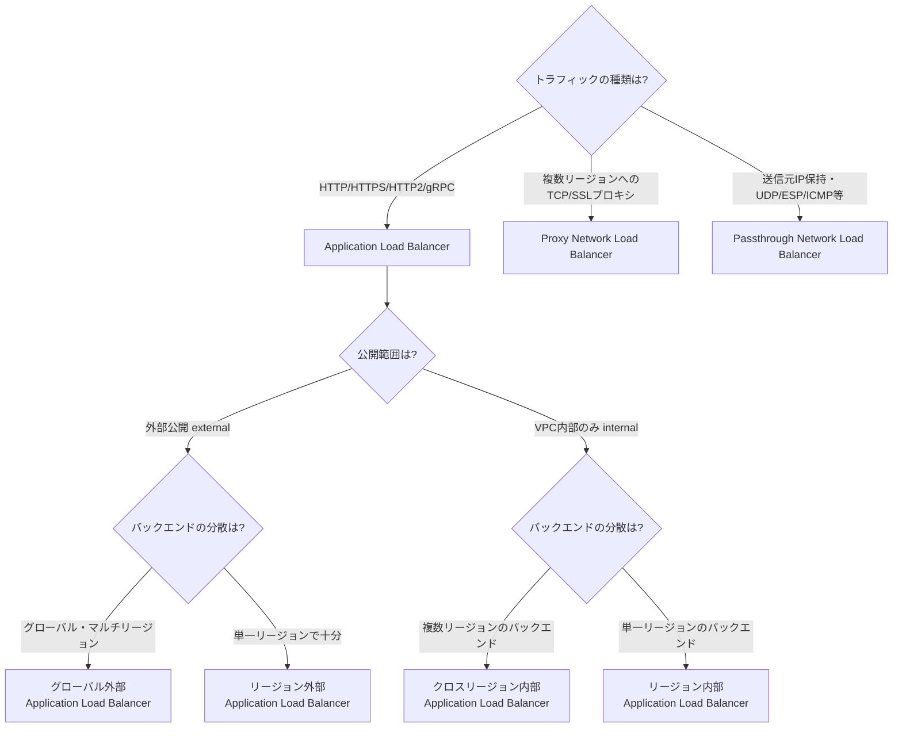
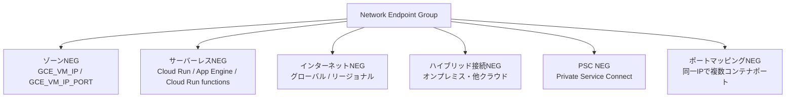
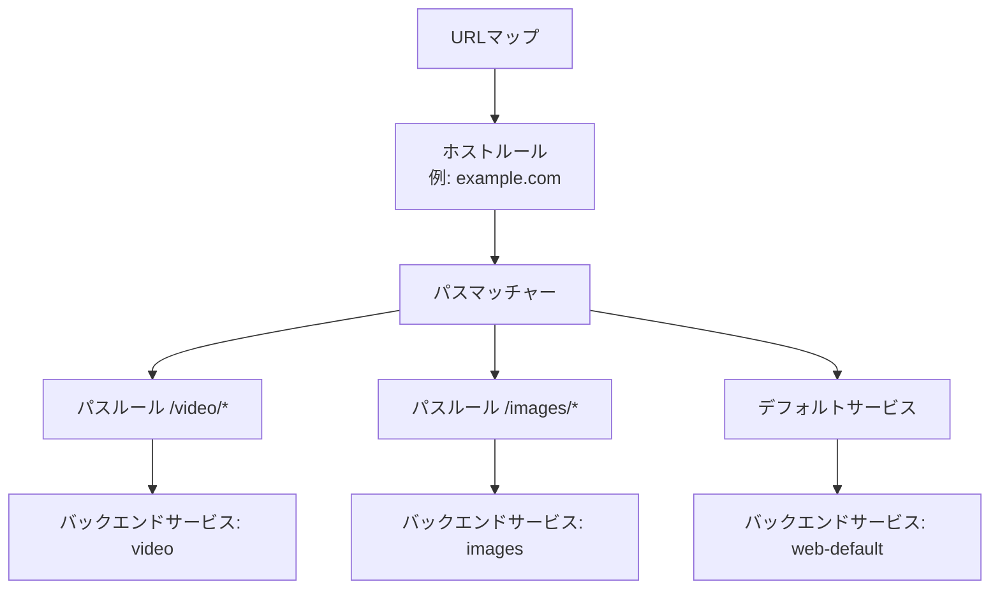
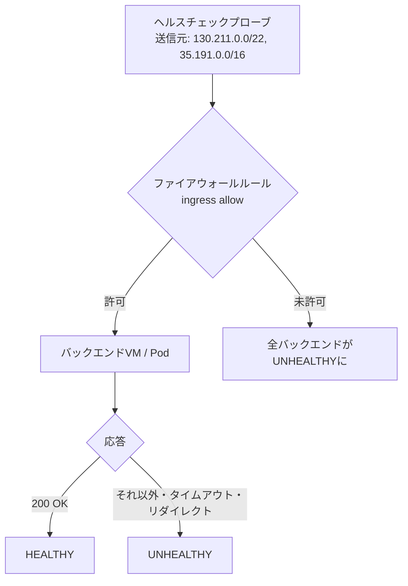
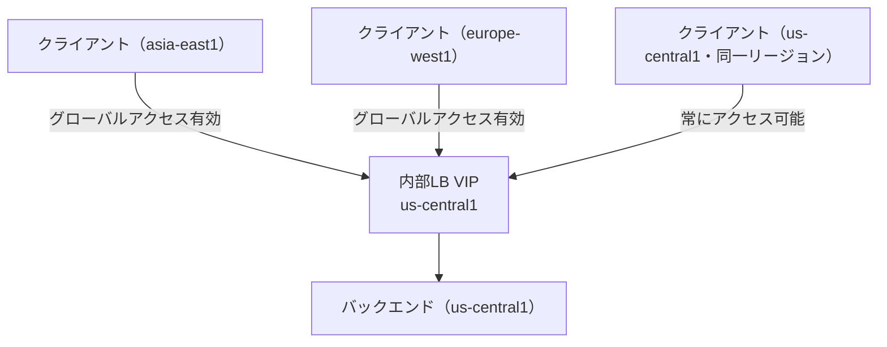
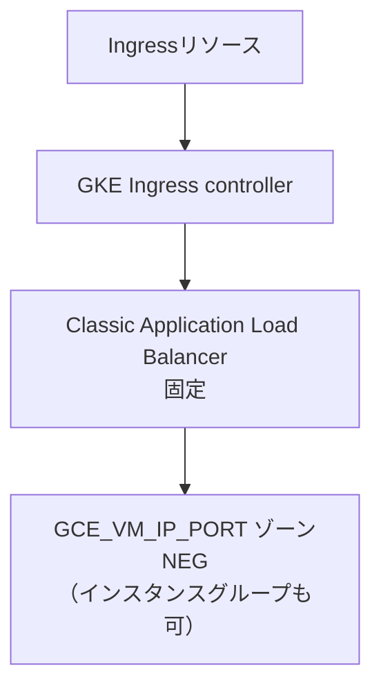
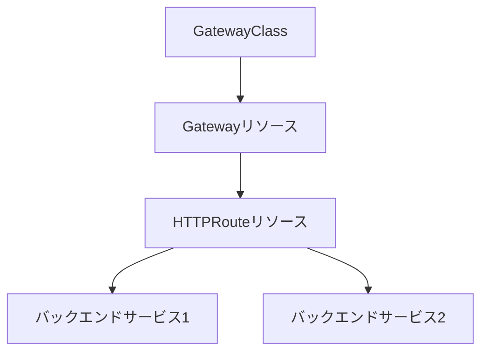
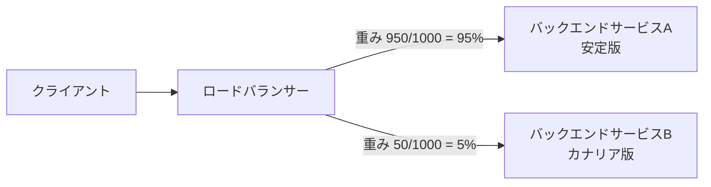
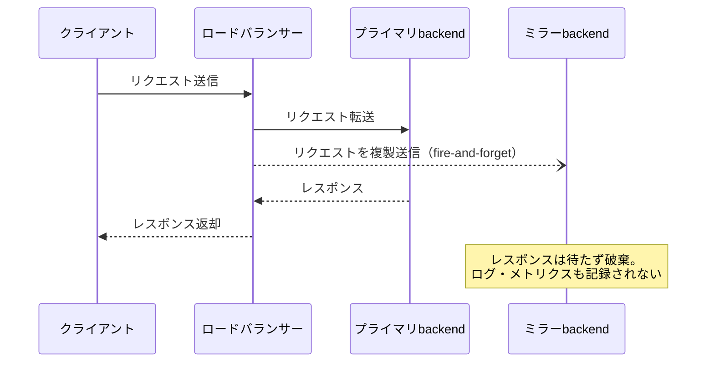
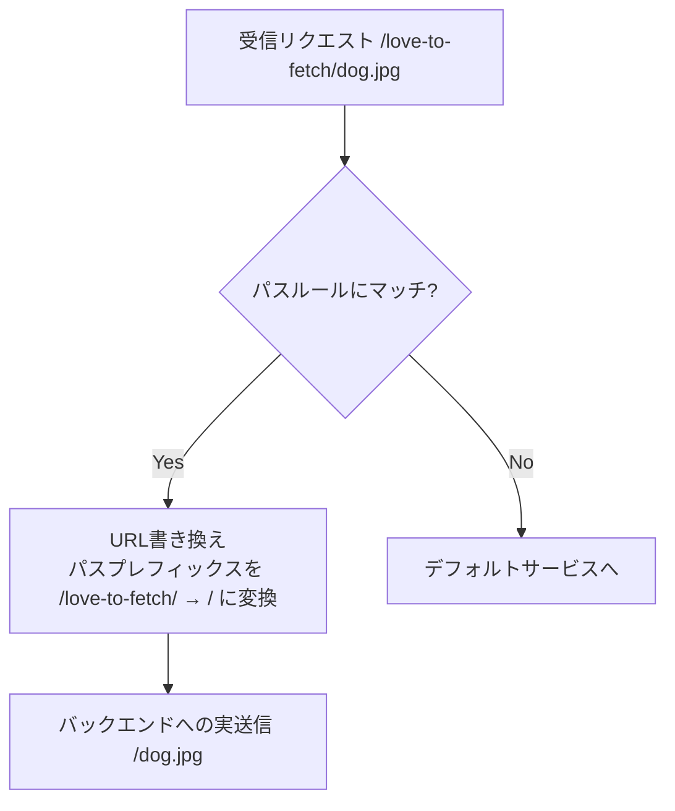

# S3: ロードバランシングとトラフィック管理

**Professional Cloud Network Engineer 試験対応ガイド — Section 3「Configuring managed network services」Task 3.1「Configuring load balancing」**

> 本ガイドは、Google Cloud Professional Cloud Network Engineer（PCNE）認定試験の公式Exam Guideに定義されたTask 3.1「Configuring load balancing」の出題範囲を、中級者から上級者のネットワークエンジニア向けに実装レベルまで掘り下げて解説するものです。Section 3全体の出題比率は約16%で、3.1（ロードバランシング）・3.2（Cloud CDN）・3.3（Cloud DNS）の3タスクから構成されますが、本ガイドは3.1のみを対象とします。

---

## 目次

1. [はじめに：このタスクの位置づけと出題範囲](#はじめにこのタスクの位置づけと出題範囲)
2. [ロードバランサーの全体アーキテクチャと選択基準](#ロードバランサーの全体アーキテクチャと選択基準)
3. [バックエンドサービスとオートスケーリングの設定](#バックエンドサービスとオートスケーリングの設定)
4. [ロードバランサーとバックエンドの詳細設定](#ロードバランサーとバックエンドの詳細設定)
5. [GKEにおけるロードバランシング](#gkeにおけるロードバランシング)
6. [Application Load Balancerでのトラフィック管理](#application-load-balancerでのトラフィック管理)
7. [設計・実装ベストプラクティスまとめ](#設計実装ベストプラクティスまとめ)
8. [参考文献](#参考文献)

---

## はじめに：このタスクの位置づけと出題範囲

公式Exam Guideは、Task 3.1「Configuring load balancing」を次の5つの観点で定義しています。

| 観点 | 内容 |
| --- | --- |
| ① LBソリューションの決定 | internal/external、regional/global、application/proxy/passthroughの区別 |
| ② バックエンドサービスの設定 | NEG・MIGを含むオートスケーリング構成 |
| ③ バックエンドの詳細設定 | バランシング方式・セッションアフィニティ・サービング容量・URLマップ・ヘルスチェック・グローバルアクセス |
| ④ GKEにおけるLB理解 | GKE Gateway controller・GKE Ingress controller・NEG |
| ⑤ トラフィック管理 | トラフィックスプリッティング・トラフィックミラーリング・URL書き換え |

Section 1（設計）で問われる「どのLBを選ぶべきか」という**アーキテクチャ設計の視点**に対し、Section 3（本タスク）では**実装・設定の視点**、すなわち「選んだLBをどのパラメータでどう構成するか」が主眼になります。試験では、シナリオ形式で「この要件を満たすバランシングモードはどれか」「このトラフィック分割を実現するにはどのURLマップ構成が必要か」といった設定レベルの判断が問われる点に注意してください。

---

## ロードバランサーの全体アーキテクチャと選択基準

### Google Cloudロードバランサーの分類軸

Google Cloudのロードバランサーは、次の3つの独立した軸の組み合わせで整理すると理解しやすくなります。

- **プロキシ方式**：Application Load Balancer（L7、HTTP/HTTPS/HTTP2/gRPC）／ Proxy Network Load Balancer（L4プロキシ、TCP/SSL）／ Passthrough Network Load Balancer（L4パススルー、クライアント送信元IPを保持）
- **公開範囲**：External（インターネット向け）／ Internal（VPC内部向け）
- **スコープ**：Global（複数リージョンにまたがる）／ Regional（単一リージョン）／ Cross-region（内部LBのみ、グローバルバックエンドを持つリージョナルVIP）

公式ドキュメントは選択の出発点を次のように整理しています。

> フレキシブルな機能セットが必要なHTTP(S)トラフィックにはApplication Load Balancerを、複数リージョンのバックエンドへのTCPプロキシロードバランシングにはProxy Network Load Balancerを、クライアント送信元IPの保持やUDP・ESP・ICMPなどの追加プロトコルサポートが必要な場合はPassthrough Network Load Balancerを選択します。

### 選択フローチャート

> **出典**: https://docs.cloud.google.com/load-balancing/docs/choosing-load-balancer

### 主要ロードバランサー比較表

| ロードバランサー | スコープ | 公開範囲 | 実装方式 | 主なユースケース |
| --- | --- | --- | --- | --- |
| グローバル外部 Application LB | グローバル | External | GFE（管理型） | 世界中のユーザー向けWebアプリ、マルチリージョン公開API |
| リージョン外部 Application LB | リージョン | External | Envoy（管理型） | 特定リージョンに閉じたコンプライアンス要件のあるWeb公開 |
| リージョン内部 Application LB | リージョン | Internal | Envoy（管理型） | マイクロサービス間のL7ロードバランシング |
| クロスリージョン内部 Application LB | クロスリージョン | Internal | Envoy（管理型） | 複数リージョンに分散した内部サービスへの高可用アクセス |
| Proxy Network LB（TCP Proxy） | グローバル/リージョン | External/Internal | GFE/Envoy | 複数リージョンのTCPバックエンドへの単一エニーキャストIP |
| 外部パススルー Network LB | リージョン | External | パススルー（非プロキシ） | 送信元IP保持が必要なUDP/TCPワークロード |
| 内部パススルー Network LB | リージョン | Internal | パススルー（非プロキシ） | 内部L4ロードバランシング、NVAの次ホップ |

> **出典**
>
> - https://docs.cloud.google.com/load-balancing/docs/features
> - https://docs.cloud.google.com/load-balancing/docs/application-load-balancer

### ネットワークサービスティアとの関係

ロードバランサーの種類ごとに利用可能なネットワークサービスティア（Premium/Standard）は異なります。この設計判断はSection 1（1.1）で扱う領域と重複するため、本ガイドでは詳細を割愛しますが、実装時には「Standard Tierではグローバル外部Application Load Balancerを利用できない」といった制約がある点だけ押さえておいてください。

---

## バックエンドサービスとオートスケーリングの設定

### バックエンドの種類：MIG vs NEG

バックエンドサービスにアタッチできるバックエンドは、大きく分けて2種類です。

- **マネージドインスタンスグループ（MIG）**：Compute Engine VMの集合。オートスケーラーと直接連携し、UTILIZATION（CPU使用率ベース）を含む全バランシングモードを利用可能。
- **ネットワークエンドポイントグループ（NEG）**：VMやコンテナ、サーバーレスリソースなど、より粒度の細かいエンドポイントの集合。UTILIZATIONバランシングモードはサポートされません。

### NEGの6分類

| NEGタイプ | エンドポイント形式 | 主な用途 | 制約 |
| --- | --- | --- | --- |
| ゾーンNEG（GCE_VM_IP_PORT） | IPアドレス＋ポート | プロキシ型LBの標準バックエンド、GKEのコンテナネイティブLB | UTILIZATIONバランシング非対応。RATE/CONNECTIONのみ |
| ゾーンNEG（GCE_VM_IP） | IPアドレスのみ（ポート指定不可） | 内部パススルーNetwork LB、外部パススルーNetwork LB（リージョン） | ポート指定不可、デュアルスタックエンドポイント不可 |
| サーバーレスNEG | Cloud Run / App Engine / Cloud Run functions | サーバーレスサービスをLB配下に統合 | Proxy/Passthrough Network LBからは利用不可 |
| インターネットNEG | FQDN:Port または IP:Port（RFC 1918外） | GCP外部（オンプレミス・他社クラウド）のバックエンドを統合 | グローバルは単一エンドポイント・ヘルスチェック非対応、リージョナルは最大256エンドポイント |
| ハイブリッド接続NEG | ハイブリッド接続経由のオンプレミスエンドポイント | Cloud Interconnect/VPN経由でのオンプレミスバックエンド統合 | ハイブリッド接続の構成が前提 |
| PSC NEG | Private Service Connectで公開されたサービス | 別プロジェクト・別VPCのサービスへの越境接続 | PSCエンドポイント経由でのみ解決 |

> **出典**
>
> - https://docs.cloud.google.com/load-balancing/docs/negs
> - https://docs.cloud.google.com/load-balancing/docs/negs/zonal-neg-concepts
> - https://docs.cloud.google.com/load-balancing/docs/negs/serverless-neg-concepts
> - https://docs.cloud.google.com/load-balancing/docs/negs/internet-neg-concepts

### オートスケーリングとの連携

MIGバックエンドにオートスケーラーをアタッチすると、オートスケーラーは「ロードバランシングのサービング容量の一定割合」を維持するようにインスタンス数を増減します。たとえばMIGのサービング容量が1インスタンスあたり100RPSと定義されており、オートスケーラーの目標使用率を80%に設定した場合、オートスケーラーは各インスタンスが80RPSを維持するようにインスタンスを追加・削除します。

> **ベストプラクティス**：NEGバックエンド（特にGKEのコンテナネイティブLB）を使う場合はUTILIZATIONが使えないため、RATEまたはCONNECTIONベースでキャパシティ計画を行い、Pod単位のHorizontal Pod Autoscalerと組み合わせて容量を制御します。
>
> **出典**: https://docs.cloud.google.com/compute/docs/autoscaler/scaling-load-balancing

---

## ロードバランサーとバックエンドの詳細設定

### バランシングモードとキャパシティスケーラー

バックエンドサービスは、バックエンドごとに「バランシングモード」と「ターゲット容量」を持ち、これに「キャパシティスケーラー」を乗算した値が実効容量になります。

| バランシングモード | 容量の測定基準 | 対応バックエンド | 備考 |
| --- | --- | --- | --- |
| UTILIZATION | インスタンスグループのCPU使用率（近似値） | MIGのみ（NEG非対応） | セッションアフィニティはNONEと併用すること |
| RATE | 新規HTTPリクエストのレート（RPS） | MIG・NEG両方 | グループ全体またはエンドポイント単位で指定可能 |
| CONNECTION | 新規TCPコネクション数 | MIG・NEG両方 | L4系ロードバランサーで使用 |
| IN-FLIGHT | 処理中（未完了）のHTTPリクエスト数 | MIG・NEG両方 | リクエスト処理に1秒以上かかる場合、RATEの代わりに使用 |

キャパシティスケーラーは0.0または0.1〜1.0の範囲で設定でき、次のような運用パターンに使えます。

- **段階的なドレイン**：キャパシティスケーラーを0.5にすると、そのバックエンドの実効容量が半分になり、新規トラフィックの流入が抑制されます。
- **完全ドレイン**：0に設定すると新規トラフィックは一切送られなくなります（バックエンドサービスに他のバックエンドが存在する場合のみ設定可能）。

> **出典**
>
> - https://docs.cloud.google.com/load-balancing/docs/backend-service
> - https://cloud.google.com/python/docs/reference/compute/0.4.2/google.cloud.compute_v1.types.Backend

### セッションアフィニティ

セッションアフィニティは、同一クライアントからの後続リクエストを可能な限り同じバックエンドに送るための仕組みです。

| アフィニティ種別 | ハッシュ対象 | 適したケース | 注意点 |
| --- | --- | --- | --- |
| NONE | なし（デフォルト） | ステートレスなアプリケーション | 最も均等な分散が得られる |
| CLIENT_IP | 送信元・宛先IPの2-tuple | NAT配下にクライアントが少ないL4/L7ワークロード | 多数のクライアントが同一送信元IP（NAT）を共有すると偏りが生じる |
| GENERATED_COOKIE | LBが発行するCookie | HTTP(S)ワークロードでの一般的な選択肢 | NATやIPアドレス変化の影響を受けない |
| HTTP_COOKIE | アプリケーション側が発行する既存Cookie | アプリケーションが既にセッションCookieを持つ場合 | Cookie名の指定が必要 |
| HEADER_FIELD | 指定したHTTPヘッダーの値 | ユーザーIDなどをヘッダーで伝搬するAPIクライアント | ロードバランシングロケーションポリシーがRING_HASHまたはMAGLEVである必要がある |

> セッションアフィニティは認証やセキュリティの目的では使用しないでください。バックエンドの健全性やスケール状況によって、ベストエフォートでしか維持されません。
>
> **ベストプラクティス**：UTILIZATIONバランシングモードと組み合わせて使用しないこと。ウェイト付きトラフィックスプリッティングを設定した場合、セッションアフィニティの設定より分割設定が優先されるため、両者を同時に有効化しないことが推奨されています。
>
> **出典**
>
> - https://docs.cloud.google.com/load-balancing/docs/l7-internal
> - https://docs.cloud.google.com/load-balancing/docs/https/request-distribution

### URLマップの構造

URLマップはホストルール（どのドメインに適用するか）→パスマッチャー（パスパターンの集合）→パスルール（個々のパスと転送先）という階層構造を持ちます。パスルールの代わりにルートルール（routeRules）を使うことも可能ですが、両者は同一のパスマッチャー内で併用できません。ルートルールは順序評価される点がパスルールと異なります。

> **出典**: https://docs.cloud.google.com/load-balancing/docs/https/traffic-management

### ヘルスチェック

多くのGoogle Cloudロードバランサーのヘルスチェックプローブは、`130.211.0.0/22`と`35.191.0.0/16`のアドレス範囲から送信されます。外部パススルーNetwork Load Balancerでは、これに加えて`209.85.152.0/22`と`209.85.204.0/22`も使用されます。VPCファイアウォールがデフォルト拒否である以上、これらの範囲からのIngressを明示的に許可するファイアウォールルールがなければ、アプリケーションが正常に動作していても全バックエンドがUNHEALTHYと判定されます。これは試験でも実務でも最頻出のトラブルシューティングシナリオです。

判定基準は「チェック間隔」「タイムアウト」「healthy閾値（連続成功回数）」「unhealthy閾値（連続失敗回数）」の4パラメータで構成され、プロトコルはHTTP/HTTPS/HTTP2/TCP/SSL/gRPCから選択できます。ヘルスチェックはHTTPリダイレクト（3xx）を失敗として扱うため、HTTPをHTTPSへ強制リダイレクトしているアプリケーションでヘルスチェックパスまでリダイレクトしてしまうと誤検知の原因になります。

> **ベストプラクティス**：ヘルスチェックには本番トラフィックのエンドポイントとは別の軽量な専用パス（例：`/healthz`）を用意し、200固定を返すようにします。GKEのNEGバックエンドでは、ヘルスチェックはノードIPではなくPod IPに対して直接行われるため、NetworkPolicyやPodのファイアウォール設定も併せて確認する必要があります。
>
> **出典**
>
> - https://docs.cloud.google.com/compute/docs/instance-groups/autohealing-instances-in-migs
> - https://docs.cloud.google.com/load-balancing/docs/internal/setting-up-failover

### グローバルアクセス（内部ロードバランサー）

リージョン内部Application Load Balancerは、デフォルトでは同一リージョンのクライアントからのみアクセス可能です。フォワーディングルールで「グローバルアクセス」を有効化すると、VPC内の任意のリージョンからクライアントがアクセスできるようになります。一方、クロスリージョン内部Application Load Balancerはグローバルアクセスが常に有効であり、さらにバックエンド自体を複数リージョンに配置できる点がリージョン内部LBとの決定的な違いです。

| 比較項目 | リージョン内部 Application LB | クロスリージョン内部 Application LB |
| --- | --- | --- |
| VIPの割り当て | 特定リージョンのサブネットから割り当て | 特定リージョンのサブネットから割り当て（複数リージョンのVIPが同一バックエンドサービスを共有可） |
| クライアントアクセス | デフォルトは同一リージョンのみ、グローバルアクセスで拡張可 | 常にグローバルアクセス可能 |
| バックエンドの分散 | 単一リージョンのみ | 複数リージョンに分散可能 |
| フェイルオーバー | リージョン内のみ | リージョンをまたいだ自動フェイルオーバー |

> **出典**
>
> - https://docs.cloud.google.com/load-balancing/docs/l7-internal
> - https://cloud.google.com/blog/products/networking/enhancing-cloud-load-balancing/

---

## GKEにおけるロードバランシング

GKEのロードバランシングは、レガシーな**GKE Ingress controller**と、Kubernetes公式仕様に準拠した**GKE Gateway controller**の2系統が併存しています。両者の違いを理解しておくことは、GKEネットワーキング設計（Section 1.4）と実装（本タスク）の橋渡しとして重要です。

### GKE Ingress controller（レガシー）

GKE Ingress controllerが作成する外部Ingressは常にClassic Application Load Balancerとして実装されます。GKE ServiceのNEGアノテーションを使えばGCE_VM_IP_PORTゾーンNEGを優先的にバックエンドとして利用しますが、インスタンスグループバックエンドもサポートされます。

### GKE Gateway controller（Gateway API）

GKE Gateway controllerはKubernetes Gateway APIの実装であり、責務が3つのリソースに分離されている点がIngressとの本質的な違いです。

- **GatewayClass**：使用するロードバランサーの実装を決定するクラスタスコープのテンプレート（GKEが提供）
- **Gateway**：実際のロードバランサーインスタンスを表すリソース（フロントエンド設定）
- **HTTPRoute**：ルーティングルールを定義するリソース（アプリケーションチームが管理）

この分離により、プラットフォームチームがGatewayのインフラ設定を管理し、アプリケーションチームがクラスタ全体の権限を持たずに自分たちのHTTPRouteだけを管理する、という役割分担が可能になります。GKE Gateway controllerは常にGCE_VM_IP_PORTゾーンNEGバックエンドを使用します。IngressのようにPodのreadiness probeからパラメータを推測はしませんが、標準パス `/` と既定値を使うヘルスチェックは自動作成されるため、HealthCheckPolicyは必須ではありません。アプリケーションが `/` にHTTP 200を返さない場合や、追加のパス、ヘッダー、タイムアウトなどの既定値を変更する場合にのみHealthCheckPolicyを設定します。

| 比較項目 | GKE Ingress controller | GKE Gateway controller |
| --- | --- | --- |
| 準拠仕様 | GKE独自のIngress拡張（アノテーションベース） | Kubernetes Gateway API（標準仕様） |
| 実装されるLB | 常にClassic Application Load Balancer | GatewayClassごとに実装されるLBが決まる（gke-l7-gxlb → Classic Application Load Balancer、gke-l7-global-external-managed → グローバル外部Application Load Balancer、gke-l7-regional-external-managed → リージョン外部Application Load Balancer、gke-l7-rilb → 内部Application Load Balancer、gke-l7-cross-regional-internal-managed → クロスリージョン内部Application Load Balancer） |
| リソース構成 | Ingressリソース1つに集約 | GatewayClass／Gateway／HTTPRouteに分離 |
| トラフィック分割 | 非対応（1ルートにつき1バックエンドのみ） | HTTPRouteでネイティブにトラフィックスプリッティング対応 |
| マルチテナンシー | Ingressリソースの所有者が全ルールを管理 | 名前空間をまたいだルーティング委譲が可能 |
| ヘルスチェック | パラメータを自動推測 | 標準の `/` と既定ポリシーを自動作成。追加パス・ヘッダー・タイムアウトなどを変更する場合のみHealthCheckPolicyを使用 |

> **出典**
>
> - https://docs.cloud.google.com/kubernetes-engine/docs/concepts/gateway-api
> - https://docs.cloud.google.com/kubernetes-engine/docs/how-to/deploying-gateways
> - https://docs.cloud.google.com/load-balancing/docs/https

### NEGとContainer-Native Load Balancing

GKEでNEGアノテーションを使うと、ロードバランサーはノードIPではなくPod IPに対して直接ヘルスチェック・トラフィック送信を行います（Container-Native Load Balancing）。これにより、ノードを経由するiptables/kube-proxyのホップが省略され、レイテンシが改善するとともに、ロードバランサーがPodの正確な健全性を把握できるようになります。

> **ベストプラクティス**：新規のGKEワークロードでは、レガシーのIngress + アノテーションではなく、GKE Gateway controllerとHTTPRouteの組み合わせを第一候補として設計します。標準仕様に準拠しているため、将来的な移植性が高く、トラフィックスプリッティングやヘッダーベースルーティングもアノテーション無しでネイティブに扱えます。

---

## Application Load Balancerでのトラフィック管理

Application Load Balancer（グローバル外部・リージョン外部・内部いずれも共通の枠組み）は、URLマップのルートアクションとして、単一バックエンドへの転送に加えて次の高度なトラフィック管理機能を提供します。

### トラフィックスプリッティング（カナリアリリース）

`weightedBackendServices`を使うと、0〜1000の重みで複数のバックエンドサービスにトラフィックを配分できます。カナリアリリースやブルー/グリーンデプロイの段階的なロールアウトに使われる代表的な手法です。

> **注意**：ウェイト付きトラフィックスプリッティングとセッションアフィニティは同時に設定しないでください。両方が設定された場合、トラフィックスプリッティングの重みが優先されます。

### トラフィックミラーリング

`requestMirrorPolicy`は、選択されたバックエンドサービスへ本来のリクエストを転送すると同時に、同一内容のリクエストを別のミラー用バックエンドサービスへ「投げっぱなし（fire-and-forget）」で複製送信します。ロードバランサーはミラー先からの応答を待ちません。デフォルトではトラフィックスプリッティングの分割設定に関わらずミラーバックエンドは全リクエストを受信しますが、`mirrorPercent`（0〜100.0）を指定することでミラー対象の割合を制御できます。ミラーされたリクエストはCloud Logging／Cloud Monitoringにログやメトリクスを一切生成しません。

> **ユースケース**：新バージョンのバックエンドに本番トラフィックの複製を流し込んで性能検証する、あるいは本番で発生したエラーをデバッグ版バックエンドで再現・調査する、といった用途に使われます。

### URL書き換え（Rewrite）とリダイレクト

`urlRewrite`アクションは、バックエンドサービスへリクエストを送信する前に、ホスト名やパスの一部を書き換える機能です。書き換え・リダイレクトはURLマップの3つの階層（パスルール／パスマッチャー／URLマップ自体）のいずれでも設定でき、それぞれ「パスがマッチしたとき」「パスマッチャー内でどのパスにもマッチしなかったとき」「どのホストルールにもマッチしなかったとき」に適用されます。

これらのルートアクションは互いに組み合わせ可能で、トラフィックスプリッティング・ミラーリング・URL書き換え・リトライポリシー・タイムアウト・フォルトインジェクション・ヘッダー操作を1つのルートルールに同時設定できます。

> **出典**
>
> - https://docs.cloud.google.com/load-balancing/docs/https/traffic-management-global
> - https://docs.cloud.google.com/load-balancing/docs/https/setting-up-url-rewrite

---

## 設計・実装ベストプラクティスまとめ

- [ ] トラフィックの種類（HTTP系かTCP/UDP系か、送信元IP保持が必要か）を最初に確定し、Application/Proxy/Passthroughの3系統から絞り込む
- [ ] GKEワークロードのバックエンドはNEG（GCE_VM_IP_PORT）を優先し、UTILIZATIONバランシングモードが使えない前提でRATE/CONNECTIONベースの容量設計を行う
- [ ] UTILIZATIONバランシングモードとセッションアフィニティは併用しない
- [ ] ウェイト付きトラフィックスプリッティングを使う場合はセッションアフィニティを設定しない（設定しても分割設定が優先される）
- [ ] ヘルスチェックプローブ範囲（130.211.0.0/22、35.191.0.0/16、外部パススルーLBでは追加で209.85.152.0/22・209.85.204.0/22）を許可するファイアウォールルールを必ず作成する
- [ ] ヘルスチェック専用の軽量エンドポイントを用意し、リダイレクトを発生させない
- [ ] 内部LBで複数リージョンにまたがるアクセスが必要な場合、リージョン内部LB＋グローバルアクセスではなく、クロスリージョン内部LBによるマルチリージョンバックエンド構成を優先的に検討する
- [ ] 新規GKE Ingress実装はレガシーのIngress controllerではなく、Gateway API（GKE Gateway controller）を第一候補とする
- [ ] トラフィックミラーリング先のバックエンドはログ・メトリクスが記録されないため、検証用の独立した監視手段を別途用意する
- [ ] カナリアリリースではトラフィックスプリッティングの重みを段階的に引き上げつつ、Cloud Monitoringでエラー率・レイテンシを比較しながらロールアウトする

---

## 参考文献

- **Choose a load balancer** — https://docs.cloud.google.com/load-balancing/docs/choosing-load-balancer
- **Application Load Balancer overview** — https://docs.cloud.google.com/load-balancing/docs/application-load-balancer
- **External Application Load Balancer overview** — https://docs.cloud.google.com/load-balancing/docs/https
- **Internal Application Load Balancer overview** — https://docs.cloud.google.com/load-balancing/docs/l7-internal
- **Load balancer feature comparison** — https://docs.cloud.google.com/load-balancing/docs/features
- **Backend services overview** — https://docs.cloud.google.com/load-balancing/docs/backend-service
- **Scaling based on load balancing serving capacity** — https://docs.cloud.google.com/compute/docs/autoscaler/scaling-load-balancing
- **Advanced load balancing optimizations** — https://docs.cloud.google.com/load-balancing/docs/service-lb-policy
- **Network endpoint groups overview** — https://docs.cloud.google.com/load-balancing/docs/negs
- **Zonal network endpoint groups overview** — https://docs.cloud.google.com/load-balancing/docs/negs/zonal-neg-concepts
- **Serverless network endpoint groups overview** — https://docs.cloud.google.com/load-balancing/docs/negs/serverless-neg-concepts
- **Internet network endpoint groups overview** — https://docs.cloud.google.com/load-balancing/docs/negs/internet-neg-concepts
- **Request distribution for external Application Load Balancers** — https://docs.cloud.google.com/load-balancing/docs/https/request-distribution
- **Traffic management overview for global external Application Load Balancers** — https://docs.cloud.google.com/load-balancing/docs/https/traffic-management-global
- **Traffic management overview for internal Application Load Balancers** — https://cloud.google.com/load-balancing/docs/l7-internal/traffic-management
- **Traffic management overview for a classic Application Load Balancer** — https://docs.cloud.google.com/load-balancing/docs/https/traffic-management
- **Set up URL rewrite for a classic Application Load Balancer** — https://docs.cloud.google.com/load-balancing/docs/https/setting-up-url-rewrite
- **Set up an application-based health check and autohealing** — https://docs.cloud.google.com/compute/docs/instance-groups/autohealing-instances-in-migs
- **Configure failover for internal passthrough Network Load Balancers** — https://docs.cloud.google.com/load-balancing/docs/internal/setting-up-failover
- **Enhancing Cloud Load Balancing（クロスリージョン内部LB発表ブログ）** — https://cloud.google.com/blog/products/networking/enhancing-cloud-load-balancing/
- **About Gateway API（GKE networking）** — https://docs.cloud.google.com/kubernetes-engine/docs/concepts/gateway-api
- **Deploying Gateways（GKE networking）** — https://docs.cloud.google.com/kubernetes-engine/docs/how-to/deploying-gateways
- **External Application Load Balancer performance best practices** — https://docs.cloud.google.com/load-balancing/docs/https/http-load-balancing-best-practices
- **Professional Cloud Network Engineer Certification exam guide** — https://services.google.com/fh/files/misc/professional_cloud_network_engineer_exam_guide_english.pdf
- **Google Cloud Professional Cloud Network Engineer 認定ページ** — https://cloud.google.com/learn/certification/cloud-network-engineer
