# Google Cloud インフラストラクチャ 完全入門ガイド

> **対象読者**: Google Cloud 初学者 / SQL 未経験者  
> **カバー範囲**: BigQuery・Cloud SQL・VPC・Cloud Monitoring・GKE デプロイメント戦略  
> **最終更新**: 2026-06

---

## 目次

1. [Part 1 — SQL の基礎と BigQuery](#part-1--sql-の基礎と-bigquery)
2. [Part 2 — Cloud SQL へのデータ移行](#part-2--cloud-sql-へのデータ移行)
3. [Part 3 — VPC ネットワークの設計と構築](#part-3--vpc-ネットワークの設計と構築)
4. [Part 4 — Cloud Monitoring による監視体制の確立](#part-4--cloud-monitoring-による監視体制の確立)
5. [Part 5 — Kubernetes デプロイメント戦略](#part-5--kubernetes-デプロイメント戦略)
6. [Part 6 — 総合チャレンジラボ攻略](#part-6--総合チャレンジラボ攻略)
7. [ベストプラクティス総まとめ](#ベストプラクティス総まとめ)
8. [参考リソース](#参考リソース)

---

## Part 1 — SQL の基礎と BigQuery

### 1-1. SQL とはなにか

**SQL (Structured Query Language)** は、構造化されたデータに対して「質問」を投げかけるための標準言語です。
スプレッドシートに似た「テーブル（表）」形式のデータを操作します。

| 用語 | 意味 | 例 |
|------|------|-----|
| **データベース** | 1つ以上のテーブルの集合体 | `london_bicycles` |
| **テーブル** | 行と列で構成されたデータ本体 | `cycle_hire` |
| **カラム（列）** | データの属性・種類 | `start_station_name` |
| **レコード（行）** | 1件分のデータ | ある1回のサイクリング記録 |

> **Big Queryにおけるデータ階層**:  
> `プロジェクト` ▶ `データセット` ▶ `テーブル`

---

### 1-2. 基本キーワード早見表

| キーワード | 役割 | 読み方のコツ |
|-----------|------|-------------|
| `SELECT` | 取得する列を指定する | 「〜を選ぶ」 |
| `FROM` | 参照するテーブルを指定する | 「〜から」 |
| `WHERE` | 絞り込み条件を指定する | 「〜の場合のみ」 |
| `GROUP BY` | 同じ値を持つ行をまとめる | 「〜でグループ分け」 |
| `COUNT()` | 行数を数える | 「〜を数える」 |
| `AS` | 列やテーブルに別名をつける | 「〜として」 |
| `ORDER BY` | 結果を並び替える | 「〜の順に並べる」 |

---

### 1-3. クエリの組み立てフロー

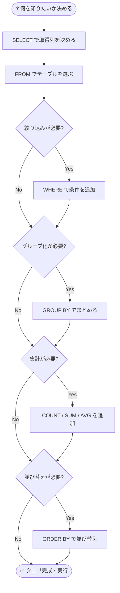

---

### 1-4. SELECT・FROM・WHERE の使い方

#### ✅ 基本構文

```sql
-- 単一列の取得
SELECT end_station_name
FROM `bigquery-public-data.london_bicycles.cycle_hire`;

-- 複数列の取得（カンマ区切り）
SELECT start_station_name, duration
FROM `bigquery-public-data.london_bicycles.cycle_hire`;

-- 全列の取得（* はすべての列）
SELECT *
FROM `bigquery-public-data.london_bicycles.cycle_hire`
WHERE duration >= 1200;  -- 1200秒 = 20分以上
```

> **ベストプラクティス**: 本番環境では `SELECT *` を避け、必要な列だけを指定しましょう。  
> BigQuery は**列単位で課金**されるため、不要な列の取得はコスト増につながります。

---

### 1-5. GROUP BY・COUNT・AS・ORDER BY の使い方

```sql
-- 各出発地点からの出発回数を多い順に表示
SELECT
    start_station_name,
    COUNT(*) AS num_starts        -- AS で列名に別名をつける
FROM `bigquery-public-data.london_bicycles.cycle_hire`
GROUP BY start_station_name       -- 出発地点でグループ化
ORDER BY num_starts DESC;         -- 多い順（DESC = 降順）
```

#### 集計関数一覧

| 関数 | 意味 | 例 |
|------|------|-----|
| `COUNT(*)` | 全行数を数える | 乗車回数 |
| `COUNT(col)` | NULL以外の行数を数える | 値が入っている行 |
| `SUM(col)` | 合計値 | 走行距離の合計 |
| `AVG(col)` | 平均値 | 平均走行時間 |
| `MAX(col)` | 最大値 | 最長走行時間 |
| `MIN(col)` | 最小値 | 最短走行時間 |

---

### 1-6. BigQuery ハンズオン手順

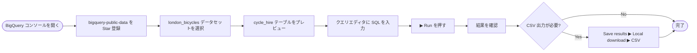

**BigQuery を使う際の注意点（コスト管理）:**

| 注意項目 | 理由 | 対策 |
|---------|------|------|
| `SELECT *` の多用 | 全列スキャンで課金が増大 | 必要な列だけを指定 |
| 大テーブルの WHERE なし実行 | 全行スキャンが発生 | 必ずフィルタを使う |
| 重複クエリの実行 | 無駄なコストが発生 | BigQuery のキャッシュを活用 |

---

## Part 2 — Cloud SQL へのデータ移行

### 2-1. BigQuery vs Cloud SQL 比較

| 比較項目 | BigQuery | Cloud SQL |
|---------|----------|-----------|
| **用途** | 分析・集計（OLAP） | トランザクション処理（OLTP） |
| **スケール** | ペタバイト級 | テラバイト級 |
| **料金体系** | クエリ量・ストレージ従量 | インスタンス時間従量 |
| **接続方法** | コンソール・API | MySQL/PostgreSQL クライアント |
| **得意なこと** | 大量データの高速集計 | リアルタイムの読み書き |

---

### 2-2. BigQuery → Cloud SQL データ移行フロー

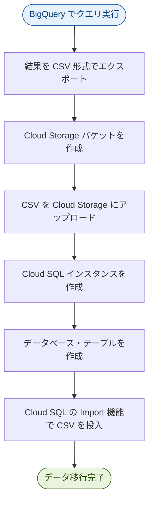

---

### 2-3. Cloud SQL インスタンス作成設定値

| 設定項目 | 推奨値（学習用） | 備考 |
|---------|--------------|------|
| Edition | Enterprise | 本番は Enterprise Plus も選択可 |
| Edition Preset | Development | 本番は Production を選択 |
| Database Version | MySQL 8.0 | 特段の理由がなければ最新安定版 |
| Machine Type | 4 vCPU / 16 GB RAM | ラボ環境では Development preset |
| Availability | Multiple zones | 本番環境では必須 |

---

### 2-4. Cloud Shell で Cloud SQL を操作する

```bash
# Cloud SQL インスタンスに接続
gcloud sql connect my-demo --user=root --quiet

# --- MySQL プロンプト内での操作 ---

# データベース作成
CREATE DATABASE bike;

# データベースを選択してテーブルを作成
USE bike;
CREATE TABLE london1 (
    start_station_name VARCHAR(255),
    num INT
);

CREATE TABLE london2 (
    end_station_name VARCHAR(255),
    num INT
);

# データ確認
SELECT * FROM london1 LIMIT 10;

# 不要行の削除（ヘッダー行など num=0 の行を削除）
DELETE FROM london1 WHERE num = 0;

# データの挿入
INSERT INTO london1 (start_station_name, num)
VALUES ("test destination", 1);

# UNION で2テーブルを結合して検索
SELECT start_station_name AS top_stations, num
FROM london1 WHERE num > 100000
UNION
SELECT end_station_name, num
FROM london2 WHERE num > 100000
ORDER BY top_stations DESC;
```

#### SQL データ操作キーワード早見表

| キーワード | 操作 | 例 |
|-----------|------|-----|
| `CREATE DATABASE` | データベース作成 | `CREATE DATABASE bike;` |
| `CREATE TABLE` | テーブル作成 | `CREATE TABLE t1 (col VARCHAR(255));` |
| `INSERT INTO` | 行の挿入 | `INSERT INTO t1 VALUES ("val");` |
| `DELETE FROM` | 行の削除 | `DELETE FROM t1 WHERE id=1;` |
| `UNION` | 2クエリの結果を結合 | `SELECT ... UNION SELECT ...` |

> **⚠️ ベストプラクティス**: `DELETE` は `WHERE` 条件なしで実行すると **全行削除** になります。  
> 必ず `WHERE` 句を付けるか、事前に `SELECT` で対象を確認してから実行しましょう。

---

## Part 3 — VPC ネットワークの設計と構築

### 3-1. VPC の基本概念

**VPC（Virtual Private Cloud）** は Google Cloud 内の論理的な独立ネットワークです。
複数のリージョンにまたがるグローバルリソースです。

#### VPC の主要コンポーネント

| コンポーネント | 役割 | 例 |
|--------------|------|-----|
| **VPC ネットワーク** | 仮想ネットワーク全体 | `mynetwork` |
| **サブネット** | リージョンごとの IP アドレス範囲 | `10.128.0.0/20` |
| **ファイアウォールルール** | 通信の許可・拒否ルール | SSH 許可 |
| **VM インスタンス** | サブネット内に配置される仮想マシン | `mynet-vm-1` |

---

### 3-2. Auto モード vs Custom モード

| 比較項目 | Auto モード | Custom モード |
|---------|-----------|-------------|
| サブネット作成 | 全リージョンに自動作成 | 手動で作成 |
| IP アドレス範囲 | Google が自動割り当て | 自分で指定 |
| 柔軟性 | 低い | 高い |
| 推奨用途 | 学習・プロトタイプ | **本番環境** |
| 例 | `default`, `mynetwork` | `managementnet`, `privatenet` |

> **ベストプラクティス**: 本番環境では必ず **Custom モード** を使用してください。  
> Auto モードは IP アドレス空間の管理ができないため、VPC Peering 時などに競合が発生します。

---

### 3-3. ネットワーク構成の全体像

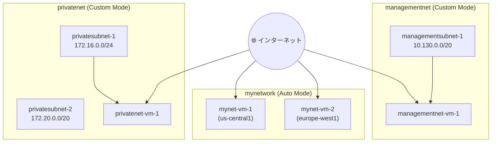

---

### 3-4. gcloud コマンドでネットワークを構築する

```bash
# ==========================================
# 1. Custom VPC ネットワークの作成
# ==========================================
gcloud compute networks create privatenet \
    --subnet-mode=custom

# ==========================================
# 2. サブネットの作成
# ==========================================
gcloud compute networks subnets create privatesubnet-1 \
    --network=privatenet \
    --region=us-central1 \
    --range=172.16.0.0/24

gcloud compute networks subnets create privatesubnet-2 \
    --network=privatenet \
    --region=europe-west1 \
    --range=172.20.0.0/20

# ==========================================
# 3. ファイアウォールルールの作成
# ==========================================
gcloud compute firewall-rules create privatenet-allow-icmp-ssh-rdp \
    --direction=INGRESS \
    --priority=1000 \
    --network=privatenet \
    --action=ALLOW \
    --rules=icmp,tcp:22,tcp:3389 \
    --source-ranges=0.0.0.0/0

# ==========================================
# 4. VM インスタンスの作成
# ==========================================
gcloud compute instances create privatenet-vm-1 \
    --zone=us-central1-a \
    --machine-type=e2-micro \
    --subnet=privatesubnet-1

# ==========================================
# 5. 現在の状態を確認
# ==========================================
gcloud compute networks list
gcloud compute networks subnets list --sort-by=NETWORK
gcloud compute firewall-rules list --sort-by=NETWORK
gcloud compute instances list --sort-by=ZONE
```

---

### 3-5. VPC 間の通信ルール

```mermaid
flowchart LR
    A["mynet-vm-1\n(mynetwork)"] -->|✅ 内部IP で通信可| B["mynet-vm-2\n(mynetwork)"]
    A -->|❌ 内部IP で通信不可| C["managementnet-vm-1\n(managementnet)"]
    A -->|❌ 内部IP で通信不可| D["privatenet-vm-1\n(privatenet)"]
    A -->|✅ 外部IP で通信可\n(FW ルール次第)| C
    A -->|✅ 外部IP で通信可\n(FW ルール次第)| D
```

> **重要な原則**: VPC ネットワークはデフォルトで**完全に分離**されています。  
> 同じリージョン・同じゾーンにあっても、異なる VPC の VM は**内部 IP では通信できません**。  
> 内部通信を許可するには **VPC Peering** または **Cloud VPN** が必要です。

---

### 3-6. マルチ NIC VM（複数ネットワーク接続 VM）

複数の VPC に同時接続する VM を作成できます（最大 8 NIC）。

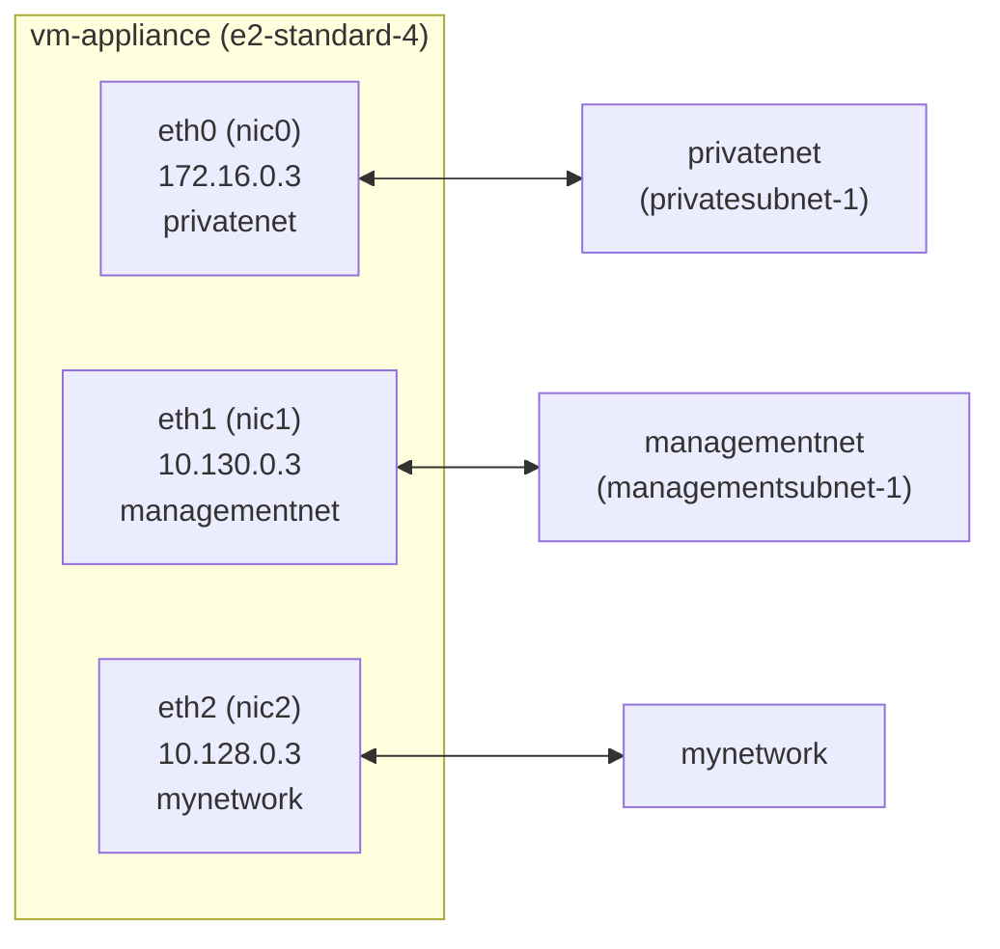

**マルチ NIC 作成時のポイント:**

| 注意事項 | 詳細 |
|---------|------|
| サブネット IP 重複禁止 | 各ネットワークの CIDR が重複してはいけない |
| デフォルトルートは eth0 | eth0 以外のネットワーク宛てトラフィックは eth0 経由になる場合がある |
| Machine Type の制限 | NIC 数は vCPU 数に依存（e2-standard-4 は最大 4 NIC） |

**ルーティングテーブル確認コマンド:**

```bash
# VM 内で実行
ip route
# 出力例:
# default via 172.16.0.1 dev eth0
# 10.128.0.0/20 via 10.128.0.1 dev eth2
# 10.130.0.0/20 via 10.130.0.1 dev eth1
# 172.16.0.0/24 via 172.16.0.1 dev eth0
```

---

## Part 4 — Cloud Monitoring による監視体制の確立

### 4-1. Cloud Monitoring の全体像

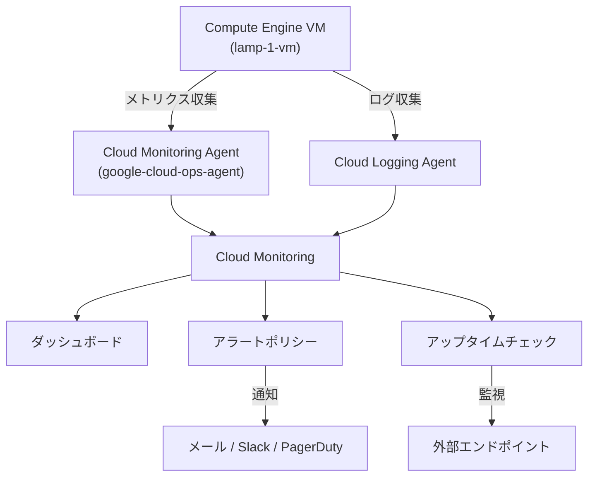

---

### 4-2. 監視エージェントのインストール手順

```bash
# ==========================================
# VM の SSH ターミナルで実行
# ==========================================

# Step 1: Ops Agent インストールスクリプトのダウンロード
curl -sSO https://dl.google.com/cloudagents/add-google-cloud-ops-agent-repo.sh

# Step 2: Ops Agent のインストール（Monitoring + Logging 両方）
sudo bash add-google-cloud-ops-agent-repo.sh --also-install

# Step 3: 動作確認
sudo systemctl status google-cloud-ops-agent"*"
```

> **ベストプラクティス**: すべての VM に Ops Agent をインストールしましょう。  
> Agent なしでは CPU・メモリ等の詳細メトリクスが取得できません。

---

### 4-3. Apache2 Web サーバーのセットアップ

```bash
# パッケージリストの更新
sudo apt-get update

# Apache2 と PHP のインストール
sudo apt-get install apache2 php7.0 -y

# Apache2 の再起動
sudo service apache2 restart
```

---

### 4-4. アップタイムチェックの設定

| 設定項目 | 推奨値 | 説明 |
|---------|--------|------|
| Protocol | HTTP | Web サーバーの死活監視 |
| Resource Type | URL | 外部 IP で監視 |
| Check Frequency | 1 分 | 頻繁に確認する |
| Title | Lamp Uptime Check | わかりやすい名前をつける |

---

### 4-5. アラートポリシーの設定フロー

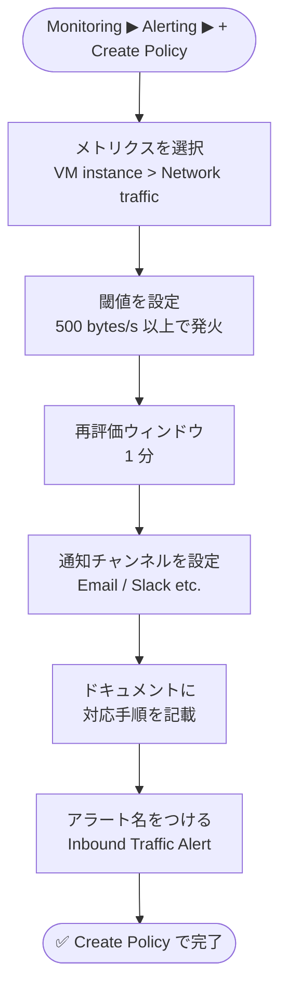

**アラートポリシー設定のベストプラクティス:**

| 項目 | ベストプラクティス |
|------|-----------------|
| 閾値 | 誤検知が多い場合は高めに設定。初期は低めで様子を見る |
| 通知先 | 個人メールより Slack / PagerDuty などのチームチャンネル推奨 |
| ドキュメント | アラート発生時の対応手順（Runbook）を必ず記載する |
| Retest Window | 瞬間的なスパイクでの誤検知を防ぐため 1〜5 分を推奨 |

---

### 4-6. Cloud Logging でログを確認する

**Logs Explorer のフィルタ例:**

```text
resource.type = "gce_instance"
resource.labels.instance_id = "lamp-1-vm"
```

**主要なログ種別:**

| ログ種別 | 確認できること |
|---------|-------------|
| `syslog` | OS レベルのシステムイベント |
| `apache_access` | Web サーバーへのアクセス履歴 |
| `apache_error` | Web サーバーのエラー |
| `stackdriver_agent` | Monitoring Agent 自体のログ |

---

## Part 5 — Kubernetes デプロイメント戦略

### 5-1. Kubernetes の基本構成

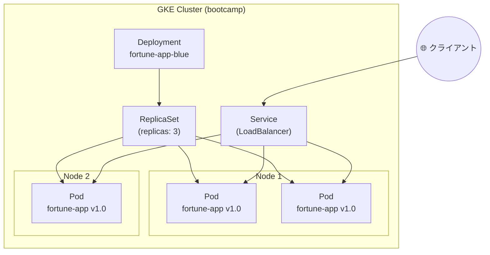

---

### 5-2. Deployment の基本 YAML 構造

```yaml
apiVersion: apps/v1
kind: Deployment
metadata:
  name: fortune-app-blue         # Deployment の名前
spec:
  replicas: 3                    # Pod の数
  selector:
    matchLabels:
      app: fortune-app           # 管理対象 Pod のラベル
  template:
    metadata:
      labels:
        app: fortune-app
        version: "1.0.0"
    spec:
      containers:
        - name: fortune-app
          image: "us-central1-docker.pkg.dev/.../fortune-service:1.0.0"
          ports:
            - containerPort: 8080
```

---

### 5-3. 基本的な kubectl コマンド

```bash
# ==========================================
# Deployment の作成と確認
# ==========================================
kubectl create -f deployments/fortune-app-blue.yaml
kubectl get deployments
kubectl get replicasets
kubectl get pods

# ==========================================
# Service の作成
# ==========================================
kubectl create -f services/fortune-app.yaml
kubectl get services fortune-app

# ==========================================
# スケールアップ・スケールダウン
# ==========================================
kubectl scale deployment fortune-app-blue --replicas=5
kubectl scale deployment fortune-app-blue --replicas=3

# ==========================================
# バージョン確認
# ==========================================
curl http://$(kubectl get svc fortune-app \
  -o=jsonpath="{.status.loadBalancer.ingress[0].ip}")/version
```

---

### 5-4. デプロイメント戦略の比較

| 戦略 | 概要 | ダウンタイム | リスク | 適用場面 |
|------|------|-----------|--------|---------|
| **Rolling Update** | 旧 Pod を少しずつ新 Pod に入れ替え | なし | 中 | 通常のアップデート |
| **Canary** | 一部ユーザーにのみ新バージョンを提供 | なし | 低 | 新機能の段階的リリース |
| **Blue-Green** | 旧・新環境を並行稼働し一気に切り替え | なし | 低（即時 Rollback 可） | 大規模な変更・安全重視 |
| **Recreate** | 全 Pod を削除してから新 Pod を作成 | あり | 高 | ステートフルアプリ |

---

### 5-5. Rolling Update（ローリングアップデート）

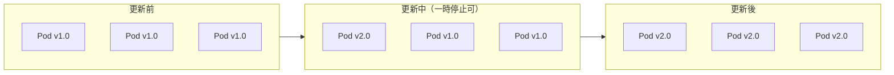

```bash
# イメージを v2.0.0 に更新（Deployment を直接編集）
kubectl edit deployment fortune-app-blue
# エディタ内で image タグを 1.0.0 → 2.0.0 に変更して保存

# ロールアウトの状態確認
kubectl rollout status deployment/fortune-app-blue

# 一時停止
kubectl rollout pause deployment/fortune-app-blue

# 再開
kubectl rollout resume deployment/fortune-app-blue

# 履歴確認
kubectl rollout history deployment/fortune-app-blue

# ロールバック
kubectl rollout undo deployment/fortune-app-blue
```

---

### 5-6. Canary デプロイメント

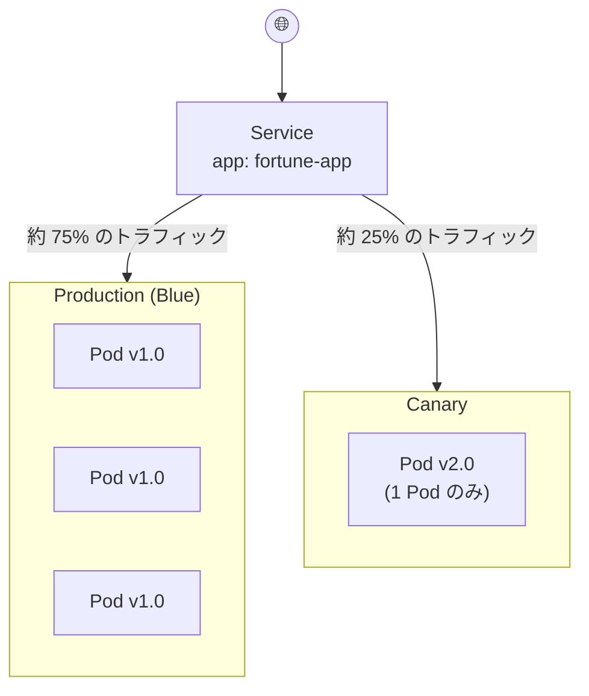

```bash
# Canary Deployment の作成
kubectl create -f deployments/fortune-app-canary.yaml

# 現在のバージョン分布を確認（10回リクエスト）
for i in {1..10}; do
  curl -s http://$(kubectl get svc fortune-app \
    -o=jsonpath="{.status.loadBalancer.ingress[0].ip}")/version
  echo
done
```

> **ポイント**: Canary は Pod 数の比率でトラフィックが分散されます。  
> Production: 3 Pod, Canary: 1 Pod → Canary に約 25% のトラフィックが流れます。

---

### 5-7. Blue-Green デプロイメント

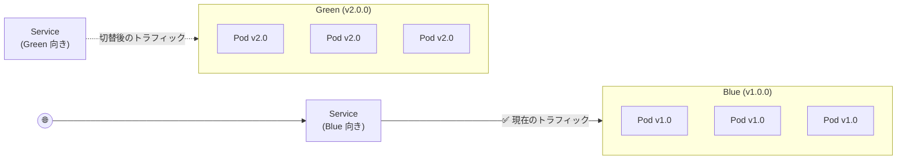

```bash
# Step 1: Blue（v1.0.0）のみにトラフィックを向ける
kubectl apply -f services/fortune-app-blue-service.yaml

# Step 2: Green（v2.0.0）Deployment を作成（まだトラフィックなし）
kubectl create -f deployments/fortune-app-green.yaml

# Step 3: v1.0.0 で提供されていることを確認
curl http://$(kubectl get svc fortune-app \
  -o=jsonpath="{.status.loadBalancer.ingress[0].ip}")/version

# Step 4: Service を Green に切り替え（瞬時に全トラフィックが v2.0.0 へ）
kubectl apply -f services/fortune-app-green-service.yaml

# Step 5: v2.0.0 で提供されていることを確認
curl http://$(kubectl get svc fortune-app \
  -o=jsonpath="{.status.loadBalancer.ingress[0].ip}")/version

# ロールバック: Blue に戻す
kubectl apply -f services/fortune-app-blue-service.yaml
```

---

### 5-8. デプロイメント戦略の選び方フロー

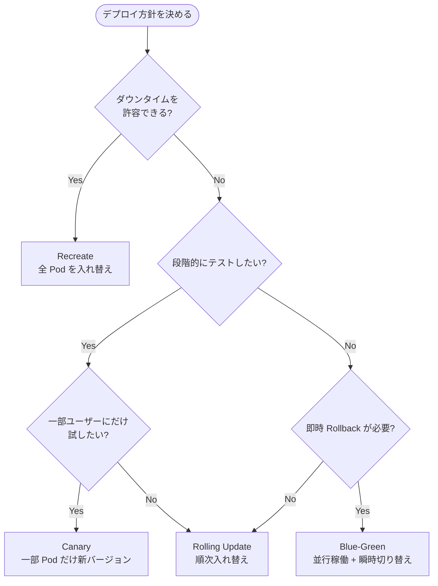

---

## Part 6 — 総合チャレンジラボ攻略

### 6-1. チャレンジ全体のアーキテクチャ

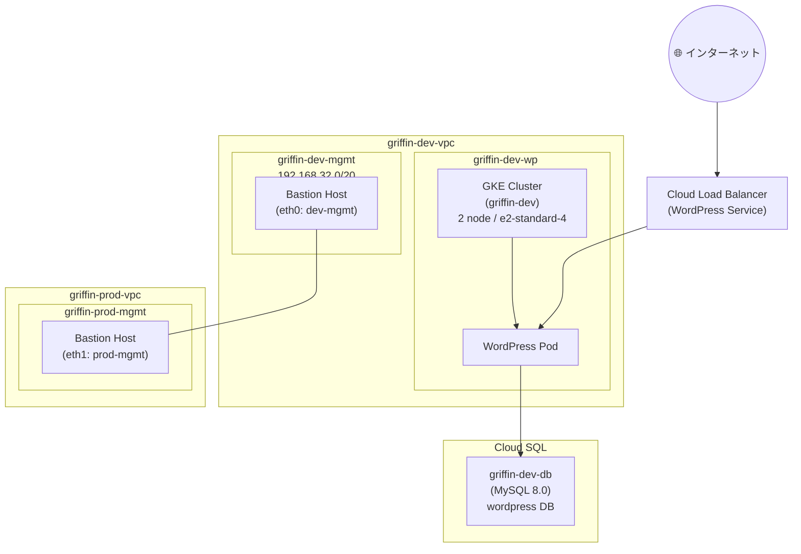

---

### 6-2. タスク別実装手順

#### Task 1 & 2: VPC の作成

```bash
# ==========================================
# 開発 VPC の作成
# ==========================================
gcloud compute networks create griffin-dev-vpc \
    --subnet-mode=custom

gcloud compute networks subnets create griffin-dev-wp \
    --network=griffin-dev-vpc \
    --region=us-east1 \
    --range=192.168.16.0/20

gcloud compute networks subnets create griffin-dev-mgmt \
    --network=griffin-dev-vpc \
    --region=us-east1 \
    --range=192.168.32.0/20

# ==========================================
# 本番 VPC の作成
# ==========================================
gcloud compute networks create griffin-prod-vpc \
    --subnet-mode=custom

gcloud compute networks subnets create griffin-prod-wp \
    --network=griffin-prod-vpc \
    --region=us-east1 \
    --range=192.168.48.0/20

gcloud compute networks subnets create griffin-prod-mgmt \
    --network=griffin-prod-vpc \
    --region=us-east1 \
    --range=192.168.64.0/20
```

#### Task 3: Bastion Host（踏み台サーバー）の作成

```bash
# マルチ NIC Bastion Host を作成
gcloud compute instances create griffin-bastion \
    --zone=us-east1-b \
    --machine-type=e2-medium \
    --network-interface=network=griffin-dev-vpc,subnet=griffin-dev-mgmt \
    --network-interface=network=griffin-prod-vpc,subnet=griffin-prod-mgmt

# SSH 許可の FW ルールを作成
gcloud compute firewall-rules create griffin-dev-allow-ssh \
    --network=griffin-dev-vpc \
    --allow=tcp:22 \
    --source-ranges=0.0.0.0/0

gcloud compute firewall-rules create griffin-prod-allow-ssh \
    --network=griffin-prod-vpc \
    --allow=tcp:22 \
    --source-ranges=0.0.0.0/0
```

#### Task 4: Cloud SQL インスタンスと WordPress DB の設定

```bash
# Cloud SQL MySQL インスタンスを作成
gcloud sql instances create griffin-dev-db \
    --database-version=MYSQL_8_0 \
    --region=us-east1 \
    --tier=db-n1-standard-1

# Cloud SQL に接続して WordPress 用 DB を準備
gcloud sql connect griffin-dev-db --user=root
```

```sql
-- MySQL プロンプト内で実行
CREATE DATABASE wordpress;
CREATE USER "wp_user"@"%" IDENTIFIED BY "stormwind_rules";
GRANT ALL PRIVILEGES ON wordpress.* TO "wp_user"@"%";
FLUSH PRIVILEGES;
```

#### Task 5 & 6: GKE クラスターの作成と設定

```bash
# ==========================================
# GKE クラスターの作成
# ==========================================
gcloud container clusters create griffin-dev \
    --zone=us-east1-b \
    --machine-type=e2-standard-4 \
    --num-nodes=2 \
    --network=griffin-dev-vpc \
    --subnetwork=griffin-dev-wp

# ==========================================
# WordPress 用シークレットとボリュームの設定
# ==========================================
gsutil cp -r gs://spls/gsp321/wp-k8s .
cd wp-k8s

# wp-env.yaml を編集してユーザー名とパスワードを設定
# username: wp_user
# password: stormwind_rules

kubectl create -f wp-env.yaml

# Cloud SQL Proxy 用のサービスアカウントキーを作成
gcloud iam service-accounts keys create key.json \
    --iam-account=cloud-sql-proxy@$GOOGLE_CLOUD_PROJECT.iam.gserviceaccount.com

kubectl create secret generic cloudsql-instance-credentials \
    --from-file key.json
```

#### Task 7: WordPress Deployment の作成

```bash
# wp-deployment.yaml を編集
# YOUR_SQL_INSTANCE → griffin-dev-db の Instance Connection Name に置換
# 形式: PROJECT_ID:REGION:INSTANCE_NAME

kubectl create -f wp-deployment.yaml
kubectl create -f wp-service.yaml

# LoadBalancer の External IP が付与されるまで待機
kubectl get services --watch
```

#### Task 9: 追加エンジニアへのアクセス付与

```bash
# Editor ロールをプロジェクトに付与
gcloud projects add-iam-policy-binding $GOOGLE_CLOUD_PROJECT \
    --member="user:SECOND_USER_EMAIL" \
    --role="roles/editor"
```

---

## ベストプラクティス総まとめ

### コスト管理

| カテゴリ | ベストプラクティス |
|---------|-----------------|
| BigQuery | `SELECT *` を避け、必要な列のみ取得する |
| BigQuery | 大規模クエリ実行前に「クエリバリデータ」でスキャン量を確認する |
| Cloud SQL | 開発・テスト環境は Development Preset を使用する |
| GKE | 不要なクラスターはこまめに削除する |
| VM | 使用しない VM は停止（課金は継続）または削除する |

### セキュリティ

| カテゴリ | ベストプラクティス |
|---------|-----------------|
| VPC | 本番環境は必ず Custom モードを使用する |
| VPC | `0.0.0.0/0` からの SSH 許可は最小限に留め、IAP（Identity-Aware Proxy）を活用する |
| Cloud SQL | パスワードは必ず `Secret Manager` で管理する |
| IAM | 最小権限の原則（Principle of Least Privilege）を徹底する |
| GKE | サービスアカウントキーはファイルではなく Workload Identity を使用する |

### 可用性・信頼性

| カテゴリ | ベストプラクティス |
|---------|-----------------|
| Cloud SQL | 本番環境は **Multiple Zones（HA 構成）** を必ず選択する |
| GKE | Rolling Update で `maxUnavailable`・`maxSurge` を適切に設定する |
| Monitoring | すべての VM に Ops Agent をインストールする |
| Monitoring | アラートには Runbook（対応手順書）のリンクを必ず記載する |
| デプロイ | Blue-Green デプロイで即時 Rollback 体制を整える |

### 開発効率

| カテゴリ | ベストプラクティス |
|---------|-----------------|
| gcloud | よく使うオプションは `gcloud config set` でデフォルト化する |
| kubectl | `kubectl explain` でリソースのフィールドを確認する |
| SQL | `DELETE` 前は必ず `SELECT` で対象行を確認する |
| Monitoring | ダッシュボードは CPU・メモリ・ネットワーク・エラー率の 4 点セットで作成する |

---

## 参考リソース

### BigQuery & SQL

| リソース | URL |
|---------|-----|
| BigQuery 公式ドキュメント | https://cloud.google.com/bigquery/docs |
| BigQuery SQL リファレンス | https://cloud.google.com/bigquery/docs/reference/standard-sql/query-syntax |
| BigQuery コスト最適化 | https://cloud.google.com/bigquery/docs/best-practices-costs |
| BigQuery セキュリティベストプラクティス | https://cloud.google.com/bigquery/docs/best-practices-security |

### Cloud SQL

| リソース | URL |
|---------|-----|
| Cloud SQL 公式ドキュメント | https://cloud.google.com/sql/docs |
| Cloud SQL for MySQL | https://cloud.google.com/sql/docs/mysql |
| Cloud SQL HA 構成 | https://cloud.google.com/sql/docs/mysql/high-availability |
| Cloud SQL インポート/エクスポート | https://cloud.google.com/sql/docs/mysql/import-export |

### VPC ネットワーク

| リソース | URL |
|---------|-----|
| VPC 公式ドキュメント | https://cloud.google.com/vpc/docs |
| VPC ネットワーク設計 | https://cloud.google.com/vpc/docs/vpc |
| サブネット作成 | https://cloud.google.com/vpc/docs/subnets |
| ファイアウォールルール | https://cloud.google.com/firewall/docs/firewalls |
| 複数 NIC の概要 | https://cloud.google.com/vpc/docs/multiple-interfaces-concepts |
| VPC Peering | https://cloud.google.com/vpc/docs/vpc-peering |

### Cloud Monitoring

| リソース | URL |
|---------|-----|
| Cloud Monitoring 公式ドキュメント | https://cloud.google.com/monitoring/docs |
| Ops Agent インストール | https://cloud.google.com/stackdriver/docs/solutions/agents/ops-agent |
| アップタイムチェック | https://cloud.google.com/monitoring/uptime-checks |
| アラートポリシー | https://cloud.google.com/monitoring/alerts |
| Cloud Logging | https://cloud.google.com/logging/docs |
| ダッシュボード作成 | https://cloud.google.com/monitoring/dashboards |

### Kubernetes / GKE

| リソース | URL |
|---------|-----|
| GKE 公式ドキュメント | https://cloud.google.com/kubernetes-engine/docs |
| Deployment 概念 | https://kubernetes.io/docs/concepts/workloads/controllers/deployment/ |
| Rolling Update | https://kubernetes.io/docs/tutorials/kubernetes-basics/update/update-intro/ |
| Canary デプロイメント | https://kubernetes.io/docs/concepts/cluster-administration/manage-deployment/#canary-deployments |
| kubectl コマンドリファレンス | https://kubernetes.io/docs/reference/kubectl/cheatsheet/ |
| GKE デプロイメントベストプラクティス | https://cloud.google.com/kubernetes-engine/docs/best-practices/controllers |

### チャレンジラボ全般

| リソース | URL |
|---------|-----|
| Google Cloud スキルバッジ | https://cloud.google.com/training/badges |
| Google Cloud アーキテクチャセンター | https://cloud.google.com/architecture |
| IAM ベストプラクティス | https://cloud.google.com/iam/docs/using-iam-securely |
| Cloud SQL Proxy（Kubernetes 向け） | https://cloud.google.com/sql/docs/mysql/connect-kubernetes-engine |

---

> **最終確認チェックリスト**
>
> - [ ] BigQuery でのクエリ実行が正常に動作する
> - [ ] Cloud Storage バケットに CSV がアップロードされている
> - [ ] Cloud SQL に london1・london2 テーブルが作成されている
> - [ ] managementnet・privatenet が Custom モードで作成されている
> - [ ] ファイアウォールルールで SSH・ICMP・RDP が許可されている
> - [ ] 外部 IP では全 VM に ping が通る
> - [ ] 異なる VPC 間では内部 IP での ping が失敗する
> - [ ] Ops Agent がすべての VM にインストールされている
> - [ ] アップタイムチェックが Active になっている
> - [ ] Rolling Update・Canary・Blue-Green の各デプロイが成功している