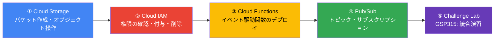
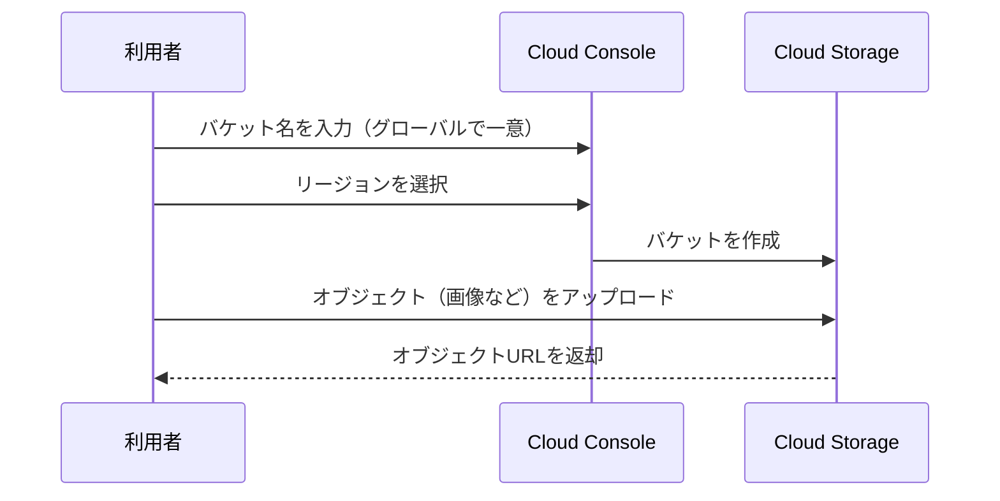
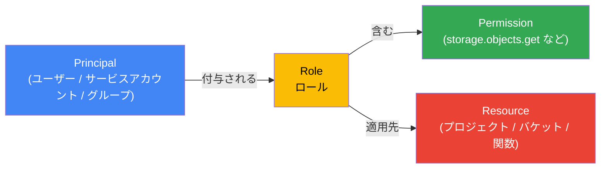
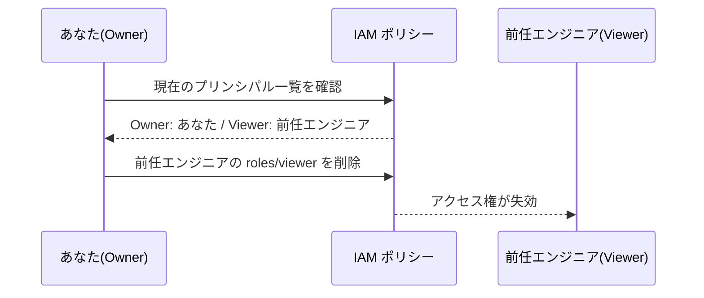
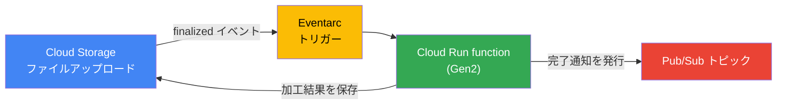
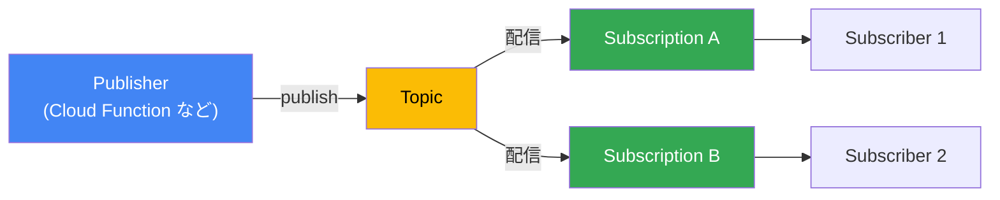
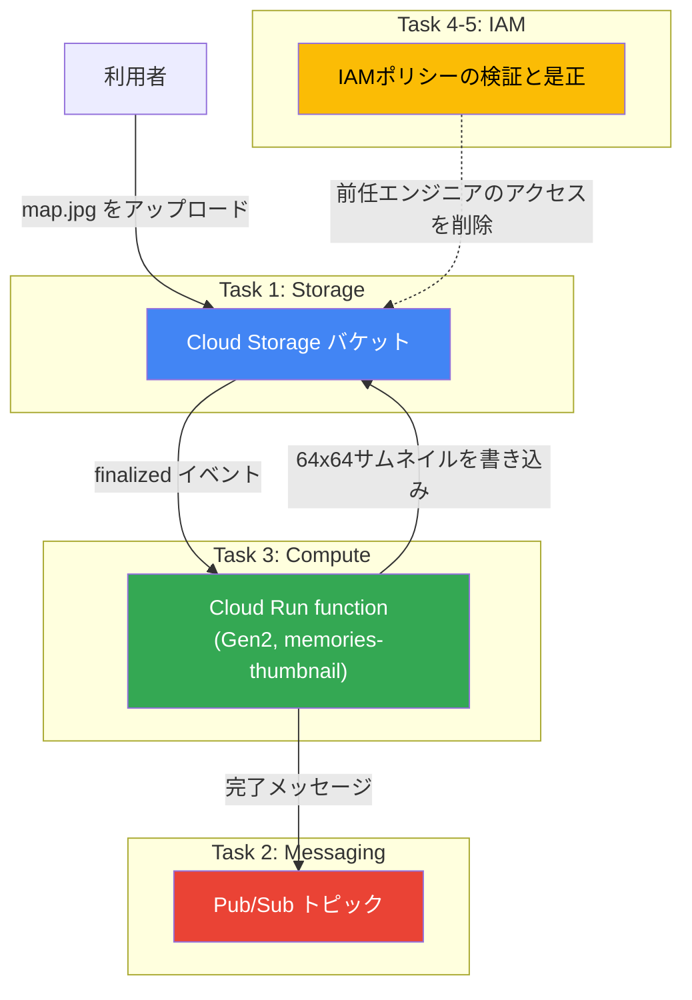

# Google Cloud ではじめるアプリ開発環境構築ガイド
### Cloud Storage・IAM・Cloud Functions・Pub/Sub で学ぶベストプラクティス

| 項目 | 内容 |
|---|---|
| 対象コース | Set Up an App Dev Environment on Google Cloud（Google Skills / course_templates/637） |
| 対象読者 | Google Cloud 初学者〜ジュニアクラウドエンジニア |
| 想定学習時間 | 約1時間15分（コース本編）＋ Challenge Lab 1時間 |
| 扱う技術要素 | Cloud Storage / Identity and Access Management（IAM）/ Cloud Functions（Cloud Run functions）/ Pub/Sub (※Cloud Monitoring は対象外) |
| 最終更新 | 2026-07-01 |

---

## 目次

1. [このガイドについて](#1-このガイドについて)
2. [コース全体像とラーニングパス](#2-コース全体像とラーニングパス)
3. [Cloud Storage — オブジェクトストレージの基礎](#3-cloud-storage--オブジェクトストレージの基礎)
4. [Cloud IAM — アクセス制御の基礎](#4-cloud-iam--アクセス制御の基礎)
5. [Cloud Functions（Cloud Run functions）— イベント駆動サーバーレス](#5-cloud-functions-cloud-run-functions-イベント駆動サーバーレス)
6. [Pub/Sub — 非同期メッセージング](#6-pubsub--非同期メッセージング)
7. [総合演習：Challenge Lab（GSP315）徹底解説](#7-総合演習challenge-labgsp315徹底解説)
8. [サービス横断ベストプラクティス早見表](#8-サービス横断ベストプラクティス早見表)
9. [よくあるエラーとトラブルシューティング](#9-よくあるエラーとトラブルシューティング)
10. [参考ソース一覧](#10-参考ソース一覧)

---

## 1. このガイドについて

### 1.1 スコープに関する注記

Google Skills（旧 Google Cloud Skills Boost）の個別ラボページは、受講登録済みアカウントでのサインインが必須のため、ラボ ID 単位（`/labs/592541` 〜 `/labs/592550`）での本文取得はできません。そのため本ガイドは、以下の情報源を根拠として再構成しています。

- コース `course_templates/637`（Set Up an App Dev Environment on Google Cloud）の**公式コース概要**に明記された技術スコープ：Cloud Storage、IAM、Cloud Functions、Pub/Sub
- 本コース末尾の Challenge Lab（`labs/592550`）である **GSP315: Set Up an App Dev Environment on Google Cloud: Challenge Lab** の公開されているシナリオ・タスク構成
- 各サービスの Google Cloud 公式ドキュメント（ベストプラクティスページ）

一般的にこの構成のコースは、①Cloud Storage の基本操作（コンソール／CLI）、②IAM によるアクセス制御、③Cloud Functions（現行の Cloud Run functions）のデプロイ、④Pub/Sub のメッセージング、という4つの実習を経て、最後にこれらを統合する Challenge Lab（GSP315）で総仕上げを行う構成になっています。本ガイドはこの技術的な流れに沿って、各サービスの「定義 → 理由 → 具体例 → コード」を初学者向けに解説し、最後に Challenge Lab の統合的なアーキテクチャを解説します。

### 1.2 提供された参照URL

| # | URL | 位置づけ（推定） |
|---|---|---|
| 1 | `.../course_templates/637/labs/592541` | コース前半：Cloud Storage 実習 |
| 2 | `.../course_templates/637/labs/592542` | コース前半：Cloud Storage 実習（CLI/SDK） |
| 3 | `.../course_templates/637/labs/592543` | Cloud IAM 実習 |
| 4 | `.../course_templates/637/labs/592544` | Cloud Functions 実習（コンソール） |
| 5 | `.../course_templates/637/labs/592545` | Cloud Functions 実習（コマンドライン） |
| 6 | `.../course_templates/637/labs/592546` | Pub/Sub 実習（コンソール） |
| 7 | `.../course_templates/637/labs/592547` | Pub/Sub 実習（コマンドライン） |
| 8 | `.../course_templates/637/labs/592548` | Pub/Sub 実習（補足／言語別クライアント等） |
| 9 | `.../course_templates/637/labs/592549` | 復習クイズ／知識確認 |
| 10 | `.../course_templates/637/labs/592550` | **Challenge Lab（GSP315）** ※内容を確認済み |

> ⚠️ 9番までの厳密なラベルはサインインしないと確認できないため「推定」です。ただし10番目が Challenge Lab であることは、複数の独立した情報源（Google Cloud Skills Boost の同一ラボID、GitHub 上のソリューション集、コミュニティのラーニングパス記録）で一致しており、確度は高いです。

---

## 2. コース全体像とラーニングパス

このコースは「写真管理アプリ Memories」というシナリオを軸に、ストレージ・権限管理・サーバーレス処理・非同期通知という、モダンなアプリ開発環境の基本4要素を一気通貫で学びます。



### 2.1 なぜこの順番で学ぶのか

| 順番 | サービス | このコースにおける役割 |
|---|---|---|
| 1 | Cloud Storage | 画像などの非構造化データを保存する「置き場」を作る |
| 2 | IAM | 誰が・どのリソースに・何をできるかを制御する土台を理解する |
| 3 | Cloud Functions | ストレージへのアップロードを**トリガー**に自動処理（サムネイル生成など）を実行する |
| 4 | Pub/Sub | 処理結果を他システムに**非同期で通知**する |
| 5 | Challenge Lab | 上記すべてを組み合わせ、実務に近いシナリオを自力で完成させる |

この流れは「ストレージにファイルが置かれる → 権限に基づいてイベントが検知される → 関数が起動して加工する → 完了をメッセージングで知らせる」という、サーバーレスなイベント駆動アーキテクチャの典型パターンそのものです。

---

## 3. Cloud Storage — オブジェクトストレージの基礎

### 3.1 定義

Cloud Storage は、任意の量の非構造化データ（画像・動画・ログ・バックアップなど）をオブジェクトとして保存できる、フルマネージドのオブジェクトストレージサービスです。データは「バケット」と呼ばれるコンテナに格納され、各バケットはプロジェクトに属します。

### 3.2 なぜ使うか

- サーバーの容量管理が不要で、ペタバイト級までシームレスにスケールする
- 99.999999999%（イレブンナイン）の年間耐久性を持つ
- Standard／Nearline／Coldline／Archive の4つのストレージクラスでアクセス頻度に応じたコスト最適化ができる
- Cloud Functions や Pub/Sub など他サービスとイベント連携しやすい（本コースの核心部分）

### 3.3 具体例（コンソールでの操作フロー）



バケット名はグローバルネームスペースで一意である必要がありますが、オブジェクト名はバケット内でのみ一意であれば構いません。

### 3.4 コード例（gcloud CLI）

```bash
# 環境変数の準備
export PROJECT_ID=$(gcloud config get-value project)
export BUCKET_NAME="${PROJECT_ID}-photos"
export REGION="asia-northeast1"

# リージョンバケットを作成
gcloud storage buckets create gs://${BUCKET_NAME} \
  --project=${PROJECT_ID} \
  --location=${REGION} \
  --uniform-bucket-level-access

# オブジェクトをアップロード
gcloud storage cp ./sample.jpg gs://${BUCKET_NAME}/

# バケット内の一覧を確認
gcloud storage ls gs://${BUCKET_NAME}/
```

> 💡 `gcloud storage` コマンドは従来の `gsutil` の後継で、より高速かつ一貫性のある挙動をします。新規学習では `gcloud storage` を使うのがおすすめです。

### 3.5 ベストプラクティス

| # | 項目 | ✅ 推奨 | ❌ 避けるべき |
|---|---|---|---|
| 1 | バケット命名 | プロジェクトやビジネス上の機密情報を含まない、推測されにくい名前にする | `mysecretproject-prod-bucket` のように機密情報を露出させる |
| 2 | アクセス制御 | 均一バケットレベルアクセス（IAMのみ）を有効化し、最小権限で運用する | オブジェクトごとにACLを個別設定して管理を複雑化させる |
| 3 | 公開設定 | 公開が必要なオブジェクトだけを明示的に許可する | バケット全体をうっかり公開設定にする |
| 4 | ストレージクラス | アクセス頻度に応じて Standard/Nearline/Coldline/Archive を使い分ける | すべて Standard のまま高コストを放置する |
| 5 | 再試行戦略 | 新しいコネクションでの再試行やヘッジドリクエストを実装し、トラフィックの急増に備える | 同一パスへの単純リトライのみで「サーバー固着」を起こす |
| 6 | オブジェクト名 | ランダム性のあるプレフィックスで高スループット時のホットスポットを回避する | 連番やタイムスタンプのみの単純な命名で書き込みを集中させる |
| 7 | ライフサイクル管理 | オブジェクトライフサイクルルールで古いデータを自動的に低コストクラスへ移行・削除する | 不要データを手動管理のまま放置しコストを増大させる |

---

## 4. Cloud IAM — アクセス制御の基礎

### 4.1 定義

IAM（Identity and Access Management）は「誰が（Principal）」「どのリソースに（Resource）」「何をできるか（Permission）」を、ロールの付与によって制御する仕組みです。Google Cloud では権限を直接付与するのではなく、権限をまとめた「ロール」を主体に紐づけます。



### 4.2 なぜ使うか

- 誤操作や不正アクセスによる被害範囲（ブラストラディウス）を最小化できる
- Owner／Editor／Viewer のような広範な基本ロールに頼らず、サービス単位の事前定義ロール（`roles/storage.objectViewer` など）で細かく制御できる
- 退職者や異動者のアクセスを確実に取り消せる（本コースの Challenge Lab でも実施）

### 4.3 具体例

このコースでは、プロジェクトに参加している「前任のクラウドエンジニア」のアクセス権を確認し、不要になった時点で削除する、という実務でも頻出のシナリオを扱います。



### 4.4 コード例（gcloud CLI）

```bash
# 現在のIAMポリシーを確認
gcloud projects get-iam-policy ${PROJECT_ID}

# 特定ユーザーの roles/viewer を削除（最小権限の原則の実践）
gcloud projects remove-iam-policy-binding ${PROJECT_ID} \
  --member="user:previous-engineer@example.com" \
  --role="roles/viewer"

# バケット単位で最小権限を付与する例（プロジェクト全体でなくリソース単位に絞る）
gcloud storage buckets add-iam-policy-binding gs://${BUCKET_NAME} \
  --member="serviceAccount:thumbnail-fn@${PROJECT_ID}.iam.gserviceaccount.com" \
  --role="roles/storage.objectViewer"
```

### 4.5 ベストプラクティス

| # | 項目 | ✅ 推奨 | ❌ 避けるべき |
|---|---|---|---|
| 1 | 最小権限の原則 | タスク遂行に必要な最小限の権限のみを付与する | とりあえず `roles/editor` や `roles/owner` を付与する |
| 2 | 付与範囲 | バケットや関数など、リソース単位でロールを絞り込む | プロジェクト全体に広いロールを付与する |
| 3 | サービスアカウント | 用途ごとに専用のサービスアカウントを作成し、機能を分離する | すべての関数で同一の高権限サービスアカウントを共有する |
| 4 | 定期棚卸し | IAM Recommender などで未使用権限を定期的に洗い出し削除する | 一度付与した権限を放置し「権限の肥大化」を起こす |
| 5 | 監査 | Cloud Audit Logs で IAM 変更を継続的にモニタリングする | 権限変更を記録・追跡せず放置する |
| 6 | グループ活用 | 多数のユーザーへの付与はグループ単位で行う | ユーザーを1人ずつ個別に列挙して管理コストを増やす |

---

## 5. Cloud Functions（Cloud Run functions）— イベント駆動サーバーレス

### 5.1 定義

Cloud Functions は、サーバー管理不要でイベント（HTTPリクエストや Cloud Storage への書き込みなど）に応じて単一目的のコードを実行できるサーバーレス実行環境です。第2世代（Gen2）の Cloud Functions は Cloud Run 上で稼働し、現在は「Cloud Run functions」という製品名に統合されています。内部的には Cloud Run サービスと Eventarc トリガーの組み合わせとして構成されます。



### 5.2 なぜ使うか

- インフラのプロビジョニングが不要で、コードをデプロイするだけで即座にスケールする
- Cloud Storage・Pub/Sub・Firestore など多様なイベントソースと直接連携できる
- 使った分だけの課金（リクエストが来ない間はコストが発生しない）

### 5.3 具体例（コンソールでのデプロイ手順の流れ）

1. 関数名・リージョン・トリガー種別（この場合は Cloud Storage の `finalized` イベント）を設定する
2. 対象バケットを指定する
3. エントリポイント（実行される関数名）とランタイム（例：Node.js 22）を設定する
4. ソースコード（`index.js` と `package.json`）を記述してデプロイする

### 5.4 コード例（Node.js／概念コード）

以下は、Cloud Storage への画像アップロードをトリガーにサムネイルを生成し、完了を Pub/Sub に通知する処理の概念的な骨組みです（実際の実装は言語・要件により調整してください）。

```javascript
const functions = require('@google-cloud/functions-framework');
const { Storage } = require('@google-cloud/storage');
const { PubSub } = require('@google-cloud/pubsub');
const sharp = require('sharp');

const storage = new Storage();
const pubsub = new PubSub();

functions.cloudEvent('generateThumbnail', async (cloudEvent) => {
  const event = cloudEvent.data;
  const { bucket: bucketName, name: fileName } = event;

  // 冪等性の確保：既にサムネイルなら再処理しない
  if (fileName.includes('_thumb')) {
    console.log(`Skip: ${fileName} is already a thumbnail`);
    return;
  }

  const bucket = storage.bucket(bucketName);
  const thumbName = fileName.replace(/(\.[^.]+)$/, '_thumb$1');

  await bucket.file(fileName)
    .createReadStream()
    .pipe(sharp().resize(64, 64))
    .pipe(bucket.file(thumbName).createWriteStream());

  await pubsub.topic(process.env.TOPIC_NAME).publishMessage({
    data: Buffer.from(JSON.stringify({ thumbnail: thumbName })),
  });
});
```

```bash
# デプロイ例（Gen2 / Cloud Storage トリガー）
gcloud functions deploy generateThumbnail \
  --gen2 \
  --runtime=nodejs22 \
  --region=${REGION} \
  --source=. \
  --entry-point=generateThumbnail \
  --trigger-event-filters="type=google.cloud.storage.object.v1.finalized" \
  --trigger-event-filters="bucket=${BUCKET_NAME}" \
  --set-env-vars=TOPIC_NAME=${TOPIC_NAME} \
  --max-instances=2
```

### 5.5 ベストプラクティス

| # | 項目 | ✅ 推奨 | ❌ 避けるべき |
|---|---|---|---|
| 1 | 冪等性 | 同じイベントで複数回呼ばれても同じ結果になるよう設計する | 副作用のある処理を無条件に繰り返し実行する |
| 2 | 無限ループ防止 | サムネイル生成イベントがさらに自分自身をトリガーしないようファイル名等でガードする | 生成物が再度トリガー対象になり無限ループが発生する |
| 3 | コールドスタート対策 | 依存関係を最小限にし、グローバルスコープで重い初期化を1回だけ行う | 毎回の呼び出しで重い処理を再初期化する |
| 4 | 権限 | 関数専用のサービスアカウントを作り、必要な権限のみ付与する | デフォルトのサービスアカウント（Editorロール相当）をそのまま使う |
| 5 | 依存関係の固定 | `package-lock.json` 等でFunctions Frameworkのバージョンを固定する | バージョン未指定で環境ごとに挙動が変わるリスクを抱える |
| 6 | エラーハンドリング | 例外を捕捉しログに出力し、必要に応じて再試行ポリシーを設定する | 未処理の例外でクラッシュし原因追跡が困難になる |

---

## 6. Pub/Sub — 非同期メッセージング

### 6.1 定義

Pub/Sub は、メッセージの送信者（Publisher）と受信者（Subscriber）を分離する、非同期のメッセージングサービスです。Publisher は「トピック」にメッセージを送信し、Subscriber は「サブスクリプション」を通じてメッセージを受信します。



### 6.2 なぜ使うか

- Publisher と Subscriber が互いの存在や稼働状況を意識せずに疎結合で連携できる
- 1つのトピックに複数のサブスクリプションを紐づける「ファンアウト」で、同じイベントを複数システムに配信できる
- サービス障害時にもメッセージが保持され、リトライや再処理が可能

### 6.3 具体例

Challenge Lab のシナリオでは、サムネイル生成が完了したことを知らせるためのトピックを用意し、Cloud Function がそこにメッセージを発行します。この時点ではサブスクリプションを作らず「送信先の箱」だけを用意するのがポイントです。ただし、メッセージ保持（Message Retention）機能が有効化されていない限り、サブスクリプション作成前にトピックへ送信されたメッセージは破棄されます。後続の消費者へメッセージを確実に届けるためには、Publish が開始される前にサブスクリプションを作成しておくか、トピック側でメッセージ保持を有効にする必要がある点に注意してください。

### 6.4 コード例（gcloud CLI）

```bash
# トピックを作成
gcloud pubsub topics create ${TOPIC_NAME}

# 動作確認用にサブスクリプションを作成
gcloud pubsub subscriptions create ${TOPIC_NAME}-sub \
  --topic=${TOPIC_NAME}

# テストメッセージを発行
gcloud pubsub topics publish ${TOPIC_NAME} \
  --message="thumbnail generated"

# サブスクリプションからメッセージを取得
gcloud pubsub subscriptions pull ${TOPIC_NAME}-sub --auto-ack --limit=5
```

### 6.5 ベストプラクティス

| # | 項目 | ✅ 推奨 | ❌ 避けるべき |
|---|---|---|---|
| 1 | Publisher再利用 | Publisherクライアントを使い回して接続確立のオーバーヘッドを避ける | リクエストごとに新しいクライアントを生成する |
| 2 | メッセージ保持 | Publish開始前にサブスクリプションを用意するか、トピックのメッセージ保持を有効化する | サブスクリプション不在のままPublishし、メッセージを失う |
| 3 | 冪等な処理 | Subscriber側は「少なくとも1回配信」を前提に重複処理に耐える設計にする | メッセージが必ず1回だけ届く前提で実装する |
| 4 | デッドレターキュー | 処理に失敗し続けるメッセージをデッドレタートピックへ退避させる | 失敗メッセージが際限なく再配信され続ける |
| 5 | 順序保証 | 順序が必要な場合のみ ordering key を設定する（性能とのトレードオフを理解する） | すべてのメッセージに一律で順序保証を要求しスループットを落とす |
| 6 | バッチ処理 | クライアントライブラリのバッチ機能でスループットとコストを最適化する | 1メッセージ1リクエストで大量発行しコストを増大させる |

---

## 7. 総合演習：Challenge Lab（GSP315）徹底解説

### 7.1 シナリオ概要

あなたは Jooli 社のジュニアクラウドエンジニアとして、写真管理アプリ「Memories」の開発チームから、アプリ開発環境の初期構築を依頼されます。ステップバイステップの手順書は与えられず、これまでの実習で得たスキルをもとに自力でタスクを完了させることが求められる、実務に近いシナリオです。

### 7.2 統合アーキテクチャ図



### 7.3 タスク一覧

| タスク | 内容 | 使用する主な技術 |
|---|---|---|
| Task 1 | 写真保存用の Cloud Storage バケットを作成する | Cloud Storage |
| Task 2 | Cloud Run function が使用する Pub/Sub トピックを作成する | Pub/Sub |
| Task 3 | アップロードをトリガーにサムネイルを生成する Cloud Run function（Gen2）を作成・デプロイする | Cloud Functions / Eventarc |
| Task 4 | 画像をアップロードしてインフラ全体の動作を検証する | Cloud Storage / Cloud Functions / Pub/Sub |
| Task 5 | 前任のクラウドエンジニアのプロジェクトアクセスを削除する | IAM |

### 7.4 手順ごとの解説

**Task 1: バケット作成**

ラボパネルに指定されたバケット名（例：`qwiklabs-gcp-XX-xxxxxxxx-bucket`）を使い、リージョンを選択してデフォルト設定でバケットを作成します。バケット名は課題ごとに採点システムが検証するため、指定された名前を正確に使用することが重要です。

**Task 2: Pub/Sub トピック作成**

Cloud Run function が処理完了後にメッセージを発行するためのトピックを作成します。この段階ではサブスクリプションの作成は要求されていません（Cloud Run function 側が Publisher として使うだけのため）。

**Task 3: Cloud Run function（サムネイル生成）**

- トリガー：対象バケットへの Cloud Storage `finalized` イベント
- エントリポイントは、コード内で定義した関数名と完全に一致させる必要があります（不一致はデプロイ後の動作不良の典型的な原因です）
- Eventarc がバケットのイベントを読み取れるよう、Cloud Storage のサービスエージェントに `roles/pubsub.publisher` を付与するなど、関連サービスアカウントへの権限伝播が必要になる場合があります（数分のタイムラグが生じることがあります）

**Task 4: 動作検証**

指定の画像（例：`map.jpg`）をバケットにアップロードし、数十秒〜数分後にサムネイルファイルが生成されることを確認します。生成されない場合は、関数の「トリガー」タブでイベント設定が正しく保存されているかを確認し、必要であればトリガーを再作成します。

**Task 5: IAM クリーンアップ**

プロジェクトには「あなた（Owner）」と「前任エンジニア（Viewer）」の2つのプリンシパルが存在する設定になっています。前任エンジニアの `roles/viewer` バインディングを削除し、最小権限の原則を実践してタスクを完了します。

### 7.5 よくあるエラーと対処

| 症状 | 想定される原因 | 対処 |
|---|---|---|
| 画像をアップロードしてもサムネイルが生成されない | Eventarc/Cloud Storage のサービスエージェント権限がまだ伝播していない | 数分待って再アップロード、または権限設定を再確認する |
| デプロイは成功するが関数がエラー終了する | エントリポイント名とコード内の関数名が不一致 | コンソールの「エントリポイント」欄をコード内の関数名と完全一致させる |
| サムネイルが無限に生成され続ける | 生成物自身が再度トリガー対象になっている | ファイル名にサフィックスを付け、既存のサムネイルを除外するガード処理を入れる |
| Pub/Sub へのPublishでエラーになる | Cloud Storage サービスエージェントに `roles/pubsub.publisher` が付与されていない | 該当のサービスエージェントへ IAM ロールを追加する |
| 権限削除タスクが完了と判定されない | 削除対象のメンバー／ロールの指定が誤っている | `gcloud projects get-iam-policy` で現状を確認してから正確に指定して削除する |

---

## 8. サービス横断ベストプラクティス早見表

| 観点 | Cloud Storage | IAM | Cloud Functions | Pub/Sub |
|---|---|---|---|---|
| 最小権限 | バケット単位でロールを付与 | プロジェクト全体でなくリソース単位で付与 | 関数専用のサービスアカウントを用意 | トピック/サブスクリプション単位で権限を絞る |
| スケール対策 | ランダムプレフィックスでホットスポット回避 | 該当なし（IAMポリシー自体はスケール非対象） | コールドスタート対策、依存最小化 | バッチ発行でスループット最適化 |
| 信頼性 | ライフサイクル管理・再試行戦略 | 定期的な権限棚卸し | 冪等な処理設計 | デッドレターキュー・冪等なSubscriber |
| 可観測性 | アクセスログ・監査ログ | Cloud Audit Logs | Cloud Logging でのエラー監視 | サブスクリプションの未処理メッセージ滞留を監視 |

---

## 9. よくあるエラーとトラブルシューティング

| カテゴリ | 症状 | チェックポイント |
|---|---|---|
| 権限伝播遅延 | 「Permission denied」が数分後に解消する | Eventarc / Cloud Storage 関連のサービスエージェントへの権限付与直後は数分の伝播待ちが必要 |
| バケット名の衝突 | バケット作成に失敗する | バケット名はグローバルで一意である必要がある。プロジェクトID等を含めて一意性を担保する |
| 関数のタイムアウト | 大きな画像処理で関数がタイムアウトする | メモリ／タイムアウト設定を見直すか、ストリーム処理でメモリ使用量を削減する |
| メッセージ消失 | Publishしたのにメッセージが届かない | サブスクリプション未作成のままPublishしていないか確認する（メッセージ保持設定も検討） |

---

## 10. 参考ソース一覧

### 10.1 提供されたコースURL（本ガイドの対象範囲）

- https://www.skills.google/course_templates/637 （コース概要ページ）
- https://www.skills.google/course_templates/637/labs/592541
- https://www.skills.google/course_templates/637/labs/592542
- https://www.skills.google/course_templates/637/labs/592543
- https://www.skills.google/course_templates/637/labs/592544
- https://www.skills.google/course_templates/637/labs/592545
- https://www.skills.google/course_templates/637/labs/592546
- https://www.skills.google/course_templates/637/labs/592547
- https://www.skills.google/course_templates/637/labs/592548
- https://www.skills.google/course_templates/637/labs/592549
- https://www.skills.google/course_templates/637/labs/592550 （Challenge Lab: GSP315）

### 10.2 Google Cloud 公式ドキュメント（ベストプラクティスの根拠）

**Cloud Storage**
- https://cloud.google.com/storage/docs/best-practices
- https://cloud.google.com/storage/docs/access-control/best-practices-access-control
- https://cloud.google.com/storage/docs/best-practices-media-workload

**IAM**
- https://cloud.google.com/iam/docs/using-iam-securely
- https://cloud.google.com/iam/docs/best-practices-service-accounts
- https://cloud.google.com/iam/docs/pam-best-practices

**Cloud Functions / Cloud Run functions**
- https://cloud.google.com/run/docs/tips/functions-best-practices
- https://cloud.google.com/run/docs/write-functions
- https://cloud.google.com/functions/docs/concepts/overview
- https://cloud.google.com/blog/products/application-development/least-privilege-for-cloud-functions-using-cloud-iam

**Pub/Sub**
- https://cloud.google.com/pubsub/docs/pubsub-basics
- https://cloud.google.com/pubsub/docs/publish-best-practices
- https://cloud.google.com/pubsub/docs/subscribe-best-practices
- https://cloud.google.com/pubsub/docs/overview
- https://cloud.google.com/pubsub/docs/publish-message-overview

### 10.3 Challenge Lab（GSP315）シナリオ確認に使用したソース

以下は公式ドキュメントではなく、GSP315 のシナリオ・タスク構成を裏付けるために参照したコミュニティ／サードパーティの解説記事です。コード例はいずれも本ガイド用に独自に書き直しており、これらのソースからの転載ではありません。

- https://www.cloudskillsboost.google/course_templates/637/labs/592550 （Challenge Lab 本体ページ）
- https://medium.com/@willtorber/set-up-an-app-dev-environment-on-google-cloud-7f11ee1efd88
- https://github.com/tariqsheikhsw/GoogleCloudArchitectLabs

---

*本ガイドは Google Cloud の公式ドキュメントと、公開されているコース／ラボ情報をもとに作成した学習補助資料です。実際のラボ画面の項目名や採点基準はコースの更新により変更される場合があるため、最終的には受講中のラボパネルの指示を優先してください。*