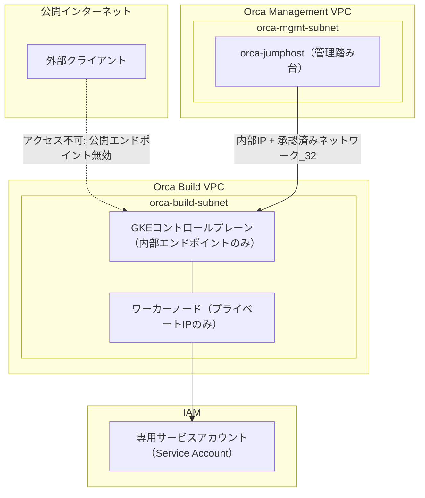
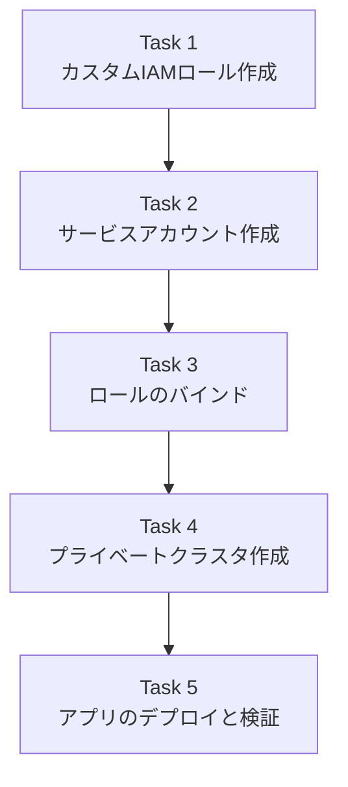
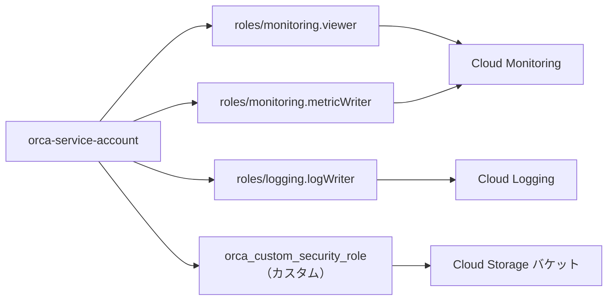
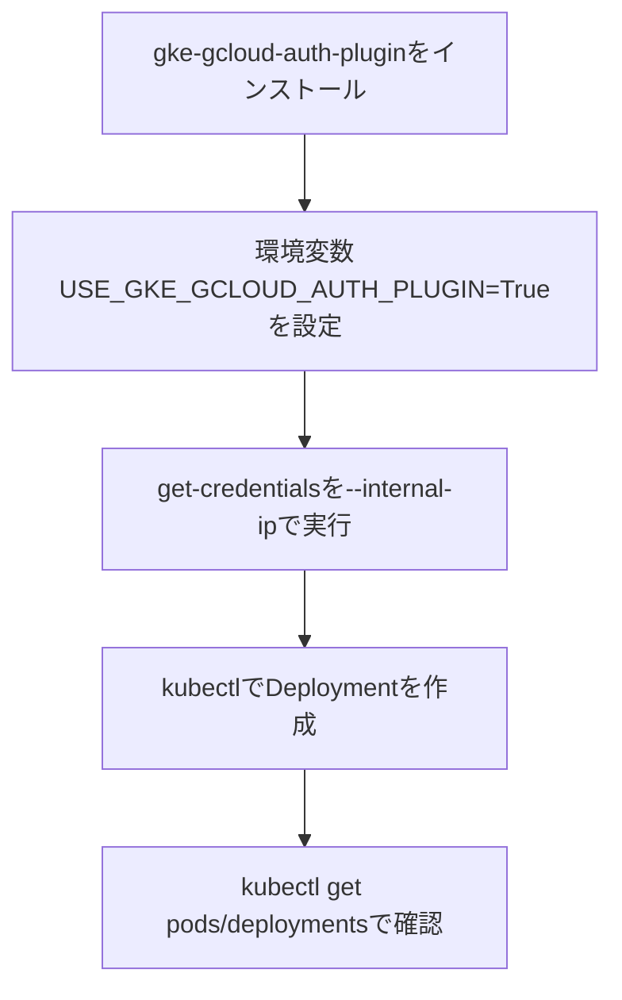

# GKE プライベートクラスタ セキュリティ実装ガイド
## 「Implement Cloud Security Fundamentals on Google Cloud」チャレンジラボ 解説

> 対象読者：GCP初学者〜中級者　/　解説：クラウドセキュリティ・GKE専門家視点

---

## 1. このラボで何をするのか（全体像）

Jooli Inc. の Orca チームの一員として、開発チームが使う **GKE プライベートクラスタ** を、組織のセキュリティ基準に沿って構築します。要求されているセキュリティ基準は、次の3本柱に整理できます。

| 基準 | 内容 | 目的 |
|---|---|---|
| 最小権限の専用サービスアカウント | Compute Engine のデフォルトSAを使わず、専用SAに必要最小限のロールのみ付与 | ノードやワークロードの侵害時の被害範囲を限定する |
| プライベートクラスタ + 限定公開エンドポイント | パブリックエンドポイントを無効化し、承認済みネットワークのみアクセス許可 | コントロールプレーンへの外部からの攻撃面をゼロにする |
| 踏み台（jumphost）経由の限定アクセス | 管理サブネットの `orca-jumphost` からのみ内部IPで接続 | 管理アクセス経路を1点に集約し監査しやすくする |

これは Google 自身が GKE のセキュリティ強化ガイドで推奨している構成そのものです。<br>
参考: [Hardening your cluster's security](https://cloud.google.com/kubernetes-engine/docs/how-to/hardening-your-cluster#use_least_privilege_sa)

### 全体アーキテクチャ



**ポイント**: パブリックエンドポイントへの経路は物理的に無効化されているため、`orca-jumphost` を経由した内部IP通信だけが唯一の管理経路になります。

参考: [Customize your network isolation in GKE](https://cloud.google.com/kubernetes-engine/docs/how-to/advanced-private-cluster-config)

### タスクの実行順序

タスクには依存関係があるため、以下の順序で進める必要があります（逆順で進めると「サービスアカウントが存在しない」「ロールが存在しない」等のエラーになります）。



---

## 2. Task 1: カスタムセキュリティロールの作成

### ベストプラクティスの根拠

開発チームが要求しているのは「Cloud Storage バケット・オブジェクトの作成・更新権限」です。ここで `roles/storage.objectAdmin` のような既存の広い事前定義ロールを安易に使うのは避けるべきです。IAMのベストプラクティスは常に「必要な権限だけを持つカスタムロールを作る」ことを推奨しています。

参考: [Creating and managing custom roles](https://cloud.google.com/iam/docs/creating-custom-roles)

今回付与すべき権限は次の5つのみです。

| 権限 | 用途 |
|---|---|
| `storage.buckets.get` | バケットのメタデータ取得 |
| `storage.objects.get` | オブジェクトの取得（ダウンロード） |
| `storage.objects.list` | オブジェクト一覧の取得 |
| `storage.objects.update` | オブジェクトのメタデータ更新 |
| `storage.objects.create` | オブジェクトの新規作成（アップロード） |

### 手順（gcloud CLI）

```bash
gcloud iam roles create orca_custom_security_role \
  --project=<PROJECT_ID> \
  --title="Custom Security Role" \
  --description="Orca dev team storage object read/write permissions" \
  --permissions=storage.buckets.get,storage.objects.get,storage.objects.list,storage.objects.update,storage.objects.create \
  --stage=GA
```

**初学者向け補足**
- `--stage=GA` は「本番運用可能な状態」を意味するフラグです。指定しないと `ALPHA` 扱いになり、一部のツールで警告が出ることがあります。
- ロールID（`orca_custom_security_role`）にはハイフンではなくアンダースコアまたは英数字を使う必要があります（gcloudの制約）。
- タイトルは課題要件どおり `Custom Security Role` に設定します（採点システムがタイトルを確認するため）。

参考: [gcloud iam roles create リファレンス](https://cloud.google.com/sdk/gcloud/reference/iam/roles/create)

---

## 3. Task 2: サービスアカウントの作成

### ベストプラクティスの根拠

GKEのデフォルト設定では、ノードは Compute Engine のデフォルトサービスアカウントを使用しますが、これはプロジェクト全体に対して広範な権限を持つため、ノードが侵害された場合のリスクが大きくなります。Google公式のクラスタ強化ガイドでは「ワークロードが必要とする最小限の権限セットを持つ、新しいカスタムサービスアカウントを作成する」ことを明確に推奨しています。

参考: [GKEノードのサービスアカウント構成](https://cloud.google.com/kubernetes-engine/security/configure-node-service-accounts)

### 手順（gcloud CLI）

```bash
gcloud iam service-accounts create orca-service-account \
  --project=<PROJECT_ID> \
  --display-name="Service Account"
```

**初学者向け補足**
- `--display-name` は課題要件どおり `Service Account` にします（採点で表示名を確認するため）。
- 作成後のメールアドレスは `orca-service-account@<PROJECT_ID>.iam.gserviceaccount.com` の形式になります。以降の手順で頻繁に使うので控えておきましょう。
- 「orca-」プレフィックスは課題の指示（すべての新規オブジェクトに付与）に従ったものです。

参考: [Create service accounts（IAM）](https://cloud.google.com/iam/docs/service-accounts-create) / [gcloud iam service-accounts create リファレンス](https://cloud.google.com/sdk/gcloud/reference/iam/service-accounts/create)

---

## 4. Task 3: ロールのバインド

### なぜこの3つの組み込みロールなのか

GKEクラスタのサービスアカウントが最低限必要とする権限は、Googleの「Harden your cluster's security」ガイドの **Use least privilege Google service accounts** セクションで明示されています。

| 組み込みロール | 役割 |
|---|---|
| `roles/monitoring.viewer` | Cloud Monitoring のメトリクス閲覧 |
| `roles/monitoring.metricWriter` | ノード/ワークロードのメトリクス書き込み |
| `roles/logging.logWriter` | Cloud Logging へのログ書き込み |

参考: [Hardening your cluster's security — least privilege SA](https://cloud.google.com/kubernetes-engine/docs/how-to/hardening-your-cluster#use_least_privilege_sa) / [Cloud Logging アクセス制御](https://cloud.google.com/logging/docs/access-control) / [Cloud Monitoring アクセス制御](https://cloud.google.com/monitoring/access-control)

これに加えて、Task 1で作成したカスタムロール（Cloud Storage 権限）も同じサービスアカウントにバインドします。

### バインド後の権限構成



### 手順（gcloud CLI）

```bash
SA_EMAIL="orca-service-account@<PROJECT_ID>.iam.gserviceaccount.com"

gcloud projects add-iam-policy-binding <PROJECT_ID> \
  --member="serviceAccount:${SA_EMAIL}" \
  --role="roles/monitoring.viewer"

gcloud projects add-iam-policy-binding <PROJECT_ID> \
  --member="serviceAccount:${SA_EMAIL}" \
  --role="roles/monitoring.metricWriter"

gcloud projects add-iam-policy-binding <PROJECT_ID> \
  --member="serviceAccount:${SA_EMAIL}" \
  --role="roles/logging.logWriter"

gcloud projects add-iam-policy-binding <PROJECT_ID> \
  --member="serviceAccount:${SA_EMAIL}" \
  --role="projects/<PROJECT_ID>/roles/orca_custom_security_role"
```

**初学者向け補足**
- カスタムロールをバインドする際、`--role` に指定するのは `roles/xxx` ではなく `projects/<PROJECT_ID>/roles/<ROLE_ID>` という完全パスになる点に注意してください（組織レベルで作成した場合は `organizations/<ORG_ID>/roles/<ROLE_ID>`）。
- IAMの反映には数十秒〜数分のタイムラグがあることがあります。次のタスクに進む前に `gcloud projects get-iam-policy <PROJECT_ID> --flatten="bindings[].members" --filter="bindings.members:${SA_EMAIL}"` で確認すると安心です。

参考: [GKE の IAM 許可ポリシーと事前定義ロール](https://cloud.google.com/kubernetes-engine/docs/how-to/iam)

---

## 5. Task 4: プライベートクラスタの作成と設定

### プライベートクラスタの各オプションの意味

| フラグ | 意味 | このラボでの要件 |
|---|---|---|
| `--enable-private-nodes` | ノードに外部IPを付与しない | 必須 |
| `--enable-ip-alias` | VPCネイティブ（エイリアスIP）クラスタにする | 必須 |
| `--enable-master-authorized-networks` | コントロールプレーンへのアクセス元を許可リストで制御 | 必須 |
| `--enable-private-endpoint` | コントロールプレーンの管理エンドポイントを内部IPのみにする（パブリックエンドポイント無効） | 必須（最も厳格な設定） |

`--enable-private-endpoint` を指定すると、同一VPC内（またはピアリング/VPN経由）からしか管理エンドポイントに到達できなくなります。これが今回 `orca-jumphost` という踏み台が必要な理由です。

参考: [Creating a private cluster](https://cloud.google.com/kubernetes-engine/docs/how-to/legacy/network-isolation) / [Customize your network isolation in GKE](https://cloud.google.com/kubernetes-engine/docs/how-to/advanced-private-cluster-config)

### 手順①：クラスタの作成

```bash
gcloud container clusters create orca-cluster-name \
  --project=<PROJECT_ID> \
  --region=<REGION> \
  --zone=<ZONE> \
  --network=orca-build-vpc \
  --subnetwork=orca-build-subnet \
  --service-account="orca-service-account@<PROJECT_ID>.iam.gserviceaccount.com" \
  --enable-private-nodes \
  --enable-private-endpoint \
  --enable-ip-alias \
  --enable-master-authorized-networks \
  --master-authorized-networks=<TEMPORARY_CIDR_OR_OWN_IP>/32
```

**初学者向け補足**
- `--master-authorized-networks` は作成時に最低1つのCIDRを要求されることが多いため、暫定的に自分の作業端末のIPなどを入れておき、後述の手順②で `orca-jumphost` の内部IPに更新（追加）します。
- クラスタ名は課題要件どおり `orca-` プレフィックスを付けて命名します（例: `orca-cluster-name` は実際のラボでは指定されたクラスタ名に置き換えてください）。
- `--region` と `--zone` は課題ページで指定された **Region** / **Zone** をそのまま使用します（ゾーナルクラスタにする場合は `--zone` のみ、リージョナルにする場合は `--region` のみを使うのが一般的です。両方指定できるコマンドもありますが、混乱を避けるため、ラボの要件に合わせてどちらか一方を使ってください）。

### 手順②：jumphostの内部IPを承認済みネットワークに追加

```bash
JUMP_IP=$(gcloud compute instances describe orca-jumphost \
  --zone=<ZONE> \
  --format='get(networkInterfaces[0].networkIP)')

gcloud container clusters update orca-cluster-name \
  --region=<REGION> \
  --enable-master-authorized-networks \
  --master-authorized-networks="${JUMP_IP}/32"
```

**なぜ `/32` なのか**：`/32` は「このIPアドレス1つのみ」を意味するサブネットマスクです。ここを広い範囲（例: `/24`）にしてしまうと、同じサブネット内の他のインスタンスからも管理エンドポイントにアクセスできてしまい、最小権限・最小露出の原則に反します。踏み台1台だけに絞り込むのがベストプラクティスです。

参考: [Creating a private cluster — authorized networks の更新例](https://cloud.google.com/kubernetes-engine/docs/how-to/legacy/network-isolation)

---

## 6. Task 5: アプリケーションのデプロイと動作検証

### 踏み台からの接続の考え方

`--enable-private-endpoint` を有効化したクラスタには、VPC外部は一切到達できません。そのため、同じ Orca Build VPC 内（またはVPCピアリング経由でその内部IPに到達できる）の `orca-jumphost` から接続する必要があります。

参考: [gke-gcloud-auth-plugin のインストールとクラスタアクセス設定](https://cloud.google.com/kubernetes-engine/docs/how-to/cluster-access-for-kubectl)

### 手順（`orca-jumphost` 上で実行）



```bash
# 1. 認証プラグインをインストール
sudo apt-get install google-cloud-sdk-gke-gcloud-auth-plugin

# 2. 環境変数を永続化
echo "export USE_GKE_GCLOUD_AUTH_PLUGIN=True" >> ~/.bashrc
source ~/.bashrc

# 3. 内部IP経由でクレデンシャルを取得（--internal-ipが必須）
gcloud container clusters get-credentials orca-cluster-name \
  --internal-ip \
  --project=<PROJECT_ID> \
  --zone=<ZONE>

# 4. 動作確認用の簡易アプリをデプロイ
kubectl create deployment hello-server --image=gcr.io/google-samples/hello-app:1.0

# 5. デプロイの状態を確認
kubectl get deployments
kubectl get pods
```

**初学者向け補足**
- 2019年以降、GKEはkubectlの認証にOSS標準の機構ではなく `gke-gcloud-auth-plugin` を要求するようになりました。これをインストールしないと `get-credentials` は成功してもkubectlコマンド実行時に認証エラーになります。
- `--internal-ip` フラグを付け忘れると、コマンドはパブリックエンドポイントのIPでkubeconfigを生成しようとしますが、今回のクラスタにはパブリックエンドポイントが存在しないため接続に失敗します。
- 動作確認だけであれば `kubectl get deployments` / `kubectl get pods` でPodがRunning状態になっていることを確認すれば十分です（課題は「management access が機能していること」の検証が目的のため、LoadBalancer Serviceの公開は必須ではありません）。

参考: [Install kubectl and configure cluster access](https://cloud.google.com/kubernetes-engine/docs/how-to/cluster-access-for-kubectl) / [Kubectl auth changes in GKE](https://cloud.google.com/blog/products/containers-kubernetes/kubectl-auth-changes-in-gke)

---

## 7. よくあるつまずきポイント

| 症状 | 原因 | 対処 |
|---|---|---|
| `get-credentials` は成功するが `kubectl get pods` が `exec: gke-gcloud-auth-plugin not found` で失敗する | 認証プラグイン未インストール、または環境変数未反映 | `gcloud components install gke-gcloud-auth-plugin` 実行後、ターミナルを開き直すか `source ~/.bashrc` |
| `kubectl` がタイムアウトする | `--internal-ip` を付けずに `get-credentials` を実行し、パブリックエンドポイント宛にkubeconfigが作られた | kubeconfigを再取得（`--internal-ip` 付き）、または既存contextを削除して再実行 |
| クラスタ作成時に「service account does not have permission」等のエラー | Task 3のIAMバインドがまだ反映されていない、またはロールのバインド先を間違えた（プロジェクトではなくSA自体に対してroleを付与してしまった等） | `add-iam-policy-binding` は**プロジェクト**に対して実行し、`--member` にSAを指定するのが正しい形。数分待って再試行 |
| カスタムロールのバインドで `role not found` | `--role` にカスタムロールの完全パス（`projects/.../roles/...`）ではなく短縮名を指定した | `projects/<PROJECT_ID>/roles/<ROLE_ID>` の形式で指定し直す |
| `orca-jumphost` からクラスタに到達できない | jumphostのIPが承認済みネットワークに未登録、またはCIDRの誤り（`/32`以外を指定） | `gcloud container clusters describe` の `masterAuthorizedNetworksConfig` を確認し、正しい内部IP＋`/32`で再設定 |

---

## 8. まとめ

このチャレンジラボは、GKEにおける「多層防御」の実践演習です。

1. **IAM層**：カスタムロール＋最小権限の組み込みロールで構成した専用サービスアカウント
2. **ネットワーク層**：プライベートノード＋限定公開エンドポイント＋承認済みネットワーク(/32)
3. **アクセス経路の一元化**：踏み台（`orca-jumphost`）を唯一の管理経路とする

この3層構成は、Google自身がGKEクラスタ強化のベストプラクティスとして案内している内容と一致しており、実務のプロダクション環境構築でもそのまま応用できる考え方です。

---

## 参考文献（根拠ソース）

| No. | タイトル | URL |
|---|---|---|
| 1 | Hardening your cluster's security（最小権限サービスアカウントの節） | https://cloud.google.com/kubernetes-engine/docs/how-to/hardening-your-cluster#use_least_privilege_sa |
| 2 | Configure GKE node service accounts | https://cloud.google.com/kubernetes-engine/security/configure-node-service-accounts |
| 3 | Create service accounts（IAM） | https://cloud.google.com/iam/docs/service-accounts-create |
| 4 | gcloud iam service-accounts create リファレンス | https://cloud.google.com/sdk/gcloud/reference/iam/service-accounts/create |
| 5 | Create and manage custom roles（IAM） | https://cloud.google.com/iam/docs/creating-custom-roles |
| 6 | gcloud iam roles create リファレンス | https://cloud.google.com/sdk/gcloud/reference/iam/roles/create |
| 7 | Create IAM allow policies（GKE の事前定義ロール） | https://cloud.google.com/kubernetes-engine/docs/how-to/iam |
| 8 | Access control with IAM（Cloud Logging） | https://cloud.google.com/logging/docs/access-control |
| 9 | Control access with IAM（Cloud Monitoring） | https://cloud.google.com/monitoring/access-control |
| 10 | Creating a private cluster | https://cloud.google.com/kubernetes-engine/docs/how-to/legacy/network-isolation |
| 11 | Customize your network isolation in GKE（承認済みネットワーク/限定公開エンドポイント） | https://cloud.google.com/kubernetes-engine/docs/how-to/advanced-private-cluster-config |
| 12 | Install kubectl and configure cluster access（gke-gcloud-auth-plugin） | https://cloud.google.com/kubernetes-engine/docs/how-to/cluster-access-for-kubectl |
| 13 | Kubectl auth changes in GKE（gke-gcloud-auth-pluginの背景） | https://cloud.google.com/blog/products/containers-kubernetes/kubectl-auth-changes-in-gke |
| 14 | Implement Cloud Security Fundamentals on Google Cloud: Challenge Lab（ラボ本体） | https://www.skills.google/focuses/14572 |
