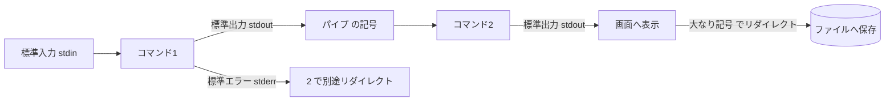
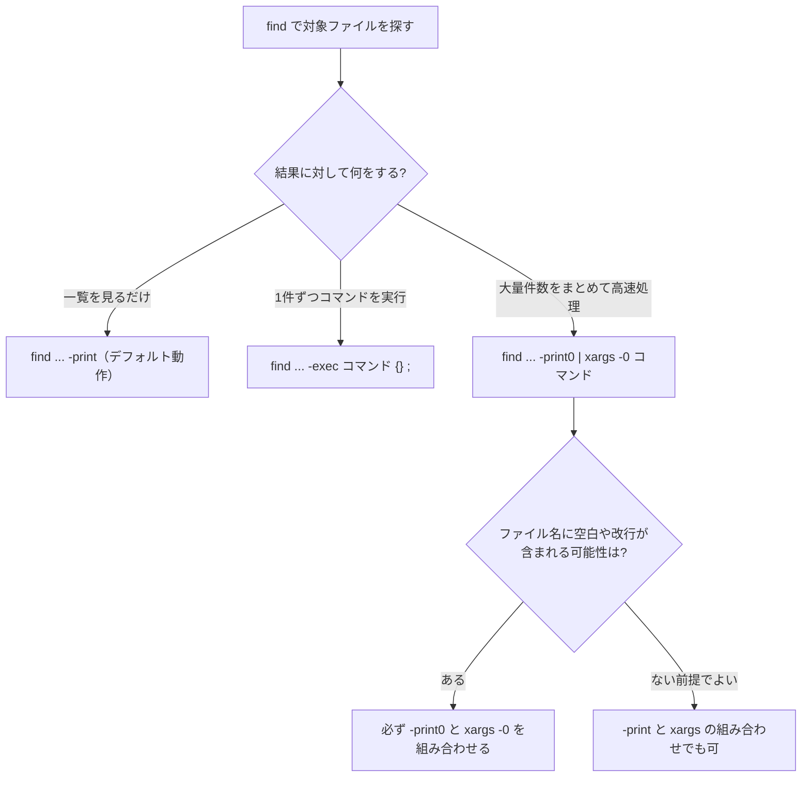
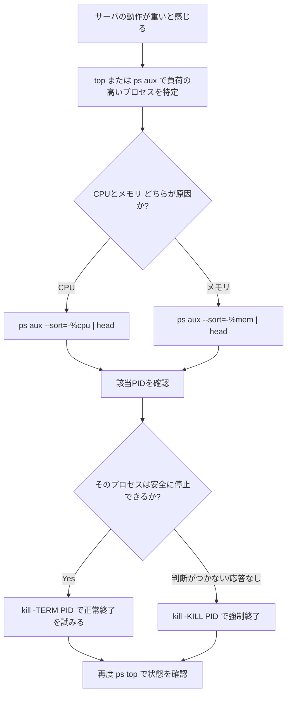
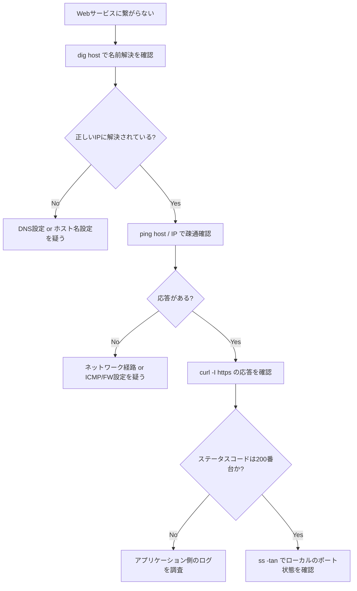
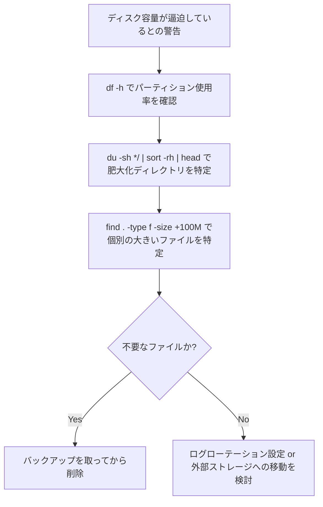
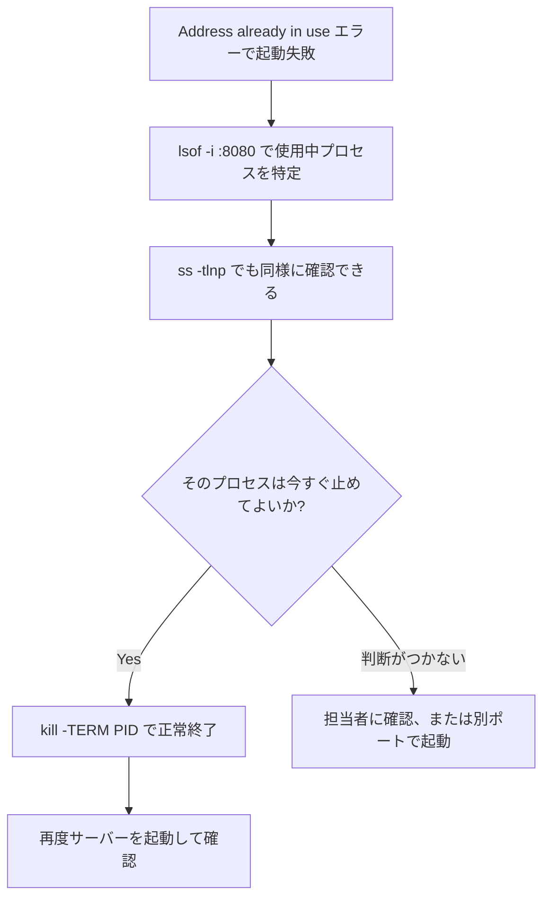

# CLIコマンド実践ワンライナー集 — 初学者のためのステップバイステップガイド

> 日常の開発・運用・トラブルシューティングで「知っていると10倍速くなる」CLIワンライナーを、仕組みの理解から実践シナリオまで段階的に解説します。

## 対象読者と使い方

- **対象読者**：ターミナル操作の基本（`cd` や `ls` など）は分かるが、パイプやリダイレクトを組み合わせた実践的なワンライナーにまだ慣れていない方
- **前提環境**：Linux / macOS の bash または zsh（Windowsの場合は WSL2 を推奨。※macOSでは `ss` の代わりに `lsof`/`netstat`、`free` の代わりに `vm_stat` / `top`、`sed -i` の代わりに `sed -i ''` や `sed -i.bak` を使用）
- **読み方**：各章は「①何のためのコマンドか → ②基本構文 → ③実践ワンライナー表 → ④注意点」の順に統一しています。手を動かしながら読むことを推奨します

## 目次

1. [基礎知識：ワンライナーを支える仕組み](#1-基礎知識ワンライナーを支える仕組み)
2. [ファイル探索：find / xargs](#2-ファイル探索find--xargs)
3. [テキスト検索：grep](#3-テキスト検索grep)
4. [テキスト変換：sed](#4-テキスト変換sed)
5. [テキスト集計：awk / sort / uniq / cut / wc](#5-テキスト集計awk--sort--uniq--cut--wc)
6. [プロセス管理：ps / top / kill / lsof](#6-プロセス管理ps--top--kill--lsof)
7. [ネットワーク診断：curl / ss / dig / ping](#7-ネットワーク診断curl--ss--dig--ping)
8. [ディスク・システム情報：df / du / free](#8-ディスクシステム情報df--du--free)
9. [Git実践ワンライナー](#9-git実践ワンライナー)
10. [Docker実践ワンライナー](#10-docker実践ワンライナー)
11. [ログ調査：journalctl / tail](#11-ログ調査journalctl--tail)
12. [組み合わせ実践シナリオ](#12-組み合わせ実践シナリオ)
13. [安全に使うためのベストプラクティス](#13-安全に使うためのベストプラクティス)
14. [クイックリファレンス表](#14-クイックリファレンス表)
15. [参考文献・信頼できる情報源](#15-参考文献信頼できる情報源)

---

## 1. 基礎知識：ワンライナーを支える仕組み

ワンライナーは魔法ではなく、「小さな仕事をする複数のコマンド」を**パイプ**でつなぎ合わせたものです。仕組みを理解すれば、暗記に頼らず自分でワンライナーを組み立てられるようになります。

### 1.1 標準入出力とパイプ・リダイレクト

すべてのコマンドは次の3つのデータの通り道（ストリーム）を持ちます。

| ストリーム | 略称 | 番号 | 役割 |
|---|---|---|---|
| 標準入力 | stdin | 0 | コマンドへの入力 |
| 標準出力 | stdout | 1 | 正常な結果の出力先 |
| 標準エラー出力 | stderr | 2 | エラーメッセージの出力先 |

これらを操作する記号は以下の通りです。

| 記号 | 意味 | 例 |
|---|---|---|
| `\|` | 左のコマンドの標準出力を右のコマンドの標準入力へ渡す（パイプ） | `ps aux \| grep nginx` |
| `>` | 標準出力をファイルへ上書き | `echo hello > out.txt` |
| `>>` | 標準出力をファイルへ追記 | `echo hello >> out.txt` |
| `2>` | 標準エラーのみリダイレクト | `command 2> error.log` |
| `&>` または `2>&1` | 標準出力と標準エラーの両方をまとめる | `command > all.log 2>&1` |
| `<` | ファイルの内容を標準入力として渡す | `sort < data.txt` |



### 1.2 コマンド置換とxargsの連携

`$(コマンド)` は「コマンドの実行結果を文字列として埋め込む」構文です。一方 `xargs` は「パイプで受け取った一覧を、後続コマンドの**引数**として渡す」ためのブリッジ役です。この違いを理解すると、`find` や `grep` の結果を他のコマンドに渡す際に迷わなくなります。

```bash
# コマンド置換：結果を1つの文字列として埋め込む
kill $(pgrep -f my_app)

# xargs：一覧（複数行）を引数化して繰り返し実行
find . -name "*.log" | xargs rm
```

### 1.3 安全に試すための心得

- 破壊的な操作（削除・上書き）の前に、まず**確認だけのコマンド**（`-print` や `echo`）で対象を確認する
- 初めて使うワンライナーは、影響範囲の小さいディレクトリで試してから本番に適用する
- `xargs` には `-p`（実行前に確認プロンプトを出す）オプションがあり、学習中はこれを使うと安心
- 迷ったら `man コマンド名` または `コマンド名 --help` で公式の説明を確認する

---

## 2. ファイル探索：find / xargs

`find` はディレクトリツリーを条件付きで探索するコマンド、`xargs` はその結果を後続コマンドに渡すコマンドです（出典: GNU Findutils マニュアル）。

### 2.1 基本構文

```bash
find [検索開始パス] [条件] [アクション]
```

### 2.2 実践ワンライナー表

| 目的 | ワンライナー | 解説 |
|---|---|---|
| 直近60分以内に更新されたファイルを探す | `find . -mmin -60 -type f` | `-mmin -60` は「60分以内に更新」を意味する |
| 7日以上前の `.log` ファイルを確認する | `find /var/log -name "*.log" -mtime +7` | `-mtime +7` は「更新から7日以上経過」。まずは確認のみで削除しない |
| 空のディレクトリを一括削除する | `find . -type d -empty -delete` | `-delete` は該当した空ディレクトリのみ削除 |
| 拡張子ごとのファイル数を集計する | `find . -type f \| sed 's/.*\./ /'` `\| sort \| uniq -c \| sort -rn` | `find` の結果を `sed` で拡張子だけ取り出し、集計するパイプライン |
| 特定文字列を含むファイル一覧を安全に取得する | `find . -name "*.js" -print0 \| xargs -0 grep -l "TODO"` | `-print0` と `xargs -0` の組み合わせでファイル名の空白・改行に対応 |
| パーミッションが777のファイルを検出する | `find . -type f -perm 0777` | 権限が緩すぎるファイルの棚卸しに使う |
| 一時ファイルを確認しながら削除する | `find . -name "*.tmp" -print0 \| xargs -0 -n 1 -p rm` | `-p` で1件ずつ実行確認が出るため学習中も安全 |

### 2.3 意思決定フロー



### 2.4 注意点

- ファイル名にスペースや改行が含まれる可能性がある環境（特に共有サーバー）では、必ず `-print0` / `xargs -0` を使う
- `-delete` や `-exec rm` を使う前に、同じ条件で `-print` して対象件数と内容を必ず目視確認する

---

## 3. テキスト検索：grep

`grep` はパターンマッチによりテキストの中から一致する行を検索するコマンドです（出典: GNU Grep マニュアル）。

### 3.1 基本構文

```bash
grep [オプション] "検索パターン" [対象ファイル]
```

### 3.2 実践ワンライナー表

| 目的 | ワンライナー | 解説 |
|---|---|---|
| ディレクトリ配下を再帰的に検索し行番号も表示 | `grep -rn "ERROR" ./logs` | `-r` 再帰検索、`-n` 行番号表示 |
| 大文字・小文字を区別せず検索 | `grep -i "warning" app.log` | `-i` で大文字小文字を無視 |
| 特定行を除外して残りを表示（ノイズ除去） | `grep -v "^#" config.conf` | `-v` は一致しない行を出力（コメント行の除外に便利） |
| 複数パターンをOR条件で検索 | `grep -E "ERROR|FATAL" app.log` | `-E` は拡張正規表現を有効化し `|` でOR条件を表現 |
| 一致した件数だけを知りたい | `grep -c "ERROR" app.log` | 出力ではなく件数のみをカウントして返す |
| 特定拡張子のファイルに絞って検索 | `grep -rn --include="*.py" "import os" .` | `--include` でファイルパターンを絞り込む |
| バイナリファイルを除外して検索 | `grep -rI "password" .` | `-I` はバイナリファイルを検索対象から自動除外 |

### 3.3 注意点

- 正規表現の特殊文字（`.` `*` `[` `]` など）を含む文字列を検索する場合は `grep -F` で「固定文字列検索」にすると誤動作を防げる
- 大量ログを検索する際は `grep` を1回で完結させ、無駄なパイプを増やさない方が高速

---

## 4. テキスト変換：sed

`sed`（stream editor）はテキストをストリームとして1行ずつ処理し、置換・削除・抽出を行うコマンドです（出典: GNU sed マニュアル）。

### 4.1 基本構文

```bash
sed 's/検索文字列/置換文字列/フラグ' ファイル
```

### 4.2 実践ワンライナー表

| 目的 | ワンライナー | 解説 |
|---|---|---|
| 各行の最初の一致だけ置換する | `sed 's/foo/bar/' file.txt` | フラグなしは各行1回目の一致のみ置換 |
| 行内のすべての一致を置換する | `sed 's/foo/bar/g' file.txt` | `g` フラグで行内の全一致を置換 |
| ファイルを直接書き換える（バックアップ付き） | `sed -i.bak 's/foo/bar/g' file.txt` | `-i.bak` で `file.txt.bak` を残しつつ元ファイルを書き換え |
| 空行だけを削除する | `sed '/^$/d' file.txt` | `d` コマンドで一致した行を削除 |
| 特定範囲の行だけを抽出する | `sed -n '10,20p' file.txt` | `-n` で自動出力を抑止し、`p` で指定範囲のみ出力 |
| 複数ファイルをまとめて一括置換する | `find . -name "*.txt" -print0 \| xargs -0 sed -i 's/old/new/g'` | `find` と組み合わせて多数のファイルに一括適用 |

### 4.3 注意点

- macOS標準の `sed`（BSD版）と Linux の GNU sed はオプションの挙動が異なる（特に `-i` の後にバックアップ拡張子が必須か否か）。移植性が必要なスクリプトでは注意する
- `-i` で直接上書きする前に、バックアップオプション（`-i.bak` など）を使うか、対象ファイルをコピーしてから試す

---

## 5. テキスト集計：awk / sort / uniq / cut / wc

`awk` はフィールド（列）ベースでテキストを処理するプログラミング言語であり、集計・レポート作成に強みがあります（出典: GNU Awk User's Guide）。`sort`・`uniq`・`cut`・`wc` は GNU Coreutils に含まれる定番の集計系コマンドです（出典: GNU Coreutils マニュアル）。

### 5.1 基本構文

```bash
awk -F'区切り文字' '条件 {処理}' ファイル
```

### 5.2 実践ワンライナー表

| 目的 | ワンライナー | 解説 |
|---|---|---|
| CSVの特定列だけを抽出する | `awk -F',' '{print $2}' data.csv` | `-F','` でカンマ区切りを指定し、2列目を出力 |
| 条件に合う行だけ抽出する | `awk -F',' '$3>100 {print}' data.csv` | 3列目の値が100より大きい行だけ出力 |
| ある列の合計を計算する | `awk -F',' '{sum+=$3} END {print sum}' data.csv` | `END` ブロックで全行処理後の合計を出力 |
| 重複行を除去して出現回数を集計する | `sort file.txt \| uniq -c \| sort -rn` | `sort`→`uniq -c`→`sort -rn` の定番3段パイプライン |
| 行数・単語数・バイト数を数える | `wc -l file.txt` | `-l` は行数のみカウント（単語数は `-w`、バイト数は `-c`） |
| タブ区切りファイルの特定列を抜き出す | `cut -f2 data.tsv` | `-f2` で2列目のみ抽出（区切り文字省略時はタブ） |
| アクセスログのIP別アクセス数トップ10 | `awk '{print $1}' access.log \| sort \| uniq -c \| sort -rn \| head -10` | ログ集計の代表的な組み合わせ |

### 5.3 ログ集計パイプラインの流れ


### 5.4 注意点

- `sort | uniq -c` の順序は重要。`uniq` は**隣接する行**しか重複と見なさないため、必ず先に `sort` する
- `awk` のフィールド番号は1始まり（`$1` が1列目）。`$0` は行全体を表す

---

## 6. プロセス管理：ps / top / kill / lsof

サーバーの動作が重い、特定プロセスが応答しないといった状況でまず頼るのがこの章のコマンド群です。

### 6.1 実践ワンライナー表

| 目的 | ワンライナー | 解説 |
|---|---|---|
| CPU使用率トップ10のプロセスを表示 | `ps aux --sort=-%cpu \| head -n 11` | ヘッダー行込みで11行取得（実質トップ10） |
| メモリ使用率トップ10のプロセスを表示 | `ps aux --sort=-%mem \| head -n 11` | メモリ逼迫時の原因調査に使う |
| プロセス名からPIDを特定する | `pgrep -fl node` | `-f` はコマンドライン全体を対象、`-l` でプロセス名も表示 |
| プロセスを正常終了させる | `kill -TERM $(pgrep -f my_app)` | まずは正常終了シグナル（`SIGTERM`）を送るのが基本 |
| 応答しないプロセスを強制終了する | `kill -KILL $(pgrep -f my_app)` | `SIGTERM` で終了しない場合の最終手段（`kill -9` と同義） |
| 特定ポートを使用中のプロセスを特定する | `lsof -i :8080` | 「Address already in use」エラーの原因調査に必須 |
| 特定ファイルを開いているプロセスを特定する | `lsof /var/log/syslog` | ファイルが削除できない・ロックされている際の調査に使う |
| ゾンビプロセスを検出する | `ps aux \| awk '$8=="Z"'` | ステータス列が `Z` のプロセスを抽出 |

### 6.2 トラブルシューティングの意思決定フロー



### 6.3 注意点

- `kill -KILL`（`kill -9`）はプロセスに終了処理（後片付け）をさせずに強制終了するため、データ破損のリスクがある。まず `-TERM` を試す
- 本番環境で他人のプロセスを `kill` する前に、そのプロセスが何であるか（`ps -p PID -o cmd=` などで）必ず確認する

---

## 7. ネットワーク診断：curl / ss / dig / ping

「サービスに繋がらない」というトラブルは、疎通→名前解決→アプリ応答→ローカルのポート状態、の順に切り分けると原因を絞り込みやすくなります。

### 7.1 実践ワンライナー表

| 目的 | ワンライナー | 解説 |
|---|---|---|
| HTTPステータスコードだけ確認する | `curl -o /dev/null -s -w "%{http_code}\n" https://example.com` | ボディを捨て、ステータスコードのみ出力（出典: curl man page） |
| レスポンスヘッダのみ取得する | `curl -I https://example.com` | HEADリクエストでヘッダのみ取得 |
| 応答時間を計測する | `curl -o /dev/null -s -w "%{time_total}\n" https://example.com` | サーバーの応答遅延の切り分けに使う |
| 待ち受け中のTCPポート一覧を表示する | `ss -tlnp` | `-t` TCP, `-l` 待受のみ, `-n` 名前解決なし, `-p` プロセス情報付き（出典: ss man page） |
| 確立済みのTCP接続一覧を表示する | `ss -tan state established` | 現在アクティブな通信を確認 |
| DNSのAレコードを確認する | `dig example.com +short` | 名前解決の結果だけを簡潔に表示 |
| 疎通確認を4回だけ行う | `ping -c 4 example.com` | `-c` で回数を指定し、無限に実行され続けるのを防ぐ |

### 7.2 ネットワーク疎通確認の切り分けフロー



### 7.3 注意点

- `ping` がブロックされているネットワーク（ICMP無効化）もあるため、応答が無い＝必ずしもサービス停止とは限らない
- 本番環境の `curl` 調査では `-s`（サイレント）と `-o /dev/null`（ボディ破棄）を組み合わせ、ログを汚さないようにする

---

## 8. ディスク・システム情報：df / du / free

「ディスクが逼迫している」「メモリが足りない」といった調査の起点になるコマンド群です。

### 8.1 実践ワンライナー表

| 目的 | ワンライナー | 解説 |
|---|---|---|
| パーティションごとの使用率を確認する | `df -h` | `-h` で人間が読みやすい単位（GB/MBなど）表示（出典: GNU Coreutils マニュアル） |
| inode使用率を確認する | `df -i` | 「容量はあるのにファイルが作れない」場合の原因調査 |
| カレントディレクトリ内で容量の大きいディレクトリTOP10 | `du -sh */ \| sort -rh \| head -10` | `du -sh` で各ディレクトリの合計サイズを表示し降順ソート |
| 100MBを超えるファイルを検出する | `find . -type f -size +100M -exec ls -lh {} \;` | 容量を圧迫している個別ファイルの特定に使う |
| メモリの空き容量を確認する | `free -h` | `-h` で人間が読みやすい単位表示 |

### 8.2 注意点

- `du` は集計に時間がかかることがあるため、対象を絞り込んでから実行する（例：`du -sh /var/log/*`）
- ディスク逼迫は「容量」だけでなく「inode枯渇」でも発生するため、`df -h` で容量に余裕があっても `df -i` を確認する習慣をつける

---

## 9. Git実践ワンライナー

Gitはバージョン管理システムの事実上の標準です（出典: Git公式ドキュメント / git-scm.com）。

### 9.1 実践ワンライナー表

| 目的 | ワンライナー | 解説 |
|---|---|---|
| コミット履歴を1行・グラフ付きで見やすく表示 | `git log --oneline --graph --decorate --all` | ブランチの分岐・マージが視覚的に把握できる |
| 変更されたファイル名だけを表示する | `git diff --name-only` | レビュー前の変更範囲確認に便利 |
| マージ済みのローカルブランチを一括削除する | `git branch --merged \| grep -v "\*\|main\|master" \| xargs -n 1 git branch -d` | `main`/`master`・現在ブランチを除外して安全に削除 |
| 特定ファイルの変更履歴を追う | `git log -p -- path/to/file` | ファイル単位で過去の差分をすべて追跡できる |
| 直前のコミットメッセージだけを修正する | `git commit --amend -m "new message"` | まだ push していないコミットの言い直しに使う |
| 期間内のコミット数を著者別に集計する | `git log --since="1 week ago" --pretty=format:"%an" \| sort \| uniq -c \| sort -rn` | チームの活動量の可視化に使える |
| ステージ済みの差分だけを確認する | `git diff --cached` | `git add` した内容がコミット前に意図通りか確認 |

### 9.2 注意点

- `git branch -D`（大文字）は未マージの変更も強制削除するため、通常は `-d`（小文字、マージ済みのみ削除可）を使う
- 共有リポジトリで `git commit --amend` や `git rebase` を行った後の `push` には `--force-with-lease` を検討し、他者の変更を上書きしないよう注意する

---

## 10. Docker実践ワンライナー

コンテナ環境の運用でも「一括整理」「状況確認」のワンライナーは頻出です（出典: Docker公式ドキュメント）。

### 10.1 実践ワンライナー表

| 目的 | ワンライナー | 解説 |
|---|---|---|
| 停止中のコンテナを一括削除する | `docker container prune -f` | `-f` で確認プロンプトを省略（内容を理解した上で使う） |
| 未使用のイメージを一括削除する | `docker image prune -a -f` | `-a` はタグ付きでも未使用なら削除対象にする |
| 実行中コンテナのログをリアルタイム表示する | `docker logs -f コンテナ名` | `-f` でログを追従表示 |
| 稼働中コンテナの中にシェルで入る | `docker exec -it コンテナ名 /bin/bash` | `-it` で対話的なシェルセッションを開始 |
| 全コンテナのリソース使用状況をリアルタイム表示する | `docker stats` | CPU・メモリ・ネットワークI/Oを一覧でモニタリング |
| イメージをサイズ順に一覧表示する | `docker images --format "{{.Repository}}:{{.Tag}}\t{{.Size}}" \| sort -k2 -h` | ディスクを圧迫している大きいイメージの特定に使う |

### 10.2 注意点

- `prune` 系コマンドは対象を完全に削除するため、必要なデータ（ボリューム含む）が残っているか事前に `docker ps -a` や `docker volume ls` で確認する
- `-f`（force）オプションは確認プロンプトを飛ばすため、内容を理解してから使う

---

## 11. ログ調査：journalctl / tail

systemd環境のログ管理は `journalctl` が標準です（出典: journalctl man page）。

### 11.1 実践ワンライナー表

| 目的 | ワンライナー | 解説 |
|---|---|---|
| システムログをリアルタイム表示する | `journalctl -f` | `tail -f` のsystemd版 |
| 特定サービスのログを直近1時間分だけ表示する | `journalctl -u nginx.service --since "1 hour ago"` | `-u` でユニット（サービス）名を指定 |
| エラー以上の優先度のログだけを表示する | `journalctl -p err -b` | `-p err` で優先度フィルタ、`-b` は今回起動分のみ |
| ログファイルの末尾をリアルタイム監視する | `tail -f /var/log/syslog` | 古典的だが今でも現役の定番コマンド |
| 複数ログファイルを同時に監視する | `tail -f app1.log app2.log` | 複数プロセスのログを並行して追う場合に便利 |

### 11.2 注意点

- `journalctl` はデフォルトで大量のログを保持するため、対象期間・優先度・ユニットで必ず絞り込んでから読む
- ログにアクセスできない場合は、権限（`sudo` が必要か、`systemd-journal` グループに所属しているか）を確認する

---

## 12. 組み合わせ実践シナリオ

ここまでのコマンドを実際のトラブルシューティングの流れとして組み合わせます。

### シナリオA：ディスク容量が逼迫している



### シナリオB：ポート競合でサーバーが起動できない



### シナリオC：アクセスログから異常を検知する

```bash
# 直近のログから404エラーが多いパスをトップ10で確認する
grep " 404 " access.log | awk '{print $7}' | sort | uniq -c | sort -rn | head -10
```

この1行は「grep（絞り込み）→ awk（列抽出）→ sort（整列）→ uniq -c（集計）→ sort -rn（降順）→ head（上位表示）」という、これまでに学んだパイプラインの組み合わせそのものです。仕組みを理解していれば、初見のワンライナーでも読み解けるようになります。

---

## 13. 安全に使うためのベストプラクティス

| 危険なパターン | リスク | 安全な代替・対策 |
|---|---|---|
| `rm -rf *` | 想定外のディレクトリで実行すると全削除 | 先に `find ... -print` や `ls` で対象を目視確認してから実行する |
| `dd if=... of=/dev/sdX` | 対象デバイスを誤るとデータ完全消失 | `lsblk` や `fdisk -l` で対象デバイスを必ず二重確認する |
| `curl URL \| sh`（未検証スクリプトの直接実行） | 任意コードが無検証で実行される | 一度ファイルに保存し、中身を確認してから実行する |
| `kill -9` を常用する | プロセスの後始末が行われずデータ破損のリスク | まず `kill -TERM` を試し、反応がなければ `-9` を使う |
| `chmod -R 777` | 権限が過剰になりセキュリティリスクが増す | 必要最小限の権限（`755`/`644` など）を個別に付与する |
| `xargs` に確認なしで削除系コマンドを渡す | 想定外の件数を一括削除してしまう | 学習中・初回実行時は `xargs -p` で確認プロンプトを使う |

**共通の心得**：破壊的な操作（削除・上書き・強制終了）を行うワンライナーは、必ず「確認だけ行うバージョン」を先に実行してから、本番の操作に進む習慣をつけましょう。

---

## 14. クイックリファレンス表

| カテゴリ | 主なコマンド | 代表的な用途 |
|---|---|---|
| ファイル探索 | `find`, `xargs` | 条件検索、一括処理 |
| テキスト検索 | `grep` | パターン検索、ログ調査 |
| テキスト変換 | `sed` | 置換、抽出、一括編集 |
| テキスト集計 | `awk`, `sort`, `uniq`, `cut`, `wc` | 集計、レポート作成 |
| プロセス管理 | `ps`, `top`, `kill`, `lsof`, `pgrep` | 負荷調査、プロセス制御 |
| ネットワーク診断 | `curl`, `ss`, `dig`, `ping` | 疎通確認、API検証 |
| ディスク・システム | `df`, `du`, `free` | 容量調査、リソース監視 |
| バージョン管理 | `git` | 履歴管理、ブランチ運用 |
| コンテナ管理 | `docker` | コンテナ・イメージ運用 |
| ログ調査 | `journalctl`, `tail` | リアルタイム監視、障害調査 |

---

## 15. 参考文献・信頼できる情報源

本ガイドの解説・構文は、以下の一次情報源（公式マニュアル・man page）を根拠としています。

| コマンド | 出典 | URL |
|---|---|---|
| grep | GNU Grep Manual (Free Software Foundation) | https://www.gnu.org/software/grep/manual/grep.html |
| sed | GNU sed Manual (Free Software Foundation) | https://www.gnu.org/software/sed/manual/sed.html |
| awk (gawk) | GAWK: Effective AWK Programming (Free Software Foundation) | https://www.gnu.org/software/gawk/manual/ |
| find, xargs | GNU Findutils Manual (Free Software Foundation) | https://www.gnu.org/software/findutils/manual/html_mono/find.html |
| sort, uniq, cut, wc, df, du, free | GNU Coreutils Manual (Free Software Foundation) | https://www.gnu.org/software/coreutils/manual/coreutils.html |
| ps, kill, xargs, lsof | Linux man-pages project | https://man7.org/linux/man-pages/man1/xargs.1.html |
| lsof | Linux man-pages project | https://man7.org/linux/man-pages/man8/lsof.8.html |
| ss | Linux man-pages project (iproute2) | https://man7.org/linux/man-pages/man8/ss.8.html |
| curl | Linux man-pages project | https://man7.org/linux/man-pages/man1/curl.1.html |
| journalctl | Linux man-pages project (systemd) | https://man7.org/linux/man-pages/man1/journalctl.1.html |
| git | Git公式ドキュメント | https://git-scm.com/docs |
| docker | Docker公式ドキュメント | https://docs.docker.com/reference/cli/docker/ |

> これらのURLは執筆時点（2026年7月）で確認済みですが、各プロジェクトのバージョンアップに伴いドキュメント構成が変わることがあります。最新情報は必ず公式サイトでご確認ください。
